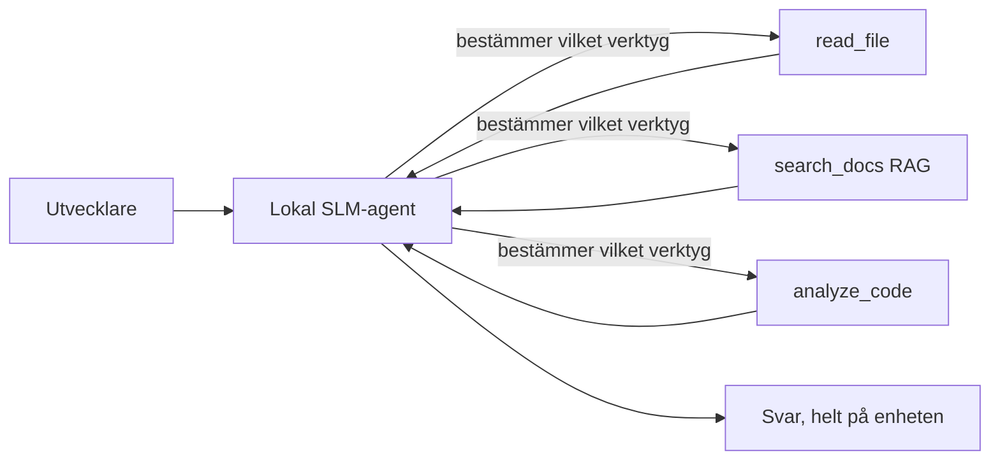
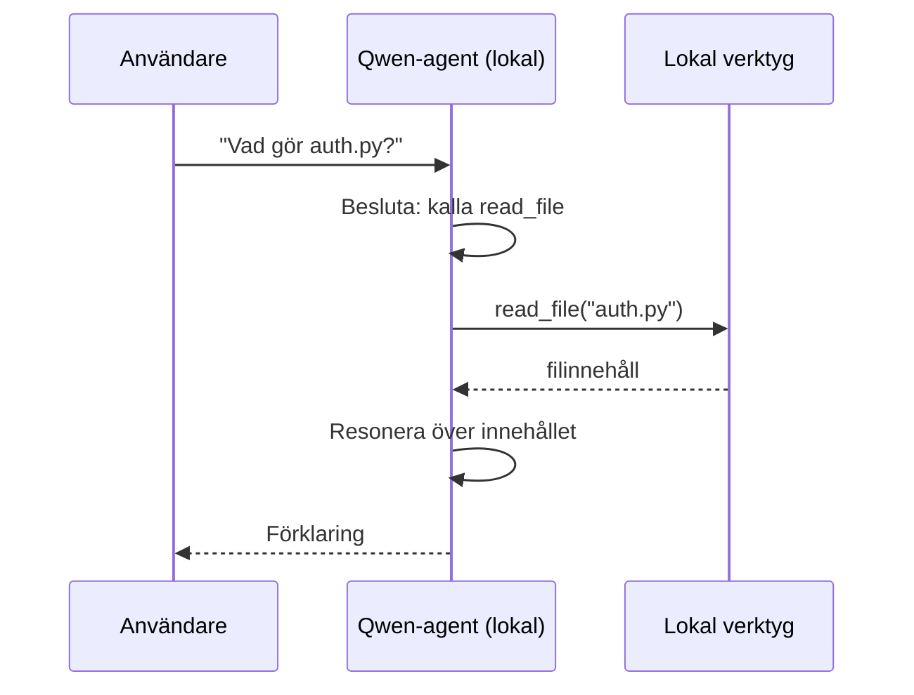
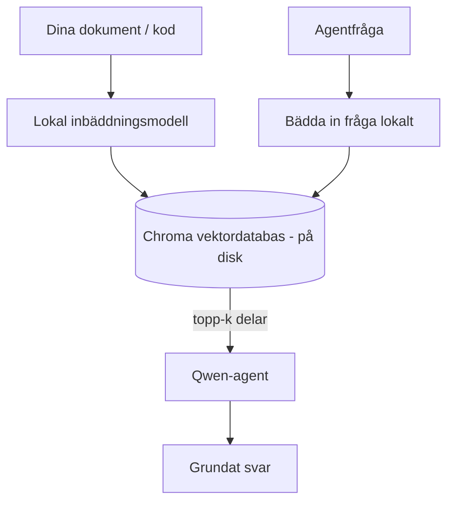
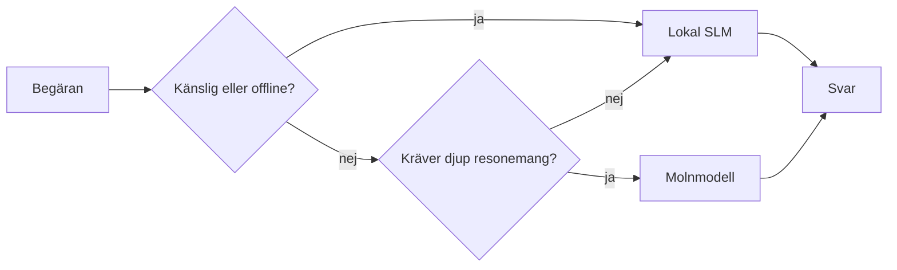

# Skapa Lokala AI-Agenter med Microsoft Foundry Local och Qwen


Föregående lektion skalade upp agenter till molnet. Den här tar dem ner till en enskild maskin. I slutet kommer du att ha en fungerande ingenjörsassistent som resonerar, anropar verktyg, läser dina filer och söker i din dokumentation — **utan ett enda molninferens-anrop.**

Varför skulle du vilja det? Tre skäl som ständigt dyker upp i verkligt ingenjörsarbete:

- **Integritet.** Koden och dokumenten lämnar aldrig maskinen. Ingen prompt, inget utdrag, inga kunddata korsar nätverksgränsen.
- **Kostnad.** Lokal inferens har ingen debitering per token. Du kan iterera hela dagen till priset av el.
- **Offline.** På ett flygplan, i en säker anläggning eller vid ett avbrott fungerar agenten fortfarande.

Fångsten är att du byter ut en framkantens molnmodell mot en **Small Language Model (SLM)** som körs på din CPU, GPU eller NPU. Den här lektionen handlar om att bygga agenter som är *bra* inom denna begränsning istället för att låtsas som att begränsningen inte finns.

## Introduktion

Den här lektionen kommer att täcka:

- **Small Language Models (SLMs)** — vad de är, var de skiner och var de inte gör det.
- **Microsoft Foundry Local** — en runtime som laddar ner och tillhandahåller modeller på enheten via ett **OpenAI-kompatibelt API**.
- **Qwen funktionsanropsmodeller** — SLM:er som pålitligt producerar verktygsanrop, vilket är vad som gör lokala *agenter* (inte bara lokal chatt) möjliga.
- **Lokala verktyg, lokal RAG och lokal MCP** — ger agenten kapacitet utan molnet.
- **Hybridmönster** — när man ska hålla saker lokalt och när man ska använda molnet.

## Lärandemål

Efter att ha genomfört den här lektionen kommer du att kunna:

- Förklara avvägningarna med SLM:er och välja lämpliga användningsfall för lokala agenter.
- Tillhandahålla en Qwen-modell lokalt med Foundry Local och ansluta till den via det OpenAI-kompatibla slutpunkten.
- Bygga en verktygsanropande agent som körs helt på din arbetsstation.
- Lägga till lokal RAG över dina egna dokument med hjälp av en lokal vektordatabas (Chroma).
- Ansluta agenten till en lokal MCP-server och resonera om hybrida lokala/molnbaserade designer.

## Förkunskaper

Den här lektionen förutsätter att du har slutfört tidigare lektioner och är bekväm med:

- [Verktygsanvändning](../04-tool-use/README.md) (Lektion 4) och [Agentic RAG](../05-agentic-rag/README.md) (Lektion 5).
- [Agentic Protocols / MCP](../11-agentic-protocols/README.md) (Lektion 11).
- [Microsoft Agent Framework](../14-microsoft-agent-framework/README.md) (Lektion 14).

Du behöver också:

- En utvecklararbetsstation. **8 GB RAM är en realistisk minimum**; 16 GB+ är bekvämt. En GPU eller NPU hjälper men krävs inte.
- **Microsoft Foundry Local** installerat (se installationsavsnittet nedan).
- Python 3.12+ och paketen i repositoryt [`requirements.txt`](../../../requirements.txt), plus `foundry-local-sdk`, `openai` och `chromadb` för denna lektion.

## Small Language Models: Det rätta verktyget för lokal arbetsbelastning

En framkantens molnmodell har hundratals miljarder parametrar och ett datacenter bakom sig. En SLM har några miljarder parametrar och måste rymmas i din laptopens RAM. Den skillnaden sätter tydliga förväntningar.

**SLM:er är bra på:**

- Strukturerade, avgränsade uppgifter — klassificering, extraktion, sammanfattning av ett känt dokument.
- **Verktygsanrop** — att avgöra vilken funktion som ska anropas och med vilka argument.
- Snabb, billig, privat iteration på dina egna data.

**SLM:er är svagare på:**

- Öppna, flerstegsresonemang över stor kontext.
- Bred världskunskap (de har sett mindre och glömmer mer).

Den vinnande strategin för lokala agenter är därför: **låt SLM:en orkestrera, och låt verktygen ta det tunga jobbet.** Modellen behöver inte *känna till* din kodbas — den behöver veta när den ska anropa `read_file` och `search_docs`. Det spelar direkt till en SLM:s styrkor.



## Microsoft Foundry Local

**Microsoft Foundry Local** är en lättviktsruntime som laddar ner, hanterar och tillhandahåller modeller helt på din maskin. Dess viktigaste funktion för oss är att den exponerar en **OpenAI-kompatibel HTTP-slutpunkt** — vilket betyder att OpenAI SDK och Microsoft Agent Frameworks OpenAI-klient fungerar mot den med enbart en ändring av `base_url`. Allt du lärt dig om att bygga agenter överförs direkt; bara slutpunkten flyttas från molnet till `localhost`.

Foundry Local väljer också automatiskt den bästa byggnaden av en modell för din hårdvara — en CPU-byggnad, en CUDA/GPU-byggnad eller en NPU-byggnad — så du slipper optimera för varje maskin manuellt.

### Installation

Installera Foundry Local (se [dokumentationen](https://learn.microsoft.com/azure/ai-foundry/foundry-local/) för ditt OS), och bekräfta att det fungerar:

```bash
# Installera (exempel; följ dokumentationen för din plattform)
winget install Microsoft.FoundryLocal      # Windows
# brew install microsoft/foundrylocal/foundrylocal   # macOS

# Ladda ner och kör en Qwen-modell, starta sedan den lokala tjänsten
foundry model run qwen2.5-7b-instruct
foundry service status
```

När tjänsten körs har du en lokal, OpenAI-kompatibel slutpunkt (vanligtvis `http://localhost:PORT/v1`). Notebooken använder `foundry-local-sdk` för att automatiskt upptäcka slutpunkten, så du behöver inte hårdkoda porten.

## Qwen Funktionsanrop: Varför det är viktigt

En agent är bara en agent om den kan anropa verktyg. Många SLM:er kan chatta men producerar opålitliga, felaktigt formade verktygsanrop. **Qwen**-modeller tränas för funktionsanrop och genererar konsekvent välformade verktygsanropsstrukturer — vilket är exakt vad som omvandlar en lokal chattmodell till en lokal *agent*.

Flödet är den vanliga verktygsanrops-loopen som du redan känner till, bara att den körs på enheten:



## Lokal RAG

Dokumentationssökning är där lokala agenter gör nytta. Istället för att hoppas att SLM:en memorerat ditt ramverks dokumentation, bäddar du in dessa dokument i en **lokal vektordatabas** och låter agenten hämta relevanta delar vid behov.

Vi använder **Chroma**, en inbäddad vektorbutik som körs i processen utan någon server att hantera. Pipen är helt lokal: lokal inbäddningsmodell → lokala vektorer → lokal hämtning → lokal SLM.



Detta är samma Agentic RAG-mönster som i Lektion 5 — enda skillnaden är att varje komponent körs på din maskin.

## Lokala MCP-Servrar

[MCP](../11-agentic-protocols/README.md) är en transport, inte en molntjänst. En MCP-server kan köras som en lokal process på `stdio` och tillhandahåller verktyg för din agent via standardprotokollet. Detta låter dig återanvända det växande ekosystemet av MCP-servrar — filsystemstillgång, git-operationer, databasfrågor — helt offline.

Säkerhetsläget skiljer sig från molnet, men är inte obefintligt: en lokal MCP-server körs fortfarande med dina användarbehörigheter, så begränsa vad den kan komma åt (en projektkatalog, inte hela din hemmamapp) och behandla dess utdata som indata att validera.

## Hybridmönster för moln och lokal användning

Lokal-först betyder inte lokal-endast. Mogna system dirigerar efter känslighet och svårighetsgrad:

| Situation | Var det körs |
| --- | --- |
| Känslig kod / data, eller offline | **Lokal SLM** |
| Enkel, avgränsad uppgift | **Lokal SLM** (billig, snabb) |
| Svårt flerstegsresonemang på icke-känsliga data | **Molnmodell** |
| Allt vid ett avbrott | **Lokal SLM** (graciös degradering) |

Detta speglar idén med **modellruttning** från Lektion 16 — förutom att en av "modellerna" nu är din egen maskin. En robust design faller tillbaka på lokal när molnet inte är tillgängligt, så agenten försämras i kvalitet istället för att helt sluta fungera.



## Praktisk övning: En lokal ingenjörsassistent

Öppna [`code_samples/17-local-agent-foundry-local.ipynb`](./code_samples/17-local-agent-foundry-local.ipynb) och gå igenom den. Du kommer att bygga en **lokal ingenjörsassistent** som körs helt på din arbetsstation och kan:

1. **Anropa verktyg** — via Qwen funktionsanrop genom Foundry Local.
2. **Utföra lokala filoperationer** — lista och läsa filer i en projektkatalog.
3. **Analysera kod** — rapportera grundläggande mått på en källfil.
4. **Söka dokumentation** — lokal RAG över en dokumentmapp med Chroma.
5. **Använda MCP** — ansluta till en lokal MCP-server (med en graciös förbigång om ingen är konfigurerad).

Ingen molninferens används vid något tillfälle.

### Genomgång

Assistenten ansluter till Foundry Local via den OpenAI-kompatibla slutpunkten, så agentkoden ser nästan identisk ut med molnlektionerna — bara klienten ändras:

```python
from foundry_local import FoundryLocalManager
from openai import OpenAI

# Foundry Local upptäcker/nedladdar modellen och ger oss en lokal slutpunkt.
manager = FoundryLocalManager(\"qwen2.5-7b-instruct\")
client = OpenAI(base_url=manager.endpoint, api_key=manager.api_key)  # api_key är en lokal platshållare
```

Verktygen är vanliga Python-funktioner som är begränsade till en projektkatalog:

```python
def read_file(path: str) -> str:
    \"\"\"Read a file, but only inside the sandboxed project directory.\"\"\"
    full = (PROJECT_ROOT / path).resolve()
    if PROJECT_ROOT not in full.parents and full != PROJECT_ROOT:
        return \"Access denied: path is outside the project directory.\"
    return full.read_text(encoding=\"utf-8\")
```

Notera sandbox-kontrollen — även lokalt är ett verktyg som läser godtyckliga sökvägar en risk. Notebooken håller varje verktyg begränsat till en enda projektrot.

## Kunskapskontroll

Testa din förståelse innan du går vidare till uppgiften.

**1. Ge två konkreta skäl att köra en agent lokalt istället för i molnet.**

<details>
<summary>Svar</summary>

Några två av: **integritet** (kod och data lämnar aldrig maskinen), **kostnad** (ingen debitering per token inferens), och **offlinekapacitet** (fungerar utan nätverk — på ett flygplan, i en säker anläggning eller vid ett avbrott). Regulatoriska/efterlevnadskrav som förbjuder att skicka data utanför enheten är en vanlig drivkraft för integritetsskäl.
</details>

**2. Vad är den rekommenderade arbetsfördelningen mellan en SLM och dess verktyg i en lokal agent, och varför?**

<details>
<summary>Svar</summary>

Låt SLM:en **orkestrera** (avgöra vilket verktyg som ska anropas och med vilka argument) och låt **verktygen göra det tunga arbetet** (läsa filer, hämta dokument, beräkna resultat). SLM:er är starka på avgränsade beslut som verktygsval men svagare på bred kunskap och långflerstegsresonemang, så att luta sig mot verktyg spelar till deras styrkor.
</details>

**3. Vad gör det möjligt att återanvända moln-agentkod med Foundry Local?**

<details>
<summary>Svar</summary>

Foundry Local exponerar en **OpenAI-kompatibel HTTP-slutpunkt**. OpenAI SDK och Agent Frameworks OpenAI-klient fungerar mot den genom att bara ändra `base_url` (och använda en lokal platshållar-API-nyckel). Allt annat i agentkoden förblir detsamma.
</details>

**4. Varför använder vi specifikt en Qwen funktionsanropsmodell snarare än någon SLM?**

<details>
<summary>Svar</summary>

Eftersom en agent måste producera pålitliga, välformade **verktygsanrop**. Många SLM:er kan chatta men genererar felaktiga eller inkonsekventa verktygsanropsstrukturer. Qwen-modeller tränas för funktionsanrop och producerar konsekventa verktygsanrop, vilket är vad som omvandlar en lokal chattmodell till en fungerande lokal agent.
</details>

**5. I den lokala RAG-pipen, vilka komponenter körs på maskinen?**

<details>
<summary>Svar</summary>

Alla: inbäddningsmodellen, vektordatabasen (Chroma, på disk), hämtsteget och SLM:en. Dokument bäddas in lokalt, lagras lokalt, hämtas lokalt och resonerar över av en lokal modell — ingen komponent rör molnet.
</details>

**6. En lokal MCP-server körs på din maskin. Gör det den automatiskt säker? Vilka försiktighetsåtgärder bör du fortfarande vidta?**

<details>
<summary>Svar</summary>

Nej. En lokal MCP-server körs med dina användarbehörigheter, så den kan nå allt du kan nå. Begränsa den till vad den behöver (t.ex. en enskild projektkatalog snarare än hela din hemmamapp) och behandla dess utdata som indata att validera innan du agerar på dem.
</details>

**7. Beskriv en rimlig hybridrutteringsregel som inkluderar en lokal modell.**

<details>
<summary>Svar</summary>

Dirigera känsliga eller offline-förfrågningar till den lokala SLM:en; dirigera enkla, avgränsade uppgifter till den lokala SLM:en för snabbhet och kostnad; dirigera svårt flerstegsresonemang på icke-känsliga data till en molnmodell; och fall tillbaka på den lokala SLM:en om molnet är otillgängligt så agenten försvagas graciöst istället för att misslyckas. Detta är modellruttning (Lektion 16) med den lokala maskinen som en av modellerna.
</details>

**8. Vad är en realistisk minimum RAM-mängd för att köra den lokala agenten i denna lektion, och vad får du mer RAM?**

<details>
<summary>Svar</summary>

Runt **8 GB** är en realistisk minimum; 16 GB+ är bekvämt. Mer RAM låter dig köra större, mer kapabla modeller och hålla mer kontext i minnet. En GPU eller NPU snabbar upp inferens men är inte nödvändigt — Foundry Local väljer en CPU-byggnad när ingen accelerator finns tillgänglig.
</details>

## Uppgift

Utöka den lokala ingenjörsassistenten till en **lokal dokumentationsgranskare** för ett litet projekt du väljer (använd gärna någon av lektionernas mappar i det här repot).

Din inlämning ska:

1. **Indexera en verklig dokumentations-/kodmapp** i Chroma (minst fem filer).
2. **Lägga till ett `find_todos`-verktyg** som skannar projektet efter `TODO`/`FIXME`-kommentarer och returnerar dem med filnamn och radnummer — med samma sandbox-kontroll som `read_file`.

3. **Ställ tre frågor till agenten** som tvingar den att kombinera verktyg: en ren RAG-fråga, en som kräver att läsa en specifik fil, och en som kräver att hitta TODOs.
4. **Mät den**: tidsätt varje av de tre svaren och notera dem i en markdown-cell. Kommentera om latensen är acceptabel för din avsedda arbetsflöde.

Skriv sedan ett kort stycke om **vad du skulle flytta till molnet och vad du skulle behålla lokalt** för denna granskare, och varför. Du bedöms på om de lokala komponenterna är korrekt kopplade och om din hybrida resonemang är sund — inte på modellens kvalitet.

## Sammanfattning

I denna lektion byggde du en agent som körs helt på din egen dator:

- **SLMs** byter bredd mot integritet, kostnad och offlinefunktion — och glänser när de **orkestrerar verktyg** istället för att bära all kunskap själva.
- **Foundry Local** serverar modeller på enheten bakom en **OpenAI-kompatibel endpoint**, så din molnagentkod överförs med en enda radändring.
- **Qwen funktionsanropsmodeller** gör pålitliga lokala verktygsanrop — och därmed lokala *agenter* — möjliga.
- **Lokal RAG** (Chroma) och **lokal MCP** ger agenten kapacitet utan att lämna maskinen.
- **Hybridmönster** låter dig dirigera efter känslighet och svårighet, med lokalt som en smidig reservlösning.

Detta avslutar distributionsbågen: Lektion 16 skalade upp agenter till Microsoft Foundry, och denna lektion skalade ner dem till en enda arbetsstation. Nästa lektion handlar om att hålla distribuerade agenter säkra.

## Ytterligare resurser

- <a href="https://learn.microsoft.com/azure/ai-foundry/foundry-local/" target="_blank">Microsoft Foundry Local-dokumentation</a>
- <a href="https://learn.microsoft.com/azure/ai-foundry/what-is-azure-ai-foundry" target="_blank">Microsoft Foundry-dokumentation</a>
- <a href="https://learn.microsoft.com/en-us/agent-framework/overview/?wt.mc_id=youtube_26688_organicsocial_reactor&pivots=programming-language-python" target="_blank">Microsoft Agent Framework</a>
- <a href="https://qwen.readthedocs.io/en/latest/framework/function_call.html" target="_blank">Qwen funktionsanropsdokumentation</a>
- <a href="https://modelcontextprotocol.io/" target="_blank">Model Context Protocol (MCP)</a>
- <a href="https://docs.trychroma.com/" target="_blank">Chroma vektordatabas</a>

## Föregående lektion

[Distribuera skalbara agenter](../16-deploying-scalable-agents/README.md)

## Nästa lektion

[Säkra AI-agenter](../18-securing-ai-agents/README.md)

---

<!-- CO-OP TRANSLATOR DISCLAIMER START -->
**Ansvarsfriskrivning**:
Detta dokument har översatts med hjälp av AI-översättningstjänsten [Co-op Translator](https://github.com/Azure/co-op-translator). Även om vi strävar efter noggrannhet, var vänlig notera att automatiska översättningar kan innehålla fel eller brister. Det ursprungliga dokumentet på dess modersmål bör betraktas som den auktoritativa källan. För kritisk information rekommenderas professionell mänsklig översättning. Vi ansvarar inte för några missförstånd eller feltolkningar som uppstår till följd av användningen av denna översättning.
<!-- CO-OP TRANSLATOR DISCLAIMER END -->