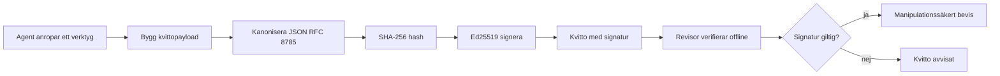
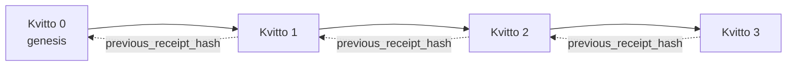

[Watch the lesson video: Securing AI Agents with Cryptographic Receipts](https://youtu.be/PLACEHOLDER_VIDEO_ID)

> _(Lektionsvideo och miniatyrbild kommer att läggas till av Microsofts innehållsteam efter sammanslagning, i enlighet med mönstret för lektion 14 / 15.)_

# Säkerställa AI-agenter med kryptografiska kvitton

## Introduktion

Denna lektion kommer att täcka:

- Varför revisionsspår för AI-agenter är viktiga för efterlevnad, felsökning och förtroende.
- Vad ett kryptografiskt kvitto är och hur det skiljer sig från en osignerad loggrad.
- Hur man producerar ett signerat kvitto för en agents verktygsanrop i enkel Python.
- Hur man verifierar ett kvitto offline och upptäcker manipulation.
- Hur man kedjar kvitton så att borttagning eller omordning av ett bryter kedjan.
- Vad kvitton bevisar och vad de uttryckligen inte bevisar.

## Lärandemål

Efter att ha genomgått denna lektion kommer du att kunna:

- Identifiera felmoderna som motiverar kryptografiskt ursprung för agentåtgärder.
- Producera ett Ed25519-signerat kvitto över en kanonisk JSON-payload.
- Verifiera ett kvitto oberoende med endast signerarens offentliga nyckel.
- Upptäcka manipulation genom att köra verifiering på ett modifierat kvitto.
- Bygga en hash-kedjad sekvens av kvitton och förklara varför kedjan är viktig.
- Känna igen gränsen mellan vad kvitton bevisar (tilldelning, integritet, ordning) och vad de inte gör (korrekthet i åtgärden, policyens hållbarhet).

## Problemet: Din agents revisionsspår

Föreställ dig att du har distribuerat en AI-agent för Contoso Travel. Agenten läser kundförfrågningar, anropar en flyg-API för att söka efter alternativ och bokar platser åt kunden. Förra kvartalet bearbetade agenten 50 000 bokningar.

Idag dyker en revisor upp. De ställer en enkel fråga: "Visa mig vad din agent gjorde."

Du lämnar över loggfilerna. Revisorn tittar på dem och ställer den svårare frågan: "Hur vet jag att dessa loggar inte har redigerats?"

Detta är revisionsspårsproblemet. De flesta agentdistributioner idag förlitar sig på:

- **Applikationsloggar**: skrivna av agenten själv, kan redigeras av vem som helst med filsystemstillgång.
- **Molnloggtjänster**: manipulationssynliga på plattformsnivå men bara om revisorn litar på plattformsoperatören.
- **Databastranaktionsloggar**: väl lämpade för databasändringar men inte för godtyckliga verktygsanrop.

Inget av dessa kan svara revisorns fråga utan att revisorn måste lita på någon (dig, din molnleverantör, din databastillverkare). För intern användning är det ofta acceptabelt. För reglerade arbetsbelastningar (finans, sjukvård, allt under EU AI-förordningen) är det inte det.

Kryptografiska kvitton löser detta genom att göra varje agentåtgärd oberoende verifierbar. Revisorn behöver inte lita på dig. De behöver bara din offentliga nyckel och själva kvittot.

## Vad är ett kryptografiskt kvitto?

Ett kvitto är ett JSON-objekt som registrerar vad en agent gjorde, signerat med en digital signatur.



Ett minimalt kvitto ser ut så här:

```json
{
  "type": "agent.tool_call.v1",
  "agent_id": "contoso-travel-bot",
  "tool_name": "lookup_flights",
  "tool_args_hash": "sha256:a3f9c1...",
  "result_hash": "sha256:7b2e1d...",
  "policy_id": "contoso-travel-policy-v3",
  "timestamp": "2026-04-25T14:30:00Z",
  "sequence": 47,
  "previous_receipt_hash": "sha256:9d4e6a...",
  "signature": {
    "alg": "EdDSA",
    "sig": "c5af83...",
    "public_key": "8f3b2c..."
  }
}
```

Tre egenskaper gör jobbet:

1. **Signaturen**. Kvittot är signerat av agentens gateway med en Ed25519-privat nyckel. Vem som helst med motsvarande offentliga nyckel kan verifiera signaturen offline. Manipulation av något fält ogiltigförklarar signaturen.

2. **Kanonisk kodning**. Innan signering serialiseras kvittot med JSON Canonicalization Scheme (JCS, RFC 8785). Detta säkerställer att två implementationer som producerar samma logiska kvitto producerar bytes-identisk output. Utan kanonisering skulle olika JSON-serializers producera olika signaturer för samma innehåll.

3. **Hash-kedjning**. Fältet `previous_receipt_hash` länkar varje kvitto till föregående. Att ta bort eller omordna ett kvitto bryter varje kvitto som kom efter. Manipulation blir synlig på kedjenivå även om individuella signaturer kringgås.

Tillsammans ger dessa egenskaper tre garantier:

- **Tilldelning**: denna nyckel signerade detta innehåll.
- **Integritet**: innehållet har inte ändrats sedan signering.
- **Ordning**: detta kvitto kom efter det kvittot i kedjan.

## Producera ett kvitto i Python

Du behöver inget speciellt bibliotek för att producera ett kvitto. De kryptografiska primitiva funktionerna finns allmänt tillgängliga och logiken är några tiotals rader Python.

De praktiska övningarna i `code_samples/18-signed-receipts.ipynb` går igenom hela flödet. Sammanfattad version:

```python
import json
import hashlib
import base64
from nacl import signing
from jcs import canonicalize  # RFC 8785 kanonisk JSON

def b64url_nopad(data: bytes) -> str:
    return base64.urlsafe_b64encode(data).decode("ascii").rstrip("=")

def sha256_canonical(obj) -> str:
    """SHA-256 of a Python object's JCS-canonical JSON form."""
    return f"sha256:{hashlib.sha256(canonicalize(obj)).hexdigest()}"

# Generera eller ladda en signeringsnyckel (i produktion, lagra i ett nyckelvalv)
signing_key = signing.SigningKey.generate()
verify_key = signing_key.verify_key

# Bygg kvittots nyttolast (ingen signatur än)
tool_args = {"origin": "SYD", "destination": "LAX"}
tool_result = [{"flight": "QF11", "price": 1850, "stops": 0}]

payload = {
    "type": "agent.tool_call.v1",
    "agent_id": "contoso-travel-bot",
    "tool_name": "lookup_flights",
    "tool_args_hash": sha256_canonical(tool_args),
    "result_hash": sha256_canonical(tool_result),
    "policy_id": "contoso-travel-policy-v3",
    "timestamp": "2026-04-25T14:30:00Z",
    "sequence": 0,
    "previous_receipt_hash": None,
}

# Kanonisera, hasha, signera.
canonical_bytes = canonicalize(payload)
message_hash = hashlib.sha256(canonical_bytes).digest()
signature_bytes = signing_key.sign(message_hash).signature

# Fäst ett strukturerat signaturobjekt.
receipt = {
    **payload,
    "signature": {
        "alg": "EdDSA",
        "sig": b64url_nopad(signature_bytes),
        "public_key": b64url_nopad(bytes(verify_key)),
    },
}
```

Det är hela signeringspipeline. Övningarna i notebooken går igenom varje steg.

## Verifiera ett kvitto och upptäcka manipulation

Verifiering är den omvända operationen:

```python
import base64
import hashlib
from nacl import signing
from nacl.exceptions import BadSignatureError
from jcs import canonicalize

def b64url_decode(s: str) -> bytes:
    padding = "=" * ((4 - len(s) % 4) % 4)
    return base64.urlsafe_b64decode(s + padding)

def verify_receipt(receipt: dict) -> bool:
    # Signaturen är ett strukturerat objekt: {"alg", "sig", "public_key"}.
    sig_obj = receipt.get("signature")
    if not sig_obj or sig_obj.get("alg") != "EdDSA":
        return False

    # Återskapa det nyttolast som faktiskt signerades (allt utom signaturen).
    payload = {k: v for k, v in receipt.items() if k != "signature"}

    canonical_bytes = canonicalize(payload)
    message_hash = hashlib.sha256(canonical_bytes).digest()

    try:
        verify_key = signing.VerifyKey(b64url_decode(sig_obj["public_key"]))
        verify_key.verify(message_hash, b64url_decode(sig_obj["sig"]))
        return True
    except BadSignatureError:
        return False
```

Denna funktion tar ett kvitto och returnerar `True` om signaturen är giltig, `False` annars. Ingen nätverksanrop, inget tjänsteberoende, inget krav på tillit till tredje part.

För att se manipulation upptäckt i praktiken går notebooken igenom:

1. Producera ett giltigt kvitto och bekräfta att det verifieras.
2. Modifiera en byte i fältet `tool_args_hash`.
3. Köra verifieringen igen och se att den misslyckas.

Detta är den praktiska demonstrationen att kvitton är manipulationssynliga: varje ändring, hur liten den än är, bryter signaturen.

## Kedja kvitton för multi-stegs agenter

Ett enda signerat kvitto skyddar en åtgärd. En kedja av kvitton skyddar en sekvens.



Varje kvitto registrerar hashvärdet av föregående kvitto. För att tyst ta bort kvitto 2 skulle en angripare behöva antingen:

- Modifiera kvitto 3:s fält `previous_receipt_hash` (bryter kvitto 3:s signatur), ELLER
- Förfalska en ny signatur på ett modifierat kvitto 3 (kräver agentens privata nyckel).

Om den privata nyckeln finns i en hårdvarunyckellåda och du publicerar den offentliga nyckeln med varje kvitto är ingen av dessa attacker praktiskt genomförbara utan upptäckt.

Notebooken går igenom:

1. Bygga en kedja av tre kvitton.
2. Verifiera att varje kvittos `previous_receipt_hash` matchar den faktiska hashen för föregående kvitto.
3. Manipulera ett kvitto mitt i och se kedjan brytas just där.

Så här producerar du ett revisionsspår som en extern revisor kan verifiera utan att behöva lita på dig.

## Vad kvitton bevisar (och vad de inte gör)

Detta är den viktigaste delen av lektionen. Kvitton är kraftfulla men deras kraft är begränsad.

**Kvitton bevisar tre saker:**

1. **Tilldelning**: en specifik nyckel har signerat ett specifikt innehåll.
2. **Integritet**: innehållet har inte ändrats sedan signering.
3. **Ordning**: detta kvitto kom efter det kvittot i hash-kedjan.

**Kvitton bevisar INTE:**

1. **Korrekthet**: att agentens åtgärd var rätt åtgärd. Ett kvitto kan signeras för ett felaktigt svar lika enkelt som för ett rätt svar.
2. **Policyefterlevnad**: att policyn refererad i `policy_id` faktiskt utvärderades eller att den skulle ha tillåtit denna åtgärd om den kontrollerats. Kvittot registrerar vad som påstås, inte vad som genomfördes.
3. **Identitet bortom nyckeln**: kvittot säger "denna nyckel signerade detta innehåll." Det säger inte "denna människa godkände detta." Att koppla en nyckel till en person eller organisation kräver separat identitetsinfrastruktur (en katalog, ett offentligt nyckelregister etc).
4. **Sanningshalten i indata**: om agenten mottar en manipulerad prompt och agerar på den, registrerar kvittot åtgärden korrekt. Kvitton är efter bearbetning av indata, inte en ersättning för validering.

Denna gräns är viktig av två skäl:

- Den visar vad kvitton är användbara för: att göra agentbeteende granskningsbart och manipulationssynligt, även över organisationsgränser.
- Den visar vilka ytterligare lager du fortfarande behöver: indata-validering (Lektion 6), policygenomförande (kortfattat nedan), och identitetsinfrastruktur (ingår inte i denna lektion).

Ett vanligt misstag är att anta att "vi har kvitton" betyder "vi är styrda." Det gör det inte. Kvitton är en grund. Styrning är systemet du bygger ovanpå.

## Produktionsreferenser

Pythons koden i denna lektion är avsiktligt minimal så att du kan läsa varje rad och exakt förstå vad som händer. I produktion har du två alternativ:

1. **Bygg direkt på de kryptografiska primitiva funktionerna.** De 50 raderna du såg ovan räcker för många användningsområden. PyNaCl (Ed25519) och paketet `jcs` (kanonisk JSON) är väl underhållna och granskade bibliotek.

2. **Använd ett produktionsbibliotek för kvitton.** Flera open source-projekt implementerar samma mönster med ytterligare funktioner (nyckelrotation, batch-verifiering, distribution av JWK-set, integration med policy-motorer):
   - Kvittots format som används i denna lektion följer en IETF Internet-Draft (`draft-farley-acta-signed-receipts`) som för närvarande är i standardiseringsprocess.
   - Microsoft Agent Governance Toolkit kombinerar kvitton med policybeslut baserade på Cedar; se Tutorial 33 i det arkivet för ett komplett exempel.
   - Paket som `protect-mcp` (npm) och `@veritasacta/verify` (npm) tillhandahåller en Node-baserad implementation av kvittosignering och offline-verifiering, avsett för att omsluta vilken MCP-server som helst med ett manipulationssäkert revisionsspår.
   - **[nobulex](https://github.com/arian-gogani/nobulex)** Python-SDK (`pip install nobulex`) ger samma Ed25519 + JCS signeringsmönster i Python med integrationer för LangChain och CrewAI, inklusive publicerade tvärvaliderings testvektorer samt en efterlevnadskarta bidragen via [OWASP PR #2210](https://github.com/OWASP/CheatSheetSeries/pull/2210).

Beslutet mellan att rulla egen lösning och använda ett bibliotek liknar valet mellan att skriva eget JWT-bibliotek och använda ett testat: båda är rimliga; biblioteket spar tid och minskar granskningsyta; från-grunden-metoden tvingar dig att förstå varje primitiv. Denna lektion lär från-grunden-vägen så att du har grunden för båda valen.

## Kunskapskontroll

Testa din förståelse innan du går vidare till övningen.

**1. Ett kvitto signeras med agentens privata Ed25519-nyckel. Revisorn har bara den offentliga nyckeln. Kan revisorn verifiera kvittot offline?**

<details>
<summary>Svar</summary>

Ja. Ed25519-verifiering kräver endast den offentliga nyckeln och de signerade bytena. Inget nätverksanrop, inget tjänsteberoende. Detta är egenskapen som gör kvitton användbara i air-gapped, flerorganisations- eller lågtillits-revisionsinställningar.
</details>

**2. En angripare ändrar fältet `policy_id` i ett kvitto för att påstå att det styrdes av en mer tillåtande policy. Signaturen var över den ursprungliga payloaden. Vad händer vid verifiering?**

<details>
<summary>Svar</summary>

Verifieringen misslyckas. Signaturen beräknades över de kanoniska bytena av den ursprungliga payloaden; att ändra något fält ändrar de kanoniska bytena, vilket ändrar SHA-256 hashen, vilket gör signaturen ogiltig. Angriparen skulle behöva den privata nyckeln för att skapa en ny giltig signatur, vilket de inte har.
</details>

**3. Varför inkluderar kvittot `tool_args_hash` och `result_hash` i stället för råa argument och resultat?**

<details>
<summary>Svar</summary>

Två skäl. För det första kan kvittot behöva arkiveras eller sändas i miljöer där läckage av rått innehåll (personuppgifter, affärsdata) är ett problem. Hashning håller kvittot litet och innehållet privat; revisorn verifierar att hashen matchar en separat lagrad kopia av det faktiska innehållet. För det andra har hashar en fast storlek; ett kvitto med hashar är begränsat i storlek oavsett hur stora in- och utdata var.
</details>

**4. Fältet `previous_receipt_hash` länkar varje kvitto till sin föregångare. Om en angripare tyst tar bort ett kvitto från mitten av en kedja, vad blir ogiltigt?**

<details>
<summary>Svar</summary>

Varje kvitto som kom efter det borttagna. Deras fält `previous_receipt_hash` stämmer inte längre med den faktiska kedjan (eftersom kvittot de refererade inte längre finns, eller kedjan nu pekar på en annan föregångare). För att dölja borttagningen måste angriparen åter-signera varje senare kvitto, vilket kräver den privata nyckeln.
</details>

**5. Ett kvitto verifieras korrekt. Bevisar det att agentens handling var korrekt, hållbar eller följer policy?**

<details>
<summary>Svar</summary>

Nej. Ett giltigt kvitto bevisar tre saker: tilldelning (denna nyckel signade detta innehåll), integritet (innehållet har inte ändrats) och ordning (detta kvitto kom efter det andra). Det bevisar INTE att åtgärden var korrekt, att policyn namngiven i `policy_id` faktiskt utvärderades, eller att agenten följde alla regler. Kvitton gör agentbeteendet granskningsbart, inte nödvändigtvis korrekt. Detta är den viktigaste gränsen i lektionen.
</details>

## Praktisk övning

Öppna `code_samples/18-signed-receipts.ipynb` och slutför alla fyra sektionerna:

1. **Sektion 1**: Signera ditt första kvitto och verifiera det.
2. **Sektion 2**: Manipulera kvittot och observera verifieringsfel.
3. **Sektion 3**: Bygg en kedja av tre kvitton och verifiera kedjans integritet.
4. **Sektion 4**: Använd mönstret på en agent byggd med Microsoft Agent Framework: omslut ett verktygsanrop med kvittosignering, verifiera sedan kvittot oberoende.
**Stretchutmaning 1:** utöka kvittoschemat med ett ytterligare fält som du själv väljer (till exempel ett begäran-ID för spårning), uppdatera den kanoniska signeringslogiken för att inkludera det, och bekräfta att kvittot fortfarande kan verifieras fram och tillbaka. Ändra sedan fältet efter signering och bekräfta att verifieringen misslyckas. Detta tvingar dig att förstå hur varje byte i den kanoniska kodningen bidrar till signaturen.

**Stretchutmaning 2:** hasha två av dina kvitton tillsammans med SHA-256 (sammanfoga deras kanoniska bytes i en deterministisk ordning) och bädda in den resulterande digesten som ett nytt fält på ett tredje kvitto innan du signerar det. Verifiera att alla tre kvitton fortfarande kan verifieras fram och tillbaka. Du har just byggt ett inklusionsbevis i ett steg: vem som helst som har det tredje kvittot kan bevisa att de två första fanns vid tidpunkten då det signerades, utan att behöva avslöja innehållet. Detta är mönstret som selektivt avslöjande kvitton använder i skala (merkleåtaganden, RFC 6962).

## Slutsats

Kryptografiska kvitton ger AI-agenter en revisionskedja som är:

- **Oberoende verifierbar**: vilken part som helst med den offentliga nyckeln kan verifiera, utan beroende av tjänst.
- **Manipuleringsbar**: varje ändring ogiltigförklarar signaturen.
- **Portabel**: ett kvitto är en liten JSON-fil; den kan arkiveras, överföras och verifieras var som helst.
- **Standardanpassad**: byggd på Ed25519 (RFC 8032), JCS (RFC 8785) och SHA-256, alla bredvidt använda primitiva.

De är inte en ersättning för indata-validering, policygenomförande eller identitetsinfrastruktur. De är en grund för dessa lager. När du distribuerar agenter i reglerade arbetsflöden, flervårdsorganisationsarbetsflöden eller någon miljö där en framtida revisor inte kan antas lita på dig, är kvitton hur du gör revisionskedjan ärlig.

Det viktigaste att ta med sig: kvitton bevisar vem som sade vad, när. De bevisar inte att det som sades var sant eller rätt. Håll den distinktionen noga. Det är skillnaden mellan ett ärligt ursprungssystem och ett vilseledande.

## Produktionschecklista

När du är redo att gå vidare från denna lektion till att distribuera kvitto-signade agenter i en riktig miljö:

- [ ] **Flytta signeringsnyckeln från utvecklarens laptop.** Använd Azure Key Vault, AWS KMS eller ett hårdvarusäkerhetsmodul. Den privata nyckeln som signerar dina kvitton får aldrig ligga i källkontroll eller i klartext på applikationsmaskiner.
- [ ] **Publicera den offentliga verifieringsnyckeln.** Revisorer behöver den för att verifiera offline. Standardmönstret är en JWK Set på en välkänd URL (RFC 7517), t.ex. `https://your-org.example.com/.well-known/agent-keys.json`.
- [ ] **Ankare kedjan externt.** Skriv periodiskt det senaste kedjetoppens hash till en transparenslogg (Sigstore Rekor, RFC 3161 tidsstämpelmyndighet eller ett annat internt system) så att en extern part kan bekräfta "denna kedja existerade vid denna tidpunkt."
- [ ] **Spara kvitton oföränderligen.** Append-only blob storage (Azure Storage med oföränderlighetspolicyer, AWS S3 Object Lock) förhindrar att en insider skriver om historiken på lagringsnivån.
- [ ] **Besluta om lagringstid.** Många regelverk kräver flervårs lagring. Planera för tillväxt av kvitton (varje kvitto är ~500 bytes; en agent som gör 10K anrop per dag producerar ~1,8 GB per år).
- [ ] **Dokumentera vad kvitton inte täcker.** Kvitton bevisar tillskrivning, integritet och ordning. Din driftboksmanual bör uttryckligen lista vilka ytterligare kontroller (indatavärdering, policygenomförande, taktbegränsning, identitetsinfrastruktur) som hör till tillsammans med kvitton i din styrningsposition.

### Fler frågor om att säkra AI-agenter?

Gå med i [Microsoft Foundry Discord](https://aka.ms/ai-agents/discord) för att träffa andra lärande, delta i kontorstider och få svar på dina AI Agent-frågor.

## Utöver denna lektion

Denna lektion täcker enkel kvittosignering och hash-kedjade sekvenser. Samma primitiva bygger in i flera mer avancerade mönster som du kan möta när din styrningsposition mognar:

- **Selektivt avslöjande.** När ett kvittos fält är oberoende åtagna (RFC 6962-stil Merkle-träd), kan du avslöja specifika fält för specifika revisorer och bevisa att resten är oförändrade utan att exponera dem. Användbart när samma kvitto måste tillfredsställa både en omfattande revision (som vill ha fullständighet) och dataminimeringsregler som GDPR (som vill att revisorn ska se så lite som möjligt).
- **Kvittoåterkallelse.** Om en signeringsnyckel komprometteras behöver du ett sätt att markera alla kvitton signerade med den nyckeln som opålitliga från en viss tidpunkt. Standardmönster: kortlivade signeringsnycklar plus en publicerad återkallelse-lista, eller en transparenslogg med återkallelseposter.
- **Bilaterala / split-signatur kvitton.** Vissa implementationer delar upp den signerade nyttolasten i före-exekverings- (`authorization_*`) och efter-exekverings- (`result_*`) halvor med oberoende signaturer, användbara när auktorisationsbeslutet och det observerade resultatet produceras av olika aktörer eller vid olika tidpunkter. Detta bygger additivt på kvittoformatet som lärs ut i denna lektion.
- **Nyttolastskomposition.** Ett kvitto förseglar vilka bytes du än lägger i `result_hash`. Riktiga nyttolaster är ofta rikare än ett enda verktygsanropsresultat: förbeslutsresonemang (modellförutsägelse, övervägda alternativ, bevis och dess fullständighet, riskposition, ansvarskedja, grindresultat) kan alla finnas i nyttolasten förseglade av ett enda kvitto. Detta håller kvittoformatet minimalt samtidigt som nyttolastscheman kan utvecklas domän för domän.
- **Konformitet över implementationer.** Flera oberoende implementationer av samma kvittoformat (Python, TypeScript, Rust, Go) verifierar mot gemensamma testvektorer. Om du bygger din egen implementation, bekräftar validering mot publicerade vektorer trådanslutningsbarhet.
- **Post-kvantmigrering.** Ed25519 är idag vida använd men inte kvantresistent. Kvittoformatet är algoritmagilt: fältet `signature.alg` kan bära `ML-DSA-65` (NIST:s post-kvantsignaturstandard) när du behöver migrera. Planera för en övergångsperiod där kvitton är dubbelsignade.

## Ytterligare resurser

- <a href="https://datatracker.ietf.org/doc/draft-farley-acta-signed-receipts/" target="_blank">IETF Internet-Draft: Signed Decision Receipts for Machine-to-Machine Access Control</a>
- <a href="https://learn.microsoft.com/azure/ai-studio/responsible-use-of-ai-overview" target="_blank">Ansvarsfull AI-översikt (Azure AI)</a>
- <a href="https://datatracker.ietf.org/doc/html/rfc8032" target="_blank">RFC 8032: Edwards-Curve Digital Signature Algorithm (EdDSA)</a>
- <a href="https://datatracker.ietf.org/doc/html/rfc8785" target="_blank">RFC 8785: JSON Canonicalization Scheme (JCS)</a>
- <a href="https://datatracker.ietf.org/doc/html/rfc6962" target="_blank">RFC 6962: Certificate Transparency</a> (Merkle-träd konstruktion som används av selektivt avslöjande kvitton)
- <a href="https://github.com/microsoft/agent-governance-toolkit/blob/main/docs/tutorials/33-offline-verifiable-receipts.md" target="_blank">Microsoft Agent Governance Toolkit, Tutorial 33: Offline-Verifiable Decision Receipts</a>
- <a href="https://github.com/ScopeBlind/agent-governance-testvectors" target="_blank">Konformitetstestvektorer över implementationer</a> för kvittoformatet som används i denna lektion (Apache-2.0)
- <a href="https://pynacl.readthedocs.io/" target="_blank">PyNaCl-dokumentation</a> (Ed25519 i Python)

## Föregående lektion

[Bygga datoranvändaragenter (CUA)](../15-browser-use/README.md)

## Nästa lektion

_(Bestäms av kursansvariga)_

---

<!-- CO-OP TRANSLATOR DISCLAIMER START -->
**Ansvarsfriskrivning**:
Detta dokument har översatts med hjälp av AI-översättningstjänsten [Co-op Translator](https://github.com/Azure/co-op-translator). Även om vi strävar efter noggrannhet, var vänlig notera att automatiska översättningar kan innehålla fel eller brister. Det ursprungliga dokumentet på dess modersmål bör betraktas som den auktoritativa källan. För kritisk information rekommenderas professionell mänsklig översättning. Vi ansvarar inte för några missförstånd eller feltolkningar som uppstår till följd av användningen av denna översättning.
<!-- CO-OP TRANSLATOR DISCLAIMER END -->