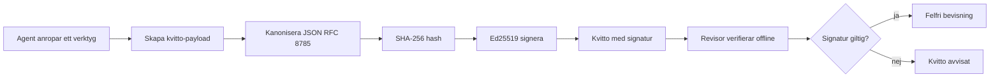
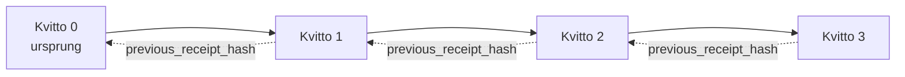

[Watch the lesson video: Säkerställa AI-agenter med kryptografiska kvitton](https://youtu.be/PLACEHOLDER_VIDEO_ID)

> _(Lektionsvideo och miniatyrbild kommer att läggas till av Microsofts innehållsteam efter sammanslagning, i enlighet med lektionsmönstret för lektion 14 / 15.)_

# Säkerställa AI-agenter med kryptografiska kvitton

## Introduktion

Den här lektionen kommer att täcka:

- Varför revisionsspår för AI-agenter är viktiga för efterlevnad, felsökning och förtroende.
- Vad ett kryptografiskt kvitto är och hur det skiljer sig från en osignerad loggrad.
- Hur man skapar ett signerat kvitto för en agents verktygsanrop i ren Python.
- Hur man verifierar ett kvitto offline och upptäcker manipulation.
- Hur man kedjar kvitton så att borttagning eller omordning av ett kvitto bryter kedjan.
- Vad kvitton bevisar och vad de uttryckligen inte bevisar.

## Lärandemål

Efter att ha genomfört denna lektion kommer du att kunna:

- Identifiera felmoderna som motiverar kryptografiskt ursprung för agentåtgärder.
- Skapa ett Ed25519-signerat kvitto över en kanonisk JSON-payload.
- Verifiera ett kvitto självständigt med endast signerarens offentliga nyckel.
- Upptäcka manipulation genom att köra om verifiering på ett modifierat kvitto.
- Bygga en hash-kedjad sekvens av kvitton och förklara varför kedjan är viktig.
- Känna igen gränsen mellan vad kvitton bevisar (tilldelning, integritet, ordning) och vad de inte gör (riktigheten av åtgärden, policyens giltighet).

## Problemet: Din agents revisionsspår

Föreställ dig att du har driftsatt en AI-agent för Contoso Travel. Agenten läser kundförfrågningar, anropar en flyg-API för att söka efter alternativ och bokar platser för kundens räkning. Förra kvartalet hanterade agenten 50 000 bokningar.

Idag anländer en revisor. De ställer en enkel fråga: "Visa mig vad din agent gjorde."

Du lämnar över dina loggfiler. Revisorn tittar på dem och ställer den svårare frågan: "Hur vet jag att dessa loggar inte har redigerats?"

Detta är problemet med revisionsspår. De flesta agentutplaceringar idag förlitar sig på:

- **Applikationsloggar**: skrivna av agenten själv, redigerbara av vem som helst med filsystemåtkomst.
- **Molnloggtjänster**: manipulationssäkra på plattformsnivå men endast om revisorn litar på plattformsoperatören.
- **Databastransaktionsloggar**: väl lämpade för databasändringar men inte för godtyckliga verktygsanrop.

Ingen av dessa kan svara på revisorns fråga utan att kräva att revisorn litar på någon (dig, din molnleverantör, din databasmjukvara). För internt bruk är det ofta acceptabelt. För reglerade arbetsbelastningar (finans, sjukvård, allt som omfattas av EU:s AI-förordning) är det det inte.

Kryptografiska kvitton löser detta genom att göra varje agents åtgärd oberoende verifierbar. Revisorn behöver inte lita på dig. De behöver bara din offentliga nyckel och själva kvittot.

## Vad är ett kryptografiskt kvitto?

Ett kvitto är ett JSON-objekt som registrerar vad en agent gjorde, signerat med en digital signatur.


  
Ett minimalt kvitto ser ut så här:

```json
{
  "type": "agent.tool_call.v1",
  "agent_id": "contoso-travel-bot",
  "tool_name": "lookup_flights",
  "tool_args_hash": "sha256:a3f9c1...",
  "result_hash": "sha256:7b2e1d...",
  "policy_id": "contoso-travel-policy-v3",
  "timestamp": "2026-04-25T14:30:00Z",
  "sequence": 47,
  "previous_receipt_hash": "sha256:9d4e6a...",
  "signature": {
    "alg": "EdDSA",
    "sig": "c5af83...",
    "public_key": "8f3b2c..."
  }
}
```
  
Tre egenskaper gör jobbet:

1. **Signaturen**. Kvittot signeras av agentens gateway med hjälp av en Ed25519-privatnyckel. Den som har tillgång till motsvarande offentliga nyckel kan verifiera signaturen offline. Manipulering av något fält gör signaturen ogiltig.

2. **Kanonisk kodning**. Innan signering serialiseras kvittot med JSON Canonicalization Scheme (JCS, RFC 8785). Detta säkerställer att två implementationer som producerar samma logiska kvitto ger identisk byte-utdata. Utan kanonisering skulle olika JSON-serialiserare skapa olika signaturer för samma innehåll.

3. **Hash-kedjning**. Fältet `previous_receipt_hash` länkar varje kvitto till det föregående. Att ta bort eller ändra ordningen på ett kvitto bryter varje efterföljande kvitto i kedjan. Manipulation blir synlig på kedjenivå även om individuella signaturer skulle kringgås.

Tillsammans ger dessa egenskaper tre garantier:

- **Tilldelning**: denna nyckel signerade detta innehåll.
- **Integritet**: innehållet har inte ändrats sedan signering.
- **Ordning**: detta kvitto kom efter det föregående i kedjan.

## Att producera ett kvitto i Python

Du behöver inget specialbibliotek för att skapa ett kvitto. De kryptografiska primitiva funktionerna är allmänt tillgängliga och logiken är några tiotals rader Python.

De praktiska övningarna i `code_samples/18-signed-receipts.ipynb` visar hela flödet. Sammanfattningsvis:

```python
import json
import hashlib
import base64
from nacl import signing
from jcs import canonicalize  # RFC 8785 kanonisk JSON

def b64url_nopad(data: bytes) -> str:
    return base64.urlsafe_b64encode(data).decode("ascii").rstrip("=")

def sha256_canonical(obj) -> str:
    """SHA-256 of a Python object's JCS-canonical JSON form."""
    return f"sha256:{hashlib.sha256(canonicalize(obj)).hexdigest()}"

# Generera eller ladda en signeringsnyckel (i produktion, lagra i en nyckelvalv)
signing_key = signing.SigningKey.generate()
verify_key = signing_key.verify_key

# Bygg kvitto-payloaden (ingen signatur ännu)
tool_args = {"origin": "SYD", "destination": "LAX"}
tool_result = [{"flight": "QF11", "price": 1850, "stops": 0}]

payload = {
    "type": "agent.tool_call.v1",
    "agent_id": "contoso-travel-bot",
    "tool_name": "lookup_flights",
    "tool_args_hash": sha256_canonical(tool_args),
    "result_hash": sha256_canonical(tool_result),
    "policy_id": "contoso-travel-policy-v3",
    "timestamp": "2026-04-25T14:30:00Z",
    "sequence": 0,
    "previous_receipt_hash": None,
}

# Kanonifiera, hash, signera.
canonical_bytes = canonicalize(payload)
message_hash = hashlib.sha256(canonical_bytes).digest()
signature_bytes = signing_key.sign(message_hash).signature

# Bifoga ett strukturerat signaturobjekt.
receipt = {
    **payload,
    "signature": {
        "alg": "EdDSA",
        "sig": b64url_nopad(signature_bytes),
        "public_key": b64url_nopad(bytes(verify_key)),
    },
}
```
  
Det är hela signeringspipeline. Övningarna i anteckningsboken går igenom varje steg.

## Att verifiera ett kvitto och upptäcka manipulation

Verifiering är den omvända operationen:

```python
import base64
import hashlib
from nacl import signing
from nacl.exceptions import BadSignatureError
from jcs import canonicalize

def b64url_decode(s: str) -> bytes:
    padding = "=" * ((4 - len(s) % 4) % 4)
    return base64.urlsafe_b64decode(s + padding)

def verify_receipt(receipt: dict) -> bool:
    # Signaturen är ett strukturerat objekt: {"alg", "sig", "public_key"}.
    sig_obj = receipt.get("signature")
    if not sig_obj or sig_obj.get("alg") != "EdDSA":
        return False

    # Återskapa nyttolasten som faktiskt signerades (allt utom signaturen).
    payload = {k: v for k, v in receipt.items() if k != "signature"}

    canonical_bytes = canonicalize(payload)
    message_hash = hashlib.sha256(canonical_bytes).digest()

    try:
        verify_key = signing.VerifyKey(b64url_decode(sig_obj["public_key"]))
        verify_key.verify(message_hash, b64url_decode(sig_obj["sig"]))
        return True
    except BadSignatureError:
        return False
```
  
Denna funktion tar ett kvitto och returnerar `True` om signaturen är giltig, annars `False`. Ingen nätverksanrop, ingen beroende av tjänst, inget behov av att lita på någon tredje part.

För att se hur manipulationsdetektion fungerar går anteckningsboken igenom:

1. Att producera ett giltigt kvitto och bekräfta att det verifieras.
2. Ändra en byte i fältet `tool_args_hash`.
3. Köra verifieringen igen och se att den misslyckas.

Detta är den praktiska demonstrationen att kvitton är manipulationssäkra: varje ändring, hur liten som helst, bryter signaturen.

## Kedja kvitton för flerstegsagenter

Ett enskilt signerat kvitto skyddar en åtgärd. En kedja av kvitton skyddar en sekvens.


  
Varje kvitto registrerar hashen av föregående kvitto. För att tyst radera kvitto 2 måste en angripare antingen:

- Modifiera fältet `previous_receipt_hash` i kvitto 3 (bryter signaturen för kvitto 3), ELLER
- Falska en ny signatur på ett modifierat kvitto 3 (kräver agentens privata nyckel).

Om den privata nyckeln finns i ett hårdvarunyckelvalv och du publicerar den publika nyckeln med varje kvitto är ingen av attackerna möjlig utan upptäckt.

Anteckningsboken går igenom:

1. Att bygga en kedja av tre kvitton.
2. Att verifiera att varje kvittos `previous_receipt_hash` matchar den faktiska hashen av föregående kvitto.
3. Manipulation av ett kvitto mitt i kedjan och att se kedjan brytas exakt där.

Så här producerar du ett revisionsspår som en extern revisor kan verifiera utan att lita på dig.

## Vad kvitton bevisar (och vad de inte gör)

Detta är den viktigaste delen av lektionen. Kvitton är kraftfulla men deras makt är begränsad.

**Kvitton bevisar tre saker:**

1. **Tilldelning**: en specifik nyckel signerade en specifik payload.
2. **Integritet**: payloaden har inte ändrats sedan signeringen.
3. **Ordning**: detta kvitto kom efter det föregående i hashkedjan.

**Kvitton bevisar INTE:**

1. **Riktighet**: att agentens åtgärd var rätt åtgärd. Ett kvitto kan signeras för ett felaktigt svar lika tydligt som för ett korrekt svar.
2. **Efterlevnad av policy**: att policyn i `policy_id` faktiskt utvärderades, eller att den skulle ha tillåtit denna åtgärd om den kontrollerades. Kvittot registrerar vad som påstås, inte vad som upprätthölls.
3. **Identitet bortom nyckeln**: kvittot säger "denna nyckel signerade detta innehåll." Det säger inte "denna människa auktoriserade detta." Att koppla en nyckel till en person eller organisation kräver separat identitetsinfrastruktur (en katalog, ett register över offentliga nycklar etc.).
4. **Sanningshalten i indata**: om agenten får en manipulerad prompt och agerar på den, registrerar kvittot åtgärden korrekt. Kvitton är efter indata-validering, inte en ersättning för den.

Denna gräns är viktig av två skäl:

- Den talar om vad kvitton är användbara för: att göra agentbeteende revisionsbart och manipulationssäkert, även över organisationsgränser.
- Den visar vilka ytterligare lager du fortfarande behöver: indata-validering (Lektion 6), policypåverkan (behandlas kort nedan), och identitetsinfrastruktur (ingår ej i denna lektion).

Ett vanligt misstag är att anta att "vi har kvitton" betyder "vi är styrda". Det gör det inte. Kvitton är en grund. Styrning är systemet du bygger ovanpå.

## Produktionsreferenser

Python-koden i denna lektion är avsiktligt minimal så att du kan läsa varje rad och förstå exakt vad som händer. I produktion har du två alternativ:

1. **Bygg direkt på de kryptografiska primitiva funktionerna.** De 50 rader du såg ovan räcker för många användningsfall. PyNaCl (Ed25519) och paketet `jcs` (kanonisk JSON) är väl underhållna och granskade bibliotek.

2. **Använd ett produktionsbibliotek för kvitton.** Flera open source-projekt implementerar samma mönster med extra funktioner (nyckelrotation, batch-verifiering, JWK Set-distribution, integration med policymotorer):
   - Kvittovarianten som används i denna lektion följer ett IETF Internet-Draft (`draft-farley-acta-signed-receipts`) som för närvarande är i standardiseringsprocess.
   - Microsoft Agent Governance Toolkit kombinerar kvitton med Cedar-baserade policybeslut; se Tutorial 33 i det förvaret för ett heltäckande exempel.
   - Paketen `protect-mcp` (npm) och `@veritasacta/verify` (npm) erbjuder en Node-baserad implementering av kvitto-signering och offline-verifiering, avsedda att omsluta vilken MCP-server som helst med ett manipulationssäkert revisionsspår.

Beslutet mellan att göra själv och att använda ett bibliotek liknar valet mellan att skriva ditt eget JWT-bibliotek och använda ett testat: båda är rimliga; biblioteket sparar tid och minskar granskningsyta; självbygget tvingar dig att förstå varje primitiv. Denna lektion lär ut självbygget så att du har grunden för båda valen.

## Kunskapskontroll

Testa din förståelse innan du går vidare till övningen.

**1. Ett kvitto signeras med agentens privata Ed25519-nyckel. Revisorn har endast den publika nyckeln. Kan revisorn verifiera kvittot offline?**

<details>
<summary>Svar</summary>

Ja. Ed25519-verifiering kräver endast den publika nyckeln och de signerade bytena. Inget nätverksanrop, inget beroende av tjänst. Detta är egenskapen som gör kvitton användbara i luftgapade, multi-organisations- och låg-tillits- revisionsmiljöer.
</details>

**2. En angripare ändrar fältet `policy_id` i ett kvitto för att påstå att det styrdes av en mer tillåtande policy. Signaturen var över den ursprungliga payloaden. Vad händer vid verifiering?**

<details>
<summary>Svar</summary>

Verifieringen misslyckas. Signaturen beräknades över de kanoniska bytena av den ursprungliga payloaden; att ändra något fält ändrar de kanoniska bytena, vilket ändrar SHA-256-hashen, vilket gör signaturen ogiltig. Angriparen skulle behöva den privata nyckeln för att producera en ny giltig signatur, vilket de inte har.
</details>

**3. Varför inkluderar kvittot en `tool_args_hash` och `result_hash` istället för de råa argumenten och resultatet?**

<details>
<summary>Svar</summary>

Två skäl. För det första kan kvittot behöva arkiveras eller överföras i miljöer där det är problematiskt att avslöja rått innehåll (personuppgifter, affärsdata). Hashning håller kvittot litet och innehållet privat; revisorn verifierar att hashen matchar en separat lagrad kopia av det faktiska innehållet. För det andra har hashar en fast storlek; ett kvitto med hashar är storleksbegränsat oavsett hur stora in- och utdata var.
</details>

**4. Fältet `previous_receipt_hash` länkar varje kvitto till dess föregångare. Om en angripare tyst raderar ett kvitto från mitten av kedjan, vad blir ogiltigt?**

<details>
<summary>Svar</summary>

Varje kvitto som kom efter det borttagna. Deras fält `previous_receipt_hash` matchar inte längre den faktiska kedjan (eftersom kvittot de refererade inte längre existerar, eller kedjan nu pekar på en annan föregångare). För att dölja borttagningen skulle angriparen behöva skriva om signaturen för varje senare kvitto, vilket kräver den privata nyckeln.
</details>

**5. Ett kvitto verifieras utan fel. Bevisar det att agentens åtgärd var korrekt, giltig eller policykompliant?**

<details>
<summary>Svar</summary>

Nej. Ett giltigt kvitto bevisar tre saker: tilldelning (denna nyckel signerade detta innehåll), integritet (innehållet har inte ändrats) och ordning (detta kvitto kom efter det föregående). Det bevisar INTE att åtgärden var korrekt, att policyn angiven i `policy_id` faktiskt utvärderades, eller att agenten följde alla regler. Kvitton gör agentbeteende revisionsbart, inte nödvändigtvis korrekt. Detta är den viktigaste gränsen i lektionen.
</details>

## Praktisk övning

Öppna `code_samples/18-signed-receipts.ipynb` och slutför alla fyra sektionerna:

1. **Sektion 1**: Signera ditt första kvitto och verifiera det.
2. **Sektion 2**: Manipulera kvittot och observera verifieringens misslyckande.
3. **Sektion 3**: Bygg en kedja av tre kvitton och verifiera kedjans integritet.
4. **Sektion 4**: Använd mönstret på en agent byggd med Microsoft Agent Framework: omslut ett verktygsanrop med kvittosignering och verifiera sedan kvittot självständigt.

**Utmaning 1:** Utöka kvittoschemat med ett extra fält du väljer (t.ex. ett förfrågnings-ID för spårning), uppdatera den kanoniska signeringslogiken för att inkludera det och bekräfta att kvittot fortfarande går igenom verifieringen utan problem. Ändra sedan fältet efter signering och verifiera att verifieringen misslyckas. Detta tvingar dig att förstå hur varje byte i den kanoniska kodningen bidrar till signaturen.
**Stretch-utmaning 2:** SHA-256-hash två av dina kvitton tillsammans (konkatenera deras kanoniska bytes i en deterministisk ordning) och bädda in den resulterande digesten som ett nytt fält på ett tredje kvitto innan du signerar det. Verifiera att alla tre kvitton fortfarande går att rundresa. Du har just byggt ett enstegs inklusionsbevis: vem som helst som har det tredje kvittot kan bevisa att de två första existerade när det signerades, utan att behöva avslöja deras innehåll. Detta är mönstret som kvitton med selektiv avslöjande använder i stor skala (Merkle-åtaganden, RFC 6962).

## Slutsats

Kryptografiska kvitton ger AI-agenturer en revisionsspår som är:

- **Oberoende verifierbar**: vilken part som helst med den publika nyckeln kan verifiera, utan tjänsteberoende.
- **Manipulationssäker**: varje ändring ogiltigförklarar signaturen.
- **Portabel**: ett kvitto är en liten JSON-fil; det kan arkiveras, skickas och verifieras var som helst.
- **Standardanpassad**: byggd på Ed25519 (RFC 8032), JCS (RFC 8785) och SHA-256, alla allmänt använda primitiva.

De är inte en ersättning för inmatningsvalidering, policyimplementering eller identitetsinfrastruktur. De är en grund för dessa lager. När du distribuerar agenter i reglerade arbetsbelastningar, flervariabla arbetsflöden eller någon miljö där en framtida revisor inte kan antas lita på dig, är kvitton hur du gör revisionsspåret ärligt.

Den viktigaste slutsatsen: kvitton bevisar vem som sa vad, när. De bevisar inte att vad som sagts var sant eller rätt. Håll den skillnaden tydlig. Det är skillnaden mellan ett ärligt provenienssystem och ett vilseledande.

## Produktionschecklista

När du är redo att gå vidare från denna lektion till att distribuera kvitto-signerade agenter i en verklig miljö:

- [ ] **Flytta signeringsnyckeln från utvecklarens dator.** Använd Azure Key Vault, AWS KMS eller en hårdvarusäkerhetsmodul. Den privata nyckeln som signerar dina kvitton får aldrig finnas i källkontroll eller i klartext på applikationsmaskiner.
- [ ] **Publicera verifieringsnyckeln.** Revisorer behöver den för offlineverifiering. Standardmönstret är en JWK Set på en välkänd URL (RFC 7517), t.ex. `https://your-org.example.com/.well-known/agent-keys.json`.
- [ ] **Förankra kedjan externt.** Skriv periodiskt den senaste kedjehuvudets hash till en transparenslogg (Sigstore Rekor, RFC 3161 tidsstämpelmyndighet eller ett andra internt system) så att en extern part kan bekräfta "denna kedja existerade vid denna tidpunkt."
- [ ] **Lagra kvitton oföränderliga.** Append-only blob-lagring (Azure Storage med oföränderlighetspolicys, AWS S3 Object Lock) förhindrar att en insider skriver om historiken på lagringsnivå.
- [ ] **Bestäm lagringsperiod.** Många regelefterlevnadsregimer kräver flera års lagring. Planera för kvittotillväxt (varje kvitto är ~500 bytes; en agent som gör 10 000 anrop per dag producerar ~1,8 GB per år).
- [ ] **Dokumentera vad kvitton inte täcker.** Kvitton bevisar attribut, integritet och ordning. Din körbok bör tydligt lista vilka ytterligare kontroller (inmatningsvalidering, policyimplementering, hastighetsbegränsning, identitetsinfrastruktur) som hör till kvitton i din styrningspostur.

### Fler frågor om att säkra AI-agenturer?

Gå med i [Microsoft Foundry Discord](https://aka.ms/ai-agents/discord) för att möta andra lärande, delta i kontorstid och få svar på dina frågor om AI-agenter.

## Utöver denna lektion

Denna lektion täcker enkel kvittosignering och hash-kedjade sekvenser. Samma primitiva bygger ihop sig till flera mer avancerade mönster du kan stöta på när din styrningspostur mognar:

- **Selektivt avslöjande.** När ett kvittos fält är oberoende åtagna (RFC 6962-stil Merkle-träd), kan du avslöja specifika fält för specifika revisorer och bevisa att resten är oförändrade utan att exponera dem. Användbart när samma kvitto måste uppfylla både en omfattande revision (som vill ha fullständighet) och dataminimeringsregler som GDPR (som vill att revisorn ser så lite som möjligt).
- **Kvittoåterkallelse.** Om en signeringsnyckel komprometteras behöver du ett sätt att markera alla kvitton signerade med den nyckeln som opålitliga från en viss tidpunkt framåt. Standardmönster: kortlivade signeringsnycklar plus en publicerad återkallelse-lista eller en transparenslogg med återkallelseposter.
- **Bilaterala / delade signaturkvitton.** Vissa implementationer delar den signerade nyttolasten i förutförande (`authorization_*`) och efterutförande (`result_*`) halvdelar med oberoende signaturer, användbara när auktoriseringsbeslutet och det observerade resultatet produceras av olika aktörer eller vid olika tillfällen. Detta bygger på kvittoformatet som lärdes i denna lektion.
- **Nyttolastsammansättning.** Ett kvitto förseglar de bytes du sätter i `result_hash`. Verkliga nyttolaster är ofta rikare än ett enda verktygsanropsresultat: förbeslutsresonemang (modellprediktion, betraktade alternativ, bevis och dess fullständighet, riskpostur, ansvarskedja, grindutfall) kan alla bo inuti nyttolasten, förseglade av ett enda kvitto. Detta håller kvittoformatet minimalt samtidigt som nyttolasscheman kan utvecklas domän för domän.
- **Kors-implementationskonformitet.** Flera oberoende implementationer av samma kvittoformat (Python, TypeScript, Rust, Go) verifierar mot gemensamma testvektorer. Om du bygger din egen implementation bekräftar validering mot publicerade vektorer kompatibilitet på protokollets wire.
- **Postkvantmigrering.** Ed25519 är allmänt distribuerat idag men är inte kvantresistent. Kvittoformatet är algoritmagilt: fältet `signature.alg` kan bära `ML-DSA-65` (NIST:s postkvant-signaturstandard) när du behöver migrera. Planera för en övergångsperiod där kvitton är dubbelsignerade.

## Ytterligare resurser

- <a href="https://datatracker.ietf.org/doc/draft-farley-acta-signed-receipts/" target="_blank">IETF Internet-Draft: Signed Decision Receipts for Machine-to-Machine Access Control</a>
- <a href="https://learn.microsoft.com/azure/ai-studio/responsible-use-of-ai-overview" target="_blank">Responsible AI overview (Azure AI)</a>
- <a href="https://datatracker.ietf.org/doc/html/rfc8032" target="_blank">RFC 8032: Edwards-Curve Digital Signature Algorithm (EdDSA)</a>
- <a href="https://datatracker.ietf.org/doc/html/rfc8785" target="_blank">RFC 8785: JSON Canonicalization Scheme (JCS)</a>
- <a href="https://datatracker.ietf.org/doc/html/rfc6962" target="_blank">RFC 6962: Certificate Transparency</a> (Merkle-träd konstruktion använd av kvitton med selektivt avslöjande)
- <a href="https://github.com/microsoft/agent-governance-toolkit/blob/main/docs/tutorials/33-offline-verifiable-receipts.md" target="_blank">Microsoft Agent Governance Toolkit, Tutorial 33: Offline-Verifiable Decision Receipts</a>
- <a href="https://github.com/ScopeBlind/agent-governance-testvectors" target="_blank">Konformitetstestvektorer för kvittoformatet som används i denna lektion (Apache-2.0)</a>
- <a href="https://pynacl.readthedocs.io/" target="_blank">PyNaCl-dokumentation</a> (Ed25519 i Python)

## Föregående lektion

[Building Computer Use Agents (CUA)](../15-browser-use/README.md)

## Nästa lektion

_(Bestäms av kursansvariga)_

---

<!-- CO-OP TRANSLATOR DISCLAIMER START -->
**Ansvarsfriskrivning**:
Detta dokument har översatts med hjälp av AI-översättningstjänsten [Co-op Translator](https://github.com/Azure/co-op-translator). Även om vi strävar efter noggrannhet, var vänlig notera att automatiska översättningar kan innehålla fel eller brister. Det ursprungliga dokumentet på dess modersmål bör betraktas som den auktoritativa källan. För kritisk information rekommenderas professionell mänsklig översättning. Vi ansvarar inte för några missförstånd eller feltolkningar som uppstår till följd av användningen av denna översättning.
<!-- CO-OP TRANSLATOR DISCLAIMER END -->