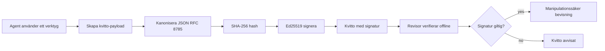
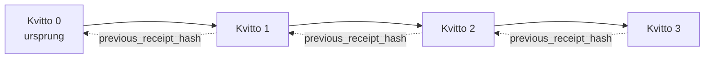

[Watch the lesson video: Securing AI Agents with Cryptographic Receipts](https://youtu.be/PLACEHOLDER_VIDEO_ID)

> _(Lektionsvideo och miniatyrbild kommer att läggas till av Microsofts innehållsteam efter sammanslagning, i linje med lektion 14 / 15-mönstret.)_

# Säkerställa AI-agenter med kryptografiska kvitton

## Introduktion

Denna lektion kommer täcka:

- Varför revisionsspår för AI-agenter är viktiga för regelefterlevnad, felsökning och förtroende.
- Vad ett kryptografiskt kvitto är och hur det skiljer sig från en osignerad loggrad.
- Hur man producerar ett signerat kvitto för ett verktygsanrop från en agent i ren Python.
- Hur man verifierar ett kvitto offline och upptäcker manipulation.
- Hur man kedjar kvitton så att borttagning eller omordning av ett kvitto bryter kedjan.
- Vad kvitton bevisar och vad de uttryckligen inte bevisar.

## Lärandemål

Efter att ha genomgått denna lektion kommer du kunna:

- Identifiera felmekanismer som motiverar kryptografiskt ursprung för agenters handlingar.
- Producera ett Ed25519-signerat kvitto över en kanonisk JSON-payload.
- Verifiera ett kvitto självständigt med endast avsändarens publika nyckel.
- Upptäcka manipulation genom att köra om verifiering på ett modifierat kvitto.
- Bygga en hash-kedjad sekvens av kvitton och förklara varför kedjan är viktig.
- Känna igen gränsen mellan vad kvitton bevisar (attribution, integritet, ordning) och vad de inte bevisar (riktigheten i handlingen, policyens rimlighet).

## Problemet: Din agents revisionsspår

Föreställ dig att du har driftsatt en AI-agent för Contoso Travel. Agenten läser kundförfrågningar, anropar ett flyg API för att söka alternativ och bokar platser på kundens vägnar. Förra kvartalet hanterade agenten 50 000 bokningar.

Idag kommer en revisor. De ställer en enkel fråga: "Visa mig vad din agent gjorde."

Du lämnar över dina loggfiler. Revisorn tittar på dem och ställer en svårare fråga: "Hur vet jag att dessa loggar inte har redigerats?"

Detta är audit trail-problemet. De flesta agentdriftsättningar idag förlitar sig på:

- **Applikationsloggar**: skrivna av agenten själv, redigerbara av vem som helst med filsystemstillgång.
- **Molnloggtjänster**: manipulationssäkra på plattformsnivå men bara om revisorn litar på plattformsoperatören.
- **Databastransaktionsloggar**: väl anpassade för databasändringar men inte för godtyckliga verktygsanrop.

Ingen av dessa kan svara på revisorns fråga utan att revisorn måste lita på någon (dig, din molnleverantör, din databashandel). För intern användning är det ofta acceptabelt. För reglerade arbetsbelastningar (finans, sjukvård, allt som omfattas av EU:s AI-förordning) är det det inte.

Kryptografiska kvitton löser detta genom att göra varje agenthandling självständigt verifierbar. Revisorn behöver inte lita på dig. De behöver bara din publika nyckel och kvittot självt.

## Vad är ett kryptografiskt kvitto?

Ett kvitto är ett JSON-objekt som registrerar vad en agent gjorde, signerat med en digital signatur.


```mermaid
flowchart LR
    A[Agent använder ett verktyg] --> B[Skapa kvitto-payload]
    B --> C[Kanonisera JSON RFC 8785]
    C --> D[SHA-256 hash]
    D --> E[Ed25519 signera]
    E --> F[Kvitto med signatur]
    F --> G[Revisor verifierar offline]
    G --> H{Signatur giltig?}
    H -- yes --> I[Manipulationssäker bevisning]
    H -- no --> J[Kvitto avvisat]
```

Ett minimalt kvitto ser ut så här:

```json
{
  "type": "agent.tool_call.v1",
  "agent_id": "contoso-travel-bot",
  "tool_name": "lookup_flights",
  "tool_args_hash": "sha256:a3f9c1...",
  "result_hash": "sha256:7b2e1d...",
  "policy_id": "contoso-travel-policy-v3",
  "timestamp": "2026-04-25T14:30:00Z",
  "sequence": 47,
  "previous_receipt_hash": "sha256:9d4e6a...",
  "signature": {
    "alg": "EdDSA",
    "sig": "c5af83...",
    "public_key": "8f3b2c..."
  }
}
```

Tre egenskaper gör jobbet:

1. **Signaturen**. Kvittot signeras av agentens gateway med en Ed25519-privat nyckel. Vem som helst med motsvarande publika nyckel kan verifiera signaturen offline. Manipulering av något fält gör signaturen ogiltig.

2. **Kanonisk kodning**. Innan signering serialiseras kvittot med JSON Canonicalization Scheme (JCS, RFC 8785). Detta säkerställer att två implementationer som producerar samma logiska kvitto genererar exakt identisk byte-utmatning. Utan kanonisering skulle olika JSON-serialiserare ge olika signaturer för samma innehåll.

3. **Hash-kedjning**. Fältet `previous_receipt_hash` länkar varje kvitto till det föregående. Att ta bort eller ordna om ett kvitto bryter varje kvitto som kommer efter. Manipulering blir synlig på kedjenivå även om individuella signaturer bypassas.

Tillsammans ger dessa egenskaper tre garantier:

- **Attribution**: denna nyckel signerade detta innehåll.
- **Integritet**: innehållet har inte ändrats sedan signering.
- **Ordning**: detta kvitto kom efter det kvittot i kedjan.

## Producera ett kvitto i Python

Du behöver inget speciellt bibliotek för att producera ett kvitto. De kryptografiska primitiva funktionerna är allmänt tillgängliga och logiken är några tiotal rader Python.

De praktiska övningarna i `code_samples/18-signed-receipts.ipynb` går igenom hela flödet. Sammanfattningsversionen:

```python
import json
import hashlib
import base64
from nacl import signing
from jcs import canonicalize  # RFC 8785 kanonisk JSON

def b64url_nopad(data: bytes) -> str:
    return base64.urlsafe_b64encode(data).decode("ascii").rstrip("=")

def sha256_canonical(obj) -> str:
    """SHA-256 of a Python object's JCS-canonical JSON form."""
    return f"sha256:{hashlib.sha256(canonicalize(obj)).hexdigest()}"

# Generera eller ladda en signeringsnyckel (i produktion, lagra i ett nyckelskåp)
signing_key = signing.SigningKey.generate()
verify_key = signing_key.verify_key

# Bygg kvitto-payloaden (ingen signatur än)
tool_args = {"origin": "SYD", "destination": "LAX"}
tool_result = [{"flight": "QF11", "price": 1850, "stops": 0}]

payload = {
    "type": "agent.tool_call.v1",
    "agent_id": "contoso-travel-bot",
    "tool_name": "lookup_flights",
    "tool_args_hash": sha256_canonical(tool_args),
    "result_hash": sha256_canonical(tool_result),
    "policy_id": "contoso-travel-policy-v3",
    "timestamp": "2026-04-25T14:30:00Z",
    "sequence": 0,
    "previous_receipt_hash": None,
}

# Kanonalisera, hasha, signera.
canonical_bytes = canonicalize(payload)
message_hash = hashlib.sha256(canonical_bytes).digest()
signature_bytes = signing_key.sign(message_hash).signature

# Bifoga ett strukturerat signaturobjekt.
receipt = {
    **payload,
    "signature": {
        "alg": "EdDSA",
        "sig": b64url_nopad(signature_bytes),
        "public_key": b64url_nopad(bytes(verify_key)),
    },
}
```

Det är hela signeringsrörelsen. Övningarna i notebooken går igenom varje steg.

## Verifiera ett kvitto och upptäcka manipulation

Verifiering är den omvända operationen:

```python
import base64
import hashlib
from nacl import signing
from nacl.exceptions import BadSignatureError
from jcs import canonicalize

def b64url_decode(s: str) -> bytes:
    padding = "=" * ((4 - len(s) % 4) % 4)
    return base64.urlsafe_b64decode(s + padding)

def verify_receipt(receipt: dict) -> bool:
    # Signaturen är ett strukturerat objekt: {"alg", "sig", "public_key"}.
    sig_obj = receipt.get("signature")
    if not sig_obj or sig_obj.get("alg") != "EdDSA":
        return False

    # Återskapa nyttolasten som faktiskt signerades (allt utom signaturen).
    payload = {k: v for k, v in receipt.items() if k != "signature"}

    canonical_bytes = canonicalize(payload)
    message_hash = hashlib.sha256(canonical_bytes).digest()

    try:
        verify_key = signing.VerifyKey(b64url_decode(sig_obj["public_key"]))
        verify_key.verify(message_hash, b64url_decode(sig_obj["sig"]))
        return True
    except BadSignatureError:
        return False
```

Denna funktion tar ett kvitto och returnerar `True` om signaturen är giltig, annars `False`. Ingen nätverksanrop, ingen tjänsteberoende, inget förtroende för tredje part krävs.

För att se manipulationsupptäckt i praktiken, går notebooken igenom:

1. Producera ett giltigt kvitto och bekräfta att det verifieras.
2. Modifiera en byte i fältet `tool_args_hash`.
3. Köra om verifieringen och se att den misslyckas.

Detta är den praktiska demonstrationen att kvitton är manipulering-synliga: varje ändring, hur liten som helst, bryter signaturen.

## Kedja kvitton för flerstegsagenter

Ett enda signerat kvitto skyddar en handling. En kedja av kvitton skyddar en sekvens.


```mermaid
flowchart LR
    R0[Kvitto 0<br/>ursprung] --> R1[Kvitto 1]
    R1 --> R2[Kvitto 2]
    R2 --> R3[Kvitto 3]
    R1 -. previous_receipt_hash .-> R0
    R2 -. previous_receipt_hash .-> R1
    R3 -. previous_receipt_hash .-> R2
```

Varje kvitto registrerar hashen av föregående kvitto. För att tyst ta bort kvitto 2 skulle en angripare behöva antingen:

- Modifiera fältet `previous_receipt_hash` i kvitto 3 (bryter kvitto 3:s signatur), ELLER
- Förfalska en ny signatur på ett modifierat kvitto 3 (kräver agentens privata nyckel).

Om den privata nyckeln är i en hårdvarunyckelvalv och du publicerar den publika nyckeln med varje kvitto är ingen av attackerna möjlig utan upptäckt.

Notebooken går igenom:

1. Skapa en kedja med tre kvitton.
2. Verifiera att varje kvittos `previous_receipt_hash` matchar den faktiska hash-värdet av föregående kvitto.
3. Manipulera ett kvitto i mitten och se kedjan brytas exakt där.

Så här producerar du ett revisionsspår som en extern revisor kan verifiera utan att lita på dig.

## Vad kvitton bevisar (och vad de inte bevisar)

Detta är det viktigaste avsnittet i denna lektion. Kvitton är kraftfulla men deras kraft är begränsad.

**Kvitton bevisar tre saker:**

1. **Attribution**: en specifik nyckel signerade en specifik payload.
2. **Integritet**: payloaden har inte ändrats sedan signering.
3. **Ordning**: detta kvitto kom efter det kvittot i hash-kedjan.

**Kvitton bevisar INTE:**

1. **Riktighet**: att agentens handling var rätt handling. Ett kvitto kan signeras för ett felaktigt svar lika tydligt som för ett rätt svar.
2. **Policyefterlevnad**: att policyn som refereras i `policy_id` faktiskt utvärderades, eller att den skulle ha tillåtit denna handling om den kontrollerats. Kvittot redovisar vad som påstods, inte vad som verkställdes.
3. **Identitet bortom nyckeln**: kvittot säger "denna nyckel signerade detta innehåll." Det säger inte "denna människa godkände detta." Att koppla en nyckel till en person eller organisation kräver separat identitetsinfrastruktur (en katalog, ett offentligt nyckelregister etc.).
4. **Sanningshalt i indata**: om agenten får en manipulerad prompt och agerar på den, registrerar kvittot handlingen korrekt. Kvitton är efter inputvalidering, inte en ersättning för den.

Denna gräns är viktig av två anledningar:

- Den talar om vad kvitton är användbara för: göra agentbeteende revisionsbart och manipulationssynligt, även över organisationsgränser.
- Den talar om vilka ytterligare lager du fortfarande behöver: inputvalidering (Lektion 6), policyverkställande (kort nämnt nedan) och identitetsinfrastruktur (utanför denna lektions omfattning).

Ett vanligt misstag är att anta att "vi har kvitton" betyder "vi är styrda." Det gör det inte. Kvitton är en grund. Styrning är systemet du bygger ovanpå.

## Referenser för produktion

Python-koden i denna lektion är avsiktligt minimal så att du kan läsa varje rad och förstå exakt vad som händer. I produktion har du två alternativ:

1. **Bygg direkt på de kryptografiska primitiva funktionerna.** De 50 rader du såg ovan är tillräckliga för många användningsfall. PyNaCl (Ed25519) och paketet `jcs` (kanonisk JSON) är väl underhållna och granskade bibliotek.

2. **Använd ett produktionsbibliotek för kvitton.** Flera öppen-källkodsprojekt implementerar samma mönster med ytterligare funktioner (nyckelrotation, batchverifiering, JWK Set-distribution, integration med policymotorer):
   - Kvittoformatet som används i denna lektion följer en IETF Internet-Draft (`draft-farley-acta-signed-receipts`) som för närvarande är i standardiseringsprocess.
   - Microsoft Agent Governance Toolkit komponerar kvitton med Cedar-baserade policylösningar; se Tutorial 33 i det förrådet för ett komplett exempel.
   - Paketen `protect-mcp` (npm) och `@veritasacta/verify` (npm) erbjuder en Node-baserad implementation av kvittosignering och offline-verifiering, avsedda för att omsluta vilken MCP-server som helst med ett manipulationssäkert revisionsspår.
   - **[nobulex](https://github.com/arian-gogani/nobulex)** Python SDK (`pip install nobulex`) tillhandahåller samma Ed25519 + JCS signeringsmönster i Python med LangChain och CrewAI-integrationer, inklusive publicerade korsvaliderings testvektorer och en compliance-mappning bidragen via [OWASP PR #2210](https://github.com/OWASP/CheatSheetSeries/pull/2210).

Beslutet mellan att bygga själv och använda ett bibliotek speglar beslutet mellan att skriva ett eget JWT-bibliotek och använda ett testat: båda är rimliga; biblioteket sparar tid och minskar revisionsytan; egenbyggt tvingar dig att förstå varje primitiv. Denna lektion lär ut egenbyggd väg så att du har grunden för båda valen.

## Kunskapskontroll

Testa din förståelse innan du går vidare till övningen.

**1. Ett kvitto är signerat med agentens privata Ed25519-nyckel. Revisorn har endast den publika nyckeln. Kan revisorn verifiera kvittot offline?**

<details>
<summary>Svar</summary>

Ja. Ed25519-verifiering kräver bara den publika nyckeln och de signerade bytena. Inget nätverksanrop, ingen tjänsteberoende. Detta är egenskapen som gör kvitton användbara i luftgapade, multiorganisatoriska eller lågt förtroende-revisionsmiljöer.
</details>

**2. En angripare ändrar fältet `policy_id` i ett kvitto för att påstå att det styrdes av en mer tillåtande policy. Signaturen var över originalpayloaden. Vad händer vid verifiering?**

<details>
<summary>Svar</summary>

Verifieringen misslyckas. Signaturen beräknades över de kanoniska bytena av originalpayloaden; modifiering av något fält ändrar de kanoniska bytena, vilket ändrar SHA-256 hashen, vilket gör signaturen ogiltig. Angriparen skulle behöva den privata nyckeln för att producera en ny giltig signatur, vilket de inte har.
</details>

**3. Varför inkluderar kvittot en `tool_args_hash` och en `result_hash` istället för de råa argumenten och resultatet?**

<details>
<summary>Svar</summary>

Två skäl. För det första kan kvittot behöva arkiveras eller skickas i miljöer där det är problematiskt att läcka rått innehåll (personuppgifter, affärsdata). Hashing håller kvittot litet och innehållet privat; revisorn verifierar att hashen matchar en separat lagrad kopia av det faktiska innehållet. För det andra har hashar fast storlek; ett kvitto med hashar är storleksbegränsat oavsett hur stora input och output var.
</details>

**4. Fältet `previous_receipt_hash` länkar varje kvitto till dess föregångare. Om en angripare tyst raderar ett kvitto mitt i en kedja, vad blir ogiltigt?**

<details>
<summary>Svar</summary>

Varje kvitto som kom efter det raderade. Deras `previous_receipt_hash`-fält matchar inte längre den faktiska kedjan (eftersom kvittot de refererade inte längre finns, eller kedjan pekar nu på en annan föregångare). För att dölja raderingen skulle angriparen behöva skriva om signaturen på varje senare kvitto, vilket kräver den privata nyckeln.
</details>

**5. Ett kvitto verifieras rent. Bevisar det att agentens handling var korrekt, rimlig eller policyföljande?**

<details>
<summary>Svar</summary>

Nej. Ett giltigt kvitto bevisar tre saker: attribution (denna nyckel signerade detta innehåll), integritet (innehållet har inte ändrats) och ordning (detta kvitto kom efter det kvittot). Det bevisar INTE att handlingen var korrekt, att policyn angiven i `policy_id` faktiskt utvärderades, eller att agenten följde varje regel. Kvitton gör agentbeteenden revisionsbara, inte nödvändigtvis korrekta. Detta är den viktigaste gränsen i lektionen.
</details>

## Övning

Öppna `code_samples/18-signed-receipts.ipynb` och slutför alla fyra sektioner:

1. **Sektion 1**: Signera ditt första kvitto och verifiera det.
2. **Sektion 2**: Manipulera kvittot och observera verifieringsfel.
3. **Sektion 3**: Bygg en kedja med tre kvitton och verifiera kedjans integritet.
4. **Sektion 4**: Applicera mönstret på en agent byggd med Microsoft Agent Framework: omslut ett verktygsanrop med kvittosignering, verifiera sedan kvittot självständigt.
**Stretchutmaning 1:** utöka kvittoschemat med ett ytterligare fält efter eget val (till exempel ett förfrågnings-ID för spårning), uppdatera den kanoniska signeringslogiken för att inkludera det, och bekräfta att kvittot fortfarande kan verifieras med full rundresa. Ändra sedan fältet efter signering och bekräfta att verifieringen misslyckas. Detta tvingar dig att förstå hur varje byte av den kanoniska kodningen bidrar till signaturen.

**Stretchutmaning 2:** SHA-256-hasha två av dina kvitton tillsammans (konkatenera deras kanoniska bytes i en deterministisk ordning) och bädda in den resulterande digesten som ett nytt fält i ett tredje kvitto innan du signerar det. Verifiera att alla tre kvitton fortfarande kan verifieras med full rundresa. Du har just byggt ett ettstegs inklusionsbevis: vem som helst med det tredje kvittot kan bevisa att de två första existerade vid tiden för signeringen utan att behöva avslöja deras innehåll. Detta är mönstret som selektivt-disclosure-kvitton använder i skala (Merkle-åtaganden, RFC 6962).

## Slutsats

Kryptografiska kvitton ger AI-agenter en revisionskedja som är:

- **Oberoende verifierbar**: vilken part som helst med den publika nyckeln kan verifiera, utan tjänsteberoende.
- **Manipulationssäkert**: varje ändring gör signaturen ogiltig.
- **Portabelt**: ett kvitto är en liten JSON-fil; den kan arkiveras, överföras och verifieras var som helst.
- **Standardanpassat**: byggt på Ed25519 (RFC 8032), JCS (RFC 8785) och SHA-256, alla välanvända primitiva funktioner.

De är inte en ersättning för indata-validering, policy-implementering eller identitetsinfrastruktur. De utgör en grund för dessa lager. När du distribuerar agenter i reglerade arbetsbelastningar, flerorganisationsarbetsflöden eller i miljöer där en framtida revisor inte kan förutsättas lita på dig, är kvitton det sätt du gör revisionskedjan ärlig.

Den viktigaste lärdomen: kvitton bevisar vem som sa vad, när. De bevisar inte att det som sades var sant eller rätt. Håll fast vid den skillnaden. Det är skillnaden mellan ett ärligt ursprungssystem och ett vilseledande.

## Checklista för produktion

När du är redo att gå vidare från denna lektion till att distribuera kvittosignerade agenter i en riktig miljö:

- [ ] **Flytta signeringsnyckeln från utvecklarens laptop.** Använd Azure Key Vault, AWS KMS eller en hårdvarusäkerhetsmodul. Den privata nyckeln som signerar dina kvitton får aldrig finnas i versionskontroll eller i klartext på applikationsmaskiner.
- [ ] **Publicera den publika verifieringsnyckeln.** Revisorer behöver den för offline-verifiering. Standardmönstret är en JWK Set på en välkänd URL (RFC 7517), t.ex. `https://your-org.example.com/.well-known/agent-keys.json`.
- [ ] **Fäst kedjan externt.** Skriv periodiskt den senaste kedjehuvudets hash till en transparenslogg (Sigstore Rekor, RFC 3161 tidsstämpelmyndighet eller ett andra internt system) så att en extern part kan bekräfta "denna kedja existerade vid denna tidpunkt."
- [ ] **Lagra kvitton oföränderliga.** Append-only blob-lagring (Azure Storage med oföränderlighetspolicys, AWS S3 Object Lock) förhindrar att en insider skriver om historiken på lagringsnivån.
- [ ] **Bestäm om retention.** Många compliance-regimer kräver lagring i flera år. Planera för kvittotillväxt (varje kvitto är ~500 bytes; en agent som gör 10 000 anrop per dag producerar ~1,8 GB per år).
- [ ] **Dokumentera vad kvitton inte täcker.** Kvitton bevisar attribution, integritet och ordning. Din körbok ska uttryckligen lista vilka ytterligare kontroller (indata-validering, policy-implementering, hastighetsbegränsning, identitetsinfrastruktur) som finns tillsammans med kvitton i din styrningsposition.

### Fler frågor om att säkra AI-agenter?

Gå med i [Microsoft Foundry Discord](https://aka.ms/ai-agents/discord) för att träffa andra som lär sig, delta i öppettider och få svar på dina frågor om AI-agenter.

## Utöver denna lektion

Den här lektionen täcker enkel-kvitto-signering och hash-kedjade sekvenser. Samma primitiva funktioner bygger ihop flera mer avancerade mönster som du kan stöta på när din styrningsposition mognar:

- **Selektiv avslöjande.** När ett kvittos fält är oberoende åtagna (Merkle-träd enligt RFC 6962), kan du avslöja specifika fält för specifika revisorer och bevisa att resten är oförändrade utan att exponera dem. Användbart när samma kvitto måste uppfylla både en omfattande revision (som vill ha fullständighet) och dataminimeringsregler som GDPR (vilka vill att revisorn ser så lite som möjligt).
- **Återkallelse av kvitto.** Om en signeringsnyckel komprometteras behöver du ett sätt att markera alla kvitton signerade med den nyckeln som opålitliga från en viss tidpunkt och framåt. Standardmönster: kortlivade signeringsnycklar plus en publicerad återkallelse-lista, alternativt en transparenslogg med återkallelseposter.
- **Bilaterala / split-signatur-kvitton.** Vissa implementationer delar upp den signerade nyttolasten i för-exekveringsdel (`authorization_*`) och efter-exekveringsdel (`result_*`) med oberoende signaturer, användbart när auktorisationsbeslutet och det observerade resultatet produceras av olika aktörer eller vid olika tidpunkter. Detta bygger additivt på kvittoschemat som lärs ut i denna lektion.
- **Sammansättning av nyttolast.** Ett kvitto förseglar vilka bytes du än lägger i `result_hash`. Verkliga nyttolaster är ofta rikare än ett enkelt verktygsanropsresultat: förbeslutsresonemang (modellprediktion, övervägda alternativ, bevis och dess fullständighet, riskpostur, ansvarskedja, portgångens utfall) kan allt leva i nyttolasten förseglad av ett enda kvitto. Detta håller kvittoschemat minimalt samtidigt som nyttolastscheman får utvecklas domän för domän.
- **Överensstämmelse mellan implementationer.** Flera oberoende implementationer av samma kvittoschema (Python, TypeScript, Rust, Go) verifierar överensstämmelse mot delade testvektorer. Om du bygger din egen implementation bekräftar validering mot publicerade vektorer tråds-kompatibilitet.
- **Migration efter kvantdatorer.** Ed25519 är idag mycket utbrett men är inte kvant-resistent. Kvittoschemat är algoritmagilt: fältet `signature.alg` kan bära `ML-DSA-65` (NIST:s postkvant-signaturstandard) när du behöver migrera. Planera för en övergångsperiod där kvitton är dubbelsignerade.

## Ytterligare resurser

- <a href="https://datatracker.ietf.org/doc/draft-farley-acta-signed-receipts/" target="_blank">IETF Internet-Draft: Signed Decision Receipts for Machine-to-Machine Access Control</a>
- <a href="https://learn.microsoft.com/azure/ai-studio/responsible-use-of-ai-overview" target="_blank">Ansvarsfull AI-översikt (Azure AI)</a>
- <a href="https://datatracker.ietf.org/doc/html/rfc8032" target="_blank">RFC 8032: Edwards-Curve Digital Signature Algorithm (EdDSA)</a>
- <a href="https://datatracker.ietf.org/doc/html/rfc8785" target="_blank">RFC 8785: JSON Canonicalization Scheme (JCS)</a>
- <a href="https://datatracker.ietf.org/doc/html/rfc6962" target="_blank">RFC 6962: Certificate Transparency</a> (Merkle-trädskonstruktion som används av selektivt-disclosure-kvitton)
- <a href="https://github.com/microsoft/agent-governance-toolkit/blob/main/docs/tutorials/33-offline-verifiable-receipts.md" target="_blank">Microsoft Agent Governance Toolkit, Tutorial 33: Offline-Verifiable Decision Receipts</a>
- <a href="https://github.com/ScopeBlind/agent-governance-testvectors" target="_blank">Overensstämmelse testvektorer för implementationer</a> för kvittoschemat som används i denna lektion (Apache-2.0)
- <a href="https://pynacl.readthedocs.io/" target="_blank">PyNaCl-dokumentation</a> (Ed25519 i Python)

## Föregående lektion

[Bygga datoranvändningsagenter (CUA)](../15-browser-use/README.md)

---

<!-- CO-OP TRANSLATOR DISCLAIMER START -->
**Ansvarsfriskrivning**:
Detta dokument har översatts med hjälp av AI-översättningstjänsten [Co-op Translator](https://github.com/Azure/co-op-translator). Även om vi strävar efter noggrannhet, var vänlig notera att automatiska översättningar kan innehålla fel eller brister. Det ursprungliga dokumentet på dess modersmål bör betraktas som den auktoritativa källan. För kritisk information rekommenderas professionell mänsklig översättning. Vi ansvarar inte för några missförstånd eller feltolkningar som uppstår till följd av användningen av denna översättning.
<!-- CO-OP TRANSLATOR DISCLAIMER END -->