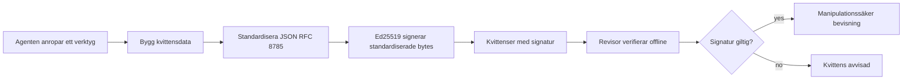
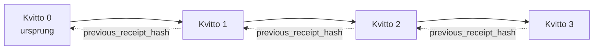

[Titta på lektionsvideon: Säkerställa AI-agenter med kryptografiska kvitton](https://youtu.be/PLACEHOLDER_VIDEO_ID)

> _(Lektionsvideo och miniatyr ska läggas till av Microsofts innehållsteam efter sammanslagning, med mönster enligt lektion 14 / 15.)_

# Säkerställa AI-agenter med kryptografiska kvitton

## Introduktion

Denna lektion kommer att täcka:

- Varför revisionsspår för AI-agenter är viktiga för efterlevnad, felsökning och förtroende.
- Vad ett kryptografiskt kvitto är och hur det skiljer sig från en osignerad loggrad.
- Hur man producerar ett signerat kvitto för en agents verktygsanrop i ren Python.
- Hur man verifierar ett kvitto offline och upptäcker manipulation.
- Hur man kedjar kvitton så att borttagning eller omordning av ett bryter kedjan.
- Vad kvitton bevisar och vad de uttryckligen inte bevisar.

## Lärandemål

Efter att ha avslutat denna lektion kommer du att kunna:

- Identifiera feltyper som motiverar kryptografisk proveniens för agentåtgärder.
- Producera ett Ed25519-signerat kvitto över en kanonisk JSON-payload.
- Verifiera ett kvitto oberoende med endast signerarens offentliga nyckel.
- Upptäcka manipulation genom att köra om verifieringen på ett modifierat kvitto.
- Bygga en haschkedjad sekvens av kvitton och förklara varför kedjan är viktig.
- Känna igen gränsen mellan vad kvitton bevisar (attribution, integritet, ordning) och vad de inte gör (riktigheten av åtgärden, giltigheten av policyn).

## Problemet: Din agents revisionsspår

Föreställ dig att du har distribuerat en AI-agent för Contoso Travel. Agenten läser kundförfrågningar, anropar en flyg-API för att leta upp alternativ och bokar platser för kundens räkning. Förra kvartalet behandlade agenten 50 000 bokningar.

Idag anländer en revisor. Hen ställer en enkel fråga: "Visa mig vad din agent gjorde."

Du överlämnar dina loggfiler. Revisorn tittar på dem och ställer den svårare frågan: "Hur vet jag att dessa loggar inte har redigerats?"

Det här är revisionsspårsproblemet. De flesta agentdistribueringar idag förlitar sig på:

- **Applikationsloggar**: skrivna av agenten själv, redigerbara av vem som helst med filsystemstillgång.
- **Molnloggtjänster**: manipulation synlig på plattformsnivå men bara om revisorn litar på plattformsoperatören.
- **Databastransaktionsloggar**: väl lämpade för databaskonfigurationer men inte för godtyckliga verktygsanrop.

Ingen av dessa kan svara på revisorns fråga utan att kräva att revisorn litar på någon (dig, din molnleverantör, din databastillverkare). För intern användning är det förtroendet ofta acceptabelt. För reglerade arbetsbelastningar (finans, vård, allt som omfattas av EU:s AI-lag) är det inte det.

Kryptografiska kvitton löser detta genom att göra varje agentåtgärd oberoende verifierbar. Revisorn behöver inte lita på dig. De behöver bara din offentliga nyckel och kvittot självt.

## Vad är ett kryptografiskt kvitto?

Ett kvitto är ett JSON-objekt som registrerar vad en agent gjorde, signerat med en digital signatur.


```mermaid
flowchart LR
    A[Agenten anropar ett verktyg] --> B[Bygg kvittensdata]
    B --> C[Standardisera JSON RFC 8785]
    C --> E[Ed25519 signerar standardiserade bytes]
    E --> F[Kvittenser med signatur]
    F --> G[Revisor verifierar offline]
    G --> H{Signatur giltig?}
    H -- yes --> I[Manipulationssäker bevisning]
    H -- no --> J[Kvittens avvisad]
```

Ett minimalt kvitto ser ut så här:

```json
{
  "type": "agent.tool_call.v1",
  "agent_id": "contoso-travel-bot",
  "tool_name": "lookup_flights",
  "tool_args_hash": "sha256:a3f9c1...",
  "result_hash": "sha256:7b2e1d...",
  "policy_id": "contoso-travel-policy-v3",
  "timestamp": "2026-04-25T14:30:00Z",
  "sequence": 47,
  "previous_receipt_hash": "sha256:9d4e6a...",
  "signature": {
    "alg": "EdDSA",
    "sig": "c5af83...",
    "public_key": "8f3b2c..."
  }
}
```

Tre egenskaper utför arbetet:

1. **Signaturen**. Kvittot signeras av agentens gateway med en Ed25519-privat nyckel. Vem som helst med motsvarande offentliga nyckel kan verifiera signaturen offline. Manipulation av något fält ogiltigförklarar signaturen.

2. **Kanonisk kodning**. Innan signering serialiseras kvittot med JSON Canonicalization Scheme (JCS, RFC 8785). Detta säkerställer att två implementationer som producerar samma logiska kvitto ger byte-identisk output. Utan kanonisering skulle olika JSON-serialiserare ge olika signaturer för samma innehåll.

3. **Hash-kedjning**. Fältet `previous_receipt_hash` länkar varje kvitto till det föregående. Att ta bort eller omordna ett kvitto bryter varje efterföljande kvitto. Manipulation blir synlig på kedjenivå även om enskilda signaturer kringgås.

Tillsammans ger dessa egenskaper tre garantier:

- **Attribution**: denna nyckel undertecknade detta innehåll.
- **Integritet**: innehållet har inte ändrats sedan signering.
- **Ordning**: detta kvitto kom efter det kvittot i kedjan.

## Producera ett kvitto i Python

Du behöver inte något speciellt bibliotek för att producera ett kvitto. De kryptografiska primitiva finns allmänt tillgängliga och logiken är ett par dussin rader Python.

Övningarna i `code_samples/18-signed-receipts.ipynb` går igenom hela flödet. Sammanfattningsversionen:

```python
import json
import hashlib
import base64
from nacl import signing
from jcs import canonicalize  # RFC 8785 kanonisk JSON

def b64url_nopad(data: bytes) -> str:
    return base64.urlsafe_b64encode(data).decode("ascii").rstrip("=")

def sha256_canonical(obj) -> str:
    """SHA-256 of a Python object's JCS-canonical JSON form."""
    return f"sha256:{hashlib.sha256(canonicalize(obj)).hexdigest()}"

# Generera eller ladda en signeringsnyckel (i produktion, lagra i ett nyckelvalv)
signing_key = signing.SigningKey.generate()
verify_key = signing_key.verify_key

# Bygg mottagningsdata (ingen signatur ännu)
tool_args = {"origin": "SYD", "destination": "LAX"}
tool_result = [{"flight": "QF11", "price": 1850, "stops": 0}]

payload = {
    "type": "agent.tool_call.v1",
    "agent_id": "contoso-travel-bot",
    "tool_name": "lookup_flights",
    "tool_args_hash": sha256_canonical(tool_args),
    "result_hash": sha256_canonical(tool_result),
    "policy_id": "contoso-travel-policy-v3",
    "timestamp": "2026-04-25T14:30:00Z",
    "sequence": 0,
    "previous_receipt_hash": None,
}

# Kanonisera och signera JCS byte direkt. PureEdDSA hashar internt.
canonical_bytes = canonicalize(payload)
signature_bytes = signing_key.sign(canonical_bytes).signature

# Fäst ett strukturerat signaturobjekt.
receipt = {
    **payload,
    "signature": {
        "alg": "EdDSA",
        "sig": b64url_nopad(signature_bytes),
        "public_key": b64url_nopad(bytes(verify_key)),
    },
}
```

Det är hela signeringskedjan. Övningarna i notebooken går igenom varje steg.

## Verifiera ett kvitto och upptäcka manipulation

Verifiering är den inversa operationen:

```python
import base64
import hashlib
from nacl import signing
from nacl.exceptions import BadSignatureError
from jcs import canonicalize

def b64url_decode(s: str) -> bytes:
    padding = "=" * ((4 - len(s) % 4) % 4)
    return base64.urlsafe_b64decode(s + padding)

def verify_receipt(receipt: dict) -> bool:
    # Signaturen är ett strukturerat objekt: {"alg", "sig", "public_key"}.
    sig_obj = receipt.get("signature")
    if not sig_obj or sig_obj.get("alg") != "EdDSA":
        return False

    # Återskapa nyttolasten som faktiskt signerades (allt utom signaturen).
    payload = {k: v for k, v in receipt.items() if k != "signature"}

    canonical_bytes = canonicalize(payload)

    try:
        verify_key = signing.VerifyKey(b64url_decode(sig_obj["public_key"]))
        verify_key.verify(canonical_bytes, b64url_decode(sig_obj["sig"]))
        return True
    except BadSignatureError:
        return False
```

Denna funktion tar ett kvitto och returnerar `True` om signaturen är giltig, `False` annars. Ingen nätverksanrop, inget tjänsteberoende, inget förtroende krävs för någon tredje part.

För att se detektering av manipulation i praktiken går notebooken igenom:

1. Producera ett giltigt kvitto och bekräfta att det verifieras.
2. Modifiera en byte i fältet `tool_args_hash`.
3. Köra verifieringen igen och se att den misslyckas.

Detta är den praktiska demonstrationen att kvitton är manipulationssäkra: varje ändring, hur liten den än är, bryter signaturen.

## Kedja kvitton för flerstegsagenter

Ett enskilt signerat kvitto skyddar en åtgärd. En kedja av kvitton skyddar en sekvens.


```mermaid
flowchart LR
    R0[Kvitto 0<br/>ursprung] --> R1[Kvitto 1]
    R1 --> R2[Kvitto 2]
    R2 --> R3[Kvitto 3]
    R1 -. previous_receipt_hash .-> R0
    R2 -. previous_receipt_hash .-> R1
    R3 -. previous_receipt_hash .-> R2
```

Varje kvitto registrerar hashen av föregående kvitto. För att tyst ta bort kvitto 2 måste en angripare antingen:

- Modifiera kvitto 3:s fält `previous_receipt_hash` (bryter kvitto 3:s signatur), ELLER
- Falsa en ny signatur på ett modifierat kvitto 3 (kräver agentens privata nyckel).

Om den privata nyckeln är i ett hårdvarunyttjanderum och du publicerar den publika nyckeln med varje kvitto, är varken den ena eller den andra attacken möjlig utan upptäckt.

Notebooken går igenom:

1. Bygga en kedja av tre kvitton.
2. Verifiera att varje kvittos `previous_receipt_hash` matchar den faktiska hashen av föregående kvitto.
3. Manipulera ett kvitto i mitten och se kedjan brytas exakt där.

Så här producerar du ett revisionsspår som en extern revisor kan verifiera utan att behöva lita på dig.

## Vad kvitton bevisar (och vad de inte gör)

Detta är den viktigaste delen av denna lektion. Kvitton är kraftfulla men deras kraft är begränsad.

**Kvitton bevisar tre saker:**

1. **Attribution**: en specifik nyckel har signerat en specifik payload.
2. **Integritet**: payloaden har inte ändrats sedan signering.
3. **Ordning**: detta kvitto kom efter det kvittot i hashkedjan.

**Kvitton BEVISAR INTE:**

1. **Korrekthet**: att agentens åtgärd var rätt åtgärd. Ett kvitto kan signeras för ett felaktigt svar lika rent som för ett rätt svar.
2. **Efterlevnad av policy**: att policyn som refereras i `policy_id` faktiskt utvärderades, eller att den skulle ha tillåtit denna åtgärd om den kontrollerades. Kvittot registrerar vad som påstods, inte vad som verkställdes.
3. **Identitet bortom nyckeln**: kvittot säger "denna nyckel signade detta innehåll." Det säger inte "denna människa auktoriserade detta." Koppling av en nyckel till en person eller organisation kräver separat identitetsinfrastruktur (en katalog, ett offentligt nyckelregister, etc.).
4. **Sanningshalt i insatsdata**: om agenten får en manipulerad prompt och agerar på den, registrerar kvittot åtgärden troget. Kvitton är nedströms validering av indata, inte en ersättning för den.

Denna gräns är viktig av två skäl:

- Den berättar vad kvitton är användbara för: att göra agentbeteenden granskbara och manipulationssäkra, även över organisatoriska gränser.
- Den berättar vilka ytterligare lager du fortfarande behöver: validering av indata (Lektion 6), policyutövning (nära beskrivs nedan) och identitetsinfrastruktur (utanför scope för denna lektion).

Ett vanligt misstag är att anta att "vi har kvitton" betyder "vi är styrda." Det gör det inte. Kvitton är en grund. Styrning är systemet du bygger ovanpå.

## Bevisa att en människa godkände exakt åtgärd

Punkt 3 ovan förtjänar en egen sektion: ett åtgärdskvitto säger "denna nyckel signade detta innehåll," aldrig "en människa auktoriserade detta." För högriskåtgärder (återbetalningar, raderingar, banköverföringar) kräver styrningsramverk i ökande grad just det saknade uttalandet, och det är producerbart med samma primitiva som du redan byggde in i denna lektion.

Uppföljningsnotebooken `code_samples/human-authorization-receipts.ipynb` lägger till en andra kvittotyp, `human.approval.v1`, i samma kuvertform som lektionens kvitton (en typad payload signerad med Ed25519 över dess kanoniska JCS-bytes, med `signature`-objektet utanför de signerade byten). En namngiven godkännare signerar **hela den kanoniska åtgärden och dess digest** före exekvering; agentens åtgärdskvitto bär **samma åtgärdsdigest** och en `parent_approval_ref`, `receipt_hash` för godkännandet, samma konvention som `previous_receipt_hash` i kedjan du byggde ovan. En `verify_chain` går över båda artefakterna under **separata fastställda nyckelregister** (godkännarnycklar vs agentnycklar), så kodvägen är delad men myndigheterna aldrig.

Egenskapen detta ger, uttryckt noggrant: *människan godkände denna exakta åtgärd, och agenten utförde exakt den godkända åtgärden.* Notebookens avvisningsscenarier är vad som gör egenskapen verklig snarare än påstådd:

- den klassiska uppsättningen: manipulation, förvirrad ombud, uppspelning, förfalskade nycklar på båda sidor, malformed input;
- **gammal auktoritet**: en signatur som fortfarande verifierar men ändå avvisas eftersom politiken ändrats, godkännarnyckeln roterades bort från den fastställda registret, eller godkännandet gick ut före exekveringen;
- **digest-utbyte**: ett giltigt signerat åtgärdskvitto som pekar på ett *riktigt* godkännande som binder en *annan* kanonisk åtgärd.

Varje fel leder till avvisande med en distinkt anledning, så en revisor som läser ett avslag kan se om auktoriteten gick ut eller om den utförda åtgärden ändrades. Reglen som notebooken lär ut: ett signerat godkännande är inte auktoritet i sig. Auktoritet finns bara om båda kvittona fortfarande binder till samma kanoniska åtgärd vid exekvering. Mänskliga-godkännande-kvittot är en utbildande sammansättning definierad av denna lektion, inte en kvittotyp definierad i `draft-farley-acta-signed-receipts`.

## Produktionsreferenser

Python-koden i denna lektion är avsiktligt minimal så att du kan läsa varje rad och förstå exakt vad som händer. I produktion har du två alternativ:

1. **Bygg direkt på de kryptografiska primitiva.** De 50 rader du såg ovan räcker för många användningsfall. PyNaCl (Ed25519) och paketet `jcs` (kanoniskt JSON) är väl underhållna och granskade bibliotek.

2. **Använd ett produktionskvittobibliotek.** Flera öppen källkod-projekt implementerar samma mönster med extra funktioner (nyckelrotation, batchverifiering, JWK Set-distribution, integration med policy-motorer):
   - Signeringskedjan använder JCS och signatur-omfångskonventioner i en självständig IETF Internet-Draft ([`draft-farley-acta-signed-receipts`](https://datatracker.ietf.org/doc/draft-farley-acta-signed-receipts/), version 02). Denna lektions platta utbildande kvitto skiljer sig från draftens `{payload, signature}`-kuvert och presenteras inte som en konform implementation. Draften publicerar en delad konformitetssvit ([agent-governance-testvectors](https://github.com/ScopeBlind/agent-governance-testvectors)) för implementationer som riktar in sig på dess tråformat.
   - Microsoft Agent Governance Toolkit kombinerar kvitton med Cedar-baserade policysbeslut; se Tutorial 33 i det förvaret för ett end-to-end-exempel.
   - Paketen `protect-mcp` (npm) och `@veritasacta/verify` (npm) tillhandahåller en Node-baserad implementation för kvittosignering och offline-verifiering, avsedd för att omsluta vilken MCP-server som helst med ett manipulationssäkert revisionsspår, inklusive ett håll-för-medundertecknande-flöde där en pausad åtgärd emitterar ett godkännandekvitto bundet till åtgärdsdigesten (WebAuthn-stött i desktop-flödet), samma godkännandekvittomönster som den mänskliga-auktorisationsnotebooken ovan.
   - **[nobulex](https://github.com/arian-gogani/nobulex)** Python SDK (`pip install nobulex`) tillhandahåller samma Ed25519 + JCS-signeringsmönster i Python med LangChain- och CrewAI-integrationer, inklusive publicerade kryssvalideringstestvektorer och en efterlevnadskartläggning bidragen via [OWASP PR #2210](https://github.com/OWASP/CheatSheetSeries/pull/2210).

Beslutet mellan att rulla egen och använda ett bibliotek speglar beslutet mellan att skriva sitt eget JWT-bibliotek och använda ett testat: båda är rimliga; biblioteket sparar tid och minskar granskningsyta; från-scratch-ansatsen tvingar dig att förstå varje primitiv. Denna lektion lär ut från-scratch-vägen så att du har grunden för båda valen.

## Kunskapskontroll

Testa din förståelse innan du går vidare till praktikövningen.

**1. Ett kvitto är signerat med agentens privata Ed25519-nyckel. Revisorn har endast den publika nyckeln. Kan revisorn verifiera kvittot offline?**

<details>
<summary>Svar</summary>

Ja. Ed25519-verifiering kräver bara den publika nyckeln och de signerade byten. Ingen nätverksanrop, inget tjänsteberoende. Detta är egenskapen som gör kvitton användbara i nätverksfria, multi-organisationer eller låg-förtroende-revisionsmiljöer.
</details>

**2. En angripare modifierar fältet `policy_id` i ett kvitto för att påstå att det styrdes av en mer tillåtande policy. Signaturen var över den ursprungliga payloaden. Vad händer vid verifiering?**

<details>
<summary>Svar</summary>


Verifieringen misslyckas. Signaturen beräknades över kanoniska byte av den ursprungliga nyttolasten; att ändra något fält ändrar dessa byte, vilket gör signaturen ogiltig. Angriparen skulle behöva den privata nyckeln för att producera en ny giltig signatur, vilket de inte har.
</details>

**3. Varför innehåller kvittot en `tool_args_hash` och `result_hash` istället för råa argument och resultat?**

<details>
<summary>Svar</summary>

Två anledningar. För det första kan kvittot behöva arkiveras eller överföras i miljöer där exponering av rått innehåll (PII, affärsdata) är ett problem. Hashning håller kvittot litet och innehållet privat; revisorn verifierar att hashen matchar en separat lagrad kopia av det faktiska innehållet. För det andra har hashar en fast storlek; ett kvitto med hashar är begränsat i storlek oavsett hur stora indata och utdata var.
</details>

**4. Fältet `previous_receipt_hash` länkar varje kvitto till sin föregångare. Om en angripare tyst raderar ett kvitto från mitten av en kedja, vad blir ogiltigt?**

<details>
<summary>Svar</summary>

Varje kvitto som kom efter det raderade. Deras fält `previous_receipt_hash` matchar inte längre den faktiska kedjan (eftersom kvittot de refererade till inte längre finns, eller kedjan pekar nu på en annan föregångare). För att dölja borttagningen skulle angriparen behöva skriva om varje senare kvitto med ny signatur, vilket kräver den privata nyckeln.
</details>

**5. Ett kvitto verifieras utan fel. Bevisar det att agentens åtgärd var korrekt, rimlig eller policyföljande?**

<details>
<summary>Svar</summary>

Nej. Ett giltigt kvitto bevisar tre saker: attribuering (denna nyckel signerade detta innehåll), integritet (innehållet har inte ändrats) och ordning (detta kvitto kom efter det kvittot). Det bevisar INTE att åtgärden var korrekt, att policyn med `policy_id` verkligen utvärderades, eller att agenten följde alla regler. Kvitton gör agentbeteende granskningsbart, inte nödvändigtvis korrekt. Detta är den viktigaste gränsen i lektionen.
</details>

## Övning

Öppna `code_samples/18-signed-receipts.ipynb` och slutför alla fyra sektioner:

1. **Sektion 1**: Signera ditt första kvitto och verifiera det.
2. **Sektion 2**: Manipulera kvittot och observera att verifieringen misslyckas.
3. **Sektion 3**: Bygg en kedja av tre kvitton och verifiera kedjans integritet.
4. **Sektion 4**: Applicera mönstret på en agent byggd med Microsoft Agent Framework: kapsla in ett verktygsanrop i kvittosignering och verifiera sedan kvittot oberoende.

**Stretch-uppgift 1:** utöka kvittoschemat med ett extra valfritt fält (t.ex. en förfrågnings-ID för spårning), uppdatera den kanoniska signeringslogiken att inkludera det och bekräfta att kvittot fortfarande klarar verifieringen. Ändra sedan fältet efter signering och bekräfta att verifieringen misslyckas. Detta tvingar dig att förstå hur varje byte i den kanoniska kodningen bidrar till signaturen.

**Stretch-uppgift 2:** Hasha två av dina kvitton med SHA-256 tillsammans (konkatenera deras kanoniska byte i en deterministisk ordning) och lägg in den resulterande digesten som ett nytt fält i ett tredje kvitto innan du signerar. Verifiera att alla tre kvitton fortfarande klarar verifieringen. Du har just byggt ett enkelstegs inkusionsbevis: vem som helst med det tredje kvittot kan bevisa att de två första existerade vid tidpunkten för signaturen, utan att behöva visa deras innehåll. Detta är mönstret som kvitton med selektiv avslöjning använder i stor skala (Merkle-åtaganden, RFC 6962).

## Slutsats

Kryptografiska kvitton ger AI-agenter en revisionskedja som är:

- **Oberoende verifierbar**: vilken part som helst med den publika nyckeln kan verifiera, utan beroende av tjänster.
- **Manipuleringssäker**: varje ändring ogiltigförklarar signaturen.
- **Portabel**: ett kvitto är en liten JSON-fil; det kan arkiveras, överföras och verifieras var som helst.
- **Standardanpassad**: bygger på Ed25519 (RFC 8032), JCS (RFC 8785), och SHA-256, alla allmänt använda primitiva.

De är inte en ersättning för inmatningsvalidering, policyuppföljning eller identitetsinfrastruktur. De är en grund för dessa lager. När du distribuerar agenter i reglerade arbetsflöden, flera organisationers processer eller i miljöer där en framtida revisor inte kan förutsättas lita på dig, är kvitton hur du gör revisionskedjan ärlig.

Den viktigaste lärdomen: kvitton bevisar vem som sa vad, när. De bevisar inte att det som sades var sant eller rätt. Håll den skillnaden tydligt. Det är skillnaden mellan ett ärligt ursprungssystem och ett vilseledande.

## Produktionschecklista

När du är redo att gå vidare från denna lektion till att distribuera kvittosignerade agenter i en verklig miljö:

- [ ] **Flytta signeringsnyckeln från utvecklarens laptop.** Använd Azure Key Vault, AWS KMS eller en hårdvarusäkerhetsmodul. Den privata nyckel som signerar dina kvitton får aldrig finnas i källkod eller i klartext på applikationsmaskiner.
- [ ] **Publicera den publika verifieringsnyckeln.** Revisorer behöver den för offline-verifiering. Standardmönstret är en JWK Set på en välkänd URL (RFC 7517), t.ex. `https://your-org.example.com/.well-known/agent-keys.json`.
- [ ] **Fäst kedjan externt.** Skriv periodiskt den senaste kedjetoppens hash till en transparenslogg (Sigstore Rekor, RFC 3161 tidsstämpelmyndighet, eller ett annat internt system) så att en extern part kan bekräfta "denna kedja existerade vid denna tidpunkt."
- [ ] **Lagra kvitton oföränderligt.** Append-only blob storage (Azure Storage med immutabilitetspolicys, AWS S3 Object Lock) förhindrar att en insider skriver om historiken på lagringsnivå.
- [ ] **Bestäm lagringstid.** Många efterlevnadsregimer kräver flerårig lagring. Planera för kvittots tillväxt (varje kvitto är ~500 byte; en agent som gör 10K anrop per dag genererar ~1,8 GB per år).
- [ ] **Dokumentera vad kvitton inte täcker.** Kvitton bevisar attribuering, integritet och ordning. Din körbok bör uttryckligen lista vilka ytterligare kontroller (inmatningsvalidering, policyuppföljning, hastighetsbegränsning, identitetsinfrastruktur) som kompletterar kvitton i din styrning.

### Fler frågor om att säkra AI-agenter?

Gå med i [Microsoft Foundry Discord](https://aka.ms/ai-agents/discord) för att träffa andra elever, delta i frågestunder och få svar på dina frågor om AI-agenter.

## Utöver den här lektionen

Denna lektion täcker enkel-kvittosignering och hash-kedjade sekvenser. Samma primitiva kan byggas ihop till flera mer avancerade mönster som du kan möta när din styrning mognar:

- **Selektiv avslöjande.** När ett kvittos fält är oberoende bundna (RFC 6962-stil Merkle-träd) kan du avslöja specifika fält till specifika revisorer och bevisa att resten är oförändrade utan att exponera dem. Användbart när samma kvitto måste uppfylla både en omfattande revision (som vill ha fullständighet) och dataminimeringsregler som GDPR (som vill att revisorn ser så lite som möjligt).
- **Kvittoåterkallelse.** Om en signeringsnyckel komprometteras behöver du ett sätt att markera alla kvitton signerade med den nyckeln som opålitliga från en viss tidpunkt. Standardmönster: kortlivade signeringsnycklar plus publicerad återkallelse-lista eller transparenslogg med återkallelsepunkter.
- **Bilaterala / delade signaturkvitton.** Vissa implementationer delar upp den signerade nyttolasten i för-exekveringshalvor (`authorization_*`) och efter-exekveringshalvor (`result_*`) med oberoende signaturer, användbart när behörighetsbeslut och observerat resultat produceras av olika aktörer eller vid olika tidpunkter. Detta läggs ovanpå kvittoschemat som lärs ut i denna lektion.
- **Payload-komposition.** Ett kvitto förseglas av vilka bytes du placerar i `result_hash`. Riktiga nyttolaster är ofta rikare än ett enskilt verktygsanropsresultat: förbeslutsresonemang (modellers prognos, övervägda alternativ, bevis och dess fullständighet, riskbedömning, ansvarskedja, portresultat) kan allt leva i nyttolasten, förseglat av ett enda kvitto. Detta håller kvittoschemat minimalt medan nyttolast-scheman kan utvecklas per domän.
- **Konformitet över implementationer.** Flera oberoende implementationer av samma kvittoschema (Python, TypeScript, Rust, Go) verifierar mot delade testvektorer. Om du bygger din egen implementation bekräftar validering mot publicerade vektorer ledningskompatibilitet.
- **Post-kvantmigrering.** Ed25519 är allmänt använt idag men är inte kvantresistent. Kvittoschemat är algoritmflexibelt: fältet `signature.alg` kan bära `ML-DSA-65` (NIST:s post-kvant signaturstandard) när du behöver migrera. Planera för en övergångsperiod där kvitton dubbelsigneras.

## Ytterligare resurser

- <a href="https://datatracker.ietf.org/doc/draft-farley-acta-signed-receipts/" target="_blank">IETF Internet-Draft: Signed Decision Receipts for Machine-to-Machine Access Control</a>
- <a href="https://learn.microsoft.com/azure/ai-studio/responsible-use-of-ai-overview" target="_blank">Ansvarsfull AI-översikt (Azure AI)</a>
- <a href="https://datatracker.ietf.org/doc/html/rfc8032" target="_blank">RFC 8032: Edwards-Curve Digital Signature Algorithm (EdDSA)</a>
- <a href="https://datatracker.ietf.org/doc/html/rfc8785" target="_blank">RFC 8785: JSON Canonicalization Scheme (JCS)</a>
- <a href="https://datatracker.ietf.org/doc/html/rfc6962" target="_blank">RFC 6962: Certificate Transparency</a> (Merkle-trädskonstruktion använd av kvitton med selektiv avslöjning)
- <a href="https://github.com/microsoft/agent-governance-toolkit/blob/main/docs/tutorials/33-offline-verifiable-receipts.md" target="_blank">Microsoft Agent Governance Toolkit, Tutorial 33: Offline-Verifiable Decision Receipts</a>
- <a href="https://github.com/ScopeBlind/agent-governance-testvectors" target="_blank">Konformitetstestvektorer mellan implementationer</a> för kvittoschemat som används i denna lektion (Apache-2.0)
- <a href="https://pynacl.readthedocs.io/" target="_blank">PyNaCl-dokumentation</a> (Ed25519 i Python)

## Föregående lektion

[Skapa lokala AI-agenter](../17-creating-local-ai-agents/README.md)

---

<!-- CO-OP TRANSLATOR DISCLAIMER START -->
**Ansvarsfriskrivning**:
Detta dokument har översatts med hjälp av AI-översättningstjänsten [Co-op Translator](https://github.com/Azure/co-op-translator). Även om vi strävar efter noggrannhet, var vänlig notera att automatiska översättningar kan innehålla fel eller brister. Det ursprungliga dokumentet på dess modersmål bör betraktas som den auktoritativa källan. För kritisk information rekommenderas professionell mänsklig översättning. Vi ansvarar inte för några missförstånd eller feltolkningar som uppstår till följd av användningen av denna översättning.
<!-- CO-OP TRANSLATOR DISCLAIMER END -->