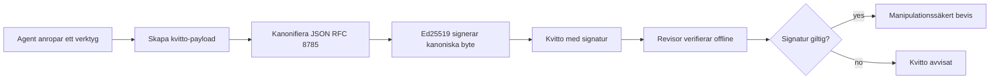
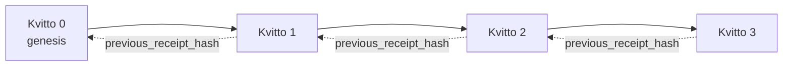

[Titta på lektionens video: Säkring av AI-agenter med kryptografiska kvitton](https://youtu.be/PLACEHOLDER_VIDEO_ID)

> _(Lektionsvideo och miniatyrbild kommer att läggas till av Microsofts innehållsteam efter sammanslagning, i enlighet med mönstret för lektion 14 / 15.)_

# Säkring av AI-agenter med kryptografiska kvitton

## Introduktion

Denna lektion kommer att behandla:

- Varför revisionsspår för AI-agenter är viktiga för efterlevnad, felsökning och förtroende.
- Vad ett kryptografiskt kvitto är och hur det skiljer sig från en osignerad loggrad.
- Hur man producerar ett signerat kvitto för en agents verktygsanrop i vanlig Python.
- Hur man verifierar ett kvitto offline och upptäcker manipulation.
- Hur man kedjar kvitton så att borttagning eller omläggning av ett kvitto bryter kedjan.
- Vad kvitton bevisar och vad de uttryckligen inte bevisar.

## Lärandemål

Efter att ha genomfört denna lektion kommer du att kunna:

- Identifiera felstegen som motiverar kryptografiskt ursprung för agenthandlingar.
- Producera ett Ed25519-signerat kvitto över en kanonisk JSON-payload.
- Verifiera ett kvitto självständigt med bara signerarens offentliga nyckel.
- Upptäcka manipulation genom att köra verifieringen igen på ett modifierat kvitto.
- Bygga en hash-kedjad sekvens av kvitton och förklara varför kedjan är viktig.
- Känna igen gränsen mellan vad kvitton bevisar (attribuering, integritet, ordning) och vad de inte gör (korrekthet av handling, giltighet av policyn).

## Problemet: Din agents revisionsspår

Föreställ dig att du har distribuerat en AI-agent för Contoso Travel. Agenten läser kundförfrågningar, anropar ett flyg-API för att söka alternativ och bokar platser åt kunden. Förra kvartalet hanterade agenten 50 000 bokningar.

Idag anländer en revisor. De ställer en enkel fråga: "Visa mig vad din agent gjorde."

Du lämnar över dina loggfiler. Revisorn tittar på dem och ställer den svårare frågan: "Hur vet jag att dessa loggar inte har redigerats?"

Detta är problemet med revisionsspår. De flesta agentdistributioner idag förlitar sig på:

- **Applikationsloggar**: skrivs av agenten själv, kan redigeras av vem som helst med filsystemåtkomst.
- **Molnloggtjänster**: manipulationssäkra på plattformsnivå men bara om revisorn litar på plattformsoperatören.
- **Databastransaktionsloggar**: väl lämpade för databasändringar men inte för godtyckliga verktygsanrop.

Ingen av dessa kan svara revisorns fråga utan att revisorn behöver lita på någon (dig, din molnleverantör, din databaskund). För internt bruk är det ofta acceptabelt. För reglerade arbetsbelastningar (finans, vård, allt som omfattas av EU:s AI-förordning) är det inte det.

Kryptografiska kvitton löser detta genom att göra varje agenthandling självständigt verifierbar. Revisorn behöver inte lita på dig. De behöver bara din offentliga nyckel och kvittot självt.

## Vad är ett kryptografiskt kvitto?

Ett kvitto är ett JSON-objekt som registrerar vad en agent gjorde, signerat med en digital signatur.


```mermaid
flowchart LR
    A[Agent anropar ett verktyg] --> B[Skapa kvitto-payload]
    B --> C[Kanonifiera JSON RFC 8785]
    C --> E[Ed25519 signerar kanoniska byte]
    E --> F[Kvitto med signatur]
    F --> G[Revisor verifierar offline]
    G --> H{Signatur giltig?}
    H -- yes --> I[Manipulationssäkert bevis]
    H -- no --> J[Kvitto avvisat]
```

Ett minimalt kvitto ser ut så här:

```json
{
  "type": "agent.tool_call.v1",
  "agent_id": "contoso-travel-bot",
  "tool_name": "lookup_flights",
  "tool_args_hash": "sha256:a3f9c1...",
  "result_hash": "sha256:7b2e1d...",
  "policy_id": "contoso-travel-policy-v3",
  "timestamp": "2026-04-25T14:30:00Z",
  "sequence": 47,
  "previous_receipt_hash": "sha256:9d4e6a...",
  "signature": {
    "alg": "EdDSA",
    "sig": "c5af83...",
    "public_key": "8f3b2c..."
  }
}
```

Tre egenskaper gör jobbet:

1. **Signaturen**. Kvittot signeras av agentens gateway med en Ed25519-privatnyckel. Vem som helst med motsvarande offentliga nyckel kan verifiera signaturen offline. Manipulation av något fält ogiltigförklarar signaturen.

2. **Kanonisk kodning**. Innan signering serialiseras kvittot med JSON Canonicalization Scheme (JCS, RFC 8785). Detta säkerställer att två implementationer som producerar samma logiska kvitto genererar byte-identisk utdata. Utan kanonisering skulle olika JSON-serialiserare generera olika signaturer för samma innehåll.

3. **Hash-kedjning**. Fältet `previous_receipt_hash` länkar varje kvitto till det föregående. Att ta bort eller omlägga ett kvitto bryter varje kvitto som kom efter. Manipulation blir synlig på kedjenivå även om individuella signaturer kringgås.

Tillsammans ger dessa egenskaper tre garantier:

- **Attribuering**: denna nyckel signerade detta innehåll.
- **Integritet**: innehållet har inte ändrats sedan signering.
- **Ordning**: detta kvitto kom efter det kvittot i kedjan.

## Att producera ett kvitto i Python

Du behöver inget speciellt bibliotek för att producera ett kvitto. De kryptografiska primitiva är allmänt tillgängliga och logiken är ett par dussin rader Python.

De praktiska övningarna i `code_samples/18-signed-receipts.ipynb` går igenom hela flödet. Sammanfattningen:

```python
import json
import hashlib
import base64
from nacl import signing
from jcs import canonicalize  # RFC 8785 kanonisk JSON

def b64url_nopad(data: bytes) -> str:
    return base64.urlsafe_b64encode(data).decode("ascii").rstrip("=")

def sha256_canonical(obj) -> str:
    """SHA-256 of a Python object's JCS-canonical JSON form."""
    return f"sha256:{hashlib.sha256(canonicalize(obj)).hexdigest()}"

# Generera eller ladda en signeringsnyckel (i produktion, lagra i ett nyckelskåp)
signing_key = signing.SigningKey.generate()
verify_key = signing_key.verify_key

# Bygg kvittets nyttolast (ingen signatur ännu)
tool_args = {"origin": "SYD", "destination": "LAX"}
tool_result = [{"flight": "QF11", "price": 1850, "stops": 0}]

payload = {
    "type": "agent.tool_call.v1",
    "agent_id": "contoso-travel-bot",
    "tool_name": "lookup_flights",
    "tool_args_hash": sha256_canonical(tool_args),
    "result_hash": sha256_canonical(tool_result),
    "policy_id": "contoso-travel-policy-v3",
    "timestamp": "2026-04-25T14:30:00Z",
    "sequence": 0,
    "previous_receipt_hash": None,
}

# Kanonisk och signera JCS-bytarna direkt. PureEdDSA hashar internt.
canonical_bytes = canonicalize(payload)
signature_bytes = signing_key.sign(canonical_bytes).signature

# Bifoga ett strukturerat signaturobjekt.
receipt = {
    **payload,
    "signature": {
        "alg": "EdDSA",
        "sig": b64url_nopad(signature_bytes),
        "public_key": b64url_nopad(bytes(verify_key)),
    },
}
```

Det är hela signeringskedjan. Övningarna i anteckningsboken går igenom varje steg.

## Verifiering av ett kvitto och upptäckt av manipulation

Verifiering är den omvända operationen:

```python
import base64
import hashlib
from nacl import signing
from nacl.exceptions import BadSignatureError
from jcs import canonicalize

def b64url_decode(s: str) -> bytes:
    padding = "=" * ((4 - len(s) % 4) % 4)
    return base64.urlsafe_b64decode(s + padding)

def verify_receipt(receipt: dict) -> bool:
    # Signaturen är ett strukturerat objekt: {"alg", "sig", "public_key"}.
    sig_obj = receipt.get("signature")
    if not sig_obj or sig_obj.get("alg") != "EdDSA":
        return False

    # Återskapa den nyttolast som faktiskt signerades (allt utom signaturen).
    payload = {k: v for k, v in receipt.items() if k != "signature"}

    canonical_bytes = canonicalize(payload)

    try:
        verify_key = signing.VerifyKey(b64url_decode(sig_obj["public_key"]))
        verify_key.verify(canonical_bytes, b64url_decode(sig_obj["sig"]))
        return True
    except BadSignatureError:
        return False
```

Denna funktion tar ett kvitto och returnerar `True` om signaturen är giltig, `False` annars. Ingen nätverksanrop, ingen tjänsteberoende, inget förtroende krävs för någon tredje part.

För att se manipulation upptäckt i praktiken går anteckningsboken igenom:

1. Producera ett giltigt kvitto och bekräfta att det verifierar.
2. Modifiera en byte i fältet `tool_args_hash`.
3. Kör verifieringen igen och se att den misslyckas.

Detta är den praktiska demonstrationen att kvitton är manipulationssäkra: varje ändring, hur liten den än är, bryter signaturen.

## Kedja kvitton för agenthandlingar i flera steg

Ett enskilt signerat kvitto skyddar en handling. En kedja av kvitton skyddar en sekvens.


```mermaid
flowchart LR
    R0[Kvitto 0<br/>genesis] --> R1[Kvitto 1]
    R1 --> R2[Kvitto 2]
    R2 --> R3[Kvitto 3]
    R1 -. previous_receipt_hash .-> R0
    R2 -. previous_receipt_hash .-> R1
    R3 -. previous_receipt_hash .-> R2
```

Varje kvitto registrerar hashvärdet av det föregående kvittot. För att tyst ta bort kvitto 2 måste en angripare antingen:

- Modifiera fältet `previous_receipt_hash` i kvitto 3 (bryter signaturen för kvitto 3), ELLER
- Förfalska en ny signatur på ett modifierat kvitto 3 (kräver agentens privata nyckel).

Om den privata nyckeln finns i ett hårdvarunyttjandevalv och du publicerar den offentliga nyckeln med varje kvitto, är ingen av attackerna möjlig utan upptäckt.

Anteckningsboken går igenom:

1. Bygga en kedja av tre kvitton.
2. Verifiera att varje kvittos `previous_receipt_hash` stämmer överens med den faktiska hashen av föregående kvitto.
3. Manipulera ett kvitto i mitten och se kedjan brytas exakt där.

Så här producerar du ett revisionsspår som en extern revisor kan verifiera utan att behöva lita på dig.

## Vad kvitton bevisar (och vad de inte gör)

Detta är den viktigaste delen av lektionen. Kvitton är kraftfulla men deras kraft är begränsad.

**Kvitton bevisar tre saker:**

1. **Attribuering**: en specifik nyckel signerade en specifik payload.
2. **Integritet**: payloaden har inte ändrats sedan signering.
3. **Ordning**: detta kvitto kom efter det kvittot i hash-kedjan.

**Kvitton bevisar INTE:**

1. **Korrekthet**: att agentens handling var rätt handling. Ett kvitto kan signeras för ett felaktigt svar lika väl som för ett rätt svar.
2. **Policysamhörighet**: att policyn refererad i `policy_id` faktiskt utvärderades, eller att den skulle ha tillåtit denna handling om den kontrollerades. Kvittot registrerar vad som påstods, inte vad som verkställdes.
3. **Identitet bortom nyckeln**: kvittot säger "denna nyckel signerade detta innehåll." Det säger inte "denna människa godkände detta." Att koppla en nyckel till en person eller organisation kräver separat identitetsinfrastruktur (en katalog, ett offentligt nyckelregister, etc.).
4. **Sanningsenlighet av indata**: om agenten får en manipulerad prompt och agerar på den, registrerar kvittot handlingen sanningsenligt. Kvitton är efterföljande validering av indata, inte en ersättning för denna.

Denna gräns är viktig av två skäl:

- Den berättar vad kvitton är användbara för: att göra agentbeteende granskningsbart och manipulationssäkert, även över organisationsgränser.
- Den berättar vilka ytterligare lager du fortfarande behöver: validering av indata (Lektion 6), policytillämpning (kortfattat nedan), och identitetsinfrastruktur (utanför ramen för denna lektion).

Ett vanligt misstag är att anta att "vi har kvitton" betyder "vi styrs." Så är det inte. Kvitton är en grund. Styrning är systemet du bygger ovanpå.

## Bevisa att en människa godkände den exakta åtgärden

Punkt 3 ovan förtjänar en egen sektion: ett handlingkvittot säger "denna nyckel signerade detta innehåll," aldrig "en människa godkände detta." För åtgärder med hög risk (återbetalningar, radering, banköverföringar) kräver styrningsramverk i allt högre grad detta saknade uttalande, och det går att producera med samma primitiva funktioner som du redan byggde in i denna lektion.

Den följande anteckningsboken `code_samples/human-authorization-receipts.ipynb` lägger till en andra kvittotyp, `human.approval.v1`, i samma kuvertsform som lektionens kvitton (en typad payload signerad med Ed25519 över dess kanoniska JCS-bytes med `signature`-objektet utanför de signerade byten). En namngiven godkännare signerar **hela den kanoniska åtgärden och dess digest** innan utförande; agentens handlingskvitto bär samma **aktionsdigest** och en `parent_approval_ref`, `receipt_hash` för godkännandet, samma konvention som `previous_receipt_hash` i kedjan du byggde ovan. En `verify_chain` går igenom båda artefakterna under **separata fästa nyckelregister** (godkännarnycklar vs agentnycklar), så kodvägen delas men auktoriteterna gör det aldrig.

Egenskapen detta ger, uttryckt omsorgsfullt: *människan godkände denna exakta handling och agenten utförde exakt denna godkända handling.* Anteckningsbokens avvisningscaser är det som gör egenskapen verklig snarare än hävdad:

- den klassiska uppsättningen: manipulation, förvirrad ombud, uppspelning, förfalskade nycklar på båda sidor, felaktig indata;
- **föråldrad auktoritet**: en signatur som fortfarande verifierar, nekades ändå eftersom policyversionen ändrades, godkännarnyckeln roterades bort från det fasta registret, eller godkännandet gick ut före utförandet;
- **digestutbyte**: ett giltigt signerat handlingskvitto som pekar på ett *verkligt* godkännande som binder en *annan* kanonisk handling.

Varje fel nekas med en distinkt anledning, så en revisor som läser ett nekande kan säga om auktoriteten blev föråldrad eller om den utförda handlingen ändrades. Reglen som anteckningsboken lär ut: ett signerat godkännande är inte auktoritet i sig själv. Auktoritet existerar bara om båda kvittona fortfarande binder till samma kanoniska handling vid utförandet. Mänskligt-godkännande-kvittot är en pedagogisk sammansättning definierad av denna lektion, inte en kvittotyp definierad av `draft-farley-acta-signed-receipts`.

## Produktionsreferenser

Python-koden i denna lektion är avsiktligt minimal så att du kan läsa varje rad och förstå exakt vad som händer. I produktion har du två alternativ:

1. **Bygg direkt på de kryptografiska primitiva.** De 50 rader du såg ovan är tillräckliga för många användningsfall. PyNaCl (Ed25519) och paketet `jcs` (kanonisk JSON) är väl underhållna och granskade bibliotek.

2. **Använd ett produktionsbibliotek för kvitton.** Flera open-source-projekt implementerar samma mönster med ytterligare funktioner (nyckelrotation, batch-verifiering, JWK Set-distribution, integration med policy-motorer):
   - Signeringskedjan använder JCS och konventioner för signaturscope i ett oberoende IETF Internet-draft ([`draft-farley-acta-signed-receipts`](https://datatracker.ietf.org/doc/draft-farley-acta-signed-receipts/), revision 02). Lektionens platta pedagogiska kvitto skiljer sig från draftens `{payload, signature}`-kuvert och presenteras inte som en konform implementering. Drafterna publicerar en delad konformitetssvit ([agent-governance-testvectors](https://github.com/ScopeBlind/agent-governance-testvectors)) för implementationer som siktar på dess tråformat.
   - Microsoft Agent Governance Toolkit sammanställer kvitton med Cedar-baserade policysbeslut; se Tutorial 33 i det förvaret för ett end-to-end exempel.
   - Paketen `protect-mcp` (npm) och `@veritasacta/verify` (npm) tillhandahåller en Node-baserad implementation av kvitto-signering och offlineverifiering, avsedd att omsluta vilken MCP-server som helst med ett manipulationssäkert revisionsspår, inklusive ett pausat godkännandeflöde där en pausad handling emitterar ett godkännandekvitto bundet till handlingsdigesten (WebAuthn-stött i skrivbordsflödet), samma godkännandekvittomönster som i anteckningsboken om mänskligt godkännande ovan.
   - **[nobulex](https://github.com/arian-gogani/nobulex)** Python SDK (`pip install nobulex`) tillhandahåller samma Ed25519 + JCS-signeringsmönster i Python med LangChain och CrewAI-integrationer, inklusive publicerade tvärvalideringstestvektorer och en compliance-mappning bidragen via [OWASP PR #2210](https://github.com/OWASP/CheatSheetSeries/pull/2210).

Beslutet mellan att göra eget och använda ett bibliotek speglar beslutet mellan att skriva ditt eget JWT-bibliotek och använda ett testat: båda är rimliga; biblioteket spar tid och minskar granskningsytan; från-scratch-ansatsen tvingar dig att förstå varje primitiv. Denna lektion lär ut från-scratch-vägen så att du har grunden för båda valen.

## Kunskapskontroll

Testa din förståelse innan du går vidare till övningen.

**1. Ett kvitto signeras med agentens privata Ed25519-nyckel. Revisorn har bara den offentliga nyckeln. Kan revisorn verifiera kvittot offline?**

<details>
<summary>Svar</summary>

Ja. Ed25519-verifiering kräver bara den offentliga nyckeln och de signerade bytena. Inget nätverksanrop, ingen tjänsteberoende. Detta är egenskapen som gör kvitton användbara i luftgapade, multi-organisations- eller låg-förtroende-revisionsmiljöer.
</details>

**2. En angripare modifierar fältet `policy_id` i ett kvitto för att hävda att det styrdes av en mer tillåtande policy. Signaturen var över den ursprungliga payloaden. Vad händer vid verifiering?**

<details>
<summary>Svar</summary>


Verifieringen misslyckas. Signaturen beräknades över de kanoniska bytena av den ursprungliga nyttolasten; att modifiera något fält ändrar dessa byte, vilket gör signaturen ogiltig. Angriparen skulle behöva den privata nyckeln för att producera en ny giltig signatur, vilket de inte har.
</details>

**3. Varför innehåller kvittot en `tool_args_hash` och `result_hash` istället för de råa argumenten och resultatet?**

<details>
<summary>Svar</summary>

Två skäl. För det första kan kvittot behöva arkiveras eller överföras i miljöer där det är problematiskt att läcka rått innehåll (PII, affärsdata). Hashning håller kvittot litet och innehållet privat; revisorn verifierar att hashen matchar en separat lagrad kopia av det faktiska innehållet. För det andra har hashar en fast storlek; ett kvitto med hashar är begränsat i storlek oavsett hur stora indata och utdata var.
</details>

**4. Fältet `previous_receipt_hash` länkar varje kvitto till dess föregångare. Om en angripare tyst tar bort ett kvitto mitt i en kedja, vad blir ogiltigt?**

<details>
<summary>Svar</summary>

Varje kvitto som kom efter det borttagna. Deras fält `previous_receipt_hash` matchar inte längre den faktiska kedjan (eftersom kvittot de refererade till inte längre finns, eller kedjan nu pekar på en annan föregångare). För att dölja borttagningen skulle angriparen behöva skriva om signaturerna för varje senare kvitto, vilket kräver den privata nyckeln.
</details>

**5. Ett kvitto verifieras utan problem. Bevisar det att agentens handling var korrekt, giltig eller överensstämmande med policyn?**

<details>
<summary>Svar</summary>

Nej. Ett giltigt kvitto bevisar tre saker: tilldelning (denna nyckel signerade detta innehåll), integritet (innehållet har inte ändrats) och ordning (detta kvitto kom efter det andra). Det bevisar INTE att handlingen var korrekt, att policyn som anges i `policy_id` faktiskt utvärderades, eller att agenten följde alla regler. Kvitton gör agentbeteende granskbart, men inte nödvändigtvis korrekt. Detta är den viktigaste gränsen i lektionen.
</details>

## Övning

Öppna `code_samples/18-signed-receipts.ipynb` och slutför alla fyra sektioner:

1. **Sektion 1**: Signera ditt första kvitto och verifiera det.
2. **Sektion 2**: Manipulera kvittot och observera att verifieringen misslyckas.
3. **Sektion 3**: Bygg en kedja av tre kvitton och verifiera kedjans integritet.
4. **Sektion 4**: Applicera mönstret på en agent byggd med Microsoft Agent Framework: omslut ett verktygskall med kvittosignerande, och verifiera sedan kvittot oberoende.

**Extra utmaning 1:** utöka kvittoschemat med ett extra fält efter eget val (till exempel en förfrågnings-ID för spårning), uppdatera den kanoniska signeringslogiken för att inkludera det, och bekräfta att kvittot fortfarande kan verifieras. Modifiera sedan fältet efter signering och bekräfta att verifieringen misslyckas. Detta tvingar dig förstå hur varje byte i den kanoniska kodningen bidrar till signaturen.

**Extra utmaning 2:** SHA-256-hasha två av dina kvitton tillsammans (konkatenera deras kanoniska byte i en deterministisk ordning) och bädda in den resulterande digesten som ett nytt fält i ett tredje kvitto innan du signerar det. Verifiera att alla tre kvitton fortfarande kan verifieras. Du har just byggt ett ettstegs inkluderingsbevis: vem som helst som har det tredje kvittot kan bevisa att de två första fanns när det signerades, utan att behöva avslöja deras innehåll. Detta är mönstret som selektivt avslöjande kvitton använder i stor skala (Merkle-åtaganden, RFC 6962).

## Slutsats

Kryptografiska kvitton ger AI-agenter en revisionskedja som är:

- **Självständigt verifierbar**: vilken part som helst med den publika nyckeln kan verifiera, utan beroende av tjänster.
- **Manipulationssäkert**: varje modifiering ogiltigförklarar signaturen.
- **Bärbart**: ett kvitto är en liten JSON-fil; det kan arkiveras, överföras och verifieras var som helst.
- **Standardanpassat**: baserat på Ed25519 (RFC 8032), JCS (RFC 8785) och SHA-256, alla väl använda primitiva.

De är ingen ersättning för inmatningsvalidering, policyimplementering eller identitetsinfrastruktur. De är en grund för dessa lager. När du distribuerar agenter i reglerade arbetsbelastningar, flerdlings-organisationers arbetsflöden eller i vilken miljö som helst där en framtida revisor inte kan antas lita på dig, är kvitton hur du gör revisionskedjan ärlig.

Den viktigaste slutsatsen: kvitton bevisar vem som sa vad och när. De bevisar inte att det som sades var sant eller rätt. Håll det skiljandet tydligt. Det är skillnaden mellan ett ärligt provenienssystem och ett vilseledande.

## Produktionschecklista

När du är redo att gå vidare från denna lektion till att distribuera kvittosignerade agenter i en verklig miljö:

- [ ] **Flytta signeringsnyckeln från utvecklarens laptop.** Använd Azure Key Vault, AWS KMS eller en hårdvarusäkerhetsmodul. Den privata nyckeln som signerar dina kvitton måste aldrig lagras i källkontroll eller i klartext på applikationsmaskiner.
- [ ] **Publicera verifieringsnyckeln.** Revisorer behöver den för att verifiera offline. Standardmönstret är ett JWK Set på en välkänd URL (RFC 7517), t.ex. `https://your-org.example.com/.well-known/agent-keys.json`.
- [ ] **Fäst kedjan externt.** Skriv periodiskt den senaste kedjutoppens hash till en transparenslogg (Sigstore Rekor, RFC 3161 tidsstämpelmyndighet eller ett annat internt system) så att en extern part kan bekräfta "denna kedja existerade vid denna tidpunkt."
- [ ] **Spara kvittona oförändrade.** Append-only blob-lagring (Azure Storage med oföränderlighetspolicys, AWS S3 Object Lock) hindrar en insider från att skriva om historiken på lagringsnivå.
- [ ] **Besluta om lagringstid.** Många regelverk kräver flerpårig lagring. Planera för kvittotillväxt (varje kvitto är ~500 byte; en agent som gör 10 000 anrop per dag genererar ~1,8 GB per år).
- [ ] **Dokumentera vad kvitton inte täcker.** Kvitton bevisar tilldelning, integritet och ordning. Din körbok bör uttryckligen lista vilka ytterligare kontroller (inmatningsvalidering, policyimplementering, hastighetsbegränsning, identitetsinfrastruktur) som fungerar tillsammans med kvitton i din styrningsmodell.

### Fler frågor om att säkra AI-agenter?

Gå med i [Microsoft Foundry Discord](https://aka.ms/ai-agents/discord) för att träffa andra elever, delta i kontorstid och få svar på dina frågor om AI-agenter.

## Efter denna lektion

Denna lektion täcker enkel kvittosignering och hash-kedjade sekvenser. Samma primitiva byggstenar ingår i flera mer avancerade mönster du kan möta när din styrningsmodell mognar:

- **Selektivt avslöjande.** När ett kvittos fält är oberoende åtagna (RFC 6962-stil Merkle-träd), kan du avslöja specifika fält till specifika revisorer och bevisa att resten är oförändrade utan att exponera dem. Användbart när samma kvitto måste uppfylla både en omfattande revision (som vill ha fullständighet) och dataminimeringsregler som GDPR (som vill att revisorn ska se så lite som möjligt).
- **Återkallelse av kvitto.** Om en signeringsnyckel komprometteras behöver du ett sätt att markera alla kvitton signerade med den nyckeln som opålitliga från en viss tidpunkt framåt. Standardmönster: kortlivade signeringsnycklar plus en publicerad återkallelse lista, eller en transparenslogg med återkallelseposter.
- **Bilaterala / delade signaturkvitton.** Vissa implementeringar delar upp den signerade nyttolasten i för-exekverings- (`authorization_*`) och efter-exekverings- (`result_*`) halvor med oberoende signaturer, användbart när auktoriseringsbeslutet och det observerade resultatet produceras av olika aktörer eller vid olika tidpunkter. Detta bygger additivt ovanpå kvittformatet som lärs i denna lektion.
- **Sammansättning av nyttolast.** Ett kvitto förseglar de byte du lägger i `result_hash`. Verkliga nyttolaster är ofta rikare än ett enda verktygssvar: förbeslutsresonemang (modellprediktion, övervägda alternativ, bevis och dess fullständighet, riskpostur, ansvarskedja, grindutfall) kan alla finnas inuti nyttolasten, förseglade med ett enda kvitto. Detta håller kvittoformatet minimalt samtidigt som nyttolastscheman kan utvecklas domän för domän.
- **Samöverensstämmelse mellan implementeringar.** Flera oberoende implementationer av samma kvittformat (Python, TypeScript, Rust, Go) verifierar mot gemensamma testvektorer. Om du bygger din egen implementation bekräftar validering mot publicerade vektorer kompatibilitet.
- **Post-kvantum migrering.** Ed25519 är allmänt använt idag men är inte kvantresistent. Kvittoformatet är algoritm-flexibelt: fältet `signature.alg` kan bära `ML-DSA-65` (NIST:s post-kvantum signaturstandard) när du behöver migrera. Planera för en övergångsperiod där kvitton är dubbelsignerade.

## Ytterligare Resurser

- <a href="https://datatracker.ietf.org/doc/draft-farley-acta-signed-receipts/" target="_blank">IETF Internet-Draft: Signed Decision Receipts for Machine-to-Machine Access Control</a>
- <a href="https://learn.microsoft.com/azure/ai-studio/responsible-use-of-ai-overview" target="_blank">Ansvarsfull AI-översikt (Azure AI)</a>
- <a href="https://datatracker.ietf.org/doc/html/rfc8032" target="_blank">RFC 8032: Edwards-Kurva Digital Signaturalgoritm (EdDSA)</a>
- <a href="https://datatracker.ietf.org/doc/html/rfc8785" target="_blank">RFC 8785: JSON Kanoniseringsschema (JCS)</a>
- <a href="https://datatracker.ietf.org/doc/html/rfc6962" target="_blank">RFC 6962: Certifikattransparens</a> (Merkle-träd konstruktion använd av selektivt avslöjande kvitton)
- <a href="https://github.com/microsoft/agent-governance-toolkit/blob/main/docs/tutorials/33-offline-verifiable-receipts.md" target="_blank">Microsoft Agent Governance Toolkit, Tutorial 33: Offline-Verifiable Decision Receipts</a>
- <a href="https://github.com/ScopeBlind/agent-governance-testvectors" target="_blank">Testvektorer för samöverensstämmelse mellan implementeringar</a> för kvittoformatet som används i denna lektion (Apache-2.0)
- <a href="https://pynacl.readthedocs.io/" target="_blank">PyNaCl-dokumentation</a> (Ed25519 i Python)

## Föregående lektion

[Skapa lokala AI-agenter](../17-creating-local-ai-agents/README.md)

---

<!-- CO-OP TRANSLATOR DISCLAIMER START -->
**Ansvarsfriskrivning**:
Detta dokument har översatts med hjälp av AI-översättningstjänsten [Co-op Translator](https://github.com/Azure/co-op-translator). Även om vi strävar efter noggrannhet, var vänlig notera att automatiska översättningar kan innehålla fel eller brister. Det ursprungliga dokumentet på dess modersmål bör betraktas som den auktoritativa källan. För kritisk information rekommenderas professionell mänsklig översättning. Vi ansvarar inte för några missförstånd eller feltolkningar som uppstår till följd av användningen av denna översättning.
<!-- CO-OP TRANSLATOR DISCLAIMER END -->