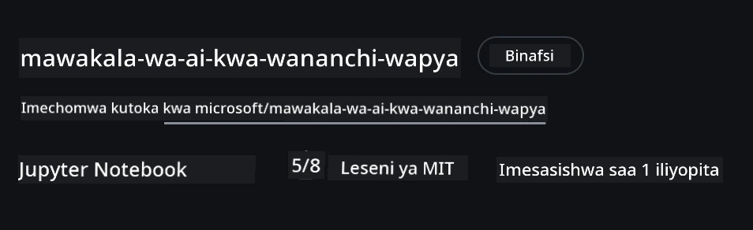
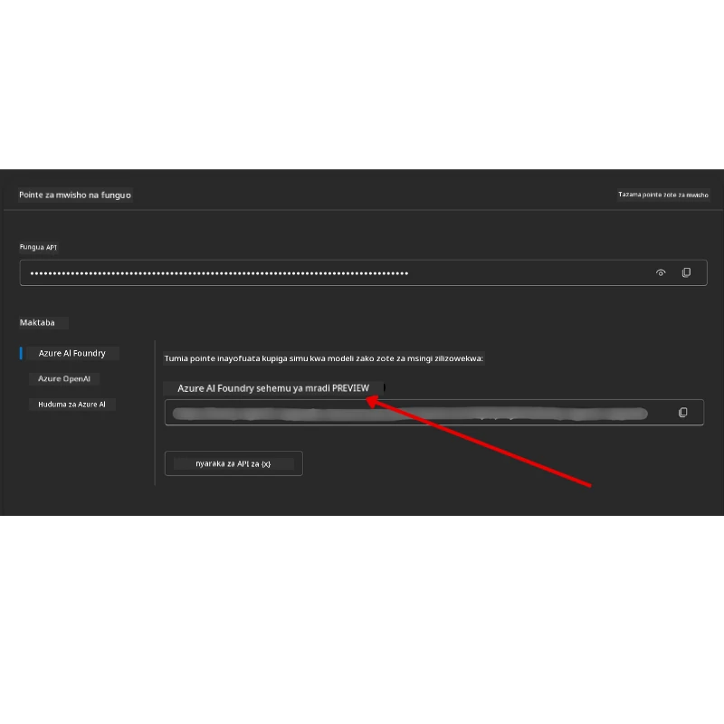

# Usanidi wa Kozi

## Utangulizi

Somo hili litaelezea jinsi ya kuendesha mifano ya nambari ya kozi hii.

## Jiunge na Wanafunzi Wengine na Pata Msaada

Kabla ya kuanza kunakili repo yako, jiunge na [AI Agents For Beginners Discord channel](https://aka.ms/ai-agents/discord) kupata msaada wowote kuhusu usanidi, maswali kuhusu kozi, au kuungana na wanafunzi wengine.

## Nakili au Fanya Fork ya Repo hii

Ili kuanza, tafadhali nakili au fanya fork ya Hifadhi ya GitHub. Hii itakufanya kuwa na toleo lako la vifaa vya kozi ili uweze kuendesha, kujaribu, na kurekebisha nambari!

Hii inaweza kufanywa kwa kubofya kiungo cha <a href="https://github.com/microsoft/ai-agents-for-beginners/fork" target="_blank">kufanya fork ya repo</a>

Sasa unapaswa kuwa na toleo lako la fork la kozi hii kwenye kiungo kifuatacho:



### Nakili Jifupi (inayopendekezwa kwa warsha / Codespaces)

  >Hifadhi kamili inaweza kuwa kubwa (~3 GB) unapotumia historia kamili na faili zote. Ikiwa unahudhuria warsha tu au unahitaji folda chache za masomo, nakili jifupi (au nakili chache) hupakua kidogo zaidi.

#### Nakili Jifupi ya Haraka — historia kidogo, faili zote

Badilisha `<your-username>` katika amri zilizo hapa chini na URL ya fork yako (au URL ya upstream kama unapendelea).

Ili kunakili historia ya toleo la mwisho tu (pakua kidogo):

```bash
git clone --depth 1 https://github.com/<your-username>/ai-agents-for-beginners.git
```

Ili kunakili tawi fulani:

```bash
git clone --depth 1 --branch <branch-name> https://github.com/<your-username>/ai-agents-for-beginners.git
```

#### Nakili Sehemu (sparse) — blob ndogo + folda zilizochaguliwa pekee

Hii inatumia nakili sehemu na sparse-checkout (inahitaji Git 2.25+ na Git za kisasa zenye msaada wa nakili sehemu):

```bash
git clone --depth 1 --filter=blob:none --sparse https://github.com/<your-username>/ai-agents-for-beginners.git
```

Ingia katika folda ya repo:

```bash
cd ai-agents-for-beginners
```

Kisha eleza ni folda gani unazotaka (mfano hapa chini unaonyesha folda mbili):

```bash
git sparse-checkout set 00-course-setup 01-intro-to-ai-agents
```

Baada ya kunakili na kuthibitisha faili, ikiwa unahitaji faili tu na unataka kuondoa nafasi (hakuna historia ya git), tafadhali futa metadata ya hifadhi (💀haiwezi kurekebishwa — utapoteza utendaji wote wa Git):

```bash
# zsh/bash
rm -rf .git
```

```powershell
# PowerShell
Remove-Item -Recurse -Force .git
```

#### Kutumia GitHub Codespaces (inayopendekezwa kuepuka upakuaji mkubwa wa eneo la kompyuta)

- Tengeneza Codespace mpya kwa repo hii kupitia [GitHub UI](https://github.com/codespaces).  

- Katika terminal ya codespace mpya uliyoitengeneza, tumia moja ya amri za nakili jifupi/sparse zinazotolewa hapo juu kuleta folda za masomo unazohitaji ndani ya eneo la Codespace.
- Hiari: baada ya kunakili ndani ya Codespaces, ona .git kufungua nafasi zaidi (ona amri za kufuta hapo juu).
- Kumbuka: Ikiwa unapendelea kufungua repo moja kwa moja kwenye Codespaces (bila kunakili tena), fahamu Codespaces itatengeneza mazingira ya devcontainer na huenda ikahifadhi zaidi ya unavyohitaji.

#### Vidokezo

- Daima badilisha URL ya nakili na fork yako ikiwa unataka kuhariri/kuweka mabadiliko.
- Ikiwa baadaye unahitaji historia zaidi au faili, unaweza kuzipakua au kurekebisha sparse-checkout kuhusisha folda zaidi.

## Kuenyesha Nambari

Kozi hii inatoa mfululizo wa Daftari za Jupyter (Jupyter Notebooks) zinazoweza kuendeshwa kupata uzoefu wa vitendo wa kujenga Maajenti wa AI.

Mifano ya nambari inatumia **Microsoft Agent Framework (MAF)** na `FoundryChatClient`, inayounganisha kwa **Microsoft Foundry Agent Service V2** (API ya Majibu) kupitia **Microsoft Foundry**.

Daftari zote za Python zinalandanishwa na jina la `*-python-agent-framework.ipynb`.

## Mahitaji

- Python 3.12+
  - **KUMBUKA**: Ikiwa huna Python3.12 imewekwa, hakikisha unaifunga. Kisha tengeneza venv yako ukitumia python3.12 kuhakikisha toleo sahihi linawekwa kutoka kwenye requirements.txt.
  
    >Mfano

    Tengeneza saraka ya Python venv:

    ```bash
    python -m venv venv
    ```

    Kisha washawishi mazingira ya venv kwa ajili ya:

    ```bash
    # zsh/bash
    source venv/bin/activate
    ```
  
    ```dos
    # Command Prompt for Windows
    venv\Scripts\activate
    ```

- .NET 10+: Kwa mifano ya nambari inayotumia .NET, hakikisha umeweka [.NET 10 SDK](https://dotnet.microsoft.com/download/dotnet/10.0) au zaidi. Kisha, angalia toleo la SDK yako ya .NET lililowekwa:

    ```bash
    dotnet --list-sdks
    ```

- **Azure CLI** — Inahitajika kwa uthibitishaji. Funga kutoka [aka.ms/installazurecli](https://aka.ms/installazurecli).
- **Azure Subscription** — Kwa kupata Microsoft Foundry na Microsoft Foundry Agent Service.
- **Mradi wa Microsoft Foundry** — Mradi wenye mfano uliowekwa (kama `gpt-5-mini`). Angalia [Hatua 1](#hatua-1-tengeneza-mradi-wa-microsoft-foundry) hapa chini.

Tumejumuisha faili ya `requirements.txt` katika mizizi ya hifadhi hii yenye vifurushi vyote vinavyohitajika vya Python kuendesha mifano ya nambari.

Unaweza kuviweka kwa kuendesha amri ifuatayo kwenye terminal yako katika mizizi ya hifadhi:

```bash
pip install -r requirements.txt
```

Tunapendekeza kuunda mazingira ya hali ya juu ya Python ili kuepuka migongano na matatizo.

## Weka VSCode

Hakikisha unatumia toleo sahihi la Python katika VSCode.


## Sanidi Microsoft Foundry na Microsoft Foundry Agent Service

### Hatua 1: Tengeneza Mradi wa Microsoft Foundry

Unahitaji **hub** na **mradi** wa Microsoft Foundry wenye mfano uliowekwa ili kuendesha daftari.

1. Nenda [ai.azure.com](https://ai.azure.com) na ingia na akaunti yako ya Azure.
2. Tengeneza **hub** (au tumia iliyo tayari). Angalia: [Muhtasari wa rasilimali za Hub](https://learn.microsoft.com/azure/ai-foundry/concepts/ai-resources).
3. Ndani ya hub, tengeneza **mradi**.
4. Wekeza mfano (kama `gpt-5-mini`) kutoka **Models + Endpoints** → **Deploy model**.

### Hatua 2: Pata Endpoint ya Mradi Wako na Jina la Wekezaji wa Mfano

Kutoka kwenye mradi wako katika lango la Microsoft Foundry:

- **Endpoint ya Mradi** — Nenda kwenye ukurasa wa **Muhtasari** na nakili URL ya endpoint.



- **Jina la Wekezaji la Mfano** — Nenda kwenye **Models + Endpoints**, chagua mfano uliowekwa, na kumbuka **Jina la Wekezaji** (kama `gpt-5-mini`).

### Hatua 3: Ingia kwa Azure kwa kutumia `az login`

Daftari nyingi za kumbukumbu zina utambulisho kupitia **kuingia kwa Azure CLI** — kutumia `AzureCliCredential` au `DefaultAzureCredential` (zao huchukua kikao chako cha `az login`) kutoka kwenye kifurushi `azure-identity` — kwa hivyo hazitaji funguo za API. Baadhi ya masomo na ujumuishaji wa hiari hutumia funguo za API; angalia mahitaji ya kila somo kwa mabadiliko ya mazingira ya ziada. Hii inahitaji kuwa umeingia kupitia Azure CLI.

1. **Sakinisha Azure CLI** ikiwa bado haijasakinishwa: [aka.ms/installazurecli](https://aka.ms/installazurecli)

2. **Ingia** kwa kuendesha:

    ```bash
    az login
    ```

    Au kama uko katika mazingira ya mbali/Codespace bila kivinjari:

    ```bash
    az login --use-device-code
    ```

3. **Chagua usajili wako** ikiwa utaulizwa — chagua ile yenye mradi wako wa Foundry.

4. **Thibitisha** umeingia:

    ```bash
    az account show
    ```

> **Kwanini `az login`?** Daftari hutumia uthibitishaji wa `AzureCliCredential` (au `DefaultAzureCredential`, ambao pia hujavutia kikao chako cha Azure CLI) kutoka kwa kifurushi cha `azure-identity`. Hii inamaanisha kikao chako cha Azure CLI kinatoa dhamana — hakuna funguo za API au siri katika faili lako la `.env`. Hii ni [utatizo bora wa usalama](https://learn.microsoft.com/azure/developer/ai/keyless-connections).

### Hatua 4: Tengeneza Faili lako la `.env`

Nakili faili la mfano:

```bash
# zsh/bash
cp .env.example .env
```

```powershell
# PowerShell
Copy-Item .env.example .env
```

Fungua `.env` na jaza haya thamani mbili:

```env
AZURE_AI_PROJECT_ENDPOINT=https://<your-project>.services.ai.azure.com/api/projects/<your-project-id>
AZURE_AI_MODEL_DEPLOYMENT_NAME=gpt-5-mini
```

| Kigezo | Mahali pa kukipata |
|----------|-----------------|
| `AZURE_AI_PROJECT_ENDPOINT` | Langoni la Foundry → mradi wako → ukurasa wa **Muhtasari** |
| `AZURE_AI_MODEL_DEPLOYMENT_NAME` | Langoni la Foundry → **Models + Endpoints** → jina la mfano ulioanzisha |

Hiyo ni yote kwa masomo mengi! Daftari zita hati kiotomatiki kupitia kikao chako cha `az login`.

### Hatua 5: Sakinisha Mifuko ya Python

```bash
pip install -r requirements.txt
```

Tunapendekeza kuendesha hili ndani ya mazingira ya hali ya juu uliyotengeneza awali.

## Usanidi wa Hiari: Azure AI Search (Masomo 5 na 16)

Daftari za Somo 5 (Agentic RAG) na Somo 16 zinaendesha moja kwa moja na **hifadhidata ya maarifa ya ndani** — hazihitaji rasilimali za ziada za Azure. Ikiwa unataka kuzihusisha na kiunga cha kweli cha **Azure AI Search**, kumbuka kuwa **Daftari la Somo 16 kwa sasa linatumia uthibitishaji wa msingi wa funguo**: hubadilisha kutoka utafutaji wa ndani kwenda Azure AI Search tu inapowekwa **pamoja** `AZURE_SEARCH_SERVICE_ENDPOINT` **na** `AZURE_SEARCH_API_KEY`, vinginevyo hubaki katika utafutaji wa ndani — hivyo kuendesha dhidi ya kiunga halisi lazima uwe umeweka funguo ya msimamizi pia. Uthibitishaji bila funguo kwa kutumia Microsoft Entra ID (RBAC) ndio njia inayopendekezwa kwa nambari zako za uzalishaji, ikifuata mtiririko wa `az login` unaotumika kozi nzima.

Hatua za RBAC hapa chini zinatumika kwa mifano ya mwongozo wa usanidi na nambari yako mwenyewe. Hazitoi uthibitishaji bila funguo katika Daftari la Somo 16; Somo 16 bado linahitaji kiunganishi na ufunguo wa msimamizi kutumia Azure AI Search.

1. **Washa upatikanaji kulingana na majukumu** kwenye huduma yako ya utafutaji:

    ```bash
    az search service update --name <service-name> --resource-group <resource-group> --auth-options aadOrApiKey
    ```

2. **Jipa majukumu yanayohitajika** (tengeneza/pakia index na utafutaji):

    ```bash
    az role assignment create --assignee <your-user-or-principal-id> --role "Search Service Contributor" --scope $(az search service show -g <resource-group> -n <service-name> --query id -o tsv)
    az role assignment create --assignee <your-user-or-principal-id> --role "Search Index Data Contributor" --scope $(az search service show -g <resource-group> -n <service-name> --query id -o tsv)
    ```

3. **Ongeza kiungo** kwenye faili lako `.env`:

| Kigezo | Mahali pa kukipata |
|----------|-----------------|
| `AZURE_SEARCH_SERVICE_ENDPOINT` | Lango la Azure → rasilimali yako ya **Azure AI Search** → **Muhtasari** → URL |
| `AZURE_SEARCH_API_KEY` | Inahitajika (pamoja na kiungo) kuwezesha Azure AI Search katika Daftari la Somo 16, ambalo hutumia uthibitishaji wa funguo. Langoni la Azure → **Mipangilio** → **Funguo** → funguo kuu ya msimamizi |

> **Kwanini bila funguo?** Funguo za msimamizi zinatoa haki kamili ya kuandika kwenye huduma yako ya utafutaji na zinaweza kuvuja kupitia faili za `.env`. Kwa RBAC, kitambulisho chako cha `az login` ndicho kinatumika — mfano huo wa Entra ID usio na funguo unaotumika katika daftari za kozi (kupitia `AzureCliCredential` / `DefaultAzureCredential`). Angalia [Unganisha na Azure AI Search kwa kutumia majukumu](https://learn.microsoft.com/azure/search/search-security-rbac).

Angalia [mwongozo wa usanidi wa Azure AI Search](./AzureSearch.md) kwa mifano kamili ya utengenezaji wa index kwa Python na .NET.

## Usanidi Zaidi kwa Masomo Yanayopiga Azure OpenAI Moja kwa Moja (Masomo 6 na 8)

Baadhi ya daftari katika masomo 6 na 8 huagiza **Azure OpenAI** moja kwa moja (kutumia **API ya Majibu**) badala ya kupitia mradi wa Microsoft Foundry. Mifano hii hapo awali ilitumia GitHub Models, ambayo sasa haipatikani na haitegemezi API ya Majibu. Ongeza vigezo hivi kwenye faili lako `.env`:

| Kigezo | Mahali pa kukipata |
|----------|-----------------|
| `AZURE_OPENAI_ENDPOINT` | Lango la Azure → rasilimali yako ya **Azure OpenAI** → **Funguo na Kiungo** → Kiungo (mfano `https://<your-resource>.openai.azure.com`) |
| `AZURE_OPENAI_DEPLOYMENT` | Jina la mfano ulioanzishwa (mfano `gpt-5-mini`) unaounga mkono API ya Majibu |
| `AZURE_OPENAI_API_KEY` | Hiari — ikiwa unatumia uthibitishaji wa funguo badala ya `az login` / Entra ID |

> API ya Majibu hutumia kiungo imara cha `/openai/v1/`, kwa hivyo hakuna `api-version` inayohitajika. Ingia kwa kutumia `az login` kutumia uthibitishaji bila funguo wa Entra ID.

## Muuzaji Mbadala: MiniMax (Inayolingana na OpenAI)

[MiniMax](https://platform.minimaxi.com/) hutoa mifano ya muktadha mkubwa (hadi tiketi 204K) kupitia API inayolingana na OpenAI. Kwa kuwa Microsoft Agent Framework `OpenAIChatClient` hufanya kazi na kiunganishi chochote kinacholingana na OpenAI, unaweza kutumia MiniMax kama mbadala wa moja kwa moja kwa masomo yanayotumia `OpenAIChatClient`.

Ongeza vigezo hivi kwenye faili lako `.env`:

| Kigezo | Mahali pa kukipata |
|----------|-----------------|
| `MINIMAX_API_KEY` | [Jukwaa la MiniMax](https://platform.minimaxi.com/) → Funguo za API |
| `MINIMAX_BASE_URL` | Tumia `https://api.minimax.io/v1` (thamani ya msingi) |
| `MINIMAX_MODEL_ID` | Jina la mfano wa kutumia (mfano, `MiniMax-M3`) |

**Mifano ya mfano**: `MiniMax-M3` (inayopendekezwa), `MiniMax-M2.7`, `MiniMax-M2.7-highspeed` (majibu ya kasi zaidi). Majina ya mifano na upatikanaji yanaweza kubadilika kwa wakati, na upatikanaji wa mfano fulani unaweza kutegemea akaunti yako.

Mifano ya nambari inayotumia `OpenAIChatClient` (mfano, mtiririko wa usajili wa hoteli wa Somo 14) itaigundua na kutumia usanidi wako wa MiniMax otomatiki wakati `MINIMAX_API_KEY` imesetwa.


## Mtoaji Mbadala: Foundry Local (Endesha Modeli Kwenye Kifaa)

[Foundry Local](https://foundrylocal.ai) ni runtimu nyepesi inayopakua, kusimamia, na kuhudumia modeli za lugha **kwote kwenye mashine yako mwenyewe** kupitia API inayoungana na OpenAI — hakuna wingu linalohitajika.

Kwa sababu `OpenAIChatClient` ya Microsoft Agent Framework hufanya kazi na kituo chochote kinachoungana na OpenAI, Foundry Local ni mbadala wa ndani wa Azure OpenAI.

**1. Sakinisha Foundry Local**

```bash
# Windows
winget install Microsoft.FoundryLocal

# macOS
brew install foundrylocal
```

**2. Pakua na endesha modeli** (hii pia huanzisha huduma ya ndani):

```bash
foundry model list          # ona mifano inayopatikana
foundry model run phi-4-mini
```

**3. Sakinisha Python SDK** inayotumika kugundua kituo cha ndani:

```bash
pip install foundry-local-sdk
```

**4. Elekeza Microsoft Agent Framework kwa modeli yako ya ndani:**

```python
from foundry_local import FoundryLocalManager
from agent_framework.openai import OpenAIChatClient

# Inasakazia (kama inahitajika) na kuhudumia modeli ndani ya eneo, kisha inagundua njia/pochari.
manager = FoundryLocalManager("phi-4-mini")

chat_client = OpenAIChatClient(
    base_url=manager.endpoint,      # kwa mfano http://localhost:<port>/v1
    api_key=manager.api_key,        # daima "haitohitajiki" kwa Foundry Local
    model_id=manager.get_model_info("phi-4-mini").id,
)

agent = chat_client.as_agent(
    name="LocalAgent",
    instructions="You are a helpful assistant running fully on-device.",
)
```

> **Kumbuka:** Foundry Local huonyesha kituo cha **Chat Completions** kinachoungana na OpenAI. Kitumie kwa maendeleo ya ndani na hali za mtandao zisizokuwa. Kwa seti kamili ya vipengele vya **Responses API** (mazungumzo yenye hali, nk), tumia Azure OpenAI au mradi wa Microsoft Foundry.

## Usanidi Zaidi kwa Somo la 8 (Mtiririko wa Kuweka Msingi wa Bing)

Daftari la mtiririko wa masharti katika somo la 8 linatumia **uwekaji msingi wa Bing** kupitia Microsoft Foundry. Ikiwa unapanga kuendesha sampuli hiyo, ongeza kigezo hiki kwenye faili yako ya `.env`:

| Kigezo | Mahali pa kukipata |
|----------|-----------------|
| `BING_CONNECTION_ID` | Mlango wa Microsoft Foundry → mradi wako → **Management** → **Connected resources** → muunganisho wako wa Bing → nakili kitambulisho cha muunganisho |

## Utatuzi wa Matatizo

### Makosa ya Uhakiki wa Cheti cha SSL kwenye macOS

Ikiwa uko kwenye macOS na unakutana na kosa kama:

```plaintext
ssl.SSLCertVerificationError: [SSL: CERTIFICATE_VERIFY_FAILED] certificate verify failed: self-signed certificate in certificate chain
```

Hili ni tatizo linalojulikana na Python kwenye macOS ambapo vyeti vya SSL vya mfumo haviaminiki kiotomatiki. Jaribu suluhisho zifuatazo kwa mpangilio:

**Chaguo 1: Endesha script ya Python ya Kuweka Vyeti (inapendekezwa)**

```bash
# Badilisha 3.XX na toleo la Python ulilolisakinisha (mfano, 3.12 au 3.13):
/Applications/Python\ 3.XX/Install\ Certificates.command
```

**Chaguo 2: Tumia `connection_verify=False` katika daftari lako (kwa daftari za GitHub Models tu)**

Katika daftari la Somo la 6 (`06-building-trustworthy-agents/code_samples/06-system-message-framework.ipynb`), suluhisho lililokomenti tayari lipo. Fungua `connection_verify=False` unapo pata makosa ya cheti:

```python
client = ChatCompletionsClient(
    endpoint=endpoint,
    credential=AzureKeyCredential(token),
    connection_verify=False,  # Zima uhakiki wa SSL ikiwa unakutana na makosa ya cheti
)
```

> **⚠️ Tahadhari:** Kuzima uhakiki wa SSL (`connection_verify=False`) hupunguza usalama kwa kupitisha uhakiki wa cheti. Itumie kama suluhisho la muda tu katika mazingira ya maendeleo. Usilitumie kabisa kwenye uzalishaji.

**Chaguo 3: Sakinisha na tumia `truststore`**

```bash
pip install truststore
```

Kisha ongeza yafuatayo juu kabisa ya daftari lako au script kabla ya kufanya miito yoyote ya mtandao:

```python
import truststore
truststore.inject_into_ssl()
```

## Umekwama Wapi?

Ikiwa unakumbana na matatizo yoyote katika kuendesha usanidi huu, jiunge nasi kwenye <a href="https://discord.gg/kzRShWzttr" target="_blank">Azure AI Community Discord</a> au <a href="https://github.com/microsoft/ai-agents-for-beginners/issues?WT.mc_id=academic-105485-koreyst" target="_blank">tengeneza tatizo</a>.

## Somo Lifuatao

Sasa uko tayari kuendesha msimbo wa kozi hii. Furahia kujifunza zaidi kuhusu ulimwengu wa Wawakilishi wa AI! 

[Utangulizi wa Wawakilishi wa AI na Matumizi ya Wawakilishi](../01-intro-to-ai-agents/README.md)

---

<!-- CO-OP TRANSLATOR DISCLAIMER START -->
**Kionyozo**:
Hati hii imetafsiriwa kwa kutumia huduma ya tafsiri ya AI [Co-op Translator](https://github.com/Azure/co-op-translator). Ingawa tunajitahidi kupata usahihi, tafadhali fahamu kwamba tafsiri za kiotomatiki zinaweza kuwa na makosa au upungufu wa usahihi. Hati ya asili katika lugha yake halisi inapaswa kuchukuliwa kama chanzo cha mamlaka. Kwa taarifa muhimu, tafsiri ya kitaalamu inayofanywa na binadamu inapendekezwa. Hatutojibu kwa kuelewa vibaya au tafsiri potofu zinazotokea kutokana na matumizi ya tafsiri hii.
<!-- CO-OP TRANSLATOR DISCLAIMER END -->