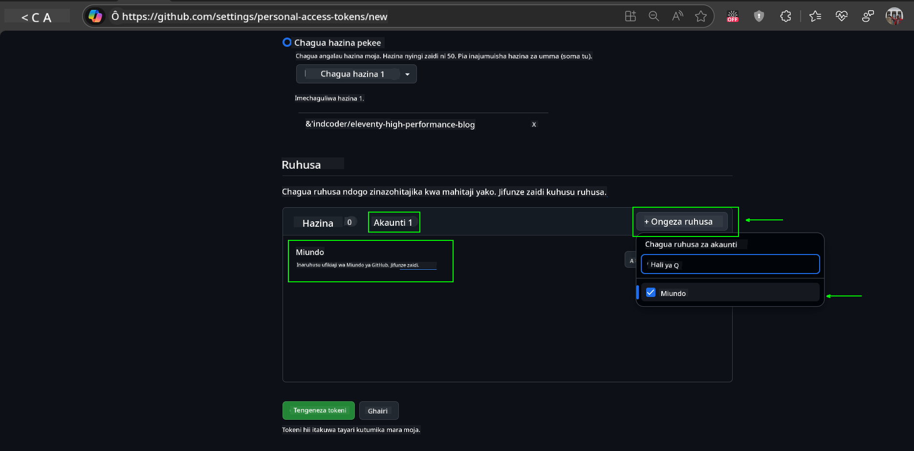
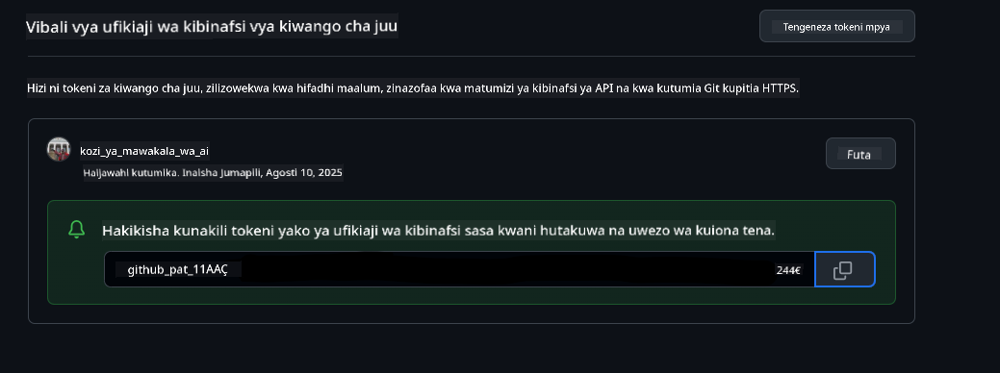
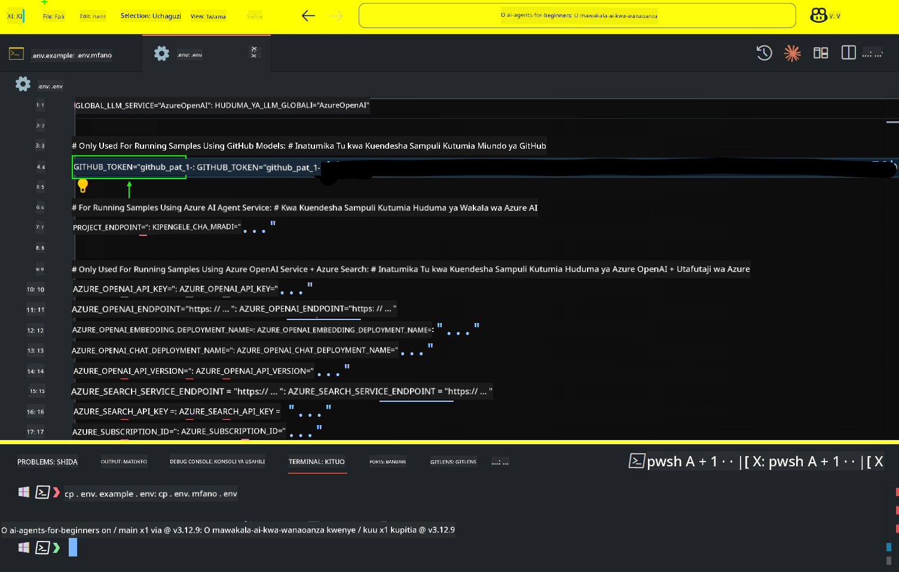

<!--
CO_OP_TRANSLATOR_METADATA:
{
  "original_hash": "96eb7f95375daa3e91778ca0295a55d9",
  "translation_date": "2025-10-15T11:53:04+00:00",
  "source_file": "00-course-setup/README.md",
  "language_code": "sw"
}
-->
# Kuweka Kozi

## Utangulizi

Somo hili litafundisha jinsi ya kuendesha mifano ya msimbo wa kozi hii.

## Jiunge na Wanafunzi Wengine na Pata Msaada

Kabla ya kuanza kunakili repo yako, jiunge na [AI Agents For Beginners Discord channel](https://aka.ms/ai-agents/discord) ili kupata msaada wowote wa kuanzisha, kuuliza maswali kuhusu kozi, au kuungana na wanafunzi wengine.

## Nakili au Fork Repo hii

Ili kuanza, tafadhali nakili au fork GitHub Repository. Hii itakupa toleo lako mwenyewe la nyenzo za kozi ili uweze kuendesha, kujaribu, na kubadilisha msimbo!

Hii inaweza kufanyika kwa kubofya kiungo cha <a href="https://github.com/microsoft/ai-agents-for-beginners/fork" target="_blank">fork repo</a>

Sasa unapaswa kuwa na toleo lako la fork la kozi hii katika kiungo kinachofuata:


### Nakili kwa haraka (inapendekezwa kwa warsha / Codespaces)

  >Repo kamili inaweza kuwa kubwa (~GB 3) unapopakua historia yote na faili zote. Ikiwa unahudhuria tu warsha au unahitaji tu folda chache za somo, nakili kwa haraka (au sparse clone) huepuka upakuaji mwingi kwa kupunguza historia na/au kuruka blobs.

#### Nakili kwa haraka — historia ndogo, faili zote

Badilisha `<your-username>` katika amri zilizo hapa chini na URL ya fork yako (au URL ya upstream ikiwa unapendelea).

Ili kunakili historia ya commit ya hivi karibuni tu (upakuaji mdogo):

```bash|powershell
git clone --depth 1 https://github.com/<your-username>/ai-agents-for-beginners.git
```

Ili kunakili tawi maalum:

```bash|powershell
git clone --depth 1 --branch <branch-name> https://github.com/<your-username>/ai-agents-for-beginners.git
```

#### Nakili kwa sehemu (sparse clone) — blobs ndogo + folda zilizochaguliwa tu

Hii inatumia nakili kwa sehemu na sparse-checkout (inahitaji Git 2.25+ na Git ya kisasa inayopendekezwa na msaada wa nakili kwa sehemu):

```bash|powershell
git clone --depth 1 --filter=blob:none --sparse https://github.com/<your-username>/ai-agents-for-beginners.git
```

Ingia kwenye folda ya repo:

Kwa bash:

```bash
cd ai-agents-for-beginners
```

Kwa Powershell:

```powershell
Set-Location ai-agents-for-beginners
```

Kisha taja ni folda zipi unazotaka (mfano hapa chini unaonyesha folda mbili):

```bash|powershell
git sparse-checkout set 00-course-setup 01-intro-to-ai-agents
```

Baada ya kunakili na kuthibitisha faili, ikiwa unahitaji tu faili na unataka kuokoa nafasi (hakuna historia ya git), tafadhali futa metadata ya repo (💀isiyoweza kurejeshwa — utapoteza utendaji wote wa Git: hakuna commits, pulls, pushes, au ufikiaji wa historia).

Kwa Linux/macOS:

```bash
rm -rf .git
```

Kwa Windows:

```powershell
Remove-Item -Recurse -Force .git
```

#### Kutumia GitHub Codespaces (inapendekezwa kuepuka upakuaji mkubwa wa ndani)

- Unda Codespace mpya kwa repo hii kupitia [GitHub UI](https://github.com/codespaces).  

- Katika terminal ya Codespace mpya iliyoundwa, endesha moja ya amri za nakili kwa haraka/sparse clone zilizo hapo juu ili kuleta folda za somo unazohitaji tu kwenye workspace ya Codespace.
- Hiari: baada ya kunakili ndani ya Codespaces, ondoa .git ili kurejesha nafasi ya ziada (tazama amri za kuondoa hapo juu).
- Kumbuka: Ikiwa unapendelea kufungua repo moja kwa moja kwenye Codespaces (bila nakili ya ziada), fahamu kwamba Codespaces itaunda mazingira ya devcontainer na inaweza bado kuandaa zaidi ya unavyohitaji. Kunakili nakili kwa haraka ndani ya Codespace mpya kunakupa udhibiti zaidi wa matumizi ya diski.

#### Vidokezo

- Daima badilisha URL ya nakili na fork yako ikiwa unataka kuhariri/commit.
- Ikiwa baadaye unahitaji historia zaidi au faili, unaweza kuzipata au kurekebisha sparse-checkout ili kujumuisha folda za ziada.

## Kuendesha Msimbo

Kozi hii inatoa mfululizo wa Jupyter Notebooks ambazo unaweza kuendesha ili kupata uzoefu wa vitendo wa kujenga AI Agents.

Mifano ya msimbo inatumia:

**Inahitaji Akaunti ya GitHub - Bure**:

1) Semantic Kernel Agent Framework + GitHub Models Marketplace. Imewekwa alama kama (semantic-kernel.ipynb)
2) AutoGen Framework + GitHub Models Marketplace. Imewekwa alama kama (autogen.ipynb)

**Inahitaji Usajili wa Azure**:
3) Azure AI Foundry + Azure AI Agent Service. Imewekwa alama kama (azureaiagent.ipynb)

Tunapendekeza ujaribu aina zote tatu za mifano ili kuona ni ipi inayokufaa zaidi.

Chaguo lolote unalochagua, litaamua ni hatua zipi za kuanzisha unazohitaji kufuata hapa chini:

## Mahitaji

- Python 3.12+
  - **NOTE**: Ikiwa huna Python3.12 iliyosakinishwa, hakikisha unaisakinisha. Kisha unda venv yako ukitumia python3.12 ili kuhakikisha matoleo sahihi yamesakinishwa kutoka kwa faili ya requirements.txt.
  
    >Mfano

    Unda folda ya Python venv:

    ``` bash
    python3 -m venv venv
    ```

    Kisha washa mazingira ya venv kwa:

    macOS na Linux

    ```bash
    source venv/bin/activate
    ```
  
    Windows

    ```bash
    venv\Scripts\activate
    ```

- Akaunti ya GitHub - Kwa Ufikiaji wa GitHub Models Marketplace
- Usajili wa Azure - Kwa Ufikiaji wa Azure AI Foundry
- Akaunti ya Azure AI Foundry - Kwa Ufikiaji wa Azure AI Agent Service

Tumeshirikisha faili ya `requirements.txt` katika mzizi wa repo hii ambayo ina pakiti zote za Python zinazohitajika kuendesha mifano ya msimbo.

Unaweza kuzisakinisha kwa kuendesha amri ifuatayo kwenye terminal yako katika mzizi wa repo:

```bash
pip install -r requirements.txt
```
Tunapendekeza kuunda mazingira ya Python virtual ili kuepuka migongano na matatizo.

## Kuweka VSCode
Hakikisha unatumia toleo sahihi la Python katika VSCode.


## Kuweka Mifano kwa Kutumia GitHub Models 

### Hatua ya 1: Pata Tokeni Yako ya Ufikiaji wa Kibinafsi ya GitHub (PAT)

Kozi hii inatumia GitHub Models Marketplace, ikitoa ufikiaji wa bure kwa Large Language Models (LLMs) ambazo utatumia kujenga AI Agents.

Ili kutumia GitHub Models, utahitaji kuunda [GitHub Personal Access Token](https://docs.github.com/en/authentication/keeping-your-account-and-data-secure/managing-your-personal-access-tokens).

Hii inaweza kufanyika kwa kwenda kwenye <a href="https://github.com/settings/personal-access-tokens" target="_blank">Mazingira ya Tokeni za Ufikiaji wa Kibinafsi</a> katika Akaunti yako ya GitHub.

Tafadhali fuata [Kanuni ya Upendeleo Mdogo](https://docs.github.com/en/get-started/learning-to-code/storing-your-secrets-safely) unapoanzisha tokeni yako. Hii inamaanisha unapaswa kutoa tu ruhusa zinazohitajika kwa tokeni kuendesha mifano ya msimbo katika kozi hii.

1. Chagua chaguo la `Fine-grained tokens` upande wa kushoto wa skrini yako kwa kwenda kwenye **Mazingira ya Msanidi Programu**
   

    Kisha chagua `Generate new token`.

    

2. Weka jina la kuelezea kwa tokeni yako linaloonyesha kusudi lake, ili iwe rahisi kutambua baadaye.


    🔐 Pendekezo la Muda wa Tokeni

    Muda unaopendekezwa: siku 30
    Kwa usalama zaidi, unaweza kuchagua muda mfupi—kama siku 7 🛡️
    Ni njia nzuri ya kuweka lengo la kibinafsi na kukamilisha kozi huku ukiwa na kasi ya kujifunza 🚀.

    

3. Punguza wigo wa tokeni kwa fork yako ya repo hii.

    

4. Punguza ruhusa za tokeni: Chini ya **Permissions**, bofya tab ya **Account**, na bofya kitufe cha "+ Add permissions". Kutakuwa na dropdown. Tafadhali tafuta **Models** na weka alama kwenye kisanduku chake.
    

5. Thibitisha ruhusa zinazohitajika kabla ya kuunda tokeni. 

6. Kabla ya kuunda tokeni, hakikisha uko tayari kuhifadhi tokeni katika sehemu salama kama hifadhi ya nywila, kwani haitatolewa tena baada ya kuundwa. 

Nakili tokeni yako mpya ambayo umekuja kuunda. Sasa utaongeza hii kwenye faili yako ya `.env` iliyojumuishwa katika kozi hii.


### Hatua ya 2: Unda Faili Yako ya `.env`

Ili kuunda faili yako ya `.env` endesha amri ifuatayo kwenye terminal yako.

```bash
cp .env.example .env
```

Hii itanakili faili ya mfano na kuunda `.env` katika folda yako ambapo utaweka maadili ya vigezo vya mazingira.

Kwa tokeni yako iliyokopiwa, fungua faili ya `.env` katika mhariri wako wa maandishi unaoupenda na ubandike tokeni yako kwenye sehemu ya `GITHUB_TOKEN`.



Sasa unapaswa kuwa na uwezo wa kuendesha mifano ya msimbo wa kozi hii.

## Kuweka Mifano kwa Kutumia Azure AI Foundry na Huduma ya Azure AI Agent

### Hatua ya 1: Pata Endpoint ya Mradi Wako wa Azure


Fuata hatua za kuunda hub na mradi katika Azure AI Foundry zilizopatikana hapa: [Hub resources overview](https://learn.microsoft.com/en-us/azure/ai-foundry/concepts/ai-resources)


Baada ya kuunda mradi wako, utahitaji kupata string ya muunganisho wa mradi wako.

Hii inaweza kufanyika kwa kwenda kwenye ukurasa wa **Muhtasari** wa mradi wako katika portal ya Azure AI Foundry.


### Hatua ya 2: Unda Faili Yako ya `.env`

Ili kuunda faili yako ya `.env` endesha amri ifuatayo kwenye terminal yako.

```bash
cp .env.example .env
```

Hii itanakili faili ya mfano na kuunda `.env` katika folda yako ambapo utaweka maadili ya vigezo vya mazingira.

Kwa tokeni yako iliyokopiwa, fungua faili ya `.env` katika mhariri wako wa maandishi unaoupenda na ubandike tokeni yako kwenye sehemu ya `PROJECT_ENDPOINT`.

### Hatua ya 3: Ingia kwenye Azure

Kama mazoea bora ya usalama, tutatumia [uthibitishaji bila funguo](https://learn.microsoft.com/azure/developer/ai/keyless-connections?tabs=csharp%2Cazure-cli?WT.mc_id=academic-105485-koreyst) kuingia kwenye Azure OpenAI na Microsoft Entra ID. 

Kisha, fungua terminal na endesha `az login --use-device-code` ili kuingia kwenye akaunti yako ya Azure.

Baada ya kuingia, chagua usajili wako kwenye terminal.


## Vigezo vya Mazingira vya Ziada - Azure Search na Azure OpenAI 

Kwa Somo la Agentic RAG - Somo la 5 - kuna mifano inayotumia Azure Search na Azure OpenAI.

Ikiwa unataka kuendesha mifano hii, utahitaji kuongeza vigezo vifuatavyo vya mazingira kwenye faili yako ya `.env`:

### Ukurasa wa Muhtasari (Mradi)

- `AZURE_SUBSCRIPTION_ID` - Angalia **Maelezo ya Mradi** kwenye ukurasa wa **Muhtasari** wa mradi wako.

- `AZURE_AI_PROJECT_NAME` - Angalia juu ya ukurasa wa **Muhtasari** wa mradi wako.

- `AZURE_OPENAI_SERVICE` - Pata hii katika tab ya **Included capabilities** kwa **Huduma ya Azure OpenAI** kwenye ukurasa wa **Muhtasari**.

### Kituo cha Usimamizi

- `AZURE_OPENAI_RESOURCE_GROUP` - Nenda kwenye **Sifa za Mradi** kwenye ukurasa wa **Muhtasari** wa **Kituo cha Usimamizi**.

- `GLOBAL_LLM_SERVICE` - Chini ya **Rasilimali Zilizounganishwa**, pata jina la muunganisho wa **Huduma za Azure AI**. Ikiwa haijaorodheshwa, angalia **portal ya Azure** chini ya kikundi chako cha rasilimali kwa jina la rasilimali za AI Services.

### Ukurasa wa Models + Endpoints

- `AZURE_OPENAI_EMBEDDING_DEPLOYMENT_NAME` - Chagua mfano wako wa embedding (mfano, `text-embedding-ada-002`) na kumbuka **Jina la Utekelezaji** kutoka kwa maelezo ya mfano.

- `AZURE_OPENAI_CHAT_DEPLOYMENT_NAME` - Chagua mfano wako wa mazungumzo (mfano, `gpt-4o-mini`) na kumbuka **Jina la Utekelezaji** kutoka kwa maelezo ya mfano.

### Portal ya Azure

- `AZURE_OPENAI_ENDPOINT` - Tafuta **Huduma za Azure AI**, bofya juu yake, kisha nenda kwenye **Usimamizi wa Rasilimali**, **Keys and Endpoint**, shuka chini kwenye "Azure OpenAI endpoints", na nakili ile inayosema "Language APIs".

- `AZURE_OPENAI_API_KEY` - Kutoka skrini hiyo hiyo, nakili KEY 1 au KEY 2.

- `AZURE_SEARCH_SERVICE_ENDPOINT` - Pata rasilimali yako ya **Azure AI Search**, bofya juu yake, na angalia **Muhtasari**.

- `AZURE_SEARCH_API_KEY` - Kisha nenda kwenye **Mipangilio** na kisha **Keys** ili kunakili funguo kuu au sekondari ya admin.

### Ukurasa wa Nje

- `AZURE_OPENAI_API_VERSION` - Tembelea ukurasa wa [API version lifecycle](https://learn.microsoft.com/en-us/azure/ai-services/openai/api-version-deprecation#latest-ga-api-release) chini ya **Latest GA API release**.

### Kuweka uthibitishaji bila funguo

Badala ya kuweka maelezo yako ya kuingia, tutatumia muunganisho bila funguo na Azure OpenAI. Ili kufanya hivyo, tutaleta `DefaultAzureCredential` na baadaye tutaendesha kazi ya `DefaultAzureCredential` kupata uthibitisho.

```python
from azure.identity import DefaultAzureCredential, InteractiveBrowserCredential
```

## Umekwama Mahali Fulani?
Ikiwa unakutana na changamoto yoyote wakati wa kuendesha mpangilio huu, jiunge na <a href="https://discord.gg/kzRShWzttr" target="_blank">Azure AI Community Discord</a> au <a href="https://github.com/microsoft/ai-agents-for-beginners/issues?WT.mc_id=academic-105485-koreyst" target="_blank">unda suala</a>.

## Somo Linalofuata

Sasa uko tayari kuendesha msimbo wa kozi hii. Furahia kujifunza zaidi kuhusu ulimwengu wa Mawakala wa AI!

[Utangulizi wa Mawakala wa AI na Matumizi ya Mawakala](../01-intro-to-ai-agents/README.md)

---

**Kanusho**:  
Hati hii imetafsiriwa kwa kutumia huduma ya kutafsiri ya AI [Co-op Translator](https://github.com/Azure/co-op-translator). Ingawa tunajitahidi kwa usahihi, tafadhali fahamu kuwa tafsiri za kiotomatiki zinaweza kuwa na makosa au kutokuwa sahihi. Hati ya asili katika lugha yake ya asili inapaswa kuzingatiwa kama chanzo cha mamlaka. Kwa taarifa muhimu, tafsiri ya kitaalamu ya binadamu inapendekezwa. Hatutawajibika kwa kutoelewana au tafsiri zisizo sahihi zinazotokana na matumizi ya tafsiri hii.