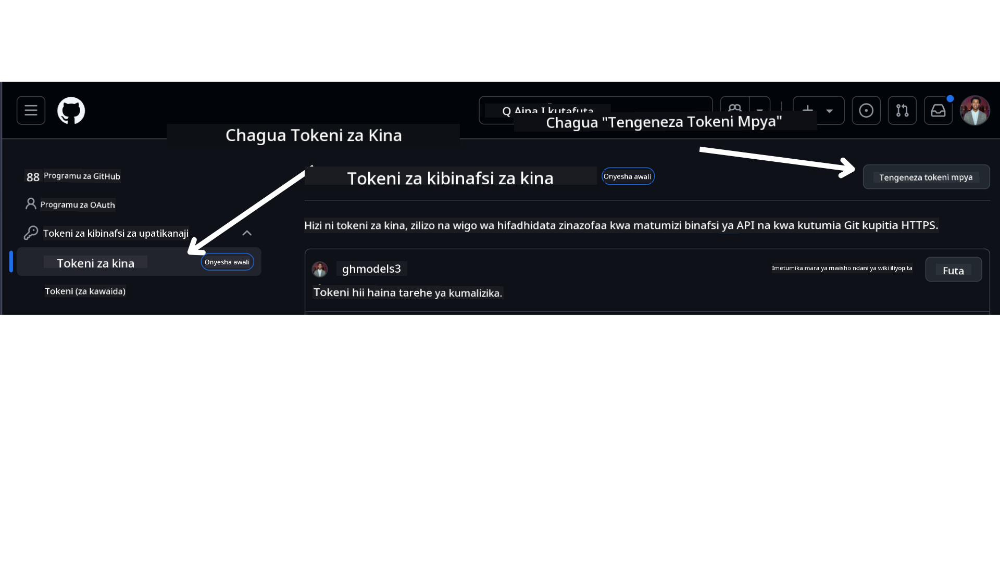
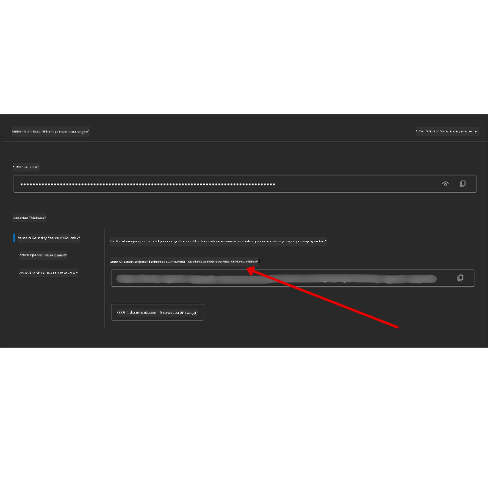

<!--
CO_OP_TRANSLATOR_METADATA:
{
  "original_hash": "76945069b52a49cd0432ae3e0b0ba22e",
  "translation_date": "2025-07-12T07:55:17+00:00",
  "source_file": "00-course-setup/README.md",
  "language_code": "sw"
}
-->
kwenye Akaunti yako ya GitHub.

Chagua chaguo la `Fine-grained tokens` upande wa kushoto wa skrini yako.

Kisha chagua `Generate new token`.



Utaombwa kuingiza jina la token yako, chagua tarehe ya kumalizika (Inapendekezwa: Siku 30), na chagua wigo wa token yako (Public Repositories).

Pia ni muhimu kuhariri ruhusa za token hii: Permissions -> Models -> Inaruhusu upatikanaji wa GitHub Models

Nakili token mpya uliyotengeneza. Sasa utaongeza hii kwenye faili lako la `.env` lililojumuishwa katika kozi hii.

### Hatua ya 2: Tengeneza Faili lako la `.env`

Ili kuunda faili yako ya `.env` endesha amri ifuatayo kwenye terminal yako.

```bash
cp .env.example .env
```  

Hii itanakili faili ya mfano na kuunda `.env` kwenye saraka yako ambapo utaweka maadili ya vigezo vya mazingira.

Baada ya kunakili token yako, fungua faili la `.env` kwenye mhariri wako wa maandishi unayependa na weka token yako kwenye sehemu ya `GITHUB_TOKEN`.

Sasa unapaswa kuwa na uwezo wa kuendesha sampuli za msimbo wa kozi hii.

## Kuandaa Sampuli zinazotumia Azure AI Foundry na Azure AI Agent Service

### Hatua ya 1: Pata Endpoint ya Mradi Wako wa Azure  

Fuata hatua za kuunda hub na mradi katika Azure AI Foundry zilizopatikana hapa: [Hub resources overview](https://learn.microsoft.com/en-us/azure/ai-foundry/concepts/ai-resources)

Mara baada ya kuunda mradi wako, utahitaji kupata mfuatano wa muunganisho wa mradi wako.

Hii inaweza kufanywa kwa kwenda kwenye ukurasa wa **Overview** wa mradi wako katika portal ya Azure AI Foundry.



### Hatua ya 2: Tengeneza Faili lako la `.env`

Ili kuunda faili yako ya `.env` endesha amri ifuatayo kwenye terminal yako.

```bash
cp .env.example .env
```  

Hii itanakili faili ya mfano na kuunda `.env` kwenye saraka yako ambapo utaweka maadili ya vigezo vya mazingira.

Baada ya kunakili token yako, fungua faili la `.env` kwenye mhariri wako wa maandishi unayependa na weka token yako kwenye sehemu ya `PROJECT_ENDPOINT`.

### Hatua ya 3: Ingia kwenye Azure  

Kama utaratibu bora wa usalama, tutatumia [uthibitishaji usiotumia funguo](https://learn.microsoft.com/azure/developer/ai/keyless-connections?tabs=csharp%2Cazure-cli?WT.mc_id=academic-105485-koreyst) kuingia kwenye Azure OpenAI kwa Microsoft Entra ID. Kabla hujaweza kufanya hivyo, kwanza utahitaji kusakinisha **Azure CLI** kulingana na [maelekezo ya usakinishaji](https://learn.microsoft.com/cli/azure/install-azure-cli?WT.mc_id=academic-105485-koreyst) kwa mfumo wako wa uendeshaji.

Kisha, fungua terminal na endesha `az login --use-device-code` ili kuingia kwenye akaunti yako ya Azure.

Baada ya kuingia, chagua usajili wako kwenye terminal.

## Mabadiliko ya Mazingira Zaidi - Azure Search na Azure OpenAI

Kwa Somo la Agentic RAG - Somo la 5 - kuna sampuli zinazotumia Azure Search na Azure OpenAI.

Ikiwa unataka kuendesha sampuli hizi, utahitaji kuongeza vigezo vifuatavyo vya mazingira kwenye faili yako ya `.env`:

### Ukurasa wa Muhtasari (Mradi)  

- `AZURE_SUBSCRIPTION_ID` - Angalia **Maelezo ya Mradi** kwenye ukurasa wa **Overview** wa mradi wako.

- `AZURE_AI_PROJECT_NAME` - Angalia juu ya ukurasa wa **Overview** wa mradi wako.  

- `AZURE_OPENAI_SERVICE` - Pata hii kwenye kichupo cha **Included capabilities** kwa **Azure OpenAI Service** kwenye ukurasa wa **Overview**.  

### Kituo cha Usimamizi  

- `AZURE_OPENAI_RESOURCE_GROUP` - Nenda kwenye **Sifa za Mradi** kwenye ukurasa wa **Overview** wa **Management Center**.

- `GLOBAL_LLM_SERVICE` - Chini ya **Rasilimali Zilizounganishwa**, pata jina la muunganisho wa **Azure AI Services**. Ikiwa haijaorodheshwa, angalia **portal ya Azure** chini ya kundi lako la rasilimali kwa jina la rasilimali ya AI Services.

### Ukurasa wa Mifano + Endpoint

- `AZURE_OPENAI_EMBEDDING_DEPLOYMENT_NAME` - Chagua mfano wako wa embedding (mfano, `text-embedding-ada-002`) na kumbuka **Jina la Utekelezaji** kutoka kwa maelezo ya mfano.

- `AZURE_OPENAI_CHAT_DEPLOYMENT_NAME` - Chagua mfano wako wa mazungumzo (mfano, `gpt-4o-mini`) na kumbuka **Jina la Utekelezaji** kutoka kwa maelezo ya mfano.

### Portal ya Azure

- `AZURE_OPENAI_ENDPOINT` - Tafuta **Huduma za Azure AI**, bonyeza hapo, kisha nenda kwenye **Usimamizi wa Rasilimali**, **Funguo na Endpoint**, shuka chini hadi "Azure OpenAI endpoints", na nakili ile inayosema "Language APIs".

- `AZURE_OPENAI_API_KEY` - Kutoka kwenye skrini ile ile, nakili KEY 1 au KEY 2.

- `AZURE_SEARCH_SERVICE_ENDPOINT` - Pata rasilimali yako ya **Azure AI Search**, bonyeza, na ona **Overview**.

- `AZURE_SEARCH_API_KEY` - Kisha nenda kwenye **Mipangilio** na kisha **Funguo** ili kunakili funguo kuu au ya ziada ya msimamizi.

### Tovuti ya Nje

- `AZURE_OPENAI_API_VERSION` - Tembelea ukurasa wa [mzunguko wa toleo la API](https://learn.microsoft.com/en-us/azure/ai-services/openai/api-version-deprecation#latest-ga-api-release) chini ya **Latest GA API release**.

### Usanidi wa uthibitishaji bila funguo  

Badala ya kuweka sifa zako moja kwa moja, tutatumia muunganisho bila funguo na Azure OpenAI. Ili kufanya hivyo, tutaingiza `DefaultAzureCredential` na baadaye kuita kazi ya `DefaultAzureCredential` ili kupata sifa.

```python
from azure.identity import DefaultAzureCredential, InteractiveBrowserCredential
```  

## Umekwama Wapi?

Kama unakutana na matatizo yoyote kuendesha usanidi huu, jiunge na jamii yetu au

.

## Somo Linalofuata

Sasa uko tayari kuendesha msimbo wa kozi hii. Jifunze kwa furaha zaidi kuhusu ulimwengu wa Mawakala wa AI!  

[Utangulizi wa Wakala wa AI na Matumizi ya Wakala](../01-intro-to-ai-agents/README.md)

**Kiarifu cha Kutotegemea**:  
Hati hii imetafsiriwa kwa kutumia huduma ya tafsiri ya AI [Co-op Translator](https://github.com/Azure/co-op-translator). Ingawa tunajitahidi kwa usahihi, tafadhali fahamu kwamba tafsiri za kiotomatiki zinaweza kuwa na makosa au upungufu wa usahihi. Hati ya asili katika lugha yake ya asili inapaswa kuchukuliwa kama chanzo cha mamlaka. Kwa taarifa muhimu, tafsiri ya kitaalamu inayofanywa na binadamu inapendekezwa. Hatubebei dhamana kwa kutoelewana au tafsiri potofu zinazotokana na matumizi ya tafsiri hii.