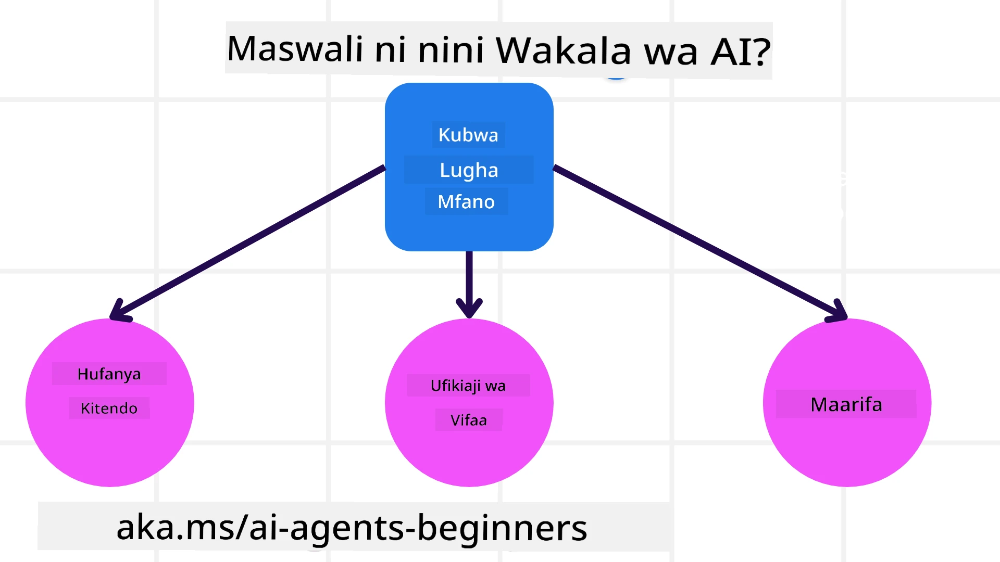
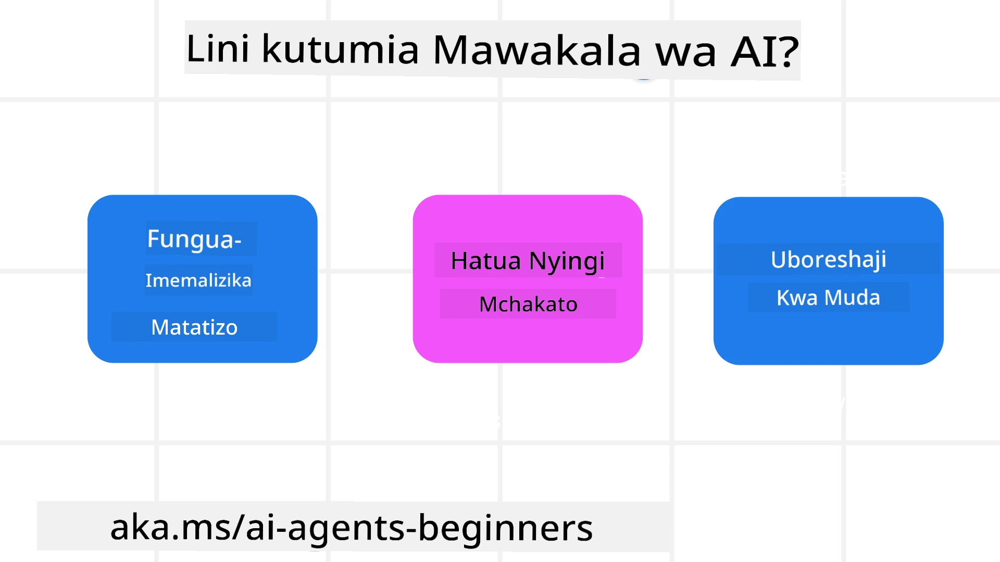

> _(Bonyeza picha hapo juu ili kuangalia video ya somo hili)_

# Utangulizi wa Maajenti ya AI na Matumizi ya Maajenti

Karibu kwenye kozi "AI Agents for Beginners"! Kozi hii inatoa maarifa ya msingi na mifano ya vitendo kwa ajili ya kujenga Maajenti ya AI.

Jiunge na <a href="https://discord.gg/kzRShWzttr" target="_blank">Jamii ya Discord ya Azure AI</a> ili kukutana na wanafunzi wengine na Wajenzi wa Maajenti ya AI na kuuliza maswali yoyote unayo kuhusu kozi hii.

Ili kuanza kozi hii, tunaweka msingi kwa kukuelewa vizuri ni nini Maajenti ya AI na jinsi tunavyoweza kuvitumia katika programu na taratibu tunazojenga.

## Utangulizi

Somo hili linajumuisha:

- Maajenti ya AI ni nini na ni aina gani za maajenti zipo?
- Ni matumizi gani mazuri kwa Maajenti ya AI na yanaweza kutusaidia vipi?
- Ni vipengele gani vya msingi vinavyotumika wakati wa kubuni Suluhisho za Maajenti?

## Malengo ya Kujifunza
Baada ya kumaliza somo hili, unapaswa kuwa na uwezo wa:

- Kuelewa dhana za Maajenti ya AI na jinsi zinavyotofautiana na suluhisho zingine za AI.
- Kutumia Maajenti ya AI kwa ufanisi zaidi.
- Kubuni suluhisho za Maajenti kwa tija kwa watumiaji na wateja.

## Kuelezea Maajenti ya AI na Aina za Maajenti

### Maajenti ya AI ni nini?

Maajenti ya AI ni **mifumo** inayowezesha **Modeli Kubwa za Lugha(LLMs)** **kutekeleza vitendo** kwa kuongeza uwezo wao kwa kuwapatia LLMs **ufikiaji wa zana** na **maarifa**.

Tuchambue ufafanuzi huu kwa sehemu ndogo:

- **Mfumo** - Ni muhimu kufikiria kuhusu maajenti si kama kipengele kimoja tu bali kama mfumo wa vipengele vingi. Kiwango cha msingi, vipengele vya Maajenti ya AI ni:
  - **Mazingira** - Nafasi iliyoainishwa ambapo Maajenti ya AI inafanya kazi. Kwa mfano, kama tungekuwa na wakala wa kuhifadhi safari, mazingira yanaweza kuwa mfumo wa uhifadhi wa safari ambao Wakala wa AI anautumia kukamilisha kazi.
  - **Sensori** - Mazingira yana taarifa na hutoa mrejesho. Maajenti ya AI hutumia sensori kukusanya na kutafsiri taarifa hii kuhusu hali ya sasa ya mazingira. Katika mfano wa Wakala wa Kuhifadhi Safari, mfumo wa uhifadhi unaweza kutoa taarifa kama upatikanaji wa hoteli au bei za ndege.
  - **Vitendaji** - Mara tu Wakala wa AI anapopokea hali ya sasa ya mazingira, kwa kazi ya sasa wakala huchagua hatua gani ya kufanya ili kubadilisha mazingira. Kwa wakala wa kuhifadhi safari, inaweza kuwa kuhifadhi chumba kinachopatikana kwa mtumiaji.

**Modeli Kubwa za Lugha** - Dhana ya maajenti ilikuwepo kabla ya uumbaji wa LLMs. Faida ya kujenga Maajenti ya AI kwa LLMs ni uwezo wao wa kutafsiri lugha ya binadamu na data. Uwezo huu unawawezesha LLMs kutafsiri taarifa za mazingira na kutengeneza mpango wa kubadilisha mazingira.

**Kutekeleza Vitendo** - Nje ya mifumo ya Maajenti ya AI, LLMs zina mipaka ambapo tendo ni kuzalisha maudhui au taarifa kulingana na ombi la mtumiaji. Ndani ya mifumo ya Maajenti ya AI, LLMs zinaweza kutekeleza kazi kwa kutafsiri ombi la mtumiaji na kutumia zana zinazopatikana katika mazingira yao.

**Upatikanaji wa Zana** - Zana ambazo LLM ina ufikiaji zinafafanuliwa na 1) mazingira ambayo inafanya kazi ndani yake na 2) mjenzi wa Maajenti ya AI. Kwa mfano wetu wa wakala wa kusafiri, zana za wakala zinaletwa na shughuli zinazopatikana katika mfumo wa uhifadhi, na/au mjenzi anaweza kupunguza ufikiaji wa zana za wakala kwa ndege pekee.

**Kumbukumbu+Maarifa** - Kumbukumbu inaweza kuwa ya muda mfupi katika muktadha wa mazungumzo kati ya mtumiaji na wakala. Kwa muda mrefu, nje ya taarifa zinazotolewa na mazingira, Maajenti ya AI pia wanaweza kupata maarifa kutoka kwa mifumo mingine, huduma, zana, na hata maajenti wengine. Katika mfano wa wakala wa kusafiri, maarifa haya yanaweza kuwa taarifa za mapendeleo ya kusafiri za mtumiaji zilizomo katika hifadhidata ya wateja.

### Aina tofauti za maajenti

Sasa tunapoelewa ufafanuzi wa jumla wa Maajenti ya AI, hebu tazame aina maalum za maajenti na jinsi zingetumika kwa wakala wa kuhifadhi safari.

| **Aina ya Maajenti**                | **Maelezo**                                                                                                                       | **Mfano**                                                                                                                                                                                                                   |
| ----------------------------- | ------------------------------------------------------------------------------------------------------------------------------------- | ----------------------------------------------------------------------------------------------------------------------------------------------------------------------------------------------------------------------------- |
| **Maajenti wa Refleksi Rahisi**      | Hufanya vitendo vya papo hapo kulingana na sheria zilizopangwa awali.                                                                                  | Wakala wa kusafiri hufasiri muktadha wa barua pepe na kutuma malalamiko ya kusafiri kwa huduma kwa wateja.                                                                                                                          |
| **Maajenti wa Refleksi Wenye Mfano** | Hufanya vitendo kulingana na mfano wa dunia na mabadiliko ya mfano huo.                                                              | Wakala wa kusafiri huweka kipaumbele njia zilizo na mabadiliko makubwa ya bei kulingana na ufikiaji wa data ya bei ya kihistoria.                                                                                                             |
| **Maajenti Yanayotegemea Lengo**         | Huunda mipango ya kufikia malengo maalum kwa kutafsiri lengo na kuamua hatua za kulifikia.                                  | Wakala wa kusafiri huhifadhi safari kwa kuamua maandalizi muhimu ya kusafiri (gari, usafiri wa umma, ndege) kutoka mahali ulipo hadi sehemu unayotaka kufika.                                                                                |
| **Maajenti Yanayotegemea Manufaa**      | Huzingatia mapendeleo na kupima mabadiliko kwa nambari ili kuamua jinsi ya kufikia malengo.                                               | Wakala wa kusafiri huongeza manufaa kwa kupima urahisi dhidi ya gharama wakati wa kuhifadhi safari.                                                                                                                                          |
| **Maajenti Yanayojifunza**           | Huongeza ufanisi kwa muda kwa kujibu maoni na kurekebisha vitendo ipasavyo.                                                        | Wakala wa kusafiri huboresha huduma kwa kutumia maoni ya wateja kutoka kwa tafiti za baada ya safari ili kufanya marekebisho kwa uhifadhi wa baadaye.                                                                                                               |
| **Maajenti ya Kihierarkia**       | Ina maajenti mengi katika mfumo wa safu, ambapo maajenti wa ngazi ya juu hujenga kazi kuwa ndogo kwa maajenti wa ngazi ya chini kukamilisha. | Wakala wa kusafiri hurudisha safari kwa kugawa kazi kuwa vitendaji vidogo (kwa mfano, kughairi uhifadhi maalum) na kuwaacha maajenti wa ngazi ya chini waendeleze kazi hizo, wakiripoti kwa wakala wa ngazi ya juu.                                     |
| **Mifumo ya Maajenti Wengi (MAS)** | Maajenti hukamilisha kazi kwa uhuru, iwe kwa ushirikiano au kwa ushindani.                                                           | Ushirikiano: Maajenti wengi huhifadhi huduma maalum za kusafiri kama hoteli, ndege, na burudani. Ushindani: Maajenti wengi hushughulikia na kushindana juu ya kalenda ya uhifadhi wa hoteli iliyo sambamba ili kuwabukisha wateja ndani ya hoteli. |

## Wakati wa Kutumia Maajenti ya AI

Katika sehemu ya awali, tulitumia kesi ya matumizi ya Wakala wa Kusafiri ili kuelezea jinsi aina tofauti za maajenti zinavyoweza kutumika katika matukio tofauti ya uhifadhi wa safari. Tutaendelea kutumia programu hii katika kozi nzima.

Tazama aina za kesi za matumizi ambazo Maajenti ya AI yanafaa kwao:

- **Matatizo Yasiyo na Mwisho Wazi** - kuwaruhusu LLM kuamua hatua zinazohitajika kukamilisha kazi kwa sababu haiwezi kila wakati kuwekwa kwa nambari moja kwa moja katika mtiririko wa kazi.
- **Mchakato wa Hatua Nyingi** - kazi zinazohitaji ngazi ya ugumu ambapo Wakala wa AI anahitaji kutumia zana au taarifa kwa hatua nyingi badala ya kupata katika hatua moja tu.  
- **Kuboresha Kwa Muda** - kazi ambapo wakala anaweza kuboresha kwa muda kwa kupokea maoni kutoka mazingira yake au watumiaji ili kutoa manufaa bora.

Tunaangazia zaidi mambo ya kuzingatia kuhusu kutumia Maajenti ya AI katika somo la Kujenga Maajenti wa AI Wanaoaminika.

## Misingi ya Suluhisho za Maajenti

### Uundaji wa Maajenti

Hatua ya kwanza katika kubuni mfumo wa Maajenti ya AI ni kufafanua zana, vitendo, na mwenendo. Katika kozi hii, tunazingatia kutumia **Azure AI Agent Service** kutufafanulia Maajenti yetu. Inatoa vipengele kama:

- Uchaguzi wa Modeli Wazi kama OpenAI, Mistral, na Llama
- Matumizi ya Data iliyo na Leseni kupitia watoa huduma kama Tripadvisor
- Matumizi ya zana za OpenAPI 3.0 zilizostandadishwa

### Mifumo ya Maajenti

Mawasiliano na LLM ni kupitia maelekezo (prompts). Kutokana na asili ya nusu-huru ya Maajenti ya AI, si kila mara inawezekana au inahitajika kuomba tena kwa mkono LLM baada ya mabadiliko katika mazingira. Tunatumia **Mifumo ya Maajenti** inayoturuhusu kuomba LLM kwa hatua nyingi kwa njia inayoweza kupanuka zaidi.

Kozi hii imegawanywa kwa baadhi ya mifumo ya Maajenti inayopendwa kwa sasa.

### Miundombinu ya Maajenti

Miundombinu ya Maajenti inaruhusu wajenzi kutekeleza mifumo ya maajenti kupitia msimbo. Miundombinu hii inatoa templeti, vijumlishi, na zana za ushirikiano bora wa Maajenti ya AI. Faida hizi zinatoa uwezo wa uangalizi bora na utatuzi wa matatizo ya mifumo ya Maajenti ya AI.

Katika kozi hii, tutachunguza Microsoft Agent Framework (MAF) kwa ajili ya kujenga maajenti tayari kwa uzalishaji.

## Mifano ya Msimbo

- Python: [Mfumo wa Maajenti](./code_samples/01-python-agent-framework.ipynb)
- .NET: [Mfumo wa Maajenti](./code_samples/01-dotnet-agent-framework.md)

## Una Maswali Zaidi kuhusu Maajenti ya AI?

Jiunge na [Discord ya Microsoft Foundry](https://aka.ms/ai-agents/discord) ili kukutana na wanafunzi wengine, kuhudhuria saa za ofisi na kupata majibu ya maswali yako kuhusu Maajenti ya AI.

## Somo la Awali

[Usanidi wa Kozi](../00-course-setup/README.md)

## Somo Linalofuata

[Kuchunguza Miundombinu ya Maajenti](../02-explore-agentic-frameworks/README.md)

---

<!-- CO-OP TRANSLATOR DISCLAIMER START -->
Taarifa ya kutokuwajibika:
Nyaraka hii imetafsiriwa kwa kutumia huduma ya tafsiri ya AI [Co-op Translator](https://github.com/Azure/co-op-translator). Ingawa tunajitahidi kuhakikisha usahihi, tafadhali fahamu kwamba tafsiri za kiotomatiki zinaweza kuwa na makosa au kutokuwa sahihi. Nyaraka ya asili katika lugha yake ya asili inapaswa kuchukuliwa kuwa chanzo chenye mamlaka. Kwa taarifa muhimu, inashauriwa kutumia huduma ya tafsiri ya mtaalamu wa binadamu. Hatuwajibiki kwa uelewa potofu au tafsiri isiyo sahihi inayotokana na matumizi ya tafsiri hii.
<!-- CO-OP TRANSLATOR DISCLAIMER END -->