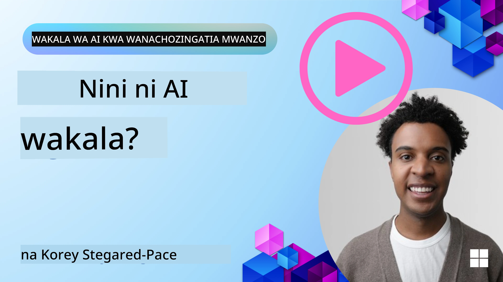
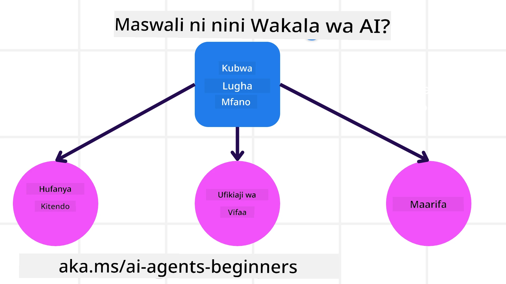
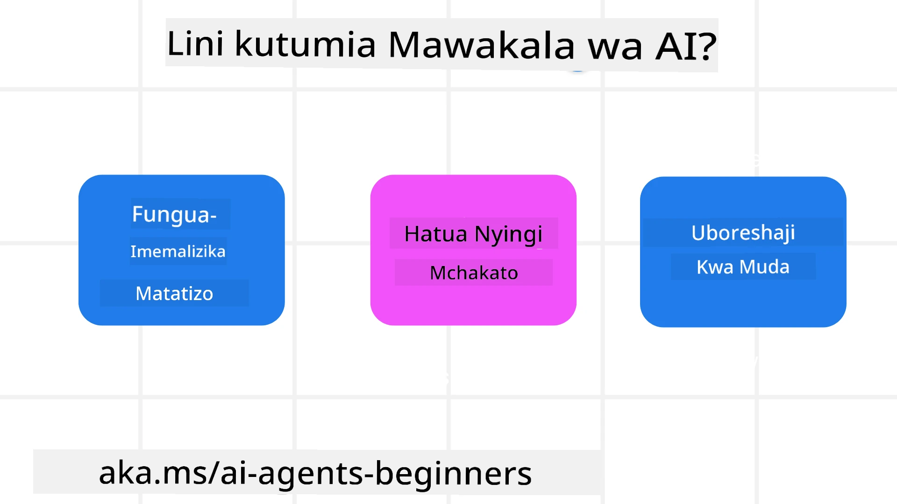

> _(Bonyeza picha hapo juu kutazama video ya somo hili)_

# Utangulizi kwa Wakala wa AI na Matumizi ya Wakala

Karibu kwenye kozi ya **Wakala wa AI kwa Waanzilishi**! Kozi hii inakupa maarifa ya msingi — na nambari halisi inayofanya kazi — kuanza kujenga Wakala wa AI kutoka mwanzoni.

Njoo sema hi katika <a href="https://discord.gg/kzRShWzttr" target="_blank">Jumuiya ya Azure AI Discord</a> — imejaa wanafunzi na wajenzi wa AI wanaofurahia kujibu maswali.

Kabla hatujaanza kujenga, tuhakikishe tunayafahamu kweli ni nini Wakala wa AI *yuli* na lini inafaa kutumia mmoja.

---

## Utangulizi

Somo hili linajumuisha:

- Nini Wakala wa AI ni, na aina tofauti zinazopatikana
- Aina gani za kazi Wakala wa AI wanafaa zaidi kwao
- Misingi ya ujenzi utakayotumia unapounda suluhisho la Wakala

## Malengo ya Kujifunza

Mwisho wa somo hili, unapaswa kuwa na uwezo wa:

- Eleza ni nini Wakala wa AI ni na jinsi unavyotofautiana na suluhisho la kawaida la AI
- Jua lini unapaswa kutumia Wakala wa AI (na lini usitumie)
- Chora mchoro wa muundo wa suluhisho la Wakala kwa tatizo halisi duniani

---

## Kufafanua Wakala wa AI na Aina za Wakala wa AI

### Wakala wa AI ni nini?

Hapa kuna njia rahisi ya kufikiria kuhusu hilo:

> **Wakala wa AI ni mifumo inayoruhusu Mifano Mikubwa ya Lugha (LLMs) kweli *kufanya mambo* — kwa kuwapa zana na maarifa kufanya vitendo duniani, siyo tu kujibu maombi.**

Hebu tunaelezee kidogo:

- **Mfumo** — Wakala wa AI si kitu kimoja tu. Ni mkusanyiko wa sehemu zinazofanya kazi pamoja. Katika msingi wake, kila wakala ana vipande vitatu:
  - **Mazingira** — Eneo ambalo wakala anafanya kazi. Kwa wakala wa kuhudumia usafiri, hili ni jukwaa la uhakiki wa tiketi yenyewe.
  - **Sensori** — Jinsi wakala anavyosoma hali ya sasa ya mazingira yake. Wakala wetu wa usafiri anaweza kuangalia upatikana wa hoteli au bei za ndege.
  - **Vifaa vinavyofanya vitendo** — Jinsi wakala anavyotoa hatua. Wakala wa usafiri anaweza kuhakiki chumba, kutuma uthibitisho, au kufuta uhifadhi.

- **Mifano Mikubwa ya Lugha** — Wakala walikuwepo kabla ya LLMs, lakini LLMs ndio yaliyofanya wakala wa kisasa kuwa wenye nguvu sana. Wanaweza kuelewa lugha asilia, kufikiria muktadha, na kubadilisha ombi duni la mtumiaji kuwa mpango thabiti wa hatua.

- **Kufanya Vitendo** — Bila mfumo wa wakala, LLM hutengeneza tu maandishi. Ndani ya mfumo wa wakala, LLM inaweza kweli *kutekeleza* hatua — kutafuta hifadhidata, kuitisha API, kutuma ujumbe.

- **Upatikanaji wa Zana** — Zana ambazo wakala anaweza kutumia zinategemea (1) mazingira anayotumia na (2) mabadiliko aliyopatia mtengenezaji. Wakala wa usafiri anaweza kutafuta ndege lakini hasi kurekebisha rekodi za wateja — yote ni kuhusu unachounganisha.

- **Kumbukumbu + Maarifa** — Wakala wanaweza kuwa na kumbukumbu za muda mfupi (mazungumzo ya sasa) na kumbukumbu za muda mrefu (hifadhidata ya mteja, mawasiliano ya zamani). Wakala wa usafiri anaweza "kukumbuka" kuwa unapendelea viti kando ya dirisha.

---

### Aina Tofauti za Wakala wa AI

Si wakala wote wamejengwa kwa njia moja. Hapa ni muhtasari wa aina kuu, kwa kutumia mfano wa wakala wa kuhudumia usafiri:

| **Aina ya Wakala** | **Kilichofanyika** | **Mfano wa Wakala wa Usafiri** |
|---|---|---|
| **Wakala wa Mwendo wa Moja Rahisi** | Hufuata kanuni ngumu zilizowekwa — haina kumbukumbu, haina upangaji. | Anaona barua ya malalamiko → anaiongeza kwa huduma kwa wateja. Hilo ndilo tu. |
| **Wakala wa Mwendo wa Mfano** | Huweka mfano wa ndani wa dunia na kuuboresha kadri mambo yanavyobadilika. | Hufuatilia bei za ndege za kihistoria na kuashiria njia ambazo ghafla zina gharama kubwa. |
| **Wakala wa Msingi wa Lengo** | Ana lengo akilini na hubaini jinsi ya kufikia hatua kwa hatua. | Anakagua safari nzima (ndege, gari, hoteli) kuanzia mahali ulipo sasa hadi kufika marudio yako. |
| **Wakala wa Msingi wa Utiliti** | Hapatatui *suluhisho* tu — hutafuta *suluhisho bora* kwa kupima masuala. | Analinganisha gharama dhidi ya urahisi kupata safari inayokidhi zaidi vipaumbele vyako. |
| **Wakala wa Kujifunza** | Huboreka kwa muda kwa kujifunza kutokana na maoni. | Hubadilisha mapendekezo ya kuhakiki safari za baadaye kulingana na matokeo ya tafiti baada ya safari. |
| **Wakala wa Ngazi mbalimbali** | Wakala wa kiwango cha juu hutenganisha kazi katika sehemu ndogo na kuziagiza wakala wa ngazi ya chini. | Ombi la "kufuta safari" hugawanyika kuwa: futa ndege, futa hoteli, futa upangaji wa gari — kila moja hutatuliwa na wakala msaidizi. |
| **Mifumo ya Wakala Wengi (MAS)** | Wakala wengi hufanya kazi kwa pamoja (au kushindana). | Ushirikiano: wakala wa tofauti hutumia hoteli, ndege, na burudani. Ushindani: wakala wengi wanashindana kujaza vyumba vya hoteli kwa bei bora. |

---

## Lini Kutumia Wakala wa AI

Kwa sababu unaweza kutumia Wakala wa AI haimaanishi kila wakati unapaswa kutumia. Hapa ni hali ambazo wakala huangaza kweli:

- **Matatizo Yasiyokuwa na Msimamo Mkali** — Wakati hatua za kutatua tatizo haziwezi kuandikwa kabla. Unahitaji LLM kubaini njia kwa nguvu za muktadha.
- **Mchakato wa Hatua Nyingi** — Kazi zinazohitaji kutumia zana kwenye hatua nyingi, siyo tu kutafuta au kuzalisha mara moja.
- **Kuboresha Muda Mrefu** — Unapopenda mfumo uboreke kutokana na maoni ya mtumiaji au ishara za mazingira.

Tutachambua zaidi lini (na lini *si* za kutumia) Wakala wa AI katika somo la **Kujenga Wakala wa AI wa Kuaminika** baadaye kwenye kozi.

---

## Misingi ya Suluhisho la Wakala

### Maendeleo ya Wakala

Kitu cha kwanza unachofanya unapojenga wakala ni kufafanua *anachokifanya* — zana zake, vitendo, na tabia.

Katika kozi hii, tunatumia **Huduma ya Wakala ya Microsoft Foundry** kama jukwaa letu kuu. Inasaidia:

- Mifano kutoka kwa watoaji kama OpenAI, Mistral, na Meta (Llama)
- Data iliyoruhusiwa kutoka kwa watoaji kama Tripadvisor
- Maelezo ya zana ya OpenAPI 3.0 yaliyosanifishwa

### Mifumo ya Wakala

Unawasiliana na LLM kupitia maelekezo. Kwa wakala, huwezi kwa mikono kuunda kila maelekezo — wakala anahitaji kuchukua hatua katika hatua nyingi. Hivyo ndipo **Mifumo ya Wakala** inakuja. Ni mikakati inayoweza kutumika tena kwa kutoa maelekezo na kuandaa LLM kwa njia inayoweza kupanuka na kutegemewa zaidi.

Kozi hii imepangwa kuzunguka mifumo ya wakala inayotumika zaidi na yenye manufaa.

### Mifumo ya Wakala

Mifumo ya Wakala huwapa watengenezaji mifano tayari, zana, na miundombinu ya kujenga wakala. Huwezesha:

- Kuunganisha zana na uwezo
- Kuangalia kinachofanyika na wakala (na kutatua shida inapokosea)
- Kushirikiana kati ya wakala wengi

Katika kozi hii, tunazingatia **Fremu ya Wakala ya Microsoft (MAF)** kwa ajili ya kujenga wakala tayari kwa uzalishaji.

---

## Mifano ya Nambari

Tayari kuona inavyofanya kazi? Hapa kuna mifano ya nambari kwa somo hili:

- 🐍 Python: [Fremu ya Wakala](./code_samples/01-python-agent-framework.ipynb)
- 🔷 .NET: [Fremu ya Wakala](./code_samples/01-dotnet-agent-framework.md)

---

## Una Maswali?

Jiunge na [Microsoft Foundry Discord](https://discord.com/invite/ATgtXmAS5D) kuwasiliana na wanafunzi wengine, kuhudhuria saa za ofisi, na kupata majibu ya maswali yako ya Wakala wa AI kutoka kwa jumuiya.

---

## Somo la Awali

[Mpangilio wa Kozi](../00-course-setup/README.md)

## Somo Linalofuata

[Kuchunguza Fremu za Wakala](../02-explore-agentic-frameworks/README.md)

---

<!-- CO-OP TRANSLATOR DISCLAIMER START -->
**Kionyozo**:
Hati hii imetafsiriwa kwa kutumia huduma ya tafsiri ya AI [Co-op Translator](https://github.com/Azure/co-op-translator). Ingawa tunajitahidi kupata usahihi, tafadhali fahamu kwamba tafsiri za kiotomatiki zinaweza kuwa na makosa au upungufu wa usahihi. Hati ya asili katika lugha yake halisi inapaswa kuchukuliwa kama chanzo cha mamlaka. Kwa taarifa muhimu, tafsiri ya kitaalamu inayofanywa na binadamu inapendekezwa. Hatutojibu kwa kuelewa vibaya au tafsiri potofu zinazotokea kutokana na matumizi ya tafsiri hii.
<!-- CO-OP TRANSLATOR DISCLAIMER END -->