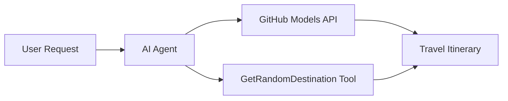

# 🌍 AI Wakala wa Usafiri na Microsoft Agent Framework (.NET)

## 📋 Muhtasari wa Hali

Notebook hii inaonyesha jinsi ya kujenga wakala wa akili wa kupanga safari kwa kutumia Microsoft Agent Framework kwa .NET. Wakala anaweza kuunda ratiba za safari za siku moja zilizobinafsishwa kwa maeneo ya nasibu duniani kote.

**Uwezo Muhimu:**
- 🎲 **Uchaguzi wa Maeneo ya Nasibu**: Hutumia zana maalum kuchagua maeneo ya likizo
- 🗺️ **Upangaji wa Safari wa Akili**: Huunda ratiba za kina za kila siku
- 🔄 **Utiririshaji wa Wakati Halisi**: Inaunga mkono majibu ya papo hapo na ya utiririshaji
- 🛠️ **Ujumuishaji wa Zana Maalum**: Inaonyesha jinsi ya kupanua uwezo wa wakala

## 🔧 Miundombinu ya Kiufundi

### Teknolojia za Msingi
- **Microsoft Agent Framework**: Utekelezaji wa hivi karibuni wa .NET kwa maendeleo ya wakala wa AI
- **Ujumuishaji wa Miundo ya GitHub**: Hutumia huduma ya utambuzi wa modeli za AI za GitHub
- **Ulinganifu wa API ya OpenAI**: Hutumia maktaba za mteja wa OpenAI na viungo maalum
- **Usanidi Salama**: Usimamizi wa funguo za API kulingana na mazingira

### Vipengele Muhimu
1. **AIAgent**: Msimamizi mkuu wa wakala anayeshughulikia mtiririko wa mazungumzo
2. **Zana Maalum**: Kazi ya `GetRandomDestination()` inayopatikana kwa wakala
3. **Mteja wa Mazungumzo**: Kiolesura cha mazungumzo kinachoungwa mkono na Miundo ya GitHub
4. **Msaada wa Utiririshaji**: Uwezo wa kizazi cha majibu ya wakati halisi

### Muundo wa Ujumuishaji


## 🚀 Kuanza

**Mahitaji ya Awali:**
- .NET 9.0 au zaidi
- Tokeni ya ufikiaji wa API ya Miundo ya GitHub
- Vigezo vya mazingira vilivyosanidiwa kwenye faili `.env`

**Vigezo vya Mazingira Vinavyohitajika:**
```env
GITHUB_TOKEN=your_github_token
GITHUB_ENDPOINT=https://models.inference.ai.azure.com
GITHUB_MODEL_ID=gpt-4o-mini
```

Endesha seli zilizo hapa chini kwa mpangilio ili kuona wakala wa usafiri akifanya kazi!

---

## .NET Single File App: AI Travel Agent Example

See `01-dotnet-agent-framework.cs` for the complete runnable code sample.

Endesha sampuli ya msimbo hapa chini:

```bash
dotnet run 01-dotnet-agent-framework.cs
```

### Sample Code

```csharp
static string GetRandomDestination()
{
    var destinations = new List<string>
    {
        "Paris, France",
        "Tokyo, Japan",
        "New York City, USA",
        "Sydney, Australia",
        "Rome, Italy",
        "Barcelona, Spain",
        "Cape Town, South Africa",
        "Rio de Janeiro, Brazil",
        "Bangkok, Thailand",
        "Vancouver, Canada"
    };
    var random = new Random();
    int index = random.Next(destinations.Count);
    return destinations[index];
}

// Extract configuration from environment variables
var github_endpoint = Environment.GetEnvironmentVariable("GITHUB_ENDPOINT") ?? throw new InvalidOperationException("GITHUB_ENDPOINT is not set.");
var github_model_id = Environment.GetEnvironmentVariable("GITHUB_MODEL_ID") ?? "gpt-4o-mini";
var github_token = Environment.GetEnvironmentVariable("GITHUB_TOKEN") ?? throw new InvalidOperationException("GITHUB_TOKEN is not set.");

// Configure OpenAI Client Options
var openAIOptions = new OpenAIClientOptions()
{
    Endpoint = new Uri(github_endpoint)
};

// Initialize OpenAI Client with GitHub Models Configuration
var openAIClient = new OpenAIClient(new ApiKeyCredential(github_token), openAIOptions);

// Create AI Agent with Travel Planning Capabilities
AIAgent agent = openAIClient
    .GetChatClient(github_model_id)
    .CreateAIAgent(
        instructions: "You are a helpful AI Agent that can help plan vacations for customers at random destinations",
        tools: [AIFunctionFactory.Create(GetRandomDestination)]
    );

// Execute Agent: Plan a Day Trip (Non-Streaming)
Console.WriteLine(await agent.RunAsync("Plan me a day trip"));

// Execute Agent: Plan a Day Trip (Streaming Response)
await foreach (var update in agent.RunStreamingAsync("Plan me a day trip"))
{
    Console.Write(update);
}
```
