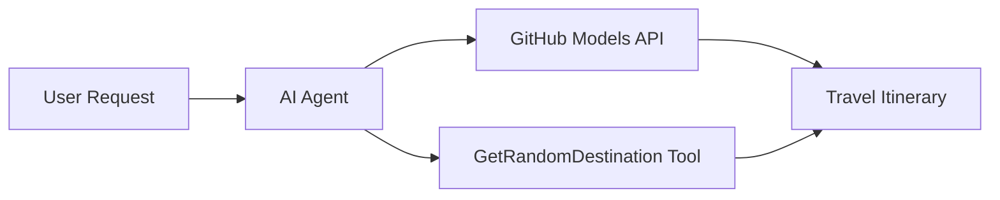

<!--
CO_OP_TRANSLATOR_METADATA:
{
  "original_hash": "23afd9be7b6ba5b69a44c3b6a78e07f6",
  "translation_date": "2025-11-06T10:05:53+00:00",
  "source_file": "01-intro-to-ai-agents/code_samples/01-dotnet-agent-framework.md",
  "language_code": "sw"
}
-->
# 🌍 AI Wakala wa Kusafiri na Microsoft Agent Framework (.NET)

## 📋 Muhtasari wa Hali

Notebook hii inaonyesha jinsi ya kujenga wakala wa akili wa kupanga safari kwa kutumia Microsoft Agent Framework kwa .NET. Wakala anaweza kuunda ratiba za safari za siku moja kwa moja kwa maeneo ya nasibu duniani kote.

**Uwezo Muhimu:**
- 🎲 **Uchaguzi wa Maeneo ya Nasibu**: Hutumia zana maalum kuchagua maeneo ya likizo
- 🗺️ **Upangaji wa Safari wa Akili**: Huunda ratiba za kina za siku kwa siku
- 🔄 **Utiririshaji wa Wakati Halisi**: Inasaidia majibu ya papo hapo na ya utiririshaji
- 🛠️ **Muunganiko wa Zana Maalum**: Inaonyesha jinsi ya kupanua uwezo wa wakala

## 🔧 Muundo wa Kiufundi

### Teknolojia za Msingi
- **Microsoft Agent Framework**: Utekelezaji wa hivi karibuni wa .NET kwa maendeleo ya wakala wa AI
- **Muunganiko wa Miundo ya GitHub**: Hutumia huduma ya utambuzi wa miundo ya AI ya GitHub
- **Ulinganifu wa API ya OpenAI**: Hutumia maktaba za mteja wa OpenAI na viunganishi maalum
- **Usanidi Salama**: Usimamizi wa funguo za API kulingana na mazingira

### Vipengele Muhimu
1. **AIAgent**: Msimamizi mkuu wa wakala anayeshughulikia mtiririko wa mazungumzo
2. **Zana Maalum**: Kazi ya `GetRandomDestination()` inayopatikana kwa wakala
3. **Mteja wa Mazungumzo**: Kiunganishi cha mazungumzo kinachotegemea Miundo ya GitHub
4. **Utiririshaji wa Majibu**: Uwezo wa kizazi cha majibu ya wakati halisi

### Muundo wa Muunganiko


## 🚀 Kuanza

**Mahitaji ya Awali:**
- .NET 10.0 au zaidi
- Tokeni ya ufikiaji wa API ya Miundo ya GitHub
- Vigezo vya mazingira vimewekwa katika faili `.env`

**Vigezo vya Mazingira Vinavyohitajika:**
```env
GITHUB_TOKEN=your_github_token
GITHUB_ENDPOINT=https://models.inference.ai.azure.com
GITHUB_MODEL_ID=gpt-4o-mini
```

Endesha sampuli ya msimbo hapa chini kwa mpangilio ili kuona wakala wa kusafiri akifanya kazi!

---

## Programu ya Faili Moja ya .NET: Mfano wa AI Wakala wa Kusafiri

Angalia `01-dotnet-agent-framework.cs` kwa sampuli kamili ya msimbo inayoweza kuendeshwa.

```bash
dotnet run 01-dotnet-agent-framework.cs
```

### Sampuli ya Msimbo

```csharp
static string GetRandomDestination()
{
    var destinations = new List<string>
    {
        "Paris, France",
        "Tokyo, Japan",
        "New York City, USA",
        "Sydney, Australia",
        "Rome, Italy",
        "Barcelona, Spain",
        "Cape Town, South Africa",
        "Rio de Janeiro, Brazil",
        "Bangkok, Thailand",
        "Vancouver, Canada"
    };
    var random = new Random();
    int index = random.Next(destinations.Count);
    return destinations[index];
}

// Extract configuration from environment variables
var github_endpoint = Environment.GetEnvironmentVariable("GITHUB_ENDPOINT") ?? throw new InvalidOperationException("GITHUB_ENDPOINT is not set.");
var github_model_id = Environment.GetEnvironmentVariable("GITHUB_MODEL_ID") ?? "gpt-4o-mini";
var github_token = Environment.GetEnvironmentVariable("GITHUB_TOKEN") ?? throw new InvalidOperationException("GITHUB_TOKEN is not set.");

// Configure OpenAI Client Options
var openAIOptions = new OpenAIClientOptions()
{
    Endpoint = new Uri(github_endpoint)
};

// Initialize OpenAI Client with GitHub Models Configuration
var openAIClient = new OpenAIClient(new ApiKeyCredential(github_token), openAIOptions);

// Create AI Agent with Travel Planning Capabilities
AIAgent agent = openAIClient
    .GetChatClient(github_model_id)
    .CreateAIAgent(
        instructions: "You are a helpful AI Agent that can help plan vacations for customers at random destinations",
        tools: [AIFunctionFactory.Create(GetRandomDestination)]
    );

// Execute Agent: Plan a Day Trip (Non-Streaming)
Console.WriteLine(await agent.RunAsync("Plan me a day trip"));

// Execute Agent: Plan a Day Trip (Streaming Response)
await foreach (var update in agent.RunStreamingAsync("Plan me a day trip"))
{
    Console.Write(update);
}
```

---

**Kanusho**:  
Hati hii imetafsiriwa kwa kutumia huduma ya kutafsiri ya AI [Co-op Translator](https://github.com/Azure/co-op-translator). Ingawa tunajitahidi kwa usahihi, tafadhali fahamu kuwa tafsiri za kiotomatiki zinaweza kuwa na makosa au kutokuwa sahihi. Hati ya asili katika lugha yake ya awali inapaswa kuzingatiwa kama chanzo cha mamlaka. Kwa taarifa muhimu, tafsiri ya kitaalamu ya binadamu inapendekezwa. Hatutawajibika kwa kutoelewana au tafsiri zisizo sahihi zinazotokana na matumizi ya tafsiri hii.