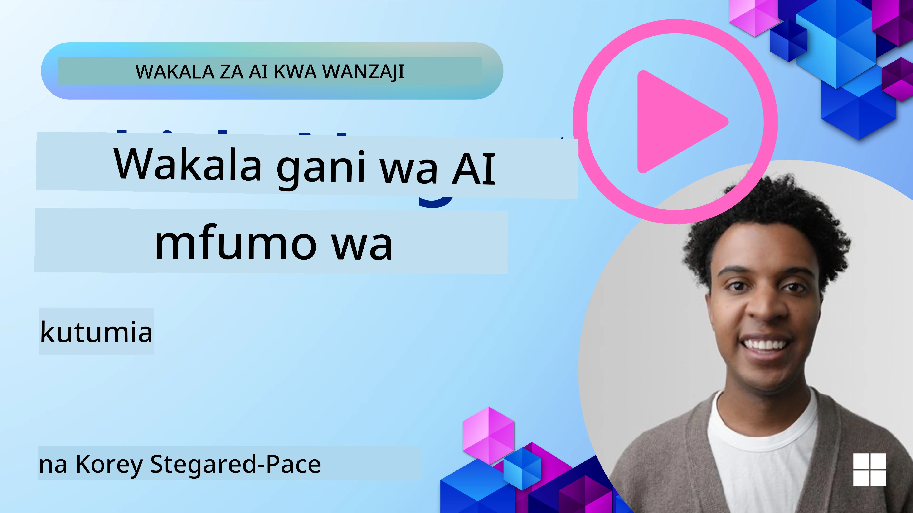

[](https://youtu.be/ODwF-EZo_O8?si=1xoy_B9RNQfrYdF7)

> _(Bonyeza picha hapo juu kutazama video ya somo hili)_

# Chunguza Mifumo ya Wakala wa AI

Mifumo ya wakala wa AI ni majukwaa ya programu yaliyotengenezwa ili kurahisisha uundaji, uenezaji, na usimamizi wa mawakala wa AI. Mifumo hii huwapatia watengenezaji vipengele vilivyotengenezwa awali, utofauti, na zana zinazorudisha mchakato wa maendeleo ya mifumo tata ya AI.

Mifumo hii huwasaidia watengenezaji kuzingatia vipengele vya kipekee vya programu zao kwa kutoa mbinu zilizo sanifu kwa changamoto za kawaida katika maendeleo ya mawakala wa AI. Zinaboresha ukubwa, upatikanaji, na ufanisi katika kujenga mifumo ya AI.

## Utangulizi 

Somo hili litafunika:

- Mifumo ya Wakala wa AI ni nini na inawawezesha watengenezaji kufanya nini?
- Je, timu zinawezaje kutumia hizi kutengeneza haraka mifano ya awali (prototype), kurudia, na kuboresha uwezo wa wakala wao?
- Ni tofauti gani kati ya mifumo na zana zilizotengenezwa na Microsoft (<a href="https://aka.ms/ai-agents-beginners/ai-agent-service" target="_blank">Azure AI Agent Service</a> na the <a href="https://learn.microsoft.com/azure/ai-services/openai/how-to/responses" target="_blank">Microsoft Agent Framework</a>)?
- Je, naweza kuunganisha zana zilizopo katika mazingira ya Azure moja kwa moja, au nahitaji suluhisho huru?
- Huduma ya Azure AI Agents ni nini na inanisaidia vipi?

## Malengo ya kujifunza

Malengo ya somo hili ni kukusaidia kuelewa:

- Nafasi ya Mifumo ya Wakala wa AI katika maendeleo ya AI.
- Jinsi ya kutumia Mifumo ya Wakala wa AI kujenga mawakala wenye akili.
- Uwezo muhimu unaotolewa na Mifumo ya Wakala wa AI.
- Tofauti kati ya Microsoft Agent Framework na Azure AI Agent Service.

## Mifumo ya Wakala wa AI ni nini na inawawezesha watengenezaji kufanya nini?

Mifumo ya AI ya jadi inaweza kukusaidia kuingiza AI katika programu zako na kuifanya programu hizi ziwe bora kwa njia zifuatazo:

- **Uwekaji kibinafsi**: AI inaweza kuchambua tabia na mapendeleo ya mtumiaji ili kutoa mapendekezo, yaliyomo, na uzoefu uliobinafsishwa.
Mfano: Huduma za kutiririsha kama Netflix hutumia AI kupendekeza filamu na vipindi kulingana na historia ya kuangalia, kuboresha ushiriki wa mtumiaji na kuridhika.
- **Uendeshaji na Ufanisi**: AI inaweza kuendesha kazi zinazorudiwa, kurahisisha mtiririko wa kazi, na kuboresha ufanisi wa uendeshaji.
Mfano: Programu za huduma kwa wateja hutumia roboti za mazungumzo zinazotegemea AI kushughulikia maswali ya kawaida, kupunguza muda wa majibu na kuwarahisishia wawakilishi wa kibinadamu kushughulikia masuala magumu zaidi.
- **Uboreshaji wa Uzoefu wa Mtumiaji**: AI inaweza kuboresha uzoefu wa mtumiaji kwa ujumla kwa kutoa vipengele vya akili kama utambuzi wa sauti, usindikaji wa lugha ya asili, na maandishi yanayotabiriwa.
Mfano: Msaidizi wa mtandaoni kama Siri na Google Assistant hutumia AI kuelewa na kujibu amri za sauti, kufanya iwe rahisi kwa watumiaji kuwasiliana na vifaa vyao.

### Hivyo yote yanasikika vizuri, kwa nini tunahitaji Mfumo wa Wakala wa AI?

Mifumo ya wakala wa AI ni zaidi ya mifumo ya AI ya jadi. Yameundwa kuwezesha uundaji wa mawakala wenye akili ambao wanaweza kuingiliana na watumiaji, mawakala wengine, na mazingira ili kufikia malengo maalum. Mawakala hawa wanaweza kuonyesha tabia za kujitegemea, kufanya maamuzi, na kuendana na hali zinazobadilika. Hapa kuna uwezo muhimu unaotolewa na Mifumo ya Wakala wa AI:

- **Ushirikiano na Kuratibu wa Wakala**: Inaruhusu uundaji wa mawakala wengi wa AI ambao wanaweza kufanya kazi pamoja, kuwasiliana, na kuratibu ili kutatua kazi tata.
- **Uendeshaji na Usimamizi wa Kazi**: Hutolewa taratibu za kuendesha shughuli za hatua nyingi, ugawaji wa kazi, na usimamizi wa kazi zinazobadilika miongoni mwa mawakala.
- **Uelewa wa Muktadha na Urekebishaji**: Inawapa mawakala uwezo wa kuelewa muktadha, kuendana na mazingira yanayobadilika, na kufanya maamuzi msingi wa taarifa za wakati halisi.

Kwa muhtasari, mawakala yanakuwezesha kufanya zaidi, kuchukua uendeshaji kwa kiwango kingine, na kuunda mifumo yenye akili zaidi ambazo zinaweza kuendana na kujifunza kutoka kwa mazingira yao.

## Je, jinsi gani ya kutengeneza haraka mifano ya awali, kurudia, na kuboresha uwezo wa wakala?

Hii ni nafasi inayobadilika kwa haraka, lakini kuna mambo yanayoonekana mara kwa mara katika Mifumo mingi ya Wakala wa AI ambayo yanaweza kukusaidia kutengeneza haraka mifano ya awali na kurudia, hasa vipengele vya moduli, zana za ushirikiano, na kujifunza kwa wakati halisi. Hebu tuvumbue haya:

- **Tumia Vipengee vya Moduli**: SDK za AI hutoa vipengee vilivyotengenezwa awali kama konekta za AI na Kumbukumbu, kuitwa kwa kazi kwa kutumia lugha ya asili au viendelezi vya msimbo, templates za prompt, na zaidi.
- **Tegemeza Zana za Ushirikiano**: Unda mawakala wenye majukumu na kazi maalum, kuwezesha kujaribu na kuboresha mtiririko wa kazi wa ushirikiano.
- **Jifunze kwa Wakati Halisi**: Tekeleza mizunguko ya mrejesho ambapo mawakala hujifunza kutokana na mwingiliano na kurekebisha tabia zao kwa nguvu.

### Tumia Vipengee vya Moduli

SDK kama Microsoft Agent Framework hutoa vipengee vilivyotengenezwa awali kama konekta za AI, ufafanuzi wa zana, na usimamizi wa mawakala.

**Jinsi timu zinaweza kutumia hizi**: Timu zinaweza kukusanya vipengee hivi kwa haraka kuunda mfano wa awali unaofanya kazi bila kuanza kutoka mwanzo, kuruhusu majaribio na urudiaji wa haraka.

**Jinsi inavyofanya kazi kwa vitendo**: Unaweza kutumia parser iliyotengenezwa tayari kutoa taarifa kutoka kwa pembejeo za mtumiaji, moduli ya kumbukumbu kuhifadhi na kupata data, na jenereta ya prompt kuingiliana na watumiaji, yote bila kujenga vipengee hivi kutoka mwanzo.

**Mfano wa msimbo**. Hebu tazama mfano wa jinsi unavyoweza kutumia Microsoft Agent Framework na `AzureAIProjectAgentProvider` ili mfano ujibu pembejeo za mtumiaji kwa kuitisha zana:

``` python
# Mfano wa Microsoft Agent Framework kwa Python

import asyncio
import os
from typing import Annotated

from agent_framework.azure import AzureAIProjectAgentProvider
from azure.identity import AzureCliCredential


# Tafsiri kipengele cha zana ya sampuli kuweka tiketi ya kusafiri
def book_flight(date: str, location: str) -> str:
    """Book travel given location and date."""
    return f"Travel was booked to {location} on {date}"


async def main():
    provider = AzureAIProjectAgentProvider(credential=AzureCliCredential())
    agent = await provider.create_agent(
        name="travel_agent",
        instructions="Help the user book travel. Use the book_flight tool when ready.",
        tools=[book_flight],
    )

    response = await agent.run("I'd like to go to New York on January 1, 2025")
    print(response)
    # Mfano wa matokeo: Ndege yako kuelekea New York tarehe 1 Januari, 2025, imefikiwa kwa mafanikio. Safari njema! ✈️🗽


if __name__ == "__main__":
    asyncio.run(main())
```

Unachoweza kuona kutoka kwa mfano huu ni jinsi unavyoweza kutumia parser iliyotengenezwa tayari kutoa taarifa muhimu kutoka kwa pembejeo za mtumiaji, kama asili, njia, na tarehe ya ombi la uhifadhi wa ndege. Njia hii ya moduli inakuwezesha kuzingatia mantiki ya juu.

### Tumia Zana za Ushirikiano

Mifumo kama Microsoft Agent Framework hurahisisha uundaji wa mawakala wengi ambao wanaweza kufanya kazi pamoja.

**Jinsi timu zinaweza kutumia hizi**: Timu zinaweza kubuni mawakala wenye majukumu na kazi maalum, kuwawezesha kujaribu na kuboresha mtiririko wa kazi wa ushirikiano na kuboresha ufanisi wa mfumo kwa ujumla.

**Jinsi inavyofanya kazi kwa vitendo**: Unaweza kuunda timu ya mawakala ambapo kila wakala ana kazi maalum, kama uchukuzi wa data, uchambuzi, au kufanya maamuzi. Mawakala hawa wanaweza kuwasiliana na kushiriki taarifa ili kufikia lengo la pamoja, kama kujibu swali la mtumiaji au kumaliza kazi.

**Mfano wa msimbo (Microsoft Agent Framework)**:

```python
# Kuunda mawakala wengi wanaofanya kazi pamoja kwa kutumia Mfumo wa Wakala wa Microsoft

import os
from agent_framework.azure import AzureAIProjectAgentProvider
from azure.identity import AzureCliCredential

provider = AzureAIProjectAgentProvider(credential=AzureCliCredential())

# Wakala wa Kupata Data
agent_retrieve = await provider.create_agent(
    name="dataretrieval",
    instructions="Retrieve relevant data using available tools.",
    tools=[retrieve_tool],
)

# Wakala wa Uchambuzi wa Data
agent_analyze = await provider.create_agent(
    name="dataanalysis",
    instructions="Analyze the retrieved data and provide insights.",
    tools=[analyze_tool],
)

# Endesha mawakala mfululizo kwenye kazi
retrieval_result = await agent_retrieve.run("Retrieve sales data for Q4")
analysis_result = await agent_analyze.run(f"Analyze this data: {retrieval_result}")
print(analysis_result)
```

Unachoona katika msimbo uliotangulia ni jinsi unavyoweza kuunda kazi inayohusisha mawakala wengi wanaofanya kazi pamoja kuchambua data. Kila wakala anafanya kazi maalum, na kazi inatekelezwa kwa kuratibu mawakala ili kufikia matokeo yanayotarajiwa. Kwa kuunda mawakala waliotengwa wenye majukumu maalum, unaweza kuboresha ufanisi wa kazi na utendaji.

### Jifunze kwa Wakati Halisi

Mifumo ya hali ya juu hutoa uwezo wa kuelewa muktadha kwa wakati halisi na urekebishaji.

**Jinsi timu zinaweza kutumia hizi**: Timu zinaweza kutekeleza mizunguko ya mrejesho ambapo mawakala hujifunza kutokana na mwingiliano na kurekebisha tabia zao kwa nguvu, jambo linalosababisha maendeleo endelevu na kuimarika kwa uwezo.

**Jinsi inavyofanya kazi kwa vitendo**: Mawakala yanaweza kuchambua mrejesho wa mtumiaji, data ya mazingira, na matokeo ya kazi ili kusasisha msingi wao wa maarifa, kurekebisha algorithms za kufanya maamuzi, na kuboresha utendaji kwa muda. Mchakato huu wa kujifunza unaorudia unawawezesha mawakala kuendana na hali zinazobadilika na mapendeleo ya watumiaji, kuboresha ufanisi wa mfumo kwa ujumla.

## Ni tofauti gani kati ya Microsoft Agent Framework na Azure AI Agent Service?

Kuna njia nyingi za kulinganisha mbinu hizi, lakini hebu tuangalie tofauti muhimu kwa upande wa muundo wao, uwezo, na matumizi yaliyolengwa:

## Microsoft Agent Framework (MAF)

Microsoft Agent Framework hutoa SDK rahisi kwa kujenga mawakala wa AI kwa kutumia `AzureAIProjectAgentProvider`. Inawawezesha watengenezaji kuunda mawakala wanaotumia modeli za Azure OpenAI na uwezo wa built-in wa kuitisha zana, usimamizi wa mazungumzo, na usalama wa kiwango cha biashara kupitia utambulisho wa Azure.

**Matumizi**: Kujenga mawakala wa AI tayari kwa uzalishaji wenye matumizi ya zana, mtiririko wa hatua nyingi, na matukio ya ujumuishaji wa biashara.

Hapa kuna baadhi ya dhana kuu muhimu za Microsoft Agent Framework:

- **Agents**. Wakala huundwa kupitia `AzureAIProjectAgentProvider` na kusanifiwa kwa jina, maagizo, na zana. Wakala anaweza:
  - **Kushughulikia ujumbe wa mtumiaji** na kutengeneza majibu kwa kutumia modeli za Azure OpenAI.
  - **Kuitisha zana** moja kwa moja kulingana na muktadha wa mazungumzo.
  - **Kudumisha hali ya mazungumzo** katika mwingiliano wa mara kwa mara.

  Hapa kuna kifungu cha msimbo kinachoonyesha jinsi ya kuunda wakala:

    ```python
    import os
    from agent_framework.azure import AzureAIProjectAgentProvider
    from azure.identity import AzureCliCredential

    provider = AzureAIProjectAgentProvider(credential=AzureCliCredential())
    agent = await provider.create_agent(
        name="my_agent",
        instructions="You are a helpful assistant.",
    )

    response = await agent.run("Hello, World!")
    print(response)
    ```

- **Tools**. Mfumo unaunga mkono ufafanuzi wa zana kama vitendo vya Python ambavyo wakala anaweza kuita moja kwa moja. Zana zinajiandikisha wakati wa kuunda wakala:

    ```python
    def get_weather(location: str) -> str:
        """Get the current weather for a location."""
        return f"The weather in {location} is sunny, 72\u00b0F."

    agent = await provider.create_agent(
        name="weather_agent",
        instructions="Help users check the weather.",
        tools=[get_weather],
    )
    ```

- **Uratibu wa Mawakala Wengi**. Unaweza kuunda mawakala kadhaa wenye utafiti tofauti na kuratibu kazi zao:

    ```python
    planner = await provider.create_agent(
        name="planner",
        instructions="Break down complex tasks into steps.",
    )

    executor = await provider.create_agent(
        name="executor",
        instructions="Execute the planned steps using available tools.",
        tools=[execute_tool],
    )

    plan = await planner.run("Plan a trip to Paris")
    result = await executor.run(f"Execute this plan: {plan}")
    ```

- **Ujumuishaji wa Utambulisho wa Azure**. Mfumo unatumia `AzureCliCredential` (au `DefaultAzureCredential`) kwa uthibitisho salama, bila kutumia funguo, kuondoa haja ya kusimamia API key moja kwa moja.

## Azure AI Agent Service

Azure AI Agent Service ni nyongeza ya hivi karibuni, iliyoanzishwa katika Microsoft Ignite 2024. Inaruhusu maendeleo na uenezaji wa mawakala wa AI yenye modeli zinazobadilika zaidi, kama kuitisha moja kwa moja LLM za chanzo huria kama Llama 3, Mistral, na Cohere.

Azure AI Agent Service inatoa taratibu za usalama za kiwango cha biashara na njia za uhifadhi wa data, ikiifanya iwe nzuri kwa matumizi ya biashara.

Inafanya kazi moja kwa moja na Microsoft Agent Framework kwa ajili ya kujenga na kueneza mawakala.

Huduma hii kwa sasa iko katika Public Preview na inaunga mkono Python na C# kwa ajili ya ujenzi wa mawakala.

Using the Azure AI Agent Service Python SDK, we can create an agent with a user-defined tool:

```python
import asyncio
from azure.identity import DefaultAzureCredential
from azure.ai.projects import AIProjectClient

# Eleza kazi za zana
def get_specials() -> str:
    """Provides a list of specials from the menu."""
    return """
    Special Soup: Clam Chowder
    Special Salad: Cobb Salad
    Special Drink: Chai Tea
    """

def get_item_price(menu_item: str) -> str:
    """Provides the price of the requested menu item."""
    return "$9.99"


async def main() -> None:
    credential = DefaultAzureCredential()
    project_client = AIProjectClient.from_connection_string(
        credential=credential,
        conn_str="your-connection-string",
    )

    agent = project_client.agents.create_agent(
        model="gpt-4o-mini",
        name="Host",
        instructions="Answer questions about the menu.",
        tools=[get_specials, get_item_price],
    )

    thread = project_client.agents.create_thread()

    user_inputs = [
        "Hello",
        "What is the special soup?",
        "How much does that cost?",
        "Thank you",
    ]

    for user_input in user_inputs:
        print(f"# User: '{user_input}'")
        message = project_client.agents.create_message(
            thread_id=thread.id,
            role="user",
            content=user_input,
        )
        run = project_client.agents.create_and_process_run(
            thread_id=thread.id, agent_id=agent.id
        )
        messages = project_client.agents.list_messages(thread_id=thread.id)
        print(f"# Agent: {messages.data[0].content[0].text.value}")


if __name__ == "__main__":
    asyncio.run(main())
```

### Core concepts

Azure AI Agent Service ina dhana kuu zifuatazo:

- **Agent**. Azure AI Agent Service inaunganisha na Microsoft Foundry. Ndani ya AI Foundry, Wakala wa AI hufanya kazi kama huduma ndogo "mwerevu" inayoweza kutumika kujibu maswali (RAG), kufanya vitendo, au kuendesha kabisa mtiririko wa kazi. Hufanikiwa kwa kuunganisha nguvu za modeli za utengenezaji wa lugha na zana zinazoruhusu kufikia na kuingiliana na vyanzo vya data vya ulimwengu halisi. Hapa kuna mfano wa wakala:

    ```python
    agent = project_client.agents.create_agent(
        model="gpt-4o-mini",
        name="my-agent",
        instructions="You are helpful agent",
        tools=code_interpreter.definitions,
        tool_resources=code_interpreter.resources,
    )
    ```

    Katika mfano huu, wakala ameundwa na modeli `gpt-4o-mini`, jina `my-agent`, na maagizo `You are helpful agent`. Wakala amezinduliwa na zana na rasilimali za kutekeleza kazi za tafsiri ya msimbo.

- **Thread and messages**. Thread ni dhana nyingine muhimu. Inawakilisha mazungumzo au mwingiliano kati ya wakala na mtumiaji. Threads zinaweza kutumika kufuatilia maendeleo ya mazungumzo, kuhifadhi taarifa za muktadha, na kusimamia hali ya mwingiliano. Hapa kuna mfano wa thread:

    ```python
    thread = project_client.agents.create_thread()
    message = project_client.agents.create_message(
        thread_id=thread.id,
        role="user",
        content="Could you please create a bar chart for the operating profit using the following data and provide the file to me? Company A: $1.2 million, Company B: $2.5 million, Company C: $3.0 million, Company D: $1.8 million",
    )
    
    # Ask the agent to perform work on the thread
    run = project_client.agents.create_and_process_run(thread_id=thread.id, agent_id=agent.id)
    
    # Fetch and log all messages to see the agent's response
    messages = project_client.agents.list_messages(thread_id=thread.id)
    print(f"Messages: {messages}")
    ```

    Katika msimbo uliotangulia, thread imeundwa. Baadaye, ujumbe umetumwa kwenye thread. Kwa kuita `create_and_process_run`, wakala anaombwa kufanya kazi kwenye thread. Hatimaye, ujumbe zinachukuliwa na kurekodiwa kuona jibu la wakala. Ujumbe unaonyesha maendeleo ya mazungumzo kati ya mtumiaji na wakala. Pia ni muhimu kuelewa kwamba ujumbe zinaweza kuwa za aina mbalimbali kama maandishi, picha, au faili, ambayo ni kwamba kazi za mawakala zinaweza kusababisha kwa mfano picha au jibu kwa maandishi. Kama msanidi, unaweza kisha kutumia taarifa hizi kuendelea kusindika jibu au kuwasilisha kwa mtumiaji.

- **Integrates with the Microsoft Agent Framework**. Azure AI Agent Service inafanya kazi bila mshono na Microsoft Agent Framework, ambayo ina maana unaweza kujenga mawakala kwa kutumia `AzureAIProjectAgentProvider` na kuyaeneza kupitia Agent Service kwa matukio ya uzalishaji.

**Matumizi**: Azure AI Agent Service imeundwa kwa matumizi ya biashara yanayohitaji utekelezaji wa wakala wa AI uliolindwa, unaoweza kupanuka, na wenye kubadilika.

## Nini tofauti kati ya mbinu hizi?
 
Inaonekana kuna ulinganifu, lakini kuna tofauti muhimu kwa upande wa muundo, uwezo, na matumizi yaliyo lengwa:
 
- **Microsoft Agent Framework (MAF)**: Ni SDK tayari kwa uzalishaji kwa kujenga mawakala wa AI. Inatoa API iliyorahisishwa kwa kuunda mawakala yenye kuitisha zana, usimamizi wa mazungumzo, na ujumuishaji wa utambulisho wa Azure.
- **Azure AI Agent Service**: Ni jukwaa na huduma ya uenezaji katika Azure Foundry kwa ajili ya mawakala. Inatoa muunganisho uliojengwa na huduma kama Azure OpenAI, Azure AI Search, Bing Search na utekelezaji wa msimbo.
 
Bado haujui ni ipi ya kuchagua?

### Matukio ya Matumizi
 
Hebu tuone kama tunaweza kukusaidia kwa kupitia baadhi ya matukio ya kawaida ya matumizi:
 
> Q: Ninajenga programu za uzalishaji za wakala wa AI na nataka kuanza haraka
>

> A: Microsoft Agent Framework ni chaguo zuri. Inatoa API rahisi, ya Pythonic kupitia `AzureAIProjectAgentProvider` inayokuwezesha kufafanua mawakala na zana na maagizo kwa mistari michache ya msimbo.

> Q: Ninahitaji ueneaji wa kiwango cha biashara pamoja na ujumuishaji wa Azure kama Search na utekelezaji wa msimbo
>
> A: Azure AI Agent Service ndiyo inayofaa zaidi. Ni huduma ya jukwaa inayotoa uwezo uliojengwa kwa modeli nyingi, Azure AI Search, Bing Search na Azure Functions. Inafanya iwe rahisi kujenga mawakala yako katika Foundry Portal na kuyaeneza kwa kiwango.
 
> Q: Bado ninashangaa, nipe chaguo moja tu
>
> A: Anza na Microsoft Agent Framework ili kujenga mawakala yako, kisha tumia Azure AI Agent Service unaposikia kuhitaji kuyaeneza na kuyapandisha katika uzalishaji. Njia hii inakuwezesha kurudia kwa haraka mantiki ya wakala wako huku ukihakikisha njia wazi ya ueneaji wa biashara.
 
Hebu tufupishe tofauti kuu kwenye jedwali:

| Framework | Focus | Core Concepts | Use Cases |
| --- | --- | --- | --- |
| Microsoft Agent Framework | SDK ya wakala iliyorahisishwa yenye uwezo wa kuitisha zana | Agents, Tools, Azure Identity | Ujenzi wa mawakala wa AI, matumizi ya zana, mtiririko wa hatua nyingi |
| Azure AI Agent Service | Modeli zinazobadilika, usalama wa biashara, uzalishaji wa msimbo, kuitisha zana | Modularity, Collaboration, Process Orchestration | Utekelezaji wa mawakala wa AI uliolindwa, unaoweza kupanuka, na wenye kubadilika |

## Je, naweza kuunganisha zana zilizopo katika mazingira ya Azure moja kwa moja, au nahitaji suluhisho huru?
Jibu ni ndiyo, unaweza kuunganisha zana zako za mazingira ya Azure zilizopo moja kwa moja na Azure AI Agent Service hasa, kwani imejengewa kufanya kazi bila mshono na huduma nyingine za Azure. Kwa mfano, unaweza kuunganisha Bing, Azure AI Search, na Azure Functions. Kuna pia uunganisho wa kina na Microsoft Foundry.

Microsoft Agent Framework pia inaunganisha na huduma za Azure kupitia `AzureAIProjectAgentProvider` na Azure identity, ikikuruhusu kuita huduma za Azure moja kwa moja kutoka kwa zana zako za wakala.

## Sampuli za Msimbo

- Python: [Agent Framework](./code_samples/02-python-agent-framework.ipynb)
- .NET: [Agent Framework](./code_samples/02-dotnet-agent-framework.md)

## Je, una maswali zaidi kuhusu mifumo ya wakala wa AI?

Jiunge na [Microsoft Foundry Discord](https://aka.ms/ai-agents/discord) kukutana na wanafunzi wengine, kuhudhuria saa za ofisi na kupata majibu ya maswali yako kuhusu Mawakala wa AI.

## Marejeo

- <a href="https://techcommunity.microsoft.com/blog/azure-ai-services-blog/introducing-azure-ai-agent-service/4298357" target="_blank">Azure Agent Service</a>
- <a href="https://learn.microsoft.com/azure/ai-services/openai/how-to/responses" target="_blank">Microsoft Agent Framework - Azure OpenAI Responses</a>
- <a href="https://learn.microsoft.com/azure/ai-services/agents/overview" target="_blank">Azure AI Agent service</a>

## Somo Lililopita

[Utangulizi kwa Mawakala wa AI na Matumizi yao](../01-intro-to-ai-agents/README.md)

## Somo Linalofuata

[Kuelewa Mifumo ya Ubunifu ya Agentic](../03-agentic-design-patterns/README.md)

---

<!-- CO-OP TRANSLATOR DISCLAIMER START -->
Tamko la kutokuhusika:
Hati hii imetafsiriwa kwa kutumia huduma ya tafsiri ya akili bandia (AI) [Co-op Translator](https://github.com/Azure/co-op-translator). Ingawa tunajitahidi kuhakikisha usahihi, tafadhali fahamu kwamba tafsiri za kiotomatiki zinaweza kuwa na makosa au kutokuwa sahihi. Nyaraka ya awali katika lugha yake ya asili inapaswa kuchukuliwa kama chanzo cha mamlaka. Kwa taarifa muhimu, inashauriwa kupata tafsiri ya kitaalamu inayotolewa na mtaalamu wa lugha. Hatuwajibiki kwa kutoelewana au tafsiri zisizo sahihi zitokanazo na matumizi ya tafsiri hii.
<!-- CO-OP TRANSLATOR DISCLAIMER END -->