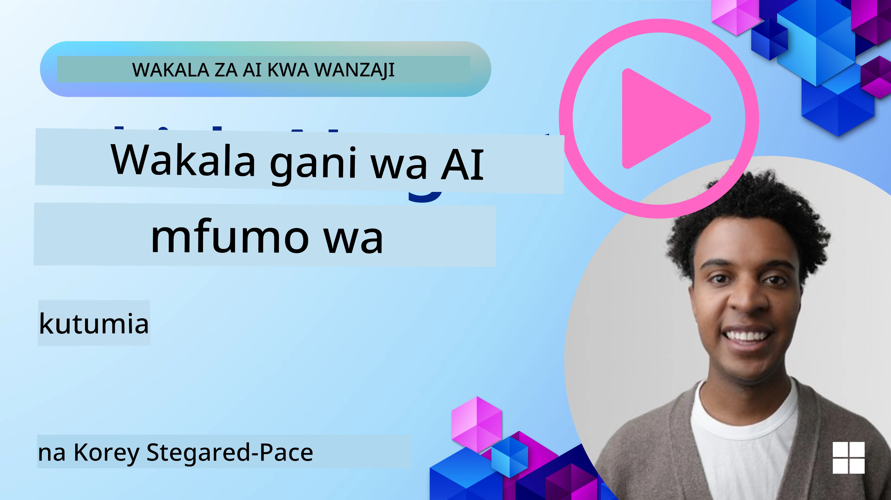

[](https://youtu.be/ODwF-EZo_O8?si=1xoy_B9RNQfrYdF7)

> _(Bonyeza picha iliyo juu ili kuona video ya somo hili)_

# Chunguza Miundombinu ya Wakala wa AI

Miundombinu ya wakala wa AI ni majukwaa ya programu yaliyoundwa kuwezesha uundaji, utekelezaji, na usimamizi wa wakala wa AI kwa urahisi. Miundombinu hii huwapatia waendelezaji vipengele vilivyotengenezwa tayari, mafumbo, na zana zinazorahisisha maendeleo ya mifumo tata ya AI.

Miundombinu hii huwasaidia waendelezaji kuzingatia vipengele vya kipekee vya programu zao kwa kutoa mbinu sanifu kwa changamoto za kawaida katika maendeleo ya wakala wa AI. Huongeza ukub wa matumizi, upatikana, na ufanisi katika kujenga mifumo ya AI.

## Utangulizi 

Somo hili litashughulikia:

- Ni nini Miundombinu ya Wakala wa AI na ni nini huwasaidia waendelezaji kufanikisha?
- Timu zinawezaje kutumia hizi kwa haraka kuunda mifano, kurudia, na kuboresha uwezo wa wakala wao?
- Nini tofauti kati ya miundombinu na zana zilizotengenezwa na Microsoft (<a href="https://aka.ms/ai-agents-beginners/ai-agent-service" target="_blank">Microsoft Foundry Agent Service</a> na <a href="https://learn.microsoft.com/azure/ai-services/openai/how-to/responses" target="_blank">Microsoft Agent Framework</a>)?
- Je, naweza kuunganisha zana zangu zilizopo za Azure moja kwa moja, au nahitaji suluhisho huru?
- Ni nini Microsoft Foundry Agent Service na inaniwezaje kusaidia?

## Malengo ya Kujifunza

Malengo ya somo hili ni kusaidia kuelewa:

- Nafasi ya Miundombinu ya Wakala wa AI katika maendeleo ya AI.
- Jinsi ya kutumia Miundombinu ya Wakala wa AI kujenga wakala werevu.
- Uwezo muhimu unaowezeshwa na Miundombinu ya Wakala wa AI.
- Tofauti kati ya Microsoft Agent Framework na Microsoft Foundry Agent Service.

## Ni nini Miundombinu ya Wakala wa AI na ni nini huwasaidia waendelezaji kufanya?

Miundombinu ya AI ya jadi inaweza kusaidia kuingiza AI katika programu zako na kuboresha programu hizi kwa njia zifuatazo:

- **Kubinafsisha**: AI inaweza kuchambua tabia na mapendeleo ya mtumiaji kutoa mapendekezo, maudhui, na uzoefu wa binafsi.
Mfano: Huduma za utiririshaji kama Netflix hutumia AI kupendekeza filamu na vipindi kulingana na rekodi ya kutazama, kuboresha ushiriki na kuridhika kwa mtumiaji.
- **Otomasia na Ufanisi**: AI inaweza kuendesha kazi zinazorudiwa, kurahisisha mtiririko wa kazi, na kuboresha ufanisi wa uendeshaji.
Mfano: Programu za huduma kwa wateja hutumia roboti za mazungumzo zilizoendesha AI kushughulikia maswali ya kawaida, kupunguza muda wa majibu na kuachilia wakala wa binadamu kwa masuala magumu zaidi.
- **Uboreshaji wa Uzoefu wa Mtumiaji**: AI inaweza kuboresha uzoefu mzima wa mtumiaji kwa kutoa vipengele werevu kama utambuzi wa sauti, usindikaji wa lugha asilia, na matini ya utabiri.
Mfano: Msaidizi wa kidijitali kama Siri na Google Assistant hutumia AI kuelewa na kujibu amri za sauti, kufanya iwe rahisi kwa watumiaji kuwasiliana na vifaa vyao.

### Hiyo yote ni nzuri sawa, kwa nini tunahitaji Miundombinu ya Wakala wa AI?

Miundombinu ya wakala wa AI ni zaidi ya miundombinu ya AI tu. Imetengenezwa kuwezesha uundaji wa wakaazi werevu wanaoweza kuingiliana na watumiaji, wakaazi wenzake, na mazingira kufanikisha malengo maalum. Wakaazi hawa wanaweza kuonyesha tabia za kujitegemea, kufanya maamuzi, na kuendana na hali zinabadilika. Hebu tazama baadhi ya uwezo muhimu unaowezeshwa na Miundombinu ya Wakala wa AI:

- **Ushirikiano na Kuratibu kwa Wakala**: Wezesha uundaji wa wakaazi wengi wa AI wanaoweza kushirikiana, kuwasiliana, na kuratibu kutatua kazi tata.
- **Otomasia na Usimamizi wa Kazi**: Toa mifumo ya kuendesha mtiririko wa kazi wenye hatua nyingi, kugawa kazi, na usimamizi wa kazi unaobadilika kati ya wakaazi.
- **Uelewa wa Muktadha na Uendano**: Wawezeshe wakaazi kuelewa muktadha, kuendana na mazingira yanayobadilika, na kufanya maamuzi kulingana na taarifa za wakati halisi.

Kwa muhtasari, wakaazi hukuruhusu kufanya zaidi, kupeleka otomasia kwenye kiwango kingine, na kuunda mifumo werevu zaidi inayoweza kuendana na kujifunza kutokana na mazingira yao.

## Jinsi ya kuunda mifano haraka, kurudia, na kuboresha uwezo wa wakala?

Hili ni eneo linalobadilika kwa kasi, lakini kuna mambo yanayojirudia katika Miundombinu mingi ya Wakala wa AI yanayoweza kusaidia kuunda mifano haraka na kurudia ikiwa ni vipengele vya moduli, zana za ushirikiano, na kujifunza kwa muda halisi. Hebu tuangalie haya:

- **Tumia Vipengele vya Moduli**: SDK za AI hutoa vipengele vilivyotengenezwa tayari kama viunganishi vya AI na kumbukumbu, upigaji wa kazi kwa lugha asilia au programu za nyongeza za msimbo, templeti za maelekezo, na zaidi.
- **Tumia Zana za Ushirikiano**: Tengeneza wakaazi wenye majukumu na kazi maalum, kuwezesha kujaribu na kuboresha mtiririko wa kazi wa ushirikiano.
- **Jifunze kwa Muda Halisi**: Tekeleza mizunguko ya maoni ambapo wakaazi hujifunza kutokana na mwingiliano na kubadilisha tabia yao kwa nguvu.

### Tumia Vipengele vya Moduli

SDK kama Microsoft Agent Framework hutoa vipengele vilivyotengenezwa kama viunganishi vya AI, maelezo ya zana, na usimamizi wa wakala.

**Jinsi timu zinaweza kutumia hizi**: Timu zinaweza kuunganisha vipengele hivi haraka kuunda mfano wa kazi bila kuanza kutoka mwanzo, kuruhusu majaribio ya haraka na kurudia.

**Jinsi inavyofanya kazi vitendo**: Unaweza kutumia kichakataji kilichojengwa tayari kutoa taarifa kutoka kwa maingilio ya mtumiaji, moduli ya kumbukumbu kuhifadhi na kufikia data, na kizalishaji cha maelekezo kuingiliana na watumiaji, yote bila kujenga vipengele hivi kutoka mwanzo.

**Mfano wa msimbo**. Hebu tuangalie mfano wa jinsi unavyoweza kutumia Microsoft Agent Framework na `FoundryChatClient` kufanikisha mfano kujibu maingilio ya mtumiaji kwa upigaji wa zana:

``` python
# Mfano wa Muundo wa Wakala wa Microsoft kwa Python

import asyncio
import os

from agent_framework import tool
from agent_framework.foundry import FoundryChatClient
from azure.identity import AzureCliCredential


# Tafsiri ya mfano wa kazi ya chombo cha kuhifadhi safari
@tool(approval_mode="never_require")
def book_flight(date: str, location: str) -> str:
    """Book travel given location and date."""
    return f"Travel was booked to {location} on {date}"


async def main():
    provider = FoundryChatClient(
        project_endpoint=os.environ["AZURE_AI_PROJECT_ENDPOINT"],
        model=os.environ["AZURE_AI_MODEL_DEPLOYMENT_NAME"],
        credential=AzureCliCredential(),
    )
    agent = provider.as_agent(
        name="travel_agent",
        instructions="Help the user book travel. Use the book_flight tool when ready.",
        tools=[book_flight],
    )

    response = await agent.run("I'd like to go to New York on January 1, 2025")
    print(response)
    # Mfano wa matokeo: Ndege yako kwenda New York tarehe 1 Januari, 2025, imetangazwa kwa mafanikio. Safari njema! ✈️🗽


if __name__ == "__main__":
    asyncio.run(main())
```

Unachoweza kuona kutoka kwa mfano huu ni jinsi unavyoweza kutumia kichakataji kilichojengwa tayari kutoa taarifa muhimu kutoka kwa maingilio ya mtumiaji, kama chanzo, marudio, na tarehe ya ombi la tiketi ya ndege. Njia hii ya moduli hukuruhusu kuzingatia mantiki ya ngazi ya juu.

### Tumia Zana za Ushirikiano

Miundombinu kama Microsoft Agent Framework hurahisisha uundaji wa wakaazi wengi wanaoweza kushirikiana.

**Jinsi timu zinaweza kutumia hizi**: Timu zinaweza kubuni wakaazi wenye majukumu na kazi maalum, kuwezesha kujaribu na kuboresha mtiririko wa kazi wa ushirikiano na kuongeza ufanisi wa mfumo kwa ujumla.

**Jinsi inavyofanya kazi vitendo**: Unaweza kuunda timu ya wakaazi ambapo kila wakala ana kazi maalum kama kupata data, uchambuzi, au kufanya maamuzi. Wakaazi hawa wanaweza kuwasiliana na kushirikiana taarifa kufanikisha lengo la pamoja kama kujibu swali la mtumiaji au kumaliza kazi.

**Mfano wa msimbo (Microsoft Agent Framework)**:

```python
# Kuunda maajenti kadhaa wanaofanya kazi pamoja kwa kutumia Mfumo wa Maajenti wa Microsoft

import os
from agent_framework.foundry import FoundryChatClient
from azure.identity import AzureCliCredential

provider = FoundryChatClient(
    project_endpoint=os.environ["AZURE_AI_PROJECT_ENDPOINT"],
    model=os.environ["AZURE_AI_MODEL_DEPLOYMENT_NAME"],
    credential=AzureCliCredential(),
)

# Mwakilishi wa Uchukuaji wa Data
agent_retrieve = provider.as_agent(
    name="dataretrieval",
    instructions="Retrieve relevant data using available tools.",
    tools=[retrieve_tool],
)

# Mwakilishi wa Uchambuzi wa Data
agent_analyze = provider.as_agent(
    name="dataanalysis",
    instructions="Analyze the retrieved data and provide insights.",
    tools=[analyze_tool],
)

# Kuendesha maajenti mfululizo kwenye kazi
retrieval_result = await agent_retrieve.run("Retrieve sales data for Q4")
analysis_result = await agent_analyze.run(f"Analyze this data: {retrieval_result}")
print(analysis_result)
```

Unavyoona katika msimbo uliopita ni jinsi unavyoweza kuunda kazi inayohusisha wakaazi wengi wanaoshirikiana kuchambua data. Kila wakala ana jukumu maalum, na kazi inatekelezwa kwa kuratibu wakaazi kufanikisha matokeo yanayotakiwa. Kwa kuunda wakaazi waliotengwa wenye majukumu maalum, unaweza kuboresha ufanisi na utendaji wa kazi.

### Jifunze kwa Muda Halisi

Miundombinu ya hali ya juu hutoa uwezo wa kuelewa muktadha na kuendana kwa wakati halisi.

**Jinsi timu zinaweza kutumia hizi**: Timu zinaweza kutekeleza mizunguko ya maoni ambapo wakaazi hujifunza kutokana na mwingiliano na kurekebisha tabia zao kwa nguvu, kusababisha maboresho na uboreshaji endelevu wa uwezo.

**Jinsi inavyofanya kazi vitendo**: Wakaazi wanaweza kuchambua maoni ya mtumiaji, data ya mazingira, na matokeo ya kazi kusasisha hifadhidata yao, kurekebisha algoriti za maamuzi, na kuboresha utendaji kwa muda. Mchakato huu wa kujifunza unaorudiwa huwasaidia wakaazi kuendana na hali zinazobadilika na mapendeleo ya mtumiaji, kuboresha ufanisi wa mfumo kwa ujumla.

## Tofauti kati ya Microsoft Agent Framework na Microsoft Foundry Agent Service ni zipi?

Kuna njia nyingi za kulinganisha mbinu hizi, lakini hebu tuangalie baadhi ya tofauti muhimu kwa muundo wao, uwezo, na matumizi yaliyolengwa:

## Microsoft Agent Framework (MAF)

Microsoft Agent Framework hutoa SDK iliyorahisishwa ya kujenga wakaazi wa AI kwa kutumia `FoundryChatClient`. Inawawezesha waendelezaji kuunda wakaazi wanaotumia mfano za Azure OpenAI zenye upigaji wa zana uliojengwa, usimamizi wa mazungumzo, na usalama wa ngazi ya biashara kupitia utambulisho wa Azure.

**Matumizi**: Kujenga wakaazi wa AI tayari kwa uzalishaji waliotumia zana, mitiririko ya kazi yenye hatua nyingi, na hali za kuingiliana kwa taasisi.

Hapa kuna baadhi ya dhana muhimu za Microsoft Agent Framework:

- **Wakaazi**. Wakala huundwa kupitia `FoundryChatClient` na kusanidiwa kwa jina, maelekezo, na zana. Wakala anaweza:
  - **Kushughulikia ujumbe wa mtumiaji** na kutoa majibu kwa kutumia mfano za Azure OpenAI.
  - **Kupiga simu zana** kiotomatiki kulingana na muktadha wa mazungumzo.
  - **Kuweka hali ya mazungumzo** katika mwingiliano mwingi.

  Hapa kuna kipande cha msimbo kinachoonyesha jinsi ya kuunda wakala:

    ```python
    import os
    from agent_framework.foundry import FoundryChatClient
    from azure.identity import AzureCliCredential

    provider = FoundryChatClient(
        project_endpoint=os.environ["AZURE_AI_PROJECT_ENDPOINT"],
        model=os.environ["AZURE_AI_MODEL_DEPLOYMENT_NAME"],
        credential=AzureCliCredential(),
    )
    agent = provider.as_agent(
        name="my_agent",
        instructions="You are a helpful assistant.",
    )

    response = await agent.run("Hello, World!")
    print(response)
    ```

- **Zana**. Mfumo huu unaunga mkono kufafanua zana kama kazi za Python ambazo wakala anaweza kuitumia kiotomatiki. Zana huandikishwa wakati wa kuunda wakala:

    ```python
    def get_weather(location: str) -> str:
        """Get the current weather for a location."""
        return f"The weather in {location} is sunny, 72\u00b0F."

    agent = provider.as_agent(
        name="weather_agent",
        instructions="Help users check the weather.",
        tools=[get_weather],
    )
    ```

- **Uratibu wa Wakaazi Wengi**. Unaweza kuunda wakaazi wengi wenye utaalamu tofauti na kuratibu kazi zao:

    ```python
    planner = provider.as_agent(
        name="planner",
        instructions="Break down complex tasks into steps.",
    )

    executor = provider.as_agent(
        name="executor",
        instructions="Execute the planned steps using available tools.",
        tools=[execute_tool],
    )

    plan = await planner.run("Plan a trip to Paris")
    result = await executor.run(f"Execute this plan: {plan}")
    ```

- **Uunganisho wa Utambulisho wa Azure**. Mfumo hutumia `AzureCliCredential` (au `DefaultAzureCredential`) kwa uthibitishaji salama bila funguo, kuondoa hitaji la kusimamia funguo za API moja kwa moja.

## Microsoft Foundry Agent Service

Microsoft Foundry Agent Service ni huduma mpya zaidi, iliyoanzishwa Microsoft Ignite 2024. Inaruhusu maendeleo na utekelezaji wa wakaazi wa AI wenye mfano zaidi ya kubadilika, kama kupiga simu moja kwa moja kwa LLM za chanzo huru kama Llama 3, Mistral, na Cohere.

Microsoft Foundry Agent Service hutoa mbinu madhubuti za usalama wa taasisi na njia za kuhifadhi data, ikifanya iwe bora kwa matumizi ya taasisi.

Inafanya kazi moja kwa moja na Microsoft Agent Framework kwa ajili ya kujenga na kupeleka wakaazi.

Huduma hii iko katika Awamu ya Umma kwa sasa na inaunga mkono Python na C# kwa kujenga wakaazi.

Kutumia Microsoft Foundry Agent Service Python SDK, tunaweza kuunda wakala mwenye zana iliyoelezwa na mtumiaji:

```python
import asyncio
from azure.identity import DefaultAzureCredential
from azure.ai.projects import AIProjectClient

# Elezea kazi za zana
def get_specials() -> str:
    """Provides a list of specials from the menu."""
    return """
    Special Soup: Clam Chowder
    Special Salad: Cobb Salad
    Special Drink: Chai Tea
    """

def get_item_price(menu_item: str) -> str:
    """Provides the price of the requested menu item."""
    return "$9.99"


async def main() -> None:
    credential = DefaultAzureCredential()
    project_client = AIProjectClient.from_connection_string(
        credential=credential,
        conn_str="your-connection-string",
    )

    agent = project_client.agents.create_agent(
        model="gpt-4o-mini",
        name="Host",
        instructions="Answer questions about the menu.",
        tools=[get_specials, get_item_price],
    )

    thread = project_client.agents.create_thread()

    user_inputs = [
        "Hello",
        "What is the special soup?",
        "How much does that cost?",
        "Thank you",
    ]

    for user_input in user_inputs:
        print(f"# User: '{user_input}'")
        message = project_client.agents.create_message(
            thread_id=thread.id,
            role="user",
            content=user_input,
        )
        run = project_client.agents.create_and_process_run(
            thread_id=thread.id, agent_id=agent.id
        )
        messages = project_client.agents.list_messages(thread_id=thread.id)
        print(f"# Agent: {messages.data[0].content[0].text.value}")


if __name__ == "__main__":
    asyncio.run(main())
```

### Dhana za Msingi

Microsoft Foundry Agent Service ina dhana zifuatazo za msingi:

- **Wakala**. Microsoft Foundry Agent Service inaunganishwa na Microsoft Foundry. Ndani ya Microsoft Foundry, Wakala wa AI hutumika kama huduma ndogo "werevu" inayotumika kujibu maswali (RAG), kutekeleza vitendo, au kuendesha mchakato wa kazi kiotomatiki. Hufanikisha hii kwa kuchanganya nguvu za mfano za AI za kizazi na zana zinazoruhusu kupata na kuingiliana na vyanzo halisi vya data. Hapa kuna mfano wa wakala:

    ```python
    agent = project_client.agents.create_agent(
        model="gpt-4o-mini",
        name="my-agent",
        instructions="You are helpful agent",
        tools=code_interpreter.definitions,
        tool_resources=code_interpreter.resources,
    )
    ```

    Katika mfano huu, wakala ameundwa na mfano `gpt-4o-mini`, jina `my-agent`, na maelekezo `You are helpful agent`. Wakala amepewa zana na rasilimali za kufanikisha kazi za tafsiri ya msimbo.

- **Mawasiliano na ujumbe**. Mawasiliano ni dhana nyingine muhimu. Inawakilisha mazungumzo au mwingiliano kati ya wakala na mtumiaji. Mawasiliano yanaweza kutumika kufuatilia maendeleo ya mazungumzo, kuhifadhi habari ya muktadha, na kusimamia hali ya mwingiliano. Hapa kuna mfano wa mawasiliano:

    ```python
    thread = project_client.agents.create_thread()
    message = project_client.agents.create_message(
        thread_id=thread.id,
        role="user",
        content="Could you please create a bar chart for the operating profit using the following data and provide the file to me? Company A: $1.2 million, Company B: $2.5 million, Company C: $3.0 million, Company D: $1.8 million",
    )
    
    # Muulize wakala kufanya kazi kwenye mfululizo
    run = project_client.agents.create_and_process_run(thread_id=thread.id, agent_id=agent.id)
    
    # Chukua na weka kumbukumbu za ujumbe wote ili kuona jibu la wakala
    messages = project_client.agents.list_messages(thread_id=thread.id)
    print(f"Messages: {messages}")
    ```

    Katika msimbo uliopita, mawasiliano yameundwa. Baadaye, ujumbe umetumwa kwa mawasiliano hayo. Kwa kutumia `create_and_process_run`, wakala anaombwa kufanya kazi kwenye mawasiliano hayo. Mwisho, ujumbe unachukuliwa na kurekodiwa kuona majibu ya wakala. Ujumbe unaonyesha maendeleo ya mazungumzo kati ya mtumiaji na wakala. Ni muhimu pia kuelewa kwamba ujumbe unaweza kuwa wa aina tofauti kama maandishi, picha, au faili, mfano kazi ya wakala ni kuzalisha picha au majibu ya maandishi. Kama mtaalamu wa maendeleo, unaweza kutumia taarifa hii zaidi kusindika majibu au kuwasilisha kwa mtumiaji.

- **Inaunganishwa na Microsoft Agent Framework**. Microsoft Foundry Agent Service hufanya kazi kwa ufanisi na Microsoft Agent Framework, ambayo ina maana unaweza kujenga wakaazi kwa kutumia `FoundryChatClient` na kuwaita kupitia Agent Service kwa mazingira ya uzalishaji.

**Matumizi**: Microsoft Foundry Agent Service imetengenezwa kwa ajili ya matumizi ya taasisi yanayohitaji usalama, ukubwa na ustawi katika utoaji wa wakaazi wa AI.

## Tofauti kati ya mbinu hizi ni zipi?
 
Inaonekana kama kuna mwitikio, lakini kuna tofauti kuu katika muundo, uwezo, na matumizi yaliyolengwa:
 
- **Microsoft Agent Framework (MAF)**: Ni SDK tayari kwa uzalishaji wa kujenga wakaazi wa AI. Hutoa API rahisi ya kuunda wakaazi wenye upigaji wa zana, usimamizi wa mazungumzo, na uunganisho wa utambulisho wa Azure.
- **Microsoft Foundry Agent Service**: Ni jukwaa na huduma ya utekelezaji katika Microsoft Foundry kwa wakaazi. Inatoa muunganisho wa moja kwa moja na huduma kama Azure OpenAI, Azure AI Search, Bing Search na utekelezaji wa msimbo.
 
Bado huhakika ni ipi kuchagua?

### Matumizi
 
Hebu tuone kama tunaweza kusaidia kupitia baadhi ya matumizi ya kawaida:
 
> S: Ninajenga programu za uzalishaji za wakala wa AI na nataka kuanza haraka
>

>J: Microsoft Agent Framework ni chaguo zuri. Hutoa API rahisi, inayotumia Python kupitia `FoundryChatClient` inayokuwezesha kufafanua wakaazi wenye zana na maelekezo kwa mistari michache ya msimbo.

>S: Nahitaji utekelezaji wa ngazi ya taasisi na uunganisho wa Azure kama Search na utekelezaji wa msimbo
>
> J: Microsoft Foundry Agent Service ndicho chaguo bora. Ni huduma ya jukwaa inayotoa uwezo wa kujumuisha mfano mbalimbali, Azure AI Search, Bing Search na Azure Functions. Inafanya iwe rahisi kujenga wakaazi wako katika Foundry Portal na kuwaita kwa kiwango kikubwa.
 
> S: Bado nina mshangao, nipe chaguo kimoja tu
>
> J: Anza na Microsoft Agent Framework kujenga wakaazi wako, kisha tumia Microsoft Foundry Agent Service unaporejea na kupeleka kwa kiwango kikubwa katika uzalishaji. Njia hii inakuwezesha kurudia haraka mantiki ya wakala na kuwa na njia wazi ya utekelezaji wa taasisi.
 
Hebu tufupishe tofauti kuu katika jedwali:

| Mfumo | Lengo | Dhana Muhimu | Matumizi |
| --- | --- | --- | --- |
| Microsoft Agent Framework | SDK lililosimamiwa kwa wakala na upigaji wa zana | Wakaazi, Zana, Utambulisho wa Azure | Kujenga wakaazi wa AI, matumizi ya zana, mtiririko wa kazi wenye hatua nyingi |
| Microsoft Foundry Agent Service | Mifano ya kubadilika, usalama wa taasisi, uzalishaji wa msimbo, upigaji wa zana | Usanifu wa moduli, Ushirikiano, Uratibu wa Mchakato | Utekelezaji wa wakaazi wa AI kwa usalama, ukubwa, na kubadilika |

## Je, naweza kuunganisha zana zangu zilizopo za Azure moja kwa moja, au nahitaji suluhisho huru?


Jibu ni ndiyo, unaweza kuunganisha zana zako za mazingira ya Azure ambazo tayari unazo moja kwa moja na Huduma ya Wakala wa Microsoft Foundry hasa, kwani imejengwa ili kufanya kazi kwa urahisi na huduma nyingine za Azure. Kwa mfano, unaweza kuunganisha Bing, Azure AI Search, na Azure Functions. Pia kuna muunganiko wa kina na Microsoft Foundry.

Mfumo wa Wakala wa Microsoft pia unaunganisha na huduma za Azure kupitia `FoundryChatClient` na utambulisho wa Azure, ukiwawezesha kuita huduma za Azure moja kwa moja kutoka zana zako za wakala.

## Sampuli za Msimbo

- Python: [Mfumo wa Wakala (Microsoft Foundry)](./code_samples/02-python-agent-framework.ipynb)
- Python: [Mfumo wa Wakala (Azure OpenAI Responses API)](./code_samples/02-python-agent-framework-azure-openai.ipynb)
- .NET: [Mfumo wa Wakala](./code_samples/02-dotnet-agent-framework.md)

## Una Maswali Zaidi kuhusu Mifumo ya Wakala wa AI?

Jiunge na [Microsoft Foundry Discord](https://discord.com/invite/ATgtXmAS5D) kukutana na watafiti wengine, kuhudhuria saa za ofisi na kupata majibu ya maswali yako kuhusu Wakala wa AI.

## Marejeleo

- <a href="https://techcommunity.microsoft.com/blog/azure-ai-services-blog/introducing-azure-ai-agent-service/4298357" target="_blank">Huduma ya Wakala wa Azure</a>
- <a href="https://learn.microsoft.com/azure/ai-services/openai/how-to/responses" target="_blank">Mfumo wa Wakala wa Microsoft - Majibu ya Azure OpenAI</a>
- <a href="https://learn.microsoft.com/azure/ai-services/agents/overview" target="_blank">Huduma ya Wakala wa Microsoft Foundry</a>

## Somo la Awali

[Utangulizi kwa Wakala wa AI na Matumizi ya Wakala](../01-intro-to-ai-agents/README.md)

## Somo Lifuatao

[Kuelewa Mifumo ya Ubunifu ya Wakala](../03-agentic-design-patterns/README.md)

---

<!-- CO-OP TRANSLATOR DISCLAIMER START -->
**Kionyozo**:
Hati hii imetafsiriwa kwa kutumia huduma ya tafsiri ya AI [Co-op Translator](https://github.com/Azure/co-op-translator). Ingawa tunajitahidi kupata usahihi, tafadhali fahamu kwamba tafsiri za kiotomatiki zinaweza kuwa na makosa au upungufu wa usahihi. Hati ya asili katika lugha yake halisi inapaswa kuchukuliwa kama chanzo cha mamlaka. Kwa taarifa muhimu, tafsiri ya kitaalamu inayofanywa na binadamu inapendekezwa. Hatutojibu kwa kuelewa vibaya au tafsiri potofu zinazotokea kutokana na matumizi ya tafsiri hii.
<!-- CO-OP TRANSLATOR DISCLAIMER END -->