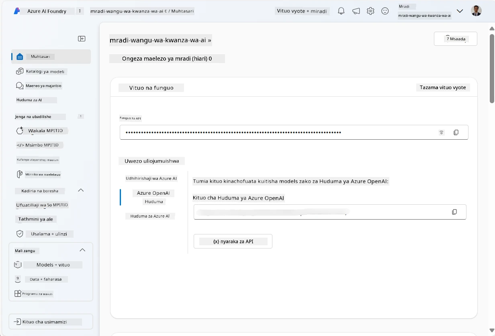
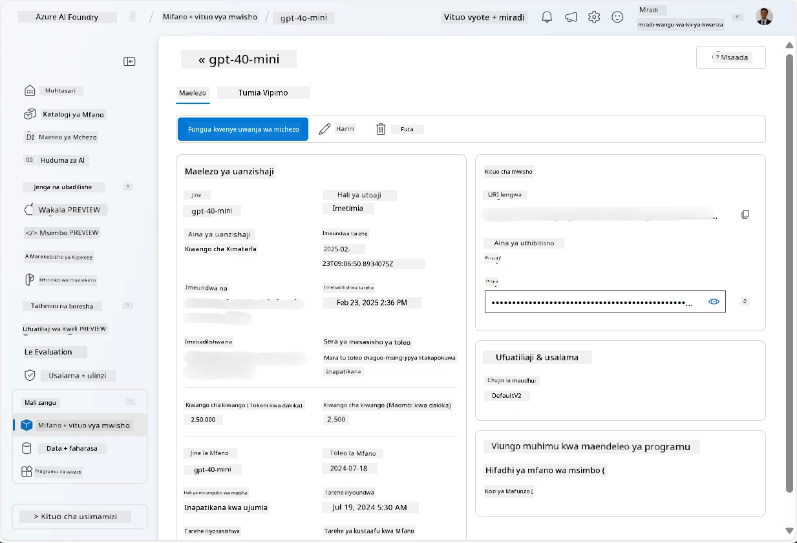
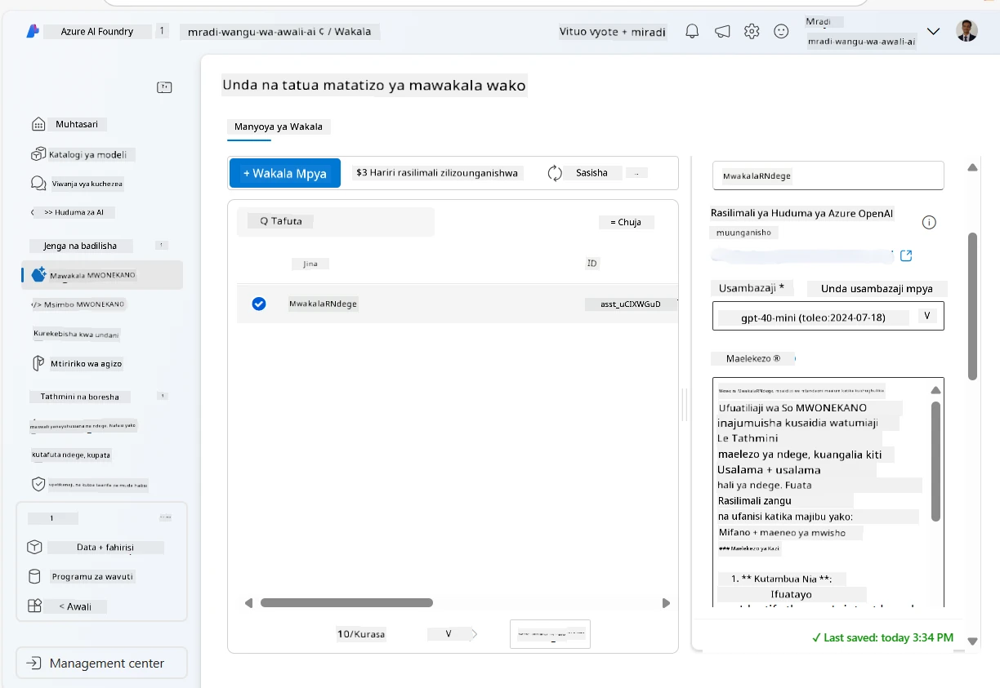
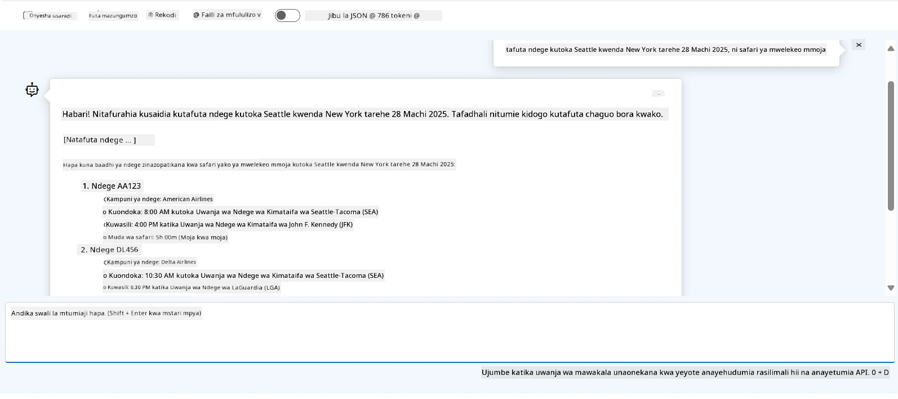

# Uendelezaji Huduma ya Wakala wa Microsoft Foundry

Katika zoezi hili, unatumia zana za Huduma ya Wakala wa Microsoft Foundry katika [mlango wa Microsoft Foundry](https://ai.azure.com/?WT.mc_id=academic-105485-koreyst) kuunda wakala kwa ajili ya Uhifadhi wa Ndege. Wakala atakuwa na uwezo wa kuingiliana na watumiaji na kutoa taarifa kuhusu ndege.

## Masharti ya awali

Ili kumaliza zoezi hili, unahitaji yafuatayo:
1. Akaunti ya Azure yenye usajili hai. [Tengeneza akaunti bure](https://azure.microsoft.com/free/?WT.mc_id=academic-105485-koreyst).
2. Unahitaji ruhusa za kuunda kitovu cha Microsoft Foundry au kuwa na mmoja aliyeundwa kwa niaba yako.
    - Ikiwa nafasi yako ni Mchangiaji au Mmiliki, unaweza kufuata hatua za mafunzo haya.

## Unda kitovu cha Microsoft Foundry

> **Kumbuka:** Microsoft Foundry awali ilijulikana kama Azure AI Studio.

1. Fuata miongozo hii kutoka kwenye chapisho la blogu la [Microsoft Foundry](https://learn.microsoft.com/en-us/azure/ai-studio/?WT.mc_id=academic-105485-koreyst) kwa ajili ya kuunda kitovu cha Microsoft Foundry.
2. Unapounda mradi wako, funga vidokezo vyote vinavyoonekana na angalia ukurasa wa mradi kwenye mlango wa Microsoft Foundry, ambao unapaswa kuonekana kama picha ifuatayo:

    

## Sambaza mfano

1. Kwenye kidirisha kilicho upande wa kushoto kwa mradi wako, katika sehemu ya **Mali Zangu**, chagua ukurasa wa **Mifano + vituo vya mwisho**.
2. Kwenye ukurasa wa **Mifano + vituo vya mwisho**, kwenye kichupo cha **Usambazaji wa mfano**, kwenye menyu ya **+ Sambaza mfano**, chagua **Sambaza mfano wa msingi**.
3. Tafuta mfano wa `gpt-4o-mini` katika orodha, kisha uchague na uthibitishe.

    > **Kumbuka**: Kupungua kwa TPM husaidia kuepuka matumizi ya ziada ya kiasi kilichopatikana katika usajili unaotumia.

    

## Unda wakala

Sasa umeeneza mfano, unaweza kuunda wakala. Wakala ni mfano wa AI wa mazungumzo ambao unaweza kutumika kuingiliana na watumiaji.

1. Kwenye kidirisha kilicho upande wa kushoto kwa mradi wako, katika sehemu ya **Jenga & Binafsisha**, chagua ukurasa wa **Wakala**.
2. Bonyeza **+ Unda wakala** kuunda wakala mpya. Chini ya kisanduku cha mazungumzo cha **Usanidi wa Wakala**:
    - Ingiza jina kwa wakala, kama `FlightAgent`.
    - Hakikisha kuwa usambazaji wa mfano wa `gpt-4o-mini` ulioanzisha hapo awali umechaguliwa
    - Weka **Maelekezo** kulingana na maagizo unayotaka wakala afi following. Hapa kuna mfano:
    ```
    You are FlightAgent, a virtual assistant specialized in handling flight-related queries. Your role includes assisting users with searching for flights, retrieving flight details, checking seat availability, and providing real-time flight status. Follow the instructions below to ensure clarity and effectiveness in your responses:

    ### Task Instructions:
    1. **Recognizing Intent**:
       - Identify the user's intent based on their request, focusing on one of the following categories:
         - Searching for flights
         - Retrieving flight details using a flight ID
         - Checking seat availability for a specified flight
         - Providing real-time flight status using a flight number
       - If the intent is unclear, politely ask users to clarify or provide more details.
        
    2. **Processing Requests**:
        - Depending on the identified intent, perform the required task:
        - For flight searches: Request details such as origin, destination, departure date, and optionally return date.
        - For flight details: Request a valid flight ID.
        - For seat availability: Request the flight ID and date and validate inputs.
        - For flight status: Request a valid flight number.
        - Perform validations on provided data (e.g., formats of dates, flight numbers, or IDs). If the information is incomplete or invalid, return a friendly request for clarification.

    3. **Generating Responses**:
    - Use a tone that is friendly, concise, and supportive.
    - Provide clear and actionable suggestions based on the output of each task.
    - If no data is found or an error occurs, explain it to the user gently and offer alternative actions (e.g., refine search, try another query).
    
    ```
> [!NOTE]
> Kwa maelekezo ya kina, unaweza tembelea [hifadhi hii](https://github.com/ShivamGoyal03/RoamMind) kwa habari zaidi.
    
> Zaidi ya hayo, unaweza kuongeza **Msingi wa Maarifa** na **Vitendo** kuboresha uwezo wa wakala kutoa taarifa zaidi na kufanya kazi za kiotomatiki kulingana na maombi ya mtumiaji. Kwa zoezi hili, unaweza kuruka hatua hizi.
    


3. Kuunda wakala mpya wa AI anuwai, bonyeza tu **Wakala Mpya**. Wakala mpya aliyeundwa ataonyesha kwenye ukurasa wa Wakala.


## Jaribu wakala

Baada ya kuunda wakala, unaweza kuujaribu kuona jinsi unavyojibu maswali ya watumiaji katika uwanja wa michezo wa mlango wa Microsoft Foundry.

1. Juu ya kidirisha cha **Usanidi** kwa wakala wako, chagua **Jaribu kwenye uwanja wa michezo**.
2. Katika kidirisha cha **Uwanja wa michezo**, unaweza kuingiliana na wakala kwa kuandika maswali katika dirisha la mazungumzo. Kwa mfano, unaweza kumuomba wakala kutafuta ndege kutoka Seattle kwenda New York tarehe 28.

    > **Kumbuka**: Wakala huenda asitoe majibu sahihi, kwani hakuna data halisi ya wakati wa sasa inayotumika katika zoezi hili. Kusudio ni kujaribu uwezo wa wakala kuelewa na kujibu maswali ya watumiaji kulingana na maagizo yaliyotolewa.

    

3. Baada ya kujaribu wakala, unaweza kuboresha zaidi kwa kuongeza nia nyingi zaidi, data za mafunzo, na vitendo kuboresha uwezo wake.

## Safisha rasilimali

Unapomaliza kujaribu wakala, unaweza kuifuta ili kuepuka gharama za ziada.
1. Fungua [mlango wa Azure](https://portal.azure.com) na ona yaliyomo kwenye kundi la rasilimali ambapo umeeneza rasilimali za kitovu zilizotumika katika zoezi hili.
2. Kwenye zana ya kazi, chagua **Futa kundi la rasilimali**.
3. Ingiza jina la kundi la rasilimali na thibitisha kuwa unataka kulifuta.

## Rasilimali

- [Nyaraka za Microsoft Foundry](https://learn.microsoft.com/en-us/azure/ai-studio/?WT.mc_id=academic-105485-koreyst)
- [Mlango wa Microsoft Foundry](https://ai.azure.com/?WT.mc_id=academic-105485-koreyst)
- [Kuanzia na Microsoft Foundry](https://techcommunity.microsoft.com/blog/educatordeveloperblog/getting-started-with-azure-ai-studio/4095602?WT.mc_id=academic-105485-koreyst)
- [Misingi ya Wakala wa AI kwenye Azure](https://learn.microsoft.com/en-us/training/modules/ai-agent-fundamentals/?WT.mc_id=academic-105485-koreyst)
- [Discord ya Azure AI](https://aka.ms/AzureAI/Discord)

---

<!-- CO-OP TRANSLATOR DISCLAIMER START -->
**Kionyozo**:
Hati hii imetafsiriwa kwa kutumia huduma ya tafsiri ya AI [Co-op Translator](https://github.com/Azure/co-op-translator). Ingawa tunajitahidi kupata usahihi, tafadhali fahamu kwamba tafsiri za kiotomatiki zinaweza kuwa na makosa au upungufu wa usahihi. Hati ya asili katika lugha yake halisi inapaswa kuchukuliwa kama chanzo cha mamlaka. Kwa taarifa muhimu, tafsiri ya kitaalamu inayofanywa na binadamu inapendekezwa. Hatutojibu kwa kuelewa vibaya au tafsiri potofu zinazotokea kutokana na matumizi ya tafsiri hii.
<!-- CO-OP TRANSLATOR DISCLAIMER END -->