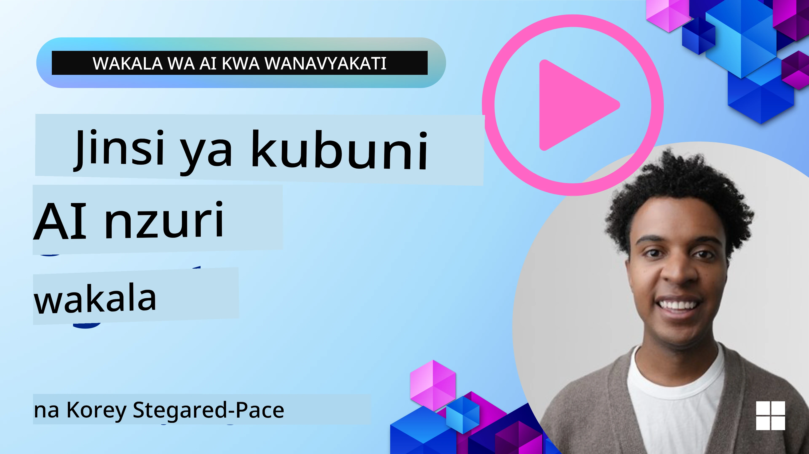
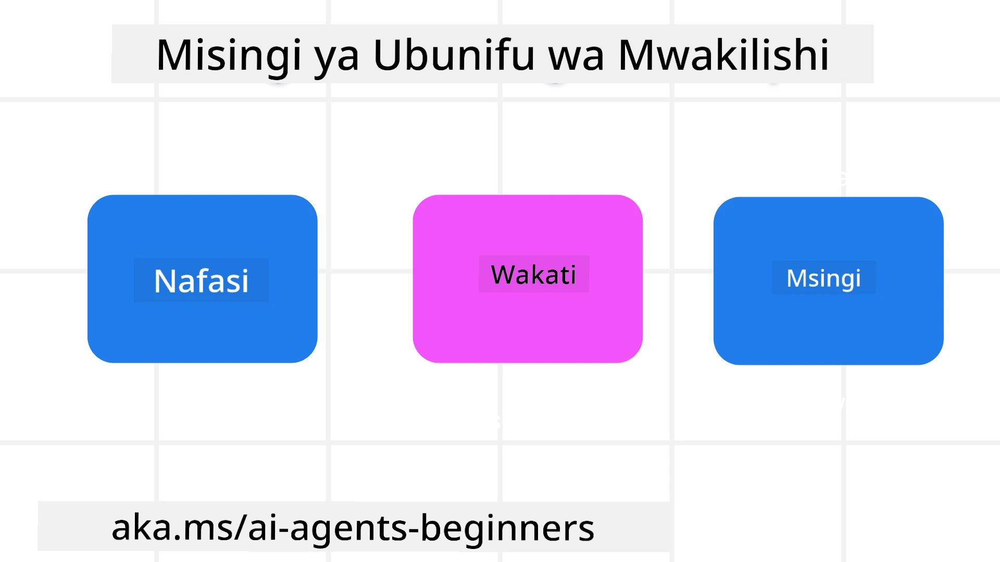

> _(Bonyeza picha hapo juu kutazama video ya somo hili)_
# Misingi ya Ubunifu wa Wakala wa AI

## Utangulizi

Kuna njia nyingi za kufikiria kuhusu kujenga Mifumo ya Wakala wa AI. Kwa kuwa kutoeleweka ni sifa na si hitilafu katika ubunifu wa AI Inayozalisha, wakati mwingine ni vigumu kwa wahandisi kufahamu wapi hata ya kuanzia. Tumeunda seti ya Misingi ya Ubunifu wa UX inayojikita kwa binadamu ili kuwezesha waendelezaji kujenga mifumo ya wakala inayomlenga mteja kutatua mahitaji yao ya kibiashara. Misingi hii ya ubunifu si usanifu ulioamuliwa lakini ni mwanzo kwa timu zinazobainisha na kujenga uzoefu wa wakala.

Kwa ujumla, mawakala wanapaswa:

- Kupanua na kuongeza uwezo wa binadamu (kuwa na mawazo, kutatua matatizo, kuendesha kazi kiotomatiki, n.k.)
- Kujaza mapengo ya maarifa (kunifanya nipate kasi kwenye nyanja za maarifa, tafsiri, n.k.)
- Kuwezesha na kusaidia ushirikiano kwa njia tunazozipenda sisi binafsi kufanya kazi na wengine
- Kutufanya tuwe matoleo bora ya sisi wenyewe (mfano, kocha wa maisha/mwamimu wa kazi, kutusaidia kujifunza udhibiti wa hisia na stadi za uwepo wa akili, kujenga ustahimilivu, n.k.)

## Somo Hili Litatofautaje

- Ni nini Misingi ya Ubunifu wa Wakala
- Ni miongozo gani ya kufuata wakati wa kutekeleza misingi hii ya ubunifu
- Mfano wa matumizi ya misingi ya ubunifu

## Malengo ya Kujifunza

Baada ya kumaliza somo hili, utaweza:

1. Eleza ni nini Misingi ya Ubunifu wa Wakala ni
2. Eleza miongozo ya kutumia Misingi ya Ubunifu wa Wakala
3. Elewa jinsi ya kujenga wakala ukitumia Misingi ya Ubunifu wa Wakala

## Misingi ya Ubunifu wa Wakala

### Wakala (Eneo)

Hii ni mazingira ambamo wakala hufanya kazi. Misingi hii inaelekeza jinsi tunavyobuni mawakala kushiriki katika dunia halisi na ya kidijitali.

- **Kuwaunganisha, si kuunganisha dhidi** – kusaidia kuunganisha watu kwa watu wengine, matukio, na maarifa yanayoweza kutekelezwa ili kuwezesha ushirikiano na muungano.
- Wakala husaidia kuunganisha matukio, maarifa, na watu.
- Wakala huleta watu karibu zaidi. Hawalengwi kubadilisha au kudharau watu.
- **Kufikika kwa urahisi lakini wakati mwingine kutojulikana** – wakala hufanya kazi kwa sehemu nyuma na hututia moyo wakati ni muhimu na inafaa.
  - Wakala anapatikana kwa urahisi na anaweza kufikiwa na watumiaji waliothibitishwa kwenye kifaa au jukwaa lolote.
  - Wakala anasaidia maingilio na matokeo ya aina mbalimbali (sauti, sauti ya mdomo, maandishi, n.k.).
  - Wakala anaweza kubadilika miongoni mwa sehemu za mbele na nyuma; kati ya hatua za kuanzisha na kujibu, kulingana na jinsi anavyohisi mahitaji ya mtumiaji.
  - Wakala anaweza kufanya kazi kwa njia isiyoonekana, lakini mchakato wake wa nyuma na ushirikiano na mawakala wengine ni wazi na unaodhibitiwa na mtumiaji.

### Wakala (Muda)

Hii inaelezea jinsi wakala anavyofanya kazi kwa muda. Misingi hii inaelekeza jinsi tunavyobuni mawakala wanaoshirikiana katika zamani, sasa, na baadaye.

- **Zamani**: Kutafakari historia inayojumuisha hali na muktadha.
  - Wakala hutoa matokeo yanayofaa zaidi kwa msingi wa uchambuzi wa data za kihistoria zenye utajiri zaidi zaidi ya tukio, watu, au hali pekee.
  - Wakala huunda uhusiano kati ya matukio ya zamani na kwa makusudi hutafakari kumbukumbu ili kushiriki katika hali za sasa.
- **Sasa**: Kutoa tahadhari zaidi ya taarifa tu.
  - Wakala huwakilisha njia kamili ya kuingiliana na watu. Wakati tukio linapotokea, wakala anaenda zaidi ya taarifa zisizobadilika au taratibu isiyo na mabadiliko. Wakala anaweza kurahisisha mizunguko au kuunda ishara za mabadiliko kwa kusisimua ili kuelekeza umakini wa mtumiaji wakati sahihi.
  - Wakala hutoa taarifa kulingana na mazingira ya muktadha, mabadiliko ya kijamii na kitamaduni na kulengwa kwasababu ya mtumiaji.
  - Mwingiliano wa wakala unaweza kuwa hatua kwa hatua, ukizidi kuwa na ugumu ili kuwezesha watumiaji kwa muda mrefu.
- **Baadaye**: Kubadilika na kuendelea.
  - Wakala hubadilika kwa vifaa mbalimbali, majukwaa, na moda mbalimbali.
  - Wakala hubadilika kwa mwenendo wa mtumiaji, mahitaji ya upatikanaji, na ni rahisi kubinafsishwa.
  - Wakala huundwa na kuendelea kupitia mwingiliano thabiti wa mtumiaji.

### Wakala (Msingi)

Hivi ni vipengele muhimu ndani ya msingi wa muundo wa wakala.

- **Kubali kutokuwa na uhakika lakini uanzishe uaminifu**.
  - Kiwango fulani cha kutokuwa na uhakika kwa Wakala kinatarajiwa. Kutokuwa na uhakika ni kipengele muhimu cha muundo wa wakala.
  - Uaminifu na uwazi ni nguzo za msingi za muundo wa Wakala.
  - Binadamu wana udhibiti wa wakati Wakala ni on/zimwa na hali ya Wakala inaonekana wazi kila wakati.

## Miongozo ya Kutekeleza Misingi Hii

Unapotumia misingi ya ubunifu iliyotajwa hapo juu, tumia miongozo ifuatayo:

1. **Uwazi**: Mjulisha mtumiaji kuwa AI inahusika, jinsi inavyofanya kazi (ikiwa ni pamoja na vitendo vya zamani), na jinsi ya kutoa maoni na kubadilisha mfumo.
2. **Udhibiti**: Mwezeshe mtumiaji kubinafsisha, kubainisha mapendeleo na kubinafsisha, na kuwa na udhibiti wa mfumo na sifa zake (ikiwa ni pamoja na uwezo wa kusahau).
3. **Ulinganifu**: Lengo ni kuwa na uzoefu thabiti, aina mbalimbali za aina ya maingiliano kati ya vifaa na maeneo ya mwisho. Tumia vipengele vya UI/UX vinavyojulikana pale inapowezekana (kwa mfano, ikoni ya kipaza sauti kwa maingiliano ya sauti) na punguza mzigo wa akili wa mteja kadri iwezekanavyo (mfano, lengo ni majibu mafupi, msaada wa kuona, na maudhui ya ‘Jifunze Zaidi’).

## Jinsi ya Kubuni Wakala wa Usafiri Ukitumia Misingi na Miongozo Hii

Fikiria unabuni Wakala wa Usafiri, hapa ni jinsi unavyoweza kufikiria kuhusu kutumia Misingi ya Ubunifu na Miongozo:

1. **Uwazi** – Mjulisha mtumiaji kuwa Wakala wa Usafiri ni Wakala aliyewezeshwa na AI. Toa maelekezo ya msingi kuhusu jinsi ya kuanza (mfano, ujumbe wa “Hello”, miongozo ya mfano). Andika wazi wazi ukurasa wa bidhaa hii. Onyesha orodha ya miongozo ambayo mtumiaji ameuuliza hapo awali. Fafanua wazi jinsi ya kutoa maoni (kuchagua kidole juu au chini, kitufe cha Tuma Maoni, n.k.). Sema wazi ikiwa Wakala ana vikwazo vya matumizi au mada.
2. **Udhibiti** – Hakikisha ni wazi jinsi mtumiaji anavyoweza kubadilisha Wakala baada ya kuundwa kwa vitu kama Prompt ya Mfumo. Mwezeshe mtumiaji kuchagua uwazi wa mazungumzo ya Wakala, mtindo wa uandishi, na vikwazo vyovyote kuhusu kile Wakala haipaswi kuzungumzia. Mruhusu mtumiaji kuangalia na kufuta faili, data, mazungumzo, na miongozo aliokuwa nayo hapo awali.
3. **Ulinganifu** – Hakikisha ikoni za Kushiriki Mwongozo, kuongeza faili au picha na kumtaja mtu au kitu ni za kawaida na zinatambulika. Tumia ikoni ya muhuri wa karatasi kuonyesha kupakia/kushiriki faili na Wakala, na ikoni ya picha kuonyesha kupakia michoro.

## Mifano ya Msimbo

- Python: [Agent Framework](./code_samples/03-python-agent-framework.ipynb)
- .NET: [Agent Framework](./code_samples/03-dotnet-agent-framework.md)

## Una Maswali Zaidi Kuhusu Mifumo ya Ubunifu wa Wakala wa AI?

Jiunge na [Microsoft Foundry Discord](https://discord.com/invite/ATgtXmAS5D) kukutana na wanafunzi wengine, kuhudhuria ofisi za maswali na kupata majibu kuhusu Maswali yako ya Wakala wa AI.

## Vyanzo Zaidi

- <a href="https://openai.com" target="_blank">Mazingira ya Kudhibiti Mifumo ya AI ya Wakala | OpenAI</a>
- <a href="https://microsoft.com" target="_blank">Mradi wa Zana za HAX - Microsoft Research</a>
- <a href="https://responsibleaitoolbox.ai" target="_blank">Sanduku la Zana za AI Zinazowajibika</a>

## Somo lililopita

[Kuchunguza Mifumo ya Wakala](../02-explore-agentic-frameworks/README.md)

## Somo Linalofuata

[Mfumo wa Kutumia Zana](../04-tool-use/README.md)

---

<!-- CO-OP TRANSLATOR DISCLAIMER START -->
**Kionyozo**:
Hati hii imetafsiriwa kwa kutumia huduma ya tafsiri ya AI [Co-op Translator](https://github.com/Azure/co-op-translator). Ingawa tunajitahidi kupata usahihi, tafadhali fahamu kwamba tafsiri za kiotomatiki zinaweza kuwa na makosa au upungufu wa usahihi. Hati ya asili katika lugha yake halisi inapaswa kuchukuliwa kama chanzo cha mamlaka. Kwa taarifa muhimu, tafsiri ya kitaalamu inayofanywa na binadamu inapendekezwa. Hatutojibu kwa kuelewa vibaya au tafsiri potofu zinazotokea kutokana na matumizi ya tafsiri hii.
<!-- CO-OP TRANSLATOR DISCLAIMER END -->