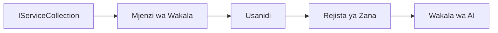

# 🎨 Mifumo ya Muundo wa Agentic na Azure OpenAI (API za Majibu) (.NET)

## 📋 Malengo ya Kujifunza

Mfano huu unaonyesha mifumo ya muundo ya ngazi ya biashara kwa ujenzi wa mawakala wenye akili kwa kutumia Microsoft Agent Framework katika .NET na uunganisho wa Azure OpenAI (API za Majibu). Utajifunza mifumo ya kitaalamu na mbinu za usanifu zinazofanya mawakala kuwa tayari kwa uzalishaji, rahisi kudumisha, na kuweza kupanuka.

### Mifumo ya Muundo ya Biashara

- 🏭 **Mfumo wa Kiwanda**: Uundaji wa wakala uliosanifiwa kwa kutumia usambazaji tegemezi
- 🔧 **Mfumo wa Mjenzi**: Usanidi na uundaji wa wakala kwa mtiririko mzuri
- 🧵 **Mifumo Salama kwa Mifumo ya Mstari (Thread-Safe)**: Usimamizi wa mazungumzo ya pamoja
- 📋 **Mfumo wa Hifadhi**: Usimamizi wa zana na uwezo kwa mpangilio

## 🎯 Manufaa Maalum kwa .NET

### Sifa za Biashara

- **Uainishaji Imara**: Uthibitishaji wakati wa kuandaa na msaada wa IntelliSense
- **Usambazaji Tegemezi**: Uunganisho wa kisanduku cha usambazaji tegemezi uliyojengwa ndani
- **Usimamizi wa Usanidi**: Miundo ya IConfiguration na Options
- **Async/Await**: Msaada wa hali ya juu kwa programu zisizo za kuzuia

### Mifumo Yenye Kuwa Tayari kwa Uzalishaji

- **Uunganisho wa Kuingiza Magogo**: ILogger na msaada wa kuingia kwa muundo
- **Mikaguzi ya Afya**: Ufuatiliaji na uchunguzi uliyojengwa ndani
- **Uthibitishaji wa Usanidi**: Uainishaji imara na utoaji wa data wa alama
- **Usimamizi wa Makosa**: Usimamizi wa makosa ya muundo

## 🔧 Usanifu wa Kiufundi

### Vipengele Vikuu vya .NET

- **Microsoft.Extensions.AI**: Mifumo ya huduma ya AI iliyounganishwa
- **Microsoft.Agents.AI**: Mfumo wa uendeshaji mawakala wa biashara
- **Azure OpenAI (API za Majibu)**: Mifumo ya wateja wa API yenye utendaji wa hali ya juu
- **Mfumo wa Usanidi**: appsettings.json na uunganisho wa mazingira

### Utekelezaji wa Mfano wa Muundo



## 🏗️ Mifumo ya Biashara Iliyoonyesha

### 1. **Mifumo ya Uumbaji**

- **Kiwanda cha Wakala**: Uundaji wa wakala uliowezeshwa katikati na usanidi thabiti
- **Mfumo wa Mjenzi**: API yenye mtiririko mzuri kwa usanidi mgumu wa wakala
- **Mfumo wa Singleton**: Usimamizi wa rasilimali pamoja na usanidi
- **Usambazaji Tegemezi**: Uunganisho usio tegemeana sana na urahisi wa majaribio

### 2. **Mifumo ya Tabia**

- **Mfumo wa Mkakati**: Mikakati tofauti ya utekelezaji wa zana
- **Mfumo wa Amri**: Operesheni za wakala zilizofungwa na uwezo wa kuondoa/kurudia
- **Mfumo wa Mhubiri**: Usimamizi wa mzunguko wa maisha wa wakala unaochochewa kwa tukio
- **Mbinu ya Mfano**: Mikondo ya utekelezaji wa wakala iliyosanifiwa

### 3. **Mifumo ya Muundo**

- **Mfumo wa Kiberiti**: Tabaka la uunganisho la Azure OpenAI (API za Majibu)
- **Mfumo wa Mpaniaji**: Kuongeza uwezo wa wakala
- **Mfumo wa Uso (Facade)**: Mifumo rahisi ya mwingiliano wa wakala
- **Mfumo wa Wakala wa Mwingiliano (Proxy)**: Kupakia polepole na kuweka kwenye hifadhidata kwa utendaji

## 📚 Kanuni za Muundo za .NET

### Kanuni za SOLID

- **Jukumu Moja**: Kila sehemu ina kusudi moja wazi
- **Wazi/Mfungwa**: Inakua bila marekebisho
- **Badilishaji la Liskov**: Utekelezaji wa zana unaotegemea interface
- **Ugawaji wa Interface**: Interfaces zilizo na lengo na mshikamano
- **Usukuma wa Tegemezi**: Tegemewa kwa abstraksheni, si kwa vitu halisi

### Usanifu Safi

- **Tabaka la Kitalu**: Abstraksheni kuu za wakala na zana
- **Tabaka la Maombi**: Uendeshaji na mikondo ya kazi ya wakala
- **Tabaka la Miundombinu**: Uunganisho wa Azure OpenAI (API za Majibu) na huduma za nje
- **Tabaka la Uwasilishaji**: Mwingiliano wa mtumiaji na uundaji wa majibu

## 🔒 Mambo ya Kuzingatia Biashara

### Usalama

- **Usimamizi wa Cheti**: Ushughulikiaji salama wa funguo za API kwa IConfiguration
- **Uthibitishaji wa Ingizo**: Uainishaji imara na uthibitishaji wa alama za data
- **Usafi wa Matokeo**: Usindikaji na kuchuja majibu kwa usalama
- **Kuingiza Magogo ya Ukaguzi**: Ufuatiliaji kamili wa matendo

### Utendaji

- **Mifumo ya Async**: Operesheni zisizozuia za I/O
- **Hifadhi ya Muunganisho**: Usimamizi wa mteja wa HTTP kwa ufanisi
- **Kuweka Hifadhidata**: Kuweka majibu kwa kasi bora ya utendaji
- **Usimamizi wa Rasilimali**: Mifumo sahihi ya utupaji na usafi

### Uweza Kupanuka

- **Usalama wa Mifumo ya Mstari**: Msaada wa utekelezaji wa wakala sambamba
- **Hifadhi ya Rasilimali**: Matumizi bora ya rasilimali
- **Usimamizi wa Mzigo**: Kuzuia kasi na usimamizi wa shinikizo la nyuma
- **Ufuatiliaji**: Vipimo vya utendaji na mikaguzi ya afya

## 🚀 Usambazaji kwa Uzalishaji

- **Usimamizi wa Usanidi**: Mipangilio maalum ya mazingira
- **Mikakati ya Kuingiza Magogo**: Kuingiza magogo kwa muundo na vitambulisho vya uhusiano
- **Usimamizi wa Makosa**: Usimamizi wa makosa ya kimataifa na urejeshaji sahihi
- **Ufuatiliaji**: Michunguzi ya programu na vipimo vya utendaji
- **Majaribio**: Majaribio ya vitengo, majaribio ya muunganisho, na mifumo ya majaribio ya mzigo

Tayari kujenga mawakala wenye akili wa ngazi ya biashara kwa .NET? Tukutane tufanye usanifu imara! 🏢✨

## 🚀 Anza

### Mahitaji Kabla ya Kuanzisha

- [SDK ya .NET 10](https://dotnet.microsoft.com/download/dotnet/10.0) au zaidi
- [Usajili wa Azure](https://azure.microsoft.com/free/) unaojumuisha rasilimali ya Azure OpenAI na upangaji wa modeli
- [Azure CLI](https://learn.microsoft.com/cli/azure/install-azure-cli) — ingia kwa kutumia `az login`

### Mabadiliko ya Mazingira Yanayohitajika

```bash
# zsh/bash
export AZURE_OPENAI_ENDPOINT=https://<your-resource>.openai.azure.com
export AZURE_OPENAI_DEPLOYMENT=gpt-4o-mini
# Kisha ingia ili AzureCliCredential iweze kupata tokeni
az login
```

```powershell
# PowerShell
$env:AZURE_OPENAI_ENDPOINT = "https://<your-resource>.openai.azure.com"
$env:AZURE_OPENAI_DEPLOYMENT = "gpt-4o-mini"
# Kisha ingia ili AzureCliCredential ipate tokeni
az login
```

### Mfano wa Msimbo

Kuendesha mfano wa msimbo,

```bash
# zsh/bash
chmod +x ./03-dotnet-agent-framework.cs
./03-dotnet-agent-framework.cs
```

Au kwa kutumia CLI ya dotnet:

```bash
dotnet run ./03-dotnet-agent-framework.cs
```

Tazama [`03-dotnet-agent-framework.cs`](../../../../03-agentic-design-patterns/code_samples/03-dotnet-agent-framework.cs) kwa msimbo kamili.

```csharp
#!/usr/bin/dotnet run

#:package Microsoft.Extensions.AI@10.*
#:package Microsoft.Agents.AI.OpenAI@1.*-*
#:package Azure.AI.OpenAI@2.1.0
#:package Azure.Identity@1.13.1

using System.ComponentModel;

using Microsoft.Agents.AI;
using Microsoft.Extensions.AI;

using Azure.AI.OpenAI;
using Azure.Identity;

// Tool Function: Random Destination Generator
// This static method will be available to the agent as a callable tool
// The [Description] attribute helps the AI understand when to use this function
// This demonstrates how to create custom tools for AI agents
[Description("Provides a random vacation destination.")]
static string GetRandomDestination()
{
    // List of popular vacation destinations around the world
    // The agent will randomly select from these options
    var destinations = new List<string>
    {
        "Paris, France",
        "Tokyo, Japan",
        "New York City, USA",
        "Sydney, Australia",
        "Rome, Italy",
        "Barcelona, Spain",
        "Cape Town, South Africa",
        "Rio de Janeiro, Brazil",
        "Bangkok, Thailand",
        "Vancouver, Canada"
    };

    // Generate random index and return selected destination
    // Uses System.Random for simple random selection
    var random = new Random();
    int index = random.Next(destinations.Count);
    return destinations[index];
}

// Azure OpenAI with the Responses API (stable v1 endpoint). Sign in with `az login`.
var azureEndpoint = Environment.GetEnvironmentVariable("AZURE_OPENAI_ENDPOINT")
    ?? throw new InvalidOperationException("AZURE_OPENAI_ENDPOINT is not set.");
var deployment = Environment.GetEnvironmentVariable("AZURE_OPENAI_DEPLOYMENT") ?? "gpt-4o-mini";

var azureClient = new AzureOpenAIClient(new Uri(azureEndpoint), new AzureCliCredential());

// Define Agent Identity and Comprehensive Instructions
// Agent name for identification and logging purposes
var AGENT_NAME = "TravelAgent";

// Detailed instructions that define the agent's personality, capabilities, and behavior
// This system prompt shapes how the agent responds and interacts with users
var AGENT_INSTRUCTIONS = """
You are a helpful AI Agent that can help plan vacations for customers.

Important: When users specify a destination, always plan for that location. Only suggest random destinations when the user hasn't specified a preference.

When the conversation begins, introduce yourself with this message:
"Hello! I'm your TravelAgent assistant. I can help plan vacations and suggest interesting destinations for you. Here are some things you can ask me:
1. Plan a day trip to a specific location
2. Suggest a random vacation destination
3. Find destinations with specific features (beaches, mountains, historical sites, etc.)
4. Plan an alternative trip if you don't like my first suggestion

What kind of trip would you like me to help you plan today?"

Always prioritize user preferences. If they mention a specific destination like "Bali" or "Paris," focus your planning on that location rather than suggesting alternatives.
""";

// Create AI Agent with Advanced Travel Planning Capabilities
// Get the Responses client for the deployment and create the AI agent
// Configure agent with name, detailed instructions, and available tools
// This demonstrates the .NET agent creation pattern with full configuration
AIAgent agent = azureClient
    .GetOpenAIResponseClient(deployment)
    .CreateAIAgent(
        name: AGENT_NAME,
        instructions: AGENT_INSTRUCTIONS,
        tools: [AIFunctionFactory.Create(GetRandomDestination)]
    );

// Create New Conversation Thread for Context Management
// Initialize a new conversation thread to maintain context across multiple interactions
// Threads enable the agent to remember previous exchanges and maintain conversational state
// This is essential for multi-turn conversations and contextual understanding
AgentThread thread = agent.GetNewThread();

// Execute Agent: First Travel Planning Request
// Run the agent with an initial request that will likely trigger the random destination tool
// The agent will analyze the request, use the GetRandomDestination tool, and create an itinerary
// Using the thread parameter maintains conversation context for subsequent interactions
await foreach (var update in agent.RunStreamingAsync("Plan me a day trip", thread))
{
    await Task.Delay(10);
    Console.Write(update);
}

Console.WriteLine();

// Execute Agent: Follow-up Request with Context Awareness
// Demonstrate contextual conversation by referencing the previous response
// The agent remembers the previous destination suggestion and will provide an alternative
// This showcases the power of conversation threads and contextual understanding in .NET agents
await foreach (var update in agent.RunStreamingAsync("I don't like that destination. Plan me another vacation.", thread))
{
    await Task.Delay(10);
    Console.Write(update);
}
```

---

<!-- CO-OP TRANSLATOR DISCLAIMER START -->
**Kionyozo**:
Hati hii imetafsiriwa kwa kutumia huduma ya tafsiri ya AI [Co-op Translator](https://github.com/Azure/co-op-translator). Ingawa tunajitahidi kupata usahihi, tafadhali fahamu kwamba tafsiri za kiotomatiki zinaweza kuwa na makosa au upungufu wa usahihi. Hati ya asili katika lugha yake halisi inapaswa kuchukuliwa kama chanzo cha mamlaka. Kwa taarifa muhimu, tafsiri ya kitaalamu inayofanywa na binadamu inapendekezwa. Hatutojibu kwa kuelewa vibaya au tafsiri potofu zinazotokea kutokana na matumizi ya tafsiri hii.
<!-- CO-OP TRANSLATOR DISCLAIMER END -->