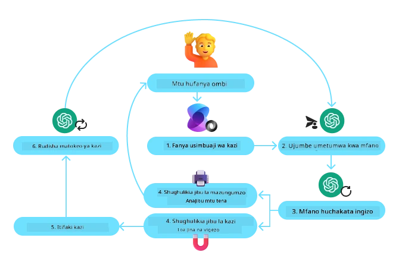
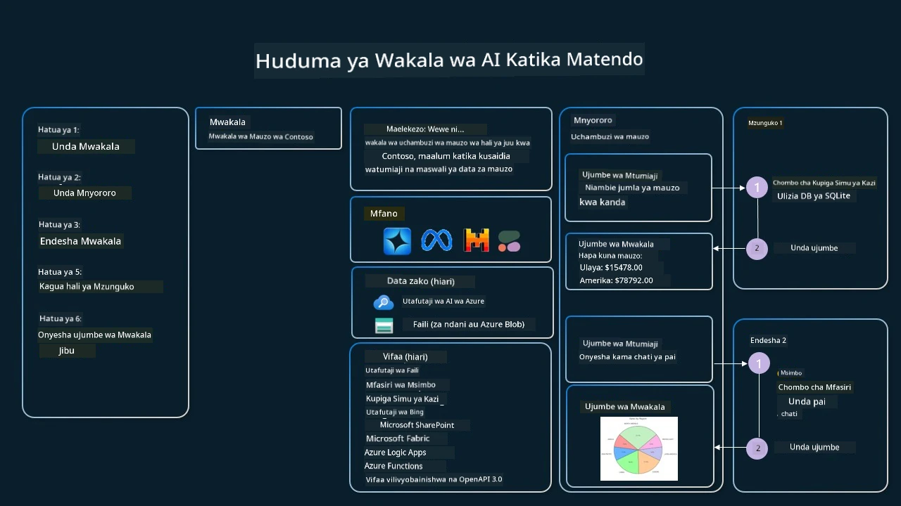

[](https://youtu.be/vieRiPRx-gI?si=cEZ8ApnT6Sus9rhn)

> _(Bonyeza picha hapo juu kutazama video ya somo hili)_

# Muundo wa Matumizi ya Zana

Zana ni za kuvutia kwa sababu zinawawezesha mawakala wa AI kuwa na uwezo mpana zaidi. Badala ya wakala kuwa na seti ndogo ya hatua anazoweza kufanya, kwa kuongeza zana, wakala sasa anaweza kufanya aina mbalimbali za hatua. Katika sura hii, tutaangalia Muundo wa Matumizi ya Zana, ambao unaelezea jinsi mawakala wa AI wanavyoweza kutumia zana maalum kufanikisha malengo yao.

## Utangulizi

Katika somo hili, tunaangalia kujibu maswali yafuatayo:

- Ni nini muundo wa matumizi ya zana?
- Ni matumizi gani yanaweza kutekelezwa nayo?
- Ni vipengele/vipande gani vinavyohitajika kutekeleza muundo huu?
- Ni mambo gani mahsusi kuzingatia wakati wa kutumia Muundo wa Matumizi ya Zana ili kujenga mawakala wa AI wa kuaminika?

## Malengo ya Kujifunza

Baada ya kumaliza somo hili, utaweza:

- Elezea Muundo wa Matumizi ya Zana na kusudi lake.
- Tambua matumizi ambapo Muundo wa Matumizi ya Zana unaweza kutumika.
- Elewa vipengele muhimu vinavyohitajika kutekeleza muundo huu.
- Tambua mambo yanayozingatiwa kuhakikisha uaminifu wa mawakala wa AI wanaotumia muundo huu.

## Ni nini Muundo wa Matumizi ya Zana?

**Muundo wa Matumizi ya Zana** unalenga kumpa LLMs uwezo wa kuingiliana na zana za nje kufanikisha malengo maalum. Zana ni msimbo unaoweza kutekelezwa na wakala kufanya hatua. Zana inaweza kuwa kazi rahisi kama kalkuleta, au mwito wa API kwa huduma ya mtu wa tatu kama kutafuta bei ya hisa au utabiri wa hali ya hewa. Katika muktadha wa mawakala wa AI, zana zimeundwa kutekelezwa na mawakala kama majibu kwa **miito ya kazi inayotokana na mfano**.

## Matumizi gani yanaweza kutekelezwa nayo?

Mawakala wa AI wanaweza kutumia zana kukamilisha kazi ngumu, kupata taarifa, au kufanya maamuzi. Muundo wa matumizi ya zana mara nyingi hutumika katika senario zinazohitaji mwingiliano wa mabadiliko na mifumo ya nje, kama vile hifadhidata, huduma za wavuti, au tafsiri za msimbo. Uwezo huu ni muhimu kwa matumizi mbalimbali ikiwemo:

- **Urikaji wa Taarifa kwa Muda Halisi:** Mawakala wanaweza kuulizia API za nje au hifadhidata kupata data ya hivi karibuni (mfano, kuulizia hifadhidata ya SQLite kwa uchambuzi wa data, kupata bei za hisa au taarifa za hali ya hewa).
- **Utekelezaji na Tafsiri ya Msimbo:** Mawakala wanaweza kutekeleza msimbo au skiripti kutatua matatizo ya kihisabati, kuandaa ripoti, au kufanya majaribio.
- **Otomatiki ya Mtiririko wa Kazi:** Kutoa otomatiki kwa kazi zinazojirudia au yenye hatua nyingi kwa kuunganisha zana kama ratiba za kazi, huduma za barua pepe, au mifereji ya data.
- **Huduma kwa Wateja:** Mawakala wanaweza kuingiliana na mifumo ya CRM, majukwaa ya tiketi, au misingi ya maarifa kutatua maswali ya watumiaji.
- **Uundaji na Uhariri wa Yaliyomo:** Mawakala wanaweza kutumia zana kama ukaguzi wa sarufi, muhtasari wa maandishi, au wachambuzi wa usalama wa maudhui kusaidia kazi za uundaji maudhui.

## Vipengele/vipande gani vinavyohitajika kutekeleza muundo wa matumizi ya zana?

Vipande hivi vinamuwezesha wakala wa AI kufanya kazi mbalimbali. Tuchunguze vipengele muhimu vinavyohitajika kutekeleza Muundo wa Matumizi ya Zana:

- **Mifumo ya Kazi/Zana**: Maelezo ya kina ya zana zinazopatikana, pamoja na jina la kazi, kusudi, vigezo vinavyohitajika, na matokeo yanayotarajiwa. Mifumo hii inawawezesha LLM kuelewa zana zilizopo na jinsi ya kutengeneza maombi halali.

- **Mantiki ya Utekelezaji wa Kazi**: Inasimamia jinsi na lini zana zinaanzishwa kulingana na nia ya mtumiaji na muktadha wa mazungumzo. Hii inaweza kujumuisha moduli za kupanga, mbinu za upitishaji, au mtiririko wa masharti unaoamua matumizi ya zana kwa mabadiliko.

- **Mfumo wa Usimamizi wa Ujumbe**: Vipengele vinavyosimamia mtiririko wa mazungumzo kati ya ingizo la mtumiaji, majibu ya LLM, miito ya zana, na matokeo ya zana.

- **Mfumo wa Uunganishaji wa Zana**: Miundombinu inayounganisha wakala na zana mbalimbali, iwe ni kazi rahisi au huduma ngumu za nje.

- **Utambuzi na Uthibitishaji wa Makosa**: Mifumo ya kushughulikia makosa katika utekelezaji wa zana, kuthibitisha vigezo, na kusimamia majibu yasiyotarajiwa.

- **Usimamizi wa Hali**: Inafuatilia muktadha wa mazungumzo, mwingiliano ya awali ya zana, na data endelevu kuhakikisha uthabiti katika mwingiliano wa sehemu nyingi.

Ifuatayo, tutaangalia kwa kina kuhusu Kuitwa kwa Kazi/Zana.

### Kuitwa kwa Kazi/Zana

Kuitwa kwa kazi ni njia kuu tunayoitumika kumwezesha Mfano Mkubwa wa Lugha (LLM) kuingiliana na zana. Mara nyingi utaona 'Kazi' na 'Zana' zikitumika badilika maana kwa sababu 'kazi' (blocks za msimbo unaoweza kutumika tena) ni 'zana' ambazo mawakala hutumia kufanya kazi. Ili msimbo wa kazi iitwayo, LLM lazima ifananishe ombi la mtumiaji na maelezo ya kazi. Kufanya hivyo, hapo awali hutumwa skema yenye maelezo ya kazi zote zinazopatikana kwa LLM. LLM huchagua kazi inayofaa zaidi kwa kazi husika na kurudisha jina la kazi pamoja na hoja zake. Kazi iliyochaguliwa huitwa, jibu lake hurudishwa kwa LLM, ambayo hutumia taarifa hiyo kujibu ombi la mtumiaji.

Kwa waendelezaji kutekeleza kuitwa kwa kazi kwa mawakala, utahitaji:

1. Mfano wa LLM unaounga mkono kuitwa kwa kazi
2. Skema yenye maelezo ya kazi
3. Msimbo wa kila kazi iliyobainishwa

Tuchukue mfano wa kupata muda wa sasa katika mji kufafanua:

1. **anzisha LLM inayounga mkono kuitwa kwa kazi:**

   Sio mifano yote inayo support kuitwa kwa kazi, ni muhimu kuhakiki kwamba LLM unayotumia ina support. <a href="https://learn.microsoft.com/azure/ai-services/openai/how-to/function-calling" target="_blank">Azure OpenAI</a> ina support kuitwa kwa kazi. Tunaweza kuanza kwa kuanzisha mteja wa Azure OpenAI.

    ```python
    # Anzisha mteja wa Azure OpenAI
    client = AzureOpenAI(
        azure_endpoint = os.getenv("AZURE_AI_PROJECT_ENDPOINT"), 
        api_key=os.getenv("AZURE_OPENAI_API_KEY"),  
        api_version="2024-05-01-preview"
    )
    ```

1. **Tengeneza Skema ya Kazi**:

   Ifuatayo tutaelezea skema ya JSON inayoonyesha jina la kazi, maelezo ya hufanya kazi gani, na majina na maelezo ya vigezo vya kazi.
   Kisha tutapita skema hii kwa mteja aliyeanzishwa hapo awali, pamoja na ombi la mtumiaji la kupata muda wa San Francisco. Kitu muhimu cha kutambua ni kwamba **mwito wa zana** ndio hutolewa, **sio** jibu la mwisho kwa swali. Kama ilivyoelezwa awali, LLM hurejesha jina la kazi iliyochaguliwa kwa kazi na hoja zitakazopitishwa.

    ```python
    # Maelezo ya kazi kwa modeli kusoma
    tools = [
        {
            "type": "function",
            "function": {
                "name": "get_current_time",
                "description": "Get the current time in a given location",
                "parameters": {
                    "type": "object",
                    "properties": {
                        "location": {
                            "type": "string",
                            "description": "The city name, e.g. San Francisco",
                        },
                    },
                    "required": ["location"],
                },
            }
        }
    ]
    ```
   
    ```python
  
    # Ujumbe wa mwanzo wa mtumiaji
    messages = [{"role": "user", "content": "What's the current time in San Francisco"}] 
  
    # Simu ya kwanza ya API: Muulize mfano kutumia kazi
      response = client.chat.completions.create(
          model=deployment_name,
          messages=messages,
          tools=tools,
          tool_choice="auto",
      )
  
      # Chakata jibu la mfano
      response_message = response.choices[0].message
      messages.append(response_message)
  
      print("Model's response:")  

      print(response_message)
  
    ```

    ```bash
    Model's response:
    ChatCompletionMessage(content=None, role='assistant', function_call=None, tool_calls=[ChatCompletionMessageToolCall(id='call_pOsKdUlqvdyttYB67MOj434b', function=Function(arguments='{"location":"San Francisco"}', name='get_current_time'), type='function')])
    ```
  
1. **Msimbo wa kazi unaohitajika kutekeleza kazi:**

   Sasa LLM imeteua kazi ambayo inapaswa kutekelezwa, msimbo unaotekeleza kazi unahitajika kutekelezwa.
   Tunaweza kutekeleza msimbo wa kupata wakati wa sasa kwa Python. Pia tunahitaji kuandika msimbo wa kutoa jina na hoja kutoka kwa response_message kupata matokeo ya mwisho.

    ```python
      def get_current_time(location):
        """Get the current time for a given location"""
        print(f"get_current_time called with location: {location}")  
        location_lower = location.lower()
        
        for key, timezone in TIMEZONE_DATA.items():
            if key in location_lower:
                print(f"Timezone found for {key}")  
                current_time = datetime.now(ZoneInfo(timezone)).strftime("%I:%M %p")
                return json.dumps({
                    "location": location,
                    "current_time": current_time
                })
      
        print(f"No timezone data found for {location_lower}")  
        return json.dumps({"location": location, "current_time": "unknown"})
    ```

     ```python
     # Shughulikia miito ya kazi
      if response_message.tool_calls:
          for tool_call in response_message.tool_calls:
              if tool_call.function.name == "get_current_time":
     
                  function_args = json.loads(tool_call.function.arguments)
     
                  time_response = get_current_time(
                      location=function_args.get("location")
                  )
     
                  messages.append({
                      "tool_call_id": tool_call.id,
                      "role": "tool",
                      "name": "get_current_time",
                      "content": time_response,
                  })
      else:
          print("No tool calls were made by the model.")  
  
      # Mwito wa API wa pili: Pata jibu la mwisho kutoka kwa mfano
      final_response = client.chat.completions.create(
          model=deployment_name,
          messages=messages,
      )
  
      return final_response.choices[0].message.content
     ```

     ```bash
      get_current_time called with location: San Francisco
      Timezone found for san francisco
      The current time in San Francisco is 09:24 AM.
     ```


Kuitwa kwa Kazi ni kiini cha muundo wa matumizi ya zana kwa wakala wengi, ingawa kutekeleza kutoka mwanzoni kunaweza kuwa changamoto wakati mwingine.
Kama tulivyojifunza katika [Somo la 2](../../../02-explore-agentic-frameworks), mifumo ya agentic inatupa vipande vilivyotengenezwa tayari kutekeleza matumizi ya zana.

## Mifano ya Matumizi ya Zana kwa Mifumo ya Agentic

Hapa kuna mifano ya jinsi unavyoweza kutekeleza Muundo wa Matumizi ya Zana kwa kutumia mifumo tofauti ya agentic:

### Microsoft Agent Framework

<a href="https://learn.microsoft.com/azure/ai-services/agents/overview" target="_blank">Microsoft Agent Framework</a> ni mfumo wa AI wazi wa chanzo kwa ajili ya kujenga mawakala wa AI. Unarahisisha mchakato wa kuitwa kwa kazi kwa kuruhusu kutangaza zana kama kazi za Python kwa kutumia 'decorator' ya `@tool`. Mfumo unasimamia mawasiliano ya mzunguko kati ya mfano na msimbo wako. Pia hutoa upatikanaji wa zana zilizojengwa kama File Search na Code Interpreter kupitia `AzureAIProjectAgentProvider`.

Mchoro ufuatao unaonyesha mchakato wa kuitwa kwa kazi na Microsoft Agent Framework:



Katika Microsoft Agent Framework, zana huainishwa kama kazi zilizo na decorators. Tunaweza kubadilisha kazi `get_current_time` tuliyoiona awali kuwa zana kwa kutumia `@tool` decorator. Mfumo utahifadhi kazi na vigezo vyake moja kwa moja kwa kuunda skema ya kutumwa kwa LLM.

```python
from agent_framework import tool
from agent_framework.azure import AzureAIProjectAgentProvider
from azure.identity import AzureCliCredential

@tool
def get_current_time(location: str) -> str:
    """Get the current time for a given location"""
    ...

# Unda mteja
provider = AzureAIProjectAgentProvider(credential=AzureCliCredential())

# Unda wakala na uendeshe na zana
agent = await provider.create_agent(name="TimeAgent", instructions="Use available tools to answer questions.", tools=get_current_time)
response = await agent.run("What time is it?")
```
  
### Azure AI Agent Service

<a href="https://learn.microsoft.com/azure/ai-services/agents/overview" target="_blank">Azure AI Agent Service</a> ni mfumo mpya wa agentic ulioundwa kuwapa waendelezaji uwezo wa kujenga, kutumika, na kupanua mawakala wa AI yenye ubora wa hali ya juu kwa usalama bila hitaji la kusimamia rasilimali za msingi za hifadhi na kompyuta. Ni muhimu hasa kwa matumizi ya biashara kwa kuwa ni huduma inayosimamiwa kikamilifu na usalama wa kiwango cha biashara.

Ukilinganisha na maendeleo kwa kutumia LLM API moja kwa moja, Azure AI Agent Service huleta faida kama:

- Kuitwa kwa zana moja kwa moja – hakuna hitaji la kuchambua mwito wa zana, kuita zana, na kusimamia jibu; yote haya hufanyika upande wa seva
- Usimamizi wa data uliolindwa – badala ya kusimamia hali yako ya mazungumzo, unaweza kutumia 'threads' kuhifadhi taarifa zote unazohitaji
- Zana zilizopo tayari – zana unazoweza kutumia kuingiliana na vyanzo vya data kama Bing, Azure AI Search, na Azure Functions.

Zana zilizopo katika Azure AI Agent Service zinaweza kugawanywa katika makundi mawili:

1. Zana za Maarifa:
    - <a href="https://learn.microsoft.com/azure/ai-services/agents/how-to/tools/bing-grounding?tabs=python&pivots=overview" target="_blank">Kuimarishwa na Bing Search</a>
    - <a href="https://learn.microsoft.com/azure/ai-services/agents/how-to/tools/file-search?tabs=python&pivots=overview" target="_blank">Utafutaji wa Faili</a>
    - <a href="https://learn.microsoft.com/azure/ai-services/agents/how-to/tools/azure-ai-search?tabs=azurecli%2Cpython&pivots=overview-azure-ai-search" target="_blank">Azure AI Search</a>

2. Zana za Hatua:
    - <a href="https://learn.microsoft.com/azure/ai-services/agents/how-to/tools/function-calling?tabs=python&pivots=overview" target="_blank">Kuitwa kwa Kazi</a>
    - <a href="https://learn.microsoft.com/azure/ai-services/agents/how-to/tools/code-interpreter?tabs=python&pivots=overview" target="_blank">Code Interpreter</a>
    - <a href="https://learn.microsoft.com/azure/ai-services/agents/how-to/tools/openapi-spec?tabs=python&pivots=overview" target="_blank">Zana zilizoainishwa na OpenAPI</a>
    - <a href="https://learn.microsoft.com/azure/ai-services/agents/how-to/tools/azure-functions?pivots=overview" target="_blank">Azure Functions</a>

Agent Service inaturuhusu kutumia zana hizi kama `toolset`. Pia inatumia `threads` zinazofuatilia historia ya ujumbe kutoka kwa mazungumzo maalum.

Fikiria wewe ni mwakala wa mauzo katika kampuni inayoitwa Contoso. Unataka kuunda wakala wa mazungumzo ambao unaweza kujibu maswali kuhusu data yako ya mauzo.

Picha ifuatayo inaonyesha jinsi unavyoweza kutumia Azure AI Agent Service kuchambua data yako ya mauzo:



Ili kutumia zana yoyote kati ya hizi kwa huduma, tunaweza kuunda mteja na kufafanua zana au toolset. Kutekeleza hili kivitendo tunaweza kutumia msimbo wa Python ufuatao. LLM itakuwa na uwezo wa kuangalia toolset na kuamua kama itatumia kazi ya mtumiaji `fetch_sales_data_using_sqlite_query`, au Code Interpreter iliyojengwa tayari kulingana na ombi la mtumiaji.

```python 
import os
from azure.ai.projects import AIProjectClient
from azure.identity import DefaultAzureCredential
from fetch_sales_data_functions import fetch_sales_data_using_sqlite_query # kipengele cha fetch_sales_data_using_sqlite_query kinachopatikana katika faili la fetch_sales_data_functions.py.
from azure.ai.projects.models import ToolSet, FunctionTool, CodeInterpreterTool

project_client = AIProjectClient.from_connection_string(
    credential=DefaultAzureCredential(),
    conn_str=os.environ["PROJECT_CONNECTION_STRING"],
)

# Anzisha seti ya zana
toolset = ToolSet()

# Anzisha wakala wa kupigia simu kazi na kipengele cha fetch_sales_data_using_sqlite_query na kuiongeza kwenye seti ya zana
fetch_data_function = FunctionTool(fetch_sales_data_using_sqlite_query)
toolset.add(fetch_data_function)

# Anzisha zana ya Mfasiri wa Msimbo na kuiongeza kwenye seti ya zana.
code_interpreter = code_interpreter = CodeInterpreterTool()
toolset.add(code_interpreter)

agent = project_client.agents.create_agent(
    model="gpt-4o-mini", name="my-agent", instructions="You are helpful agent", 
    toolset=toolset
)
```

## Ni mambo gani mahsusi ya kuzingatia wakati wa kutumia Muundo wa Matumizi ya Zana kujenga mawakala wa AI wa kuaminika?

Shaka ya kawaida kuhusu SQL inayotengenezwa kwa nguvu na LLM ni usalama, hasa hatari ya sindano ya SQL au vitendo vibaya kama kufuta au kuharibu hifadhidata. Ingawa shaka hizi ni halali, zinaweza kushughulikiwa kwa ufanisi kwa kusanidi vibali vya upatikanaji wa hifadhidata ipasavyo. Kwa hifadhidata nyingi hili ni kwa kusanidi hifadhidata kuwa ya kusoma tu. Kwa huduma za hifadhidata kama PostgreSQL au Azure SQL, programu inapaswa kuteuliwa na nafasi ya kusoma tu (SELECT).

Kukimbia programu katika mazingira salama kuna kuongeza kinga zaidi. Katika mazingira ya taasisi, data hupatikana na kubadilishwa kutoka mifumo ya uendeshaji hadi hifadhidata ya kusoma tu au ghala la data lenye skema rafiki kwa mtumiaji. Njia hii inahakikisha data iko salama, imeboreshwa kwa utendaji na upatikanaji, na programu ina upatikanaji wa kusoma tu uliodhibitiwa.

## Mifano ya Msimbo

- Python: [Agent Framework](./code_samples/04-python-agent-framework.ipynb)
- .NET: [Agent Framework](./code_samples/04-dotnet-agent-framework.md)

## Una Maswali Zaidi Kuhusu Miundo ya Matumizi ya Zana?

Jiunge na [Microsoft Foundry Discord](https://aka.ms/ai-agents/discord) kuonana na wanafunzi wengine, kuhudhuria saa za ofisi, na kupata majibu ya maswali yako kuhusu Wakala wa AI.

## Rasilimali Zaidi

- <a href="https://microsoft.github.io/build-your-first-agent-with-azure-ai-agent-service-workshop/" target="_blank">Warsha ya Azure AI Agents Service</a>
- <a href="https://github.com/Azure-Samples/contoso-creative-writer/tree/main/docs/workshop" target="_blank">Warsha ya Contoso Creative Writer Multi-Agent</a>
- <a href="https://learn.microsoft.com/azure/ai-services/agents/overview" target="_blank">Muhtasari wa Microsoft Agent Framework</a>

## Somo la Awali

[Kuelewa Miundo ya Kubuni Agentic](../03-agentic-design-patterns/README.md)

## Somo Linalofuata
[Agentic RAG](../05-agentic-rag/README.md)

---

<!-- CO-OP TRANSLATOR DISCLAIMER START -->
**Kiarifu cha kutotegemea**:  
Hati hii imetafsiriwa kwa kutumia huduma ya tafsiri ya AI [Co-op Translator](https://github.com/Azure/co-op-translator). Ingawa tunajitahidi kwa usahihi, tafadhali fahamu kwamba tafsiri za moja kwa moja zinaweza kuwa na makosa au upotoshaji. Hati ya asili katika lugha yake ya mama inapaswa kuzingatiwa kama chanzo cha kuaminika. Kwa taarifa muhimu, tafsiri ya kitaalamu inayofanywa na binadamu inapendekezwa. Hatubeba dhamana kwa maelezo yasiyo sahihi au kutoelewana kunakotokana na matumizi ya tafsiri hii.
<!-- CO-OP TRANSLATOR DISCLAIMER END -->