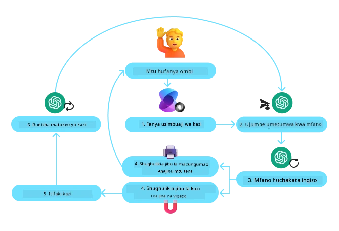
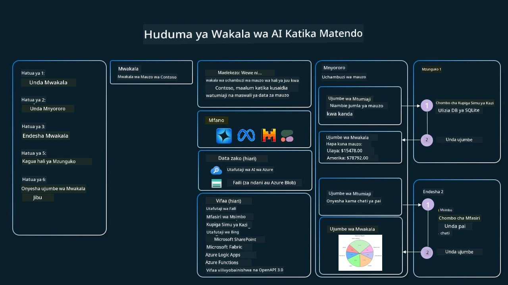

[](https://youtu.be/vieRiPRx-gI?si=cEZ8ApnT6Sus9rhn)

> _(Bonyeza picha hapo juu kuangalia video ya somo hili)_

# Mfano wa Kubuni Matumizi ya Zana

Zana ni za kuvutia kwa sababu zinamwezesha wakala wa AI kuwa na uwezo mpana zaidi. Badala ya wakala kuwa na seti ndogo ya vitendo anavyoweza kufanya, kwa kuongezea zana, wakala sasa anaweza kufanya vitendo vingi. Katika sura hii, tutaangalia Mfano wa Kubuni Matumizi ya Zana, unaoelezea jinsi wakala wa AI wanavyoweza kutumia zana maalum kufikia malengo yao.

## Utangulizi

Katika somo hili, tunatafuta kujibu maswali yafuatayo:

- Mfano wa kubuni matumizi ya zana ni nini?
- Nini matumizi yanayoweza kutumika?
- Nani vipengele/vinara vinavyohitajika kutekeleza mfano wa kubuni?
- Ni mambo gani maalum yanayohitajika wakati wa kutumia Mfano wa Kubuni Matumizi ya Zana kujenga wakala wa AI wa kuaminika?

## Malengo ya Kujifunza

Baada ya kumaliza somo hili, utaweza:

- Elezea Mfano wa Kubuni Matumizi ya Zana na kusudi lake.
- Tambua matumizi yanayoweza kutumika kwa Mfano wa Kubuni Matumizi ya Zana.
- Elewa vipengele muhimu vinavyohitajika kutekeleza mfano huo.
- Tambua mambo yanayohitajika ili kuhakikisha kuaminika kwa wakala wa AI wanaotumia mfano huu.

## Mfano wa Kubuni Matumizi ya Zana ni Nini?

**Mfano wa Kubuni Matumizi ya Zana** unalenga kuwapa LLM uwezo wa kuingiliana na zana za nje kufanikisha malengo maalum. Zana ni msimbo unaoweza kutekelezwa na wakala kufanya vitendo. Zana inaweza kuwa kazi rahisi kama kalkuleta, au wito wa API kwa huduma ya mtu wa tatu kama utafutaji wa bei za hisa au utabiri wa hali ya hewa. Katika muktadha wa wakala wa AI, zana zimeundwa kutekelezwa na wakala kutegemea **miito ya kazi inayotokana na mfano**.

## Nini matumizi yanayoweza kutumika?

Wakala wa AI wanaweza kutumia zana kukamilisha kazi ngumu, kupata taarifa, au kufanya maamuzi. Mfano wa kutumia zana hutumika sana katika hali zinazoahitaji mwingiliano wa moja kwa moja na mifumo ya nje, kama vile hifadhidata, huduma za wavuti, au watafsiri wa msimbo. Uwezo huu ni muhimu kwa matumizi mbalimbali ikiwa ni pamoja na:

- **Kupata Taarifa kwa Muda Halisi:** Wakala wanaweza kuuliza API za nje au hifadhidata kupata data ya sasa (mfano, kuuliza hifadhidata ya SQLite kwa uchambuzi wa data, kupata bei za hisa au taarifa za hali ya hewa).
- **Utekelezaji na Tafsiri ya Msimbo:** Wakala wanaweza kutekeleza msimbo au skripti kutatua matatizo ya kihisabati, kuzalisha ripoti, au kufanya majaribio.
- **Uendeshaji Mwamko wa Kazi:** Kuendesha kwa otomatiki au mfululizo wa kazi zinazojirudia kwa kuunganisha zana kama ratiba za kazi, huduma za barua pepe, au vyanzo vya data.
- **Msaada kwa Wateja:** Wakala wanaweza kuingiliana na mfumo wa CRM, majukwaa ya tiketi, au hifadhidata za maarifa kutatua maswali ya watumiaji.
- **Uundaji na Uhariri wa Maudhui:** Wakala wanaweza kutumia zana kama wakaguzi wa sarufi, mufupishaji maandishi, au wakaguzi wa usalama wa maudhui kusaidia kazi za uundaji wa maudhui.

## Nani vipengele vinavyohitajika kutekeleza mfano wa kutumia zana?

Vipengele hivi vinamwezesha wakala wa AI kufanya kazi mbalimbali. Tazama vipengele muhimu vinavyohitajika kutekeleza Mfano wa Kubuni Matumizi ya Zana:

- **Mifano ya Kazi/Zana**: Maelezo ya kina ya zana zinazopatikana, ikiwa ni pamoja na jina la kazi, kusudi, vigezo vinavyohitajika, na matokeo yanayotarajiwa. Mifano hii inamwezesha LLM kuelewa zana zilizopo na jinsi ya kuunda maombi halali.

- **Mantiki ya Utekelezaji wa Kazi**: Inaongoza jinsi na lini zana zitaitwa kulingana na nia ya mtumiaji na muktadha wa mazungumzo. Hii inaweza kujumuisha moduli za mipango, mifumo ya uelekeo, au milolongo ya masharti inayobainisha matumizi ya zana kwa ufanisi.

- **Mfumo wa Usimamizi wa Ujumbe**: Vipengele vinavyoendesha mtiririko wa mazungumzo kati ya maingizo ya mtumiaji, majibu ya LLM, miito ya zana, na matokeo ya zana.

- **Mfumo wa Uunganishaji wa Zana**: Miundombinu inayounganisha wakala na zana mbalimbali, iwe kazi rahisi au huduma ngumu za nje.

- **Usimamizi wa Makosa & Uthibitishaji**: Vifaa vya kushughulikia kushindwa katika utekelezaji wa zana, kuthibitisha vigezo, na kusimamia majibu yasiyotegemewa.

- **Usimamizi wa Hali**: Inafuata muktadha wa mazungumzo, mwingiliano wa awali wa zana, na data endelevu kuhakikisha uthabiti kati ya mazungumzo ya mfululizo.

Sasa, tutaangalia kwa undani zaidi Kuitwa kwa Kazi/Zana.
 
### Kuitwa kwa Kazi/Zana

Kuitwa kwa kazi ni njia kuu tunayowezesha Modeli Kubwa za Lugha (LLMs) kuingiliana na zana. Mara nyingi utaona 'Kazi' na 'Zana' zikitumiwa kwa njia mbadala kwa sababu 'kazi' (vipande vya msimbo vinavyoweza kutumika tena) ni 'zana' wanazotumia wakala kutekeleza kazi. Ili msimbo wa kazi uitwe, LLM lazima ilinganisha ombi la mtumiaji na maelezo ya kazi. Ili kufanya hili, skimu inayojumuisha maelezo ya kazi zote zinazopatikana hutitwa kwa LLM. LLM kisha huchagua kazi inayofaa zaidi kwa kazi na kuirudisha jina na hoja zake. Kazi iliyochaguliwa huitwa, jibu lake hurudishwa kwa LLM, ambayo hutumia habari hiyo kutoa jibu kwa ombi la mtumiaji.

Kwa waendelezaji kutekeleza kuitwa kwa kazi kwa wakala, utahitaji:

1. Mfano wa LLM unaounga mkono kuitwa kwa kazi
2. Skimu inayojumuisha maelezo ya kazi
3. Msimbo wa kila kazi iliyoelezwa

Tuchukue mfano wa kupata saa ya sasa katika mji kuonyesha:

1. **anzisha LLM inayounga mkono kuitwa kwa kazi:**

    Sio mifano yote inaunga mkono kuitwa kwa kazi, hivyo ni muhimu kuhakikisha kuwa LLM unayotumia inaunganisha hili. <a href="https://learn.microsoft.com/azure/ai-services/openai/how-to/function-calling" target="_blank">Azure OpenAI</a> inaunga mkono kuitwa kwa kazi. Tunaweza kuanza kwa kuanzisha mteja wa OpenAI dhidi ya API ya Azure OpenAI **Responses** (kiunganishi imara `/openai/v1/` — haina `api_version` inahitajika).

    ```python
    # Anzisha mteja wa OpenAI kwa ajili ya Azure OpenAI (API ya Majibu, kiunganishi cha v1)
    client = OpenAI(
        base_url=f"{os.environ['AZURE_OPENAI_ENDPOINT'].rstrip('/')}/openai/v1/",
        api_key=os.environ["AZURE_OPENAI_API_KEY"],
    )
    deployment_name = os.environ["AZURE_OPENAI_DEPLOYMENT"]
    ```

1. **Tengeneza Skimu ya Kazi**:

    Ifuatayo tutaelezea skimu ya JSON inayojumuisha jina la kazi, maelezo ya kile kazi inachofanya, na majina na maelezo ya vigezo vya kazi.
    Kisha tutapeleka skimu hii kwa mteja aliyeanzishwa awali, pamoja na ombi la mtumiaji la kupata saa San Francisco. Kile muhimu ni kwamba **wito wa zana** ndio hurudishwa, **si** jibu la mwisho la swali. Kama ilivyotajwa awali, LLM hurejesha jina la kazi aliyoichagua kwa kazi, na hoja zitakazotumiwa.

    ```python
    # Maelezo ya kazi kwa mfano kusoma (Muundo wa zana za API za Majibu)
    tools = [
        {
            "type": "function",
            "name": "get_current_time",
            "description": "Get the current time in a given location",
            "parameters": {
                "type": "object",
                "properties": {
                    "location": {
                        "type": "string",
                        "description": "The city name, e.g. San Francisco",
                    },
                },
                "required": ["location"],
            },
        }
    ]
    ```
   
    ```python
  
    # Ujumbe wa mwanzo wa mtumiaji
    messages = [{"role": "user", "content": "What's the current time in San Francisco"}]

    # Mwito wa kwanza wa API: Muulize mfano kutumia kipengee cha kazi
    response = client.responses.create(
        model=deployment_name,
        input=messages,
        tools=tools,
        tool_choice="auto",
        store=False,
    )

    # API ya Majibu hurudisha mwito wa zana kama vipengee vya function_call katika response.output.
    # Viambatisho kwa mazungumzo ili mfano uwe na muktadha kamili kwenye zamu inayofuata.
    messages += response.output

    print("Model's response:")
    print(response.output)
  
    ```

    ```bash
    Model's response:
    [ResponseFunctionToolCall(arguments='{"location":"San Francisco"}', call_id='call_pOsKdUlqvdyttYB67MOj434b', name='get_current_time', type='function_call')]
    ```
  
1. **Msimbo wa kazi unaohitajika kutekeleza kazi:**

    Sasa LLM imechagua kazi inayotakiwa kuendeshwa, msimbo unaotekeleza kazi hii unahitajika kutekelezwa.
    Tunaweza kuandika msimbo wa kupata saa ya sasa kwa Python. Pia tutahitaji kuandika msimbo wa kutoa jina na hoja kutoka kwa response_message kupata matokeo ya mwisho.

    ```python
      def get_current_time(location):
        """Get the current time for a given location"""
        print(f"get_current_time called with location: {location}")  
        location_lower = location.lower()
        
        for key, timezone in TIMEZONE_DATA.items():
            if key in location_lower:
                print(f"Timezone found for {key}")  
                current_time = datetime.now(ZoneInfo(timezone)).strftime("%I:%M %p")
                return json.dumps({
                    "location": location,
                    "current_time": current_time
                })
      
        print(f"No timezone data found for {location_lower}")  
        return json.dumps({"location": location, "current_time": "unknown"})
    ```

     ```python
    # Shughulikia simu za kazi
    tool_calls = [item for item in response.output if item.type == "function_call"]
    if tool_calls:
        for tool_call in tool_calls:
            if tool_call.name == "get_current_time":

                function_args = json.loads(tool_call.arguments)

                time_response = get_current_time(
                    location=function_args.get("location")
                )

                # Rejesha matokeo ya zana kama kipengee cha function_call_output
                messages.append({
                    "type": "function_call_output",
                    "call_id": tool_call.call_id,
                    "output": time_response,
                })
    else:
        print("No tool calls were made by the model.")

    # Simu ya pili ya API: Pata majibu ya mwisho kutoka kwa modeli
    final_response = client.responses.create(
        model=deployment_name,
        input=messages,
        tools=tools,
        store=False,
    )

    return final_response.output_text
     ```

     ```bash
      get_current_time called with location: San Francisco
      Timezone found for san francisco
      The current time in San Francisco is 09:24 AM.
     ```

Kuitwa kwa Kazi ni moyo wa modeli nyingi za matumizi ya zana kwa wakala, hata hivyo kutekeleza kutoka mwanzo unaweza kuwa changamoto mara nyingine.
Kama tulivyojifunza katika [Somo la 2](../../../02-explore-agentic-frameworks) mifumo ya wakala hutoa vipande vya awali vyenye kujengwa tayari kutekeleza matumizi ya zana.
 
## Mifano ya Matumizi ya Zana na Mifumo ya Wakala

Hapa kuna baadhi ya mifano ya jinsi unaweza kutekeleza Mfano wa Kubuni Matumizi ya Zana kwa kutumia mifumo mbalimbali ya wakala:

### Mfumo wa Wakala wa Microsoft

<a href="https://learn.microsoft.com/azure/ai-services/agents/overview" target="_blank">Microsoft Agent Framework</a> ni mfumo wa AI wa chanzo wazi wa kuunda wakala wa AI. Unarahisisha mchakato wa kutumia kuitwa kwa kazi kwa kuruhusu ueleze zana kama kazi za Python zilizo na leka `@tool`. Mfumo unashughulikia mawasiliano yanayotokea kati ya mfano na msimbo wako. Pia unatoa upatikanaji wa zana zilizojengwa kama Utafutaji Faili na Mtafsiri wa Msimbo kupitia `FoundryChatClient`.

Mchoro ufuatao unaonyesha mchakato wa kuitwa kwa kazi kwa Mfumo wa Wakala wa Microsoft:



Katika Mfumo wa Wakala wa Microsoft, zana zameelezwa kama kazi zilizo leka. Tunaweza kubadilisha kazi `get_current_time` tuliyoiona hapo awali kuwa zana kwa kutumia leka `@tool`. Mfumo utaanda moja kwa moja serialization ya kazi na vigezo vyake, ukiunda skimu itakayotumwa kwa LLM.

```python
import os
from agent_framework import tool
from agent_framework.foundry import FoundryChatClient
from azure.identity import AzureCliCredential

@tool(approval_mode="never_require")
def get_current_time(location: str) -> str:
    """Get the current time for a given location"""
    ...

# Unda mteja
provider = FoundryChatClient(
    project_endpoint=os.environ["AZURE_AI_PROJECT_ENDPOINT"],
    model=os.environ["AZURE_AI_MODEL_DEPLOYMENT_NAME"],
    credential=AzureCliCredential(),
)

# Unda wakala na uendeshe na chombo hicho
agent = provider.as_agent(name="TimeAgent", instructions="Use available tools to answer questions.", tools=get_current_time)
response = await agent.run("What time is it?")
```
  
### Huduma ya Wakala wa Microsoft Foundry

<a href="https://learn.microsoft.com/azure/ai-services/agents/overview" target="_blank">Huduma ya Wakala wa Microsoft Foundry</a> ni mfumo mpya wa wakala uliobuniwa kuwasaidia waendelezaji kujenga kwa usalama, kupeleka, na kupanua wakala wa AI wenye ubora wa juu, bila hitaji la kusimamia rasilimali za msingi za kompyuta na uhifadhi. Inafaa kwa matumizi ya biashara hasa kwa kuwa ni huduma iliyosimamiwa kikamilifu na usalama wa viwango vya biashara.

Ikiwa ikilinganishwa na maendeleo ya moja kwa moja kwa API ya LLM, Huduma ya Wakala wa Microsoft Foundry inatoa faida kadhaa, ikiwa ni pamoja na:

- Kuitwa kwa zana kiotomatiki – hakuna haja ya kuchambua wito wa zana, kuitisha zana, na kushughulikia jibu; yote haya hufanyika sasa upande wa seva
- Usimamizi salama wa data – badala ya kusimamia hali ya mazungumzo yako, unaweza kutegemea threads kuhifadhi taarifa zote unazohitaji
- Zana za tayari – Zana unazoweza kutumia kuingiliana na vyanzo vyako vya data, kama Bing, Azure AI Search, na Azure Functions.

Zana zinazopatikana katika Huduma ya Wakala wa Microsoft Foundry zinaweza kugawanyika katika makundi mawili:

1. Zana za Maarifa:
    - <a href="https://learn.microsoft.com/azure/ai-services/agents/how-to/tools/bing-grounding?tabs=python&pivots=overview" target="_blank">Ushikaji na Bing Search</a>
    - <a href="https://learn.microsoft.com/azure/ai-services/agents/how-to/tools/file-search?tabs=python&pivots=overview" target="_blank">Utafutaji Faili</a>
    - <a href="https://learn.microsoft.com/azure/ai-services/agents/how-to/tools/azure-ai-search?tabs=azurecli%2Cpython&pivots=overview-azure-ai-search" target="_blank">Azure AI Search</a>

2. Zana za Vitendo:
    - <a href="https://learn.microsoft.com/azure/ai-services/agents/how-to/tools/function-calling?tabs=python&pivots=overview" target="_blank">Kuitwa kwa Kazi</a>
    - <a href="https://learn.microsoft.com/azure/ai-services/agents/how-to/tools/code-interpreter?tabs=python&pivots=overview" target="_blank">Mtafsiri wa Msimbo</a>
    - <a href="https://learn.microsoft.com/azure/ai-services/agents/how-to/tools/openapi-spec?tabs=python&pivots=overview" target="_blank">Zana zilizoainishwa kwa OpenAPI</a>
    - <a href="https://learn.microsoft.com/azure/ai-services/agents/how-to/tools/azure-functions?pivots=overview" target="_blank">Azure Functions</a>

Huduma ya Wakala inaturuhusu kutumia zana hizi pamoja kama `toolset`. Pia hutumia `threads` ambazo husimamia historia ya ujumbe kutoka mazungumzo fulani.

Fikiria wewe ni wakala wa mauzo katika kampuni inayoitwa Contoso. Unataka kuunda wakala wa mazungumzo unaoweza kujibu maswali kuhusu data za mauzo yako.

Picha ifuatayo inaonyesha jinsi unavyoweza kutumia Huduma ya Wakala wa Microsoft Foundry kuchambua data zako za mauzo:



Ili kutumia zana yoyote ya hizi na huduma tunaweza kuunda mteja na kuainisha zana au seti ya zana. Kutekeleza hivi kiutendaji tunaweza kutumia msimbo wa Python uliofuata. LLM itakuwa na uwezo wa kuangalia seti ya zana na kuamua kutumia kazi aliyotengeneza mtumiaji, `fetch_sales_data_using_sqlite_query`, au Mtafsiri wa Msimbo alioanzishwa awali kulingana na ombi la mtumiaji.

```python 
import os
from azure.ai.projects import AIProjectClient
from azure.identity import DefaultAzureCredential
from fetch_sales_data_functions import fetch_sales_data_using_sqlite_query # kazi ya fetch_sales_data_using_sqlite_query ambayo inaweza kupatikana katika faili la fetch_sales_data_functions.py.
from azure.ai.projects.models import ToolSet, FunctionTool, CodeInterpreterTool

project_client = AIProjectClient.from_connection_string(
    credential=DefaultAzureCredential(),
    conn_str=os.environ["PROJECT_CONNECTION_STRING"],
)

# Anzisha seti ya zana
toolset = ToolSet()

# Anzisha wakala wa kuita kazi na kazi ya fetch_sales_data_using_sqlite_query na kuiweka kwenye seti ya zana
fetch_data_function = FunctionTool(fetch_sales_data_using_sqlite_query)
toolset.add(fetch_data_function)

# Anzisha zana ya Mfasiri wa Msimbo na kuiweka kwenye seti ya zana.
code_interpreter = CodeInterpreterTool()toolset.add(code_interpreter)

agent = project_client.agents.create_agent(
    model="gpt-4o-mini", name="my-agent", instructions="You are helpful agent", 
    toolset=toolset
)
```

## Ni maelezo gani maalum yanayohitajika wakati wa kutumia Mfano wa Kubuni Matumizi ya Zana kujenga wakala wa AI wa kuaminika?

Wasiwasi wa kawaida kuhusu SQL inayoundwa moja kwa moja na LLM ni usalama, hasa hatari ya kuingizwa kwa SQL au vitendo vibaya, kama kuondoa au kuharibu hifadhidata. Ingawa wasiwasi huu ni halali, unaweza kudhibitiwa vizuri kwa kusanidi vibali vya ufikiaji wa hifadhidata ipasavyo. Kwa hifadhidata nyingi hii inahusisha kusanidi hifadhidata kama ya kusoma tu. Kwa huduma za hifadhidata kama PostgreSQL au Azure SQL, app inapaswa kupewa nafasi ya kusoma tu (SELECT).

Kuendesha app katika mazingira salama huongeza ulinzi zaidi. Katika hali za biashara, data kwa kawaida hutolewa na kubadilishwa kutoka kwa mifumo ya uendeshaji kwenda kwenye hifadhidata ya kusoma tu au ghala la data lenye skimu rahisi kwa mtumiaji. Njia hii inahakikisha data iko salama, imeboreshwa kwa utendaji na upatikanaji, na app ina upatikanaji wa kusoma tu uliopunguzwa.

## Mifano ya Msimbo

- Python: [Mfumo wa Wakala](./code_samples/04-python-agent-framework.ipynb)
- .NET: [Mfumo wa Wakala](./code_samples/04-dotnet-agent-framework.md)

## Una Maswali Zaidi Kuhusu Mifano ya Kubuni Matumizi ya Zana?

Jiunge na [Microsoft Foundry Discord](https://discord.com/invite/ATgtXmAS5D) ili kukutana na wanafunzi wengine, kuhudhuria saa za ofisi na kupata majibu kwa maswali yako ya Wakala wa AI.

## Rasilimali Zaidi

- <a href="https://microsoft.github.io/build-your-first-agent-with-azure-ai-agent-service-workshop/" target="_blank">Warsha ya Huduma za Wakala wa Azure AI</a>
- <a href="https://github.com/Azure-Samples/contoso-creative-writer/tree/main/docs/workshop" target="_blank">Warsha ya Waandikaji Wanaojumuisha Multi-Agent wa Contoso</a>
- <a href="https://learn.microsoft.com/azure/ai-services/agents/overview" target="_blank">Muhtasari wa Mfumo wa Wakala wa Microsoft</a>


## Somo lililopita

[Kuelewa Mifumo ya Muundo ya Agentic](../03-agentic-design-patterns/README.md)

## Somo lijalo

[Agentic RAG](../05-agentic-rag/README.md)

---

<!-- CO-OP TRANSLATOR DISCLAIMER START -->
**Kionyozo**:
Hati hii imetafsiriwa kwa kutumia huduma ya tafsiri ya AI [Co-op Translator](https://github.com/Azure/co-op-translator). Ingawa tunajitahidi kupata usahihi, tafadhali fahamu kwamba tafsiri za kiotomatiki zinaweza kuwa na makosa au upungufu wa usahihi. Hati ya asili katika lugha yake halisi inapaswa kuchukuliwa kama chanzo cha mamlaka. Kwa taarifa muhimu, tafsiri ya kitaalamu inayofanywa na binadamu inapendekezwa. Hatutojibu kwa kuelewa vibaya au tafsiri potofu zinazotokea kutokana na matumizi ya tafsiri hii.
<!-- CO-OP TRANSLATOR DISCLAIMER END -->