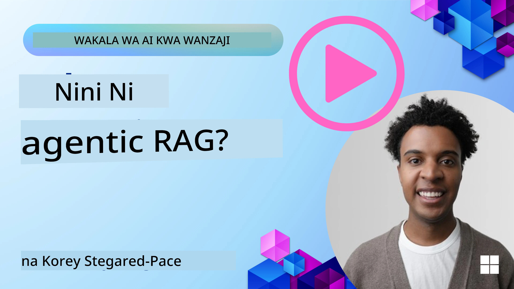
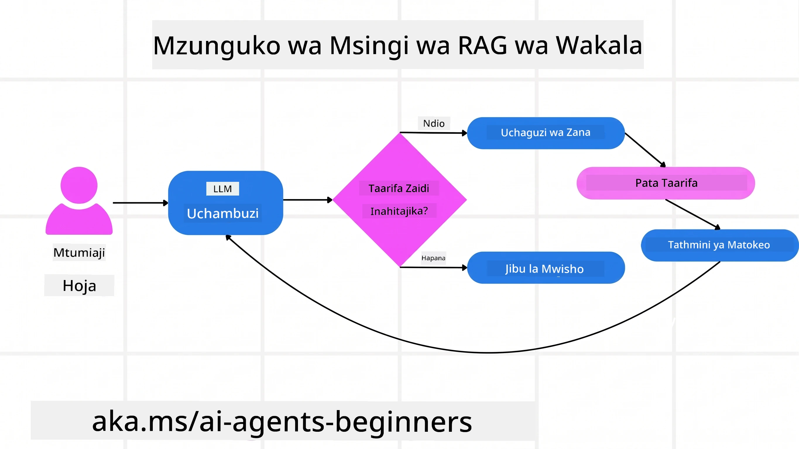
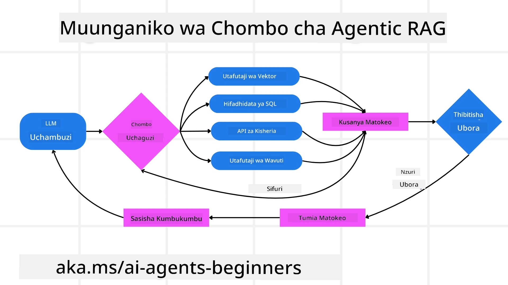
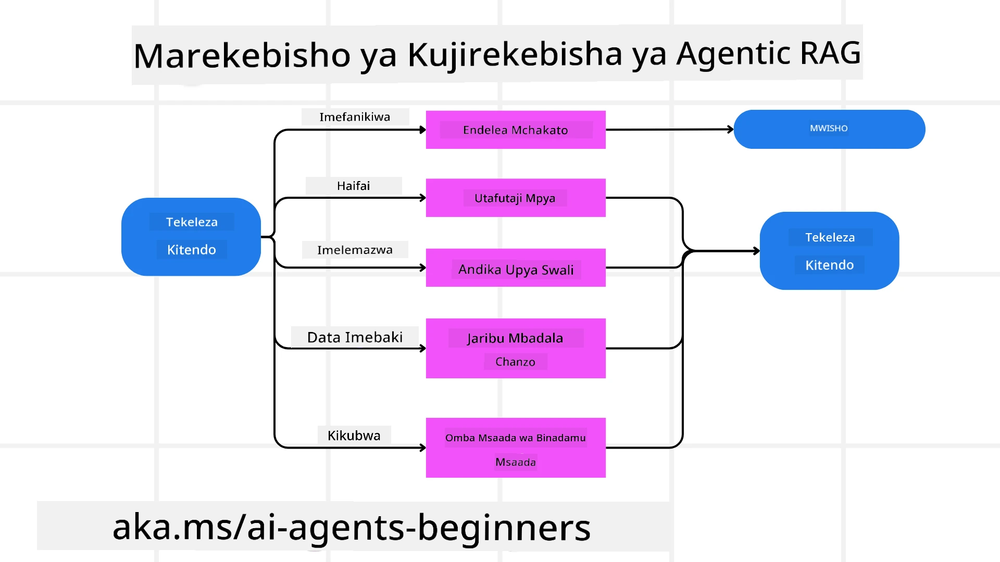
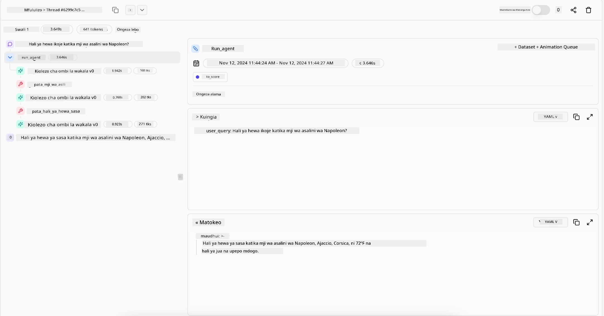

> _(Bonyeza picha hapo juu kuona video ya somo hili)_

# Agentic RAG

Somo hili linatoa muhtasari wa kina kuhusu Agentic Retrieval-Augmented Generation (Agentic RAG), mfadhaiko mpya wa AI ambapo mifano mikubwa ya lugha (LLMs) huandaa hatua zao zinazofuata kwa kujitegemea huku ikichukua taarifa kutoka kwa vyanzo vya nje. Tofauti na mifumo ya kawaida ya kupata kisha kusoma, Agentic RAG inahusisha miito ya kurudia kwa LLM, ikichanganywa na miito ya zana au kazi na matokeo yaliyopangiliwa. Mfumo huu hupima matokeo, huboresha maswali, huita zana za ziada kama zinahitajika, na huendelea na mzunguko huu hadi ufumbuzi unaoridhisha upatikane.

## Utangulizi

Somo hili litajumuisha

- **Kuelewa Agentic RAG:** Jifunza kuhusu mfadhaiko mpya wa AI ambapo mifano mikubwa ya lugha (LLMs) huandaa hatua zao zinazofuata kwa kujitegemea huku ikichukua taarifa kutoka kwa vyanzo vya data vya nje.
- **Kushika Mtindo wa Maker-Checker wa Kurudia:** Elewa mzunguko wa miito ya kurudia kwa LLM, ikichanganywa na miito ya zana au kazi na matokeo yaliyopangiliwa, yaliyobuniwa kuboresha usahihi na kushughulikia maswali yaliyopotoshwa.
- **Gundua Matumizi Halisi:** Tambua mazingira ambapo Agentic RAG huangaza, kama vile mazingira yanayolenga usahihi, mwingiliano mgumu wa hifadhidata, na mitiririko ya kazi iliyoongezwa.

## Malengo ya Kujifunza

Baada ya kumaliza somo hili, utajua jinsi ya/kuelewa:

- **Kuelewa Agentic RAG:** Jifunza kuhusu mfadhaiko mpya wa AI ambapo mifano mikubwa ya lugha (LLMs) huandaa hatua zao zinazofuata kwa kujitegemea huku ikichukua taarifa kutoka kwa vyanzo vya data vya nje.
- **Mtindo wa Maker-Checker wa Kurudia:** Elewa dhana ya mzunguko wa miito ya kurudia kwa LLM, ikichanganywa na miito ya zana au kazi na matokeo yaliyopangiliwa, yaliyobuniwa kuboresha usahihi na kushughulikia maswali yaliyopotoshwa.
- **Kumiliki Mchakato wa Kuelewa:** Elewa uwezo wa mfumo wa kumiliki mchakato wake wa kufikiria, kufanya maamuzi juu ya jinsi ya kushughulikia matatizo bila kutegemea njia zilizotangazwa awali.
- **Mitiririko ya Kazi:** Elewa jinsi mfano agentic hutenga kwa kujitegemea kurejesha ripoti za mwenendo wa soko, kubaini data za washindani, kuunganisha vipimo vya mauzo vya ndani, kuunganisha matokeo, na kutathmini mkakati.
- **Mizunguko ya Kurudia, Ushirikiano wa Zana, na Kumbukumbu:** Jifunza kuhusu utegemezi wa mfumo kwenye muundo wa mizunguko ya mwingiliano, kudumisha hali na kumbukumbu katika hatua zote ili kuepuka mizunguko ya kurudia na kufanya maamuzi yenye taarifa.
- **Kushughulikia Aina za Kushindwa na Marekebisho ya Kila Siku:** Gundua mifumo imara ya mfumo wa kujirekebisha, ikiwa ni pamoja na kurudia na kuuliza tena, kutumia zana za uchambuzi, na kutegemea uangalizi wa binadamu.
- **Mipaka ya Wakala:** Elewa vikwazo vya Agentic RAG, ikizingatia uhuru wa maeneo maalum, utegemezi wa miundombinu, na kuheshimu kanuni.
- **Matumizi Halisi na Thamani:** Tambua mazingira ambapo Agentic RAG huangaza, kama vile mazingira yanayolenga usahihi, mwingiliano mgumu wa hifadhidata, na mitiririko ya kazi iliyoongezwa.
- **Uongozi, Uwajibikaji, na Uaminifu:** Jifunza kuhusu umuhimu wa uongozi na uwazi, ikiwa ni pamoja na mantiki inayoweza kueleweka, udhibiti wa upendeleo, na uangalizi wa binadamu.

## Agentic RAG ni Nini?

Agentic Retrieval-Augmented Generation (Agentic RAG) ni mfadhaiko mpya wa AI ambapo mifano mikubwa ya lugha (LLMs) huandaa kwa kujitegemea hatua zao zinazofuata huku ikichukua taarifa kutoka kwa vyanzo vya nje. Tofauti na mifumo ya kawaida ya kupata kisha kusoma, Agentic RAG inahusisha miito ya kurudia kwa LLM, ikichanganywa na miito ya zana au kazi na matokeo yaliyopangiliwa. Mfumo huu hupima matokeo, huboresha maswali, huita zana za ziada kama zinahitajika, na huendelea na mzunguko huu hadi ufumbuzi unaoridhisha upatikane. Mtindo huu wa "maker-checker" wa kurudia huboresha usahihi, hushughulikia maswali yaliyopotoshwa, na kuhakikisha matokeo ya ubora wa juu.

Mfumo huu unamiliki mchakato wake wa kufikiria, kuandika upya maswali yaliyoshindikana, kuchagua mbinu tofauti za kupata taarifa, na kuunganisha zana nyingi—kama vile utafutaji wa vector katika Azure AI Search, hifadhidata za SQL, au API zilizobinafsishwa—kabla ya kumaliza jibu lake. Sifa ya kipekee ya mfumo wa agentic ni uwezo wake wa kumiliki mchakato wake wa kufikiria. Utekelezaji wa RAG za jadi hutegemea njia zilizotangazwa awali, lakini mfumo wa agentic huamua kwa kujitegemea mfululizo wa hatua kulingana na ubora wa taarifa inayopatikana.

## Kufafanua Agentic Retrieval-Augmented Generation (Agentic RAG)

Agentic Retrieval-Augmented Generation (Agentic RAG) ni mfadhaiko mpya katika maendeleo ya AI ambapo LLMs si tu hukusanya taarifa kutoka kwa vyanzo vya data vya nje bali pia huandaa hatua zao zinazofuata kwa kujitegemea. Tofauti na mifumo ya kawaida ya kupata kisha kusoma au mfululizo wa maagizo yaliyopangwa kwa uangalifu, Agentic RAG inahusisha mzunguko wa miito ya kurudia kwa LLM, ikichanganywa na miito ya zana au kazi na matokeo yaliyopangiliwa. Kila mara, mfumo hupima matokeo aliyopata, huamua kama kuboresha maswali, huita zana za ziada kama zinahitajika, na huendelea na mzunguko huu hadi ufumbuzi unaoridhisha upatikane.

Mtindo huu wa “maker-checker” wa kurudia umebuniwa kuboresha usahihi, kushughulikia maswali yaliyopotoshwa kwa hifadhidata zilizo na muundo (mfano NL2SQL), na kuhakikisha matokeo yaliyobalansiwa, yakiwa na ubora wa juu. Badala ya kutegemea minyororo ya maagizo iliyoandaliwa kwa uangalifu, mfumo unamiliki mchakato wake wa kufikiria kwa makusudi. Unaweza kuandika upya maswali yanayoshindwa, kuchagua mbinu tofauti za kupata taarifa, na kuunganisha zana nyingi—kama vile utafutaji wa vector katika Azure AI Search, hifadhidata za SQL, au API zilizobinafsishwa—kabla ya kumaliza jibu lake. Hii huondoa haja ya mifumo tata ya upangaji. Badala yake, mzunguko rahisi wa “miito ya LLM → matumizi ya zana → miito ya LLM → …” unaweza kutoa matokeo maridadi na yenye msingi mzuri.

## Kumiliki Mchakato wa Kuelewa

Kipengele kizuri kinachofanya mfumo kuwa “agentic” ni uwezo wake wa kumiliki mchakato wake wa kufikiria. Utekelezaji wa RAG wa jadi mara nyingi hutegemea binadamu kuweka njia kwa mfano: mnyororo wa mawazo unaoelezea nini cha kupata na lini.
Lakini wakati mfumo ni kweli agentic, huamua katika ndani jinsi ya kushughulikia tatizo. Sio tu kutekeleza maandishi; ni kujitegemea kuamua mfululizo wa hatua kulingana na ubora wa taarifa anayopata.
Kwa mfano, ikiwa utaombwa kuunda mkakati wa uzinduzi wa bidhaa, hategemei tu amri inayosema hela mchakato wa utafiti na maamuzi. Badala yake, mfano wa agentic huamua huru:

1. Kupata ripoti za mwenendo wa soko wa sasa kwa kutumia Bing Web Grounding
2. Kubaini data muhimu za washindani kwa kutumia Azure AI Search.
3. Kuunganisha vipimo vya mauzo vya kale vya ndani kwa kutumia Azure SQL Database.
4. Kuunganisha matokeo katika mkakati unaoambatana unaoratibiwa kupitia Azure OpenAI Service.
5. Kutathmini mkakati kwa ajili ya mapengo au kutokubaliana, na kuanzisha mzunguko mwingine wa kupata taarifa ikiwa ni lazima.
Hatua zote hizi—kuboresha maswali, kuchagua vyanzo, kurudia hadi kufikia “furaha” na jibu—hufanywa na mfano, sio kuandikwa awali na binadamu.

## Mizunguko ya Kurudia, Ushirikiano wa Zana, na Kumbukumbu

Mfumo wa agentic hutegemea muundo wa mwingiliano wa mizunguko:

- **Mwito wa Awali:** Lengo la mtumiaji (aka. maelekezo ya mtumiaji) hutolewa kwa LLM.
- **Utekelezaji wa Zana:** Ikiwa mfano unatambua taarifa zilizokosekana au maagizo yasiyoeleweka, huchagua zana au mbinu ya kupata taarifa—kama vile kuuliza hifadhidata za vector (mfano Azure AI Search Hybrid search juu ya data za kibinafsi) au maoni ya SQL yenye muundo–kukusanya muktadha zaidi.
- **Tathmini na Kuboreshwa:** Baada ya kupitia data iliyopatikana, mfano huamua kama taarifa ni za kutosha. Ikiwa si hivyo, huboresha swali, kujaribu zana tofauti, au kurekebisha mbinu yake.
- **Rudia Hadi Ufiridhike:** Mzunguko huu unaendelea hadi mfano utaamua kuwa na ufafanuzi na ushahidi wa kutosha kutoa jibu la mwisho, lililo na mantiki nzuri.
- **Kumbukumbu na Hali:** Kwa kuwa mfumo huhifadhi hali na kumbukumbu katika hatua zote, unaweza kukumbuka majaribio yaliyopita na matokeo yake, kuepuka mizunguko ya kurudia na kufanya maamuzi yenye taarifa zaidi wakati unaendelea.

Kwa muda, hili huunda hisia ya uelewa unaoendelea, kuruhusu mfano kuvinjari kazi tata za hatua nyingi bila hitaji la mtumiaji kuingilia au kubadilisha maelekezo kila mara.

## Kushughulikia Aina za Kushindwa na Kujirekebisha

Uhuru wa Agentic RAG pia unajumuisha mifumo imara ya kujirekebisha wenyewe. Wakati mfumo unakutana na mipaka—kama vile kupata nyaraka zisizohusiana au kukutana na maswali yaliyopotoshwa—unaweza:

- **Kurudia na Kuuliza Tena:** Badala ya kurudisha majibu ya thamani ya chini, mfano hujaribu mbinu mpya za utafutaji, kuandika upya maswali ya hifadhidata, au kuangalia seti tofauti za data.
- **Kutumia Zana za Uchambuzi:** Mfumo unaweza kuita kazi za ziada zilizobuniwa kusaidia kugundua vipaumbele vya kufikiria au kuthibitisha usahihi wa data iliyopatikana. Zana kama Azure AI Tracing zitakuwa muhimu kuwezesha uangalizi na kufuatilia yenye nguvu.
- **Kutegemea Uangalizi wa Binadamu:** Kwa hali zenye hatari kubwa au zinazoonyesha kushindwa kwa mara kwa mara, mfano unaweza kutaja kutokuwa na uhakika na kuomba mwongozo wa binadamu. Mara binadamu anapotoa maoni ya kurekebisha, mfano unaweza kujumuisha somo hilo kwa hatua zinazofuata.

Njia hii ya kurudia na yenye mabadiliko huruhusu mfano kuboresha mara kwa mara, kuhakikisha siyo mfumo wa mara moja tu bali unaojifunza kutokana na makosa wakati wa kikao.

## Mipaka ya Wakala

Licha ya uhuru wake ndani ya kazi, Agentic RAG sio sawa na Akili Zaidi za Jumla za Bandia (AGI). Uwezo wake wa “agentic” unahusu tu zana, vyanzo vya data, na sera zilizotolewa na waandaaji wa binadamu. Haiwezi kuumba zana zake au kutoka katika mipaka ya eneo iliyowekwa. Badala yake, hutawala kwa nguvu rasilimali zilizopo.
Tofauti kuu na aina za AI zilizo juu zaidi ni:

1. **Uhuru wa Maeneo Maalum:** Mifumo ya Agentic RAG inalenga kufanikisha malengo yaliyowekwa na mtumiaji ndani ya eneo lililo wazi, ikitumia mikakati kama uandishi upya wa maswali au uteuzi wa zana kuboresha matokeo.
2. **Utegemezi wa Miundombinu:** Uwezo wa mfumo unategemea zana na data zilizounganishwa na waandaaji. Haiwezi kuvuka mipaka hii bila uingiliaji wa binadamu.
3. **Heshima kwa Mipaka:** Miongozo ya kimaadili, sheria za uzingatiaji, na sera za biashara zinabakia muhimu sana. Uhuru wa wakala daima hupunguzwa na hatua za usalama na mifumo ya uangalizi (kwaheri?)

## Matumizi Halisi na Thamani

Agentic RAG huangaza katika matukio yanayohitaji maboresho ya mara kwa mara na usahihi:

1. **Mazingira Yanayolenga Usahihi:** Katika ukaguzi wa utekelezaji, uchambuzi wa kanuni, au utafiti wa kisheria, mfano wa agentic unaweza kuthibitisha ukweli mara kwa mara, kushauriana na vyanzo vingi, na kuandika upya maswali hadi apate jibu lililotathminiwa kikamilifu.
2. **Mwingiliano Migumu ya Hifadhidata:** Wakati wa kushughulikia data zilizo na muundo ambapo maswali yanaweza kushindwa mara kwa mara au yanahitaji marekebisho, mfumo unaweza kuboresha maswali yake kwa kujitegemea kutumia Azure SQL au Microsoft Fabric OneLake, kuhakikisha samunio la mwisho linaendana na nia ya mtumiaji.
3. **Mitiririko ya Kazi Iliyodumu Muda Mrefu:** Vikao vinavyoendelea vinaweza kubadilika kwa kuibuka kwa taarifa mpya. Agentic RAG inaweza kuendelea kuingiza data mpya, kubadilisha mikakati anapojifunza zaidi kuhusu tatizo.

## Uongozi, Uwajibikaji, na Uaminifu

Kadri mifumo hii inavyokuwa na uhuru zaidi katika kufikiria, uongozi na uwazi ni muhimu:

- **Mantiki Inayoweza Kueleweka:** Mfano unaweza kutoa rekodi ya maswali aliyoyafanya, vyanzo alivyoziangalia, na hatua za kufikiria alizochukua kufikia hitimisho. Zana kama Azure AI Content Safety na Azure AI Tracing / GenAIOps zinaweza kusaidia kudumisha uwazi na kupunguza hatari.
- **Udhibiti wa Upendeleo na Kupata Data Iliyo Balansi:** Waendelezaji wanaweza kurekebisha mikakati ya kupata taarifa kuhakikisha vyanzo vya data vinavyowakilisha na vilivyo sawasawa vinazingatiwa, na kwa kawaida kuangalia matokeo kugundua upendeleo au mifumo iliyo potovu kwa kutumia mifano maalum kwa mashirika ya sayansi ya data ya hali ya juu inayotumia Azure Machine Learning.
- **Uangalizi wa Binadamu na Uzingatiaji:** Kwa kazi nyeti, ukaguzi wa binadamu unabakia muhimu. Agentic RAG haiwezi kuchukua nafasi ya maamuzi ya binadamu katika maamuzi yenye hatari kubwa—ila huongeza kwa kutoa chaguzi zilizo hifadhiwa vizuri zaidi.

Kuwa na zana zinazotoa rekodi wazi ya vitendo ni muhimu. Bila hizo, kufuatilia mchakato wa hatua nyingi huweza kuwa vigumu sana. Tazama mfano ufuatao kutoka Literal AI (kampuni ya nyuma ya Chainlit) kwa Orodha ya Wakala:

## Hitimisho

Agentic RAG ni mabadiliko ya asili katika jinsi mifumo ya AI inavyoshughulikia kazi tata zinazoegemea data nyingi. Kwa kutumia muundo wa mwingiliano wa mizunguko, kuchagua zana kwa kujitegemea, na kuboresha maswali hadi kufikia matokeo ya ubora wa hali ya juu, mfumo huenda zaidi ya kufuata amri za mara moja kuwa mtendaji wa maamuzi unaojifunza na unaoelewa muktadha. Ingawa bado umefungwa na miundombinu iliyowekwa na binadamu na miongozo ya kimaadili, uwezo huu wa agentic unaruhusu mwingiliano wa AI wenye utajiri zaidi, wenye mienendo tofauti, na hatimaye wenye manufaa zaidi kwa mashirika na watumiaji wa mwisho.

### Una Maswali Zaidi kuhusu Agentic RAG?

Jiunge na [Microsoft Foundry Discord](https://discord.com/invite/ATgtXmAS5D) kukutana na wafuasi wengine, kuhudhuria saa za ofisi na kupata majibu ya maswali yako kuhusu Wakala wa AI.

## Rasilimali Zaidi

- <a href="https://learn.microsoft.com/training/modules/use-own-data-azure-openai" target="_blank">Tekeleza Retrieval Augmented Generation (RAG) na Azure OpenAI Service: Jifunze jinsi ya kutumia data yako mwenyewe na Azure OpenAI Service. Moduli hii ya Microsoft Learn inatoa mwongozo wa kina juu ya utekelezaji wa RAG</a>
- <a href="https://learn.microsoft.com/azure/ai-studio/concepts/evaluation-approach-gen-ai" target="_blank">Tathmini ya programu za AI zinazotengeneza na Microsoft Foundry: Makala hii inashughulikia tathmini na kulinganisha mifano kwenye seti za data zinazopatikana kwa umma, ikiwa ni pamoja na matumizi ya AI Agentic na usanifu wa RAG</a>
- <a href="https://weaviate.io/blog/what-is-agentic-rag" target="_blank">Agentic RAG ni Nini | Weaviate</a>
- <a href="https://ragaboutit.com/agentic-rag-a-complete-guide-to-agent-based-retrieval-augmented-generation/" target="_blank">Agentic RAG: Mwongozo Kamili kwa Uendelezaji wa Agent-Based Retrieval Augmented Generation – Habari kutoka kwa kizazi cha RAG</a>

- <a href="https://huggingface.co/learn/cookbook/agent_rag" target="_blank">Agentic RAG: ongeza kasi RAG yako kwa kurekebisha maswali na kuuliza mwenyewe! Kitabu cha Mapishi cha AI cha Hugging Face kilicho wazi</a>
- <a href="https://youtu.be/aQ4yQXeB1Ss?si=2HUqBzHoeB5tR04U" target="_blank">Kuongeza Tabaka za Agentic kwenye RAG</a>
- <a href="https://www.youtube.com/watch?v=zeAyuLc_f3Q&t=244s" target="_blank">Masaibu ya Wasaidizi wa Maarifa: Jerry Liu</a>
- <a href="https://www.youtube.com/watch?v=AOSjiXP1jmQ" target="_blank">Jinsi ya Kujenga Mifumo ya Agentic RAG</a>
- <a href="https://ignite.microsoft.com/sessions/BRK102?source=sessions" target="_blank">Kutumia Huduma ya Wakala ya Microsoft Foundry kuongeza ukubwa wa mawakala wako wa AI</a>

### Makala za Kitaaluma

- <a href="https://arxiv.org/abs/2303.17651" target="_blank">2303.17651 Kujiboresha Mwenyewe: Uboreshaji wa Kurudia kwa Kurejea Maoni Mwenyewe</a>
- <a href="https://arxiv.org/abs/2303.11366" target="_blank">2303.11366 Reflexion: Wakala wa Lugha na Kujifunza kwa Nguvu za Kinywa</a>
- <a href="https://arxiv.org/abs/2305.11738" target="_blank">2305.11738 CRITIC: Mifano Mikubwa ya Lugha Inaweza Kujirekebisha na Ukosoaji wa Kifaa</a>
- <a href="https://arxiv.org/abs/2501.09136" target="_blank">2501.09136 Uzalishaji wa Agentic Retrieval-Augmented: Utafiti kuhusu Agentic RAG</a>

## Somo la Awali

[Mfano wa Muundo wa Matumizi ya Vifaa](../04-tool-use/README.md)

## Somo Linalofuata

[Kujenga Wakala wa AI wa Kuaminika](../06-building-trustworthy-agents/README.md)

---

<!-- CO-OP TRANSLATOR DISCLAIMER START -->
**Kionyozo**:
Hati hii imetafsiriwa kwa kutumia huduma ya tafsiri ya AI [Co-op Translator](https://github.com/Azure/co-op-translator). Ingawa tunajitahidi kupata usahihi, tafadhali fahamu kwamba tafsiri za kiotomatiki zinaweza kuwa na makosa au upungufu wa usahihi. Hati ya asili katika lugha yake halisi inapaswa kuchukuliwa kama chanzo cha mamlaka. Kwa taarifa muhimu, tafsiri ya kitaalamu inayofanywa na binadamu inapendekezwa. Hatutojibu kwa kuelewa vibaya au tafsiri potofu zinazotokea kutokana na matumizi ya tafsiri hii.
<!-- CO-OP TRANSLATOR DISCLAIMER END -->