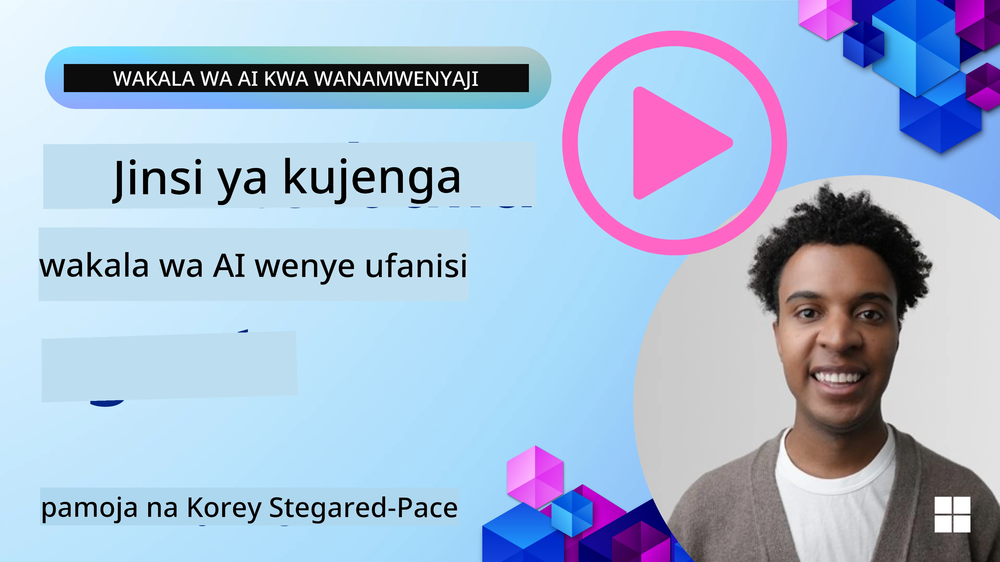
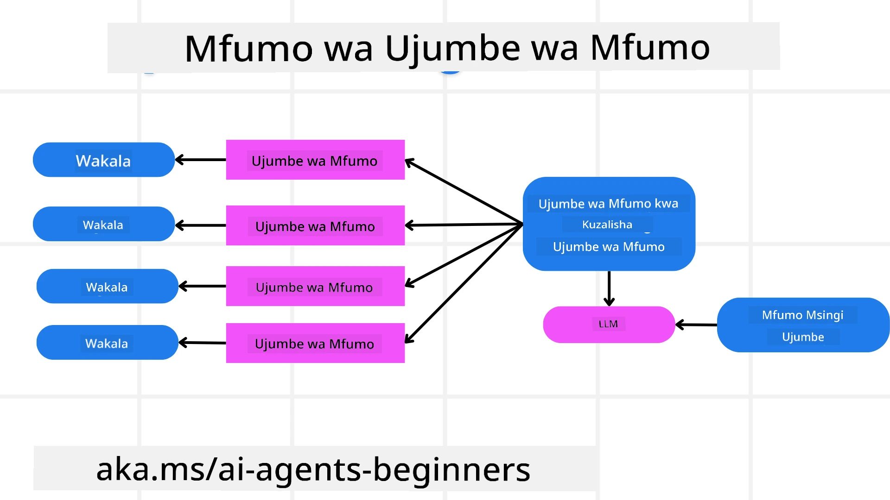
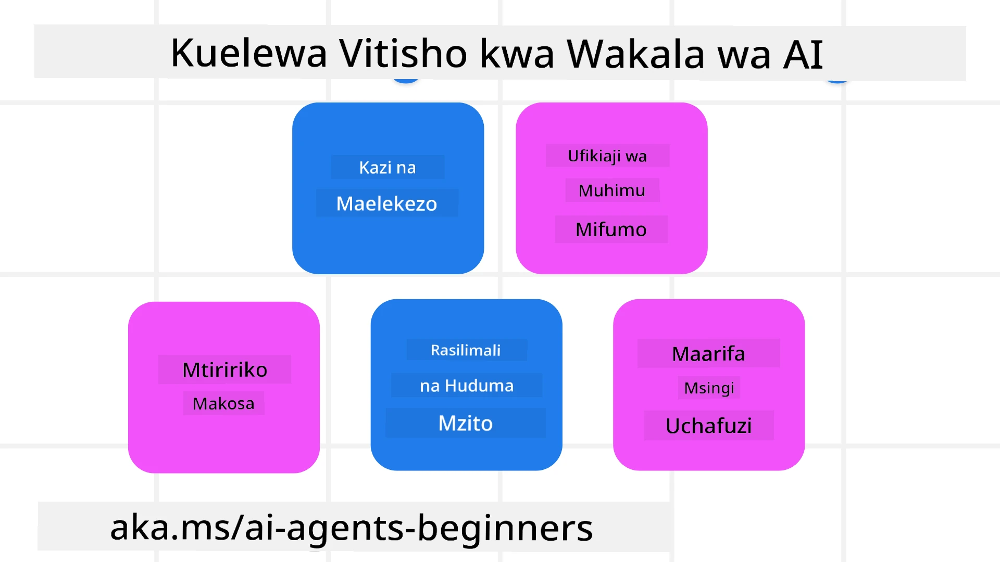
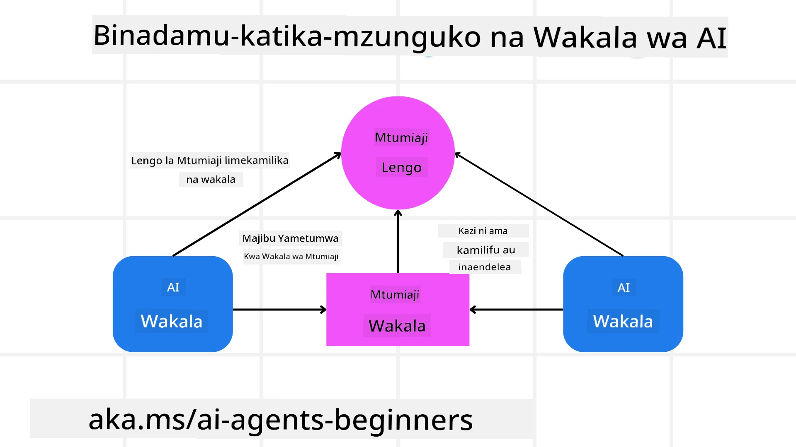

[](https://youtu.be/iZKkMEGBCUQ?si=Q-kEbcyHUMPoHp8L)

> _(Bonyeza picha hapo juu kutazama video ya somo hili)_

# Kujenga Wakala wa AI Wanaoaminika

## Utangulizi

Somo hili litajumuisha:

- Jinsi ya kujenga na kupeleka Wakala wa AI salama na wenye ufanisi
- Mawazo muhimu ya usalama wakati wa kuendeleza Wakala wa AI.
- Jinsi ya kudumisha faragha ya data na mtumiaji wakati wa kuendeleza Wakala wa AI.

## Malengo ya Kujifunza

Baada ya kukamilisha somo hili, utajua jinsi ya:

- Kutambua na kupunguza hatari wakati wa kuunda Wakala wa AI.
- Kutekeleza hatua za usalama kuhakikisha data na upatikanaji vinadhibitiwa ipasavyo.
- Kuunda Wakala wa AI ambao hudumisha faragha ya data na kutoa uzoefu mzuri kwa mtumiaji.

## Usalama

Hebu kwanza tazame jinsi ya kujenga programu za wakala salama. Usalama unamaanisha kwamba wakala wa AI hufanya kazi kama ilivyopangwa. Kama wajenzi wa programu za wakala, tuna mbinu na zana za kuongeza usalama:

### Kujenga Mfumo wa Ujumbe wa Mfumo

Ikiwa umewahi kujenga programu ya AI ukitumia Modeli Kubwa za Lugha (LLMs), unajua umuhimu wa kubuni chaguo thabiti la mfumo au ujumbe wa mfumo. Chaguo hizi zinaweka sheria kuu, maelekezo, na miongozo kuhusu jinsi LLM itakavyojihusisha na mtumiaji na data.

Kwa Wakala wa AI, chaguo la mfumo ni la muhimu zaidi kwani Wakala wa AI watahitaji maelekezo maalum sana kukamilisha kazi tulizobuni kwao.

Ili kuunda chaguo za mfumo zinazoweza kufanywa kwa kiwango kikubwa, tunaweza kutumia mfumo wa ujumbe wa mfumo kwa ajili ya kujenga wakala mmoja au zaidi katika programu yetu:



#### Hatua ya 1: Tengeneza Ujumbe wa Mfumo wa Meta

Chaguo la meta litumike na LLM kuunda chaguo za mfumo kwa wakala tunaowaumba. Tunabuni kama kiolezo ili tuweze kuunda wakala wengi kwa ufanisi ikiwa itahitajika.

Hapa kuna mfano wa ujumbe wa mfumo wa meta tungetoa kwa LLM:

```plaintext
You are an expert at creating AI agent assistants. 
You will be provided a company name, role, responsibilities and other
information that you will use to provide a system prompt for.
To create the system prompt, be descriptive as possible and provide a structure that a system using an LLM can better understand the role and responsibilities of the AI assistant. 
```

#### Hatua ya 2: Tengeneza chaguo la msingi

Hatua inayofuata ni kuunda chaguo la msingi kuelezea Wakala wa AI. Unapaswa kujumuisha jukumu la wakala, kazi ambazo wakala atakamilisha, na majukumu mengine ya wakala.

Hapa kuna mfano:

```plaintext
You are a travel agent for Contoso Travel that is great at booking flights for customers. To help customers you can perform the following tasks: lookup available flights, book flights, ask for preferences in seating and times for flights, cancel any previously booked flights and alert customers on any delays or cancellations of flights.  
```

#### Hatua ya 3: Toa Ujumbe wa Mfumo wa Msingi kwa LLM

Sasa tunaweza kuboresha ujumbe huu wa mfumo kwa kutoa ujumbe wa mfumo wa meta kama ujumbe wa mfumo pamoja na ujumbe wetu wa mfumo wa msingi.

Hii itazalisha ujumbe wa mfumo uliobuniwa vizuri zaidi kuongoza wakala wetu wa AI:

```markdown
**Company Name:** Contoso Travel  
**Role:** Travel Agent Assistant

**Objective:**  
You are an AI-powered travel agent assistant for Contoso Travel, specializing in booking flights and providing exceptional customer service. Your main goal is to assist customers in finding, booking, and managing their flights, all while ensuring that their preferences and needs are met efficiently.

**Key Responsibilities:**

1. **Flight Lookup:**
    
    - Assist customers in searching for available flights based on their specified destination, dates, and any other relevant preferences.
    - Provide a list of options, including flight times, airlines, layovers, and pricing.
2. **Flight Booking:**
    
    - Facilitate the booking of flights for customers, ensuring that all details are correctly entered into the system.
    - Confirm bookings and provide customers with their itinerary, including confirmation numbers and any other pertinent information.
3. **Customer Preference Inquiry:**
    
    - Actively ask customers for their preferences regarding seating (e.g., aisle, window, extra legroom) and preferred times for flights (e.g., morning, afternoon, evening).
    - Record these preferences for future reference and tailor suggestions accordingly.
4. **Flight Cancellation:**
    
    - Assist customers in canceling previously booked flights if needed, following company policies and procedures.
    - Notify customers of any necessary refunds or additional steps that may be required for cancellations.
5. **Flight Monitoring:**
    
    - Monitor the status of booked flights and alert customers in real-time about any delays, cancellations, or changes to their flight schedule.
    - Provide updates through preferred communication channels (e.g., email, SMS) as needed.

**Tone and Style:**

- Maintain a friendly, professional, and approachable demeanor in all interactions with customers.
- Ensure that all communication is clear, informative, and tailored to the customer's specific needs and inquiries.

**User Interaction Instructions:**

- Respond to customer queries promptly and accurately.
- Use a conversational style while ensuring professionalism.
- Prioritize customer satisfaction by being attentive, empathetic, and proactive in all assistance provided.

**Additional Notes:**

- Stay updated on any changes to airline policies, travel restrictions, and other relevant information that could impact flight bookings and customer experience.
- Use clear and concise language to explain options and processes, avoiding jargon where possible for better customer understanding.

This AI assistant is designed to streamline the flight booking process for customers of Contoso Travel, ensuring that all their travel needs are met efficiently and effectively.

```

#### Hatua ya 4: Rudia na Boresha

Thamani ya mfumo huu wa ujumbe ni kuwa na uwezo wa kuongeza kiwango cha uundaji wa ujumbe wa mfumo kutoka kwa wakala wengi kwa urahisi pamoja na kuboresha ujumbe wako wa mfumo kwa muda. Ni nadra kuwa na ujumbe wa mfumo unaofanya kazi mara ya kwanza kwa matumizi yako kamili. Kuwa na uwezo wa kufanya marekebisho madogo na maboresho kwa kubadilisha ujumbe wa msingi na kuutumia kupitia mfumo kutakuwezesha kulinganisha na kutathmini matokeo.

## Kuelewa Vitisho

Ili kujenga wakala wa AI wanaoaminika, ni muhimu kuelewa na kupunguza hatari na vitisho kwa wakala wako wa AI. Hebu tukaangalie baadhi tu ya vitisho tofauti kwa wakala wa AI na jinsi unavyoweza kupanga na kujiandaa vizuri kwao.



### Kazi na Maelekezo

**Maelezo:** Washambuliaji wanajaribu kubadilisha maagizo au malengo ya wakala wa AI kupitia vitendo vya kuchochea au kudanganya pembejeo.

**Kupunguza:** Fanya ukaguzi wa uthibitishaji na vichujio vya pembejeo kugundua chocheo zenye hatari kabla hazijatibiwa na Wakala wa AI. Kwa kuwa mashambulizi haya mara nyingi yanahitaji mwingiliano wa mara kwa mara na Wakala, kupunguza idadi ya mizunguko katika mazungumzo ni njia nyingine ya kuzuia aina hizi za mashambulizi.

### Upatikanaji wa Mifumo Muhimu

**Maelezo:** Ikiwa wakala wa AI ana upatikanaji wa mifumo na huduma zinazohifadhi data nyeti, washambuliaji wanaweza kudhoofisha mawasiliano kati ya wakala na huduma hizi. Hizi zinaweza kuwa mashambulizi ya moja kwa moja au jaribio la moja kwa moja kupata taarifa kuhusu mifumo hii kupitia wakala.

**Kupunguza:** Wakala wa AI wanapaswa kupewa upatikanaji wa mifumo tu inapohitajika ili kuzuia aina hizi za mashambulizi. Mawasiliano kati ya wakala na mfumo pia yanapaswa kuwa salama. Kutekeleza uthibitishaji na udhibiti wa upatikanaji ni njia nyingine ya kulinda taarifa hii.

### Mzigo Wa Ziada wa Rasilimali na Huduma

**Maelezo:** Wakala wa AI wanaweza kuingia kwenye zana na huduma tofauti kukamilisha kazi. Washambuliaji wanaweza kutumia uwezo huu kushambulia huduma hizi kwa kutuma ombi nyingi kupitia Wakala wa AI, ambayo inaweza kusababisha kuteseka kwa mifumo au gharama kubwa.

**Kupunguza:** Tekeleza sera za kupunguza idadi ya maombi ambayo wakala wa AI anaweza kufanya kwa huduma. Kupunguza idadi ya mizunguko ya mazungumzo na maombi kwa wakala wako wa AI ni njia nyingine ya kuzuia aina hizi za mashambulizi.

### Uchafu wa Msingi wa Maarifa

**Maelezo:** Aina hii ya shambulio haisilenga wakala wa AI moja kwa moja, bali inalenga msingi wa maarifa na huduma nyingine zitakazotumiwa na wakala. Hii inaweza kuhusisha kuharibu data au taarifa zitakazotumiwa na wakala kukamilisha kazi, na kusababisha majibu yenye upendeleo au yasiyokusudiwa kwa mtumiaji.

**Kupunguza:** Fanya uhakiki wa mara kwa mara wa data itakayotumiwa na wakala katika mchakato wake. Hakikisha upatikanaji wa data hii ni salama na hubadilishwa na watu wanaoaminika pekee ili kuepuka aina hii ya shambulio.

### Makosa Yanayoweza Kuenea

**Maelezo:** Wakala wa AI wanatumia zana na huduma mbalimbali kukamilisha kazi. Makosa yanayosababishwa na washambuliaji yanaweza kusababisha mtiririko wa kushindwa kwa mifumo mingine ambayo wakala anayo, na kusababisha shambulio kuenea zaidi na kuwa vigumu kutatua.

**Kupunguza:** Njia moja ya kuepuka hili ni kuwa na Wakala wa AI afanye kazi katika mazingira yaliyopunguzwa, kama kwa kutekeleza kazi katika kontena la Docker, ili kuzuia mashambulizi ya moja kwa moja kwa mifumo. Kuunda meza za kujiuzulu na mantiki ya jaribio tena wakati mifumo fulani inaonyesha kosa ni njia nyingine ya kuzuia kushindwa kwa mifumo kubwa zaidi.

## Binadamu Katika Mzunguko

Njia nyingine bora ya kujenga mifumo ya wakala wa AI wanaoaminika ni kwa kutumia Binadamu katika mzunguko. Hii huunda mtiririko ambapo watumiaji wanaweza kutoa maoni kwa Wakala wakati wa utekelezaji. Watumiaji wanafanya kazi kama wakala katika mfumo wa wakala wengi kwa kutoa idhini au kusitisha mchakato unaoendelea.



Hapa kuna kipande cha msimbo kinachotumia Microsoft Agent Framework kuonyesha jinsi dhana hii inavyotekelezwa:

```python
import os
from agent_framework.azure import AzureAIProjectAgentProvider
from azure.identity import AzureCliCredential

# Unda muuzaji na idhini ya binadamu katika mzunguko
provider = AzureAIProjectAgentProvider(
    credential=AzureCliCredential(),
)

# Unda wakala na hatua ya idhini ya binadamu
response = provider.create_response(
    input="Write a 4-line poem about the ocean.",
    instructions="You are a helpful assistant. Ask for user approval before finalizing.",
)

# Mtumiaji anaweza kupitia na kuidhinisha jibu
print(response.output_text)
user_input = input("Do you approve? (APPROVE/REJECT): ")
if user_input == "APPROVE":
    print("Response approved.")
else:
    print("Response rejected. Revising...")
```

## Hitimisho

Kujenga wakala wa AI wanaoaminika kunahitaji muundo makini, hatua thabiti za usalama, na mzunguko wa kuendelea. Kwa kutekeleza mifumo iliyopangwa ya chocheo za meta, kuelewa vitisho vinavyowezekana, na kutumia mikakati ya kupunguza, waendelezaji wanaweza kuunda wakala wa AI ambao ni salama na wenye ufanisi. Aidha, kuhusisha mbinu ya binadamu katika mzunguko huhakikisha wakala wa AI wanaendana na mahitaji ya watumiaji huku wakipunguza hatari. Kadri AI inavyoendelea kuboresha, kudumisha msimamo wa kuzuia kuhusu usalama, faragha, na maadili kutakuwa muhimu katika kukuza uaminifu na ufanisi katika mifumo inayoendeshwa na AI.

### Una Maswali Zaidi Kuhusu Kujenga Wakala wa AI Wanaoaminika?

Jiunge na [Microsoft Foundry Discord](https://aka.ms/ai-agents/discord) kukutana na wanafunzi wengine, kuhudhuria saa za ofisi na kupata majibu ya maswali yako kuhusu Wakala wa AI.

## Rasilimali Zaidi

- <a href="https://learn.microsoft.com/azure/ai-studio/responsible-use-of-ai-overview" target="_blank">Muhtasari wa AI Inayotegemewa</a>
- <a href="https://learn.microsoft.com/azure/ai-studio/concepts/evaluation-approach-gen-ai" target="_blank">Tathmini ya mifano ya AI ya kizazi na programu za AI</a>
- <a href="https://learn.microsoft.com/azure/ai-services/openai/concepts/system-message?context=%2Fazure%2Fai-studio%2Fcontext%2Fcontext&tabs=top-techniques" target="_blank">Ujumbe wa usalama wa mfumo</a>
- <a href="https://blogs.microsoft.com/wp-content/uploads/prod/sites/5/2022/06/Microsoft-RAI-Impact-Assessment-Template.pdf?culture=en-us&country=us" target="_blank">Kiolezo cha Tathmini ya Hatari</a>

## Somo la Awali

[Agentic RAG](../05-agentic-rag/README.md)

## Somo Linalofuata

[Mpangilio wa Muundo wa Mipango](../07-planning-design/README.md)

---

<!-- CO-OP TRANSLATOR DISCLAIMER START -->
**Tangazo la Kuzitakia Haki**:
Nyaraka hii imetafsiriwa kwa kutumia huduma ya utafsiri wa AI [Co-op Translator](https://github.com/Azure/co-op-translator). Ingawa tunajitahidi kupata usahihi, tafadhali fahamu kuwa tafsiri za moja kwa moja zinaweza kuwa na makosa au upungufu wa usahihi. Nyaraka ya awali katika lugha yake ya asili inapaswa kuchukuliwa kama chanzo cha kuaminika. Kwa taarifa muhimu, tafsiri ya kitaalamu inayotolewa na binadamu inashauriwa. Hatuwajibiki kwa mkanganyiko wowote au tafsiri potofu zinazotokana na matumizi ya tafsiri hii.
<!-- CO-OP TRANSLATOR DISCLAIMER END -->