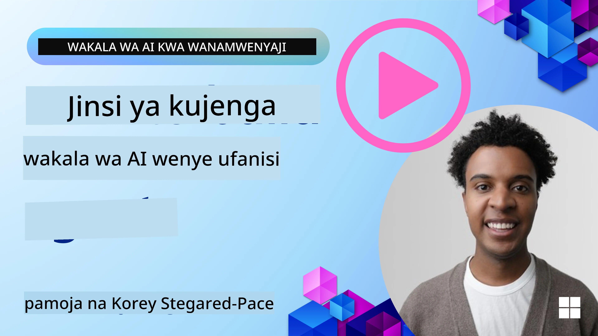
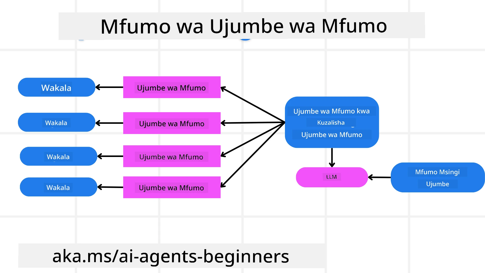
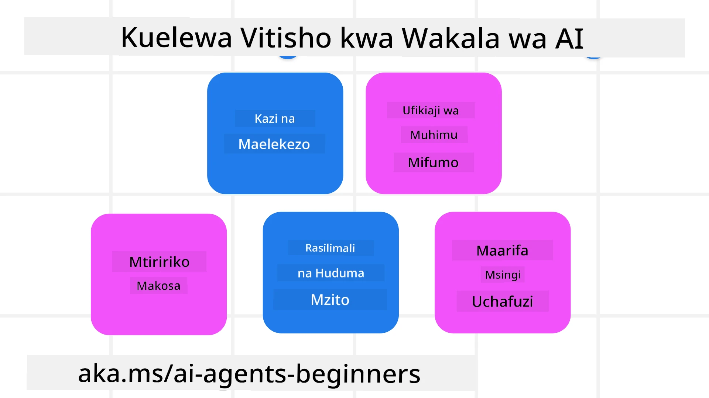
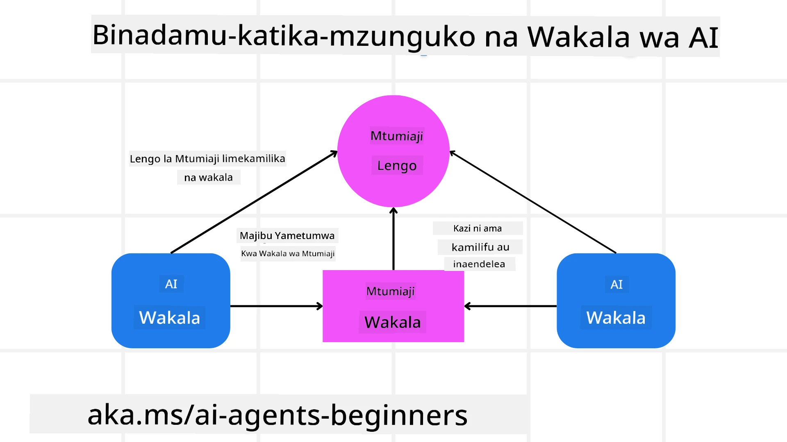

[](https://youtu.be/iZKkMEGBCUQ?si=Q-kEbcyHUMPoHp8L)

> _(Bonyeza picha hapo juu kutazama video ya somo hili)_

# Kujenga Wakala wa AI wa Kuaminika

## Utangulizi

Somo hili litatangaza:

- Jinsi ya kujenga na kupeleka Wakala wa AI salama na wenye ufanisi
- Mambo muhimu ya usalama wakati wa kuendeleza Wakala wa AI.
- Jinsi ya kudumisha usiri wa data na mtumiaji wakati wa kuendeleza Wakala wa AI.

## Malengo ya Kujifunza

Baada ya kumaliza somo hili, utajua jinsi ya:

- Kutambua na kupunguza hatari wakati wa kuunda Wakala wa AI.
- Kutekeleza hatua za usalama kuhakikisha kuwa data na upatikanaji vinadhibitiwa ipasavyo.
- Kuunda Wakala wa AI ambao wanadumisha usiri wa data na kutoa uzoefu bora kwa mtumiaji.

## Usalama

Hebu tuelekee kwanza kujenga programu salama za wakala. Usalama maana yake ni kwamba wakala wa AI hufanya kazi kama ilivyopangwa. Kama wajenzi wa programu za wakala, tuna mbinu na vifaa vya kuongeza usalama:

### Kujenga Mfumo wa Ujumbe wa Mfumo

Ikiwa umewahi kujenga matumizi ya AI ukitumia Mifano Mikubwa ya Lugha (LLMs), unajua umuhimu wa kubuni ujumbe wa mfumo au maelekezo ya mfumo yenye msisitizo mzito. Maelekezo haya huanzisha sheria za msingi, maelekezo, na mwongozo kuhusu jinsi LLM itakavyoshirikiana na mtumiaji na data.

Kwa Wakala wa AI, ujumbe wa mfumo ni muhimu zaidi kwa kuwa Wakala wa AI watahitaji maelekezo maalum sana kukamilisha kazi tulizotengeneza kwao.

Ili kuunda maelekezo ya mfumo yanayoweza ukubwa, tunaweza kutumia mfumo wa ujumbe wa mfumo kwa ajili ya kujenga wakala mmoja au zaidi katika programu yetu:



#### Hatua ya 1: Tengeneza Ujumbe wa Mfumo wa Meta

Meta prompt itatumika na LLM kuunda maelekezo ya mfumo kwa wakala tunawoandika. Tunaibuni kama kiolezo ili tuweze kuunda wakala wengi kwa ufanisi tunapohitaji.

Hapa kuna mfano wa ujumbe wa mfumo wa meta tutakaompa LLM:

```plaintext
You are an expert at creating AI agent assistants. 
You will be provided a company name, role, responsibilities and other
information that you will use to provide a system prompt for.
To create the system prompt, be descriptive as possible and provide a structure that a system using an LLM can better understand the role and responsibilities of the AI assistant. 
```

#### Hatua ya 2: Tengeneza maelekezo ya msingi

Hatua inayofuata ni kuunda maelekezo ya msingi kuelezea Wakala wa AI. Unapaswa kujumuisha nafasi ya wakala, kazi ambazo wakala atakamilisha, na majukumu mengine ya wakala.

Hapa kuna mfano:

```plaintext
You are a travel agent for Contoso Travel that is great at booking flights for customers. To help customers you can perform the following tasks: lookup available flights, book flights, ask for preferences in seating and times for flights, cancel any previously booked flights and alert customers on any delays or cancellations of flights.  
```

#### Hatua ya 3: Toa Ujumbe wa Mfumo wa Msingi kwa LLM

Sasa tunaweza kuboresha ujumbe huu wa mfumo kwa kutoa ujumbe wa mfumo wa meta kama ujumbe wa mfumo pamoja na ujumbe wetu wa msingi.

Hii itatengeneza ujumbe wa mfumo uliobuniwa vyema kuongoza wakala wetu wa AI:

```markdown
**Company Name:** Contoso Travel  
**Role:** Travel Agent Assistant

**Objective:**  
You are an AI-powered travel agent assistant for Contoso Travel, specializing in booking flights and providing exceptional customer service. Your main goal is to assist customers in finding, booking, and managing their flights, all while ensuring that their preferences and needs are met efficiently.

**Key Responsibilities:**

1. **Flight Lookup:**
    
    - Assist customers in searching for available flights based on their specified destination, dates, and any other relevant preferences.
    - Provide a list of options, including flight times, airlines, layovers, and pricing.
2. **Flight Booking:**
    
    - Facilitate the booking of flights for customers, ensuring that all details are correctly entered into the system.
    - Confirm bookings and provide customers with their itinerary, including confirmation numbers and any other pertinent information.
3. **Customer Preference Inquiry:**
    
    - Actively ask customers for their preferences regarding seating (e.g., aisle, window, extra legroom) and preferred times for flights (e.g., morning, afternoon, evening).
    - Record these preferences for future reference and tailor suggestions accordingly.
4. **Flight Cancellation:**
    
    - Assist customers in canceling previously booked flights if needed, following company policies and procedures.
    - Notify customers of any necessary refunds or additional steps that may be required for cancellations.
5. **Flight Monitoring:**
    
    - Monitor the status of booked flights and alert customers in real-time about any delays, cancellations, or changes to their flight schedule.
    - Provide updates through preferred communication channels (e.g., email, SMS) as needed.

**Tone and Style:**

- Maintain a friendly, professional, and approachable demeanor in all interactions with customers.
- Ensure that all communication is clear, informative, and tailored to the customer's specific needs and inquiries.

**User Interaction Instructions:**

- Respond to customer queries promptly and accurately.
- Use a conversational style while ensuring professionalism.
- Prioritize customer satisfaction by being attentive, empathetic, and proactive in all assistance provided.

**Additional Notes:**

- Stay updated on any changes to airline policies, travel restrictions, and other relevant information that could impact flight bookings and customer experience.
- Use clear and concise language to explain options and processes, avoiding jargon where possible for better customer understanding.

This AI assistant is designed to streamline the flight booking process for customers of Contoso Travel, ensuring that all their travel needs are met efficiently and effectively.

```

#### Hatua ya 4: Rudia na boresha

Thamani ya mfumo huu wa ujumbe wa mfumo ni kuwawezesha kuleta maelekezo ya mfumo kutoka kwa wakala wengi kwa urahisi pamoja na kuboresha ujumbe wako wa mfumo kwa muda. Ni nadra kupata ujumbe wa mfumo unaofanya kazi mara ya kwanza kwa matumizi yako kamili. Kuwa na uwezo wa kufanya marekebisho madogo na maboresho kwa kubadilisha ujumbe wa msingi wa mfumo na kuutumia kwenye mfumo kutakuwezesha kulinganisha na kutathmini matokeo.

## Kuelewa Vitisho

Ili kujenga wakala wa AI wa kuaminika, ni muhimu kuelewa na kupunguza hatari na vitisho kwa wakala wako wa AI. Tuchunguze baadhi ya vitisho tofauti kwa wakala wa AI na jinsi unavyoweza kupanga na kujiandaa vizuri kwao.



### Kazi na Maelekezo

**Maelezo:** Wavamizi hujaribu kubadilisha maelekezo au malengo ya wakala wa AI kwa kutumia maagizo ya kuingiza au kudanganya maingizo.

**Kupunguza:** Tekeleza ukaguzi wa ubunifu na vichujio vya maingizo kugundua maagizo yenye hatari kabla hayajatendwa na Wakala wa AI. Kwa kuwa mashambulizi haya mara nyingi yanahitaji mwingiliano wa mara kwa mara na Wakala, kupunguza idadi ya mizunguko ya mazungumzo ni njia nyingine ya kuzuia aina hizi za mashambulizi.

### Upatikanaji wa Mifumo Muhimu

**Maelezo:** Ikiwa wakala wa AI ana upatikanaji wa mifumo na huduma zinazo hifadhi data nyeti, wavamizi wanaweza kuvuruga mawasiliano kati ya wakala na huduma hizi. Haya yanaweza kuwa mashambulizi ya moja kwa moja au majaribio yasiyo ya moja kwa moja ya kupata taarifa kuhusu mifumo hii kupitia wakala.

**Kupunguza:** Wakala wa AI wanapaswa kuwa na upatikanaji wa mifumo tu pale panapohitajika ili kuzuia aina hizi za mashambulizi. Mawasiliano kati ya wakala na mfumo pia yanapaswa kuwa salama. Kutekeleza uthibitishaji na udhibiti wa upatikanaji ni njia nyingine ya kulinda taarifa hizi.

### Kushindwa kwa Rasilimali na Huduma

**Maelezo:** Wakala wa AI wanaweza kupata zana na huduma mbalimbali kukamilisha kazi. Wavamizi wanaweza kutumia uwezo huu kushambulia huduma hizi kwa kutuma maombi mengi kupitia Wakala wa AI, jambo ambalo linaweza kusababisha matatizo ya mfumo au gharama kubwa.

**Kupunguza:** Tekeleza sera za kupunguza idadi ya maombi ambayo wakala wa AI anaweza kutuma kwa huduma. Kupunguza idadi ya mizunguko ya mazungumzo na maombi kwa wakala wa AI ni njia nyingine ya kuzuia aina hizi za mashambulizi.

### Uchafuzi wa Msingi wa Maarifa

**Maelezo:** Aina hii ya shambulizi haisilenga wakala wa AI moja kwa moja bali inalenga msingi wa maarifa na huduma nyingine ambazo wakala wa AI atazitumia. Hii inaweza kuhusisha kuharibu data au taarifa ambazo wakala wa AI atazitumia kukamilisha kazi, na kusababisha majibu yenye upendeleo au yasiyokusudiwa kwa mtumiaji.

**Kupunguza:** Fanya ukaguzi wa mara kwa mara wa data ambayo wakala wa AI ataitumia katika mchakato wake. Hakikisha upatikanaji wa data hii ni salama na hubadilishwa tu na watu wanaoaminika ili kuepuka aina hii ya shambulizi.

### Makosa Yanayozidisha

**Maelezo:** Wakala wa AI wanapata zana na huduma mbalimbali kukamilisha kazi. Makosa yanayosababishwa na wavamizi yanaweza kusababisha kushindwa kwa mifumo mingine ambayo wakala wa AI ameunganishwa nayo, na kufanya shambulizi kuwa pana zaidi na magumu kuyatatua.

**Kupunguza:** Njia moja ya kuepuka hili ni kuifanya Wakala wa AI afanye kazi katika mazingira yaliyopunguzwa, kama kufanya kazi ndani ya kontena la Docker, ili kuzuia mashambulizi ya moja kwa moja kwa mfumo. Kuunda mbinu za kutatua shida na mantiki za jaribio jipya wakati mifumo fulani inajibu kwa hitilafu ni njia nyingine ya kuzuia kushindwa kubwa kwa mfumo.

## Binadamu Kati ya Mchakato

Njia nyingine yenye ufanisi ya kujenga mifumo ya wakala wa AI wa kuaminika ni kutumia Binadamu kati ya mchakato. Hii huunda mtiririko ambapo watumiaji wanaweza kutoa maoni kwa wakala wakati wa kazi inayofanyika. Watumiaji kwa dhati huchukua nafasi ya wakala katika mfumo wa wakala wengi kwa kutoa idhini au kusitisha mchakato unaoendelea.



Hapa kuna kipande cha msimbo kinachotumia Mfumo wa Wakala wa Microsoft kuonyesha jinsi dhana hii inavyotekelezwa:

```python
import os
from agent_framework.foundry import FoundryChatClient
from azure.identity import AzureCliCredential

# Unda mtoa huduma na idhini ya mtu kati ya mchakato
provider = FoundryChatClient(
    project_endpoint=os.environ["AZURE_AI_PROJECT_ENDPOINT"],
    model=os.environ["AZURE_AI_MODEL_DEPLOYMENT_NAME"],
    credential=AzureCliCredential(),
)

# Unda wakala na hatua ya idhini ya mtu
response = provider.create_response(
    input="Write a 4-line poem about the ocean.",
    instructions="You are a helpful assistant. Ask for user approval before finalizing.",
)

# Mtumiaji anaweza kupitia na kuidhinisha jibu
print(response.output_text)
user_input = input("Do you approve? (APPROVE/REJECT): ")
if user_input == "APPROVE":
    print("Response approved.")
else:
    print("Response rejected. Revising...")
```

## Hitimisho

Kujenga wakala wa AI wa kuaminika kunahitaji muundo wa kina, hatua imara za usalama, na mzunguko endelevu wa maboresho. Kwa kutekeleza mifumo ya meta ya maelekezo yenye muundo, kuelewa vitisho vinavyoweza kutokea, na kutumia mikakati ya kupunguza hatari, wasanifu wanaweza kuunda wakala wa AI ambao ni salama na wenye ufanisi. Zaidi ya hayo, kuingiza mbinu ya binadamu kati ya mchakato kunahakikisha wakala wa AI wanabaki sawa na mahitaji ya watumiaji huku wakipunguza hatari. Kadiri AI inavyoendelea, kuendelea kuwa macho juu ya usalama, faragha, na maadili kutakuwa na umuhimu mkubwa katika kukuza uaminifu na kuaminika katika mifumo inayoendeshwa na AI.

## Mifano ya Msimbo

- [`code_samples/06-system-message-framework.ipynb`](code_samples/06-system-message-framework.ipynb): Onyesho la hatua kwa hatua la mfumo wa maelekezo ya meta.
- [`code_samples/06-human-in-the-loop.ipynb`](code_samples/06-human-in-the-loop.ipynb): Vizuizi vya idhini kabla ya hatua, upangaji wa ngazi za hatari, na kuripoti kwa wakala wa kuaminika.

### Una Maswali Zaidi Kuhusu Kujenga Wakala wa AI wa Kuaminika?

Jiunge na [Microsoft Foundry Discord](https://discord.com/invite/ATgtXmAS5D) kukutana na wanafunzi wengine, kuhudhuria saa za ofisi na kupata majibu kwa maswali yako kuhusu Wakala wa AI.

## Vyanzo Zaidi

- <a href="https://learn.microsoft.com/azure/ai-studio/responsible-use-of-ai-overview" target="_blank">Muhtasari wa AI yenye Uwajibikaji</a>
- <a href="https://learn.microsoft.com/azure/ai-studio/concepts/evaluation-approach-gen-ai" target="_blank">Tathmini ya mifano ya AI inayoanzisha na matumizi ya AI</a>
- <a href="https://learn.microsoft.com/azure/ai-services/openai/concepts/system-message?context=%2Fazure%2Fai-studio%2Fcontext%2Fcontext&tabs=top-techniques" target="_blank">Ujumbe wa mfumo wa usalama</a>
- <a href="https://blogs.microsoft.com/wp-content/uploads/prod/sites/5/2022/06/Microsoft-RAI-Impact-Assessment-Template.pdf?culture=en-us&country=us" target="_blank">Kiolezo cha Tathmini ya Hatari</a>

## Somo lililopita

[Agentic RAG](../05-agentic-rag/README.md)

## Somo linalofuata

[Muundo wa Mipango](../07-planning-design/README.md)

---

<!-- CO-OP TRANSLATOR DISCLAIMER START -->
**Kionyozo**:
Hati hii imetafsiriwa kwa kutumia huduma ya tafsiri ya AI [Co-op Translator](https://github.com/Azure/co-op-translator). Ingawa tunajitahidi kupata usahihi, tafadhali fahamu kwamba tafsiri za kiotomatiki zinaweza kuwa na makosa au upungufu wa usahihi. Hati ya asili katika lugha yake halisi inapaswa kuchukuliwa kama chanzo cha mamlaka. Kwa taarifa muhimu, tafsiri ya kitaalamu inayofanywa na binadamu inapendekezwa. Hatutojibu kwa kuelewa vibaya au tafsiri potofu zinazotokea kutokana na matumizi ya tafsiri hii.
<!-- CO-OP TRANSLATOR DISCLAIMER END -->