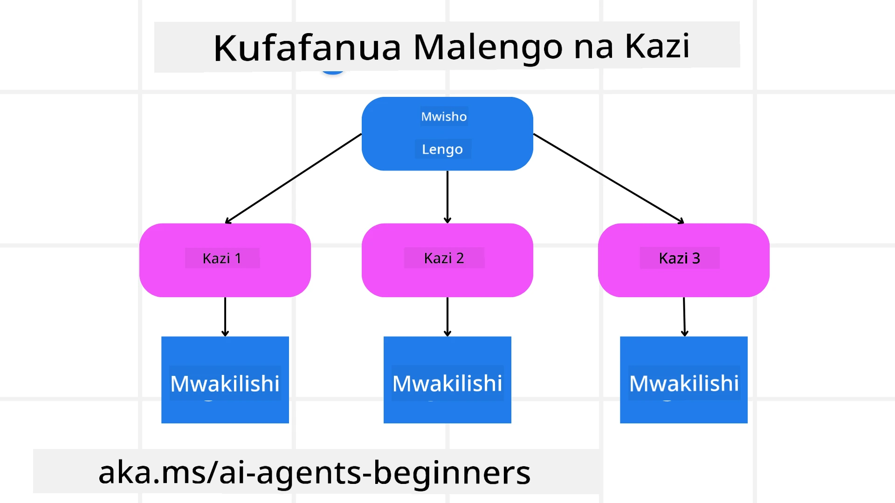

[](https://youtu.be/kPfJ2BrBCMY?si=9pYpPXp0sSbK91Dr)

> _(Bonyeza picha hapo juu kutazama video ya somo hili)_

# Ubunifu wa Mipango

## Utangulizi

Somo hili litatangulia

* Kuweka lengo wazi la jumla na kugawanya kazi ngumu kuwa kazi ndogo ndogo zinazoweza kusimamiwa.
* Kutumia matokeo yaliyo na muundo kwa majibu ya kuaminika na yanayoweza kusomwa na mashine.
* Kutumia mbinu inayozingatia matukio kushughulikia kazi zinazobadilika na maingizo yasiyotarajiwa.

## Malengo ya Kujifunza

Baada ya kukamilisha somo hili, utakuwa na ufahamu kuhusu:

* Kutambua na kuweka lengo la jumla kwa wakala wa AI, kuhakikisha anajua wazi kinachopaswa kufanikishwa.
* Kugawanya kazi ngumu kuwa kazi ndogo ndogo zinazolenga malengo na kuzipanga kwa mfuatano wa mantiki.
* Kuwakikisha mawakala wana vifaa sahihi (mfano, zana za utafutaji au zana za uchambuzi wa data), kuamua lini na jinsi vinavyotumika, na kushughulikia hali zisizotarajiwa zinazojitokeza.
* Kutathmini matokeo ya kazi ndogo, kupima utendaji, na kurudia hatua ili kuboresha matokeo ya mwisho.

## Kuweka Lengo la Jumla na Kugawanya Kazi



Kazi nyingi halisi ni ngumu sana kushughulikia kwa hatua moja. Wakala wa AI anahitaji lengo fupi kuelekeza mipango na hatua zake. Kwa mfano, fikiria lengo:

    "Tengeneza ratiba ya safari ya siku 3."

Ingawa ni rahisi kueleza, bado linahitaji kuboreshwa. Kadri lengo linavyokuwa wazi zaidi, ndivyo wakala (na mshirika yeyote wa kibinadamu) wanavyoweza kuzingatia kufanikisha matokeo sahihi, kama kutengeneza ratiba kamili yenye chaguzi za ndege, mapendekezo ya hoteli, na mapendekezo ya shughuli.

### Kugawanya Kazi

Kazi kubwa au tata huwa rahisi kusimamia wakati zinapogawanywa kuwa kazi ndogo ndogo zilizo na malengo.
Kwa mfano wa ratiba ya safari, unaweza kugawanya lengo kama ifuatavyo:

* Kuhifadhi Tiketi za Ndege
* Kuhifadhi Hoteli
* Kukodisha Gari
* Uthamini wa Kibinafsi

Kila kazi ndogo inaweza kushughulikiwa na mawakala waliotengwa au michakato. Wakala mmoja anaweza kuzingatia kutafuta mikataba bora ya ndege, mwingine kuzingatia uhifadhi wa hoteli, n.k. Wakala wa kuratibu au "chini" anaweza kukusanya matokeo haya kuwa ratiba moja iliyounganishwa kwa mtumiaji wa mwisho.

Njia hii ya moduli pia inaruhusu maboresho ya hatua kwa hatua. Kwa mfano, unaweza kuongeza mawakala maalumu wa Mapendekezo ya Chakula au Mapendekezo ya Shughuli za Mahali na kuboresha ratiba kadri wakati unavyopita.

### Matokeo Yenye Muundo

Mifano Mikubwa ya Lugha (LLMs) inaweza kuzalisha matokeo yenye muundo (mfano JSON) ambayo ni rahisi kwa mawakala au huduma za chini kuifasiri na kuifanya kazi. Hii ni muhimu hasa katika muktadha wa mawakala wengi, ambapo tunaweza kutekeleza kazi hizi baada ya kupokea matokeo ya mipango.

Mfano wa Python unaonyesha wakala wa mipango akiigawanya lengo kuwa kazi ndogo na kuzalisha mpango wenye muundo:

```python
from pydantic import BaseModel
from enum import Enum
from typing import List, Optional, Union
import json
import os
from typing import Optional
from pprint import pprint
from agent_framework.azure import AzureAIProjectAgentProvider
from azure.identity import AzureCliCredential

class AgentEnum(str, Enum):
    FlightBooking = "flight_booking"
    HotelBooking = "hotel_booking"
    CarRental = "car_rental"
    ActivitiesBooking = "activities_booking"
    DestinationInfo = "destination_info"
    DefaultAgent = "default_agent"
    GroupChatManager = "group_chat_manager"

# Mfano wa Kazi Ndogo ya Kusafiri
class TravelSubTask(BaseModel):
    task_details: str
    assigned_agent: AgentEnum  # tunataka kugawa kazi kwa wakala

class TravelPlan(BaseModel):
    main_task: str
    subtasks: List[TravelSubTask]
    is_greeting: bool

provider = AzureAIProjectAgentProvider(credential=AzureCliCredential())

# Eleza ujumbe wa mtumiaji
system_prompt = """You are a planner agent.
    Your job is to decide which agents to run based on the user's request.
    Provide your response in JSON format with the following structure:
{'main_task': 'Plan a family trip from Singapore to Melbourne.',
 'subtasks': [{'assigned_agent': 'flight_booking',
               'task_details': 'Book round-trip flights from Singapore to '
                               'Melbourne.'}
    Below are the available agents specialised in different tasks:
    - FlightBooking: For booking flights and providing flight information
    - HotelBooking: For booking hotels and providing hotel information
    - CarRental: For booking cars and providing car rental information
    - ActivitiesBooking: For booking activities and providing activity information
    - DestinationInfo: For providing information about destinations
    - DefaultAgent: For handling general requests"""

user_message = "Create a travel plan for a family of 2 kids from Singapore to Melbourne"

response = client.create_response(input=user_message, instructions=system_prompt)

response_content = response.output_text
pprint(json.loads(response_content))
```

### Wakala wa Mipango na Usimamizi wa Mawakala Wengi

Katika mfano huu, Wakala wa Semantic Router anapokea ombi la mtumiaji (mfano, "Nahitaji mpango wa hoteli kwa safari yangu.").

M'pangaji kisha:

* Anapokea Mpango wa Hoteli: M'pangaji huchukua ujumbe wa mtumiaji na, kwa kuzingatia maelekezo ya mfumo (yakiwemo maelezo ya mawakala waliopo), huzalisha mpango wa safari wenye muundo.
* Huelezea Orodha ya Mawakala na Vifaa vyao: rejesta ya wakala ina orodha ya mawakala (mfano, kwa ndege, hoteli, kukodisha gari, na shughuli) pamoja na kazi au vifaa wanavyotoa.
* Anatuma Mpango kwa Mawakala Husika: Kutegemea idadi ya kazi ndogo, m'pangaji hutuma ujumbe moja kwa mojawakala aliyejitolea (kwa hali za kazi moja) au anaongoza kupitia meneja wa mazungumzo ya kikundi kwa ushirikiano wa mawakala wengi.
* Huanika Matokeo: Mwisho, m'pangaji hufupisha mpango uliozalishwa kwa uwazi.
Mfano wa msimbo wa Python unaelezea hatua hizi:

```python

from pydantic import BaseModel

from enum import Enum
from typing import List, Optional, Union

class AgentEnum(str, Enum):
    FlightBooking = "flight_booking"
    HotelBooking = "hotel_booking"
    CarRental = "car_rental"
    ActivitiesBooking = "activities_booking"
    DestinationInfo = "destination_info"
    DefaultAgent = "default_agent"
    GroupChatManager = "group_chat_manager"

# Mfano wa Kazi Ndogo ya Safari

class TravelSubTask(BaseModel):
    task_details: str
    assigned_agent: AgentEnum # tunataka kumnyaza wakala kazi

class TravelPlan(BaseModel):
    main_task: str
    subtasks: List[TravelSubTask]
    is_greeting: bool
import json
import os
from typing import Optional

from agent_framework.azure import AzureAIProjectAgentProvider
from azure.identity import AzureCliCredential

# Unda mteja

provider = AzureAIProjectAgentProvider(credential=AzureCliCredential())

from pprint import pprint

# Eleza ujumbe wa mtumiaji

system_prompt = """You are a planner agent.
    Your job is to decide which agents to run based on the user's request.
    Below are the available agents specialized in different tasks:
    - FlightBooking: For booking flights and providing flight information
    - HotelBooking: For booking hotels and providing hotel information
    - CarRental: For booking cars and providing car rental information
    - ActivitiesBooking: For booking activities and providing activity information
    - DestinationInfo: For providing information about destinations
    - DefaultAgent: For handling general requests"""

user_message = "Create a travel plan for a family of 2 kids from Singapore to Melbourne"

response = client.create_response(input=user_message, instructions=system_prompt)

response_content = response.output_text

# Chapisha maudhui ya majibu baada ya kuipakia kama JSON

pprint(json.loads(response_content))
```

Yanayofuata ni matokeo kutoka kwa msimbo uliotangulia na unaweza kutumia matokeo haya yenye muundo kutuma kwa `assigned_agent` na kufupisha mpango wa safari kwa mtumiaji wa mwisho.

```json
{
    "is_greeting": "False",
    "main_task": "Plan a family trip from Singapore to Melbourne.",
    "subtasks": [
        {
            "assigned_agent": "flight_booking",
            "task_details": "Book round-trip flights from Singapore to Melbourne."
        },
        {
            "assigned_agent": "hotel_booking",
            "task_details": "Find family-friendly hotels in Melbourne."
        },
        {
            "assigned_agent": "car_rental",
            "task_details": "Arrange a car rental suitable for a family of four in Melbourne."
        },
        {
            "assigned_agent": "activities_booking",
            "task_details": "List family-friendly activities in Melbourne."
        },
        {
            "assigned_agent": "destination_info",
            "task_details": "Provide information about Melbourne as a travel destination."
        }
    ]
}
```

Mfano wa daftari la kumbukumbu with the previous code sample upo [hapa](07-python-agent-framework.ipynb).

### Mipango ya Kurudia Kurudia

Kazi zingine zinahitaji kurudia au kupanga upya, ambapo matokeo ya kazi ndogo huathiri inayofuata. Kwa mfano, ikiwa wakala anagundua muundo wa data usiotarajiwa wakati wa kuhifadhi tiketi za ndege, anaweza kuhitaji kubadilisha mbinu kabla ya kuendelea na uhifadhi wa hoteli.

Pia, mrejesho wa mtumiaji (mfano, binadamu akiamua wanapendelea ndege ya mapema) unaweza kusababisha kupanga upya kiasi. Njia hii ya mabadiliko, inayojirudia, huhakikisha suluhisho la mwisho linaendana na vizingiti halisi na mapendeleo yanayobadilika ya mtumiaji.

mfano wa msimbo

```python
from agent_framework.azure import AzureAIProjectAgentProvider
from azure.identity import AzureCliCredential
#.. sawa na msimbo wa awali na pitia historia ya mtumiaji, mpango wa sasa

system_prompt = """You are a planner agent to optimize the
    Your job is to decide which agents to run based on the user's request.
    Below are the available agents specialized in different tasks:
    - FlightBooking: For booking flights and providing flight information
    - HotelBooking: For booking hotels and providing hotel information
    - CarRental: For booking cars and providing car rental information
    - ActivitiesBooking: For booking activities and providing activity information
    - DestinationInfo: For providing information about destinations
    - DefaultAgent: For handling general requests"""

user_message = "Create a travel plan for a family of 2 kids from Singapore to Melbourne"

response = client.create_response(
    input=user_message,
    instructions=system_prompt,
    context=f"Previous travel plan - {TravelPlan}",
)
# .. panga upya na tuma kazi kwa maajenti husika
```

Kwa mipango kamili zaidi tazama chapisho la blogi la Magnetic One <a href="https://www.microsoft.com/research/articles/magentic-one-a-generalist-multi-agent-system-for-solving-complex-tasks" target="_blank">Blogpost</a> kwa kutatua kazi ngumu.

## Muhtasari

Katika makala hii tumetazama mfano wa jinsi tunavyoweza kuunda mpangaji anayeweza kuchagua kwa ufanisi mawakala waliopo waliotangazwa. Matokeo ya M'pangaji hugawanya kazi na kuwatenga mawakala ili zitekelezwe. Inadhaniwa mawakala wana ufikiaji wa kazi/vifaa zinazohitajika kutekeleza kazi. Mbali na mawakala unaweza kujumuisha mifano mingine kama tafakari, muhtasari, na mazungumzo ya mzunguko wa mizunguko ili kuboresha zaidi.

## Rasilimali Zaidi

Magentic One - Mfumo wa mawakala wengi wa jumla kwa kutatua kazi ngumu na umefanikiwa kufikia matokeo mazuri katika vigezo vingi vigumu vya mawakala. Marejeo: <a href="https://www.microsoft.com/research/articles/magentic-one-a-generalist-multi-agent-system-for-solving-complex-tasks" target="_blank">Magentic One</a>. Katika utekelezaji huu msimamiaji huunda mipango maalum ya kazi na kuazimia kazi hizi kwa mawakala waliopo. Mbali na kupanga, msimamiaji pia hutumia mfumo wa kufuatilia maendeleo ya kazi na kupanga upya inapohitajika.

### Una Maswali Zaidi Kuhusu Mfano wa Ubunifu wa Mipango?

Jiunge na [Microsoft Foundry Discord](https://aka.ms/ai-agents/discord) kukutana na wanafunzi wengine, kuhudhuria saa za ofisi na kupata majibu ya maswali yako kuhusu Wakala wa AI.

## Somo lililopita

[Kuunda Wakala wa AI wa Kuaminika](../06-building-trustworthy-agents/README.md)

## Somo lijalo

[Mfano wa Ubunifu wa Mawakala Wengi](../08-multi-agent/README.md)

---

<!-- CO-OP TRANSLATOR DISCLAIMER START -->
**Kiarifa cha Majuto**:
Hati hii imetafsiriwa kwa kutumia huduma ya utafsiri ya AI [Co-op Translator](https://github.com/Azure/co-op-translator). Ingawa tunajitahidi kupata usahihi, tafadhali fahamu kwamba tafsiri zilizotengenezwa kwa mashine zinaweza kuwa na makosa au taarifa zisizo sahihi. Hati ya awali katika lugha yake asili inapaswa kuzingatiwa kama chanzo chenye mamlaka. Kwa taarifa muhimu, utafsiri wa binadamu mtaalamu unashauriwa. Hatuhusiki kwa kutoelewana au tafsiri potofu zinazotokana na matumizi ya tafsiri hii.
<!-- CO-OP TRANSLATOR DISCLAIMER END -->