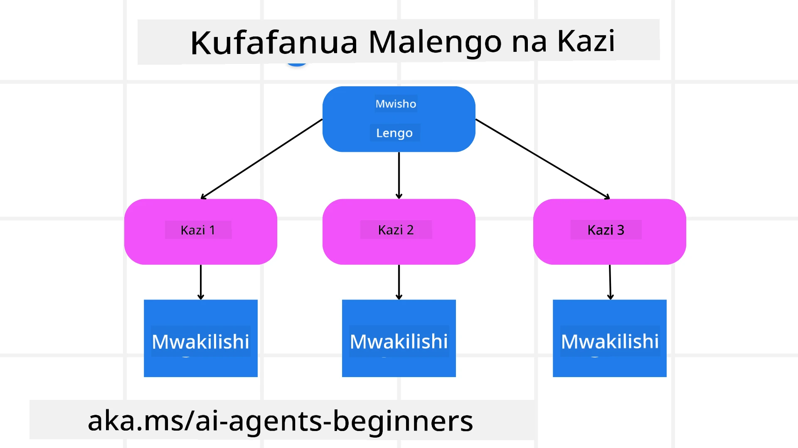

[](https://youtu.be/kPfJ2BrBCMY?si=9pYpPXp0sSbK91Dr)

> _(Bofya picha hapo juu kutazama video ya somo hili)_

# Ubunifu wa Mipango

## Utangulizi

Somo hili litajumuisha

* Kuelezwa malengo ya wazi kwa ujumla na kugawanya kazi ngumu kuwa kazi ndogo ndogo zinazoweza kusimamiwa.
* Kutumia matokeo yaliyo na muundo kwa majibu yanayoweza kutegemewa na kusomwa na mashine.
* Kutumia mbinu inayotegemea matukio kushughulikia kazi zinazoendelea na pembejeo zisizotarajiwa.

## Malengo ya Kujifunza

Baada ya kumaliza somo hili, utakuwa na ufahamu kuhusu:

* Kutambua na kuweka lengo kuu kwa wakala wa AI, kuhakikisha anajua kwa uwazi kinachopaswa kufanikishwa.
* Kugawanya kazi ngumu kuwa kazi ndogo zinazoweza kusimamiwa na kuzipanga kwa mpangilio mzuri.
* Kumtayarisha wakala kwa zana sahihi (mfano, zana za utafutaji au zana za uchambuzi wa data), kuamua lini na jinsi zinavyotumiwa, na kusimamia hali zisizotarajiwa zinazojitokeza.
* Kutathmini matokeo ya kazi ndogo, kupima ufanisi, na kurudia hatua ili kuboresha matokeo ya mwisho.

## Kuelezwa kwa Lengo Kuu na Kugawanya Kazi



Kazi nyingi halisi ni ngumu mno kushughulikia kwa hatua moja tu. Wakala wa AI anahitaji lengo fupi lililogawika kutawala mipango na hatua zake. Kwa mfano, fikiria lengo:

    "Tengeneza ratiba ya safari ya siku 3."

Ingawa ni rahisi kusema, bado linahitaji kusafishwa zaidi. Kadri lengo linavyokuwa dhahiri, ndivyo wakala (na washirika wengine wa binadamu) wanavyoweza kuzingatia kufanikisha matokeo sahihi, kama kubuni ratiba kamili yenye chaguzi za ndege, mapendekezo ya hoteli, na mapendekezo ya shughuli.

### Kugawanya Kazi

Kazi kubwa au ngumu huwa rahisi kusimamia wakati zinagawanywa kuwa kazi ndogo ndogo zenye malengo maalum.
Kwa mfano wa ratiba ya safari, unaweza kugawanya lengo kuwa:

* Kuhifadhi Ndege
* Kuhifadhi Hoteli
* Kukodisha Gari
* Ubinafsishaji

Kila kazi ndogo inaweza kushughulikiwa na mawakala maalum au michakato. Wakala mmoja anaweza kuzingatia kutafuta ofa bora za ndege, mwingine azingatie kuhifadhi hoteli, n.k. Wakala anayeongoza au "wa chini" anaweza kukusanya matokeo haya kuwa ratiba moja inayojumuisha kwa mtumiaji wa mwisho.

Njia hii ya moduli pia inaruhusu maboresho ya hatua kwa hatua. Kwa mfano, unaweza kuongeza mawakala maalum wa Mapendekezo ya Chakula au Shughuli za Mitaa na kuboresha ratiba kwa muda.

### Matokeo yenye muundo

Modeli Kuu za Lugha (LLMs) zinaweza kutoa matokeo yenye muundo (mfano, JSON) ambayo ni rahisi kwa mawakala au huduma za chini kusoma na kuchambua. Hii ni muhimu hasa katika muktadha wa mawakala wengi, ambapo tunaweza kutekeleza kazi hizi baada ya kupokea matokeo ya mipango.

Kipande cha Python kinachoonyesha wakala wa mipango akigawanya lengo kuwa kazi ndogo na kutengeneza mpango wenye muundo ni kama ifuatavyo:

```python
from pydantic import BaseModel
from enum import Enum
from typing import List, Optional, Union
import json
import os
from typing import Optional
from pprint import pprint
from agent_framework.foundry import FoundryChatClient
from azure.identity import AzureCliCredential

class AgentEnum(str, Enum):
    FlightBooking = "flight_booking"
    HotelBooking = "hotel_booking"
    CarRental = "car_rental"
    ActivitiesBooking = "activities_booking"
    DestinationInfo = "destination_info"
    DefaultAgent = "default_agent"
    GroupChatManager = "group_chat_manager"

# Mfano wa Kazi Ndogo ya Safari
class TravelSubTask(BaseModel):
    task_details: str
    assigned_agent: AgentEnum  # tunataka kumteua wakala kwa kazi hiyo

class TravelPlan(BaseModel):
    main_task: str
    subtasks: List[TravelSubTask]
    is_greeting: bool

provider = FoundryChatClient(
    project_endpoint=os.environ["AZURE_AI_PROJECT_ENDPOINT"],
    model=os.environ["AZURE_AI_MODEL_DEPLOYMENT_NAME"],
    credential=AzureCliCredential(),
)

# Tafsiri ujumbe wa mtumiaji
system_prompt = """You are a planner agent.
    Your job is to decide which agents to run based on the user's request.
    Provide your response in JSON format with the following structure:
{'main_task': 'Plan a family trip from Singapore to Melbourne.',
 'subtasks': [{'assigned_agent': 'flight_booking',
               'task_details': 'Book round-trip flights from Singapore to '
                               'Melbourne.'}
    Below are the available agents specialised in different tasks:
    - FlightBooking: For booking flights and providing flight information
    - HotelBooking: For booking hotels and providing hotel information
    - CarRental: For booking cars and providing car rental information
    - ActivitiesBooking: For booking activities and providing activity information
    - DestinationInfo: For providing information about destinations
    - DefaultAgent: For handling general requests"""

user_message = "Create a travel plan for a family of 2 kids from Singapore to Melbourne"

response = client.create_response(input=user_message, instructions=system_prompt)

response_content = response.output_text
pprint(json.loads(response_content))
```

### Wakala wa Mipango na Usimamizi wa Mawakala Wengi

Katika mfano huu, Wakala wa Router wa Semantiki anapokea ombi la mtumiaji (mfano, "Nahitaji mpango wa hoteli kwa safari yangu.").

Mkipanga hutenda kama ifuatavyo:

* Kupokea Mpango wa Hoteli: Mkipanga huchukua ujumbe wa mtumiaji na, kwa msingi wa tahadhari ya mfumo (ikiwemo maelezo ya mawakala waliopo), hutengeneza mpango wa safari wenye muundo.
* Orodhesha Mawakala na Zana Zao: Usajili wa wakala una orodha ya mawakala (mfano, kwa ndege, hoteli, kukodisha gari, na shughuli) pamoja na kazi au zana wanazotoa.
* Kupeleka Mpango kwa Mawakala Husika: Kulingana na idadi ya kazi ndogo, mpangaji hutuma ujumbe moja kwa moja kwa wakala maalum (kwa hali ya kazi moja) au kusimamia kupitia meneja wa mazungumzo ya kikundi kwa ushirikiano wa mawakala wengi.
* Kufupisha Matokeo: Mwishowe, mpangaji hufupisha mpango uliotengenezwa kwa uwazi.
Mfano wa msimbo wa Python unaonyesha hatua hizi ni kama ifuatavyo:

```python

from pydantic import BaseModel

from enum import Enum
from typing import List, Optional, Union

class AgentEnum(str, Enum):
    FlightBooking = "flight_booking"
    HotelBooking = "hotel_booking"
    CarRental = "car_rental"
    ActivitiesBooking = "activities_booking"
    DestinationInfo = "destination_info"
    DefaultAgent = "default_agent"
    GroupChatManager = "group_chat_manager"

# Mfano wa Kazi Ndogo ya Safari

class TravelSubTask(BaseModel):
    task_details: str
    assigned_agent: AgentEnum # tunataka kumteua wakala kazi

class TravelPlan(BaseModel):
    main_task: str
    subtasks: List[TravelSubTask]
    is_greeting: bool
import json
import os
from typing import Optional

from agent_framework.foundry import FoundryChatClient
from azure.identity import AzureCliCredential

# Unda mteja

provider = FoundryChatClient(
    project_endpoint=os.environ["AZURE_AI_PROJECT_ENDPOINT"],
    model=os.environ["AZURE_AI_MODEL_DEPLOYMENT_NAME"],
    credential=AzureCliCredential(),
)

from pprint import pprint

# Eleza ujumbe wa mtumiaji

system_prompt = """You are a planner agent.
    Your job is to decide which agents to run based on the user's request.
    Below are the available agents specialized in different tasks:
    - FlightBooking: For booking flights and providing flight information
    - HotelBooking: For booking hotels and providing hotel information
    - CarRental: For booking cars and providing car rental information
    - ActivitiesBooking: For booking activities and providing activity information
    - DestinationInfo: For providing information about destinations
    - DefaultAgent: For handling general requests"""

user_message = "Create a travel plan for a family of 2 kids from Singapore to Melbourne"

response = client.create_response(input=user_message, instructions=system_prompt)

response_content = response.output_text

# Chapisha yaliyomo kwenye majibu baada ya kuyapakia kama JSON

pprint(json.loads(response_content))
```

Kinachofuata ni matokeo ya msimbo uliotangulia na unaweza kutumia matokeo haya yenye muundo kupeleka kwa `assigned_agent` na kufupisha mpango wa safari kwa mtumiaji wa mwisho.

```json
{
    "is_greeting": "False",
    "main_task": "Plan a family trip from Singapore to Melbourne.",
    "subtasks": [
        {
            "assigned_agent": "flight_booking",
            "task_details": "Book round-trip flights from Singapore to Melbourne."
        },
        {
            "assigned_agent": "hotel_booking",
            "task_details": "Find family-friendly hotels in Melbourne."
        },
        {
            "assigned_agent": "car_rental",
            "task_details": "Arrange a car rental suitable for a family of four in Melbourne."
        },
        {
            "assigned_agent": "activities_booking",
            "task_details": "List family-friendly activities in Melbourne."
        },
        {
            "assigned_agent": "destination_info",
            "task_details": "Provide information about Melbourne as a travel destination."
        }
    ]
}
```

Mfano wa daftari lenye kipande cha msimbo uliotangulia unapatikana [hapa](./code_samples/07-python-agent-framework.ipynb).

### Mipango Inayorudiwa

Baadhi ya kazi zinahitaji pendekezo la nyuma na mbele au mipango upya, ambapo matokeo ya kazi ndogo huathiri ifuatayo. Kwa mfano, ikiwa wakala anagundua muundo wa data usiotarajiwa wakati wa kuhifadhi ndege, anaweza kuhitaji kubadilisha mkakati wake kabla ya kuendelea na kuhifadhi hoteli.

Zaidi ya hayo, maoni ya mtumiaji (mfano, binadamu anaamua anapendelea ndege ya mapema) yanaweza kuchochea upya wa mpango sehemu. Njia hii ya mzunguko inahakikisha kuwa suluhisho la mwisho linaendana na vikwazo halisi vya ulimwengu na mapendeleo zinazoendelea za mtumiaji.

mfano wa msimbo

```python
import os
from agent_framework.foundry import FoundryChatClient
from azure.identity import AzureCliCredential
#.. sawa na msimbo uliopita na pitia historia ya mtumiaji, mpango wa sasa

system_prompt = """You are a planner agent to optimize the
    Your job is to decide which agents to run based on the user's request.
    Below are the available agents specialized in different tasks:
    - FlightBooking: For booking flights and providing flight information
    - HotelBooking: For booking hotels and providing hotel information
    - CarRental: For booking cars and providing car rental information
    - ActivitiesBooking: For booking activities and providing activity information
    - DestinationInfo: For providing information about destinations
    - DefaultAgent: For handling general requests"""

user_message = "Create a travel plan for a family of 2 kids from Singapore to Melbourne"

response = client.create_response(
    input=user_message,
    instructions=system_prompt,
    context=f"Previous travel plan - {TravelPlan}",
)
# .. panga upya na tuma kazi kwa mawakala husika
```

Kwa mipango ya kina zaidi tembelea <a href="https://www.microsoft.com/research/articles/magentic-one-a-generalist-multi-agent-system-for-solving-complex-tasks" target="_blank">Magnetic One Blogpost</a> kwa kutatua kazi ngumu.

## Muhtasari

Katika makala hii tumeshuhudia mfano wa jinsi ya kuunda mpangaji ambaye anaweza kuchagua mawakala waliopo kwa njia inayobadilika. Matokeo ya Mkipanga hugawanya kazi na kuwachagua mawakala ili zitekelezwe. Inadhaniwa mawakala wana upatikanaji wa kazi/zana zinazohitajika kutekeleza kazi. Mbali na mawakala unaweza kuongeza mifumo mingine kama tafakari, muhtasari, na mazungumzo ya mizunguko ya pande zote kurekebisha zaidi.

## Vyanzo Zaidi

Magentic One - Mfumo wa mawakala wengi kwa ajili ya kutatua kazi ngumu na umefikia matokeo mazuri kwenye vipimo vingi vigumu vya wakala. Rejeleo: <a href="https://www.microsoft.com/research/articles/magentic-one-a-generalist-multi-agent-system-for-solving-complex-tasks" target="_blank">Magnetic One</a>. Katika utekelezaji huu mratibu hutengeneza mipango maalum ya kazi na kugawa kazi hizi kwa mawakala waliopo. Mbali na kupanga, mratibu pia hutumia mbinu ya kufuatilia maendeleo ya kazi na kupanga upya inapohitajika.

### Una Maswali Zaidi Kuhusu Mfumo wa Ubunifu wa Mipango?

Jiunge na [Microsoft Foundry Discord](https://discord.com/invite/ATgtXmAS5D) kukutana na wanafunzi wengine, kuhudhuria saa za ofisi na kupata majibu kwa maswali yako kuhusu Wakala wa AI.

## Somo Lililopita

[Kuunda Wakala wa AI wa Kuaminika](../06-building-trustworthy-agents/README.md)

## Somo Linalofuata

[Mfumo wa Ubunifu wa Mawakala Wengi](../08-multi-agent/README.md)

---

<!-- CO-OP TRANSLATOR DISCLAIMER START -->
**Kionyozo**:
Hati hii imetafsiriwa kwa kutumia huduma ya tafsiri ya AI [Co-op Translator](https://github.com/Azure/co-op-translator). Ingawa tunajitahidi kupata usahihi, tafadhali fahamu kwamba tafsiri za kiotomatiki zinaweza kuwa na makosa au upungufu wa usahihi. Hati ya asili katika lugha yake halisi inapaswa kuchukuliwa kama chanzo cha mamlaka. Kwa taarifa muhimu, tafsiri ya kitaalamu inayofanywa na binadamu inapendekezwa. Hatutojibu kwa kuelewa vibaya au tafsiri potofu zinazotokea kutokana na matumizi ya tafsiri hii.
<!-- CO-OP TRANSLATOR DISCLAIMER END -->