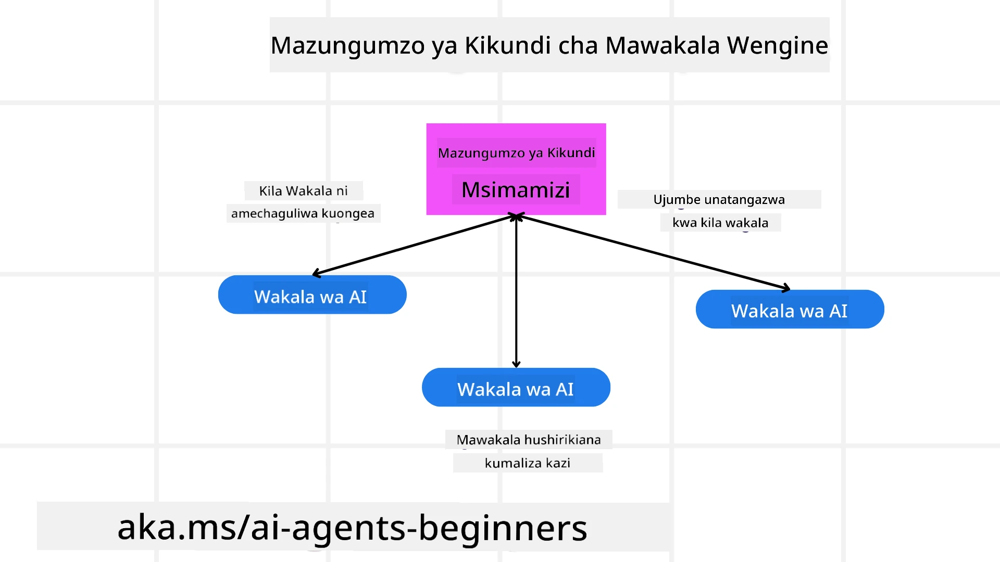
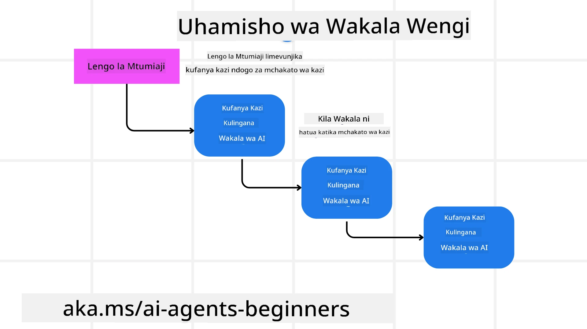
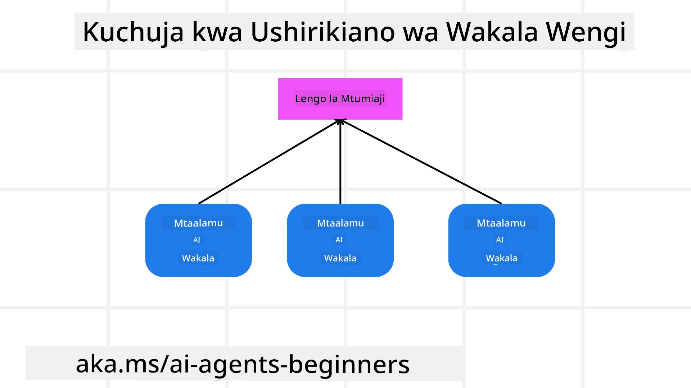

> _(Bofya picha hapo juu kutazama video ya somo hili)_

# Mitindo ya Muundo wa Mawakala Wengi

Mara tu unapoanza kufanya kazi kwenye mradi unaohusisha mawakala wengi, utahitaji kuzingatia mtindo wa muundo wa mawakala wengi. Hata hivyo, huenda haikueleweki mara moja lini kubadili kwenda kwa mawakala wengi na faida zake ni zipi.

## Utangulizi

Katika somo hili, tunatafuta kujibu maswali yafuatayo:

- Ni hali gani zinazofaa kwa matumizi ya mawakala wengi?
- Ni faida gani za kutumia mawakala wengi badala ya wakala mmoja anayefanya kazi nyingi?
- Ni vipengele gani vya msingi vya kutekeleza mtindo wa muundo wa mawakala wengi?
- Tunawezaje kupata uonekano wa jinsi mawakala wengi wanavyoshirikiana kwa kila mmoja?

## Malengo ya Kujifunza

Baada ya somo hili, unapaswa kuweza:

- Kubainisha hali zinazofaa kwa mawakala wengi.
- Kutambua faida za kutumia mawakala wengi badala ya wakala mmoja.
- Kuelewa vipengele vya msingi vya kutekeleza mtindo wa muundo wa mawakala wengi.

Picha kubwa ni nini?

*Mawakala wengi ni mtindo wa muundo unaoruhusu mawakala wengi kufanya kazi pamoja kufikia lengo moja la kawaida*.

Mtindo huu unatumiwa sana katika nyanja mbalimbali, ikiwa ni pamoja na roboti, mifumo huru, na kompyuta zilizosambazwa.

## Hali Ambazo Ma wakala Wengi Yanatumika

Kwa hiyo, ni hali gani zinafaa kwa matumizi ya mawakala wengi? Jibu ni kwamba kuna hali nyingi ambapo kutumia mawakala wengi ni faida hasa katika kesi zifuatazo:

- **Mizigo mikubwa ya kazi**: Mizigo mikubwa ya kazi inaweza kugawanywa kuwa kazi ndogo ndogo na kugawanywa kwa mawakala tofauti, hivyo kuruhusu usindikaji sambamba na kukamilika kwa haraka. Mfano wa hili ni katika kesi ya kazi kubwa ya usindikaji data.
- **Kazi ngumu**: Kazi ngumu, kama mizigo mikubwa ya kazi, zinaweza kugawanywa kuwa sehemu ndogo ndogo na kugawanywa kwa mawakala tofauti, kila mmoja akijikita katika sehemu fulani ya kazi. Mfano mzuri ni katika magari huru ambapo mawakala tofauti hushughulikia urambazaji, kugundua vikwazo, na mawasiliano na magari mengine.
- **Utaalam tofauti**: Mawakala tofauti wanaweza kuwa na utaalam tofauti, wakiruhusu kushughulikia vipengele tofauti vya kazi kwa ufanisi zaidi kuliko wakala mmoja tu. Kwa kesi hii, mfano mzuri ni katika huduma za afya ambapo mawakala wanaweza kushughulikia uchunguzi, mipango ya matibabu, na ufuatiliaji wa mgonjwa.

## Faida za Kutumia Ma wakala Wengi Badala ya Wakala Mmoja

Mfumo wa wakala mmoja unaweza kufanya kazi vizuri kwa kazi rahisi, lakini kwa kazi ngumu zaidi, kutumia mawakala wengi kunaweza kuleta faida kadhaa:

- **Utaalam mahsusi**: Kila wakala anaweza kuwa na utaalam mahsusi kwa kazi fulani. Kukosekana kwa utaalam mahsusi katika wakala mmoja kunamaanisha kuwa una wakala anayeweza kufanya kila kitu lakini anaweza kuchanganyikiwa kuhusu hatua ya kuchukua pale anapotegemea kazi ngumu. Kwa mfano, anaweza kufikia hatua ya kufanya kazi ambayo sio yeye mtaalamu bora kwake.
- **Uwezo wa kupanua**: Ni rahisi kupanua mifumo kwa kuongeza mawakala zaidi badala ya kuizidi mzigo wakala mmoja.
- **Uvumilivu wa makosa**: Ikiwa wakala mmoja atashindwa, wengine wanaweza kuendelea kufanya kazi, kuhakikisha uaminifu wa mfumo.

Tuchukue mfano, tuchukue kuweka tiketi ya safari kwa mtumiaji. Mfumo wa wakala mmoja ungebeba mzigo wote wa mchakato wa kuweka tiketi ya safari, kuanzia kutafuta ndege hadi kuhifadhi hoteli na magari ya kukodi. Ili kufanikisha hili kwa wakala mmoja, wakala angelazimika kuwa na zana za kushughulikia kazi zote hizi. Hii inaweza kusababisha mfumo mgumu na mkubwa usio rahisi kudumishwa na kupanuliwa. Mfumo wa mawakala wengi, kwa upande mwingine, ungeweza kuwa na mawakala tofauti waliobobea katika kutafuta ndege, kuhifadhi hoteli, na magari ya kukodi. Hii ingefanya mfumo kuwa rahisi, rahisi kudumisha, na wenye uwezo wa kupanuka.

Linganisheni hili na ofisi ya safari inayendeshwa kama duka dogo la familia dhidi ya ofisi ya safari inayendeshwa kama shirika la biashara. Duka dogo la familia lingekuwa na wakala mmoja anayeendesha mchakato wote wa kuweka tiketi ya safari, wakati shirika lingekuwa na mawakala tofauti wanaoshughulikia vipengele tofauti vya mchakato wa kuweka tiketi ya safari.

## Vipengele vya Msingi vya Kutekeleza Mtindo wa Muundo wa Mawakala Wengi

Kabla hujafanya utekelezaji wa mtindo wa muundo wa mawakala wengi, unahitaji kuelewa vipengele vya msingi vinavyounda mtindo huo.

Tufanye mfano huu wa kuweka tiketi ya safari kwa mtumiaji. Katika kesi hii, vipengele vya msingi vingejumuisha:

- **Mawasiliano ya Mawakala**: Mawakala wa kutafuta ndege, kuhifadhi hoteli, na magari ya kukodi wanahitaji kuwasiliana na kushirikiana habari kuhusu mapendeleo na vizuizi vya mtumiaji. Unahitaji kuamua itifaki na mbinu za mawasiliano haya. Maana yake maalum ni kwamba wakala wa kutafuta ndege anahitaji kuwasiliana na wakala wa kuhifadhi hoteli ili kuhakikisha hoteli imehifadhiwa kwa tarehe zilezile kama ndege. Hii inamaanisha mawakala wanahitaji kushiriki taarifa kuhusu tarehe za safari za mtumiaji, hiyo inamaanisha lazima uamue *mawakala gani wanashirikiana habari na jinsi wanavyoshirikiana*.
- **Mbinu za Kuratibu**: Mawakala wanahitaji kuratibu vitendo vyao ili kuhakikisha mapendeleo na vizuizi vya mtumiaji vinazingatiwa. Mapendeleo ya mtumiaji yanaweza kuwa wanataka hoteli iliyo karibu na uwanja wa ndege wakati kizuizi kinaweza kuwa magari ya kukodi yanapatikana tu uwanjani. Hii inamaanisha wakala wa kuhifadhi hoteli anahitaji kuratibu na wakala wa kuhifadhi magari ya kukodi kuhakikisha mapendeleo na vizuizi vya mtumiaji vinaheshimiwa. Hii inamaanisha lazima uamue *jinsi mawakala wanavyoratibu vitendo vyao*.
- **Mimino ya Wakala**: Mawakala wanahitaji kuwa na muundo wa ndani wa kufanya maamuzi na kujifunza kutokana na mwingiliano wao na mtumiaji. Hii inamaanisha wakala wa kutafuta ndege anahitaji kuwa na muundo wa ndani wa kufanya maamuzi kuhusu ndege gani za kupendekeza kwa mtumiaji. Hii inamaanisha lazima uamue *jinsi mawakala wanavyofanya maamuzi na kujifunza kutokana na mwingiliano wao na mtumiaji*. Mifano ya jinsi wakala anavyojifunza na kuboresha ni kama wakala wa kutafuta ndege angetumia modeli ya mashine kujifunza kupendekeza ndege kwa mtumiaji kwa kuzingatia mapendeleo yao ya awali.
- **Uonekano wa Mwingiliano wa Mawakala Wengi**: Unahitaji kuwa na uonekano wa jinsi mawakala wengi wanavyoshirikiana kwa kila mmoja. Hii inamaanisha unahitaji kuwa na zana na mbinu za kufuatilia shughuli na mwingiliano wa mawakala. Hii inaweza kuwa katika fomu ya zana za kurekodi na kufuatilia, zana za kuona picha, na vipimo vya utendaji.
- **Mitindo ya Mawakala Wengi**: Kuna mitindo mbalimbali ya kutekeleza mifumo ya mawakala wengi, kama miundo ya kati, isiyo na katikati, na mseto. Unahitaji kuamua mtindo unaofaa zaidi kwa matumizi yako.
- **Mtu ndani ya mzunguko**: Katika kesi nyingi, utakuwa na mtu ndani ya mzunguko na unahitaji kumwelekeza wakala lini waomba usaidizi wa mtu. Hii inaweza kuwa katika fomu ya mtumiaji kuomba hoteli au ndege maalum ambao mawakala hawajapendekeza au kuomba uthibitisho kabla ya kuweka tiketi ya ndege au hoteli.

## Uonekano wa Mwingiliano wa Mawakala Wengi

Ni muhimu kuwa na uonekano wa jinsi mawakala wengi wanavyoshirikiana. Uonekano huu ni muhimu kwa ugunduzi wa makosa, kuboresha, na kuhakikisha ufanisi wa mfumo mzima. Ili kufanikisha hili, unahitaji kuwa na zana na mbinu za kufuatilia shughuli na mwingiliano wa mawakala. Hii inaweza kuwa katika fomu ya zana za kurekodi na kufuatilia, zana za kuona picha, na vipimo vya utendaji.

Kwa mfano, katika kesi ya kuweka tiketi ya safari kwa mtumiaji, unaweza kuwa na dashibodi inaonyesha hali ya kila wakala, mapendeleo na vizuizi vya mtumiaji, na mwingiliano kati ya mawakala. Dashibodi hii inaweza kuonyesha tarehe za safari za mtumiaji, ndege zilizopendekezwa na wakala wa ndege, hoteli zilizopendekezwa na wakala wa hoteli, na magari ya kukodi yaliyopendekezwa na wakala wa magari ya kukodi. Hii itakupa picha wazi ya jinsi mawakala wanavyoshirikiana na kama mapendeleo na vizuizi vya mtumiaji yanakamilika.

Tuchambue kila kipengele kwa undani zaidi.

- **Zana za Kurekodi na Kufuatilia**: Unataka kurekodi kila tendo linalofanywa na wakala. Kuingia kumbukumbu kunaweza kuhifadhi taarifa kuhusu wakala aliyefanya tendo, tendo lililofanywa, wakati wa tendo, na matokeo ya tendo hilo. Taarifa hii inaweza kutumika kwa ugunduzi wa makosa, kuboresha na zaidi.
- **Zana za Kuona Picha**: Zana za kuona picha zinaweza kusaidia kuona mwingiliano kati ya mawakala kwa njia rahisi kueleweka. Kwa mfano, unaweza kuwa na mchoro unaoonyesha mtiririko wa taarifa kati ya mawakala. Hii inaweza kusaidia kubaini vikwazo, ufanisi mdogo, na matatizo mengine katika mfumo.
- **Vipimo vya Utendaji**: Vipimo vya utendaji vinaweza kusaidia kufuatilia ufanisi wa mfumo wa mawakala wengi. Kwa mfano, unaweza kufuatilia muda unaochukuliwa kukamilisha kazi, idadi ya kazi zilizokamilika kwa muda fulani, na usahihi wa mapendekezo yanayotolewa na mawakala. Taarifa hii inaweza kusaidia kubaini maeneo ya kuboresha na kuboresha mfumo.

## Mitindo ya Mawakala Wengi

Tuingie kwenye mitindo halisi tunayoweza kutumia kuunda programu za mawakala wengi. Hapa kuna mitindo kadhaa ya kuvutia inayostahili kutafakariwa:

### Gumzo la Kundi

Mtindo huu unafaa unapotaka kuunda programu ya gumzo la kundi ambapo mawakala wengi wanaweza kuwasiliana kwa kila mmoja. Matumizi ya kawaida ya mtindo huu ni ushirikiano wa timu, msaada kwa wateja, na mtandao wa kijamii.

Katika mtindo huu, kila wakala anawakilisha mtumiaji katika gumzo la kundi, na ujumbe hubadilishanwa kati ya mawakala kwa kutumia itifaki ya ujumbe. Mawakala wanaweza kutuma ujumbe kwa gumzo la kundi, kupokea ujumbe kutoka gumzo la kundi, na kujibu ujumbe kutoka kwa mawakala wengine.

Mtindo huu unaweza kutekelezwa kwa kutumia muundo wa kati ambapo ujumbe wote hupitia huduma kuu, au muundo usio na kati ambapo ujumbe hubadilishanwa moja kwa moja.

### Kuwahamishia Kazi

Mtindo huu unafaa unapotaka kuunda programu ambapo mawakala wengi wanaweza kuhamishiana kazi.

Matumizi ya kawaida ya mtindo huu ni msaada kwa wateja, usimamizi wa kazi, na otomatishaji wa mtiririko wa kazi.

Katika mtindo huu, kila wakala anawakilisha kazi au hatua katika mtiririko wa kazi, na mawakala wanaweza kuhamishiana kazi kwa mawakala wengine kulingana na sheria zilizowekwa awali.

### Kuchuja kwa Ushirikiano

Mtindo huu unafaa unapotaka kuunda programu ambapo mawakala wengi wanaweza kushirikiana kutoa mapendekezo kwa watumiaji.

Kwa nini ungependa mawakala wengi kushirikiana ni kwa sababu kila wakala anaweza kuwa na utaalam tofauti na kuweza kuchangia mchakato wa mapendekezo kwa njia tofauti.

Tuchukue mfano ambapo mtumiaji anataka mapendekezo ya hisa bora ya kununua kwenye soko la hisa.

- **Mtaalamu wa sekta**: Wakala mmoja anaweza kuwa mtaalamu katika sekta fulani.
- **Uchambuzi wa kiufundi**: Wakala mwingine anaweza kuwa mtaalamu wa uchambuzi wa kiufundi.
- **Uchambuzi wa msingi**: na wakala mwingine anaweza kuwa mtaalamu wa uchambuzi wa msingi. Kwa kushirikiana, mawakala hawa wanaweza kutoa mapendekezo kamili zaidi kwa mtumiaji.

## Mfano: Mchakato wa Kurudishiwa Fedha

Fikiria hali ambapo mteja anajaribu kupata kurudishiwa fedha kwa bidhaa, kunaweza kuwa na mawakala kadhaa yanayohusika katika mchakato huu lakini tugawe kati ya mawakala maalum ya mchakato huu na mawakala wa jumla yanayoweza kutumika katika michakato mingine.

**Mawakala maalum wa mchakato wa kurudishiwa fedha**:

Hapa chini kuna mawakala ambayo yanaweza kushirikiana katika mchakato wa kurudishiwa fedha:

- **Wakala wa mteja**: Wakala huyu anawakilisha mteja na anahusika kuanzisha mchakato wa kurudishiwa fedha.
- **Wakala wa muuzaji**: Wakala huyu anawakilisha muuzaji na anahusika kusindika kurudishiwa fedha.
- **Wakala wa malipo**: Wakala huyu anawakilisha mchakato wa malipo na anahusika kurudisha malipo kwa mteja.
- **Wakala wa utatuzi**: Wakala huyu anawakilisha mchakato wa utatuzi na anahusika kutatua matatizo yoyote yanayotokea wakati wa mchakato wa kurudishiwa fedha.
- **Wakala wa ufuataji wa sheria**: Wakala huyu anawakilisha mchakato wa ufuataji wa sheria na anahakikisha kuwa mchakato wa kurudishiwa fedha unafuata kanuni na sera.

**Mawakala wa jumla**:

Mawakala hawa wanaweza kutumika sehemu nyingine za biashara yako.

- **Wakala wa usafirishaji**: Wakala huyu anawakilisha mchakato wa usafirishaji na anahusika kusafirisha bidhaa kurudi kwa muuzaji. Wakala huyu anaweza kutumika kwa mchakato wa kurudishiwa fedha na kwa usafirishaji wa jumla wa bidhaa kwa mfano kwa manunuzi.
- **Wakala wa mrejesho**: Wakala huyu anawakilisha mchakato wa ukusanyaji wa mrejesho kutoka kwa mteja. Mrejesho unaweza kuchukuliwa wakati wowote na si tu wakati wa mchakato wa kurudishiwa fedha.
- **Wakala wa uvumbuzi wa matatizo**: Wakala huyu anawakilisha mchakato wa kupeleka matatizo kwenye ngazi ya juu ya msaada. Unaweza kutumia wakala wa aina hii kwa mchakato wowote ambapo unahitaji kuinua tatizo kwa usaidizi wa ngazi ya juu.
- **Wakala wa taarifa**: Wakala huyu anawakilisha mchakato wa kutuma taarifa kwa mteja katika hatua mbalimbali za mchakato wa kurudishiwa fedha.
- **Wakala wa uchambuzi**: Wakala huyu anawakilisha mchakato wa uchambuzi wa data zinazohusiana na mchakato wa kurudishiwa fedha.
- **Wakala wa ukaguzi**: Wakala huyu anawakilisha mchakato wa ukaguzi wa mchakato wa kurudishiwa fedha ili kuhakikisha unafanywa kwa usahihi.
- **Wakala wa ripoti**: Wakala huyu anawakilisha mchakato wa kutengeneza ripoti kuhusu mchakato wa kurudishiwa fedha.
- **Wakala wa maarifa**: Wakala huyu anawakilisha mchakato wa kudumisha hifadhidata ya maarifa kuhusu mchakato wa kurudishiwa fedha. Wakala huyu anaweza kuwa na maarifa kuhusu kurudishiwa fedha na sehemu nyingine za biashara yako.
- **Wakala wa usalama**: Wakala huyu anawakilisha mchakato wa kuhakikisha usalama wa mchakato wa kurudishiwa fedha.
- **Wakala wa ubora**: Wakala huyu anawakilisha mchakato wa kuhakikisha ubora wa mchakato wa kurudishiwa fedha.

Kuna mawakala kadhaa kama zilivyoorodheshwa hapo juu, kwa mchakato mahususi wa kurudishiwa fedha lakini pia kwa mawakala wa jumla yanayoweza kutumika sehemu nyingine za biashara yako. Tunatumaini hii inakupa wazo la jinsi unavyoweza kuamua mawakala gani ya kutumia katika mfumo wako wa mawakala wengi.

## Kazi ya Nyumbani

Buni mfumo wa mawakala wengi kwa ajili ya mchakato wa msaada kwa wateja. Bainisha mawakala yanayohusika katika mchakato, majukumu na wajibu wao, na jinsi wanavyoshirikiana kwa kila mmoja. Zingatia mawakala maalum kwa ajili ya mchakato wa msaada kwa wateja na pia mawakala wa jumla yanayoweza kutumika sehemu nyingine za biashara yako.
> Fikiria kabla hujasoma suluhisho lifuatalo, huenda ukahitaji maajenti zaidi kuliko unavyodhani.

> KIPENGELE: Fikiria kuhusu hatua tofauti za mchakato wa msaada kwa wateja na pia zingatia maajenti yanayohitajika kwa mfumo wowote.

## Suluhisho

[Suluhisho](./solution/solution.md)

## Vipimo vya Maarifa

Swali: Unapaswa kuzingatia kutumia maajenti wengi lini?

- [ ] A1: Unapokuwa na mzigo mdogo wa kazi na kazi rahisi.
- [ ] A2: Unapokuwa na mzigo mkubwa wa kazi
- [ ] A3: Unapokuwa na kazi rahisi.

[Jaribio la Suluhisho](./solution/solution-quiz.md)

## Muhtasari

Katika somo hili, tumetazama mfumo wa muundo wa maajenti wengi, pamoja na hali ambapo maajenti wengi yanatumika, faida za kutumia maajenti wengi badala ya ajenti mmoja, vipengele vya msingi vya kutekeleza mfumo wa muundo wa maajenti wengi, na jinsi ya kuwa na uwazi kuhusu jinsi maajenti wengi wanavyoingiliana kati yao.

### Una Maswali Zaidi kuhusu Mfumo wa Muundo wa Maajenti Wengi?

Jiunge na [Microsoft Foundry Discord](https://aka.ms/ai-agents/discord) kukutana na wasomaji wengine, kuhudhuria saa za ofisi na kupata majibu ya maswali yako kuhusu Maajenti wa AI.

## Rasilimali Zaidi

- <a href="https://learn.microsoft.com/azure/ai-services/agents/overview" target="_blank">Nyaraka za Mfumo wa Maajenti wa Microsoft</a>
- <a href="https://www.analyticsvidhya.com/blog/2024/10/agentic-design-patterns/" target="_blank">Mifumo ya muundo wa Agentic</a>

## Somo lililopita

[Mpango wa Muundo](../07-planning-design/README.md)

## Somo lijalo

[Metakognisheni katika Maajenti wa AI](../09-metacognition/README.md)

---

<!-- CO-OP TRANSLATOR DISCLAIMER START -->
**Kizungumkuti**:
Nyaraka hii imetafsiriwa kwa kutumia huduma ya tafsiri ya AI [Co-op Translator](https://github.com/Azure/co-op-translator). Ingawa tunajitahidi kuwa sahihi, tafadhali fahamu kwamba tafsiri za moja kwa moja zinaweza kuwa na makosa au upungufu wa usahihi. Nyaraka ya asili katika lugha yake ya asili inapaswa kuchukuliwa kama chanzo cha mamlaka. Kwa taarifa muhimu, inashauriwa kutumia tafsiri ya kitaalamu ya binadamu. Hatuna dhamana kwa kutoelewana au tafsiri potovu zitokanazo na matumizi ya tafsiri hii.
<!-- CO-OP TRANSLATOR DISCLAIMER END -->