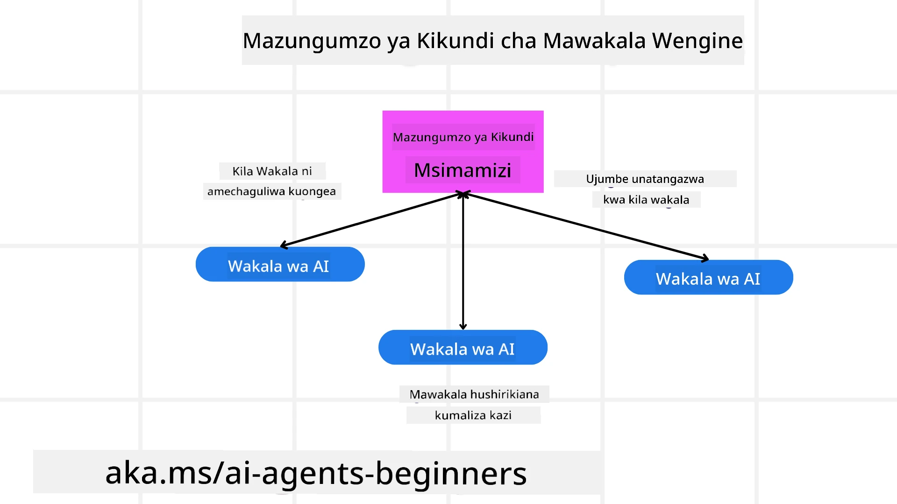
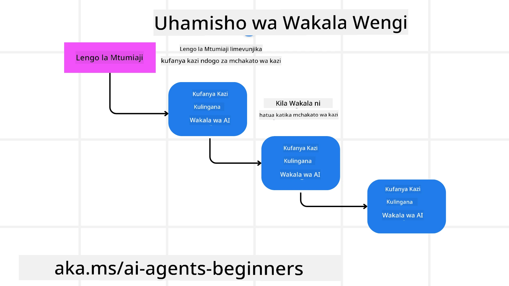
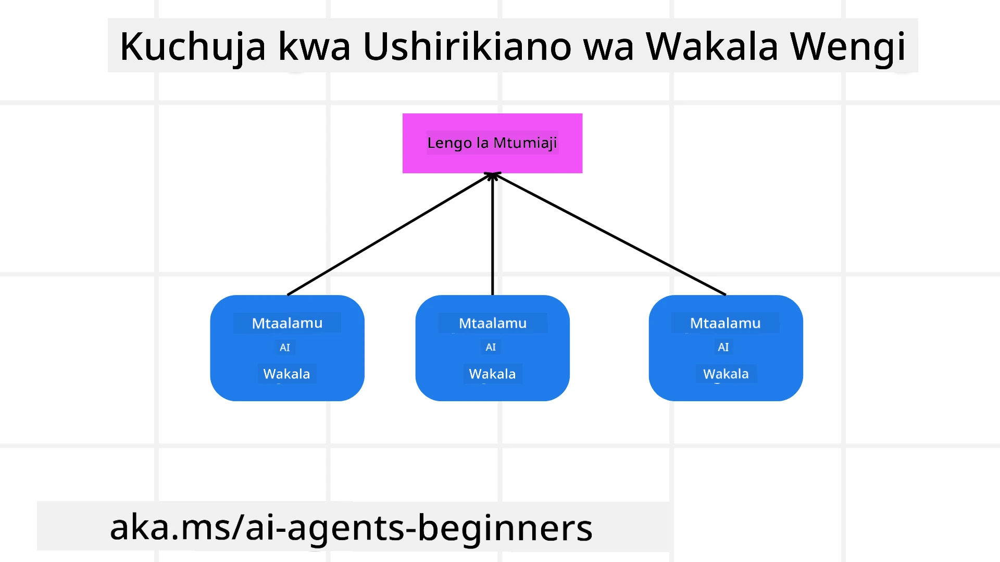

> _(Bofya picha hapo juu kutazama video ya somo hili)_

# Mifumo ya Ubunifu wa Wakala Wengi

Mara tu unapoanza kufanya kazi kwenye mradi unaohusu wakala wengi, utahitaji kuzingatia mfano wa ubunifu wa wakala wengi. Hata hivyo, huenda isiwe wazi mara moja lini kubadilisha kuwa wakala wengi na faida zake ni zipi.

## Utangulizi

Katika somo hili, tunatafuta kujibu maswali yafuatayo:

- Ni hali zipi ambapo wakala wengi wanafaa kutumika?
- Ni faida zipi za kutumia wakala wengi ikilinganishwa na wakala mmoja anayefanya kazi nyingi?
- Ni vipengele gani vya msingi vya kutekeleza mfano wa ubunifu wa wakala wengi?
- Tunawezaje kuona jinsi wakala wengi wanavyoshirikiana?

## Malengo ya Kujifunza

Baada ya somo hili, unapaswa kuwa na uwezo wa:

- Kutambua hali ambapo wakala wengi wanafaa kutumika
- Kutambua faida za kutumia wakala wengi badala ya wakala mmoja.
- Kuelewa vipengele vya msingi vya kutekeleza mfano wa ubunifu wa wakala wengi.

Picha kubwa ni nini?

*Wakala wengi ni mfano wa ubunifu unaoruhusu wakala wengi kufanya kazi pamoja kufikia lengo la pamoja*.

Mfano huu unatumika sana katika maeneo mbalimbali, ikiwa ni pamoja na roboti, mifumo isiyojitegemea, na kompyuta zilizosambazwa.

## Hali Ambazo Wakala Wengi Wanatumika

Sasa ni hali zipi zinazofaa kutumia wakala wengi? Jibu ni kwamba kuna hali nyingi ambapo kutumia wakala wengi kunafaa hasa katika kesi zifuatazo:

- **Mzigo mkubwa wa kazi**: Mzigo mkubwa wa kazi unaweza kugawanywa katika kazi ndogo ndogo na kugawanywa kwa mawakala tofauti, kuruhusu usindikaji sambamba na kukamilika kwa haraka. Mfano ni kama kazi kubwa ya usindikaji data.
- **Kazi ngumu**: Kazi ngumu, kama vile mzigo mkubwa wa kazi, inaweza kugawanywa kuwa kazi ndogo ndogo na kugawanywa kwa mawakala tofauti, kila mmoja akibobea katika sehemu maalum ya kazi. Mfano mzuri ni katika magari yanayojiendesha ambapo mawakala tofauti hushughulikia urambazaji, kugundua vizingiti, na mawasiliano na magari mengine.
- **Utaalamu tofauti**: Mawakala tofauti wanaweza kuwa na utaalamu tofauti, kuruhusu kushughulikia nyanja tofauti za kazi kwa ufanisi zaidi kuliko wakala mmoja. Kesi hii ni kama katika huduma za afya ambapo mawakala wanaweza kusimamia uchunguzi, mipango ya matibabu, na uangalizi wa mgonjwa.

## Faida za Kutumia Wakala Wengi Badala ya Wakala Mmoja

Mfumo wa wakala mmoja unaweza kufaa kwa kazi rahisi, lakini kwa kazi ngumu zaidi, kutumia mawakala wengi kunaweza kutoa faida kadhaa:

- **Utaalamu**: Kila wakala anaweza kuhitimu kwa kazi maalum. Kukosekana kwa utaalamu katika wakala mmoja kunamaanisha kuwa unayo wakala anayeweza kufanya kila kitu lakini anaweza kuchanganyikiwa kile cha kufanya pale anapokutana na kazi ngumu. Kwa mfano, anaweza kufanya kazi ambayo siyo yeye aliyehitimu zaidi kuifanya.
- **Ukuaji wa mfumo**: Ni rahisi kuongeza mawakala zaidi badala ya kuipigia mzigo mkubwa wakala mmoja.
- **Uvumilivu wa hitilafu**: Ikiwa wakala mmoja atashindwa, wengine wanaweza kuendelea kwa kutoa huduma, kuhakikisha uaminifu wa mfumo.

Tuchukue mfano, tuchukue kupanga safari kwa mtumiaji. Mfumo wa wakala mmoja ungehitaji kushughulikia kila sehemu ya mchakato wa upangaji wa safari, kuanzia kutafuta ndege hadi kuandaa hoteli na magari ya kukodisha. Ili kufanikisha hili kwa wakala mmoja, wakala huyo angehitaji zana za kushughulikia kazi zote hizi. Hii inaweza kusababisha mfumo tata na mzito ambao ni mgumu kudumisha na kukuza. Mfumo wa wakala wengi, kwa upande mwingine, unaweza kuwa na mawakala tofauti waliobobea katika kutafuta ndege, kupanga hoteli, na magari ya kukodisha. Hii ingefanya mfumo kuwa rahisi kuendeleza, kudumisha, na kukuza.

Linganisha hili na biro ya usafiri inayodhibitiwa na duka dogo la familia dhidi ya biro ya usafiri inayodhibitiwa kama shirika kubwa. Duka dogo la familia lingekuwa na wakala mmoja anayeshughulikia kila sehemu ya mchakato wa upangaji wa safari, wakati shirika kubwa lingekuwa na mawakala tofauti wakishughulikia sehemu tofauti za mchakato huo.

## Vipengele vya Msingi vya Kutekeleza Mfano wa Ubunifu wa Wakala Wengi

Kabla hujaweza kutekeleza mfano wa ubunifu wa wakala wengi, unahitaji kuelewa vipengele vya msingi vinavyoundirisha mfano huo.

Tufanye hili kuwa halisi kwa kutazama tena mfano wa kupanga safari kwa mtumiaji. Katika kesi hii, vipengele vya msingi vitajumuisha:

- **Mawasiliano ya Wakala**: Mawakala wa kutafuta ndege, kupanga hoteli, na magari ya kukodisha wanahitaji kuwasiliana na kushiriki taarifa kuhusu upendeleo na vikwazo vya mtumiaji. Unahitaji kuamua kuhusu itifaki na mbinu za mawasiliano haya. Hii inamaanisha kwa hakika kwamba wakala wa kutafuta ndege anatakiwa kuwasiliana na wakala wa kupanga hoteli kuhakikisha kuwa hoteli imehifadhiwa kwa tarehe zile zile za ndege. Hii inamaanisha mawakala wanapaswa kushirikiana taarifa kuhusu tarehe za safari za mtumiaji, yaani unapaswa kuamua *ni mawakala gani yanayoshiriki taarifa na jinsi wanavyoshirikiana*.
- **Mbinu za Uratibu**: Mawakala wanahitaji kuratibu vitendo vyao ili kuhakikisha kuwa upendeleo na vikwazo vya mtumiaji vinazingatiwa. Upendeleo wa mtumiaji unaweza kuwa wanataka hoteli karibu na uwanja wa ndege wakati kikomo kinaweza kuwa magari ya kukodisha yanapatikana tu uwanja wa ndege. Hii inamaanisha wakala wa kupanga hoteli anahitaji kuratibu na wakala wa kupanga magari ya kukodisha kuhakikisha upendeleo na vikwazo vya mtumiaji vimezingatiwa. Hii inamaanisha unapaswa kuamua *jinsi wakala wanavyoratibiana vitendo vyao*.
- **Mambo ya Ndani ya Wakala**: Mawakala wanahitaji kuwa na muundo wa ndani wa kufanya maamuzi na kujifunza kutokana na mwingiliano wao na mtumiaji. Hii inamaanisha kwamba wakala wa kutafuta ndege anahitaji kuwa na muundo ndani wa kufanya maamuzi kuhusu ndege gani kupendekeza kwa mtumiaji. Hii inamaanisha unapaswa kuamua *jinsi mawakala wanavyofanya maamuzi na kujifunza kutokana na mwingiliano wao na mtumiaji*. Mifano ya jinsi wakala anavyojifunza na kuboresha inaweza kuwa kwamba wakala wa kutafuta ndege anaweza kutumia mfano wa kujifunza mashine kupendekeza ndege kwa mtumiaji kulingana na upendeleo wa zamani.
- **Uwazi wa Mwingiliano wa Wakala Wengi**: Unahitaji kuwa na uwazi wa jinsi mawakala wengi wanavyoshirikiana. Hii inamaanisha unahitaji kuwa na zana na mbinu za kufuatilia shughuli na mwingiliano wa wakala. Hii inaweza kuwa katika njia ya zana za kuandika kumbukumbu na ufuatiliaji, zana za kuona picha, na vipimo vya utendaji.
- **Mifumo ya Wakala Wengi**: Kuna mifumo mbalimbali ya kutekeleza mifumo ya wakala wengi, kama vile miundo ya katikati, isiyo ya katikati, na mchanganyiko. Unahitaji kuamua mfumo unaofaa zaidi kwa matumizi yako.
- **Binadamu katika mzunguko**: Katika kesi nyingi, utakuwa na binadamu katika mzunguko na unahitaji kuelekeza mawakala lini waombe usaidizi wa binadamu. Hii inaweza kuwa kwa mtumiaji kuomba hoteli maalum au ndege ambayo mawakala hawajapendekeza au kuomba uthibitisho kabla ya kuhifadhi ndege au hoteli.

## Uwazi wa Mwingiliano wa Wakala Wengi

Ni muhimu kwa wewe kuwa na uwazi wa jinsi mawakala wengi wanavyoshirikiana. Uwazi huu ni muhimu kwa ajili ya kutatua hitilafu, kuboresha, na kuhakikisha ufanisi wa mfumo mzima. Ili kufanikisha hili, unahitaji kuwa na zana na mbinu za kufuatilia shughuli na mwingiliano wa wakala. Hii inaweza kuwa katika njia ya zana za kuandika kumbukumbu na ufuatiliaji, zana za kuona picha, na vipimo vya utendaji.

Kwa mfano, katika kesi ya kupanga safari kwa mtumiaji, unaweza kuwa na dashibodi inayonyesha hali ya kila wakala, upendeleo na vikwazo vya mtumiaji, na mwingiliano kati ya mawakala. Dashibodi hii inaweza kuonyesha tarehe za safari za mtumiaji, ndege zilizopendekezwa na wakala wa ndege, hoteli zilizopendekezwa na wakala wa hoteli, na magari ya kukodisha yaliyopendekezwa na wakala wa magari. Hii itakupa mwonekano wazi wa jinsi mawakala wanavyoshirikiana na kama upendeleo na vikwazo vya mtumiaji vinazingatiwa.

Tuchunguze kila moja ya haya kwa undani zaidi.

- **Zana za Kurekodi na Kufuatilia**: Unataka kurekodi kila kitendo kinachochukuliwa na wakala. Kuingia katika kumbukumbu kunaweza kuhifadhi taarifa kuhusu wakala aliyefanya kitendo, kitendo kilichofanywa, muda kilichofanywa, na matokeo ya kitendo. Taarifa hizi zinaweza kutumika kwa ajili ya kutatua hitilafu, kuboresha na zaidi.

- **Zana za Kuona Picha**: Zana za kuona picha zinaweza kusaidia kuona mwingiliano kati ya mawakala kwa njia rahisi kueleweka. Kwa mfano, unaweza kuwa na mchoro unaoonyesha mtiririko wa taarifa kati ya mawakala. Hii inaweza kusaidia kutambua vizingiti, ufanisi duni, na masuala mengine katika mfumo.

- **Vipimo vya Utendaji**: Vipimo vya utendaji vinaweza kusaidia kufuatilia ufanisi wa mfumo wa wakala wengi. Kwa mfano, unaweza kufuatilia muda unaochukuliwa kukamilisha kazi, idadi ya kazi zilizokamilika kwa wakati fulani, na usahihi wa mapendekezo yaliyotolewa na mawakala. Taarifa hizi zinaweza kusaidia kutambua maeneo ya kuboresha na kuboresha mfumo.

## Mifumo ya Wakala Wengi

Tuchunguze mifumo halisi ambayo tunaweza kutumia kuunda programu za wakala wengi. Hapa kuna mifumo ya kuvutia inayostahili kuzingatiwa:

### Gumzo la Kikundi

Mfano huu ni mzuri unapotaka kuunda programu ya gumzo la kikundi ambapo mawakala wengi wanaweza kuwasiliana kati yao. Matumizi ya kawaida ya mfano huu ni ushirikiano wa timu, msaada kwa wateja, na mtandao wa kijamii.

Katika mfano huu, kila wakala anawakilisha mtumiaji katika gumzo la kikundi, na ujumbe hubadilishana kati ya mawakala kwa kutumia itifaki ya ujumbe. Mawakala wanaweza kutuma ujumbe kwa gumzo la kikundi, kupokea ujumbe kutoka kwa gumzo la kikundi, na kujibu ujumbe kutoka kwa mawakala wengine.

Mfano huu unaweza kutekelezwa kwa kutumia muundo wa katikati ambapo ujumbe wote hupitia seva kuu, au muundo wa usambazaji ambapo ujumbe hubadilishana moja kwa moja.

### Upitisho wa Kazi

Mfano huu ni mzuri unapotaka kuunda programu ambapo mawakala wengi wanaweza kupitishana kazi.

Matumizi ya kawaida ya mfano huu ni msaada kwa wateja, usimamizi wa kazi, na ut automatishini wa mtiririko wa kazi.

Katika mfano huu, kila wakala anawakilisha kazi au hatua katika mtiririko wa kazi, na mawakala wanaweza kupitishana kazi kwa mawakala wengine kulingana na sheria zilizowekwa awali.

### Kuchuja kwa Ushirikiano

Mfano huu ni mzuri unapotaka kuunda programu ambapo mawakala wengi wanaweza kushirikiana kutoa mapendekezo kwa watumiaji.

Kwa nini ungependa mawakala wengi kushirikiana ni kwa sababu kila wakala anaweza kuwa na utaalamu tofauti na anaweza kuchangia mchakato wa mapendekezo kwa njia mbalimbali.

Tuchukue mfano ambapo mtumiaji anataka pendekezo kuhusu hisa bora ya kununua kwenye soko la hisa.

- **Mtaalamu wa Sekta:** Wakala mmoja anaweza kuwa mtaalamu katika sekta fulani.
- **Uchambuzi wa Kiufundi:** Wakala mwingine anaweza kuwa mtaalamu wa uchambuzi wa kiufundi.
- **Uchambuzi wa Msingi:** Na wakala mwingine anaweza kuwa mtaalamu wa uchambuzi wa msingi. Kwa kushirikiana, mawakala hawa wanaweza kutoa pendekezo zito zaidi kwa mtumiaji.

## Hali: Mchakato wa Marejesho

Fikiria hali ambapo mteja anajaribu kupata marejesho kwa bidhaa, kunaweza kuwa na mawakala wengi wanahusika katika mchakato huu lakini tugawe kati ya mawakala maalum kwa mchakato huu na mawakala wa jumla yanayoweza kutumika katika michakato mingine.

**Mawakala maalum kwa mchakato wa marejesho**:

Hapa kuna baadhi ya mawakala yanayoweza kuhusika katika mchakato wa marejesho:

- **Wakala wa Mteja**: Wakala huyu anawakilisha mteja na anahusika katika kuanzisha mchakato wa marejesho.
- **Wakala wa Muuzaji**: Wakala huyu anawakilisha muuzaji na anahusika katika kusindika marejesho.
- **Wakala wa Malipo**: Wakala huyu anawakilisha mchakato wa malipo na anawajibika kurudisha malipo kwa mteja.
- **Wakala wa Suluhisho**: Wakala huyu anawakilisha mchakato wa suluhisho na anahusika kutatua masuala yoyote yanayotokea wakati wa mchakato wa marejesho.
- **Wakala wa Uzifuaji**: Wakala huyu anawakilisha mchakato wa uzifuaji na anahakikisha mchakato wa marejesho unatii kanuni na sera.

**Mawakala wa Jumla**:

Mawakala hawa wanaweza kutumika katika sehemu nyingine za biashara yako.

- **Wakala wa Usafirishaji**: Wakala huyu anawakilisha mchakato wa usafirishaji na anahusika kusafirisha bidhaa kurudi kwa muuzaji. Wakala huyu anaweza kutumika kwa mchakato wa marejesho pamoja na usafirishaji wa jumla wa bidhaa kupitia ununuzi kwa mfano.
- **Wakala wa Maoni**: Wakala huyu anawakilisha mchakato wa ukusanyaji maoni na anahusika kukusanya maoni kutoka kwa mteja. Maoni yanaweza kupatikana wakati wowote na siyo tu wakati wa mchakato wa marejesho.
- **Wakala wa Kuepukia Tatizo**: Wakala huyu anawakilisha mchakato wa kupeleka masuala juu zaidi na anahusika kuongeza ngazi usaidizi wa matatizo. Unaweza kutumia aina hii ya wakala kwa mchakato wowote ambapo unahitaji kuongeza tatizo ngazi.
- **Wakala wa Taarifa**: Wakala huyu anawakilisha mchakato wa taarifa na anahusika kutuma taarifa kwa mteja katika hatua mbalimbali za mchakato wa marejesho.
- **Wakala wa Uchambuzi**: Wakala huyu anawakilisha mchakato wa uchambuzi wa data kuhusiana na mchakato wa marejesho.
- **Wakala wa Ukaguzi**: Wakala huyu anawakilisha mchakato wa ukaguzi na anahakikisha mchakato wa marejesho unafanyika kwa usahihi.
- **Wakala wa Ujenzi wa Ripoti**: Wakala huyu anawakilisha mchakato wa uandishi wa ripoti na anahusika kutengeneza ripoti juu ya mchakato wa marejesho.
- **Wakala wa Maarifa**: Wakala huyu anawakilisha mchakato wa maarifa na anahusika kudumisha hifadhidata ya maarifa kuhusiana na mchakato wa marejesho. Wakala huyu anaweza kuwa na maarifa kuhusu marejesho na sehemu nyingine za biashara yako.
- **Wakala wa Usalama**: Wakala huyu anawakilisha mchakato wa usalama na anahakikisha usalama wa mchakato wa marejesho.
- **Wakala wa Ubora**: Wakala huyu anawakilisha mchakato wa ubora na anahakikisha ubora wa mchakato wa marejesho.

Kuna mawakala mengi yaliyotajwa hapo awali, kwa mchakato maalum wa marejesho lakini pia kwa mawakala wa jumla yanayoweza kutumika sehemu nyingine za biashara yako. Natumai hii inakupa wazo juu ya jinsi unavyoweza kuamua ni mawakala gani kutumia katika mfumo wako wa wakala wengi.

## Zawadi

Tengeneza mfumo wa wakala wengi kwa ajili ya mchakato wa msaada kwa wateja. Tambua mawakala yanayohusika katika mchakato, majukumu na mshikamano wao, na jinsi wanavyoshirikiana. Zingatia mawakala maalum wa mchakato wa msaada kwa wateja na mawakala wa jumla yanayoweza kutumika sehemu nyingine za biashara yako.

> Fikiria kabla hujasoma suluhisho lifuatalo, huenda ukahitaji mawakala zaidi kuliko unavyodhani.

> USHAURI: Fikiria kuhusu hatua tofauti za mchakato wa msaada kwa wateja na pia zingatia mawakala wanaohitajika kwa mfumo wowote.

## Suluhisho

[Suluhisho](./solution/solution.md)

## Vipimo vya Maarifa

### Swali 1

Ni hali gani ni inayofaa zaidi kwa mfumo wa mawakala wengi?

- [ ] A1: Bot ya msaada inajibu maswali ya kawaida ikitumia hifadhidata moja ya maarifa na seti ndogo ya zana.
- [ ] A2: Mfumo wa urejeshaji unahitaji majukumu tofauti ya udanganyifu, malipo, na ufuatiliaji wa sheria, kila mmoja akiwa na zana zake, na matokeo yao lazima yaendeshwe kwa pamoja.
- [ ] A3: Ombi sawa la uainishaji rahisi linakuja mara elfu kila saa.

### Swali 2

Ni lini wakala mmoja kawaida ni chaguo bora zaidi?

- [ ] A1: Kazi inaweza kushughulikiwa kwa seti moja ya maagizo na zana, bila kuhamisha kwa wataalamu maalum.
- [ ] A2: Wakala ana ufikiaji wa zaidi ya zana moja.
- [ ] A3: Mchakato unahitaji majukumu tofauti yenye ruhusa tofauti na rekodi za ukaguzi huru.

[Jaribu Suluhisho](./solution/solution-quiz.md)

## Muhtasari

Katika somo hili, tumetazama muundo wa mawakala wengi, ikijumuisha hali ambazo mawakala wengi wanatumika, faida za kutumia mawakala wengi badala ya wakala mmoja, sehemu za msingi za kutekeleza muundo wa mawakala wengi, na jinsi ya kupata mwonekano wa jinsi mawakala wengi wanavyoshirikiana.

### Je, Una Maswali Zaidi Kuhusu Muundo wa Mawakala Wengi?

Jiunge na [Microsoft Foundry Discord](https://discord.com/invite/ATgtXmAS5D) ili kukutana na wasomi wengine, kuhudhuria saa za ofisi na kupata majibu ya maswali yako kuhusu Mawakala wa AI.

## Rasilimali Zaidi

- <a href="https://learn.microsoft.com/azure/ai-services/agents/overview" target="_blank">Nyaraka za Mfumo wa Mawakala wa Microsoft</a>
- <a href="https://www.analyticsvidhya.com/blog/2024/10/agentic-design-patterns/" target="_blank">Mifumo ya Ubunifu wa Mawakala</a>

## Somo Lililopita

[Mpangilio wa Ubunifu](../07-planning-design/README.md)

## Somo Linalofuata

[Metakognitioni katika Mawakala wa AI](../09-metacognition/README.md)

---

<!-- CO-OP TRANSLATOR DISCLAIMER START -->
**Kionyozo**:
Hati hii imetafsiriwa kwa kutumia huduma ya tafsiri ya AI [Co-op Translator](https://github.com/Azure/co-op-translator). Ingawa tunajitahidi kupata usahihi, tafadhali fahamu kwamba tafsiri za kiotomatiki zinaweza kuwa na makosa au upungufu wa usahihi. Hati ya asili katika lugha yake halisi inapaswa kuchukuliwa kama chanzo cha mamlaka. Kwa taarifa muhimu, tafsiri ya kitaalamu inayofanywa na binadamu inapendekezwa. Hatutojibu kwa kuelewa vibaya au tafsiri potofu zinazotokea kutokana na matumizi ya tafsiri hii.
<!-- CO-OP TRANSLATOR DISCLAIMER END -->