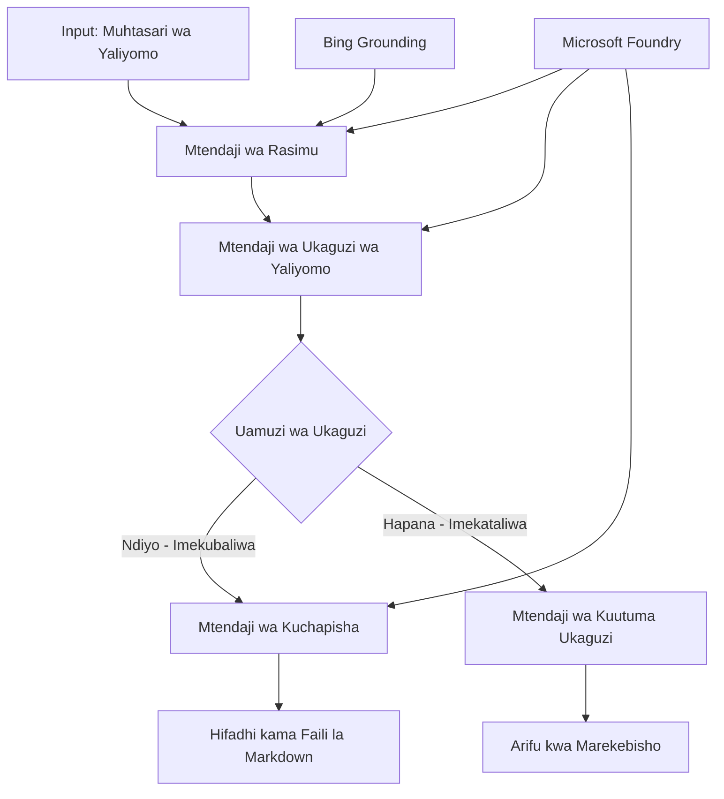

# 🔀 Miradi ya Kazi ya Mashirika kwa Masharti na Microsoft Foundry (.NET)

## 📋 Mafunzo ya Miradi ya Kazi Inayotegemea Maamuzi Angavu

Kitabu hiki cha kumbukumbu kinaonyesha **mifumo ya miradi ya kazi inayotegemea masharti** ikitumia Microsoft Foundry na Microsoft Agent Framework kwa .NET. Utajifunza jinsi ya kujenga miradi ya kazi tata, inayotegemea maamuzi, ambayo inaelekeza usindikaji kwa akili kulingana na uchambuzi wa AI, sheria za biashara, na masharti ya mabadiliko kwa usindikaji otomatiki wa kiwango cha shirika.

## 🎯 Malengo ya Kujifunza

### 🧠 **Mimino ya Maamuzi Angavu**
- **Utekelezaji wa Mantiki ya Masharti**: Jenga miti tata ya maamuzi yenye vidokezo vingi vya tundu
- **Uelekezaji wa Kuwezeshwa na AI**: Tumia mifano ya Microsoft Foundry kufanya maamuzi ya uelekezaji wenye akili
- **Marekebisho ya Miradi ya Kazi ya Mabadiliko**: Badilisha tabia ya mradi wa kazi kulingana na uchambuzi na masharti wakati wa utekelezaji
- **Uingilizaji wa Sheria za Biashara za Shirika**: Jumuisha mantiki ya biashara na mahitaji ya utekelezaji ndani ya miradi ya kazi

### 🔀 **Mifumo Ya Masharti ya Juu**
- **Uamuzi wa Vigezo Vizuri Vingi**: Tathmini sababu nyingi kwa maamuzi ya uelekezaji
- **Usindikaji Unaojua Muktadha**: Fanya maamuzi kulingana na muktadha wa mradi wa kazi na historia iliyokusanywa
- **Marekebisho ya Mradi wa Kazi Unayobadilika**: Rekebisha njia za usindikaji kulingana na masharti ya wakati halisi
- **Uingilizaji wa Injini ya Sheria**: Tekeleza injini tata za sheria za biashara ndani ya miradi ya kazi

### 🏢 **Matumizi ya Masharti ya Shirika**
- **Uainishaji wa Hati na Uelekezaji**: Tengeneza na elekeza hati kwa miradi ya kazi inayofaa kwa njia ya kiotomatiki
- **Uainishaji wa Huduma kwa Wateja**: Uelekezaji wenye akili wa maswali ya wateja kwa timu za usimamizi maalum
- **Usindikaji wa Uzingatiaji na Hatari**: Tumia michakato tofauti ya ukaguzi na ukaguzi kulingana na tathmini ya hatari
- **Miradi ya Udhibiti wa Ubora**: Elekeza maudhui kupitia michakato ya uhakiki inayofaa kulingana na vipimo vya ubora

## ⚙️ Mahitaji ya Awali & Usanidi

### 📦 **Pakiti za NuGet Zinazohitajika**

Pakiti za juu kwa usindikaji wa miradi ya kazi inayotegemea masharti:

```xml
<!-- Core AI Framework -->
<PackageReference Include="Microsoft.Extensions.AI" Version="9.9.0" />

<!-- Azure AI Agents with Persistent State -->
<PackageReference Include="Azure.AI.Agents.Persistent" Version="1.2.0-beta.5" />

<!-- Azure Identity and Utilities -->
<PackageReference Include="Azure.Identity" Version="1.15.0" />
<PackageReference Include="System.Linq.Async" Version="6.0.3" />
<PackageReference Include="DotNetEnv" Version="3.1.1" />

<!-- Local Workflow Framework References -->
<!-- Microsoft.Agents.Workflows.dll - Advanced workflow orchestration -->
<!-- Microsoft.Agents.AI.AzureAI.dll - Microsoft Foundry integration -->
<!-- Microsoft.Agents.AI.dll - Core agent abstractions -->
```

### 🔑 **Usanidi wa Microsoft Foundry**

**Rasilimali Zinazohitajika Azure:**
- Eneo la kazi la Microsoft Foundry lenye mifano ya usindikaji masharti
- Usajili wa Azure wenye viwango na idhini zinazofaa za kompyuta
- Mifano ya AI iliyotumika kwa uamuzi na uchambuzi wa maudhui
- (Hiari) Muunganisho wa Bing Search API kwa uwezo wa msingi

**Usanidi wa Mazingira (faili .env):**
```env
# Microsoft Foundry Configuration
AZURE_AI_PROJECT_ENDPOINT=https://your-project.cognitiveservices.azure.com/
BING_CONNECTION_ID=your-bing-connection-id
```

**Usanidi wa Uthibitishaji:**
```csharp
// Azure CLI or Managed Identity authentication
using Azure.Identity;
var credential = new AzureCliCredential();

// Load environment configuration
DotNetEnv.Env.Load("../../../.env");
```

### 🏗️ **Mimino ya Miradi ya Kazi Inayotegemea Masharti**



**Vipengele Muhimu:**
- **Mtendaji wa Rasimu**: Wakala wa AI anayetoa rasimu za maudhui kutoka kwa muhtasari
- **Mtendaji wa Ukaguzi wa Maudhui**: Wakala wa AI anayepima ubora na ufuataji wa rasimu
- **Uelekezaji Masharti**: Mantiki ya maamuzi inayongoza kulingana na matokeo ya ukaguzi
- **Njia za Kuchapisha/Uhakiki**: Njia tofauti za usindikaji kwa maudhui yaliyoidhinishwa dhidi ya yale yaliyokataliwa
- **Usimamizi wa Hali**: Hushikilia muktadha wa maudhui na ukaguzi katika mradi wa kazi

## 🎨 **Mifumo ya Ubunifu ya Miradi ya Kazi Inayotegemea Masharti**

### 📋 **Uzalishaji wa Maudhui na Mizunguko ya Ubora**
```
Outline → Draft Creation → Quality Review → {Approve: Publish | Reject: Revise}
```

### 🎯 **Usindikaji wa Hati Kutegemea Hatari**
```
Document → Risk Assessment → {Low: Standard | High: Enhanced Review}
```

### 🔍 **Uelekezaji wa Huduma kwa Wateja Unayojua Kitendawili**
```
Customer Query → Analysis → {Simple: FAQ Bot | Complex: Human Agent}
```

### 💼 **Miradi ya Kazi Inayotegemea Uzingatiaji**
```
Content → Compliance Check → {Pass: Publish | Fail: Legal Review}
```

## 🏢 **Faida za Masharti za Shirika**

### 🎯 **Otomatiki Angavu**
- **Maamuzi Mahiri**: Maamuzi ya uelekezaji yanayofanywa na AI kulingana na uchambuzi wa maudhui na muktadha
- **Usindikaji Unaobadilika**: Miradi ya kazi inayobadilika kiotomatiki kulingana na mabadiliko ya masharti
- **Utekaji Sheria za Biashara**: Matumizi ya moja kwa moja ya mantiki tata ya biashara na sera
- **Uelekezaji Unaojua Muktadha**: Maamuzi yanayotegemea historia kamili ya mradi wa kazi na muktadha uliokusanywa

### 📈 **Ubora wa Uendeshaji**
- **Ugawaji Bora wa Rasilimali**: Elekeza kazi kwa wataalamu na michakato inayofaa zaidi
- **Kupunguzwa kwa Mwitikio wa Mtu**: Maamuzi ya kiotomatiki hupunguza hitaji la uelekezaji wa binadamu
- **Muda Mfupi wa Ukomavu**: Uelekezaji wa moja kwa moja kwa utaalamu na uwezo wa usindikaji unaofaa
- **Matumizi Yenye Ulinganifu**: Matumizi ya kawaida ya sheria za biashara na vigezo vya maamuzi

### 🛡️ **Usimamizi wa Hatari & Uzingatiaji**
- **Tathmini Otomatiki ya Hatari**: Tathmini ya viwango vya hatari ya maudhui na hali kwa nguvu ya AI
- **Utekaji wa Uzingatiaji**: Uelekezaji wa moja kwa moja kupitia michakato ya sheria inayohitajika
- **Matumizi ya Itifaki za Usalama**: Hatua za usalama zilizoboreshwa zinazotegemea tathmini ya hatari
- **Uendeshaji wa Rikodi za Ukaguzi**: Uandikishaji kamili wa maamuzi ya uelekezaji na sababu zake

### 📊 **Uchambuzi & Uboreshaji Endelevu**
- **Uchambuzi wa Maamuzi**: Fuata ufanisi na usahihi wa maamuzi ya uelekezaji
- **Utambuzi wa Mifumo**: Tambua mwenendo na mifumo ya maamuzi ya uelekezaji kwa wakati
- **Uboreshaji wa Utendaji**: Uboreshaji endelevu wa vigezo vya maamuzi na ufanisi wa uelekezaji
- **Akili ya Biashara**: Maarifa juu ya sifa za maudhui na mahitaji ya usindikaji

### 🔧 **Ubora wa Kiufundi**
- **Usimamizi Endelevu wa Hali**: Dumisha hali tata katika utekelezaji wa mradi wa kazi
- **Mimino Inayoweza Kupanuka**: Shiriki mahitaji ya usindikaji wa masharti kwa kiasi kikubwa
- **Uwezo wa Uingiliano**: Uingiliano rahisi na mifumo na michakato ya biashara iliyopo
- **Ufuatiliaji & Utambuzi**: Ufuatiliaji wa kina wa utendaji wa mradi wa kazi na maamuzi

Hebu tujenge miradi ya kazi ya shirika yenye maamuzi mahiri na `.NET`! 🚀

## 💻 Kutekeleza Msimbo

Utekelezaji kamili upo kwenye `04.dotnet-agent-framework-workflow-aifoundry-condition.cs`. Huu unaonyesha **mradi wa uzalishaji wa maudhui wenye milango ya ubora**:

### 🏗️ **Mimino ya Mradi wa Kazi**

```
Content Outline → Draft Creation → Quality Review → Conditional Routing:
                                                      ├─ Approved (>200 words) → Publish
                                                      └─ Rejected (<200 words) → Review Notification
```

**Wakala katika Mradi wa Kazi:**
1. **Wakala wa Mhubiri**: Huunda rasimu za somo zikianzia kwa muhtasari na msingi wa Bing
2. **Wakala wa Mhakiki wa Maudhui**: Huangalia ubora wa rasimu (idadi ya maneno, ukamilifu)
3. **Wakala wa Mchapishaji**: Huhifadhi maudhui yaliyoidhinishwa kama faili za Markdown zenye tarehe

**Watendaji Maalum:**
1. **DraftExecutor**: Huandaa mchakato wa kutengeneza rasimu
2. **ContentReviewExecutor**: Hufanya tathmini ya ubora
3. **PublishExecutor**: Hudhibiti uchapishaji wa maudhui yaliyothibitishwa
4. **SendReviewExecutor**: Husimamia taarifa za maudhui yaliyokataliwa

### 🚀 Kuendesha Mfano

**Mahitaji ya Awali:**
- Eneo la kazi la Microsoft Foundry limeandaliwa
- Uthibitishaji wa Azure CLI (`az login`)
- (Hiari) Muunganisho wa Bing Search kwa msingi

```bash
# Fanya script iweze kutekelezwa (Unix/Linux/macOS)
chmod +x 04.dotnet-agent-framework-workflow-aifoundry-condition.cs

# Endesha mchakato wa masharti
./04.dotnet-agent-framework-workflow-aifoundry-condition.cs
```

Au kwenye Windows:
```powershell
dotnet run 04.dotnet-agent-framework-workflow-aifoundry-condition.cs
```

### 📝 Matokeo Yanayotarajiwa

Mradi wa kazi utafanya:
1. **Kuunda Wakala**: Anzisha mawakala watatu maalum wa Microsoft Foundry
2. **Kuunda Rasimu**: Wakala wa mhubiri huunda rasimu ya somo kutoka muhtasari
3. **Kukagua Maudhui**: Mhakiki wa maudhui hupima ubora wa rasimu
4. **Uelekezaji wa Masharti**:
   - **Ikiidhinishwa (>maneno 200)**: Mtendaji wa uchapishaji huhifadhi kama faili la Markdown
   - **Ikiyekataliwa (<maneno 200)**: Taarifa ya ukaguzi hutumwa
5. **Onyesha Matokeo**: Onyesha matokeo ya mwisho ya mradi wa kazi

### 🔧 Chaguzi za Ubinafsishaji

**Badilisha Vigezo vya Ukaguzi:**
```csharp
const string ContentReviewerInstructions = @"
You are a content reviewer...
1. Check if content is more than 500 words (instead of 200)
2. Verify technical accuracy
3. Ensure proper formatting
...";
```

**Ongeza Njia Zaidi za Masharti:**
```csharp
var workflow = new WorkflowBuilder(draftExecutor)
    .AddEdge(draftExecutor, contentReviewerExecutor)
    .AddEdge(contentReviewerExecutor, publishExecutor, condition: GetCondition("Excellent"))
    .AddEdge(contentReviewerExecutor, editExecutor, condition: GetCondition("Good"))
    .AddEdge(contentReviewerExecutor, sendReviewerExecutor, condition: GetCondition("Poor"))
    .Build();
```

**Badilisha Mahitaji ya Maudhui:**
```csharp
string OUTLINE_Content = @"
# Your Custom Topic
## Section 1
https://your-reference-url
## Section 2
...
";
```

### 🎯 Matumizi Halisi

Mfano huu wa mradi wa kazi una masharti unafaa kwa:
- **Mifumo ya Usimamizi wa Maudhui**: Miradi ya kazi ya uhariri otomatiki yenye milango ya ubora
- **Usindikaji wa Hati**: Elekeza hati kulingana na uainishaji na utekelezaji
- **Huduma kwa Wateja**: Uelekezaji mahiri wa tiketi kulingana na ugumu na haraka
- **Uhakiki wa Kisheria**: Elekeza mkataba kulingana na tathmini ya hatari na thamani
- **Michakato ya HR**: Elekeza maombi kupitia miradi ya kazi ya uchunguzi inayofaa

### 🔍 Kujifunza Mantiki ya Masharti

**Kazi ya Masharti:**
```csharp
public Func<object?, bool> GetCondition(string expectedResult) =>
    reviewResult => reviewResult is ReviewResult review && review.Result == expectedResult;
```

Kazi hii huunda kichunguzi ambacho:
1. Huchunguza kama matokeo ni ya aina `ReviewResult`
2. Hulinganisha mali `Result` na thamani inayotegemewa
3. Hurudisha kweli/sheli ili kuamua njia ya uelekezaji

**Miisho ya Mradi wa Kazi na Masharti:**
```csharp
.AddEdge(contentReviewerExecutor, publishExecutor, condition: GetCondition("Yes"))
.AddEdge(contentReviewerExecutor, sendReviewerExecutor, condition: GetCondition("No"))
```

### 📊 Vipengele vya Juu

**Uthibitishaji wa Mchezo wa JSON:**
Mradi wa kazi hutumia michezo ya JSON kuhakikisha majibu yamepangwa:

```csharp
// Define response structure
public class ReviewResult
{
    [JsonPropertyName("review_result")]
    public string Result { get; set; } = string.Empty;
    
    [JsonPropertyName("reason")]
    public string Reason { get; set; } = string.Empty;
    
    [JsonPropertyName("draft_content")]
    public string DraftContent { get; set; } = string.Empty;
}

// Apply to agent
ResponseFormat = ChatResponseFormat.ForJsonSchema(
    AIJsonUtilities.CreateJsonSchema(typeof(ReviewResult)), 
    "ReviewResult", 
    "Review Result From DraftContent"
)
```

**Uingilizi wa Msingi wa Bing:**
Wakala wa Mhubiri hutumia msingi wa Bing kupata taarifa za wakati halisi:

```csharp
var bingGroundingConfig = new BingGroundingSearchConfiguration(bing_conn_id);
BingGroundingToolDefinition bingGroundingTool = new(
    new BingGroundingSearchToolParameters([bingGroundingConfig])
);
```

Hii inamruhusu wakala kufuata URL ndani ya muhtasari na kutoa taarifa za sasa.

### 🛡️ Usimamizi wa Makosa

Mradi wa kazi una usimamizi thabiti wa makosa kwa maudhui yaliyokataliwa:
- Kushindwa kwa ukaguzi huanzisha njia mbadala
- Taarifa zinatoa sababu za kukataa kwa uwazi
- Maudhui huhifadhiwa kwa marekebisho ya baadaye

### 🔄 Kuongeza Mradi wa Kazi

**Ongeza Mzunguko wa Marekebisho:**
Unda mzunguko wa maoni unaoandaa tena maudhui moja kwa moja:

```csharp
.AddEdge(contentReviewerExecutor, publishExecutor, condition: GetCondition("Yes"))
.AddEdge(contentReviewerExecutor, draftExecutor, condition: GetCondition("No")) // Loop back
```

**Tekeleza Ukaguzi wa Ngazi Nyingi:**
Ongeza hatua nyingi za ukaguzi zenye vigezo tofauti:

```csharp
.AddEdge(draftExecutor, technicalReviewer)
.AddEdge(technicalReviewer, editorialReviewer, condition: GetCondition("TechPass"))
.AddEdge(editorialReviewer, publishExecutor, condition: GetCondition("EditPass"))
```

Mfano huu wa miradi ya kazi masharti hutoa msingi wa kujenga mifumo tata, ya otomatiki yenye akili kwa mashirika! 🚀

---

<!-- CO-OP TRANSLATOR DISCLAIMER START -->
**Kionyozo**:
Hati hii imetafsiriwa kwa kutumia huduma ya tafsiri ya AI [Co-op Translator](https://github.com/Azure/co-op-translator). Ingawa tunajitahidi kupata usahihi, tafadhali fahamu kwamba tafsiri za kiotomatiki zinaweza kuwa na makosa au upungufu wa usahihi. Hati ya asili katika lugha yake halisi inapaswa kuchukuliwa kama chanzo cha mamlaka. Kwa taarifa muhimu, tafsiri ya kitaalamu inayofanywa na binadamu inapendekezwa. Hatutojibu kwa kuelewa vibaya au tafsiri potofu zinazotokea kutokana na matumizi ya tafsiri hii.
<!-- CO-OP TRANSLATOR DISCLAIMER END -->