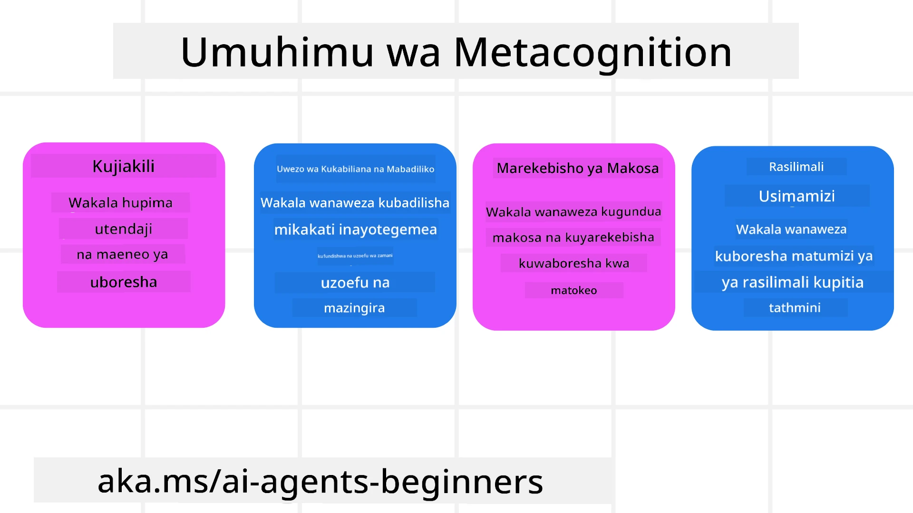
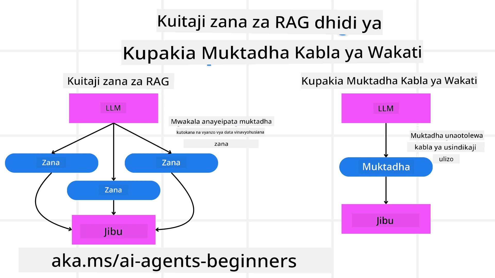

[](https://youtu.be/His9R6gw6Ec?si=3_RMb8VprNvdLRhX)

> _(Bonyeza picha iliyo juu kutazama video ya somo hili)_
# Metakognition katika Wakala wa AI

## Utangulizi

Karibu kwenye somo la metakognition katika wakala wa AI! Sura hii imebuniwa kwa ajili ya wanaoanza ambao wana hamu ya kujua jinsi wakala wa AI wanavyoweza kufikiri kuhusu mchakato wao wa kufikiri. Mwisho wa somo hili, utaelewa dhana kuu na utakuwa na mifano ya vitendo ya kutumia metakognition katika muundo wa wakala wa AI.

## Malengo ya Kujifunza

Baada ya kumaliza somo hili, utaweza:

1. Kuelewa athari za mizunguko ya fikira katika ufafanuzi wa wakala.
2. Kutumia mbinu za kupanga na kutathmini kusaidia wakala kujirekebisha wenyewe.
3. Kuunda wakala wako mwenyewe anayeweza kuendesha msimbo ili kufanikisha kazi.

## Utangulizi wa Metakognition

Metakognition inahusu michakato ya juu ya kifikra inayohusisha kufikiri kuhusu fikira yako mwenyewe. Kwa wakala wa AI, hii inamaanisha kuwa na uwezo wa kutathmini na kurekebisha matendo yao kulingana na uelewa wa kibinafsi na uzoefu wa zamani. Metakognition, au "kufikiri kuhusu kufikiri," ni dhana muhimu katika maendeleo ya mifumo ya AI yenye wakala. Inahusisha mifumo ya AI kujua mchakato yao wa ndani na kuwa na uwezo wa kufuatilia, kudhibiti, na kubadilisha tabia zao ipasavyo. Kama tunavyofanya tunapochambua hali au kuona shida. Uelewa huu wa kibinafsi unaweza kusaidia mifumo ya AI kufanya maamuzi bora, kubaini makosa, na kuboresha utendaji wao kwa muda - tena kuhusiana na jaribio la Turing na mjadala kuhusu AI kuikalia dunia.

Katika muktadha wa mifumo ya AI yenye wakala, metakognition inaweza kusaidia kushughulikia changamoto kadhaa, kama vile:
- Uwazi: Kuhakikisha kwamba mifumo ya AI inaweza kueleza sababu na maamuzi yake.
- Fikra: Kuongeza uwezo wa mifumo ya AI kusintetiza taarifa na kufanya maamuzi yenye mantiki.
- Kubadilika: Kuruhusu mifumo ya AI kubadilika kulingana na mazingira mapya na hali zinazo badilika.
- Uelewa wa Mazingira: Kuboresha usahihi wa mifumo ya AI katika kutambua na kufasiri data kutoka mazingira yao.

### Metakognition ni Nini?

Metakognition, au "kufikiri kuhusu kufikiri," ni mchakato wa juu wa kifikra unaohusisha uelewa wa kibinafsi na udhibiti wa mchakato wa fikira wako mwenyewe. Katika ulimwengu wa AI, metakognition humuwezesha wakala kutathmini na kubadilisha mikakati na matendo yao, na kusababisha uwezo bora wa kutatua matatizo na kufanya maamuzi. Kwa kuelewa metakognition, unaweza kubuni wakala wa AI ambao si tu wenye busara zaidi bali pia zinazoweza kubadilika na kuwa na ufanisi zaidi. Katika metakognition halisi, utaona AI ikitafuta maana za fikra zake mwenyewe waziwazi.

Mfano: “Nilipa kipaumbele kwa ndege za bei nafuu kwa sababu… Huenda nikipoteza ndege za moja kwa moja, hivyo nairudie tena ukaguzi.”.
Kufuatilia jinsi au kwa nini ilichagua njia fulani.
- Kutambua kuwa ilifanya makosa kwa sababu ilitegemea sana mapendeleo ya mtumiaji kutoka mara ya mwisho, hivyo hubadilisha mkakati wa kufanya maamuzi siyo tu mapendekezo ya mwisho.
- Kubaini mifumo kama, “Kila ninapoona mtumiaji akitaja ‘foleni nyingi,’ siyo tu kuondoa vivutio fulani bali pia kutafakari kuwa mbinu yangu ya kuchagua ‘vivutio bora’ ni potofu ikiwa kila mara ninaorodhesha kwa umaarufu.”

### Umuhimu wa Metakognition katika Wakala wa AI

Metakognition ina nafasi muhimu katika muundo wa wakala wa AI kwa sababu kadhaa:



- Kujitathmini: Wakala wanaweza kutathmini utendaji wao na kubaini maeneo ya kuboresha.
- Kubadilika: Wakala wanaweza kubadilisha mikakati yao kulingana na uzoefu wa zamani na mazingira yanayobadilika.
- Kujirekebisha Makosa: Wakala wanaweza kugundua na kurekebisha makosa kwa kujitegemea, kuleta matokeo sahihi zaidi.
- Usimamizi wa Rasilimali: Wakala wanaweza kuboresha matumizi ya rasilimali kama vile muda na nguvu za kompyuta kwa kupanga na kutathmini matendo yao.

## Vipengele vya Wakala wa AI

Kabla ya kuingia kwenye michakato ya metakognition, ni muhimu kuelewa vipengele vya msingi vya wakala wa AI. Wakala wa AI kawaida huwa na:

- Tabia: Haiba na sifa za wakala, zinazobainisha jinsi anavyoshirikiana na watumiaji.
- Zana: Uwezo na kazi ambazo wakala anaweza kutekeleza.
- Ujuzi: Maarifa na utaalamu ambao wakala anamiliki.

Vipengele hivi hufanya kazi pamoja kuunda "kikundi cha utaalamu" kinachoweza kutekeleza kazi maalum.

**Mfano**:
Fikiria wakala wa usafiri, huduma za wakala ambao si tu kupanga likizo yako bali pia kubadilisha njia yake kulingana na data ya wakati halisi na uzoefu wa safari za wateja wa zamani.

### Mfano: Metakognition katika Huduma ya Wakala wa Usafiri

Fikiria unabuni huduma ya wakala wa usafiri inayoendeshwa na AI. Wakala huyu, "Wakala wa Usafiri," husaidia watumiaji kupanga likizo zao. Ili kuingiza metakognition, Wakala wa Usafiri anahitaji kutathmini na kurekebisha matendo yake kulingana na uelewa wa kibinafsi na uzoefu wa zamani. Hapa ni jinsi metakognition inaweza kuwa na nafasi:

#### Kazi ya Sasa

Kazi ya sasa ni kusaidia mtumiaji kupanga safari kwenda Paris.

#### Hatua za Kumaliza Kazi

1. **Kusanya Mapendeleo ya Mtumiaji**: Muulize mtumiaji kuhusu tarehe za safari, bajeti, maslahi (mfano, madaraja, vyakula, ununuzi), na mahitaji maalum.
2. **Pata Taarifa**: Tafuta chaguo za ndege, malazi, vivutio, na migahawa inayolingana na mapendeleo ya mtumiaji.
3. **Tengeneza Mapendekezo**: Toa ratiba ya kibinafsi yenye maelezo ya ndege, uhifadhi wa hoteli, na shughuli zilizo pendekezwa.
4. **Badilisha Kulingana na Maoni**: Muulize mtumiaji maoni juu ya mapendekezo na fanya marekebisho yanayohitajika.

#### Rasilimali Zinazohitajika

- Ufikiaji wa vyanzo vya kuhifadhi na kuagiza tiketi za ndege na hoteli.
- Taarifa juu ya vivutio na migahawa ya Paris.
- Data ya maoni ya mtumiaji kutoka kwa mwingiliano wa awali.

#### Uzoefu na Kujitathmini

Wakala wa Usafiri hutumia metakognition kutathmini utendaji wake na kujifunza kutokana na uzoefu wa zamani. Kwa mfano:

1. **Kuchambua Maoni ya Mtumiaji**: Wakala wa Usafiri hupitia maoni ya mtumiaji kuona mapendekezo gani yalipokelewa vyema na yapi hayakuwa. Hubadilisha mapendekezo yake ya baadaye ipasavyo.
2. **Kubadilika**: Ikiwa mtumiaji ameonyesha awali kutoridhishwa na sehemu zilizojaa watu, Wakala wa Usafiri atajiepusha kupendekeza vivutio maarufu wakati wa msongamano.
3. **Kurekebisha Makosa**: Ikiwa Wakala wa Usafiri alifanya kosa kwenye uhifadhi wa awali, kama kupendekeza hoteli iliyojaza, anakua kujiepusha na hilo kwa ukaguzi wa kina kabla ya kutoa mapendekezo.

#### Mfano wa Mtengenezaji wa Vitendo

Hapa ni mfano uliorahisishwa wa jinsi msimbo wa Wakala wa Usafiri unavyoweza kuonekana unapojiingiza metakognition:

```python
class Travel_Agent:
    def __init__(self):
        self.user_preferences = {}
        self.experience_data = []

    def gather_preferences(self, preferences):
        self.user_preferences = preferences

    def retrieve_information(self):
        # Tafuta ndege, hoteli, na vivutio kwa misingi ya mapendeleo
        flights = search_flights(self.user_preferences)
        hotels = search_hotels(self.user_preferences)
        attractions = search_attractions(self.user_preferences)
        return flights, hotels, attractions

    def generate_recommendations(self):
        flights, hotels, attractions = self.retrieve_information()
        itinerary = create_itinerary(flights, hotels, attractions)
        return itinerary

    def adjust_based_on_feedback(self, feedback):
        self.experience_data.append(feedback)
        # Changanua maoni na rekebisha mapendekezo ya baadaye
        self.user_preferences = adjust_preferences(self.user_preferences, feedback)

# Mfano wa matumizi
travel_agent = Travel_Agent()
preferences = {
    "destination": "Paris",
    "dates": "2025-04-01 to 2025-04-10",
    "budget": "moderate",
    "interests": ["museums", "cuisine"]
}
travel_agent.gather_preferences(preferences)
itinerary = travel_agent.generate_recommendations()
print("Suggested Itinerary:", itinerary)
feedback = {"liked": ["Louvre Museum"], "disliked": ["Eiffel Tower (too crowded)"]}
travel_agent.adjust_based_on_feedback(feedback)
```

#### Kwa Nini Metakognition ni Muhimu

- **Kujitathmini:** Wakala wanaweza kuchambua utendaji wao na kubaini maeneo ya kuboresha.
- **Kubadilika:** Wakala wanaweza kubadilisha mikakati yao kulingana na maoni na mabadiliko ya hali.
- **Kurekebisha Makosa:** Wakala wanaweza kugundua na kurekebisha makosa kwa kujitegemea.
- **Usimamizi wa Rasilimali:** Wakala wanaweza kuboresha matumizi ya rasilimali, kama vile muda na nguvu za kompyuta.

Kwa kuingiza metakognition, Wakala wa Usafiri anaweza kutoa mapendekezo ya usafiri yaliyobinafsishwa na sahihi zaidi, kuboresha uzoefu wa mtumiaji kwa ujumla.

---

## 2. Kupanga katika Wakala

Kupanga ni kipengele muhimu katika tabia ya wakala wa AI. Inahusisha kupanga hatua zinazohitajika kufikia lengo, kwa kuzingatia hali ya sasa, rasilimali, na vikwazo vinavyowezekana.

### Vipengele vya Kupanga

- **Kazi ya Sasa:** Eleza kazi kwa uwazi.
- **Hatua za Kumaliza Kazi:** Gawanya kazi kwenye hatua ndogo zinazoendeshwa.
- **Rasilimali Zinazohitajika:** Tambua rasilimali zinazohitajika.
- **Uzoefu:** Tumia uzoefu wa zamani kuelimisha mipango.

**Mfano**:
Hapa ni hatua ambazo Wakala wa Usafiri anahitaji kuchukua kusaidia mtumiaji kupanga safari yao kwa ufanisi:

### Hatua kwa Wakala wa Usafiri

1. **Kusanya Mapendeleo ya Mtumiaji**
   - Muulize mtumiaji kuhusu tarehe zao za kusafiri, bajeti, maslahi, na mahitaji maalum.
   - Mifano: "Una mpango wa kusafiri lini?" "Je, bajeti yako ni kiasi gani?" "Nini shughuli unazopendelea wakati wa likizo?"

2. **Pata Taarifa**
   - Tafuta chaguo zinazofaa kulingana na mapendeleo ya mtumiaji.
   - **Ndege:** Tafuta ndege zinazopatikana ndani ya bajeti na tarehe zilizopendekezwa.
   - **Malazi:** Tafuta hoteli au mali za kukodisha zinazolingana na mahitaji ya mtumiaji kwa mahali, bei, na huduma.
   - **Vivutio na Migahawa:** Tambua vivutio maarufu, shughuli, na migahawa inayolingana na maslahi ya mtumiaji.

3. **Tengeneza Mapendekezo**
   - Kusanya taarifa zilizopatikana kwenye ratiba ya kibinafsi.
   - Toa maelezo kama vile chaguo za ndege, uhifadhi wa hoteli, na shughuli zilizo pendekezwa, kuhakikisha mapendekezo yanalingana na mahitaji ya mtumiaji.

4. **Wasilisha Ratiba kwa Mtumiaji**
   - Shiriki ratiba iliyopendekezwa kwa mtumiaji kwa ajili ya mapitio yao.
   - Mfano: "Hii ni ratiba iliyo pendekezwa kwa safari yako ya Paris. Inajumuisha maelezo ya ndege, uhifadhi wa hoteli, na orodha ya shughuli na migahawa iliyopendekezwa. Niambie maoni yako!"

5. **Kusanya Maoni**
   - Muulize mtumiaji maoni juu ya ratiba iliyopendekezwa.
   - Mifano: "Je, unapenda chaguo za ndege?" "Je, hoteli inafaa kwa mahitaji yako?" "Kuna shughuli zozote ungependa kuongeza au kuondoa?"

6. **Badilisha Kulingana na Maoni**
   - Rekebisha ratiba kulingana na maoni ya mtumiaji.
   - Fanya mabadiliko muhimu kwenye mapendekezo ya ndege, mali ya malazi, na shughuli ili kuendana na mahitaji ya mtumiaji.

7. **Uthibitisho wa Mwisho**
   - Wasilisha ratiba iliyosasishwa kwa mtumiaji kwa uthibitisho wa mwisho.
   - Mfano: "Nimefanya marekebisho kulingana na maoni yako. Hii ni ratiba iliyosasishwa. Je, yote yanaonekana sawa kwako?"

8. **Fanya Uhifadhi na Uthibitishe**
   - Baada ya mtumiaji kuidhinisha ratiba, endelea na kuhifadhi ndege, malazi, na shughuli zilizopangwa.
   - Tuma maelezo ya uthibitisho kwa mtumiaji.

9. **Toa Msaada Endelevu**
   - Kuendelea kuwa tayari kuwasaidia watumiaji kwa mabadiliko au maombi ya ziada kabla na wakati wa safari yao.
   - Mfano: "Kama unahitaji msaada wowote zaidi wakati wa safari yako, jisikie huru kunifikia wakati wowote!"

### Mfano wa Mwingiliano

```python
class Travel_Agent:
    def __init__(self):
        self.user_preferences = {}
        self.experience_data = []

    def gather_preferences(self, preferences):
        self.user_preferences = preferences

    def retrieve_information(self):
        flights = search_flights(self.user_preferences)
        hotels = search_hotels(self.user_preferences)
        attractions = search_attractions(self.user_preferences)
        return flights, hotels, attractions

    def generate_recommendations(self):
        flights, hotels, attractions = self.retrieve_information()
        itinerary = create_itinerary(flights, hotels, attractions)
        return itinerary

    def adjust_based_on_feedback(self, feedback):
        self.experience_data.append(feedback)
        self.user_preferences = adjust_preferences(self.user_preferences, feedback)

# Mfano wa matumizi ndani ya ombi la kubooa
travel_agent = Travel_Agent()
preferences = {
    "destination": "Paris",
    "dates": "2025-04-01 to 2025-04-10",
    "budget": "moderate",
    "interests": ["museums", "cuisine"]
}
travel_agent.gather_preferences(preferences)
itinerary = travel_agent.generate_recommendations()
print("Suggested Itinerary:", itinerary)
feedback = {"liked": ["Louvre Museum"], "disliked": ["Eiffel Tower (too crowded)"]}
travel_agent.adjust_based_on_feedback(feedback)
```

## 3. Mfumo wa RAG wa Kurekebisha

Kwanza, tuanze kwa kuelewa tofauti kati ya Zana ya RAG na Upakiaji wa Muktadha wa Mapema



### Uzalishaji Unaoungizwa na Urejeshaji (RAG)

RAG huunganisha mfumo wa kupata taarifa na mfano wa uzalishaji. Wakati swali linapo ulizwa, mfumo wa kupata taarifa huchukua nyaraka au data inayofaa kutoka chanzo cha nje, na taarifa hii hutumika kuongeza maelezo kwa mfano wa uzalishaji. Hii husaidia mfano kutoa majibu sahihi na yanayofaa katika muktadha.

Katika mfumo wa RAG, wakala anapata taarifa muhimu kutoka kwa msingi wa maarifa na kuitumia kutoa majibu au hatua zinazofaa.

### Mbinu ya RAG ya Kurekebisha

Mbinu ya RAG ya Kurekebisha inalenga kutumia mbinu za RAG kurekebisha makosa na kuboresha usahihi wa wakala wa AI. Hii inajumuisha:

1. **Mbinu ya Kuhamasisha:** Kutumia maswali maalum kuelekeza wakala katika kupata taarifa inayofaa.
2. **Zana:** Kutekeleza algoriti na mifumo inayowawezesha wakala kutathmini umuhimu wa taarifa zilizopatikana na kutoa majibu sahihi.
3. **Tathmini:** Kuendelea kutathmini utendaji wa wakala na kufanya marekebisho ili kuboresha usahihi na ufanisi wake.

#### Mfano: RAG ya Kurekebisha katika Wakala wa Utafutaji

Fikiria wakala wa utafutaji anayepata taarifa kutoka mtandao kujibu maswali ya mtumiaji. Mbinu ya RAG ya Kurekebisha inaweza kujumuisha:

1. **Mbinu ya Kuhamasisha:** Kuunda maswali ya utafutaji kulingana na ingizo la mtumiaji.
2. **Zana:** Kutumia uchambuzi wa lugha asilia na algoriti za kujifunza mashine upangie na kuchuja matokeo ya utafutaji.
3. **Tathmini:** Kuchambua maoni ya mtumiaji kubaini na kurekebisha makosa katika taarifa zilizopatikana.

### RAG ya Kurekebisha katika Wakala wa Usafiri

RAG ya Kurekebisha (Uzalishaji Unaoungizwa na Urejeshaji) huongeza uwezo wa AI kupata na kuzalisha taarifa huku iki rekebisha makosa yoyote. Tuchunguze jinsi Wakala wa Usafiri anavyoweza kutumia mbinu hii kutoa mapendekezo bora na sahihi zaidi ya usafiri.

Hii inajumuisha:

- **Mbinu ya Kuhamasisha:** Kutumia maswali maalum kuelekeza wakala kupata taarifa muhimu.
- **Zana:** Kutekeleza algoriti na mifumo inayomuwezesha wakala kutathmini umuhimu wa taarifa na kutoa majibu sahihi.
- **Tathmini:** Kuendelea kutathmini utendaji wa wakala na kufanya marekebisho ili kuboresha usahihi na ufanisi.

#### Hatua za Kutekeleza RAG ya Kurekebisha katika Wakala wa Usafiri

1. **Mwingiliano wa Awali na Mtumiaji**
   - Wakala wa Usafiri anakusanya mapendeleo ya awali kutoka kwa mtumiaji, kama vile mahali, tarehe za safari, bajeti, na maslahi.
   - Mfano:

     ```python
     preferences = {
         "destination": "Paris",
         "dates": "2025-04-01 to 2025-04-10",
         "budget": "moderate",
         "interests": ["museums", "cuisine"]
     }
     ```

2. **Kupata Taarifa**
   - Wakala wa Usafiri anapata taarifa kuhusu ndege, malazi, vivutio, na migahawa kulingana na mapendeleo ya mtumiaji.
   - Mfano:

     ```python
     flights = search_flights(preferences)
     hotels = search_hotels(preferences)
     attractions = search_attractions(preferences)
     ```

3. **Kutoa Mapendekezo ya Awali**
   - Wakala wa Usafiri hutumia taarifa zilizopatikana kutengeneza ratiba binafsi.
   - Mfano:

     ```python
     itinerary = create_itinerary(flights, hotels, attractions)
     print("Suggested Itinerary:", itinerary)
     ```

4. **Kusanya Maoni ya Mtumiaji**
   - Wakala wa Usafiri hutoa maoni kwa mtumiaji juu ya mapendekezo ya awali.
   - Mfano:

     ```python
     feedback = {
         "liked": ["Louvre Museum"],
         "disliked": ["Eiffel Tower (too crowded)"]
     }
     ```

5. **Mchakato wa RAG wa Kurekebisha**
   - **Mbinu ya Kuhamasisha:** Wakala wa Usafiri hutengeneza maswali mapya ya utafutaji kulingana na maoni ya mtumiaji.
     - Mfano:

       ```python
       if "disliked" in feedback:
           preferences["avoid"] = feedback["disliked"]
       ```

   - **Zana:** Wakala wa Usafiri hutumia algoriti kupanga na kuchuja matokeo mapya ya utafutaji, akisisitiza umuhimu kulingana na maoni ya mtumiaji.
     - Mfano:

       ```python
       new_attractions = search_attractions(preferences)
       new_itinerary = create_itinerary(flights, hotels, new_attractions)
       print("Updated Itinerary:", new_itinerary)
       ```

   - **Tathmini:** Wakala wa Usafiri anathamini mara kwa mara umuhimu na usahihi wa mapendekezo yake kwa kuchambua maoni ya mtumiaji na kufanya marekebisho yanayohitajika.
     - Mfano:

       ```python
       def adjust_preferences(preferences, feedback):
           if "liked" in feedback:
               preferences["favorites"] = feedback["liked"]
           if "disliked" in feedback:
               preferences["avoid"] = feedback["disliked"]
           return preferences

       preferences = adjust_preferences(preferences, feedback)
       ```

#### Mfano wa Vitendo

Hapa ni mfano rahisi wa msimbo wa Python unaojumuisha mbinu ya RAG ya Kurekebisha katika Wakala wa Usafiri:

```python
class Travel_Agent:
    def __init__(self):
        self.user_preferences = {}
        self.experience_data = []

    def gather_preferences(self, preferences):
        self.user_preferences = preferences

    def retrieve_information(self):
        flights = search_flights(self.user_preferences)
        hotels = search_hotels(self.user_preferences)
        attractions = search_attractions(self.user_preferences)
        return flights, hotels, attractions

    def generate_recommendations(self):
        flights, hotels, attractions = self.retrieve_information()
        itinerary = create_itinerary(flights, hotels, attractions)
        return itinerary

    def adjust_based_on_feedback(self, feedback):
        self.experience_data.append(feedback)
        self.user_preferences = adjust_preferences(self.user_preferences, feedback)
        new_itinerary = self.generate_recommendations()
        return new_itinerary

# Mfano wa matumizi
travel_agent = Travel_Agent()
preferences = {
    "destination": "Paris",
    "dates": "2025-04-01 to 2025-04-10",
    "budget": "moderate",
    "interests": ["museums", "cuisine"]
}
travel_agent.gather_preferences(preferences)
itinerary = travel_agent.generate_recommendations()
print("Suggested Itinerary:", itinerary)
feedback = {"liked": ["Louvre Museum"], "disliked": ["Eiffel Tower (too crowded)"]}
new_itinerary = travel_agent.adjust_based_on_feedback(feedback)
print("Updated Itinerary:", new_itinerary)
```

### Upakiaji wa Muktadha wa Mapema


Kupakia Muktadha Kabla ya Wakati kunahusisha kupakia muktadha unaohusika au taarifa za awali ndani ya mfano kabla ya kushughulikia swali. Hii ina maana kwamba mfano una ufikiaji wa taarifa hizi tangu mwanzo, ambayo inaweza kusaidia kutoa majibu yenye habari zaidi bila ya kuhitaji kupata data za ziada wakati wa mchakato.

Hapa kuna mfano uliorahisishwa wa jinsi kupakia muktadha kabla ya wakati kunavyoweza kuonekana kwa programu ya wakala wa kusafiri kwa Python:

```python
class TravelAgent:
    def __init__(self):
        # Pandisha mapema maeneo maarufu na taarifa zao
        self.context = {
            "Paris": {"country": "France", "currency": "Euro", "language": "French", "attractions": ["Eiffel Tower", "Louvre Museum"]},
            "Tokyo": {"country": "Japan", "currency": "Yen", "language": "Japanese", "attractions": ["Tokyo Tower", "Shibuya Crossing"]},
            "New York": {"country": "USA", "currency": "Dollar", "language": "English", "attractions": ["Statue of Liberty", "Times Square"]},
            "Sydney": {"country": "Australia", "currency": "Dollar", "language": "English", "attractions": ["Sydney Opera House", "Bondi Beach"]}
        }

    def get_destination_info(self, destination):
        # Pata taarifa za maeneo kutoka kwa muktadha uliopandishwa kabla
        info = self.context.get(destination)
        if info:
            return f"{destination}:\nCountry: {info['country']}\nCurrency: {info['currency']}\nLanguage: {info['language']}\nAttractions: {', '.join(info['attractions'])}"
        else:
            return f"Sorry, we don't have information on {destination}."

# Mfano wa matumizi
travel_agent = TravelAgent()
print(travel_agent.get_destination_info("Paris"))
print(travel_agent.get_destination_info("Tokyo"))
```

#### Maelezo

1. **Uanzishaji (mbinu `__init__`)**: Darasa la `TravelAgent` linapakia awali kamusi iliyo na taarifa kuhusu maeneo maarufu kama Paris, Tokyo, New York, na Sydney. Kamusi hii ina maelezo kama nchi, sarafu, lugha, na vivutio vikuu kwa kila sehemu.

2. **Kupata Taarifa (mbinu `get_destination_info`)**: Wakati mtumiaji anapoomba kuhusu sehemu maalum, mbinu ya `get_destination_info` hutafuta taarifa husika kutoka kwenye kamusi ya muktadha iliyopakiwa awali.

Kwa kupakia muktadha awali, programu ya wakala wa kusafiri inaweza kujibu haraka maswali ya watumiaji bila ya kuhitaji kupata taarifa hizi kutoka chanzo cha nje kwa wakati halisi. Hii inafanya programu kuwa na ufanisi zaidi na kutoa majibu haraka.

### Kuanzisha Mpango kwa Lengo Kabla ya Marudio

Kuanzisha mpango kwa lengo kunahusisha kuanza na malengo wazi au matokeo yanayokusudiwa akilini. Kwa kufafanua lengo hili mapema, mfano unaweza kulitumia kama kanuni ya mwongozo wakati wote wa mchakato wa marudio. Hii husaidia kuhakikisha kila marudio yanakaribia kufikia matokeo yaliyotarajiwa, na kufanya mchakato kuwa na ufanisi zaidi na zaidi.

Hapa kuna mfano wa jinsi unaweza kuanzisha mpango wa kusafiri kwa lengo kabla ya kurudia kwa wakala wa kusafiri kwa Python:

### Hali

Wakala wa kusafiri anataka kupanga likizo iliyobinafsishwa kwa mteja. Lengo ni kuunda ratiba ya kusafiri inayoongeza kuridhika kwa mteja kulingana na mapendeleo yao na bajeti.

### Hatua

1. Eleza mapendeleo ya mteja na bajeti.
2. Anzisha mpango wa awali kulingana na mapendeleo haya.
3. Rudia kuboresha mpango, ukiboresha kuridhika kwa mteja.

#### Msimbo wa Python

```python
class TravelAgent:
    def __init__(self, destinations):
        self.destinations = destinations

    def bootstrap_plan(self, preferences, budget):
        plan = []
        total_cost = 0

        for destination in self.destinations:
            if total_cost + destination['cost'] <= budget and self.match_preferences(destination, preferences):
                plan.append(destination)
                total_cost += destination['cost']

        return plan

    def match_preferences(self, destination, preferences):
        for key, value in preferences.items():
            if destination.get(key) != value:
                return False
        return True

    def iterate_plan(self, plan, preferences, budget):
        for i in range(len(plan)):
            for destination in self.destinations:
                if destination not in plan and self.match_preferences(destination, preferences) and self.calculate_cost(plan, destination) <= budget:
                    plan[i] = destination
                    break
        return plan

    def calculate_cost(self, plan, new_destination):
        return sum(destination['cost'] for destination in plan) + new_destination['cost']

# Mfano wa matumizi
destinations = [
    {"name": "Paris", "cost": 1000, "activity": "sightseeing"},
    {"name": "Tokyo", "cost": 1200, "activity": "shopping"},
    {"name": "New York", "cost": 900, "activity": "sightseeing"},
    {"name": "Sydney", "cost": 1100, "activity": "beach"},
]

preferences = {"activity": "sightseeing"}
budget = 2000

travel_agent = TravelAgent(destinations)
initial_plan = travel_agent.bootstrap_plan(preferences, budget)
print("Initial Plan:", initial_plan)

refined_plan = travel_agent.iterate_plan(initial_plan, preferences, budget)
print("Refined Plan:", refined_plan)
```

#### Maelezo ya Msimbo

1. **Uanzishaji (mbinu `__init__`)**: Darasa la `TravelAgent` linaanzishwa na orodha ya maeneo yanayowezekana, kila moja likiwa na sifa kama jina, gharama, na aina ya shughuli.

2. **Kuanzisha Mpango (mbinu `bootstrap_plan`)**: Mbinu hii huunda mpango wa awali wa kusafiri kulingana na mapendeleo ya mteja na bajeti. Inapitia orodha ya maeneo na kuyaongeza kwenye mpango ikiwa yanakidhi mapendeleo ya mteja na yanajumuika kwenye bajeti.

3. **Kulinganisha Mapendeleo (mbinu `match_preferences`)**: Mbinu hii huangalia kama sehemu inakidhi mapendeleo ya mteja.

4. **Kurudia Mpango (mbinu `iterate_plan`)**: Mbinu hii hurekebisha mpango wa awali kwa kujaribu kubadilisha kila sehemu kwenye mpango na sehemu bora zaidi, ikizingatia mapendeleo ya mteja na vikwazo vya bajeti.

5. **Kukokotoa Gharama (mbinu `calculate_cost`)**: Mbinu hii hukadiria gharama jumla ya mpango wa sasa, ikiwa ni pamoja na sehemu mpya inayoweza kuongezewa.

#### Matumizi ya Mfano

- **Mpango wa Awali**: Wakala wa kusafiri huunda mpango wa awali kulingana na mapendeleo ya mteja kwa kutembelea maeneo na bajeti ya $2000.
- **Mpango ulioboreshwa**: Wakala wa kusafiri hurudia mpango, akiboresha kwa kuzingatia mapendeleo ya mteja na bajeti.

Kwa kuanzisha mpango na lengo wazi (mfano, kuongeza kuridhika kwa mteja) na kurudia kuboresha mpango, wakala wa kusafiri anaweza kuunda ratiba ya kusafiri iliyobinafsishwa na kuboreshwa kwa mteja. Njia hii inahakikisha kuwa mpango wa kusafiri unalingana na mapendeleo na bajeti kutoka mwanzo na unaendelea kuboreshwa kwa kila marudio.

### Kutumia Fursa za LLM kwa Upangishaji Upya na Kuweka Alama

Mifano Mikubwa ya Lugha (LLMs) inaweza kutumika kwa upangishaji upya na kuweka alama kwa kutathmini umuhimu na ubora wa hati zilizopatikana au majibu yaliyotengenezwa. Hivi ndivyo inavyofanya kazi:

**Upatikanaji:** Hatua ya awali ya upatikanaji hupata seti ya hati au majibu ambayo yanaweza kuwa yanahusika kwa msingi wa swali.

**Upangishaji Upya:** LLM hupima wagombea hawa na kuwapanga upya kulingana na umuhimu na ubora wao. Hatua hii inahakikisha kuwa taarifa zenye umuhimu na ubora wa juu zinaonyeshwa kwanza.

**Kuweka Alama:** LLM hutoa alama kwa kila mgombea, ikionyesha umuhimu na ubora wake. Hii husaidia katika kuchagua jibu au hati bora kwa mtumiaji.

Kwa kutumia LLM kwa upangishaji upya na kuweka alama, mfumo unaweza kutoa taarifa sahihi zaidi na zinazohusiana na muktadha, kuboresha uzoefu wa mtumiaji kwa ujumla.

Hapa kuna mfano wa jinsi wakala wa kusafiri anaweza kutumia Mfano Mkubwa wa Lugha (LLM) kwa upangishaji upya na kuweka alama kwa maeneo ya kusafiri kulingana na mapendeleo ya mtumiaji kwa Python:

#### Hali - Kusafiri kulingana na Mapendeleo

Wakala wa kusafiri anataka kupendekeza maeneo bora ya kusafiri kwa mteja kulingana na mapendeleo yao. LLM itasaidia kupanga upya na kuweka alama maeneo kuhakikisha chaguzi zinazofaa zaidi zinaonyeshwa.

#### Hatua:

1. Kusanya mapendeleo ya mtumiaji.
2. Pata orodha ya maeneo yanayoweza kuwa ya kusafiri.
3. Tumia LLM kupanga upya na kuweka alama maeneo kulingana na mapendeleo ya mtumiaji.

Hivi ndivyo unavyoweza kusasisha mfano uliotangulia kutumia Huduma za Azure OpenAI:

#### Mahitaji

1. Unahitaji kuwa na usajili wa Azure.
2. Unda rasilimali ya Azure OpenAI na upate ufunguo wa API.

#### Msimbo wa Mfano wa Python

```python
import requests
import json

class TravelAgent:
    def __init__(self, destinations):
        self.destinations = destinations

    def get_recommendations(self, preferences, api_key, endpoint):
        # Tengeneza ombi kwa Azure OpenAI
        prompt = self.generate_prompt(preferences)
        
        # Eleza kichwa na mzigo kwa ombi
        headers = {
            'Content-Type': 'application/json',
            'Authorization': f'Bearer {api_key}'
        }
        payload = {
            "prompt": prompt,
            "max_tokens": 150,
            "temperature": 0.7
        }
        
        # Piga API ya Azure OpenAI kupata maeneo yaliyo rangishwa upya na yenye alama
        response = requests.post(endpoint, headers=headers, json=payload)
        response_data = response.json()
        
        # Chukua na rudisha mapendekezo
        recommendations = response_data['choices'][0]['text'].strip().split('\n')
        return recommendations

    def generate_prompt(self, preferences):
        prompt = "Here are the travel destinations ranked and scored based on the following user preferences:\n"
        for key, value in preferences.items():
            prompt += f"{key}: {value}\n"
        prompt += "\nDestinations:\n"
        for destination in self.destinations:
            prompt += f"- {destination['name']}: {destination['description']}\n"
        return prompt

# Mfano wa matumizi
destinations = [
    {"name": "Paris", "description": "City of lights, known for its art, fashion, and culture."},
    {"name": "Tokyo", "description": "Vibrant city, famous for its modernity and traditional temples."},
    {"name": "New York", "description": "The city that never sleeps, with iconic landmarks and diverse culture."},
    {"name": "Sydney", "description": "Beautiful harbour city, known for its opera house and stunning beaches."},
]

preferences = {"activity": "sightseeing", "culture": "diverse"}
api_key = 'your_azure_openai_api_key'
endpoint = 'https://your-endpoint.com/openai/deployments/your-deployment-name/completions?api-version=2022-12-01'

travel_agent = TravelAgent(destinations)
recommendations = travel_agent.get_recommendations(preferences, api_key, endpoint)
print("Recommended Destinations:")
for rec in recommendations:
    print(rec)
```

#### Maelezo ya Msimbo - Mteja wa Mapendeleo

1. **Uanzishaji**: Darasa la `TravelAgent` linaanzishwa na orodha ya maeneo yanayowezekana ya kusafiri, kila moja likiwa na sifa kama jina na maelezo.

2. **Kupata Mapendekezo (mbinu `get_recommendations`)**: Mbinu hii hutengeneza ombi kwa huduma ya Azure OpenAI kulingana na mapendeleo ya mtumiaji na hufanya ombi la HTTP POST kwa API ya Azure OpenAI kupata maeneo yaliyopangwa upya na kuwekwa alama.

3. **Kutengeneza Ombi (mbinu `generate_prompt`)**: Mbinu hii hutengeneza ombi kwa Azure OpenAI, likijumuisha mapendeleo ya mtumiaji na orodha ya maeneo. Ombi huelekeza mfano kupanga upya na kuweka alama maeneo kulingana na mapendeleo yaliyotolewa.

4. **Mwingiliano wa API**: Laibrari ya `requests` hutumiwa kutuma ombi la HTTP POST kwa API ya Azure OpenAI. Jibu lina maeneo yaliyopangwa upya na kuwekwa alama.

5. **Matumizi ya Mfano**: Wakala wa kusafiri anakusanya mapendeleo ya mtumiaji (mfano, shauku ya kutembelea na utamaduni tofauti) na kutumia huduma ya Azure OpenAI kupata mapendekezo yaliyopangwa upya na kuwekwa alama kwa maeneo ya kusafiri.

Hakikisha kubadilisha `your_azure_openai_api_key` na funguo yako halisi ya Azure OpenAI API na `https://your-endpoint.com/...` kuwa URL halisi ya sehemu ya kuweka Azure OpenAI.

Kwa kutumia LLM kwa upangishaji upya na kuweka alama, wakala wa kusafiri anaweza kutoa mapendekezo ya kusafiri yaliyobinafsishwa na yanayohusiana zaidi kwa wateja, kuboresha uzoefu wao kwa ujumla.

### RAG: Mbinu ya Kuomba dhidi ya Zana

Utoaji wa Maarifa unaoimarishwa na Upataji (RAG) unaweza kuwa mbinu ya kuomba taarifa na zana katika maendeleo ya mawakala wa AI. Kuelewa tofauti kati ya hizi mbili kunaweza kusaidia kutumia RAG kwa ufanisi zaidi katika miradi yako.

#### RAG kama Mbinu ya Kuomba

**Je, ni nini?**

- Kama mbinu ya kuomba, RAG inahusisha kuunda maswali au maombi maalum ili kuongoza upatikanaji wa taarifa zinazohusiana kutoka kwenye mkusanyiko mkubwa au hifadhidata. Taarifa hii hutumiwa kutengeneza majibu au vitendo.

**Jinsi inavyofanya kazi:**

1. **Tengeneza Maombi**: Unda maombi au maswali yaliyopangwa vyema kulingana na kazi au habari ya mtumiaji.
2. **Pata Taarifa**: Tumia maombi kutafuta data zinazofaa kutoka kwenye hifadhidata au hazina iliyopo.
3. **Tengeneza Jibu**: Changanya taarifa zilizopatikana na mifano ya AI ya uzalishaji kutoa jibu kamili na linalofuatana.

**Mfano kwa Wakala wa Kusafiri**:

- Ingizo la Mtumiaji: "Nataka kutembelea makumbusho mjini Paris."
- Ombi: "Tafuta makumbusho bora mjini Paris."
- Taarifa Zilizopatikana: Maelezo kuhusu Makumbusho ya Louvre, Musée d'Orsay, nk.
- Jibu Lililotengenezwa: "Hapa kuna makumbusho bora mjini Paris: Makumbusho ya Louvre, Musée d'Orsay, na Centre Pompidou."

#### RAG kama Zana

**Je, ni nini?**

- Kama zana, RAG ni mfumo uliounganishwa unaoendesha kiotomatiki mchakato wa upatikanaji na uzalishaji, kurahisisha kwa watengenezaji kutekeleza kazi ngumu za AI bila kuandaa maombi kwa kila swali kwa mikono.

**Jinsi inavyofanya kazi:**

1. **Uunganishaji**: Weka RAG ndani ya usanifu wa wakala wa AI, kuruhusu kushughulikia moja kwa moja kazi za upatikanaji na uzalishaji.
2. **Uendeshaji wa Kiotomatiki**: Zana inasimamia mchakato mzima, kuanzia kupokea ingizo la mtumiaji hadi kutoa jibu la mwisho, bila kuhitaji maombi maalum kwa kila hatua.
3. **Ufanisi**: Inaboresha utendaji wa wakala kwa kuimarisha mchakato wa upatikanaji na uzalishaji, kuruhusu majibu ya haraka na sahihi zaidi.

**Mfano kwa Wakala wa Kusafiri**:

- Ingizo la Mtumiaji: "Nataka kutembelea makumbusho mjini Paris."
- Zana ya RAG: Inapata kwa moja taarifa kuhusu makumbusho na kutengeneza jibu.
- Jibu Lililotengenezwa: "Hapa kuna makumbusho bora mjini Paris: Makumbusho ya Louvre, Musée d'Orsay, na Centre Pompidou."

### Ulinganisho

| Kipengele               | Mbinu ya Kuomba                                                | Zana                                                    |
|------------------------|----------------------------------------------------------------|---------------------------------------------------------|
| **Mikono dhidi ya Kiotomatiki**| Kuandaa maombi kwa kila swali kwa mikono.                      | Mchakato wa kiotomatiki wa upatikanaji na uzalishaji.    |
| **Uendeshaji**           | Hutoa udhibiti zaidi juu ya mchakato wa upatikanaji.           | Huweka na kuendesha kiotomatiki upatikanaji na uzalishaji.|
| **Urahisi**             | Inaruhusu maombi yaliyobinafsishwa kulingana na mahitaji maalum.| Zaidi ya ufanisi kwa utekelezaji mkubwa.                   |
| **Ugumu**               | Inahitaji kuunda na kuboresha maombi.                          | Rahisi kuingiza ndani ya usanifu wa wakala wa AI.         |

### Mifano ya Kivitendo

**Mfano wa Mbinu ya Kuomba:**

```python
def search_museums_in_paris():
    prompt = "Find top museums in Paris"
    search_results = search_web(prompt)
    return search_results

museums = search_museums_in_paris()
print("Top Museums in Paris:", museums)
```

**Mfano wa Zana:**

```python
class Travel_Agent:
    def __init__(self):
        self.rag_tool = RAGTool()

    def get_museums_in_paris(self):
        user_input = "I want to visit museums in Paris."
        response = self.rag_tool.retrieve_and_generate(user_input)
        return response

travel_agent = Travel_Agent()
museums = travel_agent.get_museums_in_paris()
print("Top Museums in Paris:", museums)
```

### Kutathmini Umuhimu

Kutathmini umuhimu ni kipengele muhimu cha utendaji wa wakala wa AI. Inahakikisha kuwa taarifa zinazopatikana na kuzalishwa na wakala ni zinazofaa, sahihi, na zinazotumiwa na mtumiaji. Tuchunguze jinsi ya kutathmini umuhimu katika mawakala wa AI, ikijumuisha mifano na mbinu za kivitendo.

#### Dhana Muhimu katika Kutathmini Umuhimu

1. **Uelewa wa Muktadha**:
   - Wakala lazima aelewe muktadha wa swali la mtumiaji ili kupata na kutoa taarifa zinazohusiana.
   - Mfano: Ikiwa mtumiaji anauliza "mikahawa bora mjini Paris," wakala anapaswa kuzingatia mapendeleo ya mtumiaji, kama aina ya chakula na bajeti.

2. **Usahihi**:
   - Taarifa zinazotolewa na wakala zinapaswa kuwa sahihi na za kisasa.
   - Mfano: Kupendekeza mikahawa inayofunguliwa sasa na yenye maoni mazuri badala ya chaguzi zilizosimama au zilizofungwa.

3. **Nia ya Mtumiaji**:
   - Wakala anapaswa kubaini nia ya mtumiaji nyuma ya swali kutoa taarifa zinazohusiana zaidi.
   - Mfano: Ikiwa mtumiaji anauliza "hoteli zilizo na bajeti nafuu," wakala anapaswa kipa kipa chaguo nafuu.

4. **Mzunguko wa Maoni**:
   - Kukusanya na kuchambua maoni ya mtumiaji mara kwa mara husaidia wakala kuboresha mchakato wa kutathmini umuhimu.
   - Mfano: Kujumuisha viwango na maoni ya watumiaji juu ya mapendekezo yaliyotangulia ili kuboresha majibu ya baadaye.

#### Mbinu za Kivitendo za Kutathmini Umuhimu

1. **Kuweka Alama ya Uhusiano**:
   - Toa alama ya uhusiano kwa kila kipengee kilichopatikana kulingana na jinsi kinavyolingana na swali na mapendeleo ya mtumiaji.
   - Mfano:

     ```python
     def relevance_score(item, query):
         score = 0
         if item['category'] in query['interests']:
             score += 1
         if item['price'] <= query['budget']:
             score += 1
         if item['location'] == query['destination']:
             score += 1
         return score
     ```

2. **Kuchuja na Kupanga Kiwango**:
   - Chuja vitu visivyo muhimu na panga vilivyobaki kulingana na alama za uhusiano.
   - Mfano:

     ```python
     def filter_and_rank(items, query):
         ranked_items = sorted(items, key=lambda item: relevance_score(item, query), reverse=True)
         return ranked_items[:10]  # Rudi vitu 10 vinavyohusiana zaidi
     ```

3. **Usindikaji wa Lugha Asilia (NLP)**:
   - Tumia mbinu za NLP kuelewa swali la mtumiaji na kupata taarifa zinazofaa.
   - Mfano:

     ```python
     def process_query(query):
         # Tumia NLP kunasa taarifa muhimu kutoka kwa swali la mtumiaji
         processed_query = nlp(query)
         return processed_query
     ```

4. **Ujumuishaji wa Maoni ya Mtumiaji**:
   - Kusanya maoni ya mtumiaji juu ya mapendekezo yaliyotolewa na uyatumie kurekebisha tathmini za umuhimu za baadaye.
   - Mfano:

     ```python
     def adjust_based_on_feedback(feedback, items):
         for item in items:
             if item['name'] in feedback['liked']:
                 item['relevance'] += 1
             if item['name'] in feedback['disliked']:
                 item['relevance'] -= 1
         return items
     ```

#### Mfano: Kutathmini Umuhimu kwa Wakala wa Kusafiri

Hapa kuna mfano halisi wa jinsi Wakala wa Kusafiri anavyoweza kutathmini umuhimu wa mapendekezo ya kusafiri:

```python
class Travel_Agent:
    def __init__(self):
        self.user_preferences = {}
        self.experience_data = []

    def gather_preferences(self, preferences):
        self.user_preferences = preferences

    def retrieve_information(self):
        flights = search_flights(self.user_preferences)
        hotels = search_hotels(self.user_preferences)
        attractions = search_attractions(self.user_preferences)
        return flights, hotels, attractions

    def generate_recommendations(self):
        flights, hotels, attractions = self.retrieve_information()
        ranked_hotels = self.filter_and_rank(hotels, self.user_preferences)
        itinerary = create_itinerary(flights, ranked_hotels, attractions)
        return itinerary

    def filter_and_rank(self, items, query):
        ranked_items = sorted(items, key=lambda item: self.relevance_score(item, query), reverse=True)
        return ranked_items[:10]  # Rudisha vitu 10 muhimu zaidi

    def relevance_score(self, item, query):
        score = 0
        if item['category'] in query['interests']:
            score += 1
        if item['price'] <= query['budget']:
            score += 1
        if item['location'] == query['destination']:
            score += 1
        return score

    def adjust_based_on_feedback(self, feedback, items):
        for item in items:
            if item['name'] in feedback['liked']:
                item['relevance'] += 1
            if item['name'] in feedback['disliked']:
                item['relevance'] -= 1
        return items

# Mfano wa matumizi
travel_agent = Travel_Agent()
preferences = {
    "destination": "Paris",
    "dates": "2025-04-01 to 2025-04-10",
    "budget": "moderate",
    "interests": ["museums", "cuisine"]
}
travel_agent.gather_preferences(preferences)
itinerary = travel_agent.generate_recommendations()
print("Suggested Itinerary:", itinerary)
feedback = {"liked": ["Louvre Museum"], "disliked": ["Eiffel Tower (too crowded)"]}
updated_items = travel_agent.adjust_based_on_feedback(feedback, itinerary['hotels'])
print("Updated Itinerary with Feedback:", updated_items)
```

### Kutafuta kwa Nia

Kutafuta kwa nia kunahusisha kuelewa na kutafsiri kusudi au lengo nyuma ya swali la mtumiaji ili kupata na kutoa taarifa zinazofaa na zenye msaada zaidi. Njia hii inazidi kulinganisha maneno muhimu na inalenga kufahamu mahitaji halisi na muktadha wa mtumiaji.

#### Dhana Muhimu katika Kutafuta kwa Nia

1. **Kuelewa Nia ya Mtumiaji**:
   - Nia ya mtumiaji inaweza kugawanywa katika aina tatu kuu: ya taarifa, ya kusafiri, na ya muamala.
     - **Nia ya Taarifa**: Mtumiaji anatafuta habari kuhusu mada (mfano, "Ni makumbusho bora gani mjini Paris?").
     - **Nia ya Kusafiri**: Mtumiaji anataka kwenda kwenye tovuti au ukurasa maalum (mfano, "Tovuti rasmi ya Makumbusho ya Louvre").
     - **Nia ya Muamala**: Mtumiaji anakusudia kufanya muamala, kama kuagiza ndege au kununua (mfano, "Weka tikiti ya ndege kwenda Paris").

2. **Uelewa wa Muktadha**:
   - Kuchambua muktadha wa swali la mtumiaji husaidia kubaini nia yao kwa usahihi. Hii inajumuisha kuzingatia mwingiliano uliopita, mapendeleo ya mtumiaji, na maelezo maalum ya swali la sasa.

3. **Usindikaji wa Lugha Asilia (NLP)**:
   - Mbinu za NLP zinatumiwa kuelewa na kutafsiri maswali ya lugha asilia yaliyotolewa na watumiaji. Hii inajumuisha kazi kama kutambua vitu, uchambuzi wa hisia, na uchambuzi wa swali.

4. **Ubanifu wa Kibinafsi**:
   - Kubinafsisha matokeo ya utafutaji kulingana na historia ya mtumiaji, mapendeleo, na maoni huchangia kuongeza umuhimu wa taarifa zinazopatikana.

#### Mfano wa Kivitendo: Kutafuta kwa Nia kwa Wakala wa Kusafiri

Tuchukue Wakala wa Kusafiri kama mfano kuona jinsi kutafuta kwa nia kunavyoweza kutekelezwa.

1. **Kukusanya Mapendeleo ya Mtumiaji**

   ```python
   class Travel_Agent:
       def __init__(self):
           self.user_preferences = {}

       def gather_preferences(self, preferences):
           self.user_preferences = preferences
   ```

2. **Kuelewa Nia ya Mtumiaji**

   ```python
   def identify_intent(query):
       if "book" in query or "purchase" in query:
           return "transactional"
       elif "website" in query or "official" in query:
           return "navigational"
       else:
           return "informational"
   ```

3. **Uelewa wa Muktadha**


   ```python
   def analyze_context(query, user_history):
       # Changanya swali la sasa na historia ya mtumiaji ili kuelewa muktadha
       context = {
           "current_query": query,
           "user_history": user_history
       }
       return context
   ```

4. **Tafuta na Binafsisha Matokeo**

   ```python
   def search_with_intent(query, preferences, user_history):
       intent = identify_intent(query)
       context = analyze_context(query, user_history)
       if intent == "informational":
           search_results = search_information(query, preferences)
       elif intent == "navigational":
           search_results = search_navigation(query)
       elif intent == "transactional":
           search_results = search_transaction(query, preferences)
       personalized_results = personalize_results(search_results, user_history)
       return personalized_results

   def search_information(query, preferences):
       # Mfano wa mantiki ya utafutaji kwa nia ya taarifa
       results = search_web(f"best {preferences['interests']} in {preferences['destination']}")
       return results

   def search_navigation(query):
       # Mfano wa mantiki ya utafutaji kwa nia ya kuvinjari
       results = search_web(query)
       return results

   def search_transaction(query, preferences):
       # Mfano wa mantiki ya utafutaji kwa nia ya shughuli
       results = search_web(f"book {query} to {preferences['destination']}")
       return results

   def personalize_results(results, user_history):
       # Mfano wa mantiki ya ubinafsishaji
       personalized = [result for result in results if result not in user_history]
       return personalized[:10]  # Rudisha matokeo 10 bora yaliyobinafsishwa
   ```

5. **Mfano wa Matumizi**

   ```python
   travel_agent = Travel_Agent()
   preferences = {
       "destination": "Paris",
       "interests": ["museums", "cuisine"]
   }
   travel_agent.gather_preferences(preferences)
   user_history = ["Louvre Museum website", "Book flight to Paris"]
   query = "best museums in Paris"
   results = search_with_intent(query, preferences, user_history)
   print("Search Results:", results)
   ```

---

## 4. Kutengeneza Msimbo Kama Chombo

Wakala wa kutengeneza msimbo hutumia miundo ya AI kuandika na kutekeleza msimbo, kutatua matatizo magumu na kurahisisha kazi.

### Wakala wa Kutengeneza Msimbo

Wakala wa kutengeneza msimbo hutumia miundo ya utendaji wa AI kuandika na kutekeleza msimbo. Wakala hawa wanaweza kutatua matatizo magumu, kurahisisha kazi, na kutoa maarifa muhimu kwa kutengeneza na kuendesha msimbo kwa lugha mbalimbali za programu.

#### Matumizi ya Kivitendo

1. **Uundaji wa Msimbo Otomatiki**: Tengeneza vipande vya msimbo vya kazi maalum, kama uchambuzi wa data, kuvuta data mtandaoni, au kujifunza mashine.
2. **SQL kama RAG**: Tumia maswali ya SQL kupata na kusimamia data kutoka kwa hifadhidata.
3. **Kutatua Matatizo**: Tengeneza na tekeleza msimbo kutatua matatizo maalum, kama kuboresha algoriti au kuchambua data.

#### Mfano: Wakala wa Kutengeneza Msimbo kwa Uchambuzi wa Data

Fikiria unaunda wakala wa kutengeneza msimbo. Hivi ndivyo inaweza kufanya kazi:

1. **Kazi**: Chambua seti ya data kutambua mwelekeo na mifumo.
2. **Hatua**:
   - Pakia seti ya data kwenye chombo cha uchambuzi wa data.
   - Tengeneza maswali ya SQL kuchuja na kujumlisha data.
   - Tekeleza maswali na pokea matokeo.
   - Tumia matokeo kutengeneza picha na maarifa.
3. **Rasilimali Zinazohitajika**: Kupata seti ya data, zana za uchambuzi wa data, na uwezo wa SQL.
4. **Uzoefu**: Tumia matokeo ya uchambuzi wa zamani kuboresha usahihi na umuhimu wa uchambuzi wa baadaye.

### Mfano: Wakala wa Kutengeneza Msimbo kwa Wakala wa Kusafiri

Katika mfano huu, tutaunda wakala wa kutengeneza msimbo, Wakala wa Kusafiri, kusaidia watumiaji kupanga safari zao kwa kutengeneza na kutekeleza msimbo. Wakala huyu anaweza kushughulikia kazi kama kupata chaguzi za kusafiri, kuchuja matokeo, na kuandaa ratiba kwa kutumia AI utendaji.

#### Muhtasari wa Wakala wa Kutengeneza Msimbo

1. **Kukusanya Mapendeleo ya Mtumiaji**: Anakusanya maingizo ya mtumiaji kama marudio, tarehe za kusafiri, bajeti, na maslahi.
2. **Kutengeneza Msimbo wa Kupata Data**: Anatengeneza vipande vya msimbo vya kupata data kuhusu ndege, hoteli, na vivutio.
3. **Kutekeleza Msimbo Ulioandaliwa**: Anaendesha msimbo uliotengenezwa kupata taarifa za wakati halisi.
4. **Kutengeneza Ratiba**: Anaunganisha data iliyopatikana katika mpango wa kusafiri binafsi.
5. **Kubadilisha Kwa Kulingana na Mrejesho**: Anapokea mrejesho kutoka kwa mtumiaji na kutengeneza msimbo tena inapohitajika kuboresha matokeo.

#### Utekelezaji Hatua kwa Hatua

1. **Kukusanya Mapendeleo ya Mtumiaji**

   ```python
   class Travel_Agent:
       def __init__(self):
           self.user_preferences = {}

       def gather_preferences(self, preferences):
           self.user_preferences = preferences
   ```

2. **Kutengeneza Msimbo wa Kupata Data**

   ```python
   def generate_code_to_fetch_data(preferences):
       # Mfano: Tengeneza msimbo wa kutafuta ndege kulingana na mapendeleo ya mtumiaji
       code = f"""
       def search_flights():
           import requests
           response = requests.get('https://api.example.com/flights', params={preferences})
           return response.json()
       """
       return code

   def generate_code_to_fetch_hotels(preferences):
       # Mfano: Tengeneza msimbo wa kutafuta hoteli
       code = f"""
       def search_hotels():
           import requests
           response = requests.get('https://api.example.com/hotels', params={preferences})
           return response.json()
       """
       return code
   ```

3. **Kutekeleza Msimbo Ulioandaliwa**

   ```python
   def execute_code(code):
       # Tekeleza msimbo uliotengenezwa kwa kutumia exec
       exec(code)
       result = locals()
       return result

   travel_agent = Travel_Agent()
   preferences = {
       "destination": "Paris",
       "dates": "2025-04-01 to 2025-04-10",
       "budget": "moderate",
       "interests": ["museums", "cuisine"]
   }
   travel_agent.gather_preferences(preferences)
   
   flight_code = generate_code_to_fetch_data(preferences)
   hotel_code = generate_code_to_fetch_hotels(preferences)
   
   flights = execute_code(flight_code)
   hotels = execute_code(hotel_code)

   print("Flight Options:", flights)
   print("Hotel Options:", hotels)
   ```

4. **Kutengeneza Ratiba**

   ```python
   def generate_itinerary(flights, hotels, attractions):
       itinerary = {
           "flights": flights,
           "hotels": hotels,
           "attractions": attractions
       }
       return itinerary

   attractions = search_attractions(preferences)
   itinerary = generate_itinerary(flights, hotels, attractions)
   print("Suggested Itinerary:", itinerary)
   ```

5. **Kubadilisha Kwa Kulingana na Mrejesho**

   ```python
   def adjust_based_on_feedback(feedback, preferences):
       # Rekebisha mapendeleo kulingana na maoni ya mtumiaji
       if "liked" in feedback:
           preferences["favorites"] = feedback["liked"]
       if "disliked" in feedback:
           preferences["avoid"] = feedback["disliked"]
       return preferences

   feedback = {"liked": ["Louvre Museum"], "disliked": ["Eiffel Tower (too crowded)"]}
   updated_preferences = adjust_based_on_feedback(feedback, preferences)
   
   # Tengeneza upya na utekeleze msimbo ukiwa na mapendeleo yaliyosasishwa
   updated_flight_code = generate_code_to_fetch_data(updated_preferences)
   updated_hotel_code = generate_code_to_fetch_hotels(updated_preferences)
   
   updated_flights = execute_code(updated_flight_code)
   updated_hotels = execute_code(updated_hotel_code)
   
   updated_itinerary = generate_itinerary(updated_flights, updated_hotels, attractions)
   print("Updated Itinerary:", updated_itinerary)
   ```

### Kutumia Uelewa wa Mazingira na Ufikiri

Kulingana na muundo wa jedwali kunaweza kuboresha mchakato wa uundaji wa maswali kwa kutumia uelewa wa mazingira na ufikiri.

Hapa kuna mfano wa jinsi hii inaweza kufanywa:

1. **Kuelewa Muundo**: Mfumo utaelewa muundo wa jedwali na kutumia taarifa hii kuimarisha uundaji wa maswali.
2. **Kubadilisha Kwa Kulingana na Mrejesho**: Mfumo utabadilisha mapendeleo ya mtumiaji kulingana na mrejesho na kufikiri kuhusu ni sehemu gani za muundo zinapaswa kusasishwa.
3. **Kutengeneza na Kutekeleza Maswali**: Mfumo utatengeneza na kutekeleza maswali kupata data iliyosasishwa ya ndege na hoteli kulingana na mapendeleo mapya.

Huu ni mfano wa msimbo wa Python uliosasishwa unaojumuisha dhana hizi:

```python
def adjust_based_on_feedback(feedback, preferences, schema):
    # Rekebisha mapendeleo kulingana na maoni ya mtumiaji
    if "liked" in feedback:
        preferences["favorites"] = feedback["liked"]
    if "disliked" in feedback:
        preferences["avoid"] = feedback["disliked"]
    # Mtaratibu unaotegemea skimu kurekebisha mapendeleo mengine yanayohusiana
    for field in schema:
        if field in preferences:
            preferences[field] = adjust_based_on_environment(feedback, field, schema)
    return preferences

def adjust_based_on_environment(feedback, field, schema):
    # Mantiki maalum kurekebisha mapendeleo kulingana na skimu na maoni
    if field in feedback["liked"]:
        return schema[field]["positive_adjustment"]
    elif field in feedback["disliked"]:
        return schema[field]["negative_adjustment"]
    return schema[field]["default"]

def generate_code_to_fetch_data(preferences):
    # Tengeneza msimbo wa kupata data za ndege kulingana na mapendeleo yaliyorekebishwa
    return f"fetch_flights(preferences={preferences})"

def generate_code_to_fetch_hotels(preferences):
    # Tengeneza msimbo wa kupata data za hoteli kulingana na mapendeleo yaliyorekebishwa
    return f"fetch_hotels(preferences={preferences})"

def execute_code(code):
    # Fanya majaribio ya utekelezaji wa msimbo na rudisha data za mfano
    return {"data": f"Executed: {code}"}

def generate_itinerary(flights, hotels, attractions):
    # Tengeneza ratiba kulingana na ndege, hoteli, na vivutio
    return {"flights": flights, "hotels": hotels, "attractions": attractions}

# Mfano wa skimu
schema = {
    "favorites": {"positive_adjustment": "increase", "negative_adjustment": "decrease", "default": "neutral"},
    "avoid": {"positive_adjustment": "decrease", "negative_adjustment": "increase", "default": "neutral"}
}

# Mfano wa matumizi
preferences = {"favorites": "sightseeing", "avoid": "crowded places"}
feedback = {"liked": ["Louvre Museum"], "disliked": ["Eiffel Tower (too crowded)"]}
updated_preferences = adjust_based_on_feedback(feedback, preferences, schema)

# Tengeneza upya na utekeleze msimbo kwa mapendeleo yaliyorekebishwa
updated_flight_code = generate_code_to_fetch_data(updated_preferences)
updated_hotel_code = generate_code_to_fetch_hotels(updated_preferences)

updated_flights = execute_code(updated_flight_code)
updated_hotels = execute_code(updated_hotel_code)

updated_itinerary = generate_itinerary(updated_flights, updated_hotels, feedback["liked"])
print("Updated Itinerary:", updated_itinerary)
```

#### Maelezo - Kuweka Mchumba Kwa Mrejesho

1. **Uelewa wa Muundo**: Kamusi ya `schema` inaelezea jinsi mapendeleo yanavyopaswa kubadilishwa kulingana na mrejesho. Inajumuisha sehemu kama `favorites` na `avoid`, na mabadili yanayohusiana.
2. **Kubadilisha Mapendeleo (`adjust_based_on_feedback` method)**: Njia hii inabadilisha mapendeleo kulingana na mrejesho ya mtumiaji na muundo.
3. **Marekebisho Yanayotokana na Mazingira (`adjust_based_on_environment` method)**: Njia hii inabinafsisha marekebisho kulingana na muundo na mrejesho.
4. **Kutengeneza na Kutekeleza Maswali**: Mfumo unatengeneza msimbo wa kupata data iliyosasishwa ya ndege na hoteli kulingana na mapendeleo yaliyorekebishwa na kuiga utekelezaji wa maswali haya.
5. **Kutengeneza Ratiba**: Mfumo hutengeneza ratiba iliyosasishwa kulingana na data mpya ya ndege, hoteli, na vivutio.

Kwa kufanya mfumo uwe na uelewa wa mazingira na kufikiri kulingana na muundo, unaweza kutengeneza maswali sahihi na muhimu zaidi, ambayo yanapelekea mapendekezo bora ya kusafiri na uzoefu wa mtumiaji binafsi zaidi.

### Kutumia SQL kama Mbinu ya Uundaji wa Matokeo Pamoja na Urejeshaji (RAG)

SQL (Lugha ya Maswali Yaliyopangwa) ni chombo chenye nguvu kwa kuingiliana na hifadhidata. Inapotumiwa kama sehemu ya mbinu ya Uundaji wa Matokeo Pamoja na Urejeshaji (RAG), SQL inaweza kupata data muhimu kutoka kwa hifadhidata ili kuarifu na kutengeneza majibu au vitendo katika mawakala wa AI. Hebu tuchunguze jinsi SQL inaweza kutumika kama mbinu ya RAG katika muktadha wa Wakala wa Kusafiri.

#### Dhana Muhimu

1. **Uingiliana na Hifadhidata**:
   - SQL inatumiwa kuuliza hifadhidata, kupata habari muhimu, na kusimamia data.
   - Mfano: Kupata maelezo ya ndege, taarifa za hoteli, na vivutio kutoka kwa hifadhidata ya kusafiri.

2. **Uunganisho na RAG**:
   - Maswali ya SQL yanatengenezwa kulingana na maingizo na mapendeleo ya mtumiaji.
   - Data iliyopatikana hutumika kutengeneza mapendekezo binafsi au vitendo.

3. **Uundaji wa Maswali ya Mabadiliko**:
   - Wakala wa AI anatengeneza maswali ya SQL yanayobadilika kulingana na muktadha na mahitaji ya mtumiaji.
   - Mfano: Kubinafsisha maswali ya SQL kuchuja matokeo kulingana na bajeti, tarehe, na maslahi.

#### Matumizi

- **Uundaji wa Msimbo Otomatiki**: Tengeneza vipande vya msimbo kwa kazi maalum.
- **SQL kama RAG**: Tumia maswali ya SQL kusimamia data.
- **Kutatua Matatizo**: Tengeneza na tekeleza msimbo kutatua matatizo.

**Mfano**:
Wakala wa uchambuzi wa data:

1. **Kazi**: Chambua seti ya data kutafuta mwelekeo.
2. **Hatua**:
   - Pakia seti ya data.
   - Tengeneza maswali ya SQL kuchuja data.
   - Tekeleza maswali na pokea matokeo.
   - Tengeneza picha na maarifa.
3. **Rasilimali**: Upatikanaji wa seti ya data, uwezo wa SQL.
4. **Uzoefu**: Tumia matokeo ya zamani kuboresha uchambuzi wa baadaye.

#### Mfano wa Kivitendo: Kutumia SQL katika Wakala wa Kusafiri

1. **Kukusanya Mapendeleo ya Mtumiaji**

   ```python
   class Travel_Agent:
       def __init__(self):
           self.user_preferences = {}

       def gather_preferences(self, preferences):
           self.user_preferences = preferences
   ```

2. **Kutengeneza Maswali ya SQL**

   ```python
   def generate_sql_query(table, preferences):
       query = f"SELECT * FROM {table} WHERE "
       conditions = []
       for key, value in preferences.items():
           conditions.append(f"{key}='{value}'")
       query += " AND ".join(conditions)
       return query
   ```

3. **Kutekeleza Maswali ya SQL**

   ```python
   import sqlite3

   def execute_sql_query(query, database="travel.db"):
       connection = sqlite3.connect(database)
       cursor = connection.cursor()
       cursor.execute(query)
       results = cursor.fetchall()
       connection.close()
       return results
   ```

4. **Kutengeneza Mapendekezo**

   ```python
   def generate_recommendations(preferences):
       flight_query = generate_sql_query("flights", preferences)
       hotel_query = generate_sql_query("hotels", preferences)
       attraction_query = generate_sql_query("attractions", preferences)
       
       flights = execute_sql_query(flight_query)
       hotels = execute_sql_query(hotel_query)
       attractions = execute_sql_query(attraction_query)
       
       itinerary = {
           "flights": flights,
           "hotels": hotels,
           "attractions": attractions
       }
       return itinerary

   travel_agent = Travel_Agent()
   preferences = {
       "destination": "Paris",
       "dates": "2025-04-01 to 2025-04-10",
       "budget": "moderate",
       "interests": ["museums", "cuisine"]
   }
   travel_agent.gather_preferences(preferences)
   itinerary = generate_recommendations(preferences)
   print("Suggested Itinerary:", itinerary)
   ```

#### Mfano wa Maswali ya SQL

1. **Swali la Ndege**

   ```sql
   SELECT * FROM flights WHERE destination='Paris' AND dates='2025-04-01 to 2025-04-10' AND budget='moderate';
   ```

2. **Swali la Hoteli**

   ```sql
   SELECT * FROM hotels WHERE destination='Paris' AND budget='moderate';
   ```

3. **Swali la Vivutio**

   ```sql
   SELECT * FROM attractions WHERE destination='Paris' AND interests='museums, cuisine';
   ```

Kwa kutumia SQL kama sehemu ya mbinu ya Uundaji wa Matokeo Pamoja na Urejeshaji (RAG), mawakala wa AI kama Wakala wa Kusafiri wanaweza kupata na kutumia data muhimu kwa nguvu ili kutoa mapendekezo sahihi na binafsi.

### Mfano wa Metacognition

Ili kuonyesha utekelezaji wa metacognition, tunde wakala rahisi anaye *tafakari juu ya mchakato wake wa kufanya maamuzi* wakati anatatua tatizo. Kwa mfano huu, tutaunda mfumo ambapo wakala anajaribu kuboresha uchaguzi wa hoteli, lakini kisha anatathmini ufikiri wake na kubadilisha mkakati wake anapofanya makosa au uchaguzi usio mzuri.

Tutafanya hivyo kwa kutumia mfano rahisi ambapo wakala anachagua hoteli kulingana na mchanganyiko wa bei na ubora, lakini atatafakari juu ya uamuzi wake na kubadilisha kulingana na hilo.

#### Jinsi hii inaonyesha metacognition:

1. **Uamuzi wa Awali**: Wakala atachagua hoteli ya bei nafuu zaidi, bila kuelewa athari za ubora.
2. **Tafakari na Tathmini**: Baada ya uchaguzi wa awali, wakala atakagua kama hoteli ni "chaguo baya" kwa kutumia mrejesho wa mtumiaji. Ikiwa atagundua kuwa ubora wa hoteli ulikuwa mdogo sana, atatafakari juu ya ufikiri wake.
3. **Kubadilisha Mkakati**: Wakala atabadilisha mkakati wake kulingana na tafakari yake na kubadilisha kutoka "bei nafuu zaidi" hadi "ubora wa juu zaidi," hivyo kuboresha mchakato wa kufanya maamuzi katika marudio ya baadaye.

Hapa kuna mfano:

```python
class HotelRecommendationAgent:
    def __init__(self):
        self.previous_choices = []  # Hifadhi hoteli zilizochaguliwa awali
        self.corrected_choices = []  # Hifadhi chaguzi zilizorekebishwa
        self.recommendation_strategies = ['cheapest', 'highest_quality']  # Mikakati inayopatikana

    def recommend_hotel(self, hotels, strategy):
        """
        Recommend a hotel based on the chosen strategy.
        The strategy can either be 'cheapest' or 'highest_quality'.
        """
        if strategy == 'cheapest':
            recommended = min(hotels, key=lambda x: x['price'])
        elif strategy == 'highest_quality':
            recommended = max(hotels, key=lambda x: x['quality'])
        else:
            recommended = None
        self.previous_choices.append((strategy, recommended))
        return recommended

    def reflect_on_choice(self):
        """
        Reflect on the last choice made and decide if the agent should adjust its strategy.
        The agent considers if the previous choice led to a poor outcome.
        """
        if not self.previous_choices:
            return "No choices made yet."

        last_choice_strategy, last_choice = self.previous_choices[-1]
        # Tuchukulie kuwa tuna maoni ya mtumiaji yanayoonyesha kama uchaguzi wa mwisho ulikuwa mzuri au la
        user_feedback = self.get_user_feedback(last_choice)

        if user_feedback == "bad":
            # Rekebisha mkakati ikiwa uchaguzi wa awali haukuridhisha
            new_strategy = 'highest_quality' if last_choice_strategy == 'cheapest' else 'cheapest'
            self.corrected_choices.append((new_strategy, last_choice))
            return f"Reflecting on choice. Adjusting strategy to {new_strategy}."
        else:
            return "The choice was good. No need to adjust."

    def get_user_feedback(self, hotel):
        """
        Simulate user feedback based on hotel attributes.
        For simplicity, assume if the hotel is too cheap, the feedback is "bad".
        If the hotel has quality less than 7, feedback is "bad".
        """
        if hotel['price'] < 100 or hotel['quality'] < 7:
            return "bad"
        return "good"

# Sanifu orodha ya hoteli (bei na ubora)
hotels = [
    {'name': 'Budget Inn', 'price': 80, 'quality': 6},
    {'name': 'Comfort Suites', 'price': 120, 'quality': 8},
    {'name': 'Luxury Stay', 'price': 200, 'quality': 9}
]

# Tengeneza wakala
agent = HotelRecommendationAgent()

# Hatua 1: Wakala anapendekeza hoteli kwa kutumia mkakati wa "bei nafuu"
recommended_hotel = agent.recommend_hotel(hotels, 'cheapest')
print(f"Recommended hotel (cheapest): {recommended_hotel['name']}")

# Hatua 2: Wakala anafikiria juu ya uchaguzi na kurekebisha mkakati inapohitajika
reflection_result = agent.reflect_on_choice()
print(reflection_result)

# Hatua 3: Wakala anapendekeza tena, wakati huu kwa kutumia mkakati uliorekebishwa
adjusted_recommendation = agent.recommend_hotel(hotels, 'highest_quality')
print(f"Adjusted hotel recommendation (highest_quality): {adjusted_recommendation['name']}")
```

#### Uwezo wa Metacognition wa Wakala

Muhimu hapa ni uwezo wa wakala wa:
- Kutathmini chaguo zake za zamani na mchakato wa kufanya maamuzi.
- Kubadilisha mkakati wake kulingana na tafakari hiyo yaani, metacognition kwa vitendo.

Huu ni mfano rahisi wa metacognition ambapo mfumo unaweza kubadilisha mchakato wake wa ufikiri kulingana na mrejesho wa ndani.

### Hitimisho

Metacognition ni chombo chenye nguvu kinachoweza kuongeza uwezo wa mawakala wa AI kwa kiwango kikubwa. Kwa kuingiza michakato ya metacognitive, unaweza kubuni mawakala wenye akili zaidi, yanayobadilika, na yenye ufanisi. Tumia rasilimali za ziada kuchunguza zaidi ulimwengu wa kuvutia wa metacognition katika mawakala wa AI.

### Una Maswali Zaidi Kuhusu Mfano wa Ubunifu wa Metacognition?

Jiunge na [Microsoft Foundry Discord](https://discord.com/invite/ATgtXmAS5D) kukutana na wasomi wengine, kuhudhuria saa za ofisi na kupata majibu ya maswali yako kuhusu AI Agents.

## Somo lililopita

[Mfano wa Muundo wa Wakala Wengi](../08-multi-agent/README.md)

## Somo lijalo

[Mawaidha ya AI Katika Uzalishaji](../10-ai-agents-production/README.md)

---

<!-- CO-OP TRANSLATOR DISCLAIMER START -->
**Kionyozo**:
Hati hii imetafsiriwa kwa kutumia huduma ya tafsiri ya AI [Co-op Translator](https://github.com/Azure/co-op-translator). Ingawa tunajitahidi kupata usahihi, tafadhali fahamu kwamba tafsiri za kiotomatiki zinaweza kuwa na makosa au upungufu wa usahihi. Hati ya asili katika lugha yake halisi inapaswa kuchukuliwa kama chanzo cha mamlaka. Kwa taarifa muhimu, tafsiri ya kitaalamu inayofanywa na binadamu inapendekezwa. Hatutojibu kwa kuelewa vibaya au tafsiri potofu zinazotokea kutokana na matumizi ya tafsiri hii.
<!-- CO-OP TRANSLATOR DISCLAIMER END -->