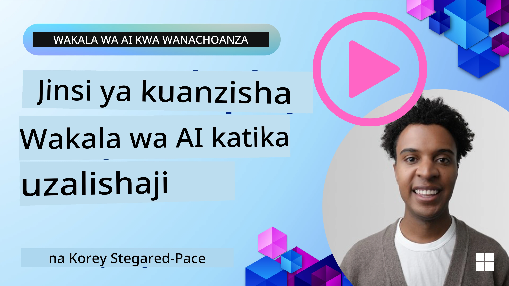

# Wakala za AI katika Uzalishaji: Ufuatiliaji & Tathmini

[](https://youtu.be/l4TP6IyJxmQ?si=reGOyeqjxFevyDq9)

Wakala za AI zinapohamia kutoka kwa prototaipu za majaribio hadi matumizi halisi ya ulimwengu, uwezo wa kuelewa tabia zao, kufuatilia utendaji wao, na kutathmini kwa mfumo kazi zao huwa muhimu.

## Malengo ya Kujifunza

Baada ya kumaliza somo hili, utakuwa umejua jinsi ya/kuelewa:
- Dhana za msingi za ufuatiliaji (observability) na tathmini ya wakala
- Mbinu za kuboresha utendaji, gharama, na ufanisi wa wakala
- Nini na jinsi ya kutathmini wakala wako wa AI kwa mfumo
- Jinsi ya kudhibiti gharama unapopeleka wakala wa AI uzalishoni
- Jinsi ya kufunga ufuatiliaji kwa wakala zilizojengwa kwa AutoGen

Lengo ni kukupa maarifa ya kubadilisha wakala wako wa "sanduku jeusi" kuwa mifumo iliyo wazi, inayoweza kudhibitiwa, na kuaminika.

_**Kumbuka:** Ni muhimu kupeleka Wakala za AI ambazo ni salama na za kuaminika. Angalia somo la [Kujenga Wakala wa AI wa Kuaminika](../06-building-trustworthy-agents/README.md) pia._

## Traces na Spans

Vifaa vya ufuatiliaji kama [Langfuse](https://langfuse.com/) au [Microsoft Foundry](https://learn.microsoft.com/en-us/azure/ai-foundry/what-is-azure-ai-foundry) kawaida huwakilisha utekelezaji wa wakala kama traces na spans.

- **Trace** inawakilisha kazi kamili ya wakala kutoka mwanzo hadi mwisho (kama kushughulikia swali la mtumiaji).
- **Spans** ni hatua za mtu mmoja ndani ya trace (kama kupiga simu kwa model ya lugha au kupata data).


Bila ufuatiliaji, wakala wa AI anaweza kuhisi kama "sanduku jeusi" - hali yake ya ndani na uamuzi wake ni fumbo, ikifanya iwe vigumu kubaini tatizo au kuboresha utendaji. Kwa ufuatiliaji, wakala wanakuwa "sanduku za kioo," wakitoa uwazi muhimu kwa kujenga uaminifu na kuhakikisha wanafanya kazi kama ilivyokusudiwa.

## Kwa Nini Ufuatiliaji Unafaa Katika Mazingira ya Uzalishaji

Kuhamisha wakala za AI kwenye mazingira ya uzalishaji kunaleta changamoto na mahitaji mapya. Ufuatiliaji sio tena "ni nzuri kuwa nayo" bali ni uwezo muhimu:

*   **Urekebishaji na Uchambuzi wa Chanzo**: Wakati wakala anashindwa au kutoa matokeo yasiyotarajiwa, zana za ufuatiliaji hutoa traces zinazohitajika ili kubaini chanzo cha kosa. Hii ni muhimu hasa kwa wakala tata wanaoweza kuhusisha simu nyingi za LLM, mwingiliano wa zana, na mantiki za masharti.
*   **Usimamizi wa Ucheleweshaji na Gharama**: Wakala za AI mara nyingi hutegemea LLMs na API za nje ambazo zinatozwa kwa tokeni au kwa simu. Ufuatiliaji unawezesha kufuatilia kwa usahihi simu hizi, kusaidia kubaini operesheni ambazo zinachelewa mno au gharama kubwa. Hii inawawezesha timu kuboresha prompts, kuchagua modeli zenye ufanisi zaidi, au kubadilisha mtiririko wa kazi ili kudhibiti gharama za uendeshaji na kuhakikisha uzoefu mzuri wa mtumiaji.
*   **Uaminifu, Usalama, na Uzingatiaji Sheria**: Katika programu nyingi, ni muhimu kuhakikisha wakala hufanya kazi kwa usalama na kwa maadili. Ufuatiliaji hutoa njia ya ukaguzi ya vitendo na maamuzi ya wakala. Hii inaweza kutumika kugundua na kupunguza masuala kama kuingizwa kwa prompt, uzalishaji wa yaliyomo hatarishi, au kushughulikia vibaya taarifa za mtu binafsi (PII). Kwa mfano, unaweza kupitia traces kuelewa kwanini wakala alitoa majibu fulani au kutumia zana maalum.
*   **Mizunguko ya Kuboresha Mambo Mengine**: Data ya ufuatiliaji ni msingi wa mchakato wa maendeleo wa iteratifi. Kwa kufuatilia jinsi wakala wanavyofanya kazi kwa ulimwengu halisi, timu zinaweza kubaini maeneo ya kuboresha, kukusanya data kwa ajili ya kurekebisha modeli, na kuthibitisha athari za mabadiliko. Hii inaunda mzunguko wa maoni ambapo maarifa ya uzalishaji kutoka tathmini za mtandaoni yanaarifu majaribio ya nje ya mtandao na utekelezaji, na kusababisha utendaji bora wa wakala taratibu.

## Vipimo Muhimu vya Kufuatilia

Ili kufuatilia na kuelewa tabia ya wakala, aina mbalimbali za vipimo na ishara zinapaswa kufuatiliwa. Wakati vipimo maalum vinaweza kutofautiana kulingana na kusudi la wakala, vingine ni muhimu kwa wote.

Hapa kuna baadhi ya vipimo vinavyofuatiliwa mara kwa mara na zana za ufuatiliaji:

**Latency:** Je, wakala anajibu kwa haraka kiasi gani? Muda mrefu wa kusubiri unaathiri vibaya uzoefu wa mtumiaji. Unapaswa kupima ucheleweshaji kwa kazi nzima na hatua za mtu mmoja kwa kufuatilia utekelezaji wa wakala. Kwa mfano, wakala anayechukua sekunde 20 kwa simu zote za modeli anaweza kuharakishwa kwa kutumia modeli ya kasi zaidi au kwa kuendesha simu za modeli kwa pamoja.

**Costs:** Gharama kwa kila utekelezaji wa wakala ni kiasi gani? Wakala za AI hutegemea simu za LLM zinazotozwa kwa tokeni au API za nje. Matumizi ya mara kwa mara ya zana au prompts nyingi yanaweza kuongeza gharama haraka. Kwa mfano, ikiwa wakala anamuita LLM mara tano kwa kuongeza ubora mdogo, unapaswa kutathmini kama gharama inafaa au kama unaweza kupunguza idadi ya simu au kutumia modeli rahisi zaidi. Ufuatiliaji wa wakati-halisi pia unaweza kusaidia kugundua mabadiliko yasiyotarajiwa (kwa mfano, bugs zinazosababisha mizunguko ya API isiyo ya kawaida).

**Request Errors:** Ni maombi mangapi ambayo wakala alishindwa kuyafanya? Hii inaweza kujumuisha makosa ya API au maombi ya zana yaliyoshindikana. Ili kufanya wakala wako kuwa imara zaidi dhidi ya haya katika uzalishaji, unaweza kuanzisha njia mbadala au jaribu tena. Mfano: ikiwa muuzaji wa LLM A yupo chini, unabadilisha kwenda kwenye muuzaji wa LLM B kama cheo cha akiba.

**User Feedback:** Kutekeleza tathmini za moja kwa moja kutoka kwa watumiaji kunatoa maarifa muhimu. Hii inaweza kujumuisha viwango vilivyoelezwa wazi (👍kupendeza/👎kukataa, ⭐1-5 nyota) au maoni kwa maandishi. Maoni hasi ya mara kwa mara yanapaswa kukuonya kwani hii ni ishara kwamba wakala haifanyi kazi kama ilivyotarajiwa.

**Implicit User Feedback:** Tabia za watumiaji hutoa maoni yasiyoelezwa wazi hata bila viwango vya wazi. Hii inaweza kujumuisha kufupisha mara moja swali, maswali yanayorudiwa au kubofya kitufe cha jaribu tena. Mfano: ikiwa unaona watumiaji wakirudia kuuliza swali moja, hii ni ishara kwamba wakala haifanyi kazi kama ilivyotarajiwa.

**Accuracy:** Kwa mara ngapi wakala huzalisha matokeo sahihi au yanayotarajiwa? Maana ya usahihi yanatofautiana (mfano, usahihi wa kutatua matatizo, usahihi wa utafutaji wa taarifa, kuridhika kwa mtumiaji). Hatua ya kwanza ni kufafanua mafanikio yanavyoonekana kwa wakala wako. Unaweza kufuatilia usahihi kupitia ukaguzi wa kiotomatiki, alama za tathmini, au lebo za kukamilika kwa kazi. Kwa mfano, kuorodhesha traces kama "imefanikiwa" au "imeshindwa".

**Automated Evaluation Metrics:** Pia unaweza kuanzisha tathmini za kiotomatiki. Kwa mfano, unaweza kutumia LLM kupiga alama kwenye matokeo ya wakala kama ikiwa ni ya msaada, sahihi, au la. Pia kuna maktaba kadhaa za chanzo wazi zinazokusaidia kupiga alama vipengele tofauti vya wakala. Mfano: [RAGAS](https://docs.ragas.io/) kwa wakala wa RAG au [LLM Guard](https://llm-guard.com/) kugundua lugha hatarishi au kuingizwa kwa prompt.

Katika vitendo, mchanganyiko wa vipimo hivi hutoa ufunikaji bora wa afya ya wakala wa AI. Katika jaribio hili la kuu [example notebook](./code_samples/10_autogen_evaluation.ipynb) cha sura hii, tutaonyesha jinsi vipimo hivi vinavyoonekana katika mifano halisi lakini kwanza, tutajifunza jinsi mtiririko wa tathmini kawaida unavyoonekana.

## Fanya Ufuatiliaji kwa Wakala Wako

Ili kukusanya data ya tracing, utahitaji kufunga vifaa kwenye msimbo wako. Lengo ni kufunga msimbo wa wakala ili kutoa traces na vipimo ambavyo vinaweza kukamatwa, kuchakatwa, na kuonyeshwa na jukwaa la ufuatiliaji.

**OpenTelemetry (OTel):** [OpenTelemetry](https://opentelemetry.io/) imejitokeza kama kiwango cha sekta kwa ufuatiliaji wa LLM. Inatoa seti ya API, SDK, na zana za kuzalisha, kukusanya, na kusafirisha telemetry data.

Kuna maktaba nyingi za instrumentation zinazozunguka mifumo ya wakala zilizopo na kufanya iwe rahisi kusafirisha OpenTelemetry spans kwa zana ya ufuatiliaji. Chini ni mfano wa kufunga ufuatiliaji kwa wakala wa AutoGen kwa kutumia maktaba ya instrumentation ya [OpenLit](https://github.com/openlit/openlit):

```python
import openlit

openlit.init(tracer = langfuse._otel_tracer, disable_batch = True)
```

The [example notebook](./code_samples/10_autogen_evaluation.ipynb) in this chapter will demonstrate how to instrument your AutoGen agent.

**Manual Span Creation:** Wakati maktaba za instrumentation zinatoa msingi mzuri, mara nyingi kuna kesi ambapo taarifa za kina zaidi au maalum zinahitajika. Unaweza kuunda spans kwa mkono ili kuongeza mantiki maalum ya programu. Zaidi ya hayo, zinaweza kuzaa spans zilizoundwa kiotomatiki au kwa mkono kwa vigezo maalum (vinavyojulikana pia kama lebo au metadata). Vigezo hivi vinaweza kujumuisha data maalum ya biashara, mahesabu za kati, au muktadha wowote ambao unaweza kuwa muhimu kwa urekebishaji au uchambuzi, kama `user_id`, `session_id`, au `model_version`.

Example on creating traces and spans manually with the [Langfuse Python SDK](https://langfuse.com/docs/sdk/python/sdk-v3): 

```python
from langfuse import get_client
 
langfuse = get_client()
 
span = langfuse.start_span(name="my-span")
 
span.end()
```

## Tathmini ya Wakala

Ufuatiliaji unatupa vipimo, lakini tathmini ni mchakato wa kuchambua data hiyo (na kufanya mitihani) ili kubaini jinsi wakala wa AI anavyofanya kazi vizuri na jinsi unaweza kuboresha. Kwa maneno mengine, mara tu unapokuwa na traces na vipimo hivyo, una vitumia vipi kwa kuhukumu wakala na kufanya maamuzi?

Tathmini ya kawaida ni muhimu kwa sababu wakala za AI mara nyingi hazitegemei mtiririko thabiti na zinaweza kubadilika (kupitia masasisho au mabadiliko ya tabia ya modeli) – bila tathmini, usingejua kama "wakala mwenzako mwerevu" kwa kweli anafanya kazi yake vizuri au kama amepungua utendaji.

Kuna aina mbili za tathmini kwa wakala wa AI: **tathmini ya mtandaoni** na **tathmini isiyokuwa mtandaoni**. Zote mbili ni za thamani, na zinaendana. Kwa kawaida tunaanza na tathmini isiyokuwa mtandaoni, kwani hii ni hatua ya chini inayohitajika kabla ya kupeleka wakala wowote uzalishoni.

### Tathmini Isiyokuwa Mtandaoni


Hii inahusu kutathmini wakala katika mazingira yaliyodhibitiwa, kawaida kwa kutumia seti za majaribio, si maswali ya watumiaji ya moja kwa moja. Unatumia seti zilizochaguliwa ambapo unajua matokeo yanayotarajiwa au tabia sahihi, na kisha kuendesha wakala wako juu yao.

Kwa mfano, ikiwa umeunda wakala wa kutatua matatizo ya neno ya hisabati, unaweza kuwa na [seti ya majaribio](https://huggingface.co/datasets/gsm8k) ya matatizo 100 yenye majibu yanayojulikana. Tathmini isiyokuwa mtandaoni mara nyingi hufanywa wakati wa maendeleo (na inaweza kuwa sehemu ya mizunguko ya CI/CD) ili kuangalia maboresho au kujilinda dhidi ya mabadiliko yaliyodhoofisha. Faida ni kwamba ni **inarudika na unaweza kupata vipimo wazi vya usahihi kwa kuwa una ukweli wa msingi**. Unaweza pia kuiga maswali ya watumiaji na kupima majibu ya wakala dhidi ya majibu bora au kutumia vipimo vya kiotomatiki kama ilivyoelezwa hapo juu.

Changamoto kuu ya tathmini isiyokuwa mtandaoni ni kuhakikisha kuwa seti yako ya majaribio ni kamili na inabaki muhimu – wakala anaweza kufanya vizuri kwenye seti ya majaribio iliyowekwa lakini kukutana na maswali tofauti kabisa uzalishoni. Kwa hiyo, unapaswa kusasisha seti za majaribio na kesi mpya za ukingo na mifano inayofanana na hali za ulimwengu halisi. Mchanganyiko wa kesi ndogo za "mtihani wa moshi" na seti kubwa za tathmini ni muhimu: seti ndogo kwa ukaguzi wa haraka na seti kubwa kwa vipimo vya utendaji kwa ujumla.

### Tathmini ya Mtandaoni


Hii inahusu kutathmini wakala katika mazingira ya moja kwa moja, ulimwengu halisi, yaani wakati wa matumizi halisi uzalishoni. Tathmini ya mtandaoni inahusisha kufuatilia utendaji wa wakala kwenye mwingiliano wa watumiaji wa kweli na kuchambua matokeo kwa mfululizo.

Kwa mfano, unaweza kufuatilia viwango vya mafanikio, alama za kuridhika kwa watumiaji, au vipimo vingine kwenye trafiki ya moja kwa moja. Faida ya tathmini ya mtandaoni ni kwamba inakamata mambo ambayo huenda usingetarajia katika maabara – unaweza kuona mabadiliko ya modeli kwa muda (ikiwa ufanisi wa wakala unapungua wakati muundo wa pembejeo unabadilika) na kugundua maswali au hali zisizotarajiwa ambazo hazikuwepo kwenye data yako ya majaribio. Inatoa taswira halisi ya jinsi wakala anavyojitendea katika mazingira halisi.

Tathmini ya mtandaoni mara nyingi inajumuisha kukusanya maoni ya watumiaji kwa uwazi na kwa njia isiyoelezwa, kama ilivyojadiliwa, na pengine kuendesha majaribio ya kivuli au majaribio ya A/B (ambapo toleo jipya la wakala linaendeshwa sambamba na la zamani kulinganisha). Changamoto ni kwamba inaweza kuwa ngumu kupata lebo au alama za kuaminika kwa mwingiliano wa moja kwa moja – unaweza kutegemea maoni ya watumiaji au vipimo vya msururu (kama ikiwa mtumiaji alibonyeza matokeo).

### Kuchanganya Vyote Mbili

Tathmini ya mtandaoni na isiyokuwa mtandaoni sipekeana; zinakamilishana kwa nguvu. Maarifa kutoka ufuatiliaji wa mtandaoni (mfano, aina mpya za maswali ya watumiaji ambapo wakala anafanya vibaya) yanaweza kutumika kuongeza na kuboresha seti za majaribio zisizo mtandaoni. Kinyume chake, wakala wanaofanya vizuri kwenye majaribio isiyokuwa mtandaoni wanaweza kisha kupelekwa kwa kujiamini zaidi na kufuatiliwa mtandaoni.

Kwa kweli, timu nyingi zinachukua mzunguko:

_tathmini isiyokuwa mtandaoni -> anzisha -> fuatilia mtandaoni -> kusanya kesi mpya za kushindwa -> ongeza kwenye seti ya mtihani isiyokuwa mtandaoni -> boresha wakala -> rudia_.

## Masuala ya Kawaida

Unapopeleka wakala za AI uzalishoni, unaweza kukutana na changamoto mbalimbali. Hapa kuna baadhi ya masuala ya kawaida na suluhisho zao zinazowezekana:

| **Tatizo**    | **Suluhisho Linawezekana**   |
| ------------- | ------------------ |
| Wakala wa AI hautekelezi majukumu kwa uthabiti | - Rekebisha prompt inayotolewa kwa Wakala wa AI; kuwa wazi kuhusu malengo.<br>- Tambua sehemu ambapo kugawa kazi kuwa kazi ndogo na kuzikabiliwa na wakala wengi kunaweza kusaidia. |
| Wakala wa AI unaingia katika mizunguko ya kuendelea  | - Hakikisha una vigezo wazi vya kumaliza ili Wakala ajue lini kuacha mchakato.<br>- Kwa kazi ngumu zinazohitaji mantiki na upangaji, tumia modeli kubwa zaidi ambayo imebobea kwa kazi za mantiki. |
| Mawaiti ya zana za Wakala wa AI hayafanyi kazi vizuri   | - Jaribu na thibitisha matokeo ya zana nje ya mfumo wa wakala.<br>- Rekebisha vigezo vilivyofafanuliwa, prompts, na kutaja majina ya zana.  |
| Mfumo wa Wakala Wengi hautekelezi kwa uthabiti | - Rekebisha prompts zinazotolewa kwa kila wakala ili kuhakikisha zinafafanuliwa na kutofautiana kwa kila mmoja.<br>- Jenga mfumo wa kihierarkia kutumia wakala wa "kutoa njia" au mdhibiti kuamua ni wakala gani sahihi. |

Masuala mengi kati ya haya yanaweza kubainika kwa ufanisi zaidi ikiwa ufuatiliaji uko mahali. Traces na vipimo tulivyojadili hapo juu husaidia kubainisha hasa wapi ndani ya mtiririko wa wakala matatizo yanatokea, na kufanya urekebishaji na uboreshaji kuwa rahisi zaidi.

## Kusimamia Gharama
Here are some strategies to manage the costs of deploying AI agents to production:

**Kutumia Modeli Ndogo za Lugha (SLMs):** Modeli Ndogo za Lugha (SLMs) zinaweza kutekeleza vizuri katika matukio fulani ya matumizi ya wakala na zitapunguza gharama kwa kiasi kikubwa. Kama ilivyotajwa hapo awali, kujenga mfumo wa tathmini ili kubaini na kulinganisha utendaji dhidi ya modeli kubwa ni njia bora ya kuelewa jinsi SLM itakavyofanya kazi katika matumizi yako. Fikiria kutumia SLM kwa kazi rahisi kama upangaji wa nia au uchukuaji wa vigezo, wakati ukihifadhi modeli kubwa kwa hoja ngumu.

**Kutumia Mfano wa Router:** Mkakati kama huo ni kutumia utofauti wa modeli na ukubwa. Unaweza kutumia LLM/SLM au kazi isiyo na seva (serverless function) kuelekeza maombi kulingana na ugumu kwa modeli zinazofaa zaidi. Hii pia itasaidia kupunguza gharama huku ikihakikisha utendaji kwenye kazi sahihi. Kwa mfano, elekeza maswali rahisi kwa modeli ndogo, za haraka, na tumia modeli kubwa, za gharama kubwa, tu kwa kazi za hoja ngumu.

**Kuhifadhi Majibu:** Kutambua maombi na kazi za kawaida na kutoa majibu kabla hawajapitia mfumo wako wa wakala ni njia nzuri ya kupunguza wingi wa maombi yanayofanana. Unaweza hata kutekeleza mtiririko wa kubaini jinsi ombi linavyofanana na maombi yaliyohifadhiwa kwa kutumia modeli za AI za msingi zaidi. Mkakati huu unaweza kupunguza kwa kiasi kikubwa gharama kwa maswali yanayoulizwa mara kwa mara au taratibu za kawaida za kazi.

## Hebu tuone jinsi hili linavyofanya kazi kwa vitendo

Katika [daftari la mfano la sehemu hii](./code_samples/10_autogen_evaluation.ipynb), tutaona mifano ya jinsi tunavyoweza kutumia zana za ufuatiliaji (observability) kufuatilia na kutathmini wakala wetu.


### Una maswali zaidi kuhusu mawakala wa AI katika uzalishaji?

Jiunge na [Discord ya Microsoft Foundry](https://aka.ms/ai-agents/discord) ili kukutana na wanafunzi wengine, kuhudhuria saa za ofisi, na kupata majibu kwa maswali yako kuhusu mawakala wa AI.

## Somo lililopita

[Mfano wa Ubunifu wa Metakognition](../09-metacognition/README.md)

## Somo linalofuata

[Itifaki za Wakala](../11-agentic-protocols/README.md)

---

<!-- CO-OP TRANSLATOR DISCLAIMER START -->
Tamko la kutokuwajibika:
Hati hii imetafsiriwa kwa kutumia huduma ya tafsiri ya AI [Co-op Translator](https://github.com/Azure/co-op-translator). Ingawa tunajitahidi kuhakikisha usahihi, tafadhali fahamu kwamba tafsiri za kiotomatiki zinaweza kuwa na makosa au kutokuwa sahihi. Hati ya awali katika lugha yake ya asili inapaswa kuchukuliwa kama chanzo cha mamlaka. Kwa taarifa muhimu, inashauriwa kutumia tafsiri ya kitaalamu ya binadamu. Hatuwajibiki kwa kutoelewana au tafsiri potofu zitokanazo na matumizi ya tafsiri hii.
<!-- CO-OP TRANSLATOR DISCLAIMER END -->