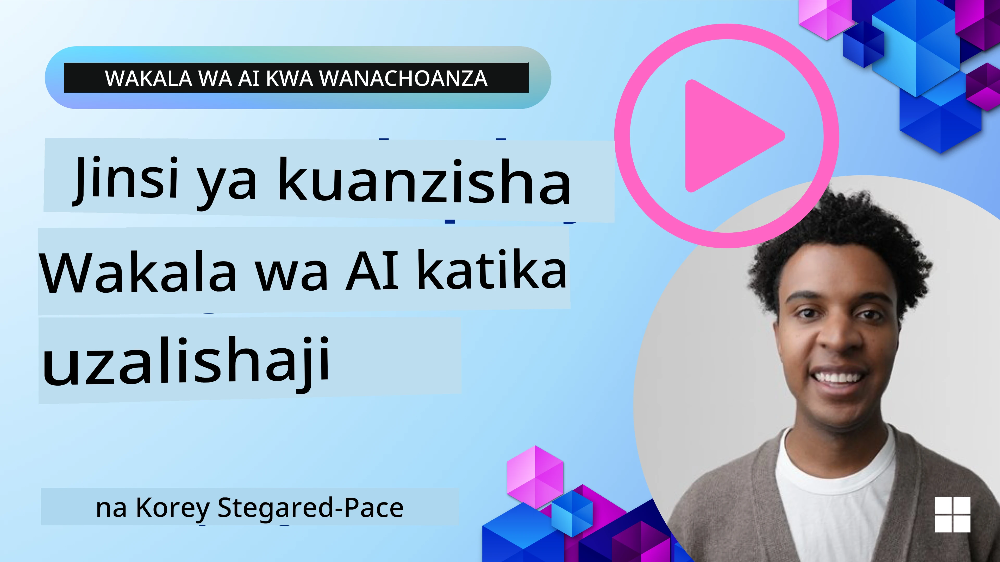

# Wakala wa AI katika Uzalishaji: Uwezo wa Kuona & Tathmini

[](https://youtu.be/l4TP6IyJxmQ?si=reGOyeqjxFevyDq9)

Wakala wa AI wanapohamia kutoka kwenye prototipu za majaribio kwenda kwenye matumizi halisi ya dunia, uwezo wa kuelewa tabia zao, kufuatilia utendaji wao, na kutathmini kwa mpangilio matokeo yao unakuwa muhimu.

## Malengo ya Kujifunza

Baada ya kumaliza somo hili, utajua jinsi ya/kuelewa:
- Dhana za msingi za uwezo wa kuona wakala na tathmini
- Mbinu za kuboresha utendaji, gharama, na ufanisi wa wakala
- Nini na jinsi ya kutathmini wakala wako wa AI kwa mpangilio
- Jinsi ya kudhibiti gharama wakati wa kuanzisha wakala wa AI kwenye uzalishaji
- Jinsi ya kuingiza vipimo katika wakala uliojengwa na Microsoft Agent Framework

Lengo ni kukupa maarifa ya kubadilisha wakala wako "kifunguo mweusi" kuwa mifumo wazi, inayosimamiwa, na inayotegemewa.

_**Kumbuka:** Ni muhimu kuanzisha Wakala wa AI ambao ni salama na wa kuaminika. Angalia somo la [Kujenga Wakala wa AI Wa Kuaminika](../06-building-trustworthy-agents/README.md) pia._

## Mfuatano na Mabano

Vifaa vya kuona kama vile [Langfuse](https://langfuse.com/) au [Microsoft Foundry](https://learn.microsoft.com/en-us/azure/ai-foundry/what-is-azure-ai-foundry) kawaida huwakilisha utekelezaji wa wakala kwa njia ya mfuatano na mabano.

- **Mfuatano** huwakilisha kazi kamili ya wakala kutoka mwanzo hadi mwisho (kama kushughulikia swali la mtumiaji).
- **Mabano** ni hatua binafsi ndani ya mfuatano (kama kuita mfano wa lugha au kupata data).


<!-- Image URL retained for illustration purposes -->

Bila uwezo wa kuona, wakala wa AI anaweza kuhisi kama "kifunguo mweusi" - hali yake ya ndani na hoja ni giza, na kufanya ugumu kubaini matatizo au kuboresha utendaji. Kwa uwezo wa kuona, wakala wanakuwa "vikasha vya kioo," wakitoa uwazi muhimu kwa kujenga imani na kuhakikisha wanafanya kazi kama ilivyokusudiwa.

## Kwa Nini Uwezo wa Kuona Ni Muhimu Katika Mazingira ya Uzalishaji

Kuanzisha wakala wa AI katika mazingira ya uzalishaji huleta changamoto na mahitaji mapya. Uwezo wa kuona si "ni nzuri kuwa nayo" tena bali ni uwezo wa msingi:

*   **Kurekebisha Makosa na Uchambuzi wa Chanzo Mkubwa:** Wakati wakala anashindwa au kutoa matokeo yasiyotarajiwa, vifaa vya uwezo wa kuona hutoa mfuatano unaohitajika kugundua chanzo cha tatizo. Hii ni muhimu hasa kwa wakala tata wanaohusisha mara nyingi miito mingi ya LLM, mwingiliano wa zana, na mantiki ya masharti.
*   **Udhibiti wa Muda wa Kusubiri na Gharama:** Wakala wa AI mara nyingi hutegemea LLM na API za nje zinazolipishwa kwa kila tokeni au kila wito. Uwezo wa kuona huruhusu kufuatilia kwa usahihi miito hii, kusaidia kugundua operesheni ambazo ni polepole au ghali kupita kiasi. Hii inawawezesha timu kuboresha maelekezo, kuchagua mifano bora au kubuni upya kazi ili kudhibiti gharama za uendeshaji na kuhakikisha uzoefu mzuri kwa mtumiaji.
*   **Imani, Usalama, na Uzingatiaji Sheria:** Katika maombi mengi, ni muhimu kuhakikisha wakala hufanya kazi salama na kimaadili. Uwezo wa kuona hutoa rekodi ya ufuatiliaji ya vitendo na maamuzi ya wakala. Hii inaweza kutumika kugundua na kupunguza matatizo kama kuingizwa kwa maelekezo, uzalishaji wa maudhui hatarishi, au usimamizi mbaya wa taarifa za kibinafsi (PII). Kwa mfano, unaweza kupitia mfuatano kuelewa kwa nini wakala alitoa majibu fulani au alitumia zana iliyobainishwa.
*   **Mizunguko ya Kuboresha Mfululizo:** Data ya uwezo wa kuona ni msingi wa mchakato wa maendeleo ya kila mara. Kwa kufuatilia utendaji wa wakala katika dunia halisi, timu zinaweza kubaini maeneo ya kuboresha, kukusanya data kwa ajili ya kurekebisha mifano, na kuthibitisha athari za mabadiliko. Hii huunda mzunguko wa mrejesho ambapo maarifa ya uzalishaji kutoka tathmini mtandaoni hutoa mwongozo wa majaribio ya nje ya mtandao na maboresho, na kusababisha utendaji bora zaidi wa wakala.

## Vipimo Muhimu vya Kufuatilia

Ili kufuatilia na kuelewa tabia ya wakala, aina mbalimbali za vipimo na ishara zinapaswa kufuatiliwa. Ilhali vipimo maalum vinaweza kutofautiana kulingana na madhumuni ya wakala, baadhi ni muhimu kwa ujumla.

Hapa kuna baadhi ya vipimo vinavyofuatiliwa mara nyingi na vifaa vya uwezo wa kuona:

**Latency:** Kwa haraka wakala hunyesha majibu? Muda mrefu wa kusubiri huathiri uzoefu wa mtumiaji vibaya. Unapaswa kupima muda wa kusubiri kwa kazi na hatua binafsi kwa kufuatilia utekelezaji wa wakala. Kwa mfano, wakala anayechukua sekunde 20 kwa miito yote ya mfano anaweza kuendeshwa kwa kasi zaidi kwa kutumia mfano wa haraka au kwa kuendesha miito kwa sambamba.

**Gharama:** Gharama ni kiasi gani kwa kila utekelezaji wa wakala? Wakala wa AI hutegemea miito ya LLM inayolipishwa kwa tokeni au API za nje. Matumizi ya mara kwa mara ya zana au maelekezo mengi yanaweza kuongeza gharama kwa haraka. Kwa mfano, ikiwa wakala anaita LLM mara tano kwa ajili ya kuboresha ubora kidogo, lazima utathmini kama gharama inafaa au unaweza kupunguza idadi ya miito au kutumia mfano wa bei nafuu. Ufuatiliaji wa wakati halisi pia unaweza kusaidia kugundua mabadiliko zisizotarajiwa (mfano, hitilafu zinazosababisha mizunguko ya API zisizo na kipimo).

**Makosa ya Maombi:** Ni maombi mangapi yaliyoshindwa na wakala? Hii inaweza kujumuisha makosa ya API au miito ya zana isiyofanikisha. Ili kufanya wakala wako kuhimili zaidi dhidi ya haya katika uzalishaji, unaweza kusanidi mbadala au majaribio ya kurudia. Mfano: ikiwa mtoa huduma wa LLM A ameshindwa, unabadilisha kwenda mtoa huduma wa LLM B kama nakala ya dharura.

**Maoni ya Mtumiaji:** Kutekeleza tathmini za moja kwa moja za watumiaji hutoa maarifa muhimu. Hii inaweza kujumuisha alama wazi (👍kuchukuliza kwa kidole/👎kutupa chini, ⭐nyota 1-5) au maoni ya maandishi. Maoni yenye maudhui hasi kwa mara kwa mara yanapaswa kukufanya utambue kama ishara kwamba wakala haifanyi kazi kama ilivyotarajiwa.

**Maoni Yasiyo Ya Kueleweka ya Mtumiaji:** Tabia za mtumiaji hupeleka maoni yasiyo ya moja kwa moja hata bila alama wazi. Hii inaweza kujumuisha mara moja kubadilisha swali, kuuliza maswali mara nyingi au kubofya kitufe cha jaribio tena. Mfano: kama unaona watumiaji wanatahiri swali moja mara kwa mara, hii ni ishara kwamba wakala haifanyi kazi kama ilivyotarajiwa.

**Usahihi:** Mara ngapi wakala hutoa matokeo sahihi au yanayotakiwa? Maelezo ya usahihi yanatofautiana (mfano, usahihi wa kutatua tatizo, usahihi wa kupata taarifa, kuridhika kwa mtumiaji). Hatua ya kwanza ni kufafanua mafanikio ya wakala wako. Unaweza kufuatilia usahihi kupitia ukaguzi wa kiotomatiki, alama za tathmini, au lebo za ukamilishaji kazi. Kwa mfano, kuweka alama mfuatano kama "umefanikiwa" au "umeshindwa".

**Vipimo vya Tathmini ya Kiotomatiki:** Pia unaweza kusanidi tathmini za kiotomatiki. Kwa mfano, unaweza kutumia LLM kupima matokeo ya wakala kama ni ya msaada, sahihi, au la. Pia kuna maktaba nyingi za chanzo wazi zinazokusaidia kupima vipengele tofauti vya wakala. Mfano: [RAGAS](https://docs.ragas.io/) kwa wakala wa RAG au [LLM Guard](https://llm-guard.com/) kugundua lugha hatarishi au kuingizwa kwa maelekezo.

Kwenye mazoezi, mchanganyiko wa vipimo hivi hutoa ufunikaji bora wa hali ya afya ya wakala wa AI. Katika [daftari la mfano](./code_samples/10-expense_claim-demo.ipynb) la sura hii, tutakuonyesha jinsi vipimo hivi vinavyoonekana katika mifano halisi lakini kwanza, tutajifunza mchakato wa kawaida wa tathmini.

## Ingiza Vipimo kwa Wakala Wako

Ili kukusanya data ya mfuatano, utahitaji kuingiza vipimo kwenye msimbo wako. Lengo ni kuingiza msimbo wa wakala kutoa mfuatano na vipimo vinavyoweza kukamatawa, kuchakatwa, na kuonyeshwa na jukwaa la uwezo wa kuona.

**OpenTelemetry (OTel):** [OpenTelemetry](https://opentelemetry.io/) imeibuka kama viwango vya sekta kwa uwezo wa kuona LLM. Inatoa seti ya API, SDK, na zana za kuzalisha, kukusanya, na kusafirisha data ya telemetri.

Kuna maktaba nyingi za uingizaji zilizozunguka mifumo ya wakala iliyopo na kuifanya iwe rahisi kusafirisha mabano ya OpenTelemetry kwa chombo cha uwezo wa kuona. Microsoft Agent Framework inaunga mkono OpenTelemetry kwa asili. Hapa chini ni mfano wa kuingiza vipimo katika wakala wa MAF:

```python
from agent_framework.observability import get_tracer, get_meter

tracer = get_tracer()
meter = get_meter()

with tracer.start_as_current_span("agent_run"):
    # Utekelezaji wa wakala unafuatiliwa moja kwa moja
    pass
```

Daftari la [mfano](./code_samples/10-expense_claim-demo.ipynb) katika sura hii litaonyesha jinsi ya kuingiza vipimo kwa wakala wako wa MAF.

**Uundaji wa Mabano kwa Mkono:** Ingawa maktaba za vipimo hutoa msingi mzuri, mara nyingi kuna hali zinazohitaji taarifa za kina zaidi au za desturi. Unaweza kuunda mabano kwa mkono kuongeza mantiki ya desturi ya programu. Zaidi ya hayo, yanaweza kuimarisha mabano yaliyoandaliwa kiotomatiki au kwa mkono wenye vigezo maalum (ambavyo pia hujulikana kama lebo au metadata). Vigezo hivi vinaweza kujumuisha data maalum za biashara, mahesabu ya kati, au muktadha wowote unaoweza kusaidia katika uchambuzi au ugunduzi makosa, kama `user_id`, `session_id`, au `model_version`.

Mfano wa kuunda mfuatano na mabano kwa mkono kutumia [Langfuse Python SDK](https://langfuse.com/docs/sdk/python/sdk-v3): 

```python
from langfuse import get_client
 
langfuse = get_client()
 
span = langfuse.start_span(name="my-span")
 
span.end()
```

## Tathmini ya Wakala

Uwezo wa kuona hutupa vipimo, lakini tathmini ni mchakato wa kuchambua data hiyo (na kufanya majaribio) ili kubaini jinsi wakala wa AI anavyofanya kazi na jinsi ya kuboresha. Kwa maneno mengine, mara unavyopata mfuatano na vipimo hivyo, unavyovitumia kuhukumu wakala na kufanya maamuzi?

Tathmini za kawaida ni muhimu kwa sababu wakala wa AI mara nyingi hawategemeiweza na wanaweza kubadilika (kupitia masasisho au mabadiliko ya tabia ya mfano) – bila tathmini, husingejua kama "wakala mwangalifu" kweli anafanya kazi yake vizuri au kama amepungua kiwango.

Kuna makundi mawili ya tathmini kwa wakala wa AI: **tathmini mtandaoni** na **tathmini nje ya mtandao**. Zote ni muhimu, na zinalinganisha kwa usaidizi wa kila mmoja. Kawaida huanza na tathmini nje ya mtandao, kwani hii ni hatua ya chini kabisa inayohitajika kabla ya kuanzisha wakala wowote.

### Tathmini Nje ya Mtandao


Hii ni kujumuisha tathmini ya wakala katika mazingira yaliyodhibitiwa, kawaida kwa kutumia seti za data za majaribio, si maswali ya moja kwa moja kutoka kwa watumiaji. Unatumia seti za data zilizochaguliwa ambapo unajua matokeo au tabia sahihi inayotarajiwa, kisha unawapima wakala wako juu yao.

Kwa mfano, ikiwa umejenga wakala kwa suluhisho la matatizo ya neno la hisabati, unaweza kuwa na [seti ya majaribio](https://huggingface.co/datasets/gsm8k) ya matatizo 100 yenye majibu yanayojulikana. Tathmini ya nje ya mtandao mara nyingi hufanywa wakati wa maendeleo (na inaweza kuwa sehemu ya mchakato wa CI/CD) kukagua maboresho au kulinda dhidi ya kurudi nyuma. Faida ni kwamba ni **inayoweza kurudiwa na unaweza kupata vipimo wazi vya usahihi kwa kuwa una ukweli wa msingi**. Pia unaweza kuiga maswali ya mtumiaji na kupima majibu ya wakala dhidi ya majibu bora au kutumia vipimo vya kiotomatiki kama vilivyoelezwa hapo juu.

Changamoto kuu ya tathmini nje ya mtandao ni kuhakikisha seti yako ya majaribio ni kamili na inabaki sasa – wakala anaweza kufanya vizuri kwenye seti ya majaribio iliyowekwa lakini anakutana na maswali tofauti kabisa katika uzalishaji. Kwa hiyo, unapaswa kusasisha seti za majaribio na kesi mpya za kipekee na mifano inayowakilisha hali za kweli. Mchanganyiko wa kesi ndogo za "jaribio la moshi" na seti kubwa za tathmini ni muhimu: seti ndogo kwa ukaguzi wa haraka na seti kubwa kwa vipimo vya ufanisi vya pana.

### Tathmini Mtandaoni


Hii inahusu tathmini ya wakala katika mazingira ya moja kwa moja, ya dunia halisi, yaani wakati wa matumizi halisi katika uzalishaji. Tathmini mtandaoni inahusisha kufuatilia utendaji wa wakala kwenye mwingiliano halisi wa watumiaji na kuchambua matokeo kwa kuendelea.

Kwa mfano, unaweza kufuatilia viwango vya mafanikio, alama za kuridhika kwa mtumiaji, au vipimo vingine ndani ya trafiki ya moja kwa moja. Faida ya tathmini mtandaoni ni kwamba inakamata mambo ambayo huenda usiyataraji katika mazingira ya maabara – unaweza kuona mabadiliko ya mfano kwa muda (ikiwa ufanisi wa wakala hupungua wakati mifumo ya pembejeo inabadilika) na kugundua maswali au hali zisizotarajiwa ambazo hazikuwepo kwenye data ya majaribio. Hii hutoa picha halisi ya jinsi wakala anavyofanya kazi katika mazingira halisi.

Tathmini mtandaoni mara nyingi inahusisha ukusanyaji wa maoni ya wazi na yasiyo ya wazi ya watumiaji, kama ilivyojadiliwa, na labda kuendesha majaribio ya kivuli au majaribio ya A/B (ambapo toleo jipya la wakala linaendeshwa sambamba kulinganisha na toleo la zamani). Changamoto ni kwamba inaweza kuwa vigumu kupata lebo au alama za kuaminika kwa mwingiliano wa moja kwa moja – unaweza kutegemea maoni ya mtumiaji au vipimo vinavyokuja baadaye (kama mtumiaji alibofya matokeo).

### Kuunganisha Vyote Viwili

Tathmini mtandaoni na nje ya mtandao si za kinyume; ni za kuongezana kwa hali kubwa. Maarifa kutoka kwa ufuatiliaji mtandaoni (mfano, aina mpya za maswali ya mtumiaji ambako wakala hafanyi vizuri) yanaweza kutumiwa kuongeza na kuboresha seti za data za mtihani wa nje ya mtandao. Kwa upande mwingine, wakala wanaofanya vizuri katika majaribio ya nje ya mtandao wanaweza kuzinduliwa kwa kujiamini zaidi na kufuatiliwa mtandaoni.

Kwa kweli, timu nyingi hutumia mzunguko:

_tathmini nje ya mtandao -> anzisha -> fuatilia mtandaoni -> kusanya kesi mpya za kushindwa -> ongeza kwenye seti ya data ya nje ya mtandao -> boresha wakala -> rudia_.

## Masuala ya Kawaida

Unapoanzisha wakala wa AI katika uzalishaji, unaweza kukutana na changamoto mbalimbali. Hapa kuna baadhi ya matatizo ya kawaida na suluhisho zao zinazowezekana:

| **Tatizo**    | **Suluhisho Linalowezekana**   |
| ------------- | ------------------ |
| Wakala wa AI haufanyi kazi kwa uthabiti | - Boresha maelekezo yaliyotolewa kwa Wakala wa AI; uwe wazi kuhusu malengo.<br>- Tambua sehemu ambapo kugawanya kazi ndogo ndogo na kushughulikiwa na wakala wengi kunaweza kusaidia. |
| Wakala wa AI unasumbuliwa na mizunguko ya kuendelea | - Hakikisha una masharti ya kusitisha wazi ili Wakala ajue lini kuacha mchakato.<br>- Kwa kazi tata zinazohitaji hoja na mipango, tumia mfano mkubwa ulio maalum kwa kazi za hoja. |
| Miito ya zana za Wakala wa AI haifanyi vizuri | - Jaribu na thibitisha matokeo ya zana nje ya mfumo wa wakala.<br>- Boresha vigezo vilivyobainishwa, maelekezo, na majina ya zana.  |
| Mfumo wa Wakala Wengi haufanikiwi kwa uthabiti | - Boresha maelekezo yaliyotolewa kwa kila wakala kuhakikisha ni maalum na tofauti miongoni mwao.<br>- Jenga mfumo wa ngazi kwa kutumia wakala wa "routing" au msimamizi kuamua ni wakala gani sahihi. |

Matatizo haya mengi yanaweza kugunduliwa kwa ufanisi zaidi kwa kuwepo kwa uwezo wa kuona. Mfuatano na vipimo tuliojadili awali husaidia kugundua mahali hasa panapotokea matatizo katika mchakato wa wakala, na kufanya utambuzi na uboreshaji kuwa wa haraka zaidi.

## Udhibiti wa Gharama


Hapa kuna mikakati ya kusimamia gharama za kupeleka mawakala wa AI katika uzalishaji:

**Kutumia Mifano Midogo:** Mifano Midogo ya Lugha (SLMs) inaweza kufanya vizuri kwa baadhi ya matumizi ya wakala na itapunguza gharama kwa kiasi kikubwa. Kama ilivyotajwa awali, kujenga mfumo wa tathmini ili kuamua na kulinganisha utendaji dhidi ya mifano mikubwa ni njia bora ya kuelewa jinsi SLM itakavyofanya kazi kwa matumizi yako. Fikiria kutumia SLM kwa kazi rahisi kama uainishaji wa nia au uondoaji wa vigezo, wakati ukihifadhi mifano mikubwa kwa hoja ngumu.

**Kutumia Mfano wa Router:** Mkakati sawa ni kutumia utofauti wa mifano na saizi. Unaweza kutumia LLM/SLM au kazi isiyo na seva kupeleka maombi kulingana na ugumu kwa mifano inayofaa zaidi. Hii pia itasaidia kupunguza gharama huku ikihakikisha utendaji kwenye kazi zinazofaa. Kwa mfano, tupilia queries rahisi kwa mifano midogo, ya haraka, na tumia mifano mikubwa ya gharama kubwa kwa kazi za hoja ngumu pekee.

**Kuweka Mwitikio Mbele (Caching Responses):** Kubaini maombi na kazi za kawaida na kutoa majibu kabla hayajapitia katika mfumo wako wa wakala ni njia nzuri ya kupunguza wingi wa maombi yanayofanana. Unaweza hata kutekeleza mtiririko wa kubaini jinsi maombi yanavyofanana na maombi yaliyohifadhiwa ukiwa na kutumia mifano ya AI ya msingi zaidi. Mkakati huu unaweza kupunguza kwa kiasi kikubwa gharama za maswali yanayoulizwa mara kwa mara au michakato ya kawaida.

## Tuweze kuona jinsi hii inavyofanya kazi kwa vitendo

Katika [daftari la mfano la sehemu hii](./code_samples/10-expense_claim-demo.ipynb), tutaona mifano ya jinsi tunaweza kutumia zana za ufuatiliaji na tathmini ya wakala wetu.


### Una Maswali Zaidi kuhusu Wakala wa AI katika Uzalishaji?

Jiunge na [Microsoft Foundry Discord](https://discord.com/invite/ATgtXmAS5D) kukutana na wapenzi wengine, kuhudhuria muda wa maswali na kupata majibu ya maswali yako kuhusu Wakala wa AI.

## Somo lililopita

[Mfumo wa Kubuni Metacognition](../09-metacognition/README.md)

## Somo lijalo

[Itifaki za Wakala](../11-agentic-protocols/README.md)

---

<!-- CO-OP TRANSLATOR DISCLAIMER START -->
**Kionyozo**:
Hati hii imetafsiriwa kwa kutumia huduma ya tafsiri ya AI [Co-op Translator](https://github.com/Azure/co-op-translator). Ingawa tunajitahidi kupata usahihi, tafadhali fahamu kwamba tafsiri za kiotomatiki zinaweza kuwa na makosa au upungufu wa usahihi. Hati ya asili katika lugha yake halisi inapaswa kuchukuliwa kama chanzo cha mamlaka. Kwa taarifa muhimu, tafsiri ya kitaalamu inayofanywa na binadamu inapendekezwa. Hatutojibu kwa kuelewa vibaya au tafsiri potofu zinazotokea kutokana na matumizi ya tafsiri hii.
<!-- CO-OP TRANSLATOR DISCLAIMER END -->