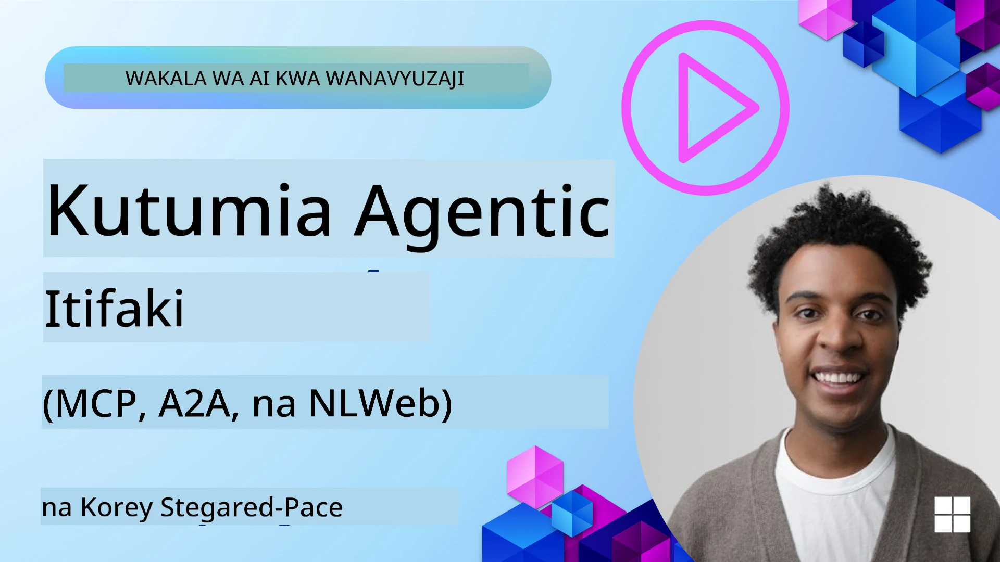
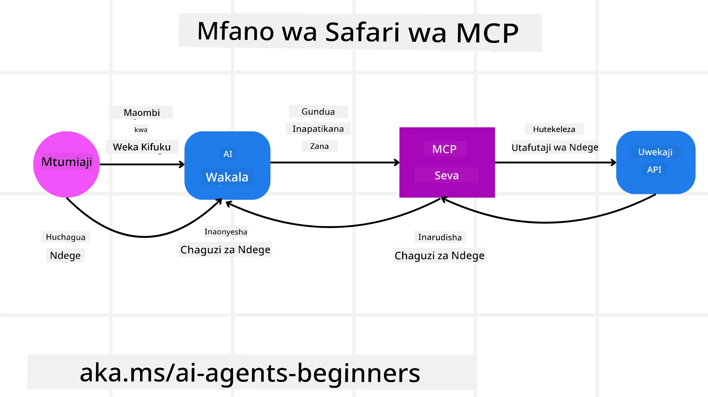
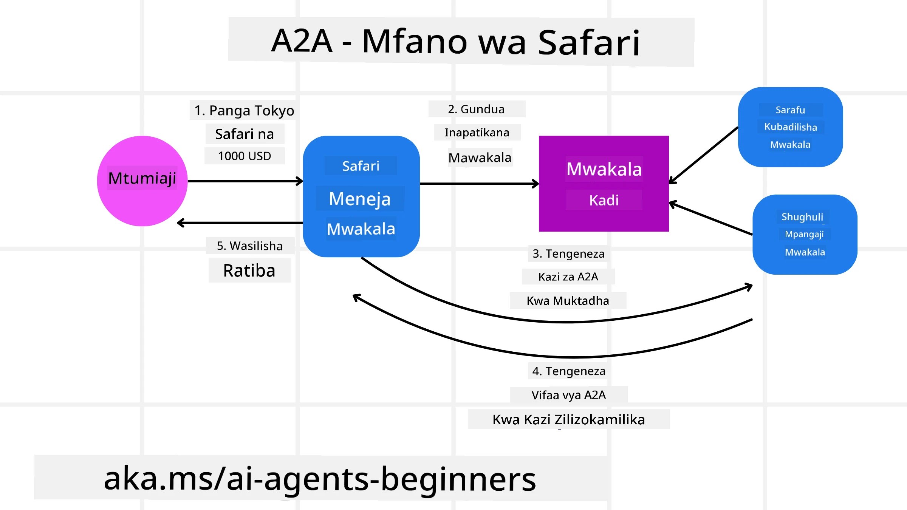
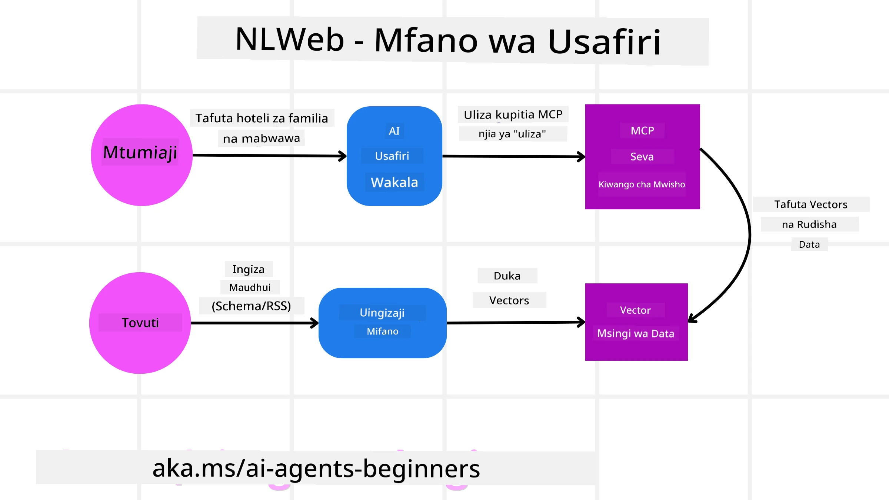

# Kutumia Itifaki za Wakala (MCP, A2A na NLWeb)

> _(Bonyeza picha hapo juu kutazama video ya somo hili)_

Kadri matumizi ya mawakala wa AI yanavyoongezeka, ndivyo inavyoongezeka haja ya itifaki zinazohakikisha kiwango, usalama, na kuunga mkono ubunifu wazi. Katika somo hili, tutafunika itifaki 3 zinazotafuta kukidhi hitaji hili - Model Context Protocol (MCP), Agent to Agent (A2A) na Natural Language Web (NLWeb).

## Utangulizi

Katika somo hili, tutashughulikia:

• Jinsi **MCP** inavyomruhusu Wakala wa AI kufikia zana na data za nje ili kukamilisha kazi za mtumiaji.

•  Jinsi **A2A** inavyowezesha mawasiliano na ushirikiano kati ya mawakala mbalimbali wa AI.

• Jinsi **NLWeb** inavyoleta kiolesura cha lugha asilia kwenye tovuti yoyote ikiruhusu Mawakala wa AI kugundua na kuingiliana na maudhui.

## Malengo ya Kujifunza

• **Tambua** kusudi kuu na faida za MCP, A2A, na NLWeb katika muktadha wa mawakala wa AI.

• **Eleza** jinsi kila itifaki inavyorahisisha mawasiliano na mwingiliano kati ya LLMs, zana, na mawakala wengine.

• **Tambua** majukumu tofauti ambayo kila itifaki inayocheza katika kujenga mifumo tata ya wakala.

## Itifaki ya Muktadha wa Mfano

The **Model Context Protocol (MCP)** ni kiwango wazi kinachotoa njia iliyostandilishwa kwa matumizi ili kutoa muktadha na zana kwa LLMs. Hii inaruhusu "universal adaptor" kwa vyanzo tofauti vya data na zana ambazo AI Agents wanaweza kuunganishwa nazo kwa njia ya kuingiliana.

Tuchunguze vipengele vya MCP, faida ikilinganishwa na matumizi ya API moja kwa moja, na mfano wa jinsi mawakala wa AI wanaweza kutumia seva ya MCP.

### Vipengele Vikuu vya MCP

MCP inafanya kazi kwa **client-server architecture** na vipengele vikuu ni:

• **Hosts** are LLM applications (for example a code editor like VSCode) that start the connections to an MCP Server.

• **Clients** ni vipengele ndani ya programu ya mwenyeji vinavyodumisha muunganisho wa moja kwa moja na seva.

• **Servers** ni programu nyepesi zinazoonyesha uwezo maalum.

Katika itifaki kuna vipengele vitatu msingi ambavyo ni uwezo wa Seva ya MCP:

• **Tools**: Hizi ni vitendo au kazi zilizo tofauti ambazo wakala wa AI anaweza kuitisha ili kutekeleza tendo. Kwa mfano, huduma ya hali ya hewa inaweza kutoa "get weather" tool, au seva ya e-commerce inaweza kutoa "purchase product" tool. MCP servers hutangaza kila jina la tool, maelezo, na input/output schema katika orodha yao ya uwezo.

• **Resources**: Hizi ni vitu vya data vya kusoma-tu au nyaraka ambazo seva ya MCP inaweza kutoa, na clients wanaweza kuzivuta wanapotaka. Mifano ni pamoja na yaliyomo kwenye faili, rekodi za hifadhidata, au faili za logi. Resources zinaweza kuwa maandishi (kama msimbo au JSON) au binary (kama picha au PDF).

• **Prompts**: Hizi ni templeti zilizowekwa tayari ambazo zinatoa mapendekezo ya prompts, kuruhusu mtiririko wa kazi tata zaidi.

### Faida za MCP

MCP inatoa faida muhimu kwa Mawakala wa AI:

• **Dynamic Tool Discovery**: Mawakala wanaweza kupokea kwa njia ya muktadha orodha ya zana zinazopatikana kutoka kwa seva pamoja na maelezo ya kile zinachofanya. Hii ni tofauti na API za jadi, ambazo mara nyingi zinahitaji uandishi wa msimbo wa kudumu kwa ushirikiano, maana mabadiliko yoyote ya API yanahitaji masasisho ya msimbo. MCP inatoa njia ya "integrate once", ikisababisha ulinganifu mkubwa.

• **Interoperability Across LLMs**: MCP inafanya kazi kwa LLMs tofauti, ikitoa unyumbufu wa kubadilisha mifano kuu ili kutathmini utendaji bora.

• **Standardized Security**: MCP inajumuisha njia ya kawaida ya authentication, kuboresha scalability wakati wa kuongeza ufikiaji kwa seva za MCP za ziada. Hii ni rahisi kuliko kusimamia funguo tofauti na aina za authentication kwa API mbalimbali za jadi.

### Mfano wa MCP

Fikiria mtumiaji anataka kuhifadhi ndege kwa kutumia msaidizi wa AI unaotegemea MCP.

1. **Muunganisho**: Msaidizi wa AI (the MCP client) anaunganishwa na seva ya MCP inayotolewa na shirika la ndege.

2. **Ugunduzi wa Zana**: Mteja anauliza seva ya MCP ya shirika la ndege, "Una zana zipi zinazopatikana?" Seva inajibu kwa zana kama "search flights" na "book flights".

3. **Kuamsha Zana**: Kisha unaomba msaidizi wa AI, "Tafadhali tafuta ndege kutoka Portland hadi Honolulu." Msaidizi wa AI, akitumia LLM yake, humtambua kwamba inahitaji kuita chombo "search flights" na kupitisha vigezo vinavyofaa (origin, destination) kwa seva ya MCP.

4. **Utekelezaji na Majibu**: Seva ya MCP, ikitenda kama wrapper, inafanya mwito halisi kwa API ya ndani ya uhifadhi ya shirika la ndege. Kisha inapokea habari za ndege (mfano, JSON data) na kuzirudisha kwa msaidizi wa AI.

5. **Mwinginezo wa Mazungumzo**: Msaidizi wa AI huwasilisha chaguo za ndege. Mara unapochagua ndege, msaidizi anaweza kuita chombo "book flight" kwenye seva ile ile ya MCP, kukamilisha uhifadhi.

## Itifaki ya Wakala kwa Wakala (A2A)

Wakati MCP inazingatia kuunganisha LLMs kwa zana, the **Agent-to-Agent (A2A) protocol** inaongeza hatua kwa kuwezesha mawasiliano na ushirikiano kati ya mawakala tofauti wa AI. A2A inaunganisha mawakala wa AI kutoka mashirika, mazingira, na tech stacks tofauti ili kukamilisha kazi ya pamoja.

Tutachunguza vipengele na faida za A2A, pamoja na mfano wa jinsi inaweza kutumika katika programu yetu ya usafiri.

### Vipengele Vikuu vya A2A

A2A inalenga kuwezesha mawasiliano kati ya mawakala na kuwafanya wafanye kazi pamoja kukamilisha sehemu ya kazi ya mtumiaji. Kila kipengele cha itifaki kinachangia hili:

#### Kadi ya Wakala

Kama seva ya MCP inavyoshirikisha orodha ya zana, Kadi ya Wakala ina:
- Jina la Wakala .
- **Maelezo ya kazi za jumla** zinazofanywa nayo.
- Orodha ya **uwezo maalum** pamoja na maelezo kusaidia mawakala wengine (au hata watumiaji wa kibinadamu) kuelewa lini na kwa nini wangetaka kumuita wakala huyo.
- **URL ya Endpoint ya sasa** ya wakala
- **toleo** na **uwezo** wa wakala kama vile streaming responses na push notifications.

#### Mtekelezaji wa Wakala

Mtekelezaji wa Wakala anahusika na **kupitisha muktadha wa mazungumzo ya mtumiaji kwa wakala wa mbali**, wakala wa mbali anahitaji hili kuelewa kazi inayoombwa. Katika seva ya A2A, wakala hutumia Modeli yake Kubwa ya Lugha (LLM) kuchambua maombi yanayoingia na kutekeleza kazi kwa kutumia zana zake za ndani.

#### Artefakti

Mara wakala wa mbali anapokamilisha kazi iliyohitajika, bidhaa yake ya kazi huundwa kama artefakti. Artefakti **ina matokeo ya kazi ya wakala**, **maelezo ya kilichokamilishwa**, na **muktadha wa maandishi** unaotumwa kupitia itifaki. Baada artefakti itakapotumwa, muunganisho na wakala wa mbali unafungwa hadi unapotakiwa tena.

#### Safu ya Matukio

Kipengele hiki kinatumiwa kwa **kushughulikia masasisho na kupitisha ujumbe**. Ni muhimu hasa katika uzalishaji kwa mifumo ya wakala ili kuzuia muunganisho kati ya mawakala kufungwa kabla kazi haijakamilika, hasa wakati muda wa kukamilisha kazi unaweza kuchukua muda mrefu.

### Faida za A2A

• **Ushirikiano ulioboreshwa**: Inawawezesha mawakala kutoka kwa wauzaji na majukwaa tofauti kuingiliana, kushiriki muktadha, na kufanya kazi pamoja, kuwezesha utaratibu wa kiotomatiki usio na mshono kwenye mifumo ambayo kihistoria ilikuwa imekatika.

• **Uwezo wa Uchaguzi wa Mfano**: Kila wakala wa A2A anaweza kuamua LLM anayotumia kutumikia maombi yake, kuruhusu mifano iliyoboreshwa au yaliyofinyangwa kwa kila wakala, tofauti na muunganisho wa LLM moja katika baadhi ya matukio ya MCP.

• **Uthibitisho uliojengwa ndani**: Uthibitisho umeingizwa moja kwa moja katika itifaki ya A2A, ukitoa mfumo imara wa usalama kwa mwingiliano wa mawakala.

### Mfano wa A2A

Tuweke mbele mfano wetu wa uhifadhi wa safari, lakini wakati huu tukitumia A2A.

1. **Ombi la Mtumiaji kwa Wakala Nyingi**: Mtumiaji anaingiliana na mteja/wakala wa A2A "Travel Agent", labda kwa kusema, "Tafadhali uhifadhi safari yote kwenda Honolulu kwa wiki ijayo, ikijumuisha ndege, hoteli, na gari la kukodisha".

2. **Kuratibu na Mwakala wa Safari**: Mwakala wa Safari anapokea ombi hili tata. Unatumia LLM yake kufikiri kuhusu kazi na kubaini kwamba inahitaji kuingiliana na mawakala maalum wengine.

3. **Mawasiliano Kati ya Mawakala**: Kisha Mwakala wa Safari hutumia itifaki ya A2A kuunganisha na mawakala wa mto wa chini, kama "Airline Agent," "Hotel Agent," na "Car Rental Agent" zilizoundwa na kampuni tofauti.

4. **Utekelezaji wa Kazi zilizogawiwa**: Mwakala wa Safari anatuma kazi maalum kwa mawakala hawa maalum (mfano, "Tafuta ndege kwenda Honolulu," "Hifadhi hoteli," "Kodi gari"). Kila mmoja wa mawakala haya maalum, wakitumia LLM zao na zana zao wenyewe (ambazo zinaweza kuwa seva za MCP), hutekeleza sehemu yake maalum ya uhifadhi.

5. **Jibu Lililojumuishwa**: Mara mawakala wote wa chini ya mto wanapokamilisha kazi zao, Mwakala wa Safari anakusanya matokeo (maelezo ya ndege, uthibitisho wa hoteli, uhifadhi wa gari la kukodisha) na kutuma jibu kamili, kwa mtindo wa chat, kwa mtumiaji.

## Mtandao wa Lugha Asilia (NLWeb)

Tovuti zimekuwa kwa muda mrefu njia kuu kwa watumiaji kupata habari na data kwenye intaneti.

Tuchunguze vipengele tofauti vya NLWeb, faida za NLWeb na mfano wa jinsi NLWeb yetu inavyofanya kazi kwa kuangalia programu yetu ya usafiri.

### Vipengele vya NLWeb

- **NLWeb Application (Core Service Code)**: Mfumo unaosindika maswali ya lugha asilia. Unaunganisha sehemu tofauti za jukwaa ili kuunda majibu. Unaweza kuifikiria kama **mashine inayoiendesha vipengele vya lugha asilia** vya tovuti.

- **NLWeb Protocol**: Hii ni **seti ya msingi ya sheria za mwingiliano wa lugha asilia** na tovuti. Inarudisha majibu kwa muundo wa JSON (mara nyingi ikitumia Schema.org). Kusudi lake ni kuunda msingi rahisi kwa "AI Web," kwa njia ile ile HTML ilivyofanya iwezekane kushiriki nyaraka mtandaoni.

- **MCP Server (Model Context Protocol Endpoint)**: Kila usanidi wa NLWeb pia hufanya kazi kama **seva ya MCP**. Hii ina maana inaweza **kushiriki zana (kama njia ya “ask”) na data** na mifumo mingine ya AI. Katika vitendo, hii inafanya maudhui na uwezo wa tovuti utumike na mawakala wa AI, kuruhusu tovuti kuwa sehemu ya mfumo mpana wa "agent ecosystem."

- **Embedding Models**: Mifano hii inatumiwa **kubadilisha yaliyomo kwenye tovuti kuwa uwakilishi wa nambari unaoitwa vectors** (embeddings). Vectors hizi zinakamata maana kwa njia ambayo kompyuta zinaweza kuzilinganisha na kuvitafuta. Zinahifadhiwa katika hifadhidata maalum, na watumiaji wanaweza kuchagua ni embedding model gani wanayotaka kutumia.

- **Vector Database (Retrieval Mechanism)**: Hifadhidata hii **inahifadhi embeddings za yaliyomo kwenye tovuti**. Mtu anapoomba swali, NLWeb huchunguza vector database ili kupata haraka taarifa zinazofaa zaidi. Inatoa orodha ya haraka ya majibu yanayoweza, yakiwa yamepangwa kwa kufanana. NLWeb inafanya kazi na mifumo mbalimbali ya kuhifadhi vector kama Qdrant, Snowflake, Milvus, Azure AI Search, na Elasticsearch.

### NLWeb kwa Mfano

Tazama tena tovuti yetu ya uhifadhi wa usafiri, lakini wakati huu iwe inaendeshwa na NLWeb.

1. **Kuingiza Data**: Katalogi za bidhaa zilizopo za tovuti ya usafiri (mfano, orodha za ndege, maelezo ya hoteli, vifurushi vya ziara) zimefomatiwa kwa kutumia Schema.org au kupakiwa kupitia RSS feeds. Zana za NLWeb huingiza data hii iliyopangwa, kuunda embeddings, na kuziweka katika hifadhidata ya vector ya ndani au ya mbali.

2. **Utafutaji kwa Lugha Asilia (Mtu)**: Mtumiaji anatembelea tovuti na, badala ya kuvinjari menyu, anaandika kwenye kiolesura cha chat: "Nipe hoteli rafiki kwa familia huko Honolulu yenye bwawa kwa wiki ijayo".

3. **Usindishaji wa NLWeb**: Programu ya NLWeb inapokea swali hili. Inatuma swali kwa LLM kuelewa na kwa wakati mmoja inatafuta katika vector database yake kwa orodha za hoteli zinazofaa.

4. **Matokeo Sahihi**: LLM husaidia kutafsiri matokeo ya utafutaji kutoka kwenye hifadhidata, kubaini mechi bora kulingana na vigezo 'rafiki kwa familia', 'bwawa', na 'Honolulu', na kisha kuunda jibu kwa lugha asilia. Muhimu, jibu linarejea hoteli halisi kutoka katika katalogi ya tovuti, likiepuka kutoa taarifa zilizotengenezwa.

5. **Mawasiliano na Wakala wa AI**: Kwa kuwa NLWeb inatumikia kama seva ya MCP, wakala wa AI wa nje pia anaweza kuunganishwa na mfano wa NLWeb wa tovuti hii. Wakala wa AI anaweza kutumia `ask` MCP method kuuliza tovuti moja kwa moja: `ask("Are there any vegan-friendly restaurants in the Honolulu area recommended by the hotel?")`. Mfano wa NLWeb utasindika hili, ukitumia hifadhidata yake ya taarifa za mikahawa (ikiwa imeingizwa), na kurudisha jibu lililopangwa la JSON.

### Una Maswali Zaidi kuhusu MCP/A2A/NLWeb?

Jiunge na [Microsoft Foundry Discord](https://aka.ms/ai-agents/discord) kukutana na wanafunzi wengine, kuhudhuria saa za ofisi na kupata majibu ya maswali yako kuhusu AI Agents.

## Rasilimali

- [MCP kwa Waanzilishi](https://aka.ms/mcp-for-beginners)  
- [Nyaraka za MCP](https://learn.microsoft.com/python/api/overview/azure/ai-projects-readme)
- [Repo ya NLWeb](https://github.com/nlweb-ai/NLWeb)
- [Mfumo wa Wakala wa Microsoft](https://aka.ms/ai-agents-beginners/agent-framewrok)

---

<!-- CO-OP TRANSLATOR DISCLAIMER START -->
Taarifa ya kutokuwajibika:
Nyaraka hii imetafsiriwa kwa kutumia huduma ya tafsiri ya AI [Co-op Translator](https://github.com/Azure/co-op-translator). Ingawa tunajitahidi kuhakikisha usahihi, tafadhali kumbuka kwamba tafsiri za kiotomatiki zinaweza kuwa na makosa au kutokuwa sahihi. Nyaraka ya asili katika lugha yake inapaswa kuchukuliwa kama chanzo cha kuaminika. Kwa taarifa muhimu, inashauriwa kutumia tafsiri ya kitaalamu inayofanywa na mtu. Hatuwajibiki kwa uelewa potofu au upotoshaji unaotokana na matumizi ya tafsiri hii.
<!-- CO-OP TRANSLATOR DISCLAIMER END -->