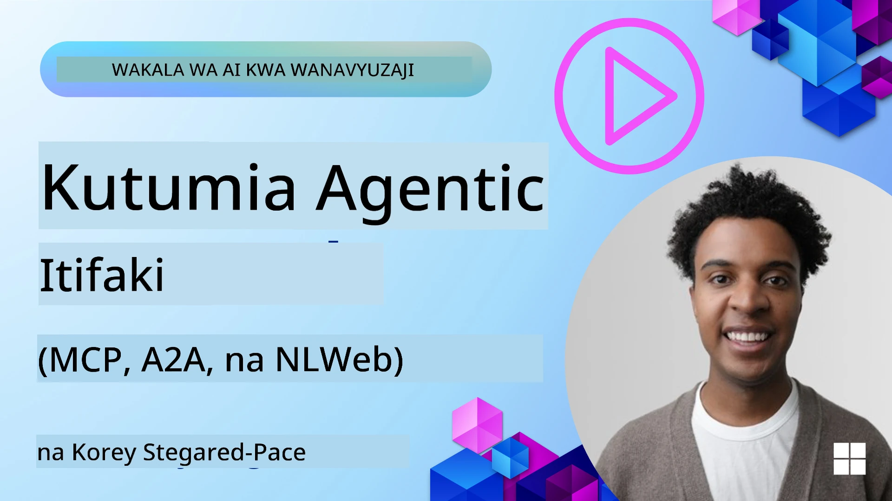
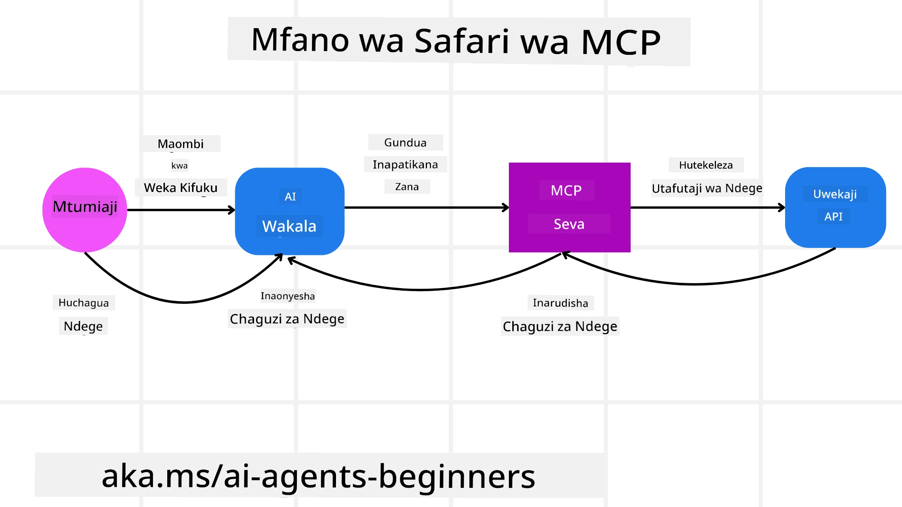
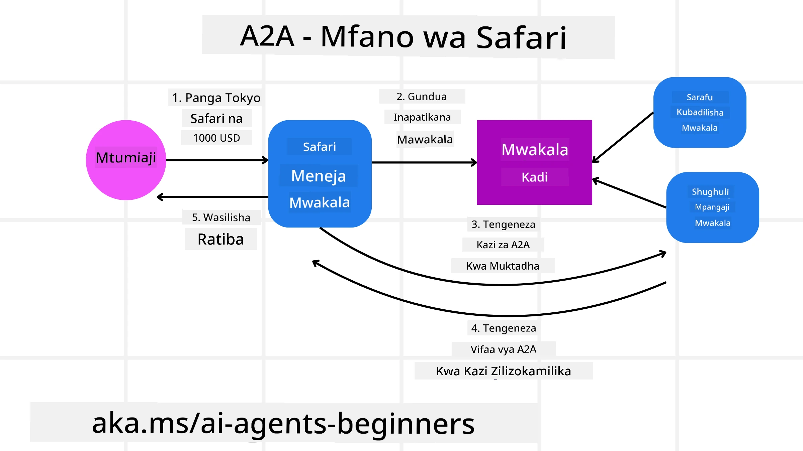
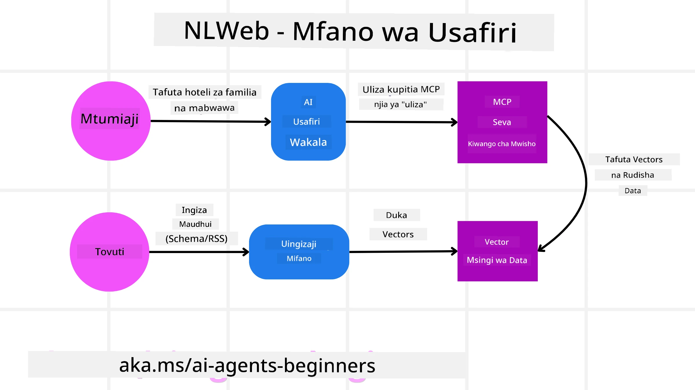

# Kutumia Itifaki za Wakala (MCP, A2A na NLWeb)

> _(Bonyeza picha hapo juu kutazama video ya somo hili)_

Kadri matumizi ya mawakala wa AI yanavyoongezeka, ndivyo pia inavyoongezeka hitaji la itifaki zinazohakikisha kuwepo kwa muundo thabiti, usalama, na kusaidia ubunifu huru. Katika somo hili, tutajadili itifaki 3 zinazolenga kukidhi hitaji hili - Itifaki ya Muktadha wa Mfano (MCP), Wakala kwa Wakala (A2A) na Mtandao wa Lugha Asilia (NLWeb).

## Utangulizi

Katika somo hili, tutajadili:

• Jinsi **MCP** inavyowaruhusu Wakala wa AI kufikia zana na data za nje ili kukamilisha kazi za mtumiaji.

• Jinsi **A2A** inavyorahisisha mawasiliano na ushirikiano kati ya mawakala tofauti wa AI.

• Jinsi **NLWeb** inavyowaletea mawakala wa AI nyezo za lugha asilia katika tovuti yoyote, kuwezesha kugundua na kuingiliana na yaliyomo.

## Malengo ya Kujifunza

• **Tambua** madhumuni kuu na faida za MCP, A2A, na NLWeb katika muktadha wa mawakala wa AI.

• **Eleza** jinsi kila itifaki inavyorahisisha mawasiliano na mwingiliano kati ya LLMs, zana, na mawakala wengine.

• **Tambua** majukumu tofauti ambayo kila itifaki inacheza katika ujenzi wa mifumo tata ya wakala.

## Itifaki ya Muktadha wa Mfano

**Itifaki ya Muktadha wa Mfano (MCP)** ni kiwango wazi kinachotoa njia iliyopangwa za kawaida kwa programu kutoa muktadha na zana kwa LLMs. Hii inaruhusu "kiunganishi cha ulimwengu" kwa vyanzo tofauti vya data na zana ambazo mawakala wa AI wanaweza kuunganishwa nazo kwa njia thabiti.

Tuchunguze vipengele vya MCP, faida ikilinganishwa na matumizi ya API moja kwa moja, na mfano wa jinsi mawakala wa AI wanavyoweza kutumia seva ya MCP.

### Vipengele Vikuu vya MCP

MCP inafanya kazi kwa **miundo ya mteja-seva** na vipengele vikuu ni:

• **Wenyeji** ni programu za LLM (kwa mfano mhariri wa msimbo kama VSCode) zinazozindua muunganisho kwa Seva ya MCP.

• **Wateja** ni vipengele ndani ya programu mwenyeji ambavyo huhuisha muunganisho wa mmoja kwa moja na seva.

• **Seva** ni programu nyepesi zinazoweka wazi uwezo maalum.

Katika itifaki kuna mizizi mitatu ya msingi ambayo ni uwezo wa Seva ya MCP:

• **Zana**: Hizi ni vitendo au kazi za pekee ambavyo wakala wa AI anaweza kuita kutekeleza kitendo. Kwa mfano, huduma ya hali ya hewa inaweza kuweka wazi zana ya "pata hali ya hewa," au seva ya biashara mtandaoni inaweza kuweka wazi zana ya "nunua bidhaa." Seva za MCP hutangaza jina la kila zana, maelezo, na mpangilio wa pembejeo/pembezaji katika orodha yao ya uwezo.

• **Rasilimali**: Hizi ni vitu au nyaraka za data za kusomeka tu ambazo seva ya MCP inaweza kutoa, na wateja wanaweza kuzipata kwa mahitaji. Mifano ni kama yaliyomo ya faili, rekodi za hifadhidata, au faili za kumbukumbu. Rasilimali zinaweza kuwa maandishi (kama msimbo au JSON) au binary (kama picha au PDF).

• **Maelekezo**: Hizi ni templeti zilizotengenezwa mapema zinazotoa maelekezo yanayopendekezwa, kuruhusu mtiririko wa kazi tata zaidi.

### Faida za MCP

MCP hutoa faida kubwa kwa mawakala wa AI:

• **Ugunduzi wa Zana kwa Mbelemo**: Mawakala wanaweza kupokea orodha ya zana zinazopatikana kutoka kwa seva pamoja na maelezo ya kile wanachofanya. Hii ni tofauti na API za kawaida, ambazo mara nyingi zinahitaji usimbaji wazi wa mara moja kwa uunganishaji, maana mabadiliko yoyote ya API yanahitaji masasisho ya msimbo. MCP hutoa njia ya "unganisha mara moja," inayorejesha urahisi mkubwa.

• **Ushirikiano Kati ya LLM Mbali Mbali**: MCP hufanya kazi kati ya LLM tofauti, ikitoa urahisi wa kubadili mifano kuu ili kutathmini utendaji bora zaidi.

• **Usalama wa Kiwango Mmoja**: MCP inajumuisha mbinu ya uthibitishaji wa kiwango, ikiboresha upanuzi wakati wa kuongeza ufikiaji kwa seva zaidi za MCP. Hii ni rahisi ikilinganishwa na kusimamia funguo tofauti na aina za uthibitishaji kwa API za kawaida.

### Mfano wa MCP

Fikiria mtumiaji anayetaka kutia tiketi ya ndege kwa msaada wa msaidizi wa AI unaotumia MCP.

1. **Muunganisho**: Msaidizi wa AI (mteja wa MCP) anaunganisha na seva ya MCP inayotolewa na shirika la ndege.

2. **Ugunduzi wa Zana**: Mteja anamuuliza seva ya MCP ya shirika la ndege, "Nina zana gani zinazopatikana?" Seva hutoa majibu kama "tafuta ndege" na "tia tiketi ndege".

3. **Kuitisha Zana**: Kisha unaomba msaidizi wa AI, "Tafadhali tafuta ndege kutoka Portland kwenda Honolulu." Msaidizi wa AI, akitumia LLM yake, hutambua anahitaji kuita zana ya "tafuta ndege" na hupitisha parameta husika (mahali pa kuanzia, mahali pa mwisho) kwa seva ya MCP.

4. **Utekelezaji na Jibu**: Seva ya MCP, ikiwa kama kifuniko, hufanya wito halisi kwa API ya ndani ya tiketi ya shirika la ndege. Kisha hupokea habari za ndege (mfano, data ya JSON) na kuzirudisha kwa msaidizi wa AI.

5. **Mwingiliano Zaidi**: Msaidizi wa AI huonyesha chaguo za ndege. Baada ya kuchagua ndege, msaidizi anaweza kuitisha zana ya "tia tiketi ndege" kwenye seva ile ile ya MCP, na kumaliza tiketi.

## Itifaki Wakala kwa Wakala (A2A)

Wakati MCP inazingatia kuunganisha LLM na zana, **itifaki ya Wakala kwa Wakala (A2A)** inaenda hatua zaidi kwa kuruhusu mawasiliano na ushirikiano kati ya mawakala tofauti wa AI. A2A huunganisha mawakala wa AI kutoka mashirika, mazingira na mifumo tofauti kutekeleza kazi pamoja.

Tutaangalia vipengele na faida za A2A, pamoja na mfano wa jinsi inaweza kutumika katika programu yetu ya usafiri.

### Vipengele Vikuu vya A2A

A2A inalenga kuwezesha mawasiliano kati ya mawakala na kufanya kazi pamoja kumaliza sehemu ya kazi ya mtumiaji. Kila kipengele cha itifaki kinachangia hili:

#### Kadi ya Wakala

Kama vile seva ya MCP inavyoonyesha orodha ya zana, Kadi ya Wakala ina:
- Jina la Wakala.
- **Maelezo ya kazi za jumla** zinazofanyika.
- **Orodha ya ujuzi maalum** pamoja na maelezo kusaidia mawakala wengine (au hata watumiaji wa binadamu) kuelewa lini na kwa nini wangependa kumuita wakala huyo.
- **URL ya Endpoint ya sasa** ya wakala.
- **Toleo** na **uwezo** wa wakala kama vile majibu ya mfululizo na arifa za kusukuma.

#### Mtendaji wa Wakala

Mtendaji wa Wakala anahusika na **kupitisha muktadha wa mazungumzo ya mtumiaji kwa wakala wa mbali**, wakala wa mbali anahitaji hili kuelewa kazi inayohitajika kufanyika. Katika seva ya A2A, wakala hutumia Mfano Wake Mkuu wa Lugha (LLM) kusoma maombi yanayoingia na kutekeleza kazi kwa kutumia zana zake za ndani.

#### Kazi

Mara wakala wa mbali anapomaliza kazi iliyoombwa, bidhaa yake ya kazi huundwa kama kazi. Kazi **ina matokeo ya kazi ya wakala**, **maelezo ya kile kilichokamilishwa**, na **muktadha wa maandishi** unaotumwa kupitia itifaki. Baada ya kazi kutumwa, muunganisho na wakala wa mbali unafungwa hadi utakapohitajika tena.

#### Foleni ya Tukio

Kipengele hiki kinatumika kwa **kusimamia masasisho na kupitisha ujumbe**. Ni muhimu hasa katika utengenezaji wa mifumo ya wakala ili kuzuia muunganisho kati ya mawakala kufungwa kabla ya kazi kukamilika, hasa wakati muda wa kukamilisha kazi unaweza kuchukua muda mrefu.

### Faida za A2A

• **Ushirikiano Ulioboreshwa**: Inawawezesha mawakala kutoka wauzaji na majukwaa tofauti kuingiliana, kushiriki muktadha, na kushirikiana, kuruhusu uendeshaji wa mtiririko usio na mshikamano kati ya mifumo ambayo hapo awali haikuunganishwa.

• **Urahisi wa Kuchagua Mfano**: Kila wakala wa A2A anaweza kuamua LLM gani ataitumia kuhudumia maombi yake, kuruhusu mifano iliyoboreshwa au iliyobinafsishwa kwa kila wakala, tofauti na muunganisho mmoja wa LLM katika baadhi ya matukio ya MCP.

• **Uthibitishaji Umejumuishwa**: Uthibitishaji umeingizwa moja kwa moja katika itifaki ya A2A, ukitoa mfumo thabiti wa usalama kwa mwingiliano wa mawakala.

### Mfano wa A2A

Tuchukue mfano wa hali ya kusafiri, lakini wakati huu tukitumia A2A.

1. **Ombi la Mtumiaji kwa Mawakala Wengi**: Mtumiaji anawasiliana na mteja/wakala wa "Wakala wa Safari" wa A2A, labda akisema, "Tafadhali tia tiketi safari yote kwenda Honolulu wiki ijayo, ikijumuisha ndege, hoteli, na gari la kukodisha."

2. **Uratibu kwa Wakala wa Safari**: Wakala wa Safari anapokea ombi hili tata. Hutumia LLM yake kufikiria kuhusu kazi na kubaini kwamba inahitaji kuingiliana na mawakala maalum wengine.

3. **Mawasiliano kati ya Mawakala**: Kisha Wakala wa Safari hutumia itifaki ya A2A kuunganishwa na mawakala wa chini ya mto, kama vile "Wakala wa Kampuni ya Ndege," "Wakala wa Hoteli," na "Wakala wa Kukodisha Gari" waliotengenezwa na makampuni tofauti.

4. **Utekelezaji wa Kazi ulio Delegwa**: Wakala wa Safari hutuma kazi maalum kwa mawakala hawa maalum (mfano, "Tafuta ndege kwenda Honolulu," "Tia tiketi hoteli," "Kodia gari"). Kila wakala maalum, akitumia LLM zao na zana zao binafsi (ambazo zinaweza kuwa seva za MCP), hufanya sehemu yake maalum ya ukodishaji.

5. **Jibu Lililounganishwa**: Mara mawakala wote wa chini ya mto wanapomaliza kazi zao, Wakala wa Safari anakusanya matokeo (maelezo ya ndege, uthibitisho wa hoteli, ukodishaji gari) na kutuma jibu la mazungumzo kwa mtumiaji.

## Mtandao wa Lugha Asilia (NLWeb)

Tovuti zimekuwa njia kuu kwa watumiaji kupata taarifa na data mtambuka mtandao.

Tuchunguze vipengele tofauti vya NLWeb, faida za NLWeb na mfano wa jinsi NLWeb yetu inavyofanya kazi kwa kuangalia programu yetu ya usafiri.

### Vipengele vya NLWeb

- **Programu ya NLWeb (Msingi wa Huduma ya Msimbo)**: Mfumo unaofanya kazi na maswali ya lugha asilia. Unaua sehemu tofauti za jukwaa kuunda majibu. Unaweza kuiangalia kama **mashine inayoendesha vipengele vya lugha asilia** vya tovuti.

- **Itifaki ya NLWeb**: Hii ni **seti ya msingi ya sheria za mwingiliano wa lugha asilia** na tovuti. Inarudisha majibu kwa muundo wa JSON (mara nyingi ikitumia Schema.org). Kusudi lake ni kuunda msingi wa “Mtandao wa AI,” kama vile HTML ilivyowezesha kushiriki nyaraka mtandaoni.

- **Seva ya MCP (Mwisho wa Itifaki ya Muktadha wa Mfano)**: Kila usanidi wa NLWeb pia hufanya kazi kama **seva ya MCP**. Hii ina maana inaweza **kushiriki zana (kama njia ya "uliza") na data** na mifumo mingine ya AI. Katika matumizi, hii inafanya yaliyomo na uwezo wa tovuti kutumika na mawakala wa AI, kuruhusu tovuti kuwa sehemu ya “ekosistimu ya wakala” kubwa.

- **Mifano ya Embedding**: Mifano hii hutumika **kubadilisha yaliyomo ya tovuti kuwa uwakilishi wa nambari uitwao vectors** (embeddings). Vectors hizi zinakusanya maana kwa njia ambayo kompyuta zinaweza kulinganisha na kutafuta. Zinahifadhiwa kwenye hifadhidata maalum, na watumiaji wanaweza kuchagua mfano wa embedding wanayotaka kutumia.

- **Hifadhidata ya Vector (Mfumo wa Urejeshaji)**: Hifadhidata hii **inahifadhi embeddings za yaliyomo ya tovuti**. Wakati mtu anauliza swali, NLWeb huangalia hifadhidata ya vector ili kupata haraka taarifa zinazofaa zaidi. Hutoa orodha ya majibu yanayowezekana, yakiwaamezwa kwa utofauti. NLWeb hufanya kazi na mifumo tofauti ya kuhifadhi vector kama Qdrant, Snowflake, Milvus, Azure AI Search, na Elasticsearch.

### NLWeb kwa Mfano

Tuchukulie tena tovuti yetu ya ukodishaji wa usafiri, lakini wakati huu, inashirikishwa na NLWeb.

1. **Kuingiza Data**: Katalogi za bidhaa zilizopo kwenye tovuti ya usafiri (mfano, orodha za ndege, maelezo ya hoteli, vifurushi vya ziara) zimepangwa kwa kutumia Schema.org au kupakuliwa kupitia RSS. Zana za NLWeb huingiza data hii iliyopangwa, kutengeneza embeddings, na kuihifadhi kwenye hifadhidata ya vector ya ndani au ya mbali.

2. **Swali la Lugha Asilia (Binadamu)**: Mtumiaji anatembelea tovuti na, badala ya kuvinjari menu, anaandika kwenye kiolesura cha mazungumzo: "Nipatie hoteli rafiki kwa familia mjini Honolulu yenye bwawa la kuogelea kwa wiki ijayo."

3. **Ushindiliaji wa NLWeb**: Programu ya NLWeb inapokea swali hili. Inatumia LLM kuelewa na kwa wakati huo huo kutafuta hifadhidata yake ya vector kupata orodha za hoteli zinazofaa.

4. **Matokeo Sahihi**: LLM husaidia kufasiri matokeo ya utafutaji kutoka hifadhidata, kubaini mechi bora kulingana na vigezo "rafiki kwa familia," "bwawa," na "Honolulu," halafu kuandaa jibu la lugha asilia. Muhimu, jibu linahusisha hoteli halisi kutoka kwenye katalogi ya tovuti, kuepuka taarifa za kubuniwa.

5. **Mwingiliano wa Wakala wa AI**: Kwa kuwa NLWeb hutumika kama seva ya MCP, wakala wa AI wa usafiri wa nje pia anaweza kuunganishwa na toleo la NLWeb la tovuti hii. Wakala wa AI anaweza kutumia njia ya MCP `ask` kuuliza moja kwa moja tovuti: `ask("Je, kuna migahawa rafiki kwa wenye milo ya mboga-kula katika eneo la Honolulu inayopendekezwa na hoteli?")`. Toleo la NLWeb lingefanya usindikaji huu, likitumia hifadhidata yake ya habari za migahawa (ikiwa imepakuliwa), na kurudisha jibu la muundo wa JSON.

### Una Maswali Zaidi kuhusu MCP/A2A/NLWeb?

Jiunge na [Microsoft Foundry Discord](https://discord.com/invite/ATgtXmAS5D) kukutana na wanafunzi wengine, kuhudhuria saa za ofisi na kupata majibu ya maswali yako kuhusu Mawakala wa AI.

## Rasilimali

- [MCP kwa Waanzilishi](https://aka.ms/mcp-for-beginners)  
- [Nyaraka za MCP](https://learn.microsoft.com/python/api/overview/azure/ai-projects-readme)
- [Rekodi ya NLWeb](https://github.com/nlweb-ai/NLWeb)
- [Mfumo wa Wakala wa Microsoft](https://learn.microsoft.com/en-us/agent-framework/overview/?wt.mc_id=youtube_26688_organicsocial_reactor&pivots=programming-language-python)

## Somo lililopita

[Mawakala wa AI katika Uzalishaji](../10-ai-agents-production/README.md)

## Somo lijalo

[Uhandisi wa Muktadha kwa Mawakala wa AI](../12-context-engineering/README.md)

---

<!-- CO-OP TRANSLATOR DISCLAIMER START -->
**Kionyozo**:
Hati hii imetafsiriwa kwa kutumia huduma ya tafsiri ya AI [Co-op Translator](https://github.com/Azure/co-op-translator). Ingawa tunajitahidi kupata usahihi, tafadhali fahamu kwamba tafsiri za kiotomatiki zinaweza kuwa na makosa au upungufu wa usahihi. Hati ya asili katika lugha yake halisi inapaswa kuchukuliwa kama chanzo cha mamlaka. Kwa taarifa muhimu, tafsiri ya kitaalamu inayofanywa na binadamu inapendekezwa. Hatutojibu kwa kuelewa vibaya au tafsiri potofu zinazotokea kutokana na matumizi ya tafsiri hii.
<!-- CO-OP TRANSLATOR DISCLAIMER END -->