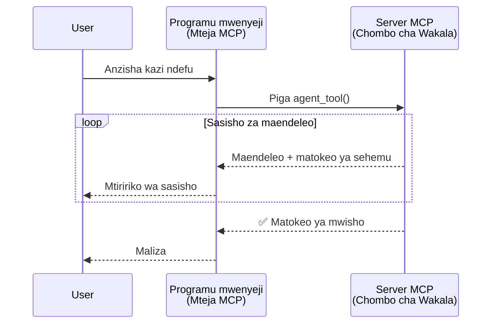
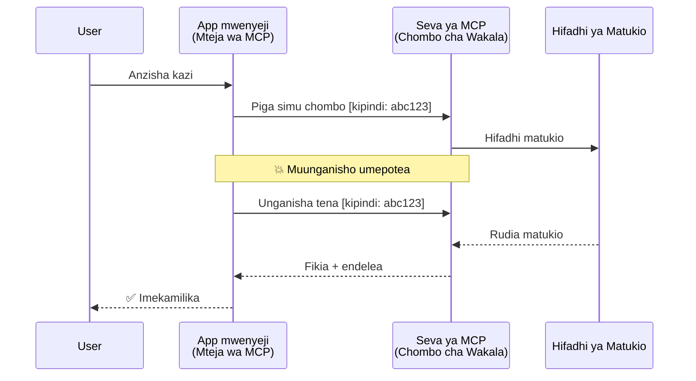
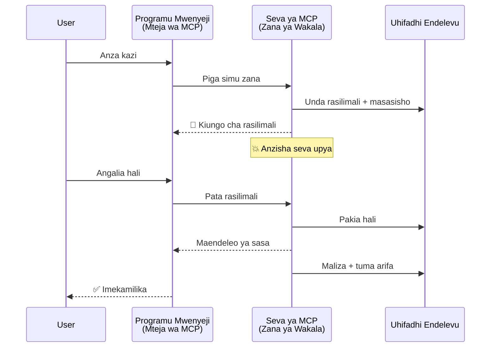
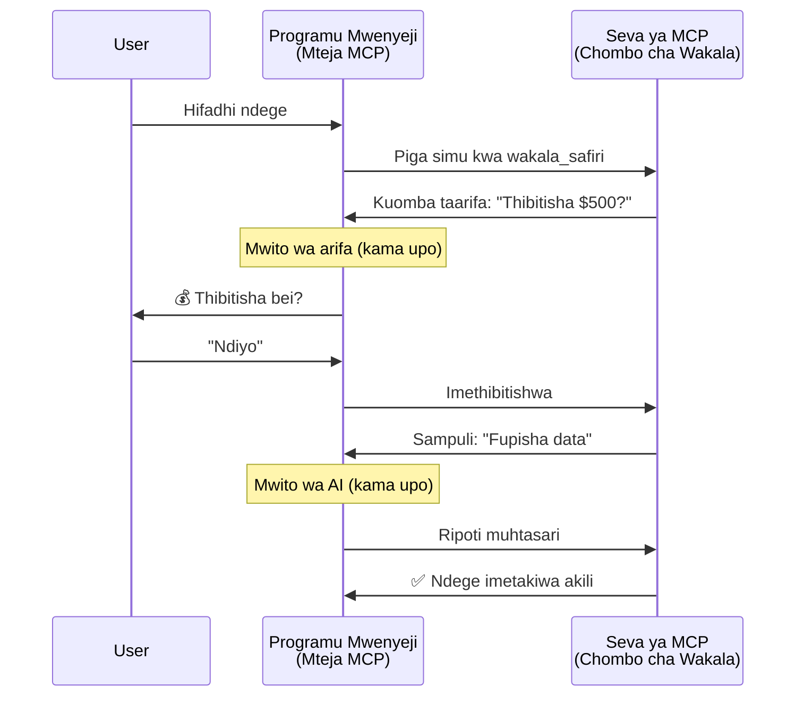
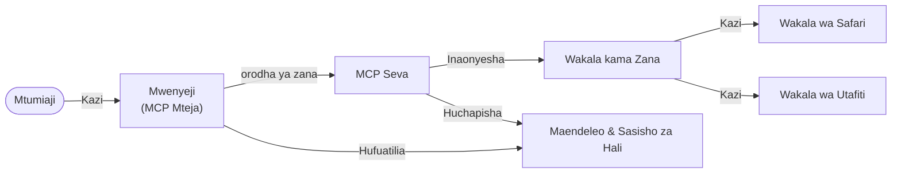

# Kujenga Mifumo ya Mawasiliano ya Wakala kwa Wakala kutumia MCP

> TL;DR - Je, Unaweza Kujenga Mawasiliano ya Agent2Agent kwenye MCP? Ndiyo!

MCP imeendelea sana zaidi ya lengo lake la awali la "kutoa muktadha kwa LLMs". Kwa maboresho ya hivi karibuni ikiwa ni pamoja na [mitiririko inayoweza kuendelea](https://modelcontextprotocol.io/docs/concepts/transports#resumability-and-redelivery), [ulazaji](https://modelcontextprotocol.io/specification/2025-06-18/client/elicitation), [uchanganuzi](https://modelcontextprotocol.io/specification/2025-06-18/client/sampling), na taarifa ([maendeleo](https://modelcontextprotocol.io/specification/2025-06-18/basic/utilities/progress) na [rasilimali](https://modelcontextprotocol.io/specification/2025-06-18/schema#resourceupdatednotification)), MCP sasa hutoa msingi imara wa kujenga mifumo tata ya mawasiliano ya wakala kwa wakala.

## Dhana Potofu ya Wakala/Vifaa

Wakati wa waendelezaji wengi wanapochunguza zana zenye tabia za wakala (kuzidi muda mrefu, huenda zikahitaji maingilio zaidi katikati ya utekelezaji, n.k.), dhana potofu ya kawaida ni kwamba MCP haifai hasa kwa sababu mifano ya awali ya zana zake ilizingatia mifumo rahisi ya ombi-jawabisho.

Mtazamo huu umepita. Maelezo ya MCP yameboreshwa sana katika miezi michache iliyopita kwa uwezo ambao unaondoa pengo la kujenga tabia ya wakala inayodumu kwa muda mrefu:

- **Utoaji wa Matiririko & Matokeo Sehemu**: Taarifa za maendeleo ya wakati halisi wakati wa utekelezaji
- **Uwezo wa Kuendelezwa**: Wateja wanaweza kuunganishwa tena na kuendelea baada ya kutengana
- **Uhimili**: Matokeo hutunzwa hata baada ya kuanzishwa upya kwa seva (mfano, kupitia viungo vya rasilimali)
- **Mzunguko wa Nyingi**: Uingizaji wa maingilio ya mwingiliano katikati ya utekelezaji kupitia ulazaji na uchanganuzi

Vipengele hivi vinaweza kuunganishwa kuwezesha programu ngumu za wakala na wakala wengi, zote zikitumia itifaki ya MCP.

Kwa marejeleo, tutamuita wakala "kifaa" kinachopatikana kwenye seva ya MCP. Hii ina maana ya kuwepo kwa programu mwenyeji inayotekeleza mteja wa MCP anayezindua kikao na seva ya MCP na anaweza kuita wakala.

## Nini Hufanya Kifaa cha MCP Kuwa "Mwakala"?

Kabla ya kuingia katika utekelezaji, wacha tutae uwezo wa miundombinu unaohitajika kuunga mkono mawakala wanaodumu kwa muda mrefu.

> Tutataja wakala kama kiumbe kinachoweza kufanya kazi kwa uhuru kwa vipindi virefu, chenye uwezo wa kushughulikia kazi ngumu zinazoweza kuhitaji mwingiliano au marekebisho kulingana na maoni ya wakati halisi.

### 1. Utoaji wa Matiririko & Matokeo Sehemu

Mifumo ya kawaida ya ombi-jawabu haifanyi kazi kwa kazi zinazomilikiwa kwa muda mrefu. Wakala wanahitaji kutoa:

- Taarifa za maendeleo ya wakati halisi
- Matokeo ya kati

**Msaada wa MCP**: Taarifa za masasisho ya rasilimali zinawezesha utoaji wa matokeo ya sehemu kwa mtiririko, ingawa hii inahitaji muundo makini ili kuepuka migongano na modeli ya ombi/jawabu ya JSON-RPC 1:1.

| Kipengele                  | Matumizi                                                                                                                                                                      | Msaada wa MCP                                                                             |
| ------------------------- | ----------------------------------------------------------------------------------------------------------------------------------------------------------------------------- | ----------------------------------------------------------------------------------------- |
| Taarifa za Maendeleo ya Wakati Halisi | Mtumiaji anaomba kazi ya uhamishaji wa msimbo wa programu. Wakala anatiririsha maendeleo: "10% - Kuchambua utegemezi... 25% - Kubadilisha faili za TypeScript... 50% - Kusasisha uingizaji..." | ✅ Taarifa za maendeleo                                                                     |
| Matokeo Sehemu            | Kazi ya "Tengeneza kitabu" inatiririsha matokeo ya sehemu, mfano, 1) Muhtasari wa hadithi, 2) Orodha ya sura, 3) Kila sura ikimalizika. Mwenyeji anaweza kuchunguza, kufuta, au kuelekeza tena katika hatua yoyote. | ✅ Taarifa zinaweza "kuongezwa" kujumuisha matokeo ya sehemu angalia mapendekezo kwenye PR 383, 776 |

<div align="center" style="font-style: italic; font-size: 0.95em; margin-bottom: 0.5em;">
<strong>Mchoro 1:</strong> Mchoro huu unaonyesha jinsi wakala wa MCP anavyotiririsha taarifa za maendeleo ya wakati halisi na matokeo ya sehemu kwa programu mwenyeji wakati wa kazi inayochukua muda mrefu, kuwezesha mtumiaji kufuatilia utekelezaji kwa wakati halisi.
</div>



### 2. Uwezo wa Kuendelezwa

Wakala wanapaswa kushughulikia kukatika kwa mtandao kwa hila:

- Kuunganishwa tena baada ya kutenganishwa (mtekoji)
- Kuendelea kutoka walipoacha (kuratibishwa upya kwa ujumbe)

**Msaada wa MCP**: Usafiri wa MCP StreamableHTTP leo unaunga mkono kuendelea kwa kikao na kuratibishwa upya kwa ujumbe kwa kutumia vitambulisho vya kikao na matukio ya mwisho. Kumbuka hapa ni kwamba seva lazima itekeleze EventStore inayowezesha kurudisha matukio wakati mteja anapounganishwa tena.  
Kumbuka kwamba kuna pendekezo la jamii (PR #975) linalochunguza mitiririko inayoweza kuendelezwa isiyojali usafiri.

| Kipengele      | Matumizi                                                                                                                                                   | Msaada wa MCP                                                               |
| ------------- | ---------------------------------------------------------------------------------------------------------------------------------------------------------- | --------------------------------------------------------------------------- |
| Uendelezaji   | Mteja anatenganishwa wakati wa kazi inayochukua muda mrefu. Anapounganishwa tena, kikao kinaendelea na matukio yaliyokosa kurudishwa, inaendelea bila mshono kutoka walipoacha. | ✅ Usafiri wa StreamableHTTP na vitambulisho vya kikao, kurudisha matukio, na EventStore |

<div align="center" style="font-style: italic; font-size: 0.95em; margin-bottom: 0.5em;">
<strong>Mchoro 2:</strong> Mchoro huu unaonyesha jinsi usafiri wa MCP StreamableHTTP na hifadhi ya matukio vinavyowezesha kuendelezwa kwa kikao bila shida: ikiwa mteja anakatika, anaweza kuunganishwa tena na kurudisha matukio yaliyokosa, kuendelea na kazi bila kupoteza maendeleo.
</div>



### 3. Uhimili

Wakala wanaodumu kwa muda mrefu wanahitaji hali ya kudumu:

- Matokeo hudumu hata baada ya kuanzishwa upya kwa seva
- Hali inaweza kupatikana bila kuingilia kazi kuu
- Kufuatilia maendeleo katika vikao vingi

**Msaada wa MCP**: MCP sasa unaunga mkono aina ya marejeleo ya rasilimali kwa simu za zana. Leo, mtindo wa kawaida ni kubuni kifaa kinachotengeneza rasilimali na mara moja kurudisha kiungo cha rasilimali. Kifaa kinaweza kuendelea kushughulikia kazi kwa nyuma na kusasisha rasilimali. Kwa upande mwingine, mteja anaweza kuchagua kuangalia hali ya rasilimali hii kupata matokeo ya sehemu au kamili (kulingana na masasisho ya rasilimali yanayotolewa na seva) au kujiandikisha kwa rasilimali kwa taarifa za masasisho.

Kizuizi kimoja hapa ni kwamba kuangalia mara kwa mara rasilimali au kujiandikisha kwa masasisho kunaweza kutumia rasilimali na kuleta athari kwa wingi. Kuna pendekezo la jamii linaloendelea (likijumuisha #992) linalochunguza uwezekano wa kujumuisha webhooks au vichocheo ambavyo seva inaweza kuita kuwajulisha mteja/programu mwenyeji kuhusu masasisho.

| Kipengele    | Matumizi                                                                                                                                        | Msaada wa MCP                                                        |
| ----------- | ----------------------------------------------------------------------------------------------------------------------------------------------- | ------------------------------------------------------------------ |
| Uhimili     | Seva inadondoka wakati wa kazi ya uhamishaji data. Matokeo na maendeleo hudumu baada ya kuanzishwa upya, mteja anaweza kuangalia hali na kuendelea kutumia rasilimali ya kudumu. | ✅ Viungo vya rasilimali vyenye uhifadhi wa kudumu na taarifa za hali |

Leo, mtindo wa kawaida ni kubuni kifaa kinachotengeneza rasilimali na mara moja kurudisha kiungo cha rasilimali. Kifaa kinaweza kushughulikia kazi kwa nyuma, kutoa taarifa za rasilimali kama masasisho ya maendeleo au kujumuisha matokeo ya sehemu, na kusasisha maudhui ya rasilimali inapohitajika.

<div align="center" style="font-style: italic; font-size: 0.95em; margin-bottom: 0.5em;">
<strong>Mchoro 3:</strong> Mchoro huu unaonyesha jinsi mawakala wa MCP wanavyotumia rasilimali za kudumu na taarifa za hali kuhakikisha kazi za muda mrefu hudumu hata baada ya kuanzishwa upya kwa seva, kuruhusu wateja kuangalia maendeleo na kupata matokeo hata baada ya makosa.
</div>



### 4. Mwingiliano wa Mzunguko Nyingi

Wakala mara nyingi wanahitaji maingilio zaidi katikati ya utekelezaji:

- Ufafanuzi au idhini ya binadamu
- Msaada wa AI kwa maamuzi magumu
- Marekebisho ya vigezo kwa nguvu

**Msaada wa MCP**: Unaungwa mkono kabisa kupitia uchanganuzi (kwa maingilio ya AI) na ulazaji (kwa maingilio ya binadamu).

| Kipengele                | Matumizi                                                                                                                                | Msaada wa MCP                                           |
| ---------------------- | -------------------------------------------------------------------------------------------------------------------------------------- | ------------------------------------------------------- |
| Mwingiliano wa Mzunguko Nyingi | Wakala wa uhifadhi wa safari anaomba uthibitisho wa bei kutoka kwa mtumiaji, halafu anaomba AI ifupishe data za safari kabla ya kukamilisha muamala wa kuhifadhi. | ✅ Ulazaji kwa maingilio ya binadamu, uchanganuzi kwa maingilio ya AI |

<div align="center" style="font-style: italic; font-size: 0.95em; margin-bottom: 0.5em;">
<strong>Mchoro 4:</strong> Mchoro huu unaonyesha jinsi mawakala wa MCP wanavyoweza kuomba maingilio ya binadamu au msaada wa AI kwa mwingiliano katikati ya utekelezaji, kusaidia mitiririko tata ya mizunguko mingi kama uthibitisho na maamuzi ya nguvu.
</div>



## Utekelezaji wa Wakala Wanaodumu kwa Muda Mrefu Juu ya MCP - Muhtasari wa Msimbo

Kama sehemu ya makala hii, tunatoa [ghala la msimbo](https://github.com/victordibia/ai-tutorials/tree/main/MCP%20Agents) linaloonyesha utekelezaji kamili wa mawakala wanaodumu kwa muda mrefu kwa kutumia MCP Python SDK na usafiri wa StreamableHTTP kwa kuendelea kwa kikao na kuratibishwa upya kwa ujumbe. Utekelezaji unaonyesha jinsi uwezo wa MCP unaweza kuunganishwa kuwezesha tabia changamano za wakala.

Hasa, tunatekeleza seva yenye zana mbili kuu za wakala:

- **Wakala wa Safari** - Anasimulia huduma ya kuhifadhi safari na uthibitisho wa bei kupitia ulazaji
- **Wakala wa Utafiti** - Hufanya kazi za utafiti na muhtasari wa msaada wa AI kupitia uchanganuzi

Wakala wote wawili wanaonyesha taarifa za maendeleo ya wakati halisi, uthibitisho wa mwingiliano, na uwezo kamili wa kuendelea kwa kikao.

### Misingi Muhimu ya Utekelezaji

Sehemu zifuatazo zinaonyesha utekelezaji wa wakala upande wa seva na usimamizi wa mwenyeji upande wa mteja kwa kila uwezo:

#### Utoaji wa Matiririko & Taarifa za Maendeleo - Hali ya Kazi ya Wakati Halisi

Utoaji wa matiririko unawawezesha mawakala kutoa taarifa za maendeleo ya wakati halisi wakati wa kazi zinazochukua muda mrefu, kuwajulisha watumiaji kuhusu hali ya kazi na matokeo ya kati.

**Utekelezaji wa Seva (wakala anatumia taarifa za maendeleo):**

```python
# Kutoka server/server.py - Wakala wa usafiri akituma taarifa za maendeleo
for i, step in enumerate(steps):
    await ctx.session.send_progress_notification(
        progress_token=ctx.request_id,
        progress=i * 25,
        total=100,
        message=step,
        related_request_id=str(ctx.request_id)
    )
    await anyio.sleep(2)  # Kuiga kazi

# Mbadala: Andika ujumbe kwa taarifa za hatua kwa hatua kwa undani zaidi
await ctx.session.send_log_message(
    level="info",
    data=f"Processing step {current_step}/{steps} ({progress_percent}%)",
    logger="long_running_agent",
    related_request_id=ctx.request_id,
)
```

**Utekelezaji wa Mteja (mwenyeji anapokea taarifa za maendeleo):**

```python
# Kutoka client/client.py - Mteja anayeendesha arifa za wakati halisi
async def message_handler(message) -> None:
    if isinstance(message, types.ServerNotification):
        if isinstance(message.root, types.LoggingMessageNotification):
            console.print(f"📡 [dim]{message.root.params.data}[/dim]")
        elif isinstance(message.root, types.ProgressNotification):
            progress = message.root.params
            console.print(f"🔄 [yellow]{progress.message} ({progress.progress}/{progress.total})[/yellow]")

# Sajili mshughulikiaji wa ujumbe wakati wa kuunda kikao
async with ClientSession(
    read_stream, write_stream,
    message_handler=message_handler
) as session:
```

#### Ulazaji - Kuomba Maingilio kutoka kwa Mtumiaji

Ulazaji unamuwezesha wakala kuomba maingilio ya mtumiaji katikati ya utekelezaji. Hii ni muhimu kwa uthibitisho, ufafanuzi, au idhini wakati wa kazi zinazochukua muda mrefu.

**Utekelezaji wa Seva (wakala anaomba uthibitisho):**

```python
# Kutoka server/server.py - Wakala wa usafiri akiomba uthibitisho wa bei
elicit_result = await ctx.session.elicit(
    message=f"Please confirm the estimated price of $1200 for your trip to {destination}",
    requestedSchema=PriceConfirmationSchema.model_json_schema(),
    related_request_id=ctx.request_id,
)

if elicit_result and elicit_result.action == "accept":
    # Endelea na uhifadhi
    logger.info(f"User confirmed price: {elicit_result.content}")
elif elicit_result and elicit_result.action == "decline":
    # Ghairi uhifadhi
    booking_cancelled = True
```

**Utekelezaji wa Mteja (mwenyeji anatoa kijitoa cha ulazaji):**

```python
# Kutoka client/client.py - Kushughulikia maombi ya uelekezi wa mteja
async def elicitation_callback(context, params):
    console.print(f"💬 Server is asking for confirmation:")
    console.print(f"   {params.message}")

    response = console.input("Do you accept? (y/n): ").strip().lower()

    if response in ['y', 'yes']:
        return types.ElicitResult(
            action="accept",
            content={"confirm": True, "notes": "Confirmed by user"}
        )
    else:
        return types.ElicitResult(
            action="decline",
            content={"confirm": False, "notes": "Declined by user"}
        )

# Sajili callback unapotengeneza kikao
async with ClientSession(
    read_stream, write_stream,
    elicitation_callback=elicitation_callback
) as session:
```

#### Uchanganuzi - Kuomba Msaada wa AI

Uchanganuzi unawawezesha mawakala kuomba msaada kutoka kwa AI kwa maamuzi magumu au uzalishaji wa maudhui wakati wa utekelezaji. Hii inawezesha mitiririko mseto ya binadamu-AI.

**Utekelezaji wa Seva (wakala anaomba msaada wa AI):**

```python
# Kutoka server/server.py - Wakala wa utafiti akiomba muhtasari wa AI
sampling_result = await ctx.session.create_message(
    messages=[
        SamplingMessage(
            role="user",
            content=TextContent(type="text", text=f"Please summarize the key findings for research on: {topic}")
        )
    ],
    max_tokens=100,
    related_request_id=ctx.request_id,
)

if sampling_result and sampling_result.content:
    if sampling_result.content.type == "text":
        sampling_summary = sampling_result.content.text
        logger.info(f"Received sampling summary: {sampling_summary}")
```

**Utekelezaji wa Mteja (mwenyeji anatoa kijitoa cha uchanganuzi):**

```python
# Kutoka kwa client/client.py - Mteja anashughulikia maombi ya sampuli
async def sampling_callback(context, params):
    message_text = params.messages[0].content.text if params.messages else 'No message'
    console.print(f"🧠 Server requested sampling: {message_text}")

    # Katika programu halisi, hii inaweza kuita API ya LLM
    # Kwa madhumuni ya maonyesho, tunatoa jibu la bandia
    mock_response = "Based on current research, MCP has evolved significantly..."

    return types.CreateMessageResult(
        role="assistant",
        content=types.TextContent(type="text", text=mock_response),
        model="interactive-client",
        stopReason="endTurn"
    )

# Sajili callback wakati wa kuunda kikao
async with ClientSession(
    read_stream, write_stream,
    sampling_callback=sampling_callback,
    elicitation_callback=elicitation_callback
) as session:
```

#### Uendelezaji - Kuendelea kwa Kikao Hata Baada ya Kutenganishwa

Uendelezaji unahakikisha kwamba kazi za wakala zinazochukua muda mrefu zinaweza kupona matatizo ya kutenganishwa kwa mteja na kuendelea bila kitu kupotea baada ya kuunganishwa tena. Hii inatekelezwa kupitia hifadhi za matukio na tokens za kuendelezwa.

**Utekelezaji wa Hifadhi ya Matukio (seva inahifadhi hali ya kikao):**

```python
# Kutoka server/event_store.py - Hifadhi rahisi ya matukio katika kumbukumbu
class SimpleEventStore(EventStore):
    def __init__(self):
        self._events: list[tuple[StreamId, EventId, JSONRPCMessage]] = []
        self._event_id_counter = 0

    async def store_event(self, stream_id: StreamId, message: JSONRPCMessage) -> EventId:
        """Store an event and return its ID."""
        self._event_id_counter += 1
        event_id = str(self._event_id_counter)
        self._events.append((stream_id, event_id, message))
        return event_id

    async def replay_events_after(self, last_event_id: EventId, send_callback: EventCallback) -> StreamId | None:
        """Replay events after the specified ID for resumption."""
        start_index = None
        stream_id = None
        for index, (event_stream_id, event_id, _) in enumerate(self._events):
            if event_id == last_event_id:
                start_index = index + 1
                stream_id = event_stream_id
                break

        if start_index is None:
            return None

        # Rudia matukio ya baadaye tu kutoka kwenye mto wa awali wa kikao.
        for event_stream_id, event_id, message in self._events[start_index:]:
            if event_stream_id != stream_id:
                continue
            await send_callback(EventMessage(message, event_id))

        return stream_id

# Kutoka server/server.py - Kupitisha hifadhi ya matukio kwa msimamizi wa kikao
def create_server_app(event_store: Optional[EventStore] = None) -> Starlette:
    server = ResumableServer()

    # Unda msimamizi wa kikao unaotumia hifadhi ya matukio kwa ajili ya kuendelea na kikao
    session_manager = StreamableHTTPSessionManager(
        app=server,
        event_store=event_store,  # Hifadhi ya matukio inaruhusu kuendelea na kikao
        json_response=False,
        security_settings=security_settings,
    )

    return Starlette(routes=[Mount("/mcp", app=session_manager.handle_request)])

# Matumizi: Anzisha kwa kutumia hifadhi ya matukio
event_store = SimpleEventStore()
app = create_server_app(event_store)
```

**Metadata ya Mteja na Token ya Kuendelezwa (mteja aunganishwa tena kwa kutumia hali iliyohifadhiwa):**

```python
# Kutoka client/client.py - Kuendelea kwa mteja na metadata
if existing_tokens and existing_tokens.get("resumption_token"):
    # Tumia tokeni ya kuendelea iliyopo kuendelea kutoka tulipoisha
    metadata = ClientMessageMetadata(
        resumption_token=existing_tokens["resumption_token"],
    )
else:
    # Unda callback kuhifadhi tokeni ya kuendelea inaporipotiwa
    def enhanced_callback(token: str):
        protocol_version = getattr(session, 'protocol_version', None)
        token_manager.save_tokens(session_id, token, protocol_version, command, args)

    metadata = ClientMessageMetadata(
        on_resumption_token_update=enhanced_callback,
    )

# Tuma ombi na metadata ya kuendelea
result = await session.send_request(
    types.ClientRequest(
        types.CallToolRequest(
            method="tools/call",
            params=types.CallToolRequestParams(name=command, arguments=args)
        )
    ),
    types.CallToolResult,
    metadata=metadata,
)
```

Programu mwenyeji inatunza vitambulisho vya kikao na tokens za kuendelezwa kama vitu vya ndani, ikiruhusu kuunganishwa tena kwa vikao vilivyo hai bila kupoteza maendeleo au hali.

### Muundo wa Msimbo

<div align="center" style="font-style: italic; font-size: 0.95em; margin-bottom: 0.5em;">
<strong>Mchoro 5:</strong> Usanifu wa mfumo wa wakala unaotegemea MCP
</div>



**Faili Muhimu:**

- **`server/server.py`** - Seva ya MCP inayoweza kuendelezwa na mawakala wa safari na utafiti wanaoonyesha ulazaji, uchanganuzi, na taarifa za maendeleo
- **`client/client.py`** - Programu mwenyeji yenye mwingiliano na msaada wa kuendelezwa kwa kikao, mashughuri ya kijitoa, na usimamizi wa tokens
- **`server/event_store.py`** - Utekelezaji wa hifadhi ya matukio unaowezesha kuendelezwa kwa kikao na kuratibishwa upya kwa ujumbe

## Kupanua kwa Mawasiliano ya Wakala Wengi kwenye MCP

Utekelezaji uliotajwa unaweza kupanuliwa kwa mifumo ya mawakala wengi kwa kuboresha akili na wigo wa programu mwenyeji:

- **Ugawaji wa Kazi kwa Akili**: Mwenyeji anachambua maombi magumu na kuyaiga kuwa kazi ndogo ndogo kwa mawakala mbalimbali maalum
- **Uongozi wa Seva Nyingi**: Mwenyeji anatunza muunganisho kwa seva nyingi za MCP, kila moja ikiwasilisha uwezo tofauti wa wakala
- **Usimamizi wa Hali ya Kazi**: Mwenyeji anafuatilia maendeleo katika kazi za wakala wengi zinazoendelea kwa wakati mmoja, akishughulikia utegemezi na mfululizo
- **Uvumilivu na Jaribio Jipya**: Mwenyeji anasimamia kushindwa, kutekeleza mantiki ya jaribio jipya, na kupeleka tena kazi pale mawakala wanapokosa kupatikana
- **Muunganiko wa Matokeo**: Mwenyeji anakusanya mazao kutoka kwa mawakala wengi na kuyakusanya kuwa matokeo ya mwisho yaliyoeleweka

Mwenyeji hubadilika kutoka mteja rahisi hadi mpangiliaji mwerevu, akiratibu uwezo wa wakala waliogeuzwa wakati wote akidumisha msingi huo huo wa itifaki ya MCP.

## Hitimisho

Uwezo ulioboreshwa wa MCP - taarifa za rasilimali, ulazaji/uchanganuzi, mitiririko inayoweza kuendelezwa, na rasilimali za kudumu - vinawezesha mwingiliano tata wa wakala kwa wakala huku vikidumisha urahisi wa itifaki.

## Kuanzisha

Tayari kuanza kujenga mfumo wako wa agent2agent? Fuata hatua hizi:

### 1. Endesha Onyesho

```bash
# Anzisha seva na hifadhi ya matukio kwa ajili ya kuendelea
python -m server.server --port 8006

# Katika terminali nyingine, endesha mteja wa mwingiliano
python -m client.client --url http://127.0.0.1:8006/mcp
```

**Amri zilizopatikana katika hali ya mwingiliano:**

- `travel_agent` - Kagua usafiri na uthibitisho wa bei kupitia ulazaji
- `research_agent` - Fanya tafiti na muhtasari wa msaada wa AI kupitia uchanganuzi
- `list` - Onyesha zana zote zilizopo
- `clean-tokens` - Futa tokens za kuendelezwa
- `help` - Onyesha msaada wa amri kwa undani
- `quit` - Toka kwa mteja

### 2. Jaribu Uwezo wa Kuendelezwa

- Anza wakala anayefanya kazi kwa muda mrefu (mfano, `travel_agent`)
- Katiza mteja wakati wa utekelezaji (Ctrl+C)
- Washa upya mteja - utaendelea moja kwa moja kutoka pa ulipoacha

### 3. Chunguza na Panua

- **Chunguza mifano**: Angalia hii [mcp-agents](https://github.com/victordibia/ai-tutorials/tree/main/MCP%20Agents)
- **Jiunge na jamii**: Shiriki mijadala ya MCP kwenye GitHub
- **Jaribu**: Anza na kazi rahisi inayochukua muda mrefu kisha ongeza polepole kufuatilia matiririko, kuendelezwa, na uratibu wa mawakala wengi

Hii inaonyesha jinsi MCP inavyowezesha tabia za wakala werevu huku ikidumisha urahisi wa zana

Kwa ujumla, itifaki ya MCP inaendelea kwa haraka; msomaji anahimizwa kupitia tovuti rasmi ya hati kwa masasisho ya hivi karibuni - https://modelcontextprotocol.io/introduction

---

<!-- CO-OP TRANSLATOR DISCLAIMER START -->
**Kionyozo**:
Hati hii imetafsiriwa kwa kutumia huduma ya tafsiri ya AI [Co-op Translator](https://github.com/Azure/co-op-translator). Ingawa tunajitahidi kupata usahihi, tafadhali fahamu kwamba tafsiri za kiotomatiki zinaweza kuwa na makosa au upungufu wa usahihi. Hati ya asili katika lugha yake halisi inapaswa kuchukuliwa kama chanzo cha mamlaka. Kwa taarifa muhimu, tafsiri ya kitaalamu inayofanywa na binadamu inapendekezwa. Hatutojibu kwa kuelewa vibaya au tafsiri potofu zinazotokea kutokana na matumizi ya tafsiri hii.
<!-- CO-OP TRANSLATOR DISCLAIMER END -->