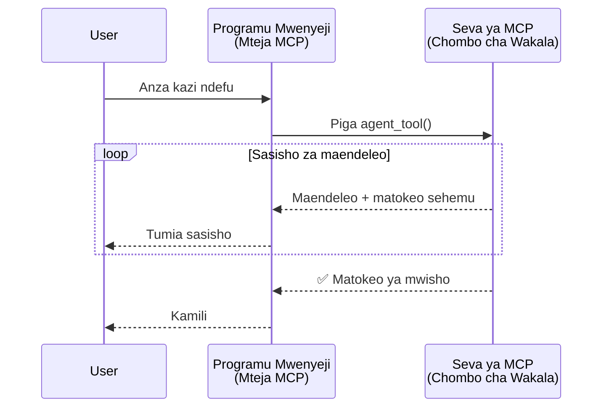
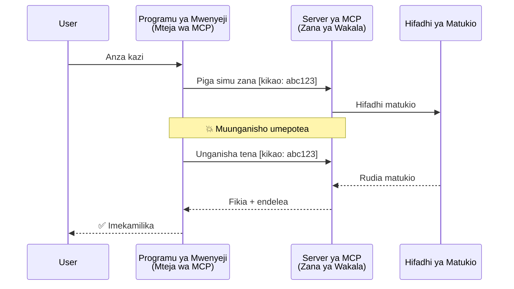
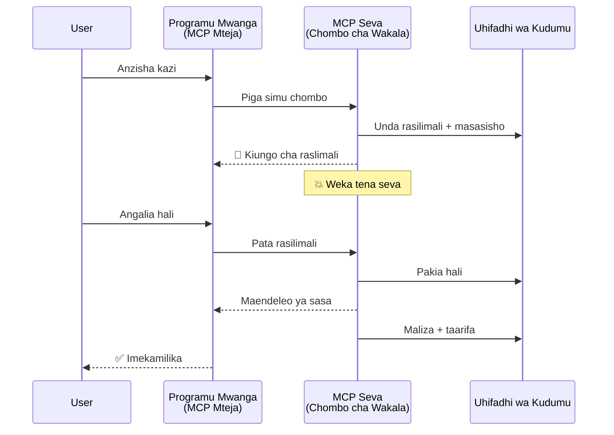
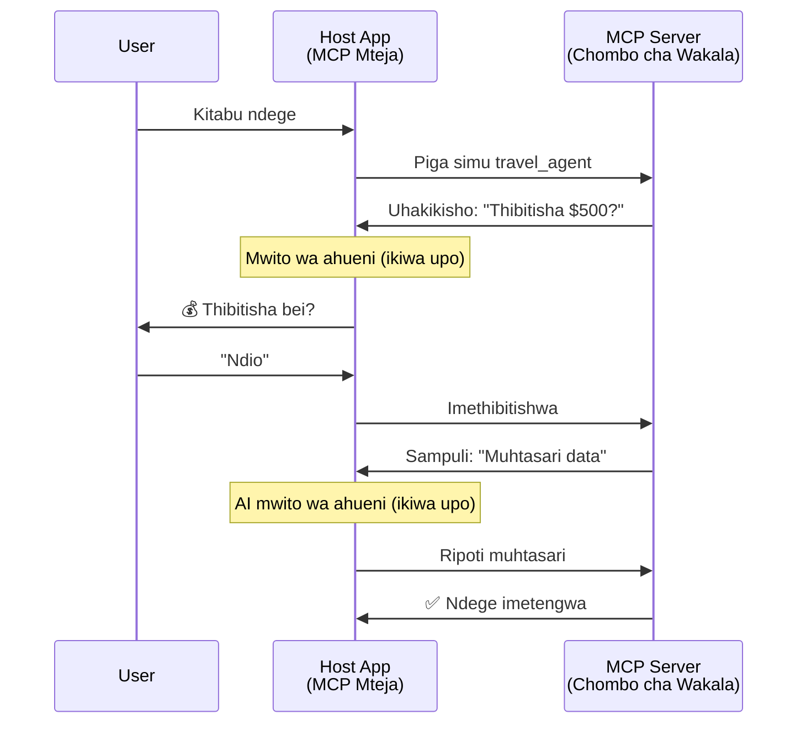
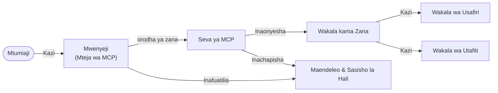

# Kujenga Mifumo ya Mawasiliano ya Wakala kwa Wakala kwa kutumia MCP

> TL;DR - Je, Unaweza Kujenga Mawasiliano ya Agent2Agent kwenye MCP? Ndiyo!

MCP imeendelea sana zaidi ya lengo lake la awali la "kutoa muktadha kwa LLMs". Kwa uboreshaji wa hivi karibuni ikiwa ni pamoja na [mitiririko inayoweza kuendelea](https://modelcontextprotocol.io/docs/concepts/transports#resumability-and-redelivery), [kunasa taarifa](https://modelcontextprotocol.io/specification/2025-06-18/client/elicitation), [kujaribu sampuli](https://modelcontextprotocol.io/specification/2025-06-18/client/sampling), na taarifa ([maendeleo](https://modelcontextprotocol.io/specification/2025-06-18/basic/utilities/progress) na [rasilimali](https://modelcontextprotocol.io/specification/2025-06-18/schema#resourceupdatednotification)), MCP sasa inatoa msingi thabiti wa kujenga mifumo tata ya mawasiliano ya wakala kwa wakala.

## Hitimisho Baya Kuhusu Wakala/Vifaa

Wakati wa watengenezaji zaidi kuchunguza vifaa vyenye tabia za wakala (kuendelea kwa muda mrefu, inaweza kuhitaji maingizo ya ziada katikati ya utekelezaji, n.k.), hitimisho la kawaida ni kwamba MCP haifai haswa kwa sababu mifano ya awali ya zana zake ilikuwa ya msingi inayolenga mifumo rahisi ya ombi-jibu.

Mtazamo huu ni wa zamani. Maelezo ya MCP yameboreshwa sana katika miezi michache iliyopita kwa uwezo ambao unafunga pengo la kujenga tabia za wakala zinazofanya kazi kwa muda mrefu:

- **Kutiririka & Matokeo Sehemu**: Taarifa za maendeleo za wakati halisi wakati wa utekelezaji
- **Ukurugenzi wa Kuendelea**: Wateja wanaweza kuunganishwa tena na kuendelea baada ya kupoteza muunganisho
- **Uhimilivu**: Matokeo huishi hata baada ya seva kuanzishwa upya (mfano, kupitia viungo vya rasilimali)
- **Mazungumzo ya Mizunguko mingi**: Maingizo ya mwingiliano katikati ya utekelezaji kupitia kunasa taarifa na kujaribu sampuli

Vipengele hivi vinaweza kuunganishwa kuwezesha programu tata za wakala na wakala wengi, zote zikitumia itifaki ya MCP.

Kwa rejeleo, tutautaja wakala kama "chombo" kinachopatikana kwenye seva ya MCP. Hii ina maana ya kuwepo kwa programu mwenyeji ambayo inatekeleza mteja wa MCP anayejenga kikao na seva ya MCP na anaweza kuita wakala.

## Nini Hufanya Chombo cha MCP Kuwa "Kiwakalazi"?

Kabla ya kuingia kwenye utekelezaji, tuanzishe ni uwezo gani wa miundombinu unahitajika kuunga mkono mawakala wanaoendesha kwa muda mrefu.

> Tutafafanua wakala kama kiumbe kinachoweza kufanya kazi kwa uhuru kwa vipindi virefu, kinachoweza kushughulikia majukumu tata ambayo yanaweza kuhitaji mwingiliano mingi au marekebisho kulingana na maoni ya wakati halisi.

### 1. Kutiririka & Matokeo Sehemu

Mifumo ya kawaida ya ombi-jibu haifai kwa kazi za muda mrefu. Wakala wanahitaji kutoa:

- Taarifa za maendeleo za wakati halisi
- Matokeo ya kati

**Msaada wa MCP**: Taarifa za sasisho za rasilimali zinawezesha kusambaza matokeo sehemu, ingawa hii inahitaji muundo makini ili kuepuka migongano na mfano wa ombi/jibu wa JSON-RPC 1:1.

| Kipengele                 | Matumizi                                                                                                                                                                      | Msaada wa MCP                                                                            |
| ------------------------ | ---------------------------------------------------------------------------------------------------------------------------------------------------------------------------- | ---------------------------------------------------------------------------------------- |
| Taarifa za Maendeleo ya Wakati Halisi | Mtumiaji anaomba kazi ya uhamishaji wa msimbo. Wakala hutiririsha maendeleo: "10% - Kuchambua utegemezi... 25% - Kubadilisha faili za TypeScript... 50% - Kusasisha kuagiza..." | ✅ Taarifa za maendeleo                                                                   |
| Matokeo Sehemu           | Kazi ya "Tengeneza kitabu" hutoa matokeo sehemu, mfano, 1) Muhtasari wa mfululizo wa hadithi, 2) Orodha ya sura, 3) Kila sura imekamilika. Mwenyeji anaweza kuchunguza, kughairi, au kuongoza hatua yoyote. | ✅ Taarifa zinaweza "kuongezwa" kujumuisha matokeo sehemu ona mapendekezo kwenye PR 383, 776  |

<div align="center" style="font-style: italic; font-size: 0.95em; margin-bottom: 0.5em;">
<strong>Kielelezo 1:</strong> Mchoro huu unaonyesha jinsi wakala wa MCP hutiririsha taarifa za maendeleo za wakati halisi na matokeo sehemu kwa programu mwenyeji wakati wa kazi ya muda mrefu, kuruhusu mtumiaji kufuatilia utekelezaji kwa wakati halisi.
</div>



### 2. Uwezo wa Kuendelea (Resumability)

Wakala wanapaswa kushughulikia kukatika kwa mtandao kwa heshima:

- Kuunganishwa tena baada ya kupoteza muunganisho (mteja)
- Kuendelea kutoka waliposimama (urejeshwaji wa ujumbe)

**Msaada wa MCP**: Usafirishaji wa MCP StreamableHTTP leo unaunga mkono kuendelea kwa kikao na urejeshwaji wa ujumbe kwa vitambulisho vya kikao na matukio ya mwisho. Kumbuka hapa ni kwamba seva lazima itekeleze Hifadhi ya Matukio inayowezesha kuchezwa tena kwa matukio wakati mteja anapoingia tena.
Kumbuka kuna pendekezo la jumuiya (PR #975) linalochunguza mitiririko inayoweza kuendelea isiyobebea msimbo fulani.

| Kipengele     | Matumizi                                                                                                                                                     | Msaada wa MCP                                                             |
| ------------ | ------------------------------------------------------------------------------------------------------------------------------------------------------------ | ------------------------------------------------------------------------- |
| Uwezo wa Kuendelea | Mteja anatoka wakati wa kazi ya muda mrefu. Akiwa amejunganishwa tena, kikao kinaendelea na matukio yaliyokosekana huchezwa tena, kikamilisha kwa urahisi kutoka waliposimama. | ✅ Usafirishaji wa StreamableHTTP na vitambulisho vya kikao, kucheza tena matukio, na Hifadhi ya Matukio |

<div align="center" style="font-style: italic; font-size: 0.95em; margin-bottom: 0.5em;">
<strong>Kielelezo 2:</strong> Mchoro huu unaonyesha jinsi usafirishaji wa MCP StreamableHTTP na hifadhi ya matukio huwezesha kuendelea kwa kikao bila mshono: ikiwa mteja atakatika, anaweza kuunganishwa tena na kucheza tena matukio yaliyokosekana, kuendelea na kazi bila kupoteza maendeleo.
</div>



### 3. Uhimilivu

Wakala wanaojihusisha kwa muda mrefu wanahitaji hali thabiti:

- Matokeo huishi hata baada ya seva kuungua upya
- Hali inaweza kupatikana nje ya mchakato
- Ufuatiliaji wa maendeleo kati ya vikao

**Msaada wa MCP**: MCP sasa inaunga mkono aina ya kurudisha kiungo cha rasilimali kwa miito ya zana. Leo, mfano wa kawaida ni kubuni chombo kinachounda rasilimali na kurudisha kiungo cha rasilimali mara moja. Chombo kinaweza kuendelea kushughulikia kazi nyuma na kusasisha rasilimali. Kwa upande mwingine, mteja anaweza kuchagua kuchunguza hali ya rasilimali hii kupata matokeo sehemu au kamili (kulingana na masasisho ya rasilimali ambayo seva hutoa) au kujisajili kwa rasilimali ili kupata taarifa za masasisho.

Moja ya kikomo hapa ni kuwa kuchunguza rasilimali au kujisajili kupata masasisho kunaweza kutumia rasilimali zilizo na athari kwa kiasi kikubwa. Kuna pendekezo la jumuiya (pamoja na #992) linalochunguza uwezekano wa kujumuisha webhooks au vichochezi ambavyo seva inaweza kuita kuarifu mteja/programu mwenyeji kuhusu masasisho.

| Kipengele  | Matumizi                                                                                                                                               | Msaada wa MCP                                                      |
| ---------- | ---------------------------------------------------------------------------------------------------------------------------------------------------- | ------------------------------------------------------------------ |
| Uhimilivu | Seva inaenda chini wakati wa kazi ya uhamishaji data. Matokeo na maendeleo huishi upya, mteja anaweza kuangalia hali na kuendelea kutoka kwenye rasilimali thabiti. | ✅ Viungo vya rasilimali vyenye uhifadhi thabiti na taarifa za hali |

Leo, mfano wa kawaida ni kubuni chombo kinachounda rasilimali na kurudisha kiungo cha rasilimali mara moja. Chombo kinaweza kushughulikia kazi kwa nyuma, kutoa taarifa za rasilimali ambazo hutumika kama masasisho ya maendeleo au kujumuisha matokeo sehemu, na kusasisha maudhui kwenye rasilimali kadri inavyohitajika.

<div align="center" style="font-style: italic; font-size: 0.95em; margin-bottom: 0.5em;">
<strong>Kielelezo 3:</strong> Mchoro huu unaonyesha jinsi mawakala wa MCP wanavyotumia rasilimali thabiti na taarifa za hali kuhakikisha kwamba kazi za muda mrefu huishi hata baada ya seva kuanzishwa upya, kuruhusu wateja kuangalia maendeleo na kupata matokeo hata baada ya kushindwa.
</div>



### 4. Mwingiliano wa Mizunguko Mingine

Wakala mara nyingi wanahitaji maingizo ya ziada katikati ya utekelezaji:

- Ufafanuzi wa binadamu au idhini
- Msaada wa AI kwa maamuzi tata
- Marekebisho ya vigezo kwa nguvu

**Msaada wa MCP**: Inasaidiwa kikamilifu kupitia kujaribu sampuli (kwa maingizo ya AI) na kunasa taarifa (kwa maingizo ya binadamu).

| Kipengele               | Matumizi                                                                                                                                            | Msaada wa MCP                                               |
| ----------------------- | ------------------------------------------------------------------------------------------------------------------------------------------------- | ------------------------------------------------------------ |
| Mwingiliano wa Mizunguko Mingine | Wakala wa uhifadhi wa safari anaomba uthibitisho wa bei kutoka kwa mtumiaji, kisha anaomba AI ifupishe data ya safari kabla ya kumaliza muamala wa uhifadhi. | ✅ Kunasa taarifa kwa maingizo ya binadamu, kujaribu sampuli kwa maingizo ya AI |

<div align="center" style="font-style: italic; font-size: 0.95em; margin-bottom: 0.5em;">
<strong>Kielelezo 4:</strong> Mchoro huu unaonyesha jinsi mawakala wa MCP wanavyoweza kwa mwingiliano kunasa maingizo ya binadamu au kuomba msaada wa AI katikati ya utekelezaji, kusaidia workflows tata za mizunguko mingi kama uthibitisho na maamuzi ya nguvu.
</div>



## Utekelezaji wa Wakala Wanaoendesha kwa Muda Mrefu kwenye MCP - Muhtasari wa Msimbo

Kama sehemu ya makala hii, tunatoa [hazina ya msimbo](https://github.com/victordibia/ai-tutorials/tree/main/MCP%20Agents) inayojumuisha utekelezaji kamili wa mawakala wanaoendesha kwa muda mrefu kwa kutumia MCP Python SDK na usafirishaji wa StreamableHTTP kwa kuendelea kwa kikao na urejeshwaji wa ujumbe. Utekelezaji unaonyesha jinsi uwezo wa MCP unavyoweza kuunganishwa kuwezesha tabia za wakala.

Hasa, tunatekeleza seva yenye zana mbili kuu za wakala:

- **Wakala wa Usafiri** - Huanza huduma ya uhifadhi wa safari na uthibitisho wa bei kupitia kunasa taarifa
- **Wakala wa Utafiti** - Hufanya kazi za utafiti na muhtasari ulioongezwa na AI kupitia kujaribu sampuli

Mawaakala wote wanaonyesha taarifa za maendeleo za wakati halisi, uthibitisho wa mwingiliano, na uwezo kamili wa kuendelea kwa kikao.

### Dhahania Muhimu za Utekelezaji

Sehemu zifuatazo zinaonyesha utekelezaji wa wakala upande wa seva na usimamizi wa mwenyeji upande wa mteja kwa kila uwezo:

#### Kutiririka & Sasisho za Maendeleo - Hali ya Kazi ya Wakati Halisi

Kutiririka kunawawezesha mawakala kutoa taarifa za maendeleo za wakati halisi wakati wa kazi za muda mrefu, kuwahakikishia watumiaji taarifa za hali ya kazi na matokeo ya kati.

**Utekelezaji wa Seva (wakala hutuma taarifa za maendeleo):**

```python
# Kutoka server/server.py - Wakala wa usafiri akituma masasisho ya maendeleo
for i, step in enumerate(steps):
    await ctx.session.send_progress_notification(
        progress_token=ctx.request_id,
        progress=i * 25,
        total=100,
        message=step,
        related_request_id=str(ctx.request_id)
    )
    await anyio.sleep(2)  # Kuiga kazi

# Mbadala: Rekodi ujumbe kwa masasisho ya kina hatua kwa hatua
await ctx.session.send_log_message(
    level="info",
    data=f"Processing step {current_step}/{steps} ({progress_percent}%)",
    logger="long_running_agent",
    related_request_id=ctx.request_id,
)
```

**Utekelezaji wa Mteja (mwenyeji anapokea taarifa za maendeleo):**

```python
# Kutoka client/client.py - Mteja anayeshughulikia arifa za wakati halisi
async def message_handler(message) -> None:
    if isinstance(message, types.ServerNotification):
        if isinstance(message.root, types.LoggingMessageNotification):
            console.print(f"📡 [dim]{message.root.params.data}[/dim]")
        elif isinstance(message.root, types.ProgressNotification):
            progress = message.root.params
            console.print(f"🔄 [yellow]{progress.message} ({progress.progress}/{progress.total})[/yellow]")

# Sajili mshughulikiaji wa ujumbe wakati wa kuunda kikao
async with ClientSession(
    read_stream, write_stream,
    message_handler=message_handler
) as session:
```

#### Kunasa Taarifa - Kuomba Maingizo ya Mtumiaji

Kunasa taarifa kunawawezesha mawakala kuomba maingizo ya mtumiaji katikati ya utekelezaji. Hii ni muhimu kwa uthibitisho, ufafanuzi, au idhini wakati wa kazi za muda mrefu.

**Utekelezaji wa Seva (wakala anaomba uthibitisho):**

```python
# Kutoka server/server.py - Wakala wa usafiri akiomba uthibitisho wa bei
elicit_result = await ctx.session.elicit(
    message=f"Please confirm the estimated price of $1200 for your trip to {destination}",
    requestedSchema=PriceConfirmationSchema.model_json_schema(),
    related_request_id=ctx.request_id,
)

if elicit_result and elicit_result.action == "accept":
    # Endelea na uhifadhi
    logger.info(f"User confirmed price: {elicit_result.content}")
elif elicit_result and elicit_result.action == "decline":
    # Ghairi uhifadhi
    booking_cancelled = True
```

**Utekelezaji wa Mteja (mwenyeji anatoa kivinjari cha kunasa taarifa):**

```python
# Kutoka client/client.py - Mteja anashughulikia ombi za uelezaji
async def elicitation_callback(context, params):
    console.print(f"💬 Server is asking for confirmation:")
    console.print(f"   {params.message}")

    response = console.input("Do you accept? (y/n): ").strip().lower()

    if response in ['y', 'yes']:
        return types.ElicitResult(
            action="accept",
            content={"confirm": True, "notes": "Confirmed by user"}
        )
    else:
        return types.ElicitResult(
            action="decline",
            content={"confirm": False, "notes": "Declined by user"}
        )

# Sajili callback wakati wa kuunda kikao
async with ClientSession(
    read_stream, write_stream,
    elicitation_callback=elicitation_callback
) as session:
```

#### Kuwa na Sampuli - Kuomba Msaada wa AI

Kuwa na sampuli kunawawezesha mawakala kuomba msaada wa LLM kwa maamuzi tata au uundaji wa maudhui wakati wa utekelezaji. Hii inasaidia workflows mchanganyiko wa binadamu-AI.

**Utekelezaji wa Seva (wakala anaomba msaada wa AI):**

```python
# Kutoka server/server.py - Wakala wa utafiti akiomba muhtasari wa AI
sampling_result = await ctx.session.create_message(
    messages=[
        SamplingMessage(
            role="user",
            content=TextContent(type="text", text=f"Please summarize the key findings for research on: {topic}")
        )
    ],
    max_tokens=100,
    related_request_id=ctx.request_id,
)

if sampling_result and sampling_result.content:
    if sampling_result.content.type == "text":
        sampling_summary = sampling_result.content.text
        logger.info(f"Received sampling summary: {sampling_summary}")
```

**Utekelezaji wa Mteja (mwenyeji anatoa kivinjari cha kujaribu sampuli):**

```python
# Kutoka client/client.py - Mteja anashughulikia maombi ya sampuli
async def sampling_callback(context, params):
    message_text = params.messages[0].content.text if params.messages else 'No message'
    console.print(f"🧠 Server requested sampling: {message_text}")

    # Katika programu halisi, hii inaweza kuitisha API ya LLM
    # Kwa madhumuni ya onyesho, tunatoa jibu la mfano
    mock_response = "Based on current research, MCP has evolved significantly..."

    return types.CreateMessageResult(
        role="assistant",
        content=types.TextContent(type="text", text=mock_response),
        model="interactive-client",
        stopReason="endTurn"
    )

# Sajili callback unapotengeneza kikao
async with ClientSession(
    read_stream, write_stream,
    sampling_callback=sampling_callback,
    elicitation_callback=elicitation_callback
) as session:
```

#### Uwezo wa Kuendelea - Uendelevu wa Kikao baada ya Kukatika

Uwezo wa kuendelea huhakikisha kuwa majukumu ya wakala wanaoendesha kwa muda mrefu yanaweza kuishi baada ya kukatika kwa muunganisho wa mteja na kuendelea bila mshono baada ya kuunganishwa tena. Hii inatekelezwa kupitia hifadhidata za matukio na tokeni za kuendelea.

**Utekelezaji wa Hifadhi ya Matukio (seva inahifadhi hali ya kikao):**

```python
# Kutoka server/event_store.py - Hifadhi rahisi ya matukio ya kumbukumbu ya ndani
class SimpleEventStore(EventStore):
    def __init__(self):
        self._events: list[tuple[StreamId, EventId, JSONRPCMessage]] = []
        self._event_id_counter = 0

    async def store_event(self, stream_id: StreamId, message: JSONRPCMessage) -> EventId:
        """Store an event and return its ID."""
        self._event_id_counter += 1
        event_id = str(self._event_id_counter)
        self._events.append((stream_id, event_id, message))
        return event_id

    async def replay_events_after(self, last_event_id: EventId, send_callback: EventCallback) -> StreamId | None:
        """Replay events after the specified ID for resumption."""
        # Tafuta matukio baada ya tukio la mwisho lililojulikana na yachelezwe tena
        for _, event_id, message in self._events[start_index:]:
            await send_callback(EventMessage(message, event_id))

# Kutoka server/server.py - Kupitisha hifadhi ya matukio kwa meneja wa kikao
def create_server_app(event_store: Optional[EventStore] = None) -> Starlette:
    server = ResumableServer()

    # Unda meneja wa kikao na hifadhi ya matukio kwa ajili ya kuendelea
    session_manager = StreamableHTTPSessionManager(
        app=server,
        event_store=event_store,  # Hifadhi ya matukio inaruhusu kuendelea kwa kikao
        json_response=False,
        security_settings=security_settings,
    )

    return Starlette(routes=[Mount("/mcp", app=session_manager.handle_request)])

# Matumizi: Anzisha na hifadhi ya matukio
event_store = SimpleEventStore()
app = create_server_app(event_store)
```

**Metadata ya Mteja na Tokeni ya Kuendelea (mteja anajunganishwa tena kwa kutumia hali iliyohifadhiwa):**

```python
# Kutoka client/client.py - Kuwasili tena kwa mteja kwa metadata
if existing_tokens and existing_tokens.get("resumption_token"):
    # Tumia tokeni iliyopo ya kuwasili tena kuendelea kutoka tulipomaliza
    metadata = ClientMessageMetadata(
        resumption_token=existing_tokens["resumption_token"],
    )
else:
    # Tengeneza callback kuhifadhi tokeni ya kuwasili tena pindi inapopokelewa
    def enhanced_callback(token: str):
        protocol_version = getattr(session, 'protocol_version', None)
        token_manager.save_tokens(session_id, token, protocol_version, command, args)

    metadata = ClientMessageMetadata(
        on_resumption_token_update=enhanced_callback,
    )

# Tuma ombi kwa metadata ya kuwasili tena
result = await session.send_request(
    types.ClientRequest(
        types.CallToolRequest(
            method="tools/call",
            params=types.CallToolRequestParams(name=command, arguments=args)
        )
    ),
    types.CallToolResult,
    metadata=metadata,
)
```

Programu mwenyeji inahifadhi vitambulisho vya kikao na tokeni za kuendelea ndani, ikiwezesha kuunganishwa tena kwa vikao vilivyopo bila kupoteza maendeleo au hali.

### Mpangilio wa Msimbo

<div align="center" style="font-style: italic; font-size: 0.95em; margin-bottom: 0.5em;">
<strong>Kielelezo 5:</strong> Muundo wa mfumo wa wakala unaotegemea MCP
</div>



**Mafaili Muhimu:**

- **`server/server.py`** - Seva ya MCP inayoweza kuendelea yenye mawakala wa usafiri na utafiti wanaoonyesha kunasa taarifa, kujaribu sampuli, na sasisho za maendeleo
- **`client/client.py`** - Programu mwenyeji ya mwingiliano yenye msaada wa kuendelea, wadhibiti wa kivinjari, na usimamizi wa tokeni
- **`server/event_store.py`** - Utekelezaji wa hifadhi ya matukio unaowezesha kuendelea kwa kikao na urejeshwaji wa ujumbe

## Kupanua kwa Mawasiliano ya Wakala Wengi kwenye MCP

Utekelezaji ulio hapo juu unaweza kupanuliwa kwa mifumo ya mawakala wengi kwa kuboresha akili na upeo wa programu mwenyeji:

- **Ugawaji wa Kazi kwa Uwezo**: Mwenyeji anachambua ombi tata la mtumiaji na kugawanya katika kazi ndogo kwa mawakala maalum tofauti
- **Uratibu wa Seva Nyingi**: Mwenyeji huweka muunganisho na seva nyingi za MCP, kila moja ikionyesha uwezo tofauti wa wakala
- **Usimamizi wa Hali ya Kazi**: Mwenyeji hufuata maendeleo kati ya kazi nyingi za wakala kwa wakati mmoja, akishughulikia utegemezi na mfuatano
- **Ustahimilivu & Jaribio Tena**: Mwenyeji hushughulikia kushindwa, kutekeleza mantiki ya jaribio tena, na kurudisha kazi wakati mawakala wanapokuwa hawapatikani
- **Mchanganyiko wa Matokeo**: Mwenyeji huunganisha matokeo kutoka kwa mawakala mbalimbali kuwa matokeo ya mwisho yanayokubalika

Mwenyeji hubadilika kutoka mteja rahisi kuwa mpangaji akili, akiendesha uwezo wa wakala waliotawanyika huku akihifadhi msingi huo wa itifaki ya MCP.

## Hitimisho

Uwezo ulioboreshwa wa MCP - taarifa za rasilimali, kunasa taarifa/kujaribu sampuli, mitiririko inayoweza kuendelea, na rasilimali thabiti - unawawezesha mwingiliano tata wa wakala kwa wakala huku ukidumisha urahisi wa itifaki.

## Kuanzisha

Tayari kujenga mfumo wako wa agent2agent? Fuata hatua hizi:

### 1. Endesha Demo

```bash
# Anzisha seva na hifadhi ya matukio kwa ajili ya kuendelea
python -m server.server --port 8006

# Katika terminali nyingine, endesha mteja anayeingiliana
python -m client.client --url http://127.0.0.1:8006/mcp
```

**Amri zinazopatikana katika hali ya mwingiliano:**

- `travel_agent` - Fanya uhifadhi wa safari na uthibitisho wa bei kupitia kunasa taarifa
- `research_agent` - Fanya utafiti na muhtasari ulioongezwa na AI kupitia kujaribu sampuli
- `list` - Onyesha zana zote zinazopatikana
- `clean-tokens` - Futa tokeni za kuendelea
- `help` - Onyesha msaada wa kina wa amri
- `quit` - Toka mteja

### 2. Jaribu Uwezo wa Kuendelea

- Anza wakala mwenye kazi ya muda mrefu (mfano, `travel_agent`)
- Kojolea mteja wakati wa utekelezaji (Ctrl+C)
- Anzisha upya mteja - ataendelea moja kwa moja kutoka waliposimama

### 3. Chunguza na Panua

- **Chunguza mifano**: Angalia hii [mcp-agents](https://github.com/victordibia/ai-tutorials/tree/main/MCP%20Agents)
- **Jiunge na jumuiya**: Shirikiana kwenye mijadala ya MCP kwenye GitHub
- **Jaribu**: Anza na kazi rahisi ya muda mrefu na polepole ongeza kutiririka, uwezo wa kuendelea, na uratibu wa mawakala wengi

Hii inaonyesha jinsi MCP inavyowezesha tabia za wakala zenye akili huku ikidumisha urahisi wa zana.

Kwa jumla, maelezo ya itifaki ya MCP yanabadilika kwa kasi; msomaji anahimizwa kupitia tovuti rasmi ya nyaraka kwa masasisho ya hivi karibuni - https://modelcontextprotocol.io/introduction

---

<!-- CO-OP TRANSLATOR DISCLAIMER START -->
**Kionyozo**:
Hati hii imetafsiriwa kwa kutumia huduma ya tafsiri ya AI [Co-op Translator](https://github.com/Azure/co-op-translator). Ingawa tunajitahidi kupata usahihi, tafadhali fahamu kwamba tafsiri za kiotomatiki zinaweza kuwa na makosa au upungufu wa usahihi. Hati ya asili katika lugha yake halisi inapaswa kuchukuliwa kama chanzo cha mamlaka. Kwa taarifa muhimu, tafsiri ya kitaalamu inayofanywa na binadamu inapendekezwa. Hatutojibu kwa kuelewa vibaya au tafsiri potofu zinazotokea kutokana na matumizi ya tafsiri hii.
<!-- CO-OP TRANSLATOR DISCLAIMER END -->