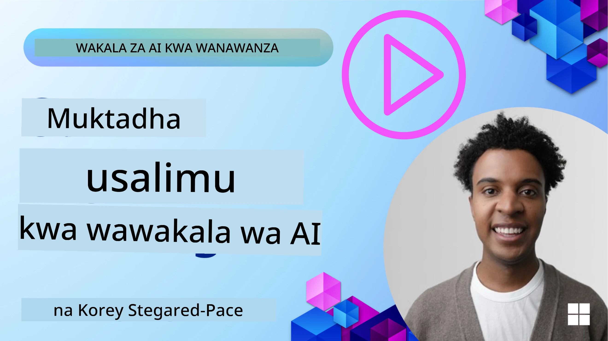
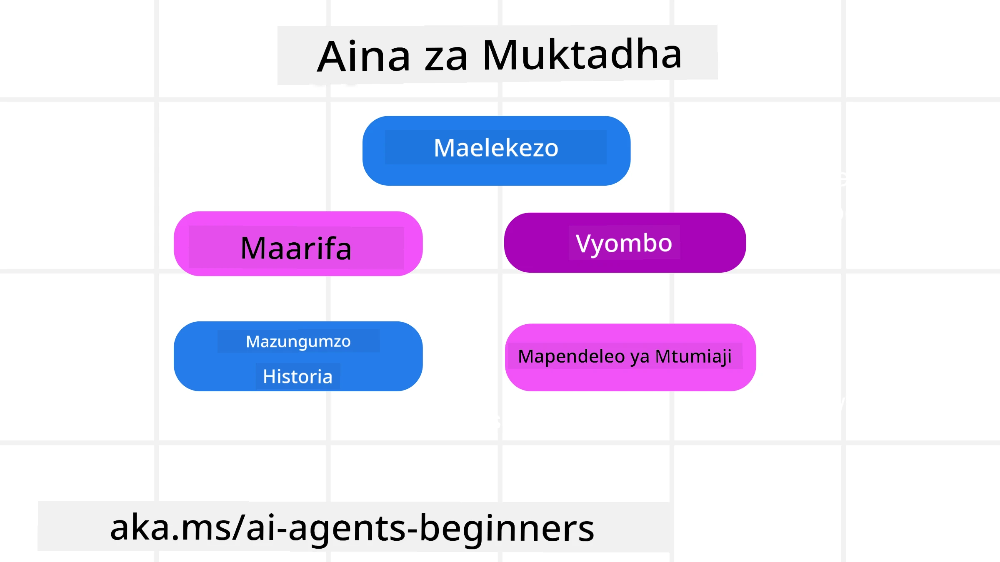
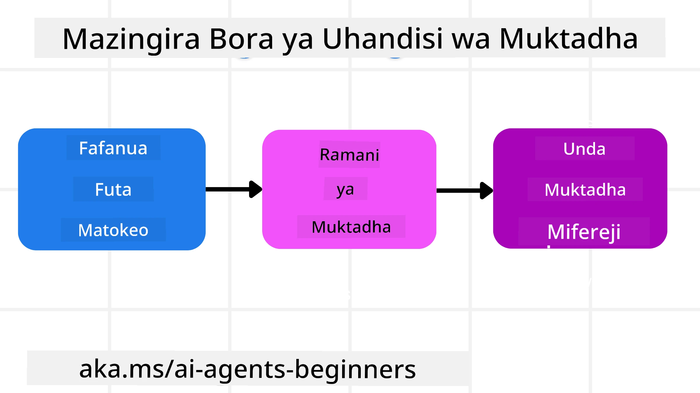

# Uhandisi wa Muktadha kwa Wakala wa AI

> _(Bonyeza picha iliyo juu kuona video ya somo hili)_

Kuelewa ugumu wa programu unayoijengea wakala wa AI ni muhimu kwa kutengeneza wakala anayeaminika. Tunahitaji kujenga Wakala wa AI ambao wanaweza kusimamia taarifa kwa ufanisi ili kushughulikia mahitaji magumu zaidi ya uhandisi wa maagizo (prompt engineering).

Katika somo hili, tutaangalia ni nini uhandisi wa muktadha ni pamoja na nafasi yake katika kujenga wakala wa AI.

## Utangulizi

Somo hili litajumuisha:

• **Ni Nini Uhandisi wa Muktadha** na kwanini ni tofauti na uhandisi wa maagizo.

• **Mikakati ya Uhandisi wa Muktadha Bora**, ikiwa ni pamoja na jinsi ya kuandika, kuchagua, kukandamiza, na kutenganisha taarifa.

• **Kushindwa Kawaida kwa Muktadha** zinazoweza kumkatakataza wakala wa AI na jinsi ya kuzirekebisha.

## Malengo ya Kujifunza

Baada ya kumaliza somo hili, utaweza kuelewa jinsi ya:

• **Kufafanua uhandisi wa muktadha** na kuutofautisha na uhandisi wa maagizo.

• **Kutambua vipengele muhimu vya muktadha** katika programu za Mfano Mkubwa wa Lugha (LLM).

• **Kutumia mikakati ya kuandika, kuchagua, kukandamiza, na kutenganisha muktadha** ili kuboresha utendaji wa wakala.

• **Kutambua kushindwa kawaida kwa muktadha** kama vile sumu, usumbufu, machafuko, na mgongano, na kutekeleza mbinu za kuzuia.

## Uhandisi wa Muktadha ni Nini?

Kwa Wakala wa AI, muktadha ndicho kinachoendesha mipango ya wakala wa AI kuchukua hatua fulani. Uhandisi wa muktadha ni zoezi la kuhakikisha kwamba Wakala wa AI ana taarifa sahihi za kukamilisha hatua inayofuata ya kazi. Dirisha la muktadha lina ukubwa mdogo, hivyo kama waanzilishi wa wakala lazima tujenge mifumo na michakato ya kusimamia kuongeza, kuondoa, na kufupisha taarifa katika dirisha la muktadha.

### Uhandisi wa Maagizo vs Uhandisi wa Muktadha

Uhandisi wa maagizo unazingatia seti moja ya maagizo ya kudumu kwa kuongoza Wakala wa AI kwa ufanisi na seti ya sheria. Uhandisi wa muktadha ni jinsi ya kusimamia seti yenye mabadiliko ya taarifa, ikijumuisha agizo la awali, kuhakikisha kwamba Wakala wa AI ana kile anachohitaji kwa muda. Wazo kuu la uhandisi wa muktadha ni kufanya mchakato huu urudiwe na uwe wa kuaminika.

### Aina za Muktadha

Ni muhimu kukumbuka kwamba muktadha si kitu kimoja tu. Taarifa ambazo Wakala wa AI anahitaji zinaweza kutokea kutoka vyanzo tofauti na ni jukumu letu kuhakikisha wakala ana upatikanaji wa vyanzo hivi:

Aina za muktadha ambayo wakala wa AI anaweza kuhitaji kusimamia ni pamoja na:

• **Maagizo:** Haya ni kama "sheria" za wakala – maagizo, ujumbe wa mfumo, mifano michache (kuonyesha AI jinsi ya kufanya jambo), na maelezo ya zana anazoweza kutumia. Hii ndiyo mahali mwili wa uhandisi wa maagizo unachanganyika na uhandisi wa muktadha.

• **Maarifa:** Haya yanajumuisha ukweli, taarifa zilizopatikana kutoka kwa hifadhidata, au kumbukumbu za muda mrefu ambazo wakala amezikusanya. Hii inajumuisha kuingiza Mfumo wa Kutengeneza kwa Kuongeza Marejeleo (RAG) ikiwa wakala anahitaji ufikiaji wa maduka tofauti ya maarifa na hifadhidata.

• **Zana:** Hizi ni ufafanuzi wa kazi za nje, API na MCP Servers ambazo wakala anaweza kuitisha, pamoja na mrejesho (matokeo) anayopokea kutumia zana hizo.

• **Historia ya Mazungumzo:** Mazungumzo yanayoendelea na mtumiaji. Kadri muda unavyopita, mazungumzo haya yanazidi kuwa marefu na magumu na hivyo kuchukua nafasi katika dirisha la muktadha.

• **Mapendeleo ya Mtumiaji:** Taarifa zinazojifunzwa kuhusu mambo yanayopendwa au yasiyopendwa na mtumiaji kwa muda. Hizi zinaweza kuhifadhiwa na kuitwa wakati wa kufanya maamuzi muhimu kusaidia mtumiaji.

## Mikakati ya Uhandisi wa Muktadha Bora

### Mikakati ya Mipango

Uhandisi mzuri wa muktadha unaanzia na mipango mizuri. Hapa kuna mbinu itakayokusaidia kuanza kufikiria kuhusu jinsi ya kutumia dhana ya uhandisi wa muktadha:

1. **Fafanua Matokeo wazi** - Matokeo ya kazi ambazo Wakala wa AI atazipewa yanapaswa kufafanuliwa wazi. Jibu swali - "Dunia itaonekana je vipi wakati Wakala wa AI atakuwa amemaliza kazi yake?" Kwa maneno mengine, ni mabadiliko gani, taarifa, au jibu ambalo mtumiaji anapaswa kupata baada ya kuwasiliana na Wakala wa AI.
2. **Ramani ya Muktadha** - Mara tu unapofafanua matokeo ya Wakala wa AI, unahitaji kujibu swali la "Ni taarifa gani Wakala wa AI anahitaji ili kumaliza kazi hii?". Kwa njia hii unaweza kuanza ramani ya muktadha wa wapi taarifa hiyo inaweza kupatikana.
3. **Unda Mifereji ya Muktadha** - Sasa unajua wapi taarifa iko, unahitaji kujibu swali "Wakala atapataje taarifa hii?". Hii inaweza kufanyika kwa njia mbalimbali ikiwa ni pamoja na RAG, matumizi ya seva za MCP na zana nyingine.

### Mikakati ya Kivitendo

Mipango ni muhimu lakini mara taarifa zinaanza kuingia kwenye dirisha la muktadha la wakala wetu, tunahitaji mikakati ya vitendo kuisimamia:

#### Kusimamia Muktadha

Wakati baadhi ya taarifa zinaongezwa kiotomatiki kwenye dirisha la muktadha, uhandisi wa muktadha ni kuchukua jukumu zaidi juu ya taarifa hii ambalo linaweza kufanyika kwa mikakati michache:

 1. **Daftari la Wakala**  
 Hii inaruhusu Wakala wa AI kuchukua kumbukumbu za taarifa muhimu kuhusu kazi za sasa na mawasiliano na mtumiaji wakati wa kikao kimoja. Hii inapaswa kuwepo nje ya dirisha la muktadha katika faili au kitu cha muda ambacho wakala anaweza kuirudisha baadaye wakati wa kikao hiki ikiwa itahitajika.

 2. **Kumbukumbu**  
 Daftari ni nzuri kwa kusimamia taarifa nje ya dirisha la muktadha la kikao kimoja. Kumbukumbu huwasaidia wakala kuhifadhi na kurudisha taarifa muhimu kati ya vikao vingi. Hii inaweza kujumuisha muhtasari, mapendeleo ya mtumiaji na mrejesho kwa maboresho ya baadaye.

 3. **Kukandamiza Muktadha**  
 Mara dirisha la muktadha linapokua na kufikia kikomo chake, mbinu kama ufupishaji na kukata zinaweza kutumika. Hii ni pamoja na kuhifadhi tu taarifa zinazofaa zaidi au kuondoa ujumbe wa zamani.
  
 4. **Mifumo ya Wakala Wengi**  
 Kuendeleza mfumo wa wakala wengi ni aina ya uhandisi wa muktadha kwa sababu kila wakala ana dirisha lake la muktadha. Jinsi muktadha huo unavyoshirikishwa na kupelekwa kwa wakala tofauti ni jambo jingine la kupanga wakati wa kujenga mifumo hii.
  
 5. **Mazingira ya Sandbox**  
 Ikiwa wakala anahitaji kuendesha msimbo fulani au kuchakata taarifa nyingi katika hati, hii inaweza kuchukua tokeni nyingi kusindika matokeo. Badala ya kuhifadhi haya yote ndani ya dirisha la muktadha, wakala anaweza kutumia mazingira ya sandbox yanayoweza kuendesha msimbo huu na kusoma matokeo tu na taarifa nyingine muhimu.
  
 6. **Vitu vya Hali ya Muda wa Kuendesha**  
 Hii hufanywa kwa kuunda kontena za taarifa kusimamia hali ambapo Wakala anahitaji kuwa na upatikanaji wa taarifa fulani. Kwa kazi ngumu, hili linaruhusu Wakala kuhifadhi matokeo ya kila hatua ndogo ya kazi hatua kwa hatua, kuruhusu muktadha kubaki kuhusiana tu na hatua hiyo ndogo maalum.

#### Kuchunguza Muktadha

Baada ya kutumia mojawapo ya mikakati hii, inafaa kuangalia ni nini mwito ufuatao wa mfano ulipokea kweli. Swali la kusaidia utatuzi ni:

> Je, wakala alibeba muktadha mwingi sana, muktadha usiofaa, au kukosa muktadha aliouhitaji?

Huna haja ya kurekodi maagizo mabichi, matokeo ya zana, au yaliyomo kwenye kumbukumbu kujibu swali hilo. Katika uzalishaji, toa kipaumbele kwa rekodi ndogo za uchunguzi wa muktadha zinazoshikilia hesabu, vitambulisho, hashes, na lebo za sera:

- **Uchaguzi:** Fuata idadi ya vipande vinavyowezekana, zana, au kumbukumbu zilizozingatiwa, ngapi zilichaguliwa, na ni sheria au alama gani ilisababisha nyingine kuchujwa.
- **Kukandamiza:** Rekodi anuwai ya chanzo au id ya mfuatiliaji, id ya muhtasari, makadirio ya hesabu ya tokeni kabla na baada ya kukandamizwa, na kama maudhui ya asili hayakujumuishwa kwa mwito ufuatao.
- **Kutenganisha:** Tambua ni sehemu gani ndogo iliyoendeshwa na wakala tofauti, kikao, au sandbox, ni muhtasari gani uliofungwa ulirudishwa, na ikiwa matokeo makubwa ya zana yalibaki nje ya muktadha wa wakala mkuu.
- **Kumbukumbu na RAG:** Hifadhi id za nyaraka za marejeleo, id za kumbukumbu, alama, id zilizochaguliwa, na hali ya kufungia badala ya maandishi yaliyorekebishwa kikamilifu.
- **Usalama na faragha:** Tumia hashes, id, vikapu vya tokeni, na lebo za sera badala ya maandishi nyeti ya maagizo, hoja za zana, matokeo ya zana, au maumbo ya kumbukumbu za mtumiaji.

Lengo sio kuhifadhi muktadha zaidi. Ni kuacha ushahidi wa kutosha kwamba mjenzi anaweza kusema ni mkakati gani wa muktadha ulitumika na kama ulibadilisha mwito wa mfano ufuatao kwa njia iliyokusudiwa.

### Mfano wa Uhandisi wa Muktadha

Tuseme tunataka wakala wa AI **"Anipangie safari kwenda Paris."**

• Wakala rahisi anayetumia tu uhandisi wa maagizo unaweza tu kujibu: **"Sawa, ungependa kwenda Paris lini?"**. Alishughulikia tu swali lako moja kwa moja wakati mtumiaji aliuliza.

• Wakala anayetumia mikakati ya uhandisi wa muktadha iliyojadiliwa angefanya zaidi. Kabla hata ya kujibu, mfumo wake unaweza:

  ◦ **Kagua kalenda yako** kwa tarehe zinazopatikana (kupata data halisi kwa wakati).

 ◦ **Kumbuka mapendeleo ya safari za zamani** (kutoka kumbukumbu ya muda mrefu) kama vile shirika lako la ndege unalopendelea, bajeti, au kama unapendelea ndege zisizo na mabadiliko.

 ◦ **Tambua zana zinazopatikana** kwa ajili ya kuhifadhi tiketi za ndege na hoteli.

- Kisha, mfano wa jibu unaweza kuwa: "Hey [Jina Lako]! Naona uko huru wiki ya kwanza ya Oktoba. Ntafutaje ndege za moja kwa moja kwenda Paris kwa [Shirika la Ndege linalopendelea] ndani ya bajeti yako ya kawaida ya [Bajeti]?" Jibu hili tajiri, linalojua muktadha linaonyesha nguvu ya uhandisi wa muktadha.

## Kushindwa Kawaida kwa Muktadha

### Sumu ya Muktadha

**Ni nini:** Wakati halucination (taarifa zisizo za kweli zilizozalishwa na LLM) au kosa linaingia katika muktadha na kurudiwa kurejelewa, kusababisha wakala kufuata malengo yasiyowezekana au kuunda mikakati isiyo na maana.

**Kufanya nini:** Tekeleza **uthibitishaji wa muktadha** na **kuwekewa karantini**. Thibitisha taarifa kabla ya kuongezwa kwenye kumbukumbu ya muda mrefu. Ikiwa kuna sumu inayoweza kutokea, anzisha miale mipya ya muktadha kuzuia taarifa mbaya kusambaa.

**Mfano wa Kukodi Safari:** Wakala wako anadhani kuna **ndege ya moja kwa moja kutoka uwanja mdogo wa ndege kwenda jiji la kimataifa la mbali** ambalo halitoi ndege za kimataifa. Maelezo haya ya ndege ambayo hayako huhifadhiwa kwenye muktadha. Baadaye, unapoomba wakala kuandaa safari, anaendelea kujaribu kupata tiketi za njia hii isiyowezekana na kusababisha makosa yanayojirudia.

**Suluhisho:** Tekeleza hatua inayothibitisha uwepo wa ndege na njia kwa API ya wakati halisi _kabla_ ya kuongeza maelezo ya ndege kwenye muktadha wa kazi wa wakala. Ikiwa uthibitisho unashindwa, taarifa hiyo yenye kosa inapelekwa "karantini" na haitumiki zaidi.

### Usumbufu wa Muktadha

**Ni nini:** Wakati muktadha unakuwa mkubwa mno hata mfano huanza kulenga zaidi historia iliyokusanywa badala ya kutumia kile alichojifunza wakati wa mafunzo, kusababisha hatua za kurudia au zisizosaidia. Mifano inaweza kuanza kufanya makosa hata kabla dirisha la muktadha kufikia kikomo.

**Kufanya nini:** Tumia **ufupishaji wa muktadha**. Mara kwa mara kandamiza taarifa zilizokusanywa kuwa muhtasari mfupi, ukihifadhi maelezo muhimu wakati unaondoa historia inayojirudia. Hii husaidia "kurekebisha" umakini.

**Mfano wa Kukodi Safari:** Umekuwa ukijadili sehemu mbalimbali za ndoto za kusafiri kwa muda mrefu, ikijumuisha mwelezo wa kina wa safari yako ya kubeba mzigo ya miaka miwili iliyopita. Unapoomba mwishowe **"nipatie tiketi ya ndege nafuu kwa mwezi ujao,"** wakala anazidi kubeba maelezo ya zamani yasiyo na umuhimu na anaendelea kuuliza kuhusu vifaa vyako vya kubeba mzigo au ratiba za zamani, akisahau ombi lako la sasa.

**Suluhisho:** Baada ya mizunguko fulani au wakati muktadha unapokua sana, wakala anapaswa **kufupisha sehemu za hivi karibuni na muhimu za mazungumzo** – akilenga tarehe zako sasa za safari na mahali unapotaka kwenda – na kutumia muhtasari huu ulioshinikizwa kwa mwito ufuatao wa LLM, akitoa mazungumzo ya zamani yasiyo na umuhimu.

### Machafuko ya Muktadha

**Ni nini:** Wakati muktadha usiohitajika, mara nyingi kwa njia ya zana nyingi zinazopatikana, husababisha mfano kuzalisha majibu mabaya au kuitisha zana zisizohitajika. Mifano midogo ni hatarini zaidi kwa hili.

**Kufanya nini:** Tekeleza **usimamizi wa mzigo wa zana** kwa kutumia mbinu za RAG. Hifadhi maelezo ya zana katika hifadhidata ya vector na chagua _tu_ zana zenye maana zaidi kwa kila kazi maalum. Utafiti unaonyesha kupunguza uteuzi wa zana chini ya 30.

**Mfano wa Kukodi Safari:** Wakala wako ana zana kadhaa: `book_flight`, `book_hotel`, `rent_car`, `find_tours`, `currency_converter`, `weather_forecast`, `restaurant_reservations`, n.k. Unauliza, **"Njia bora ya kutembea Paris ni ipi?"** Kwa sababu ya idadi kubwa ya zana, wakala anachanganyikiwa na kujaribu kuitisha `book_flight` _ndani_ Paris, au `rent_car` ingawa unapendelea usafiri wa umma, kwa sababu maelezo ya zana yanaweza kuingiliana au hawezi kutambua zana bora.

**Suluhisho:** Tumia **RAG juu ya maelezo ya zana**. Ukijiuliza kuhusu kutembea Paris, mfumo hupata zana zinazofaa kama `rent_car` au `public_transport_info` kulingana na swali lako, ukionyesha "mzigo" wa zana wenye lengo kwa LLM.

### Mgongano wa Muktadha

**Ni nini:** Wakati taarifa zinazopingana zipo ndani ya muktadha, zikisababisha fikra zisizolingana au majibu mabaya ya mwisho. Hii mara nyingi hutokea wakati taarifa zinapokelewa hatua kwa hatua, na dhana za mapema zisizokuwa sahihi zikibaki ndani ya muktadha.

**Kufanya nini:** Tumia **kukata muktadha** na **kuhamisha**. Kukata kunamaanisha kuondoa taarifa za zamani au zinazopingana wakati maelezo mapya yanapofika. Kuhamisha hutoa mfano nafasi ya "daftari la kazi" la kuandikia kutekeleza taarifa bila kuvuruga muktadha mkuu.
**Mfano wa Kuweka Tiketi za Safari:** Awali unaambia wakala wako, **"Nataka kuruka daraja la uchumi."** Baadaye katika mazungumzo, unabadilisha mawazo yako na kusema, **"Kwa kweli, kwa safari hii, tuchukue daraja la biashara."** Ikiwa maagizo yote mawili bado yako katika muktadha, wakala anaweza kupokea matokeo yanayokinzana au kuchanganyikiwa kuhusu ni upendeleo gani wazingatiwe zaidi.

**Suluhisho:** Tekeleza **kukata muktadha (context pruning)**. Wakati agizo jipya linapingana na lile la zamani, agizo la zamani linaondolewa au linaangushwa waziwazi katika muktadha. Vinginevyo, wakala anaweza kutumia **scratchpad** kusawazisha upendeleo zinazokinzana kabla ya kuamua, kuhakikisha agizo la mwisho, linaloendana ndilo linaongoza hatua zake.

## Una Maswali Zaidi Kuhusu Uhandisi wa Muktadha?

Jiunge na [Microsoft Foundry Discord](https://aka.ms/ai-agents/discord) ili kukutana na wanafunzi wengine, kuhudhuria saa za ofisi na kupata majibu kwa maswali yako kuhusu Wakala wa AI.

---

<!-- CO-OP TRANSLATOR DISCLAIMER START -->
**Kionyozo**:
Hati hii imetafsiriwa kwa kutumia huduma ya tafsiri ya AI [Co-op Translator](https://github.com/Azure/co-op-translator). Ingawa tunajitahidi kupata usahihi, tafadhali fahamu kwamba tafsiri za kiotomatiki zinaweza kuwa na makosa au upungufu wa usahihi. Hati ya asili katika lugha yake halisi inapaswa kuchukuliwa kama chanzo cha mamlaka. Kwa taarifa muhimu, tafsiri ya kitaalamu inayofanywa na binadamu inapendekezwa. Hatutojibu kwa kuelewa vibaya au tafsiri potofu zinazotokea kutokana na matumizi ya tafsiri hii.
<!-- CO-OP TRANSLATOR DISCLAIMER END -->