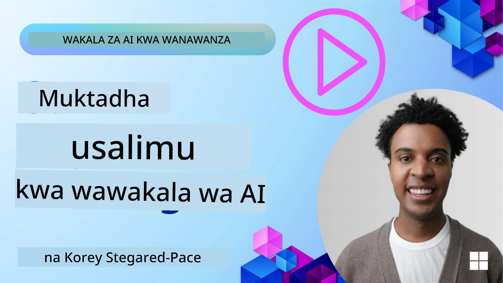
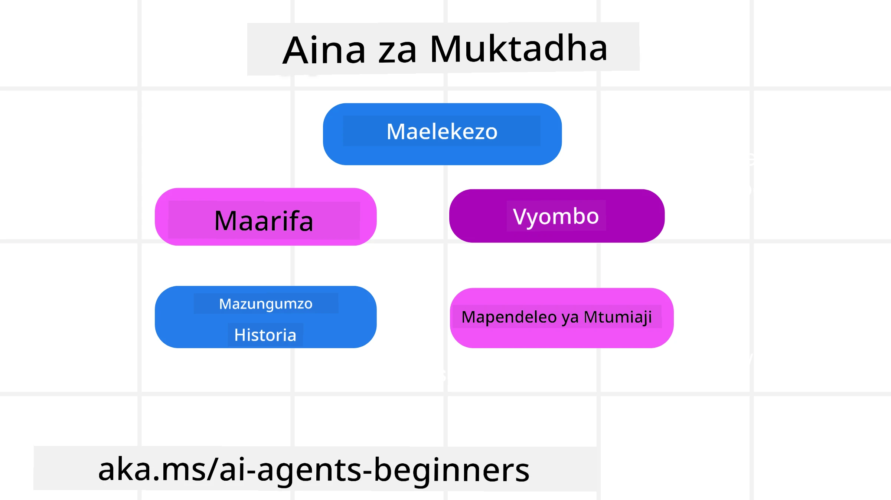
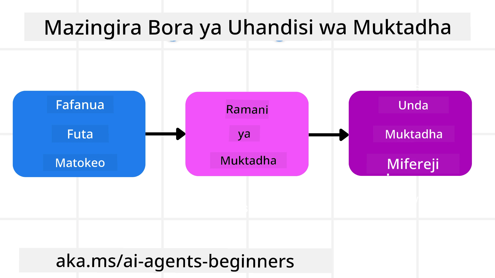

# Uhandisi wa Muktadha kwa Wakala wa AI

> _(Bonyeza picha hapo juu kutazama video ya somo hili)_

Kuelewa ugumu wa programu unayoijenga wakala wa AI ni muhimu kwa kutengeneza wakala wa kuaminika. Tunahitaji kujenga Wakala wa AI wanaotumika kwa ufanisi kusimamia taarifa ili kushughulikia mahitaji magumu zaidi ya uhandisi wa maelekezo.

Katika somo hili, tutaangalia ni nini uhandisi wa muktadha ni na jukumu lake katika kujenga wakala wa AI.

## Utangulizi

Somo hili litahusu:

• **Nini Uhandisi wa Muktadha ni** na kwa nini ni tofauti na uhandisi wa maelekezo.

• **Mikakati ya Uhandisi wa Muktadha yenye Ufanisi**, ikiwa ni pamoja na jinsi ya kuandika, kuchagua, kusindika, na kutenganisha taarifa.

• **Makosa ya Kawaida ya Muktadha** ambayo yanaweza kumwondoa wakala wako wa AI na jinsi ya kuyarekebisha.

## Malengo ya Kujifunza

Baada ya kumaliza somo hili, utajua na kuelewa jinsi ya:

• **Eleza uhandisi wa muktadha** na kuutofautisha na uhandisi wa maelekezo.

• **Tambua vipengele muhimu vya muktadha** katika programu za Mfano Mkubwa wa Lugha (LLM).

• **Tumia mikakati ya kuandika, kuchagua, kusindika, na kutenganisha muktadha** kuboresha utendaji wa wakala.

• **Tambua makosa ya kawaida ya muktadha** kama vile uchafuzi, usumbufu, mkanganyiko, na mgongano, na kutekeleza mbinu za kupunguza athari.

## Uhandisi wa Muktadha ni Nini?

Kwa Wakala wa AI, muktadha ni unaoendesha upangaji wa wakala wa AI kuchukua hatua fulani. Uhandisi wa Muktadha ni utaratibu wa kuhakikisha kuwa Wakala wa AI ana taarifa sahihi za kukamilisha hatua inayofuata ya kazi. Dirisha la muktadha lina ukubwa mdogo, hivyo sisi kama wajenzi wa wakala tunahitaji kujenga mifumo na michakato ya kusimamia kuongeza, kuondoa, na kuchanganya taarifa ndani ya dirisha la muktadha.

### Uhandisi wa Maelekezo vs Uhandisi wa Muktadha

Uhandisi wa maelekezo umejikita kwenye seti moja ya maagizo ya kimya kuyatumia kwa ufanisi kuongoza Wakala wa AI kwa seti ya sheria. Uhandisi wa muktadha ni jinsi ya kusimamia seti ya taarifa mabadiliko, pamoja na maelekezo ya awali, kuhakikisha kuwa Wakala wa AI ana kile anachohitaji kwa muda. Wazo kuu la uhandisi wa muktadha ni kufanya mchakato huu uwe wa kurudia na wa kuaminika.

### Aina za Muktadha

Ni muhimu kukumbuka kuwa muktadha sio kitu kimoja tu. Taarifa zinazohitajika na Wakala wa AI zinaweza kutoka kwenye vyanzo mbalimbali na ni jukumu letu kuhakikisha wakala ana upatikanaji wa vyanzo hivyo:

Aina za muktadha ambazo wakala wa AI anaweza kuhitaji kusimamia ni pamoja na:

• **Maagizo:** Hizi ni kama "sheria" za wakala - maelekezo, ujumbe wa mfumo, mifano ya kidogo (kuonyesha AI jinsi ya kufanya kitu), na maelezo ya zana anazoweza kutumia. Hapa ndipo mkazo wa uhandisi wa maelekezo unahusiana na uhandisi wa muktadha.

• **Maarifa:** Hii inahusu ukweli, taarifa zinazopatikana kutoka kwenye hifadhidata, au kumbukumbu za muda mrefu ambazo wakala amezikusanya. Hii ni pamoja na kuunganisha mfumo wa Kutafuta Kumbukumbu (RAG) ikiwa wakala anahitaji upatikanaji wa maduka tofauti ya maarifa na hifadhidata.

• **Zana:** Hizi ni ufafanuzi wa kazi za nje, API na MCP Servers ambazo wakala anaweza kuvihamia, pamoja na maoni (matokeo) anayopata kwa kuzitumia.

• **Historia ya Mazungumzo:** Mazungumzo endelevu na mtumiaji. Kadri muda unavyopita, mazungumzo haya huwa marefu na magumu zaidi, ambayo yanahitaji nafasi ndani ya dirisha la muktadha.

• **Mapendeleo ya Mtumiaji:** Taarifa zinazojifunzwa kuhusu vile mtumiaji anavyopenda au kutopenda kwa muda. Hizi zinaweza kuhifadhiwa na kuitwa wakati wa kufanya maamuzi muhimu kusaidia mtumiaji.

## Mikakati ya Uhandisi wa Muktadha yenye Ufanisi

### Mikakati ya upangaji

Uhandisi mzuri wa muktadha huanza na upangaji mzuri. Hapa kuna njia ambayo itakusaidia kuanza kufikiria jinsi ya kutumia dhana ya uhandisi wa muktadha:

1. **Fafanua Matokeo Wazi** - Matokeo ya kazi ambazo Wakala wa AI atapewa yanapaswa kufafanuliwa kwa uwazi. Jibu swali - "Dunia itakuwa vipi wakati Wakala wa AI atakamilisha kazi yake?" Kwa maneno mengine, mabadiliko gani, taarifa gani, au jibu gani mtumiaji anapaswa kuwa naye baada ya kuingiliana na Wakala wa AI.
2. **Ramani ya Muktadha** - Mara baada ya kufafanua matokeo ya Wakala wa AI, unahitaji kujibu swali la "Ni taarifa gani Wakala wa AI anahitaji ili kukamilisha kazi hii?". Kwa njia hii unaweza kuanza kuunda ramani ya muktadha wa mahali taarifa hiyo inaweza kupatikana.
3. **Unda Mifumo ya Muktadha** - Sasa kwamba unajua mahali pa taarifa, unahitaji kujibu swali "Je, Wakala atapata taarifa hii vipi?". Hii inaweza kufanyika kwa njia mbalimbali ikiwa ni pamoja na RAG, matumizi ya seva za MCP na zana nyingine.

### Mikakati ya vitendo

Upangaji ni muhimu lakini mara taarifa zinaanza kuingia kwenye dirisha la muktadha la wakala wetu, tunahitaji mikakati ya vitendo kusimamia hilo:

#### Kusimamia Muktadha

Ingawa baadhi ya taarifa zitaongezwa kwenye dirisha la muktadha moja kwa moja, uhandisi wa muktadha ni kuhusu kuchukua jukumu la moja kwa moja kuhusu taarifa hii ambayo inaweza kufanyika kwa mikakati michache:

 1. **Daftari la Wakala**
 Hii inaruhusu Wakala wa AI kuchukua maelezo ya taarifa muhimu kuhusu kazi zinazofanyika na maingiliano ya mtumiaji katika kikao kimoja. Hii inapaswa kuwepo nje ya dirisha la muktadha katika faili au kitu cha runtime ambacho wakala anaweza kurudisha wakati wa kikao hiki ikiwa itahitajika.

 2. **Kumbukumbu**
 Daftari ni nzuri kusimamia taarifa nje ya dirisha la muktadha la kikao kimoja. Kumbukumbu zinawawezesha wamel na wakala kuhifadhi na kurejesha taarifa muhimu kwa vikao mbalimbali. Hii inaweza kujumuisha muhtasari, mapendeleo ya mtumiaji na maoni kwa maboresho ya baadaye.

 3. **Kubana Muktadha**
  Mara dirisha la muktadha linapokua na karibia kufikia kikomo chake, mbinu kama muhtasari na kuondoa sehemu zisizo muhimu zinaweza kutumiwa. Hii ni pamoja na kuweka tu taarifa muhimu kabisa au kuondoa ujumbe wa zamani.
  
 4. **Mifumo ya Wakala Wengi**
  Kuendeleza mfumo wa wakala wengi ni aina ya uhandisi wa muktadha kwa sababu kila wakala ana dirisha lake la muktadha. Jinsi muktadha huo unavyoshirikishwa na kutumwa kwa wakala tofauti ni jambo lingine la kupanga wakati wa kuunda mifumo hii.
  
 5. **Mazingira ya Sandbox**
  Ikiwa wakala anahitaji kuendesha msimbo fulani au kushughulikia taarifa nyingi katika hati, hii inaweza kutumia tokens nyingi kuchakata matokeo. Badala ya kuhifadhi haya yote kwenye dirisha la muktadha, wakala anaweza kutumia mazingira ya sandbox ambayo yanaweza kuendesha msimbo huu na kusoma matokeo na taarifa nyingine muhimu tu.
  
 6. **Vitu vya Hali ya Kuendesha (Runtime State Objects)**
   Hii hufanyika kwa kuunda makonteina ya taarifa kusimamia hali ambapo Wakala anahitaji kuwa na upatikanaji wa taarifa fulani. Kwa kazi ngumu, hii itamwezesha Wakala kuhifadhi matokeo ya kila hatua ya kazi ndogo kidogo, kuruhusu muktadha kubaki umeunganishwa tu kwa kazi ndogo hiyo.

#### Kuchunguza Muktadha

Baada ya kutumia moja ya mikakati hii, inafaa kuangalia ni nini mwito ufuatao wa mfano uliupata. Swali la utatuzi linalofaa ni:

> Je, wakala alichukua muktadha mwingi mno, muktadha usio sahihi, au kukosa muktadha aliouhitaji?

Huhitaji kutunza maelekezo ya mbichi, matokeo ya zana, au maudhui ya kumbukumbu kujibu swali hilo. Katika uzalishaji, chagua rekodi ndogo za ukaguzi wa muktadha ambazo zinakamata idadi, vitambulisho, hash, na lebo za sera:

- **Uchaguzi:** Fuata idadi ya vipande vinavyoshikiliwa, zana, au kumbukumbu zilizozingatiwa, ni ngapi zilichaguliwa, na ni kanuni au alama gani ilisababisha zingine kuchujwa.
- **Usindishaji:** Rekodi mbali ya chanzo au id ya ufuatiliaji, id ya muhtasari, makadirio ya idadi ya token kabla na baada ya kusindika, na kama maudhui mbichi yalikatwa kutoka kwenye mwito ufuatao.
- **Kutenganishwa:** Tambua kazi ndogo iliyendeshwa katika wakala tofauti, kikao, au sandbox, muhtasari uliorudishwa ulio na mipaka, na kama matokeo makubwa ya zana yalibaki nje ya muktadha wa wakala mkuu.
- **Kumbukumbu na RAG:** Hifadhi vitambulisho vya hati za utafutaji, vitambulisho vya kumbukumbu, alama, vitambulisho vilivyoteuliwa, na hali ya kufuta badala ya maandishi yaliyopatikana kamili.
- **Usalama na faragha:** Chagua hashes, vitambulisho, vikapu vya token, na lebo za sera badala ya maandishi hatari ya maelekezo, hoja za zana, matokeo ya zana, au vikao vya kumbukumbu vya mtumiaji.

Lengo sio kuhifadhi muktadha zaidi. Ni kuacha ushahidi wa kutosha kwamba mhandisi anaweza kusema ni mkakati gani wa muktadha uliotumika na kama ulibadilisha mwito ufuatao wa mfano kwa njia iliyokusudiwa.

### Mfano wa Uhandisi wa Muktadha

Tuseme tunataka wakala wa AI **"Anipangie safari kwenda Paris."**

• Wakala rahisi kutumia uhandisi tu wa maelekezo anaweza kujibu tu: **"Sawa, ungependa kwenda Paris lini?**". Alipitia tu swali lako moja kwa moja wakati mtumiaji alipouliza.

• Wakala anayetumia mikakati ya uhandisi wa muktadha iliyofunikwa atafanya mengi zaidi. Kabla hata ya kujibu, mfumo wake unaweza:

  ◦ **Kagua kalenda yako** kwa tarehe zinazopatikana (kutafuta data kwa muda halisi).

 ◦ **Kumbuka mapendeleo ya safari za zamani** (kutoka kumbukumbu ya muda mrefu) kama shirika la ndege unalopendelea, bajeti, au kama unapendelea ndege za moja kwa moja.

 ◦ **Tambua zana zinazopatikana** kwa ajili ya kuweka tiketi za ndege na hoteli.

- Kisha, mfano wa jibu unaweza kuwa:  "Hey [Jina Lako]! Ninaona uko huru wiki ya kwanza ya Oktoba. Nipatie ndege za moja kwa moja kwenda Paris kwa [Shirika la Ndege unaolipenda] ndani ya bajeti yako ya kawaida ya [Bajeti]?". Jibu hili lililo zito na kuelewa muktadha linaonyesha nguvu ya uhandisi wa muktadha.

## Makosa ya Kawaida ya Muktadha

### Uchafuzi wa Muktadha

**Nini ni:** Wakati maelezo potofu (utheri wa taarifa uligonjwa na LLM) au kosa linaingia kwenye muktadha na kurejelewa mara kwa mara, linalosababisha wakala kufuata malengo yasiyowezekana au kuunda mikakati isiyo na maana.

**Nini cha kufanya:** Tekeleza **uthibitishaji wa muktadha** na **karantini**. Thibitisha taarifa kabla hayajaongezwa kwenye kumbukumbu ya muda mrefu. Ikiwa uchafuzi unahisiwa, anzisha vishika vipya vya muktadha ili kuzuia taarifa mbaya kusambaa.

**Mfano wa Kufunga Safari:** Wakala wako awaza kuhusu **ndege ya moja kwa moja kutoka uwanja mdogo wa ndege wa ndani kwenda mji wa kimataifa mbali** ambayo halipo kuhusiana na usafiri wa kimataifa. Maelezo haya yasiyokuwepo ya ndege yana hifadhiwa kwenye muktadha. Baadaye, unapoagiza wakala apangie, anaendelea kutafuta tiketi kwa njia hii isiyowezekana, na kusababisha makosa ya mara kwa mara.

**Suluhisho:** Tekeleza hatua ya **kuthibitisha kuwepo kwa ndege na njia zake kwa API ya muda halisi** _kabla_ ya kuongeza maelezo ya ndege kwenye muktadha wa wakala. Ikiwa uthibitisho unashindwa, taarifa potofu "hutengwa" na haitumiki zaidi.

### Usumbufu wa Muktadha

**Nini ni:** Wakati muktadha unakuwa mkubwa sana kiasi kwamba mfano unazingatia historia iliyokusanywa zaidi badala ya kutumia kile alichojifunza wakati wa mafunzo, na kusababisha hatua rudufu au zisizosaidia. Mifano inaweza kuanza kufanya makosa hata kabla dirisha la muktadha kufikia kikomo.

**Nini cha kufanya:** Tumia **muhtasari wa muktadha**. Mara kwa mara banisha taarifa zilizokusanywa kuwa muhtasari mfupi, ukihifadhi maelezo muhimu na kuondoa historia rudufu. Hii husaidia "kuanzisha upya" umakini.

**Mfano wa Kufunga Safari:** Umekuwa ukizungumzia maeneo mbalimbali ya ndoto za kusafiri kwa muda mrefu, ikiwa ni pamoja na kumbukumbu za kina za safari yako ya kupanda begi miaka miwili iliyopita. Unapoomba **"nipatie ndege ya bei nafuu kwa mwezi ujao,"** wakala anapotea katika maelezo ya zamani yasiyo ya muhimu na anaendelea kuuliza kuhusu vifaa vyako vya kupanda begi au ratiba za zamani, akisahau ombi lako la sasa.

**Suluhisho:** Baada ya mizunguko fulani au wakati muktadha unakua mkubwa sana, wakala anapaswa **kutafsiri sehemu za hivi karibuni na muhimu zaidi za mazungumzo** – ukizingatia tarehe na eneo lako la sasa la safari – na kutumia muhtasari huo uliofungwa kwa mwito ufuatao wa LLM, ukiondoa mazungumzo ya zamani yasiyo na maana.

### Mkanganyiko wa Muktadha

**Nini ni:** Wakati muktadha usiohitajika, mara nyingi katika sura ya zana nyingi zinazopatikana, unasababisha mfano kutoa majibu mabaya au kutumia zana zisizo sahihi. Mifano midogo hasa husumbuliwa na hili.

**Nini cha kufanya:** Tekeleza **usimamizi wa upakiaji wa zana** kwa kutumia mbinu za RAG. Hifadhi maelezo ya zana katika hifadhidata ya vekta na chagua _tu_ zana zinazofaa kwa kazi fulani. Utafiti unaonyesha kupunguza uchaguzi wa zana chini ya 30.

**Mfano wa Kufunga Safari:** Wakala wako ana uwezo wa kutumia zana kadhaa: `book_flight`, `book_hotel`, `rent_car`, `find_tours`, `currency_converter`, `weather_forecast`, `restaurant_reservations`, n.k. Unauliza, **"Njia bora ya kuzunguka Paris ni ipi?"** Kwa sababu ya idadi kubwa ya zana, wakala anakanganyikiwa na anajaribu kutumia `book_flight` _ndani_ ya Paris, au `rent_car` ingawa unapendelea usafiri wa umma, kwa sababu maelezo ya zana yanaweza kufanana au hawezi kutambua zana bora kabisa.

**Suluhisho:** Tumia **RAG juu ya maelezo ya zana**. Unapouliza kuhusu kuzunguka Paris, mfumo huchukua kwa muktadha _tu_ zana zinazofaa kama `rent_car` au `public_transport_info` kulingana na ombi lako, ukitoa mkusanyiko wa zana zenye lengo moja kwa LLM.

### Mgongano wa Muktadha

**Nini ni:** Wakati taarifa zinapokubaliana ndani ya muktadha, zinazosababisha hoja zisizolingana au majibu mabaya ya mwisho. Hii mara nyingi hutokea wakati taarifa zinapokewa kwa awamu, na dhana za awali zisizo sahihi zinaendelea kuwepo kwenye muktadha.

**Nini cha kufanya:** Tumia **kupunguza muktadha** na **kutolewa nje**. Kupunguza inamaanisha kuondoa taarifa za zamani au zenye migongano wakati maelezo mapya yanapowasili. Kutolewa nje kunamruhusu mfano kuwa na eneo la "daftari" tofauti la kufanya kazi bila kuchafua muktadha mkuu.

**Mfano wa Uhifadhi wa Safari:** Awali unamwambia wakala wako, **"Nataka kuruka daraja la uchumi."** Baadaye katika mazungumzo, unaamua kubadilisha na kusema, **"Kwa kweli, kwa safari hii, tuende daraja la biashara."** Ikiwa maelekezo yote mawili bado yapo katika muktadha, wakala anaweza kupokea matokeo ya utafutaji yanayopingana au kuchanganyikiwa kuhusu ipi upendeleo yaweze kuzingatiwa zaidi.

**Suluhisho:** Tekeleza **kukata muktadha**. Wakati maelekezo mapya yanapopingana na ya zamani, maelekezo ya zamani huondolewa au kubadilishwa wazi katika muktadha. Vinginevyo, wakala anaweza kutumia **daftari la majaribio** kukidhi upendeleo zinazopingana kabla ya kuamua, kuhakikisha kuwa maelekezo ya mwisho na yanayolingana ndilo linaloongoza hatua zake.

## Una Maswali Zaidi Kuhusu Uhandisi wa Muktadha?

Jiunge na [Microsoft Foundry Discord](https://discord.com/invite/ATgtXmAS5D) kukutana na wanafunzi wengine, kuhudhuria masaa ya ofisi na kupata majibu ya maswali yako kuhusu Wakala wa AI.

---

<!-- CO-OP TRANSLATOR DISCLAIMER START -->
**Kionyozo**:
Hati hii imetafsiriwa kwa kutumia huduma ya tafsiri ya AI [Co-op Translator](https://github.com/Azure/co-op-translator). Ingawa tunajitahidi kupata usahihi, tafadhali fahamu kwamba tafsiri za kiotomatiki zinaweza kuwa na makosa au upungufu wa usahihi. Hati ya asili katika lugha yake halisi inapaswa kuchukuliwa kama chanzo cha mamlaka. Kwa taarifa muhimu, tafsiri ya kitaalamu inayofanywa na binadamu inapendekezwa. Hatutojibu kwa kuelewa vibaya au tafsiri potofu zinazotokea kutokana na matumizi ya tafsiri hii.
<!-- CO-OP TRANSLATOR DISCLAIMER END -->