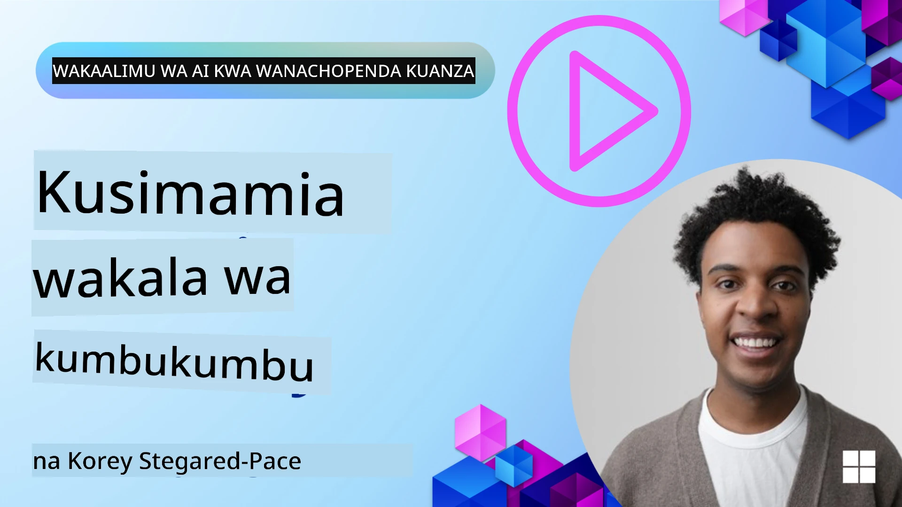

# Kumbukumbu kwa Maajenti wa AI 

Wakati tunajadili faida za kipekee za kuunda Maajenti wa AI, mambo mawili yanajadiliwa sana: uwezo wa kuitisha zana kukamilisha kazi na uwezo wa kuboresha kwa wakati. Kumbukumbu iko msingi wa kuunda maajenti wanaojiboresha wenyewe ambao wanaweza kuunda uzoefu bora kwa watumiaji wetu.

Katika somo hili, tutaangalia ni nini kumbukumbu kwa Maajenti wa AI inamaanisha na jinsi tunaweza kuisimamia na kuitumia kwa faida ya matumizi yetu.

## Utangulizi

Somo hili litashughulikia:

• **Kuelewa Kumbukumbu za Maajenti wa AI**: Nini kumbukumbu ni na kwa nini ni muhimu kwa maajenti.

• **Kutekeleza na Kuhifadhi Kumbukumbu**: Njia za vitendo za kuongeza uwezo wa kumbukumbu kwa maajenti wako wa AI, zikilenga kumbukumbu za muda mfupi na za muda mrefu.

• **Kufanya Maajenti wa AI Kujiboresha**: Jinsi kumbukumbu inavyowawezesha maajenti kujifunza kutokana na mwingiliano wa awali na kuboresha kwa wakati.

## Utekelezaji Unaopatikana

Somo hili linajumuisha mafunzo mawili kamili ya notebook:

• **[13-agent-memory.ipynb](./13-agent-memory.ipynb)**: Hutekeleza kumbukumbu kwa kutumia Mem0 na Azure AI Search kwa Microsoft Agent Framework

• **[13-agent-memory-cognee.ipynb](./13-agent-memory-cognee.ipynb)**: Hutekeleza kumbukumbu iliyopangwa kwa kutumia Cognee, ikijenga moja kwa moja grafu ya maarifa inayoungwa mkono na embeddings, kuonyesha grafu, na ufahamu wa kivitendo wa utafutaji

## Malengo ya Kujifunza

Baada ya kumaliza somo hili, utajua jinsi ya:

• **Kutofautisha kati ya aina mbalimbali za kumbukumbu za maajenti wa AI**, ikiwa ni pamoja na kazi, muda mfupi, na muda mrefu, pamoja na aina maalum kama persona na kumbukumbu za kipindi.

• **Kutekeleza na kusimamia kumbukumbu za muda mfupi na muda mrefu kwa maajenti wa AI** kwa kutumia Microsoft Agent Framework, ukitumia zana kama Mem0, Cognee, Whiteboard memory, na kuingiza na Azure AI Search.

• **Kuelewa sheria zinazoongoza maajenti wa AI wanaojiboresha wenyewe** na jinsi mifumo thabiti ya usimamizi wa kumbukumbu inavyosaidia kujifunza na kubadilika kwa muda mrefu.

## Kuelewa Kumbukumbu za Maajenti wa AI

Katika msingi wake, **kumbukumbu kwa maajenti wa AI inarejelea mbinu zinazowaruhusu kuhifadhi na kukumbuka habari**. Habari hizi zinaweza kuwa maelezo maalum kuhusu mazungumzo, mapendeleo ya mtumiaji, hatua za zamani, au hata mifumo iliyojifunza.

Bila kumbukumbu, programu za AI mara nyingi hazina hali (stateless), ikimaanisha kila mwingiliano unaanza kutoka mwanzoni. Hii husababisha uzoefu wa mtumiaji unaorudiwa na wa kusumbua ambapo maajenti "husahau" muktadha au mapendeleo ya awali.

### Kwa Nini Kumbukumbu ni Muhimu?

akili ya wakala imefungamana sana na uwezo wake wa kukumbuka na kutumia habari za zamani. Kumbukumbu inawawezesha maajenti kuwa:

• **Wanaofikiria**: Kujifunza kutoka kwa matendo na matokeo ya zamani.

• **Wanaoshirikiana**: Kudumisha muktadha katika mazungumzo yanayoendelea.

• **Wanaotabiri na Wanayojibu**: Kutarajia mahitaji au kujibu kwa usahihi kulingana na data ya kihistoria.

• **Wanaojitegemea**: Kufanya kazi kwa uhuru zaidi kwa kutegemea maarifa yaliyohifadhiwa.

Lengo la kutekeleza kumbukumbu ni kufanya maajenti wawe zaidi **wa kuaminika na wenye uwezo**.

### Aina za Kumbukumbu

#### Kumbukumbu ya Kazi

Fikiria hii kama karatasi ya kuandika wakala anayotumia wakati wa kazi moja inayodumu au mchakato wa mawazo. Inashikilia habari za papo kwa papo zinazohitajika kwa hatua inayofuata.

Kwa maajenti wa AI, kumbukumbu ya kazi mara nyingi huhifadhi taarifa muhimu zaidi kutoka kwenye mazungumzo, hata kama rekodi yote ya mazungumzo ni ndefu au imekatishwa. Inazingatia kutoa vipengele muhimu kama mahitaji, mapendekezo, maamuzi, na hatua.

**Mfano wa Kumbukumbu ya Kazi**

Katika wakala wa kuweka tiketi za kusafiri, kumbukumbu ya kazi inaweza kushikilia ombi la mtumiaji la sasa, kama "Nataka kuweka safari kuelekea Paris". Hitaji hili maalum linashikiliwa katika muktadha wa papo kwa papo wa wakala kuongoza mwingiliano wa sasa.

#### Kumbukumbu ya Muda Mfupi

Aina hii ya kumbukumbu huhifadhi habari kwa muda wa mazungumzo au kikao kimoja. Ni muktadha wa gumzo la sasa, ukiruhusu wakala kurejea kwenye mizunguko ya awali ya mazungumzo.

**Mfano wa Kumbukumbu ya Muda Mfupi**

Kama mtumiaji anauliza, "Ngiwaje bei ya ndege kwenda Paris?" na kisha anauliza, "Na kwa malazi huko?" kumbukumbu ya muda mfupi inahakikisha wakala anajua "huko" inarejelea "Paris" ndani ya mazungumzo ule ule.

#### Kumbukumbu ya Muda Mrefu

Hii ni habari inayodumu kati ya mazungumzo au vikao vingi. Inaiwezesha maajenti kukumbuka mapendeleo ya watumiaji, mwingiliano wa kihistoria, au maarifa ya jumla kwa vipindi virefu. Hii ni muhimu kwa ubinafsishaji.

**Mfano wa Kumbukumbu ya Muda Mrefu**

Kumbukumbu ya muda mrefu inaweza kuhifadhi kwamba "Ben anafurahia kuteleza theluji na shughuli za nje, anapenda kahawa akiwa na mtazamo wa mlima, na anataka kuepuka njia za kuteleza theluji za juu kutokana na jeraha la zamani". Habari hii, iliyojifunzwa kutoka kwa mwingiliano wa awali, inaathiri mapendekezo katika mipango ya kusafiri ya baadaye, ikifanya iwe iliyobinafsishwa sana.

#### Kumbukumbu ya Persona

Aina maalum ya kumbukumbu hii husaidia wakala kuendeleza "uhusiano" au "persona" thabiti. Inamruhusu wakala kukumbuka maelezo kuhusu yeye mwenyewe au jukumu lake lililokusudiwa, ikifanya mwingiliano uwe mtiririko na wenye lengo.

**Mfano wa Kumbukumbu ya Persona**
Kama wakala wa kusafiri amesanifiwa kuwa "mpangaji mtaalamu wa kuteleza theluji," kumbukumbu ya persona inaweza kuimarisha jukumu hili, ikichangia majibu yake kuyalingana na toni na ujuzi wa mtaalamu.

#### Kumbukumbu ya Mchakato/Kipindi

Kumbukumbu hii huhifadhi mfuatano wa hatua za wakala wakati wa kazi ngumu, ikijumuisha mafanikio na kushindwa. Ni kama kukumbuka "vipindi" maalum au uzoefu wa zamani ili kujifunza kutoka kwawo.

**Mfano wa Kumbukumbu ya Kipindi**

Ikiwa wakala alijaribu kuweka tiketi ya ndege maalum lakini ikaanguka kutokana na kutopatikana, kumbukumbu ya kipindi inaweza kurekodi kushindwa kwako, ikimruhusu wakala kujaribu ndege mbadala au kumjulisha mtumiaji kuhusu tatizo kwa njia yenye ufahamu zaidi wakati wa jaribio jingine.

#### Kumbukumbu ya Kiumbe (Entity Memory)

Hii inahusisha kutoa na kukumbuka viumbe maalum (kama watu, maeneo, au vitu) na matukio kutoka kwa mazungumzo. Inamruhusu wakala kujenga uelewa uliopangwa wa vipengele muhimu vilivyoruzushwa.

**Mfano wa Kumbukumbu ya Kiumbe**

Kutoka kwenye mazungumzo kuhusu safari ya zamani, wakala anaweza kutoa "Paris," "Eiffel Tower," na "chakula cha jioni kwenye mkahawa Le Chat Noir" kama viumbe. Katika mwingiliano wa baadaye, wakala anaweza kukumbuka "Le Chat Noir" na kutoa kusaidia kuweka nafasi mpya huko.

#### Structured RAG (Retrieval Augmented Generation)

Wakati RAG ni mbinu pana, "Structured RAG" inasisitizwa kama teknolojia yenye nguvu ya kumbukumbu. Inatoa habari mnato, iliyopangwa kutoka kwa vyanzo mbalimbali (mazungumzo, barua pepe, picha) na kuitumia kuongeza usahihi, kumbukumbu, na kasi ya majibu. Tofauti na RAG ya kawaida inayotegemea tu ulinganifu wa semantiki, Structured RAG inafanya kazi na muundo asilia wa habari.

**Mfano wa Structured RAG**

Badala ya kulinganisha maneno muhimu tu, Structured RAG inaweza kuchanganua maelezo ya ndege (mwendokasi, tarehe, saa, shirika la anga) kutoka kwa barua pepe na kuyahifadhi kwa njia iliyopangwa. Hii inaruhusu maswali sahihi kama "Niliweka ndege gani kwenda Paris siku ya Jumanne?"

## Kutekeleza na Kuhifadhi Kumbukumbu

Kutekeleza kumbukumbu kwa maajenti wa AI kunahusisha mchakato wa kimfumo wa **usimamizi wa kumbukumbu**, ambao unajumuisha kuzalisha, kuhifadhi, kuifufua, kuingiza, kusasisha, na hata "kusahau" (au kufuta) habari. Utafutaji ni sehemu muhimu hasa.

### Zana Maalum za Kumbukumbu

#### Mem0

Njia moja ya kuhifadhi na kusimamia kumbukumbu za wakala ni kutumia zana maalum kama Mem0. Mem0 hufanya kazi kama safu ya kumbukumbu ya kudumu, kuruhusu maajenti kukumbuka mwingiliano muhimu, kuhifadhi mapendeleo ya watumiaji na muktadha wa ukweli, na kujifunza kutokana na mafanikio na kushindwa kwa muda. Wazo hapa ni kwamba maajenti wasiokuwa na hali wanageuka kuwa wenye hali.

Inafanya kazi kupitia **mchakato wa kumbukumbu wa hatua mbili: uchimbaji na sasisho**. Kwanza, ujumbe unaoongezwa kwenye thread ya wakala unatumwa kwa huduma ya Mem0, ambayo inatumia Large Language Model (LLM) kuifupisha historia ya mazungumzo na kutoa kumbukumbu mpya. Baadaye, awamu ya sasisho inayotokana na LLM inaamua ikiwa kuongeza, kubadilisha, au kufuta kumbukumbu hizo, ikizihifadhi katika duka la data mseto ambalo linaweza kujumuisha vector, grafu, na hifadhidata za key-value. Mfumo huu pia unaunga mkono aina mbalimbali za kumbukumbu na unaweza kuingiza kumbukumbu ya grafu kwa kusimamia uhusiano kati ya viumbe.

#### Cognee

Njia nyingine yenye nguvu ni kutumia **Cognee**, kumbukumbu ya semantiki ya chanzo wazi kwa maajenti wa AI inayobadilisha data iliyopangwa na isiyopangwa kuwa grafu za maarifa zinazoweza kutafutwa zinazoungwa mkono na embeddings. Cognee hutoa **miundo ya duka mbili** inayochanganya utafutaji wa ulinganifu wa vector na uhusiano wa grafu, kufanya maajenti kuelewa si tu ni habari gani inayofanana, bali jinsi dhana zinavyohusiana.

Inajitokeza katika **ufufuo mseto** unaochanganya ulinganifu wa vector, muundo wa grafu, na uelewa wa LLM - kutoka kutafuta vipande ghafi hadi majibu yaliyo na ufahamu wa grafu. Mfumo unaweka **kumbukumbu hai** inayokua na kukua huku ikibaki inaweza kutafutwa kama grafu moja iliyounganishwa, ikisaidia muktadha wa kikao cha muda mfupi na kumbukumbu ya kudumu ya muda mrefu.

Mafunzo ya notebook ya Cognee ([13-agent-memory-cognee.ipynb](./13-agent-memory-cognee.ipynb)) yanaonyesha jinsi ya kujenga safu hii ya kumbukumbu iliyounganishwa, pamoja na mifano ya vitendo ya kuingiza vyanzo mbalimbali vya data, kuonyesha grafu ya maarifa, na kuuliza kwa mikakati tofauti ya utafutaji iliyobinafsishwa kwa mahitaji maalum ya wakala.

### Kuhifadhi Kumbukumbu kwa RAG

Mbali na zana maalum za kumbukumbu kama mem0 , unaweza kutumia huduma za utafutaji zenye nguvu kama **Azure AI Search kama backend ya kuhifadhi na kurejesha kumbukumbu**, hasa kwa Structured RAG.

Hii inakuwezesha kuimarisha majibu ya wakala wako kwa data yako mwenyewe, kuhakikisha majibu yanayohusiana na sahihi zaidi. Azure AI Search inaweza kutumika kuhifadhi kumbukumbu za kusafiri za watumiaji, katalogi za bidhaa, au maarifa yoyote maalum ya kikoa.

Azure AI Search inaunga mkono uwezo kama **Structured RAG**, ambayo ni bora katika kutoa na kurejesha habari mnato, iliyopangwa kutoka kwa seti kubwa za data kama historia za mazungumzo, barua pepe, au hata picha. Hii inatoa "usahihifu na kumbukumbu ya kiwango cha ziada ya binadamu" ikilinganishwa na mbinu za kawaida za kugawanya maandishi na embeddings.

## Kufanya Maajenti wa AI Kujiboresha

Mfumo wa kawaida kwa maajenti wanaojiboresha wenyewe unahusisha kuanzisha **"wakala wa maarifa"**. Wakala huyu tofauti hunangalia mazungumzo kuu kati ya mtumiaji na wakala mkuu. Nafasi yake ni:

1. **Kubaini habari ya thamani**: Kuamua kama sehemu yoyote ya mazungumzo inastahili kuokolewa kama maarifa ya jumla au upendeleo maalum wa mtumiaji.

2. **Kutoa na kuifupisha**: Kuchuja somo kuu au upendeleo kutoka kwa mazungumzo.

3. **Kuhifadhi kwenye hifadhidata ya maarifa**: Kuhifadhi taarifa iliyochimbuliwa, mara nyingi kwenye hifadhidata ya vector, ili iweze kurejeshwa baadaye.

4. **Kuongezea maswali ya baadaye**: Wakati mtumiaji anaanzisha swali jipya, wakala wa maarifa hurudisha habari zilizo hifadhiwa zinazofaa na kuziambatanisha kwa ombi la mtumiaji, kutoa muktadha muhimu kwa wakala mkuu (sawa na RAG).

### Uboreshaji kwa Kumbukumbu

• **Usimamizi wa Ucheleweshaji**: Ili kuepuka kupunguza kasi ya mwingiliano wa mtumiaji, mfano rahisi na wa haraka unaweza kutumika awali kuangalia haraka ikiwa habari inastahili kuhifadhiwa au kurejeshwa, na kualika mchakato mgumu wa uchimbaji/urejeshaji tu wakati ni lazima.

• **Matengenezo ya Hifadhidata ya Maarifa**: Kwa hifadhidata ya maarifa inayokua, taarifa zisizotumika mara kwa mara zinaweza kuhifadhiwa "nyuma" ili kudhibiti gharama.

## Una Maswali Zaidi Kuhusu Kumbukumbu za Maajenti?

Jiunge na [Microsoft Foundry Discord](https://aka.ms/ai-agents/discord) kukutana na watafiti wengine, kuhudhuria saa za ofisi na kupata majibu ya maswali yako kuhusu Maajenti wa AI.

---

<!-- CO-OP TRANSLATOR DISCLAIMER START -->
Tamko la kutokuwajibika:
Waraka huu umetafsiriwa kwa kutumia huduma ya tafsiri ya AI (Co-op Translator: https://github.com/Azure/co-op-translator). Ingawa tunajitahidi kupata usahihi, tafadhali fahamu kwamba tafsiri zilizotengenezwa kiotomatiki zinaweza kuwa na makosa au ukosefu wa usahihi. Waraka wa asili katika lugha yake ya asili unapaswa kuchukuliwa kama chanzo cha mamlaka. Kwa taarifa muhimu, inapendekezwa kutumia tafsiri ya mkalimani mtaalamu. Hatuwajibiki kwa kutoelewana au tafsiri isiyo sahihi zinazotokana na matumizi ya tafsiri hii.
<!-- CO-OP TRANSLATOR DISCLAIMER END -->