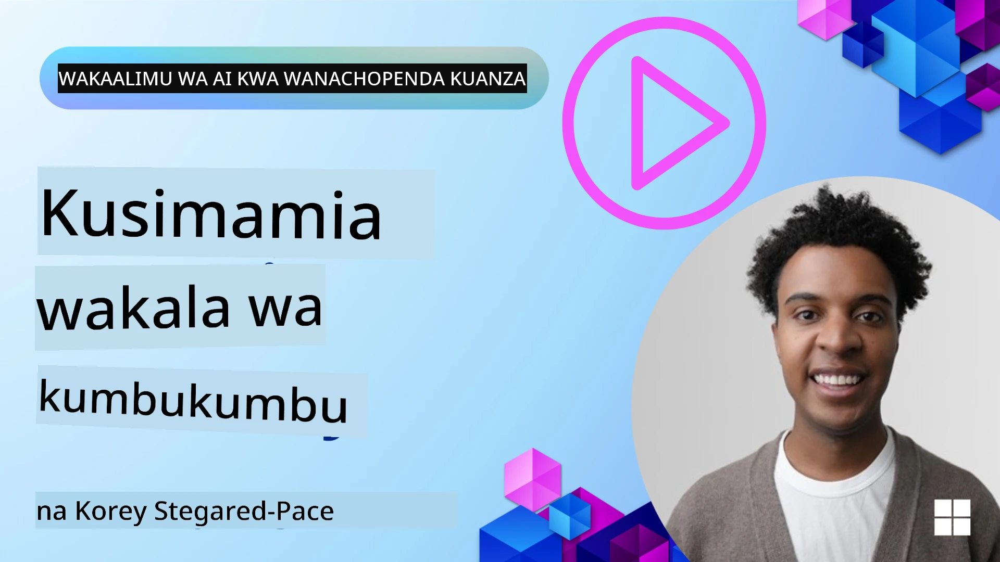

# Kumbukumbu kwa Wakala AI

Tunapojadili faida za kipekee za kuunda Wakala wa AI, mambo mawili yanajadiliwa hasa: uwezo wa kuitisha zana kukamilisha kazi na uwezo wa kuboresha kwa muda. Kumbukumbu iko kwenye msingi wa kuunda wakala anayejiendeleza mwenyewe ambaye anaweza kuunda uzoefu bora kwa watumiaji wetu.

Katika somo hili, tutaangalia ni nini kumbukumbu kwa Wakala wa AI na jinsi tunavyoweza kuisimamia na kuitumia kwa manufaa ya programu zetu.

## Utangulizi

Somo hili litaelezea:

• **Kuelewa Kumbukumbu ya Wakala wa AI**: Kumbukumbu ni nini na kwa nini ni muhimu kwa wakala.

• **Kutekeleza na Kuhifadhi Kumbukumbu**: Mbinu za vitendo za kuongeza uwezo wa kumbukumbu kwa wakala wako wa AI, zikitazama kumbukumbu ya muda mfupi na ya muda mrefu.

• **Kufanya Wakala wa AI Kujiboresha Wenyewe**: Jinsi kumbukumbu inavyowezesha wakala kujifunza kutoka kwa mwingiliano wa zamani na kuboresha kwa muda.

## Utekelezaji unaopatikana

Somo hili linajumuisha mafunzo mawili ya daftari:

• **[13-agent-memory.ipynb](./13-agent-memory.ipynb)**: Inatekeleza kumbukumbu kwa kutumia Mem0 na Azure AI Search pamoja na Microsoft Agent Framework

• **[13-agent-memory-cognee.ipynb](./13-agent-memory-cognee.ipynb)**: Inatekeleza kumbukumbu iliyo na muundo kwa kutumia Cognee, inayojenga moja kwa moja chati ya maarifa yenye msingi wa embedding, kuonyesha chati, na utafutaji wa kisanii

## Malengo ya Kujifunza

Baada ya kumaliza somo hili, utajua jinsi ya:

• **Kutofautisha kati ya aina mbalimbali za kumbukumbu ya wakala wa AI**, ikiwa ni pamoja na kumbukumbu ya kazi, ya muda mfupi, na ya muda mrefu, pamoja na aina maalum kama kumbukumbu ya persona na episodic.

• **Kutekeleza na kusimamia kumbukumbu ya muda mfupi na ya muda mrefu kwa wakala wa AI** kwa kutumia Microsoft Agent Framework, ukitumia zana kama Mem0, Cognee, kumbukumbu ya bodi nyeupe, na kuingiliana na Azure AI Search.

• **Kuelewa kanuni za wakala wa AI kujiboresha wenyewe** na jinsi mifumo thabiti ya usimamizi wa kumbukumbu inavyosaidia kujifunza na kuishiimarisha muda wote.

## Kuelewa Kumbukumbu ya Wakala wa AI

Katika msingi wake, **kumbukumbu kwa wakala wa AI inahusu mbinu zinazowawezesha kuhifadhi na kutambua taarifa**. Taarifa hii inaweza kuwa maelezo maalum kuhusu mazungumzo, upendeleo wa mtumiaji, vitendo vya zamani, au hata mifumo iliyojifunza.

Bila kumbukumbu, programu za AI mara nyingi huwa zisizo na hali, ikimaanisha kila mwingiliano huanza kutoka mwanzo. Hii husababisha uzoefu wa mtumiaji wa kurudia na wa kukera ambapo wakala "husahau" muktadha wa awali au upendeleo.

### Kwanini Kumbukumbu ni Muhimu?

akili ya wakala imefungwa kwa kina na uwezo wake wa kutambua na kutumia taarifa za zamani. Kumbukumbu huwapa wakala uwezo wa kuwa:

• **Kitaakari**: Kujifunza kutoka vitendo na matokeo ya zamani.

• **Kushirikiana**: Kuhifadhi muktadha wa mazungumzo yanayoendelea.

• **Kuwa na Mwelekeo wa Kutabiri na Kujibu**: Kutabiri mahitaji au kujibu ipasavyo kulingana na data za zamani.

• **Kujitegemea**: Kufanya kazi kwa uhuru zaidi kwa kutumia maarifa yaliyohifadhiwa.

Lengo la kutekeleza kumbukumbu ni kufanya wakala wawe **wa kuaminika na wenye uwezo zaidi**.

### Aina za Kumbukumbu

#### Kumbukumbu ya Kazi

Fikiria hii kama karatasi ya kuandika maelezo ambayo wakala hutumia wakati wa kazi moja au mchakato wa kufikiri unaoendelea. Inashikilia taarifa za moja kwa moja zinazohitajika kwa hatua inayofuata.

Kwa wakala wa AI, kumbukumbu ya kazi mara nyingi hushika taarifa muhimu zaidi kutoka kwenye mazungumzo, hata kama historia yote ya mazungumzo ni ndefu au imefupishwa. Inazingatia kuchukua vipengele muhimu kama mahitaji, mapendekezo, maamuzi, na vitendo.

**Mfano wa Kumbukumbu ya Kazi**

Katika wakala wa kuweka tiketi za kusafiri, kumbukumbu ya kazi inaweza kushika ombi la mtumiaji la sasa, kama vile "Nataka kuweka safari kwenda Paris". Mahitaji hii maalum huhifadhiwa katika muktadha wa papo hapo wa wakala kuongoza mwingiliano wa sasa.

#### Kumbukumbu ya Muda Mfupi

Aina hii ya kumbukumbu huhifadhi taarifa kwa kipindi cha mazungumzo au kikao kimoja. Ni muktadha wa mazungumzo ya sasa, ukiruhusu wakala kurejea nyuma kwenye mizunguko ya awali ya mazungumzo.

Katika sampuli za SDK za [Microsoft Agent Framework](https://github.com/microsoft/agent-framework) kwa Python, hii inalingana na `AgentSession`, iliyoundwa na `agent.create_session()`. Kikao ni kumbukumbu ya muda mfupi ya mfumo: inaweka muktadha wa mazungumzo upatikane wakati kikao hicho kinapotumika tena, lakini muktadha huo hauhifadhiwi wakati kikao kinapokamilika au programu inapozimwa na kuwashwa tena. Tumia kumbukumbu ya muda mrefu kwa ukweli na upendeleo unaohitaji kuishi muda mrefu, kawaida kupitia hifadhidata, kiashirio vector, au duka lingine linalodumu.

**Mfano wa Kumbukumbu ya Muda Mfupi**

Ikiwa mtumiaji anauliza, "Gharama ya ndege kwenda Paris ni kiasi gani?" kisha anauliza, "Na kuhusu makazi huko?", kumbukumbu ya muda mfupi inahakikisha wakala anajua "huko" inamaanisha "Paris" ndani ya mazungumzo hayo hayo.

#### Kumbukumbu ya Muda Mrefu

Hii ni taarifa inayodumu katika mazungumzo au vikao vingi. Inaruhusu wakala kukumbuka upendeleo wa mtumiaji, mwingiliano wa kihistoria, au maarifa ya jumla kwa kipindi kirefu. Hii ni muhimu kwa ubinafsishaji.

**Mfano wa Kumbukumbu ya Muda Mrefu**

Kumbukumbu ya muda mrefu inaweza kuhifadhi kuwa "Ben anafurahia skiing na shughuli za nje, anapenda kahawa na mtazamo wa mlima, na anataka kuepuka milima ya skiing ya hali ya juu kutokana na jeraha la zamani". Taarifa hii, iliyojifunza kutoka mwingiliano wa awali, huathiri mapendekezo katika vikao vya kupanga safari za baadaye, na kuifanya iwe ya kibinafsi sana.

#### Kumbukumbu ya Persona

Aina hii maalum ya kumbukumbu husaidia wakala kukuza "miaadamu" au "persona" endelevu. Inamwezesha wakala kukumbuka maelezo kuhusu nafsi yake au jukumu lake lililokusudiwa, na kufanya mwingiliano kuwa rahisi na wenye lengo.

**Mfano wa Kumbukumbu ya Persona**
Ikiwa wakala wa kusafiri amebuniwa kuwa "mtaalamu wa kupanga skiing," kumbukumbu ya persona inaweza kuimarisha jukumu hili, ikihimiza majibu yake kulingana na sauti na maarifa ya mtaalamu.

#### Kumbukumbu ya Mtiririko wa Kazi/Episodic

Kumbukumbu hii huhifadhi mlolongo wa hatua anazochukua wakala wakati wa kazi ngumu, ikiwa ni pamoja na mafanikio na kushindwa. Ni kama kukumbuka "vipindi" maalum au uzoefu wa zamani ili kujifunza kutoka kwavyo.

**Mfano wa Kumbukumbu ya Episodic**

Ikiwa wakala alijaribu kuweka tiketi ya ndege maalum lakini ikashindwa kutokana na kutokuwepo kwa seats, kumbukumbu ya episodic inaweza kurekodi kushindwa kwa hii, ikiruhusu wakala kujaribu ndege mbadala au kumjulisha mtumiaji kuhusu tatizo kwa njia yenye taarifa zaidi wakati wa jaribio la baadaye.

#### Kumbukumbu ya Entiti

Hii inahusisha kutoa na kukumbuka vitu maalum (kama watu, sehemu, au vitu) na matukio kutoka mazungumzo. Inamruhusu wakala kujenga uelewa wa muundo wa vipengele muhimu vilivyojadiliwa.

**Mfano wa Kumbukumbu ya Entiti**

Kutoka kwenye mazungumzo kuhusu safari ya zamani, wakala anaweza kutoa "Paris," "Mnara wa Eiffel," na "chakula cha jioni kwenye mgahawa wa Le Chat Noir" kama vitu. Katika mwingiliano wa baadaye, wakala anaweza kukumbuka "Le Chat Noir" na kutoa kusaidia kuweka reservation mpya hapo.

#### RAG Iliyo na Muundo (Retrieval Augmented Generation)

Ingawa RAG ni mbinu pana, "RAG Iliyo na Muundo" inaangaziwa kama teknolojia yenye nguvu ya kumbukumbu. Inatoa taarifa zenye msongamano na muundo kutoka vyanzo mbalimbali (mazungumzo, barua pepe, picha) na kuzitumia kuongeza usahihi, kumbukumbu, na kasi katika majibu. Tofauti na RAG ya kawaida inayotegemea ulinganifu wa maana pekee, RAG Iliyo na Muundo hutumia muundo wa taarifa ulio ndani.

**Mfano wa RAG Iliyo na Muundo**

Badala ya kulinganisha tu maneno ya funguo, RAG Iliyo na Muundo inaweza kuchambua maelezo ya ndege (mahali, tarehe, saa, shirika la ndege) kutoka barua pepe na kuyahifadhi kwa njia ya muundo. Hii inaruhusu maswali sahihi kama "Ndege gani niliyoiweka tiketi kwenda Paris siku ya Jumanne?"

## Kutekeleza na Kuhifadhi Kumbukumbu

Kutekeleza kumbukumbu kwa wakala wa AI kunahusisha mchakato wa kimuundo wa **usimamizi wa kumbukumbu**, unaojumuisha kuzalisha, kuhifadhi, kurejesha, kuunganisha, kusasisha, na hata "kusahau" (au kufuta) taarifa. Urejeshaji ni kipengele muhimu sana.

### Zana Maalum za Kumbukumbu

#### Mem0

Njia moja ya kuhifadhi na kusimamia kumbukumbu ya wakala ni kutumia zana maalum kama Mem0. Mem0 hufanya kazi kama safu ya kumbukumbu inayodumu, ikiruhusu wakala kukumbuka mwingiliano muhimu, kuhifadhi upendeleo wa mtumiaji na muktadha wa ukweli, na kujifunza kutokana na mafanikio na kushindwa kwa muda. Wazo hapa ni kwamba wakala wasiokuwa na hali hubadilika kuwa wenye hali.

Hufanya kazi kupitia **mchakato wa kumbukumbu wa hatua mbili: kutoa na kusasisha**. Kwanza, ujumbe unaoongezwa kwenye mfululizo wa wakala hutumwa kwa huduma ya Mem0, inayotumia Mfano Mkubwa wa Lugha (LLM) kufupisha historia ya mazungumzo na kutoa kumbukumbu mpya. Baadaye, hatua ya sasisho inayoendeshwa na LLM huchunguza ikiwa iongezwe, ibadilishwe, au ifutwe kumbukumbu hizi, zikihifadhiwa kwenye duka la data mseto linaweza kujumuisha hifadhidata za vector, chati, na key-value. Mfumo huu pia unaunga mkono aina mbalimbali za kumbukumbu na unaweza kujumuisha kumbukumbu ya chati kusimamia uhusiano kati ya vitu.

#### Cognee

Njia nyingine yenye nguvu ni kutumia **Cognee**, kumbukumbu ya semantic ya chanzo huru kwa wakala wa AI inayobadilisha data zilizo na muundo na zisizo na muundo kuwa grafu za maarifa zinazoweza kuhojiwa zilizo na msingi wa embedding. Cognee hutoa **miundo miwili ya kuhifadhi** ikichanganya utafutaji wa ulinganifu wa vector na uhusiano wa grafu, ikiwaruhusu wakala kuelewa sio tu taarifa zinazofanana, bali jinsi dhana zinavyohusiana.

Inabobea katika **urejeshaji mseto** unaochanganya ulinganifu wa vector, muundo wa grafu, na fikra za LLM - kutoka kutafuta kipande cha data ghafi hadi kujibu maswali kwa uelewa wa graph. Mfumo unadumisha **kumbukumbu hai** inayobadilika na kukua huku ikiwa inawezekana kuhoji kama chati moja iliyounganishwa, ikiunga mkono muktadha wa kikao cha muda mfupi na kumbukumbu ya kudumu ya muda mrefu.

Mafunzo ya daftari ya Cognee ([13-agent-memory-cognee.ipynb](./13-agent-memory-cognee.ipynb)) yanaonyesha ujenzi wa safu hii ya kumbukumbu ya umoja, na mifano ya vitendo ya kuingiza vyanzo tofauti vya data, kuonyesha grafu ya maarifa, na kuhoji kwa mikakati tofauti ya utafutaji iliyobinafsishwa kwa mahitaji maalum ya wakala.

### Kuhifadhi Kumbukumbu kwa RAG

Zaidi ya zana maalum za kumbukumbu kama Mem0, unaweza kutumia huduma imara za utafutaji kama **Azure AI Search kama backend ya kuhifadhi na kurejesha kumbukumbu**, hasa kwa RAG iliyo na muundo.

Hii inakuwezesha kuimarisha majibu ya wakala wako kwa data zako mwenyewe, kuhakikisha majibu zaidi yanayohusiana na sahihi. Azure AI Search inaweza kutumika kuhifadhi kumbukumbu za usafiri za mtumiaji, katalogi za bidhaa, au maarifa mengine maalum ya kituo.

Azure AI Search inaunga mkono uwezo kama **Structured RAG**, ambayo ni bora katika kutoa na kurejesha taarifa zenye msongamano na muundo kutoka kwenye seti kubwa za data kama historia za mazungumzo, barua pepe, au hata picha. Hii hutoa "usahihi na kumbukumbu wa kiwango cha juu zaidi" ikilinganishwa na mbinu za kawaida za kugawanya maandishi na embedding.

## Kufanya Wakala wa AI Kujiboresha Wenyewe

Mfumo wa kawaida wa wakala wa kujiboresha wenyewe ni kuanzisha **"wakala wa maarifa"**. Wakala huyu wa mbali huchunguza mazungumzo makuu kati ya mtumiaji na wakala mkuu. Jukumu lake ni:

1. **Kutambua taarifa zenye thamani**: Kubaini kama sehemu yoyote ya mazungumzo inastahili kuhifadhiwa kama maarifa ya jumla au upendeleo wa mtumiaji wa pekee.

2. **Kutoa na kufupisha**: Kutoa kemikali ya kujifunza muhimu au upendeleo kutoka kwenye mazungumzo.

3. **Kuhifadhi kwenye hifadhidata ya maarifa**: Kuhifadhi taarifa hii iliyotolewa, mara nyingi kwenye hifadhidata ya vector, ili irejeshwe baadaye.

4. **Kuongeza kwenye maswali ya baadaye**: Wakati mtumiaji anapoanzisha swali jipya, wakala wa maarifa hurejesha taarifa husika iliyohifadhiwa na kuiambatanisha na maelekezo ya mtumiaji, ikitoa muktadha muhimu kwa wakala mkuu (sawa na RAG).

### Uboreshaji wa Kumbukumbu

• **Usimamizi wa ucheleweshaji**: Ili kuepuka kuchelewesha mwingiliano wa mtumiaji, mfano rahisi na wa haraka unaweza kutumika awali kuangalia haraka kama taarifa ni ya kuhifadhi au kurejesha, na kisha kuanzisha mchakato mgumu zaidi wa kutoa/kuirejesha inapohitajika.

• **Matengenezo ya hifadhidata ya maarifa**: Kwa hifadhidata ya maarifa inayokua, taarifa zisizotumika mara kwa mara zinaweza kuhifadhiwa katika "hifadhi baridi" kudhibiti gharama.

## Una Maswali Zaidi Kuhusu Kumbukumbu ya Wakala?

Jiunge na [Microsoft Foundry Discord](https://discord.com/invite/ATgtXmAS5D) kukutana na wanafunzi wengine, kuhudhuria wakati wa ofisi na kupata majibu ya maswali yako kuhusu Wakala wa AI.

---

<!-- CO-OP TRANSLATOR DISCLAIMER START -->
**Kionyozo**:
Hati hii imetafsiriwa kwa kutumia huduma ya tafsiri ya AI [Co-op Translator](https://github.com/Azure/co-op-translator). Ingawa tunajitahidi kupata usahihi, tafadhali fahamu kwamba tafsiri za kiotomatiki zinaweza kuwa na makosa au upungufu wa usahihi. Hati ya asili katika lugha yake halisi inapaswa kuchukuliwa kama chanzo cha mamlaka. Kwa taarifa muhimu, tafsiri ya kitaalamu inayofanywa na binadamu inapendekezwa. Hatutojibu kwa kuelewa vibaya au tafsiri potofu zinazotokea kutokana na matumizi ya tafsiri hii.
<!-- CO-OP TRANSLATOR DISCLAIMER END -->