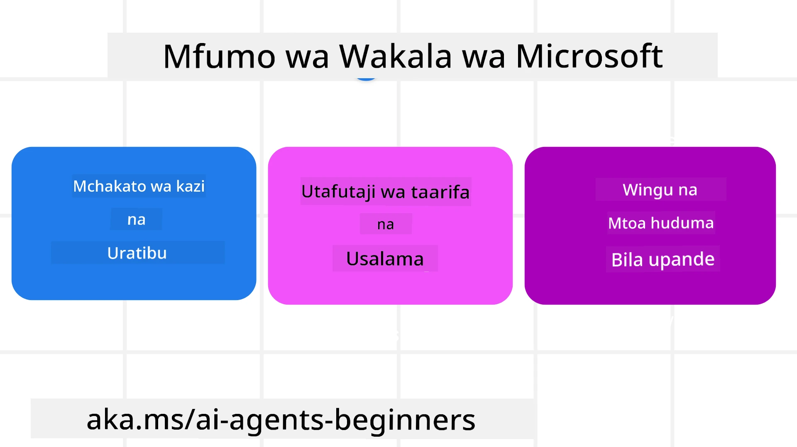

# Kuchunguza Mfumo wa Microsoft Agent


### Utangulizi

Somo hili litajumuisha:

- Kuelewa Mfumo wa Microsoft Agent: Sifa Muhimu na Thamani  
- Kuchunguza Misingi Muhimu ya Mfumo wa Microsoft Agent
- Mifumo ya Juu ya MAF: Mifumo ya Kazi, Middleware, na Kumbukumbu

## Malengo ya Kujifunza

Baada ya kumaliza somo hili, utajua jinsi ya:

- Kujenga Maajenti wa AI Tayari kwa Uzalishaji kwa kutumia Mfumo wa Microsoft Agent
- Kutumia sifa kuu za Mfumo wa Microsoft Agent kwa Matumizi yako ya Agentic
- Kutumia mifumo ya juu ikiwa ni pamoja na mifumo ya kazi, middleware, na ufuatiliaji

## Sampuli za Msimbo 

Sampuli za msimbo za [Microsoft Agent Framework (MAF)](https://aka.ms/ai-agents-beginners/agent-framewrok) zinaweza kupatikana katika hifadhi hii chini ya faili za `xx-python-agent-framework` na `xx-dotnet-agent-framework`.

## Kuelewa Mfumo wa Microsoft Agent



[Microsoft Agent Framework (MAF)](https://aka.ms/ai-agents-beginners/agent-framewrok) ni mfumo uliounganishwa wa Microsoft kwa ajili ya kujenga maajenti wa AI. Unatoa kubadilika kukabiliana na aina mbalimbali za matumizi ya maajenti yanayoonekana katika mazingira ya uzalishaji na utafiti ikiwa ni pamoja na:

- **Uratibu wa Agent mfululizo** katika hali ambapo mifumo ya hatua kwa hatua inahitajika.
- **Uratibu wa wakati mmoja** katika hali ambapo maajenti wanahitaji kukamilisha kazi kwa wakati mmoja.
- **Uratibu wa mazungumzo ya kundi** katika hali ambapo maajenti wanaweza kushirikiana pamoja katika kazi moja.
- **Uratibu wa Kuwasilisha Kazi** katika hali ambapo maajenti wanawasilishiana kazi kwasababu sehemu ndogo za kazi zinakamilika.
- **Uratibu wa Kivutio** katika hali ambapo maajenti msimamizi huunda na kurekebisha orodha ya kazi na kusimamia uratibu wa maajenti ndogo kukamilisha kazi.

Ili kutoa Maajenti wa AI katika Uzalishaji, MAF pia ina sifa za:

- **Ufuatiliaji** kupitia matumizi ya OpenTelemetry ambapo kila hatua ya AI Agent ikiwa ni pamoja na kuitwa kwa zana, hatua za uratibu, mtiririko wa kufikiria na ufuatiliaji wa utendaji kupitia dashibodi za Microsoft Foundry.
- **Usalama** kwa kuwa maajenti wanahudumiwa asilia kwenye Microsoft Foundry ambayo ina udhibiti wa usalama kama upatikanaji kwa msingi wa majukumu, usimamizi wa data binafsi na usalama wa yaliyomo uliyojengwa.
- **Ustahimilivu** kwa sababu mistari na mifumo ya maajenti inaweza kusitishwa, kuendelea na kurejeshwa kutoka kwa makosa ambayo inaruhusu michakato ya muda mrefu.
- **Udhibiti** kwa sababu mifumo ya binadamu ndani ya mzunguko inasaidiwa ambapo kazi zinatambuliwa kuhitaji idhini ya binadamu.

Mfumo wa Microsoft Agent pia unalenga kuwa muingilivu kwa:

- **Kuwa Huru ya Wingu** - Maajenti yanaweza kuendeshwa kwenye kontena, kwenye mwenyeji wa ndani na kwenye mawingu mbalimbali.
- **Kuwa Huru wa Mtoa Huduma** - Maajenti yanaweza kuundwa kupitia SDK unayopendelea ikiwa ni pamoja na Azure OpenAI na OpenAI
- **Kuingiza Viwango Wazi** - Maajenti yanaweza kutumia itifaki kama Agent-to-Agent (A2A) na Model Context Protocol (MCP) kugundua na kutumia maajenti na zana zingine.
- **Viendelezi na Viunganishi** - Uunganisho unaweza kufanywa kwa huduma za data na kumbukumbu kama Microsoft Fabric, SharePoint, Pinecone na Qdrant.

Tuchunguze jinsi sifa hizi zinavyotumika kwa baadhi ya misingi kuu ya Mfumo wa Microsoft Agent.

## Misingi Muhimu ya Mfumo wa Microsoft Agent

### Maajenti


**Kuumba Maajenti**

Uumbaji wa maajenti hufanywa kwa kufafanua huduma ya uamuzi (Mtoaji LLM), seti ya maagizo kwa AI Agent kufuata, na `jina` lililowekwa:

```python
agent = AzureOpenAIChatClient(credential=AzureCliCredential()).create_agent( instructions="You are good at recommending trips to customers based on their preferences.", name="TripRecommender" )
```

Hili linalotumika ni `Azure OpenAI` lakini maajenti yanaweza kuundwa kwa kutumia huduma mbalimbali zikiwemo `Microsoft Foundry Agent Service`:

```python
AzureAIAgentClient(async_credential=credential).create_agent( name="HelperAgent", instructions="You are a helpful assistant." ) as agent
```

API za OpenAI `Responses`, `ChatCompletion`

```python
agent = OpenAIResponsesClient().create_agent( name="WeatherBot", instructions="You are a helpful weather assistant.", )
```

```python
agent = OpenAIChatClient().create_agent( name="HelpfulAssistant", instructions="You are a helpful assistant.", )
```

au maajenti wa mbali wakitumia itifaki ya A2A:

```python
agent = A2AAgent( name=agent_card.name, description=agent_card.description, agent_card=agent_card, url="https://your-a2a-agent-host" )
```

**Kuendesha Maajenti**

Maajenti huendeshwa kwa kutumia njia `.run` au `.run_stream` kwa majibu yasiyo na mtiririko au yenye mtiririko.

```python
result = await agent.run("What are good places to visit in Amsterdam?")
print(result.text)
```

```python
async for update in agent.run_stream("What are the good places to visit in Amsterdam?"):
    if update.text:
        print(update.text, end="", flush=True)

```

Kila uendeshaji wa maajenti pia unaweza kuwa na chaguo za kubinafsisha vigezo kama `max_tokens` vinavyotumika na maajenti, `tools` ambazo maajenti yanaweza kuitisha, na hata `model` yenyewe inayotumika kwa maajenti.

Hii ni muhimu katika kesi ambapo mifano au zana maalum zinahitajika kukamilisha kazi ya mtumiaji.

**Zana**

Zana zinaweza kufafanuliwa wakati wa kufafanua maajenti:

```python
def get_attractions( location: Annotated[str, Field(description="The location to get the top tourist attractions for")], ) -> str: """Get the top tourist attractions for a given location.""" return f"The top attractions for {location} are." 


# Unapotengeneza ChatAgent moja kwa moja

agent = ChatAgent( chat_client=OpenAIChatClient(), instructions="You are a helpful assistant", tools=[get_attractions]

```

na pia wakati wa kuendesha maajenti:

```python

result1 = await agent.run( "What's the best place to visit in Seattle?", tools=[get_attractions] # Chombo kilichotolewa kwa mlolongo huu tu )
```

**Mistari ya Maajenti**

Mistari ya Maajenti hutumika kushughulikia mazungumzo ya marudio mengi. Mistari inaweza kuundwa kwa:

- Kutumia `get_new_thread()` ambayo inaruhusu mstari kuhifadhiwa kwa muda
- Kuunda mstari moja moja wakati wa kuendesha maajenti na mstari huo kudumu kwa uendeshaji huo tu.

Ili kuunda mstari, msimbo unaangalia kama huu:

```python
# Unda kichwa kipya.
thread = agent.get_new_thread() # Endesha wakala pamoja na kichwa.
response = await agent.run("Hello, I am here to help you book travel. Where would you like to go?", thread=thread)

```

Kisha unaweza kunakili mstari kuhifadhiwa kwa matumizi ya baadaye:

```python
# Unda kipande kipya cha mfululizo.
thread = agent.get_new_thread() 

# Endesha wakala na kipande cha mfululizo.

response = await agent.run("Hello, how are you?", thread=thread) 

# Anza mfululizo kwa ajili ya kuhifadhi.

serialized_thread = await thread.serialize() 

# Tenganisha hali ya mfululizo baada ya kupakia kutoka kwenye hifadhi.

resumed_thread = await agent.deserialize_thread(serialized_thread)
```

**Middleware ya Maajenti**

Maajenti huingiliana na zana na LLM kukamilisha kazi za mtumiaji. Katika baadhi ya hali, tunataka kutekeleza au kufuatilia kati ya mwingiliano huu. Middleware ya maajenti huturuhusu kufanya hivyo kupitia:

*Middleware ya Kifunctioni*

Middleware hii inaturuhusu kutekeleza kitendo kati ya maajenti na kifunctioni/zana itakayoitwa. Mfano wa matumizi yake ni pale ambapo ungependa kufanya uandikishaji wa logi kwenye wito wa kifunctioni.

Katika msimbo huu hapa chini `next` inaeleza kama middleware inayofuata au kifunctioni halisi kiitwe.

```python
async def logging_function_middleware(
    context: FunctionInvocationContext,
    next: Callable[[FunctionInvocationContext], Awaitable[None]],
) -> None:
    """Function middleware that logs function execution."""
    # Kujisafisha awali: Andika kabla ya utekelezaji wa kazi
    print(f"[Function] Calling {context.function.name}")

    # Endelea kwa middleware inayofuata au utekelezaji wa kazi
    await next(context)

    # Baada ya usindikaji: Andika baada ya utekelezaji wa kazi
    print(f"[Function] {context.function.name} completed")
```

*Middleware ya Mazungumzo*

Middleware hii inaturuhusu kutekeleza au kuandika logi kati ya maajenti na maombi kati ya LLM .

Hii ina habari muhimu kama `messages` zinazotumwa kwa huduma ya AI.

```python
async def logging_chat_middleware(
    context: ChatContext,
    next: Callable[[ChatContext], Awaitable[None]],
) -> None:
    """Chat middleware that logs AI interactions."""
    # Usindikaji wa awali: Andika kumbukumbu kabla ya simu ya AI
    print(f"[Chat] Sending {len(context.messages)} messages to AI")

    # Endelea kwa kipakia kati au huduma ya AI inayofuata
    await next(context)

    # Usindikaji wa baadae: Andika kumbukumbu baada ya jibu la AI
    print("[Chat] AI response received")

```

**Kumbukumbu ya Maajenti**

Kama ilivyofunzwa katika somo `Agentic Memory`, kumbukumbu ni kipengele muhimu kuwezesha maajenti kufanya kazi kwa muktadha tofauti. MAF inatoa aina kadhaa za kumbukumbu:

*Kumbukumbu ya Ndani ya Ramani*

Hii ni kumbukumbu inayohifadhiwa kwenye mistari wakati wa mchakato wa programu.

```python
# Unda thread mpya.
thread = agent.get_new_thread() # Endesha wakala kwa thread.
response = await agent.run("Hello, I am here to help you book travel. Where would you like to go?", thread=thread)
```

*Ujumbe wa Kudumu*

Kumbukumbu hii hutumika kuhifadhi historia ya mazungumzo kati ya vikao tofauti. Inafafanuliwa kwa kutumia `chat_message_store_factory`:

```python
from agent_framework import ChatMessageStore

# Unda duka la ujumbe la kawaida
def create_message_store():
    return ChatMessageStore()

agent = ChatAgent(
    chat_client=OpenAIChatClient(),
    instructions="You are a Travel assistant.",
    chat_message_store_factory=create_message_store
)

```

*Kumbukumbu ya Juu*

Kumbukumbu hii inaongezwa kwenye muktadha kabla ya maajenti kuendeshwa. Kumbukumbu hizi zinaweza kuhifadhiwa katika huduma za nje kama mem0:

```python
from agent_framework.mem0 import Mem0Provider

# Kutumia Mem0 kwa uwezo wa kumbukumbu wa hali ya juu
memory_provider = Mem0Provider(
    api_key="your-mem0-api-key",
    user_id="user_123",
    application_id="my_app"
)

agent = ChatAgent(
    chat_client=OpenAIChatClient(),
    instructions="You are a helpful assistant with memory.",
    context_providers=memory_provider
)

```

**Ufuatiliaji wa Maajenti**

Ufuatiliaji ni muhimu kwa kujenga mifumo ya maajenti inayotegemeka na inayodumu. MAF inaunganisha na OpenTelemetry kutoa ufuatiliaji na mita za ufuatiliaji bora.

```python
from agent_framework.observability import get_tracer, get_meter

tracer = get_tracer()
meter = get_meter()
with tracer.start_as_current_span("my_custom_span"):
    # fanya kitu
    pass
counter = meter.create_counter("my_custom_counter")
counter.add(1, {"key": "value"})
```

### Mifumo ya Kazi

MAF inatoa mifumo ya kazi ambayo ni hatua zisizobadilika kwa ajili ya kukamilisha kazi na kujumuisha maajenti wa AI kama vipengele katika hatua hizo.

Mifumo ya kazi imeundwa na vipengele tofauti vinavyoruhusu mtiririko bora wa udhibiti. Mifumo ya kazi pia inaruhusu **uratibu wa maajenti wengi** na **uwekaji wa alama** kuhifadhi hali za mfumo wa kazi.

Vipengele kuu vya mfumo wa kazi ni:

**Watekelezaji**

Watekelezaji hupokea ujumbe wa kuingiza, hufanya majukumu yao yaliyopangiwa, na kisha kutoa ujumbe wa kutolewa. Hii husaidia kusonga mbele mfumo wa kazi kuelekea kukamilisha kazi kubwa. Watekelezaji wanaweza kuwa maajenti wa AI au mantiki ya kawaida.

**Mikondo ya Mtiririko**

Mikondo hutumika kufafanua mtiririko wa ujumbe katika mfumo wa kazi. Hizi zinaweza kuwa:

*Mikondo ya Moja kwa Moja* - Unganisho rahisi wa mtu kwa mtu kati ya watekelezaji:

```python
from agent_framework import WorkflowBuilder

builder = WorkflowBuilder()
builder.add_edge(source_executor, target_executor)
builder.set_start_executor(source_executor)
workflow = builder.build()
```

*Mikondo ya Masharti* - Huitwa baada ya kushirikiana na hali fulani. Kwa mfano, pale vyumba vya hoteli havipatikani, mtekelezaji anaweza kupendekeza chaguzi nyingine.

*Mikondo ya Kesi Kubadili* - Ruta ujumbe kwa watekelezaji tofauti kulingana na masharti yaliyowekwa. Kwa mfano, ikiwa mteja wa usafiri ana upatikanaji wa kipaumbele na kazi zake zitaendeshwa kupitia mfumo mwingine.

*Mikondo ya Kusambaza* - Tuma ujumbe mmoja kwa malengo mengi.

*Mikondo ya Kukusanya* - Kusanya ujumbe nyingi kutoka kwa watekelezaji tofauti na kutuma kwa lengo moja.

**Matukio**

Ili kutoa ufuatiliaji bora wa mifumo ya kazi, MAF inatoa matukio yaliyojengwa ya utekelezaji ikiwa ni pamoja na:

- `WorkflowStartedEvent`  - Utekelezaji wa mfumo wa kazi unaanza
- `WorkflowOutputEvent` - Mfumo wa kazi hutoa matokeo
- `WorkflowErrorEvent` - Mfumo wa kazi anakutana na kosa
- `ExecutorInvokeEvent`  - Mtekelezaji anaanza kusindika
- `ExecutorCompleteEvent`  -  Mtekelezaji anakamilisha usindikaji
- `RequestInfoEvent` - Ombi limefanywa

## Mifumo ya Juu ya MAF

Sehemu zilizo juu zinashughulikia misingi muhimu ya Mfumo wa Microsoft Agent. Unapojenga maajenti tata zaidi, hapa kuna mifumo ya juu ya kuzingatia:

- **Muundo wa Middleware**: Unganisha watekelezaji wengi wa middleware (uandikishaji, uthibitishaji, kupunguza kiwango) kutumia middleware ya kifunctioni na mazungumzo kwa udhibiti mzuri wa tabia za maajenti.
- **Uwekaji wa Alama ya Mfumo wa Kazi**: Tumia matukio ya mfumo wa kazi na serialization kuhifadhi na kuendelea mchakato mrefu wa maajenti.
- **Uchaguzi wa Zana wa Juu**: Changanya RAG juu ya maelezo ya zana na usajili wa zana wa MAF kuonyesha tu zana zinazohusika kwa kila ombi.
- **Kuwasilishana kwa Maajenti Wengi**: Tumia mikondo ya mfumo wa kazi na usambazaji wa masharti kuratibu kuwasilishana kati ya maajenti maalum.

## Sampuli za Msimbo 

Sampuli za msimbo za Microsoft Agent Framework zinaweza kupatikana katika hifadhi hii chini ya faili za `xx-python-agent-framework` na `xx-dotnet-agent-framework`.

## Unayo Maswali Zaidi Kuhusu Mfumo wa Microsoft Agent?

Jiunge na [Microsoft Foundry Discord](https://aka.ms/ai-agents/discord) kutana na wanafunzi wengine, hudhuria saa za ofisi na upate majibu kwa maswali yako ya Maajenti wa AI.

---

<!-- CO-OP TRANSLATOR DISCLAIMER START -->
**Kauli ya Msamaha**:
Hati hii imetafsiriwa kwa kutumia huduma ya utafsiri wa AI [Co-op Translator](https://github.com/Azure/co-op-translator). Ingawa tunajitahidi kwa usahihi, tafadhali fahamu kwamba tafsiri za otomatiki zinaweza kuwa na makosa au upungufu. Hati ya asili katika lugha yake ya asili inapaswa kuzingatiwa kama chanzo cha mamlaka. Kwa habari muhimu, tafsiri ya mtaalamu wa lugha ni inayopendekezwa. Hatubebwi na majibu au tafsiri potofu zinazotokana na matumizi ya tafsiri hii.
<!-- CO-OP TRANSLATOR DISCLAIMER END -->