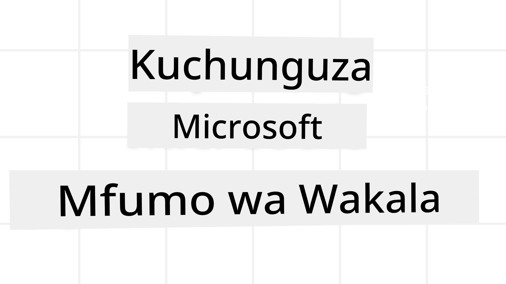
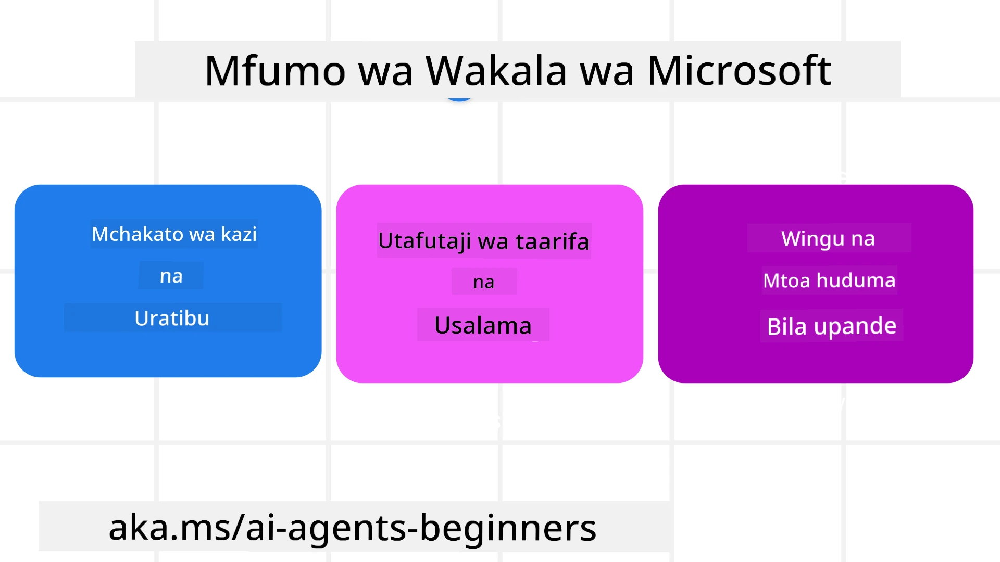
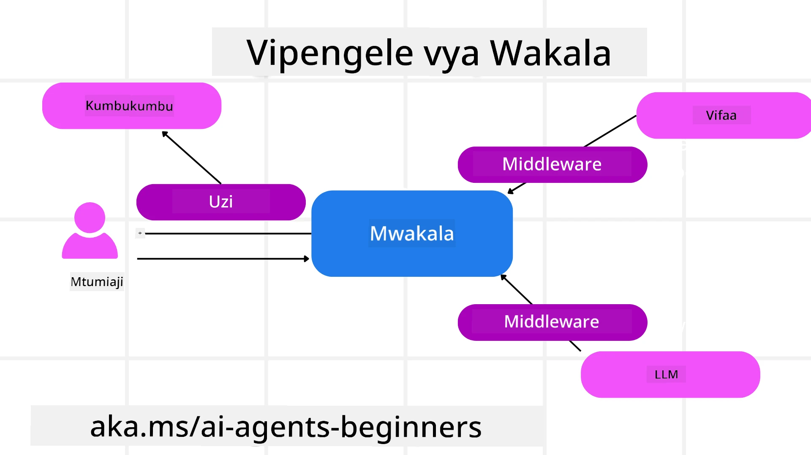

# Kuchunguza Mfumo wa Wakala wa Microsoft



### Utangulizi

Somo hili litafunika:

- Kuelewa Mfumo wa Wakala wa Microsoft: Vipengele Muhimu na Thamani  
- Kuchunguza Dhana Muhimu za Mfumo wa Wakala wa Microsoft
- Mifumo ya Juu ya MAF: Mipangilio ya Kazi, Middleware, na Kumbukumbu

## Malengo ya Kujifunza

Baada ya kumaliza somo hili, utajua jinsi ya:

- Kujenga Wakala wa AI Tayari kwa Uzalishaji kwa kutumia Mfumo wa Wakala wa Microsoft
- Kutumia vipengele kuu vya Mfumo wa Wakala wa Microsoft kwenye Matukio yako ya Matumizi ya Wakala
- Kutumia mifumo ya juu ikijumuisha mipangilio ya kazi, middleware, na uchunguzi

## Mifano ya Msimbo 

Mifano ya msimbo kwa [Microsoft Agent Framework (MAF)](https://aka.ms/ai-agents-beginners/agent-framework) inaweza kupatikana katika hifadhidata hii chini ya faili za `xx-python-agent-framework` na `xx-dotnet-agent-framework`.

## Kuelewa Mfumo wa Wakala wa Microsoft



[Microsoft Agent Framework (MAF)](https://aka.ms/ai-agents-beginners/agent-framework) ni mfumo unaounganisha wa Microsoft wa kujenga mawakala wa AI. Inatoa uwezekano wa kushughulikia aina mbalimbali za matumizi ya mawakala zinazojulikana katika mazingira ya uzalishaji na utafiti ikiwa ni pamoja na:

- **Uratibu wa Wakala wa Mfululizo** katika hali ambapo mipangilio ya hatua kwa hatua inahitajika.
- **Uratibu wa Wakala wa Wakati Mmoja** katika hali ambapo mawakala wanahitaji kumaliza kazi kwa wakati mmoja.
- **Uratibu wa Gumzo la Kundi** katika hali ambapo mawakala wanaweza kushirikiana pamoja katika kazi moja.
- **Uratibu wa Kuwakabidhi Kazi** katika hali ambapo mawakala wanawakabidhi kazi mmoja kwa mwingine kama kazi ndogo zinavyokamilika.
- **Uratibu wa Sumaku** katika hali ambapo wakala msimamizi anaunda na kurekebisha orodha ya kazi na kusimamia uratibu wa mawakala wadogo kukamilisha kazi.

Ili kutoa Wakala wa AI katika Uzalishaji, MAF pia ina sifa za:

- **Uchunguzi** kupitia matumizi ya OpenTelemetry ambapo kila hatua ya Wakala wa AI ikijumuisha kuitisha zana, hatua za uratibu, mtiririko wa mawazo na ufuatiliaji wa utendaji kupitia dashibodi za Microsoft Foundry.
- **Usalama** kwa kuendesha mawakala moja kwa moja kwenye Microsoft Foundry ambayo inajumuisha udhibiti wa usalama kama ufikiaji wa kulingana na nafasi, usimamizi wa data binafsi na usalama wa maudhui uliojengwa.
- **Uthabiti** kama nyuzi na mipangilio ya wakala zinaweza kuacha, kuendelea na kupona kutoka kwa makosa ambayo inaruhusu mchakato unaoenda kwa muda mrefu.
- **Udhibiti** kama mipangilio ya mwanadamu katika mzunguko inaungwa mkono ambapo kazi zinahitaji idhini ya binadamu.

Mfumo wa Wakala wa Microsoft pia unazingatia uingilivu kwa:

- **Kuwa Huru kwa Wingu** - Mawakala yanaweza kuendesha katika kontena, sehemu za ndani na kwa mawingu mbalimbali tofauti.
- **Kuwa Huru kwa Mtoaji** - Mawakala yanaweza kuundwa kupitia SDK unayopendelea ikiwa ni pamoja na Azure OpenAI na OpenAI
- **Kuingiza Viwango Huru** - Mawakala yanaweza kutumia itifaki kama Agent-to-Agent(A2A) na Model Context Protocol (MCP) kugundua na kutumia mawakala na zana nyingine.
- **Viongezaji na Vionganishaji** - Uunganisho unaweza kufanywa na huduma za data na kumbukumbu kama Microsoft Fabric, SharePoint, Pinecone na Qdrant.

Tuchunguze jinsi vipengele hivi vinavyoitumika kwenye baadhi ya dhana kuu za Mfumo wa Wakala wa Microsoft.

## Dhana Muhimu za Mfumo wa Wakala wa Microsoft

### Mawakala



**Kuunda Mawakala**

Kuunda wakala hufanyika kwa kufafanua huduma ya ujasiri (Mtoaji wa LLM), seti ya maagizo kwa Wakala wa AI kufuata, na `jina` lililoteuliwa:


```python
agent = AzureOpenAIChatClient(credential=AzureCliCredential()).create_agent( instructions="You are good at recommending trips to customers based on their preferences.", name="TripRecommender" )
```

Hapo juu inatumia `Azure OpenAI` lakini mawakala yanaweza kuundwa kwa kutumia huduma mbalimbali ikiwemo `Microsoft Foundry Agent Service`:

```python
AzureAIAgentClient(async_credential=credential).create_agent( name="HelperAgent", instructions="You are a helpful assistant." ) as agent
```

API za OpenAI `Responses`, `ChatCompletion`

```python
agent = OpenAIResponsesClient().create_agent( name="WeatherBot", instructions="You are a helpful weather assistant.", )
```

```python
agent = OpenAIChatClient().create_agent( name="HelpfulAssistant", instructions="You are a helpful assistant.", )
```

au [MiniMax](https://platform.minimaxi.com/), ambayo hutoa API inayofanana na OpenAI wenye dirisha kubwa la muktadha (hadi tokes 204K):

```python
agent = OpenAIChatClient(base_url="https://api.minimax.io/v1", api_key=os.environ["MINIMAX_API_KEY"], model_id="MiniMax-M3").create_agent( name="HelpfulAssistant", instructions="You are a helpful assistant.", )
```

au mawakala wa mbali wakitumia itifaki ya A2A:

```python
agent = A2AAgent( name=agent_card.name, description=agent_card.description, agent_card=agent_card, url="https://your-a2a-agent-host" )
```

**Kuendesha Mawakala**

Mawakala huendeshwa kwa kutumia mbinu `.run` au `.run_stream` kwa majibu yasiyo ya mtiririko au yanayotiririka.

```python
result = await agent.run("What are good places to visit in Amsterdam?")
print(result.text)
```

```python
async for update in agent.run_stream("What are the good places to visit in Amsterdam?"):
    if update.text:
        print(update.text, end="", flush=True)

```

Kila uendeshaji wa wakala pia unaweza kuwa na chaguzi za kubinafsisha vigezo kama `max_tokens` vinavyotumika na wakala, `tools` ambazo wakala anaweza kuziita, na hata mfano (`model`) wenyewe unaotumika kwa wakala.

Hii ni muhimu katika kesi ambapo mifano maalum au zana zinahitajika kumalizia kazi ya mtumiaji.

**Zana**

Zana zinaweza kufafanuliwa wakati wa kufafanua wakala:

```python
def get_attractions( location: Annotated[str, Field(description="The location to get the top tourist attractions for")], ) -> str: """Get the top tourist attractions for a given location.""" return f"The top attractions for {location} are." 


# Wakati wa kuunda ChatAgent moja kwa moja

agent = ChatAgent( chat_client=OpenAIChatClient(), instructions="You are a helpful assistant", tools=[get_attractions]

```

na pia wakati wa kuendesha wakala:

```python

result1 = await agent.run( "What's the best place to visit in Seattle?", tools=[get_attractions] # Zana iliyotolewa kwa ajili ya mdurisho huu pekee )
```

**Nyuzi za Wakala**

Nyuzi za Wakala hutumika kushughulikia mazungumzo ya mizunguko mingi. Nyuzi zinaweza kuundwa kwa:

- Kutumia `get_new_thread()` inayowezesha nyuzi kuhifadhiwa kwa muda
- Kuunda nyuzi moja moja kiotomatiki unapoendesha wakala na nyuzi hiyo kudumu tu wakati wa uendeshaji huo.

Kuunda nyuzi, msimbo unafanana na huu:

```python
# Unda thread mpya.
thread = agent.get_new_thread() # Endesha mawakala na thread.
response = await agent.run("Hello, I am here to help you book travel. Where would you like to go?", thread=thread)

```

Kisha unaweza kusambaza nyuzi ili itumike baadaye:

```python
# Unda kipande kipya cha kazi.
thread = agent.get_new_thread() 

# Endesha wakala na kipande cha kazi.

response = await agent.run("Hello, how are you?", thread=thread) 

# Fanya serialization ya kipande cha kazi kwa ajili ya kuhifadhi.

serialized_thread = await thread.serialize() 

# Fanya deserialization ya hali ya kipande cha kazi baada ya kupakia kutoka kuhifadhi.

resumed_thread = await agent.deserialize_thread(serialized_thread)
```

**Middleware ya Wakala**

Mawakala huingiliana na zana na LLM kukamilisha kazi za watumiaji. Katika hali fulani, tunataka kutekeleza au kufuatilia maingiliano haya. Middleware ya wakala inatuwezesha kufanya hivi kupitia:

*Middleware ya Kazi*

Middleware hii inaruhusu kutekeleza hatua kati ya wakala na kazi/zaaa ambayo itaitwa. Mfano wa matumizi ni pale unapotaka kufanya kurekodiwa kwa mwito wa kazi.

Katika msimbo hapa chini `next` hufafanua kama middleware inayofuata au kazi halisi inaanza kuitwa.

```python
async def logging_function_middleware(
    context: FunctionInvocationContext,
    next: Callable[[FunctionInvocationContext], Awaitable[None]],
) -> None:
    """Function middleware that logs function execution."""
    # Utangulizi: Andika kumbukumbu kabla ya utekelezaji wa kazi
    print(f"[Function] Calling {context.function.name}")

    # Endelea kwenye middleware inayofuata au utekelezaji wa kazi
    await next(context)

    # Mchakato baada ya utekelezaji: Andika kumbukumbu baada ya utekelezaji wa kazi
    print(f"[Function] {context.function.name} completed")
```

*Middleware za Gumzo*

Middleware hii inaruhusu kutekeleza au kurekodi hatua kati ya wakala na maombi kati ya LLM .

Hii ina taarifa muhimu kama `messages` zinazotumwa kwa huduma ya AI.

```python
async def logging_chat_middleware(
    context: ChatContext,
    next: Callable[[ChatContext], Awaitable[None]],
) -> None:
    """Chat middleware that logs AI interactions."""
    # Uandaji wa awali: Rekodi kabla ya simu ya AI
    print(f"[Chat] Sending {len(context.messages)} messages to AI")

    # Endelea kwa middleware au huduma ya AI inayofuata
    await next(context)

    # Uandaji wa baada: Rekodi baada ya jibu la AI
    print("[Chat] AI response received")

```

**Kumbukumbu ya Wakala**

Kama ilivyofunuliwa katika somo la `Agentic Memory`, kumbukumbu ni sehemu muhimu ya kuwezesha wakala kufanya kazi kwa muktadha tofauti. MAF inatoa aina mbalimbali za kumbukumbu:

*Kumbukumbu za Ndani*

Hii ni kumbukumbu inayohifadhiwa katika nyuzi wakati wa matumizi.

```python
# Unda thread mpya.
thread = agent.get_new_thread() # Endesha wakala na thread.
response = await agent.run("Hello, I am here to help you book travel. Where would you like to go?", thread=thread)
```

*Ujumbe Endelevu*

Kumbukumbu hii hutumiwa kuhifadhi historia ya mazungumzo kati ya kikao tofauti. Inafafanuliwa kwa kutumia `chat_message_store_factory` :

```python
from agent_framework import ChatMessageStore

# Unda duka la ujumbe la kawaida
def create_message_store():
    return ChatMessageStore()

agent = ChatAgent(
    chat_client=OpenAIChatClient(),
    instructions="You are a Travel assistant.",
    chat_message_store_factory=create_message_store
)

```

*Kumbukumbu ya Kijifaa*

Kumbukumbu hii huongezwa kwenye muktadha kabla mawakala kuendeshwa. Kumbukumbu hizi zinaweza kuhifadhiwa katika huduma za nje kama mem0:

```python
from agent_framework.mem0 import Mem0Provider

# Kutumia Mem0 kwa uwezo wa kumbukumbu wa juu
memory_provider = Mem0Provider(
    api_key="your-mem0-api-key",
    user_id="user_123",
    application_id="my_app"
)

agent = ChatAgent(
    chat_client=OpenAIChatClient(),
    instructions="You are a helpful assistant with memory.",
    context_providers=memory_provider
)

```

**Uchunguzi wa Wakala**

Uchunguzi ni muhimu kwa kujenga mifumo ya wakala inayoweza kutegemewa na kuihudumia. MAF inaunganisha na OpenTelemetry kutoa ufuatiliaji na vipimo kwa uchunguzi bora.

```python
from agent_framework.observability import get_tracer, get_meter

tracer = get_tracer()
meter = get_meter()
with tracer.start_as_current_span("my_custom_span"):
    # fanya jambo
    pass
counter = meter.create_counter("my_custom_counter")
counter.add(1, {"key": "value"})
```

### Mipangilio ya Kazi

MAF inatoa mipangilio ya kazi ambazo ni hatua zilizobainishwa kabla kumalizia kazi na kujumuisha mawakala wa AI kama vipengele katika hatua hizo.

Mipangilio ya kazi imetengenezwa kwa vipengele tofauti vinavyoawezesha mtiririko bora wa udhibiti. Mipangilio ya kazi pia inaruhusu **uratibu wa mawakala wengi** na **kuweka alama za kuendelea** kuhifadhi hali za mpangilio.

Vipengele msingi vya mpangilio wa kazi ni:

**Watekelezaji**

Watekelezaji hupokea ujumbe wa ingizo, kutekeleza kazi zao zilizowekwa, na kisha kutoa ujumbe wa matokeo. Hii inaendelea kusukuma mpangilio wa kazi kuelekea kukamilisha kazi kubwa. Watekelezaji wanaweza kuwa wakala wa AI au mantiki maalum.

**Mikondo**

Mikondo hutumika kufafanua mtiririko wa ujumbe katika mpangilio wa kazi. Hii inaweza kuwa:

*Mikondo ya Moja kwa Moja* - Muunganisho rahisi wa moja kwa moja kati ya watekelezaji:

```python
from agent_framework import WorkflowBuilder

builder = WorkflowBuilder()
builder.add_edge(source_executor, target_executor)
builder.set_start_executor(source_executor)
workflow = builder.build()
```

*Mikondo ya Masharti* - Huanzishwa baada ya sharti fulani kutimizwa. Kwa mfano, wakati vyumba vya hoteli havipatikani, mtendaji anaweza kupendekeza chaguzi nyingine.

*Mikondo ya Kichujio* - Hubeba ujumbe kwa watekelezaji tofauti kulingana na masharti yaliyowekwa. Kwa mfano, kama mteja wa usafiri ana ufikiaji wa kipaumbele na kazi zao zitashughulikiwa kupitia mpangilio mwingine.

*Mikondo ya Kupanua* - Kutuma ujumbe mmoja kwa lengo nyingi.

*Mikondo ya Kuungana* - Kukusanya ujumbe nyingi kutoka kwa watendaji tofauti na kutuma kwa lengo moja.

**Matukio**

Ili kutoa uchunguzi bora katika mipangilio ya kazi, MAF hutoa matukio yaliyojengwa kwa ajili ya utekelezaji ikiwa ni pamoja na:

- `WorkflowStartedEvent`  - Kuanza kwa utekelezaji wa mpangilio wa kazi
- `WorkflowOutputEvent` - Mpangilio wa kazi hutoa matokeo
- `WorkflowErrorEvent` - Mpangilio wa kazi unapokumbana na kosa
- `ExecutorInvokeEvent`  - Mtendaji anaanza kusindika
- `ExecutorCompleteEvent`  -  Mtendaji anakamilisha kusindika
- `RequestInfoEvent` - Ombi linalotolewa

## Mifumo ya Juu ya MAF

Sehemu zilizo juu zinafunua dhana kuu za Mfumo wa Wakala wa Microsoft. Unapojenga mawakala zaidi ya changamano, hapa kuna mifumo ya juu ya kuzingatia:

- **Muundo wa Middleware**: Kuna mnyororo wa wapokeaji wa middleware mbalimbali (kurekodi, uthibitisho, kuweka mipaka ya viwango) kwa kutumia middleware ya kazi na gumzo kwa udhibiti wa kina wa tabia ya wakala.
- **Kuweka Alama za Kuendelea kwa Mpangilio wa Kazi**: Tumia matukio ya mpangilio wa kazi na serialization kuhifadhi na kuendelea na michakato mirefu ya wakala.
- **Uchaguzi wa Zana za Kijifaa**: Changanya RAG juu ya maelezo ya zana na usajili wa zana wa MAF kuonyesha zana zinazohusiana tu kwa kila swali.
- **Kuwakabidhi mawakala Wengi**: Tumia mikondo ya mpangilio wa kazi na njia za masharti kuratibu kuwakabidhi kati ya mawakala maalum.

## Kuhudumia Mawakala wa LangChain / LangGraph kwenye Microsoft Foundry

Mfumo wa Wakala wa Microsoft ni **mfumo unaoweza kufanya kazi na mingine** — hauko kifungoni kwa mawakala yaliyoandikwa na MAF tu. Ikiwa tayari una wakala aliyejengwa na **LangChain** au **LangGraph**, unaweza kuendesha kama **wakala mwenyeji wa Microsoft Foundry** ili Foundry isimamishe wakati wa kuendesha, vikao, upanuzi, utambulisho, na vituo vya itifaki kwa ajili yako, wakati mantiki ya wakala wako inaendelea kuwepo LangGraph.

Hii hufanyika na kifurushi cha `langchain_azure_ai.agents.hosting`, ambacho kinaonyesha mchoro wa LangGraph uliokusanywa juu ya itifaki zile zile zinazotumika na mawakala wenyeji wa Foundry.

**1. Sakinisha ziada ya kuhudumia:**

```bash
pip install -U "langchain-azure-ai[hosting]>=1.2.4" azure-identity
```

Ziara ya `hosting` husakinisha maktaba za itifaki za Foundry: `azure-ai-agentserver-responses` (mukono unaolingana na OpenAI `/responses`) na `azure-ai-agentserver-invocations` (mukono wa kawaida `/invocations`).

**2. Chagua itifaki ya kuhudumia:**

| Itifaki | Darasa la mwenyeji | Endpoint | Tumia wakati |
|----------|-----------|----------|----------|
| **Responses** | `ResponsesHostServer` | `/responses` | Unataka gumzo linalolingana na OpenAI, utiririshaji, historia ya majibu, na ufuatiliaji wa mazungumzo — chaguo la kawaida kwa mawakala wa mazungumzo. |
| **Invocations** | `InvocationsHostServer` | `/invocations` | Unahitaji fomati ya JSON maalum, endpoint ya webhook, au usindikaji usio wa mazungumzo. |

Kwa kuwa **API ya Responses ndiyo API kuu kwa maendeleo ya aina ya wakala katika Foundry**, anza na `ResponsesHostServer` kwa mawakala wengi.

**3. Sanidi mabadiliko ya mazingira** (`az login` kwanza ili `DefaultAzureCredential` iweze kuthibitisha):

```bash
export FOUNDRY_PROJECT_ENDPOINT="https://<resource>.services.ai.azure.com/api/projects/<project>"
export FOUNDRY_MODEL_NAME="gpt-4.1"
```

Wakati wakala anaendesha baadaye kama wakala mwenyeji katika Foundry, jukwaa linachangia `FOUNDRY_PROJECT_ENDPOINT` moja kwa moja.

**4. Onyesha wakala wa LangGraph juu ya itifaki ya Responses:**

```python
import os

from azure.ai.projects import AIProjectClient
from azure.identity import DefaultAzureCredential, get_bearer_token_provider
from langchain.agents import create_agent
from langchain_openai import ChatOpenAI
from langchain_azure_ai.agents.hosting import ResponsesHostServer

_AZURE_AI_SCOPE = "https://ai.azure.com/.default"


def build_chat_model() -> ChatOpenAI:
    project_endpoint = os.environ["FOUNDRY_PROJECT_ENDPOINT"].rstrip("/")
    deployment = os.environ.get("FOUNDRY_MODEL_NAME", "gpt-4.1")
    credential = DefaultAzureCredential()
    project = AIProjectClient(endpoint=project_endpoint, credential=credential)
    openai_client = project.get_openai_client()
    token_provider = get_bearer_token_provider(credential, _AZURE_AI_SCOPE)

    # ChatOpenAI hapa inalenga mwisho wa mradi wa Foundry unaolingana na OpenAI (Majibu).
    return ChatOpenAI(
        model=deployment,
        base_url=str(openai_client.base_url),
        api_key=token_provider,
    )


def main() -> None:
    graph = create_agent(build_chat_model(), tools=[])
    port = int(os.environ.get("PORT", "8088"))
    ResponsesHostServer(graph).run(port=port)


if __name__ == "__main__":
    main()
```

Endesha mahali hapa kwa `python main.py`, kisha tuma ombi la Responses kwa `http://localhost:8088/responses`.

**Tabia kuu:**

- **Mazungumzo**: Wateja wanaendelea na mazungumzo kwa kupitisha `previous_response_id` au kitambulisho cha `conversation`. Ikiwa mchoro wako umeunganishwa na angavu wa LangGraph, Foundry hufungua hali ya mazungumzo kwa alama ya kuendelea (tumia angavu wa kudumu katika uzalishaji; `MemorySaver` ni sawa kwa majaribio ya ndani).
- **Binadamu katika mzunguko**: Ikiwa mchoro wako unatumia LangGraph `interrupt()`, `ResponsesHostServer` huonyesha kusitishwa kunakoletwa kama kipengele cha `function_call` / `mcp_approval_request` cha Responses, na wateja huendelea na `function_call_output` / `mcp_approval_response` zinazolingana.
- **Kuweka kwenye Foundry**: Tumia Azure Developer CLI — `azd ext install azure.ai.agents`, `azd ai agent init -m <manifest>`, `azd ai agent run` (ya ndani, inahitaji Docker), kisha `azd provision` na `azd deploy`. Uwekaji wa wakala mwenyeji unahitaji nafasi ya **Meneja wa Mradi wa Foundry**.

Toleo linaloweza kuendeshwa la mfano huu lipo katika [code-samples/14-langchain-hosted-agent.py](../../../14-microsoft-agent-framework/code-samples/14-langchain-hosted-agent.py). Kwa mwongozo kamili (itifaki ya Invocations, muundo wa maombi maalum, na utatuzi wa matatizo), angalia [Host LangGraph agents as Foundry hosted agents](https://learn.microsoft.com/azure/foundry/how-to/develop/langchain-hosted-agents).

## Mifano ya Msimbo 

Mifano ya msimbo kwa Mfumo wa Wakala wa Microsoft inaweza kupatikana katika hifadhidata hii chini ya faili za `xx-python-agent-framework` na `xx-dotnet-agent-framework`.

## Una Maswali Zaidi Kuhusu Mfumo wa Wakala wa Microsoft?

Jiunge na [Microsoft Foundry Discord](https://discord.com/invite/ATgtXmAS5D) kukutana na wanafunzi wengine, kuhudhuria masaa ya ofisi na kupata majibu ya maswali yako kuhusu Wakala wa AI.

---

<!-- CO-OP TRANSLATOR DISCLAIMER START -->
**Kionyozo**:
Hati hii imetafsiriwa kwa kutumia huduma ya tafsiri ya AI [Co-op Translator](https://github.com/Azure/co-op-translator). Ingawa tunajitahidi kupata usahihi, tafadhali fahamu kwamba tafsiri za kiotomatiki zinaweza kuwa na makosa au upungufu wa usahihi. Hati ya asili katika lugha yake halisi inapaswa kuchukuliwa kama chanzo cha mamlaka. Kwa taarifa muhimu, tafsiri ya kitaalamu inayofanywa na binadamu inapendekezwa. Hatutojibu kwa kuelewa vibaya au tafsiri potofu zinazotokea kutokana na matumizi ya tafsiri hii.
<!-- CO-OP TRANSLATOR DISCLAIMER END -->