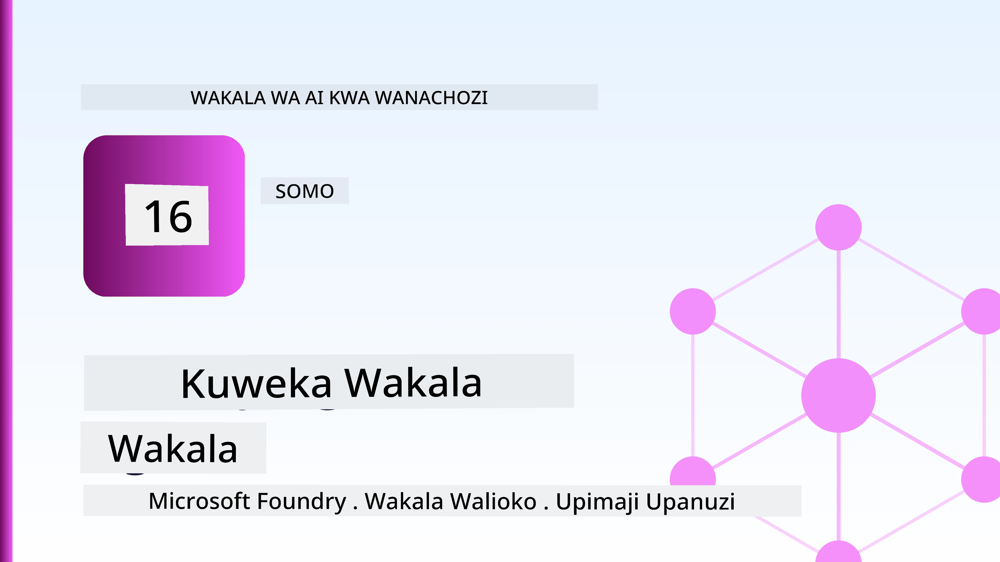
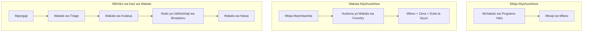
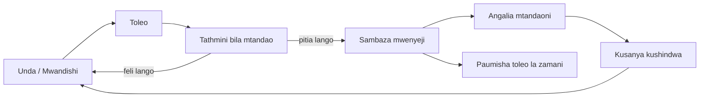
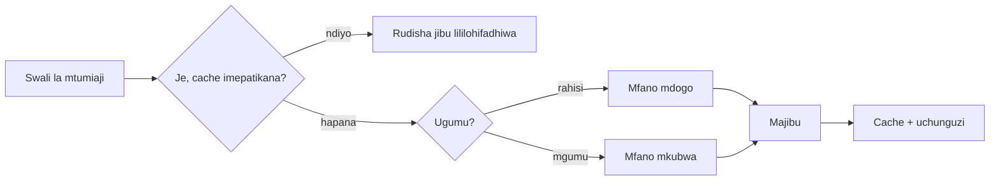
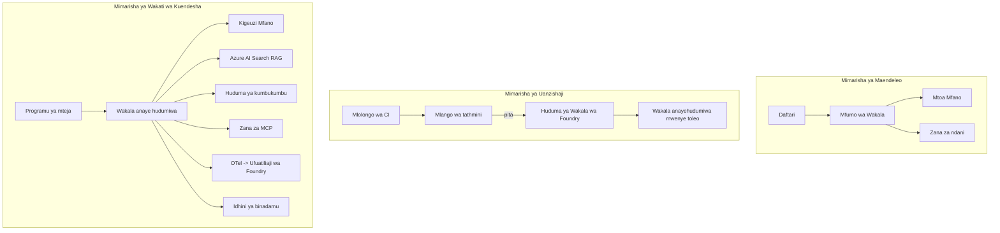

# Kuweka Wakala Zinazoweza Kupanuliwa kwa Microsoft Foundry



Mpaka hatua hii katika kozi umejenga mawakala wanaofanya kazi kwenye kompyuta yako ya mkononi, ndani ya daftari, ikiwaendeshwa na `az login` na baadhi ya mabadiliko ya mazingira. Hiyo ndiyo njia sahihi ya kujifunza. Siyo njia sahihi ya kuendesha wakala ambaye maelfu ya wateja wanategemea saa 3 asubuhi.

Somo hili linahusu pengo kati ya "inatumika kwenye mashine yangu" na "inatumika, kwa kuaminika na kwa gharama nafuu, katika uzalishaji." Tunaziba pengo hilo kwa kutumia **Microsoft Foundry** na **Huduma ya Wakala ya Microsoft Foundry**, na tunafanya hivyo kwa kujenga wakala halisi wa msaada kwa wateja ambao ana zana, upataji, kumbukumbu, tathmini, na ufuatiliaji.

## Utangulizi

Somo hili litajumuisha:

- Tofauti kati ya **wakala wa majaribio** na **wakala aliyewekwa**, na kwa nini mabadiliko haya mengi yanahusu vitu vyote *kuzunguka* mfano.
- **Mifumo ya usambazaji** kwa mawakala: mwenyeji wa mteja, mwenyeji wa huduma (Wakala Walioandaliwa), na usimamiaji wa mtiririko wa kazi.
- **Mzunguko wa maisha wa wakala** kwenye Microsoft Foundry — unda, toleo, weka, tathmini, angalia, acha matumizi.
- **Mikakati ya kupanua**: uratibu wa mfano, kuhifadhi data, ulinganifu, na muundo usio na hali.
- **Ufuatiliaji wa hali ya vitu** kwa kutumia OpenTelemetry na ufuatiliaji wa Foundry.
- **Kuboresha gharama** kupitia uteuzi wa mfano, uratibu, na milango ya tathmini.
- **Mambo ya uzalishaji**: utawala, idhini ya binadamu, na kuendesha seva za MCP kwa usalama katika uzalishaji.

## Malengo ya Kujifunza

Baada ya kumaliza somo hili, utajua jinsi ya:

- Kuchagua mfumo sahihi wa usambazaji kwa kazi fulani ya wakala.
- Kusambaza wakala kwa Huduma ya Wakala ya Microsoft Foundry ili iwe na toleo, udhibiti, na ufuatiliaji.
- Kuweka wakala kwa ajili ya ufuatiliaji na kuunganisha mtiririko wa tathmini unaoendeshwa kabla ya kila toleo.
- Kutumia uratibu wa mfano na kuhifadhi data kudhibiti ucheleweshaji na gharama kwa kiwango kikubwa.
- Kuongeza mlango wa idhini ya binadamu kwa vitendo vya hatari kubwa na kuingiza seva ya MCP kwa usalama wa uzalishaji.

## Mahitaji ya Awali

Somo hili linadhani umefanya masomo ya awali na uko katika hali nzuri na:

- Kujenga mawakala kwa kutumia [Microsoft Agent Framework](../14-microsoft-agent-framework/README.md) (Somo la 14).
- [Matumizi ya Zana](../04-tool-use/README.md) (Somo la 4) na [Agentic RAG](../05-agentic-rag/README.md) (Somo la 5).
- [Kumbukumbu ya Wakala](../13-agent-memory/README.md) (Somo la 13) na [Agentic Protocols / MCP](../11-agentic-protocols/README.md) (Somo la 11).
- [Ufuatiliaji na Tathmini](../10-ai-agents-production/README.md) (Somo la 10) — somo hili linajenga moja kwa moja juu yake.

Pia utahitaji:

- **Usajili wa Azure** na **mradi wa Microsoft Foundry** wenye angalau mfano mmoja wa mazungumzo uliowekwa.
- Azure CLI ikithibitishwa (`az login`).
- Python 3.12+ na vifurushi kwenye hazina [`requirements.txt`](../../../requirements.txt).

## Kutoka Mradi wa Kuanza hadi Uzalishaji: Nini Kinabadilika Kwa Vkubwa

Wakala wa majaribio na wakala wa uzalishaji wanashiriki mzunguko msingi mmoja — kufikiria, kuitisha zana, kujibu. Kinachobadilika ni kila kitu kilicho ndani ya mzunguko huo. Mfano unaweza kuwa asilimia 20% ya wakala wa uzalishaji; asilimia 80% ni mifumo ya uendeshaji.

| Mambo | Mradi wa Kuanza | Uzalishaji |
| --- | --- | --- |
| **Uwezeshaji** | Hufanya kazi katika daftari lako | Huendesha kama huduma iliyohudumiwa, ina matoleo na inaenezwa |
| **Utambulisho** | Tokeni yako ya `az login` | Utambulisho ulioendeshwa na RBAC, na nafasi maalum |
| **Hali** | Kumbukumbu ya ndani, hupotea baada ya kuwasha upya | Hifadhiwa nje (hifadhi ya nyuzi, huduma ya kumbukumbu) |
| **Kushindwa** | Unaona fujo | Jaribu tena, mbadala, barua ya kifo, onyo |
| **Gharama** | "Ni senti chache" | Imetorwa kwa kila ombi, kuratibiwa, kuhifadhiwa, na bajeti |
| **Ubora** | Unaangalia matokeo mwenyewe | Huthaminiwa moja kwa moja kabla ya kila toleo |
| **Imani** | Unaruhusu kila hatua | Sera + binadamu katika mzunguko kwa vitendo hatari |

Kumbuka jedwali hili. Kila sehemu hapa chini inaendana na moja ya mistari hii.

## Mifumo ya Usambazaji wa Wakala

Kuna mifumo mitatu utakayotumia, mara nyingi kwa pamoja.

### 1. Wakala Waliohifadhiwa kwa Mteja

Kitu cha wakala kiko ndani ya mchakato wa programu yako *yako*. Msimbo wako unaita mtoa mfano moja kwa moja; mzunguko wa kufikiria unaendeshwa katika huduma yako. Hili ndilo lililotumiwa katika masomo yote yaliyopita.

- **Tumia pale** unahitaji udhibiti kamili juu ya mzunguko, middleware maalum, au unajumuisha wakala ndani ya backend iliyopo.
- **Hasara**: umiliki wa kupanua, hali na uvumilivu ni wako mwenyewe.

### 2. Wakala Waliopatikana Huduma (Huduma ya Wakala ya Foundry)

Wakala amesajiliwa kama rasilimali katika Microsoft Foundry. Foundry huhifadhi mzunguko wa kufikiria, kuhifadhi nyuzi, kutekeleza usalama wa maudhui na RBAC, na kuonyesha wakala katika lango la Foundry. Programu yako inakuwa mteja mnyepesi anayeunda nyuzi na kusoma majibu.

- **Tumia pale** unapotaka udumu, ufuatiliaji uliotengenezwa, utawala, na eneo dogo la uendeshaji.
- **Hasara**: udhibiti mdogo wa ngazi ya chini kwa kubadilishana na wakati wa utekelezaji uliodhibitiwa.

### 3. Mitiririko ya Kazi ya Wakala

Wakala wengi (na zana) huunganishwa katika grafu yenye mtiririko maalum wa udhibiti — hatua mfululizo, matawi, nodi za idhini ya binadamu, na alama za kudumu zinazoweza kusitishwa na kuendelea. Hii ni uwezo wa **Mitiririko ya Kazi** wa Microsoft Agent Framework ulio tumika kwa kiwango cha usambazaji.

- **Tumia pale** kazi moja inapo husisha mawakala maalum kadhaa au inahitaji hatua ya idhini katikati.
- **Hasara**: sehemu nyingi zinazohamia; zinahitaji ufuatiliaji wa ngazi ya usimamizi.



## Mzunguko wa Maisha wa Wakala kwenye Microsoft Foundry

Kuweka wakala sio `push` ya mara moja. Ni mzunguko, na unaonekana kama mzunguko wa toleo la programu kwa sababu ndiyo hasa ulivyo.



Wazo kuu, lililochukuliwa kutoka [Somo la 10](../10-ai-agents-production/README.md): **tathmini isiyo mtandao ni mlango, si kitu cha kuzingatia baadae.** Toleo jipya la wakala halitolewi isipokuwa litapita vizingiti vyako vya tathmini. Ufuatiliaji mtandaoni kisha huleta makosa halisi ya dunia kwenye seti yako ya majaribio isiyo mtandao. Hiyo ndiyo mzunguko mzima.

## Mikakati ya Kupanua

Kupanua wakala ni tofauti na kupanua API ya wavuti isiyo na hali, kwa sababu kila ombi linaweza kusababisha simu nyingi za mfano na zana ghali. Mbinu nne hutumia mzigo mwingi zaidi.

**Kushughulikia ombi bila kuhifadhi hali.** Usihifadhi hali ya kila mtumiaji ndani ya kumbukumbu yako ya mchakato. Hifadhi nyuzi za mazungumzo kwenye hazina ya nyuzi ya Foundry au huduma ya kumbukumbu ili nakala yoyote iweze kushughulikia ombi lolote. Hii ndiyo inakuwezesha kupanua kwa usawa — ongeza nakala, hakuna vikao vyenye kushikiliwa.

**Uratibu wa mfano.** Si kila ombi linahitaji mfano unaoweza zaidi (na ghali zaidi). Panga maombi rahisi — utambuzi wa nia, majibu mafupi ya kweli — kwa mfano mdogo na haraka, na uhifadhi mfano mkubwa kwa kufikiria halisi. **Model Router** wa Foundry anaweza kufanya hii kwako, au unaweza kutekeleza mtengenezaji mwepesi mwenyewe. Utajenga toleo la DIY kwenye maabara.

**Kuhifadhi majibu.** Maswali mengi ya msaada ni karibu-dupliketi ("ninawezaje kuweka upya nenosiri langu?"). Hifadhi majibu kwa maswali ya kawaida na uyatumikie bila kugonga mfano kabisa. Hata kiwango kidogo cha mafanikio ya kuhifadhi hupunguza gharama na ucheleweshaji kwa maana.

**Msimamo wa wakati mmoja na msukumo wa nyuma.** Watoa mfano wana mipaka ya kiwango cha maombi. Zuia msimamo wako wa wakati mmoja, tumia jaribio tena na msukumo wa nyuma wa kihesabu, na kushindwa kwa upole (jibu lililo katika foleni "tunafanya kazi" linashinda kosa 500).



## Ufuatiliaji katika Uzalishaji

Huwezi kuendesha kile usichoweza kuona. Kama ilivyoshughulikiwa katika Somo la 10, Microsoft Agent Framework hutuma **OpenTelemetry** traces kiasili — kila simu ya mfano, matumizi ya zana, na hatua ya usimamizi hutokea. Katika uzalishaji unasafirisha traces hizo kwa Microsoft Foundry (au backend yeyote unaoendana na OTel) ili uweze:

- Kufuatilia malalamiko moja la mteja kutoka mwanzo hadi mwisho kupitia kila simu ya mfano na zana.
- Kutazama ucheleweshaji wa p50/p95 na gharama kwa kila ombi kwa muda.
- Kutoa tahadhari juu ya mlipuko wa kiwango cha makosa na utata wa gharama kabla ya watumiaji wako (au timu yako ya fedha) kujua.

```python
from agent_framework.observability import get_tracer

tracer = get_tracer()

with tracer.start_as_current_span("support_request") as span:
    span.set_attribute("customer.tier", "enterprise")
    span.set_attribute("routed.model", "gpt-5-nano")
    # utekelezaji wa wakala unafuatiliwa kiotomatiki ndani ya kipindi hiki
```

Sifa kama `customer.tier` na `routed.model` ndizo zinazofanya msingi wa traces kuwa maswali yanayoweza kujibiwa ("je, wateja wa kampuni wanapelekwa mara nyingi kwa mfano mdogo?").

## Kuboresha Gharama

Gharama katika mawakala wa uzalishaji hutegemea sana tokensi. Mikono mitatu, kwa kuzingatia athari:

1. **Pima na chagua mfano unaofaa.** Mfano mdogo unaopita mlango wako wa tathmini karibu daima ni rahisi zaidi kuliko mfano mkubwa pia unaopita. Tumia tathmini kuthibitisha mfano mdogo ni mzuri badala ya kuchagua kubwa kwa tahadhari.
2. **Panga kulingana na ugumu.** Kama ilivyo hapo juu — lipa bei ya mfano mkubwa kwa maombi yanayohitaji kufikiri kwa mfano mkubwa.
3. **Hifadhi kwa nguvu.** Simu ya mfano ya gharama nafuu ni ile usiyofanya kamwe.

Milango ya tathmini na udhibiti wa gharama ni nidhamu sawa inayoangaliwa kwa pembe mbili: tathmini inakuambia *sakafu ya ubora*, uratibu na kuhifadhi data vinakuweka karibu na *gharama* ya sakafu hiyo iwezekanavyo.

## Mambo ya Kuzingatia Katika Uwekaji kwa Kampuni

**Utawala.** Wakala Waliopatikana hudumu na RBAC ya Foundry, usalama wa maudhui, na kumbukumbu ya ukaguzi. Mpa kila wakala utambulisho uliosimamiwa na udhibiti mdogo anahitaji — akses ya kusoma tu kwenye hifadhidata ya maarifa, akses iliyopangwa kwenye API ya tiketi, hakuna zaidi.

**Binadamu katika mzunguko.** Baadhi ya vitendo ni muhimu mno kuendeshwa moja kwa moja — kutoa marejesho, kufuta akaunti, kumpeleka timu ya kisheria. Microsoft Agent Framework inaunga mkono zana zinazohitaji **idhini**: wakala hupendekeza hatua, utekelezaji unasimama, binadamu anathibitisha au kukataa, na mtiririko wa kazi unaendelea. Umeona primitive hii katika [Somo la 6](../06-building-trustworthy-agents/README.md); hapa unaitekeleza.

**MCP katika uzalishaji.** [MCP](../11-agentic-protocols/README.md) huruhusu wakala wako kutumia zana za nje kupitia kiolesura cha kawaida. Katika uzalishaji, chukulia seva ya MCP kama mpaka usio na uaminifu: weka toleo la seva, iendeshe kwa utambulisho wa kikomo, hakiki matokeo yake, na usimwonyeshe siri. Seva ya MCP ni tegemezi, na tegemezi hupata matengenezo, ukaguzi, na mipaka ya kiwango.



Mchoro huo mitatu — maendeleo, usambazaji, wakati wa utekelezaji — ni wakala mmoja katika hatua tatu za maisha yake. Maabara inayofuata itakuongoza kujenga hicho.

## Maabara ya Vitendo: Wakala wa Msaada kwa Wateja Tayari kwa Uzalishaji

Fungua [`code_samples/16-python-agent-framework.ipynb`](./code_samples/16-python-agent-framework.ipynb) na fanya kazi kutoka mwanzo hadi mwisho. Utajenga **wakala wa msaada wa mteja wa Contoso** na kila jambo la uzalishaji limeunganishwa:

1. **Kuitisha zana** — angalia hali ya oda na fungua tiketi za msaada.
2. **RAG** — jibu maswali ya sera kutoka hifadhidata ya maarifa (Azure AI Search, na mbadala wa kumbukumbu ndani ya daftari ili kuendesha bila rasilimali ya Search).
3. **Kumbukumbu** — kumbuka mteja kupitia mzunguko wa mazungumzo.
4. **Uratibu wa mfano** — mtengenezaji wa ugumu hupeleka kila ombi kwa mfano mdogo au mkubwa.
5. **Kuhifadhi majibu** — maswali yanayojirudia hutumikia kutoka kwa cache.
6. **Idhini ya binadamu** — marejesho ya kiwango cha juu yanasukumwa kusubiri idhini ya binadamu.
7. **Mtiririko wa tathmini** — seti ndogo ya majaribio isiyo mtandao inatoa alama kwa wakala na hutumika kama mlango wa toleo.
8. **Ufuatiliaji** — OpenTelemetry inafuatilia kila ombi.

### Maelekezo ya Kukimbia

Daftari limepangwa ili kila jambo la uzalishaji liwe sehemu huru, inayoweza kuendeshwa. Msingi wake ni mtekelezaji wa ombi wa uratibu-na-kuhifadhi:

```python
async def handle_support_request(query: str, customer_id: str) -> str:
    # 1. Tumikia kutoka kwenye cache tunapoweza.
    cached = response_cache.get(normalize(query))
    if cached:
        return cached

    # 2. Panga kwa ugumu kudhibiti gharama.
    model = "gpt-5-nano" if is_simple(query) else "gpt-5-mini"

    # 3. Endesha wakala ndani ya mfululizo wa ufuatiliaji kwa ajili ya ufuatiliaji.
    with tracer.start_as_current_span("support_request") as span:
        span.set_attribute("routed.model", model)
        span.set_attribute("customer.id", customer_id)
        response = await support_agent.run(query, model=model)

    # 4. Hifadhi kwenye cache na rudisha.
    response_cache.set(normalize(query), response.text)
    return response.text
```

Mlango wa tathmini unaolinda toleo unaonekana hivi:

```python
async def evaluation_gate(agent, test_cases, threshold: float = 0.8) -> bool:
    passed = 0
    for case in test_cases:
        result = await agent.run(case["input"])
        if score_response(result.text, case["expected"]) >= 0.8:
            passed += 1
    pass_rate = passed / len(test_cases)
    print(f"Evaluation pass rate: {pass_rate:.0%} (gate: {threshold:.0%})")
    return pass_rate >= threshold  # tuma tu ikiwa lango litapita
```

Soma kila mstari — daftari huweka vifaa vidogo kwa makusudi ili hakuna kitu kufichwa nyuma ya wito wa mfumo.

## Kuthibitisha Wakala Aliyowekwa kwa Vipimo vya Moshi

Mlango wa tathmini hapo juu unaendesha *offline* dhidi ya kitu chako cha wakala. Mara baada ya wakala kuwekwa kama Wakala Aliyehudumiwa, unahitaji kadi moja zaidi, hata ya gharama nafuu: **je, mwisho wa kuweka unajibu kweli?**

Kuweka "kwa mafanikio" kunathibitisha tu ndege ya udhibiti ilikubali ufafanuzi — haimaanishi wakala anajibu. Tegemezi iliyokosekana, uratibu mbaya wa mfano, au muunganisho uliokoma kunaweza kuacha usambazaji wenye rangi ya kijani usiorudisha chochote. **Kipimo cha moshi** hukamata hayo kwa sekunde, kila usambazaji, bila gharama ya tathmini kamili.

Hazina hii inaletwa na mtiririko wa kipimo cha moshi tayari kutumia unaojengwa juu ya [AI Smoke Test](https://github.com/marketplace/actions/ai-smoke-test) GitHub Action:

- **Katalogi** — [`tests/lesson-16-smoke-tests.json`](../../../tests/lesson-16-smoke-tests.json) ina maelekezo na uthibitisho wa wakala wa msaada wa Contoso (majibu ya sera zilizo thabiti, utafutaji wa oda, kubaki kwenye mada, na muendelezo wa nyuzi mara nyingi). Katalogi za mawakala wa masomo mengine ziko karibu nayo — ona [`tests/README.md`](../tests/README.md).
- **Mtiririko wa kazi** — [`.github/workflows/smoke-test.yml`](../../../.github/workflows/smoke-test.yml) unaingia kwa Azure OIDC na POST kila ombi kwa sehemu ya Majibu ya wakala, ukikataa kazi kwa upotevu wowote wa uthibitisho.

```yaml
- name: Smoke-test hosted agent
  uses: JFolberth/ai-smoketest@v1
  with:
    project_endpoint: ${{ inputs.project_endpoint }}
    agent_name: ContosoSupportAgent
    tests_file: tests/lesson-16-smoke-tests.json
```


Endesha kutoka kwenye kichupo cha **Actions** mara wakala wako atakapowekwa, ukitoa kiungo cha mradi wako wa Foundry na jina la wakala. Kitambulisho cha mshikamano kinahitaji jukumu la **Azure AI User** katika wigo wa mradi wa Foundry. Fikiria tabaka kama piramidi: vipimo vya moshi (inapatikana na inajibu?) vinaendeshwa kila mara ya kuweka, tathmini ya mbali (je, ni nzuri vya kutosha kusafirisha?) inaendeshwa kabla ya kupandishwa hadhi, na tathmini ya mtandaoni (inafanya kazi vipi kazini?) inaendeshwa kwa kuendelea.

## Ukaguzi wa Maarifa

Jaribu uelewa wako kabla ya kwenda kwenye kazi.

**1. Takriban kiasi gani cha wakala wa uzalishaji ni "mfano," na nini kinabaki?**

<details>
<summary>Jibu</summary>

Mfano ni sehemu ndogo ya mfumo — mara nyingi hurekebishwa kama takriban 20%. Sehemu inayobaki ni mfupa wa uendeshaji: kuhesabu mwenyeji na matoleo, kitambulisho na RBAC, hali iliyotolewa nje, kushughulikia kushindwa, kufuatilia gharama, tathmini, na udhibiti wa mwanadamu ndani ya mizunguko. Kuingia uzalishaji ni hasa kuhusu kujenga kila kitu *kuzunguka* mzunguko wa hoja.
</details>

**2. Ni lini ungechagua Wakala Aliyehifadhiwa Kuliko wakala anayeendesha kwa mteja?**

<details>
<summary>Jibu</summary>

Wakati unataka wakati wa kukimbia ulioandaliwa na uthabiti uliojengwa ndani (mishipuli inayodumu na inaweza kuendelea), ufuatiliaji, usalama wa maudhui, na RBAC, na uko tayari kubadilishana udhibiti mdogo wa mzunguko wa hoja kwa eneo dogo la uendeshaji. Wakala anayeendesha kwa mteja ni bora wakati unahitaji udhibiti kamili wa mzunguko au unachukua wakala ndani ya backend iliyopo.
</details>

**3. Kwa nini wakala aliye na uwezo wa kupanuka lazima awe bila hali katika kumbukumbu ya mchakato wake?**

<details>
<summary>Jibu</summary>

Hivyo mfano wowote unaweza kushughulikia ombi lolote, ambalo ndilo linavyowezesha upanuzi wa usawa bila vikao vya kushikamana. Hali ya mazungumzo kwa mtumiaji imepelekwa kwenye duka la mishipuli au huduma ya kumbukumbu. Ikiwa hali ingeishi katika kumbukumbu ya mchakato, ungetapoteza baada ya kuanzisha upya na hungeweza kugawa mzigo kwa uhuru.
</details>

**4. Ndio nini tatizo linalotatuliwa na uelekezaji wa mfano, na lina uhusiano gani na tathmini?**

<details>
<summary>Jibu</summary>

Uelekezaji hutuma maombi rahisi kwa mfano mdogo, wa bei nafuu, na wa haraka na kuhifadhi mfano mkubwa kwa hoja halisi, kudhibiti latensi na gharama. Inahusiana na tathmini kwa sababu tathmini ndio *inayoonyesha* kuwa mfano mdogo ni mzuri vya kutosha kwa darasa la maombi — uelekezaji bila tathmini ni kudhania.
</details>

**5. Ni nini "lango la tathmini" na lipo wapi katika mzunguko wa maisha?**

<details>
<summary>Jibu</summary>

Lango la tathmini linaendesha seti ya majaribio ya mbali dhidi ya toleo jipya la wakala na linazuia kuwekwa isipokuwa kiwango cha kupita kimoshi kikikamilika. Lipo kati ya "toleo" na "uwekaji" katika mzunguko wa maisha, likifanya ubora kuwa sharti la kuachiliwa badala ya kitu unachokagua baada ya kusafirisha.
</details>

**6. Kwa nini seva ya MCP inapaswa kutendewa kama mpaka usioaminiwa katika uzalishaji?**

<details>
<summary>Jibu</summary>

Kwa sababu ni utegemezi wa nje ambao wakala wako huuita. Unapaswa kufunga toleo lake, kuendesha kwa kitambulisho kilichobainishwa, kuthibitisha matokeo yake, kuweka mipaka ya kiwango, na kamwe usifunue siri zake — nidhamu ile ile unayotumia kwa utegemezi wowote wa mtu wa tatu. Matokeo yake huingia katika hoja za wakala, hivyo uaminifu usiothibitishwa ni hatari ya usalama.
</details>

**7. Ni mabadiliko gani moja mara nyingi yana athari kubwa kwenye gharama ya wakala wa uzalishaji, na kwa nini?**

<details>
<summary>Jibu</summary>

Kuweka mfano kwa saizi sahihi — kutumia mfano mdogo zaidi unaopitisha lango lako la tathmini. Gharama inatawala na tokens, na mfano mdogo unaokidhi kiwango cha ubora karibu kila mara ni wa bei nafuu zaidi kuliko mkubwa. Uhifadhi na uelekezaji kisha hupunguza gharama zaidi, lakini kuchagua mfano sahihi wa msingi kuna athari kubwa ya muktadha wa kwanza.
</details>

**8. Kipi jukumu la sifa za span kama `customer.tier` na `routed.model` katika ufuatiliaji?**

<details>
<summary>Jibu</summary>

Zinageuza mrejeleo usioandaliwa kuwa maswali ya kibiashara yanayojibiwa. Bila sifa unakuwa na ukuta wa spans; nazo unaweza kuuliza "je, wateja wa makampuni wanaelekezwa kwa mfano mdogo mara nyingi sana?" au "mfano gani unashughulikia maombi yetu yaliyo polepole zaidi?" Sifa ni jinsi unavyogawanya telemetry kwa vipimo vinavyohusika na uendeshaji wako.
</details>

## Kazi

Chukua wakala wa usaidizi wa wateja kutoka maabara na uuthibitishe kwa hali maalum: **wakala wa usaidizi wa malipo ya usajili kwa kampuni ya SaaS.**

Uwasilishaji wako unapaswa:

1. **Badilisha zana** kwa zile zinazohusiana na malipo: `get_subscription_status`, `get_invoice`, na `issue_credit` (mikopo juu ya $50 inahitaji idhini ya mwanadamu).
2. **Ongeza hati tatu za RAG** zinazoelezea sera ya marejesho ya kampuni, mzunguko wa malipo, na sera ya kuacha.
3. **Panua seti ya tathmini** hadi angalau kesi nane, ikiwa ni pamoja na angalau mbili ambazo *zinapaswa* kuanzisha njia ya idhini ya mwanadamu, na thibitisha lango lako la tathmini linapita au kushindwa kwa usahihi.
4. **Ongeza ripoti moja ya gharama**: baada ya kuendesha maswali kumi mchanganyiko kupitia wakala, chapisha ni ngapi zilikwenda kwa mfano mdogo, ni ngapi kwa mfano mkubwa, na ni ngapi zilitumiwa kutoka ghala.

Andika aya fupi (katika kisanduku cha markdown) ikieleza sheria ya uelekezaji wa mfano uliyochagua na jinsi utakavyothibitisha na trafiki halisi. Hakuna jibu moja sahihi — unathaminiwa juu kama masuala ya uzalishaji yanavunjika vizuri kwa pamoja.

## Muhtasari

Katika somo hili ulihamisha wakala kutoka mfano hadi uzalishaji kwa Microsoft Foundry:

- Mabadiliko hadi uzalishaji ni hasa kuhusu **mfupa wa uendeshaji** unaozunguka mfano — mwenyeji, kitambulisho, hali, kushughulikia kushindwa, gharama, ubora, na uaminifu.
- Ulijifunza **mifumo mitatu ya kuweka** — client-hosted, Wakala Waliohifadhiwa, na Agent Workflows — na lini kila moja inafaa.
- Ulitembea **mzunguko wa maisha wa wakala**, ambapo tathmini ya mbali **inatumika kama lango la kuachilia** na ufuatiliaji wa mtandaoni unasukuma kushindwa kurudi kwenye seti ya majaribio.
- Ulitekeleza **mikakati ya kupanua** — muundo usio na hali, uelekezaji wa mfano, kuhifadhi, na upachikaji wa mipaka — na kuziunganisha na **uboresaji wa gharama**.
- Ulifunga **udhibiti wa makampuni**: RBAC, idhini ya mwanadamu ndani ya mzunguko, na ushirikiano salama wa MCP kwa uzalishaji.
- Ulijenga **wakala wa usaidizi wa wateja tayari kwa uzalishaji** unaounganisha kila moja ya masuala haya katika msimbo unaoweza kuendeshwa.

Somo lijalo linaleta njia kinyume: badala ya kupanua mawakala kwenda wingu, utaibeba *chini* kwenye mashine moja ya msanidi na kuendesha kabisa kwa ndani.

## Rasilimali Zaidi

- <a href="https://learn.microsoft.com/azure/ai-foundry/what-is-azure-ai-foundry" target="_blank">Nyaraka za Microsoft Foundry</a>
- <a href="https://learn.microsoft.com/azure/ai-foundry/agents/overview" target="_blank">Muhtasari wa Huduma ya Wakala wa Microsoft Foundry</a>
- <a href="https://learn.microsoft.com/en-us/agent-framework/overview/?wt.mc_id=youtube_26688_organicsocial_reactor&pivots=programming-language-python" target="_blank">Mfumo wa Wakala wa Microsoft</a>
- <a href="https://learn.microsoft.com/azure/ai-foundry/concepts/model-router" target="_blank">Mzee wa Mfano katika Microsoft Foundry</a>
- <a href="https://learn.microsoft.com/azure/search/search-what-is-azure-search" target="_blank">Azure AI Search</a>
- <a href="https://opentelemetry.io/" target="_blank">OpenTelemetry</a>
- <a href="https://github.com/marketplace/actions/ai-smoke-test" target="_blank">Kazi ya AI Smoke Test ya GitHub</a>
- <a href="https://modelcontextprotocol.io/" target="_blank">Itifaki ya Muktadha wa Mfano (MCP)</a>

## Somo lililotangulia

[Kujenga Mawakala wa Matumizi ya Kompyuta (CUA)](../15-browser-use/README.md)

## Somo linalofuata

[Kuumba Mawakala wa AI wa Ndani](../17-creating-local-ai-agents/README.md)

---

<!-- CO-OP TRANSLATOR DISCLAIMER START -->
**Kionyozo**:
Hati hii imetafsiriwa kwa kutumia huduma ya tafsiri ya AI [Co-op Translator](https://github.com/Azure/co-op-translator). Ingawa tunajitahidi kupata usahihi, tafadhali fahamu kwamba tafsiri za kiotomatiki zinaweza kuwa na makosa au upungufu wa usahihi. Hati ya asili katika lugha yake halisi inapaswa kuchukuliwa kama chanzo cha mamlaka. Kwa taarifa muhimu, tafsiri ya kitaalamu inayofanywa na binadamu inapendekezwa. Hatutojibu kwa kuelewa vibaya au tafsiri potofu zinazotokea kutokana na matumizi ya tafsiri hii.
<!-- CO-OP TRANSLATOR DISCLAIMER END -->