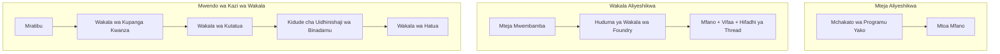
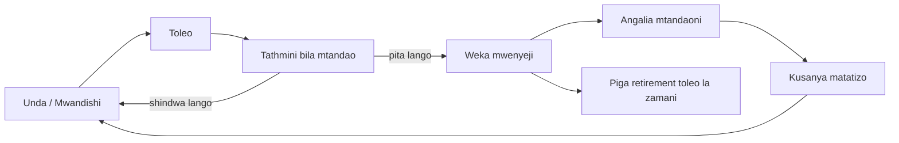
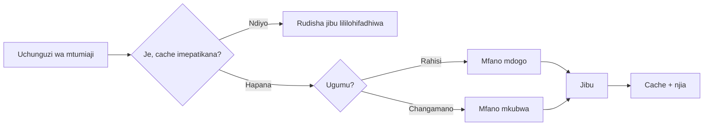
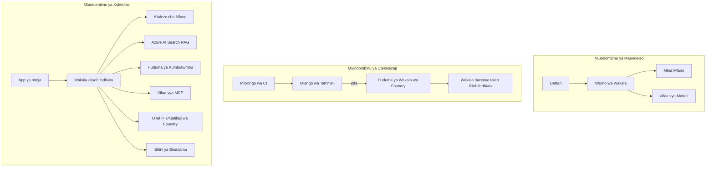

# Kutumia Wakala Wanaoweza Kupanuka na Microsoft Foundry


Hadi hatua hii katika kozi, umejenga mawakala wanaotumia kompyuta yako kibao, ndani ya daftari (notebook), wakiongozwa na `az login` na vigezo vya mazingira vichache. Hiyo ndiyo njia sahihi kabisa ya kujifunza. Siyo njia sahihi ya kuendesha wakala wa mteja elfu nyingi anategemea saa 3 asubuhi.

Somo hili linahusu pengo kati ya "inafanya kazi kwenye mashine yangu" na "inafanya kazi, kwa kuaminika na kwa gharama nafuu, katika uzalishaji." Tunafunga pengo hilo kwa kutumia **Microsoft Foundry** na **Huduma ya Wakala wa Microsoft Foundry**, na tunafanya hivyo kwa kujenga wakala halisi wa msaada wa wateja anaaye na zana, upokeaji, kumbukumbu, tathmini, na ufuatiliaji.

## Utangulizi

Somo hili litashughulikia:

- Tofauti kati ya **wakala wa mfano (prototype)** na **wakala aliyeachiliwa (deployed agent)**, na kwa nini mabadiliko haya ni zaidi kuhusu kila kitu kinachozunguka *mfano*.
- **Mifumo ya usambazaji** kwa mawakala: mteja mwenyeji, huduma mwenyeji (Hosted Agents), na utekelezaji wa mchakato wa kazi.
- **Mzunguko wa maisha wa wakala** kwenye Microsoft Foundry — tengeneza, toa toleo, sambaza, tathmini, tazama, chukua hatua.
- **Mikakati ya kupanua**: usambazaji wa mfano, kuhifadhi kwenye zamani, ufanisi wa kazi nyingi sambamba, na muundo usio na hali.
- **Ufuatiliaji** kwa kutumia OpenTelemetry na ufuatiliaji wa Foundry.
- **Uboreshaji wa gharama** kupitia uchaguzi wa mfano, usambazaji, na milango ya tathmini.
- **Masuala ya shirika**: udhibiti, idhini ya binadamu, na kuendesha seva za MCP kwa usalama katika uzalishaji.

## Malengo ya Kujifunza

Baada ya kumaliza somo hili, utajua jinsi ya:

- Kuchagua mfumo sahihi wa usambazaji kwa mzigo kazi wa wakala fulani.
- Kusambaza wakala kwa Huduma ya Wakala wa Microsoft Foundry ili uasilishe matoleo, udhibiti, na ufuatiliaji.
- Kufunga kielelezo kwa wakala kwa ajili ya ufuatiliaji na kuunganisha mchakato wa tathmini unaofanyika kabla ya kutolewa kila mara.
- Kutumia usambazaji na kuhifadhi kwa zamani kudhibiti ucheleweshaji na gharama katika kiwango kikubwa.
- Kuongeza mlango wa idhini ya binadamu kwa vitendo vyenye hatari kubwa na kuunganisha seva ya MCP kwa njia salama ya uzalishaji.

## Mahitaji Kabla ya Kuanzia

Somo hili linadhani umefanya masomo ya awali na uko na uelewa kuhusu:

- Kujenga mawakala kwa kutumia [Microsoft Agent Framework](../14-microsoft-agent-framework/README.md) (Somo la 14).
- [Matumizi ya Zana](../04-tool-use/README.md) (Somo la 4) na [Agentic RAG](../05-agentic-rag/README.md) (Somo la 5).
- [Kumbukumbu ya Wakala](../13-agent-memory/README.md) (Somo la 13) na [Agentic Protocols / MCP](../11-agentic-protocols/README.md) (Somo la 11).
- [Ufuatiliaji na Tathmini](../10-ai-agents-production/README.md) (Somo la 10) — somo hili linaendelea moja kwa moja juu yake.

Pia utahitaji:

- **Usajili wa Azure** na **mradi wa Microsoft Foundry** uliokoa angalau mfano mmoja wa mazungumzo uliotolewa.
- Microsoft Azure CLI yenye uthibitishaji (`az login`).
- Python 3.12+ na mafaili ya maktaba yaliyo kwenye hifadhidata [`requirements.txt`](../../../requirements.txt).

## Kutoka Katika Mfano Hadi Uzalishaji: Mabadiliko Halisi

Wakala wa mfano na wakala wa uzalishaji wanashiriki miganhu kuu — kufikiri, kuitisha zana, kujibu. Kinachobadilika ni kila kitu kilichozunguka mzunguko huo. Mfano ni takriban 20% ya wakala wa uzalishaji; asilimia 80 ni mwili wa uendeshaji.

| Hitilafu | Mfano | Uzalishaji |
| --- | --- | --- |
| **Ukaribu (Hosting)** | Inakwenda kwenye daftari lako | Inakwenda kama huduma ya mwenyeji, ina matoleo na inatolewa kidogo kidogo |
| **Utambulisho** | Tokeni yako ya `az login` | Utambulisho uliodhibitiwa na RBAC iliyopangwa |
| **Hali** | Kumbukumbu ndani ya kumbukumbu ya programu, hupotea baada ya kuanzishwa upya | Hifadhiwa nje (hifadhi za thread, huduma za kumbukumbu) |
| **Kushindwa** | Unaona kurudi nyuma kwa makosa | Jaribu tena, njia mbadala, barua ya kufa, onyo |
| **Gharama** | "Ni senti chache" | Inafuatiliwa kwa kila ombi, inachangiliwa, kuhifadhiwa kwenye bajeti |
| **Ubora** | Unaangalia matokeo | Inapimwa moja kwa moja kabla ya kutolewa |
| **Imani** | Unaruhusu kila kitendo | Sera + binadamu katika mzunguko kwa vitendo vyenye hatari |

Hifadhi jedwali hili akilini. Kila sehemu iliyopo chini inaendana na moja ya safu hizi.

## Mifumo ya Usambazaji wa Wakala

Kuna mifumo mitatu utakayotumia, mara nyingi kwa pamoja.

### 1. Mawakala Wenyeji wa Mteja

Kitu cha wakala kiko ndani ya mchakato wa programu yako. Nambari yako inatuma ombi moja kwa moja kwa mlengo wa mfano; mzunguko wa kufikiri unafanywa katika huduma yako. Hii ndio kila somo lililopita lililofanya.

- **Tumia hili wakati** unahitaji udhibiti kamili juu ya mzunguko, katikati ya programu maalum, au unajumuisha wakala ndani ya backend iliyopo.
- **Kizuizi**: unamiliki utendaji wa kupanua, hali, na ustahimilivu mwenyewe.

### 2. Mawakala Wenyeji (Huduma ya Wakala Foundry)

Wakala huandikishwa kama rasilimali kwenye Microsoft Foundry. Foundry inakumbuka mzunguko wa kufikiri, huhifadhi threads, inatekeleza miongozo ya usalama wa maudhui na RBAC, na huufanya wakala kuonekana kwenye lango la Foundry. Programu yako huwa mteja mwembamba anayetoa threads na kusoma majibu.

- **Tumia hili wakati** unataka uimara, ufuatiliaji uliojengewa ndani, udhibiti, na eneo dogo la uendeshaji.
- **Kizuizi**: udhibiti mdogo wa chini wa kiwango kwa kubadilishana na mazingira ya runtime yanayosimamiwa.

### 3. Mchakato wa Kazi wa Wakala

Mawakala wengi (na zana) huunganishwa katika grafu yenye mchakato wa kudhibiti wazi — hatua mlianziliano, matawi, nodi za idhini ya binadamu, na sehemu za kumbukumbu zinazoweza kusitisha na kuendelea. Hii ni uwezo wa Microsoft Agent Framework **Workflows** unaotumika kwa kiwango cha usambazaji.

- **Tumia hili wakati** kazi moja inahusisha mawakala maalum kadhaa au inahitaji hatua ya idhini katikati.
- **Kizuizi**: sehemu nyingi zinazoelea; zinahitaji ufuatiliaji wa ngazi ya utaratibu.



## Mzunguko wa Maisha wa Wakala kwenye Microsoft Foundry

Kusambaza wakala si *push* ya mara moja. Ni mzunguko, na inaonekana sana kama mzunguko wa kutolewa kwa programu maana hiyo ndio hasa.



Wazo kuu, lililotokana na [Somo la 10](../10-ai-agents-production/README.md): **tathmini isiyokuwa mtandaoni ni mlango, si mawazo ya ziada.** Toeneo jipya halitolewi hadi litakapovuka viwango vya tathmini. Ufuatiliaji mtandaoni huhamisha makosa halisi kwenye seti ya majaribio isiyo mtandaoni. Huyo ni mzunguko mzima.

## Mikakati ya Kupanua

Kupanua wakala ni tofauti na kupanua API isiyo na hali, kwa sababu kila ombi linaweza kusababisha miito mingi ya mfano na zana za gharama kubwa. Mbinu nne zinabeba mzigo mkubwa zaidi.

**Usimamizi wa maombi isiyo na hali.** Usihifadhi hali ya mtumiaji katika kumbukumbu ya mchakato wako. Hifadhi mazungumzo kwenye hifadhi ya thread ya Foundry au huduma ya kumbukumbu ili mfano wowote uweze kushughulikia ombi lolote. Hii ndio inayokuwezesha kupanua kwa wima — ongeza mfano, hakuna vikao vilivyofungwa.

**Usambazaji wa mfano.** Siyo kila ombi linahitaji mfano wako wenye uwezo mkubwa (na gharama kubwa). Tuma maombi rahisi — utambuzi wa nia, majibu mafupi ya ukweli — kwa mfano mdogo na haraka, na uhifadhi mfano mkubwa kwa sababu ya kufikiri kweli. **Model Router** ya Foundry inaweza kufanya hili kwako, au unaweza kutekeleza mkeni mwepesi mwenyewe. Utajenga toleo la DIY maabara.

**Kuweka majibu kwenye cache.** Maswali mengi ya msaada ni karibu nakala ("ninawezaje kuweka upya nenosiri langu?"). Hifadhi majibu ya maswali yanayojirudia mara nyingi na uwasilishe bila kugonga mfano kabisa. Hata kiwango kidogo cha hits kwenye cache hupunguza gharama na ucheleweshaji kwa maana.

**Ufanisi wa kazi nyingi na kuzuia msukumo.** Watoa huduma wa mfano wana mipaka ya mzunguko wa maombi. Punguza idadi ya maombi yanayoshughulikiwa kwa wakati mmoja, tumia jaribio tena zenye mbadala za mwinuko, na shindwa kwa hila (jibu la queued "tuko nayo" ni bora kuliko kosa la 500).



## Ufuatiliaji Katika Uzalishaji

Huwezi kuendesha unavyojua, na huwezi kujua usiposoma. Kama ilivyoripotiwa kwenye Somo la 10, Mfumo wa Wakala wa Microsoft hutuma **OpenTelemetry** kwa kawaida — kila wito wa mfano, miito ya zana, na hatua za utaratibu huwa ni muda. Katika uzalishaji unasafirisha vipindi hivyo kwenda Microsoft Foundry (au hosti yoyote inayoungwa mkono OTel) ili uweze:

- Fuata malalamiko la mteja mmoja kutoka mwanzo hadi mwisho kupitia kila wito wa mfano na zana.
- Angalia ucheleweshaji wa p50/p95 na gharama kwa kila ombi kwa muda.
- Taarifu juu ya mlipuko wa makosa na mabadiliko ya gharama kabla ya watumiaji wako (au timu yako ya fedha) kuona.

```python
from agent_framework.observability import get_tracer

tracer = get_tracer()

with tracer.start_as_current_span("support_request") as span:
    span.set_attribute("customer.tier", "enterprise")
    span.set_attribute("routed.model", "gpt-5-nano")
    # utekelezaji wa wakala unafuatiliwa moja kwa moja ndani ya kipindi hiki
```

Sifa kama `customer.tier` na `routed.model` ndizo zinazotafsiri mgawanyiko wa vipindi kuwa maswali yanayojibiwa ("je, wateja wa shirika wanatumwa mara nyingi kwenye mfano mdogo?").

## Uboreshaji wa Gharama

Gharama katika mawakala wa uzalishaji hutawaliwa na tokeni. Zinaweza kudhibitiwa kwa njia tatu, kwa mpangilio wa athari:

1. **Pima mfano kwa saizi sahihi.** Mfano mdogo unaopita mlango wa tathmini kawaida huwa nafuu zaidi kuliko mfano mkubwa pia unaopita. Tumia tathmini kuonyesha *mfano mdogo ni mzuri* badala ya kutumia mfano mkubwa kwa tahadhari.
2. **Tuma kulingana na ugumu.** Kama hapo juu — lipa bei ya mfano mkubwa kwa maombi yanayohitaji mfano mkubwa kuzingatia.
3. **Hifadhi kwa ukali.** Wito wa mfano wa bei nafuu ni ule usiofanywa kamwe.

Milango ya tathmini na udhibiti wa gharama ni maadili sawa yanayoangaliwa kwa pembe mbili: tathmini inakuambia *katika kiwango cha ubora*, usambazaji na kuhifadhi vinakusalia karibu na *gharama* ya kiwango hicho.

## Masuala ya Kupelekwa Kwa Mazingira ya Shirika

**Udhibiti.** Mawakala wenyeji wanarithi RBAC, usalama wa maudhui, na ufuatiliaji wa audit wa Foundry. Mpe kila wakala utambulisho ulio na mipaka midogo tu inayohitajika — ufikivu wa kusoma kwenye hifadhidata, ufikivu wa API ya tiketi, hakuna zaidi.

**Binadamu katika mzunguko.** Vitendo vingine ni muhimu mno kuamilishwa moja kwa moja — kutoa marejesho, kufuta akaunti, kupeleka kwa timu ya sheria. Mfumo wa Wakala wa Microsoft unaunga mkono zana zinazoomba **idhini**: wakala hupendekeza kitendo, utekelezaji unasitishwa, binadamu anaruhusu au anakataa, na mchakato unaendelea. Uliona mfano wake katika [Somo la 6](../06-building-trustworthy-agents/README.md); hapa unautumia.

**MCP katika uzalishaji.** [MCP](../11-agentic-protocols/README.md) huruhusu wakala wako kutumia zana za nje kupitia kiolesura cha kitaalamu. Katika utendaji, chukuliana na kila seva ya MCP kama mpaka usioaminika: futilia toleo la seva, endesha na utambulisho ulio na mipaka, thibitisha matokeo yake, na usiwape siri. Seva ya MCP ni tegemezi, na tegemezi hupatiwa viraka, kufanyiwa ukaguzi, na mipaka ya mzunguko.



Michoro hiyo mitatu — maendeleo, usambazaji, runtime — ni wakala yule yule katika hatua tatu za maisha yake. maabara inayofuata itakuongoza jinsi ya kuijenga.

## Maabara ya Vitendo: Wakala wa Msaada wa Wateja Tayari kwa Uzalishaji

Fungua [`code_samples/16-python-agent-framework.ipynb`](./code_samples/16-python-agent-framework.ipynb) na ifanyie kazi kutoka mwanzo hadi mwisho. Utajenga **wakala wa msaada wa wateja wa Contoso** yenye kila hitilafu za uzalishaji zilizounganishwa:

1. **Kuitisha zana** — angalia hali ya oda na fungua tiketi za msaada.
2. **RAG** — jibu maswali ya sera kutoka kwenye hifadhidata ya maarifa (Azure AI Search, na kengele ya kumbukumbu ya ndani ili daftari lifanye kazi bila rasilimali ya Search).
3. **Kumbukumbu** — kumbuka mteja katika mizunguko ya mazungumzo.
4. **Usambazaji wa mfano** — mtoaji wa ugumu hutuma kila ombi kwa mfano mdogo au mkubwa.
5. **Kuhifadhi majibu** — maswali yanayojirudia hurudishwa kutoka katika cache.
6. **Idhini ya binadamu** — marejesho yaliyoko juu ya kikomo husubiri idhini ya binadamu.
7. **Mchakato wa tathmini** — seti ndogo ya majaribio isiyohitaji mtandao hupima wakala na kuwa mlango wa kutolewa.
8. **Ufuatiliaji** — ufuatiliaji wa OpenTelemetry kwa kila ombi.

### Maelekezo

Daftari limepangwa kwa kila hitilafu ya uzalishaji kuwa sehemu huru inayoweza kuendesha. Msingi wake ni msimamizi wa maombi yenye usambazaji-zaidi-kuhifadhi:

```python
async def handle_support_request(query: str, customer_id: str) -> str:
    # 1. Hudumia kutoka kwa cache tunapoweza.
    cached = response_cache.get(normalize(query))
    if cached:
        return cached

    # 2. Pitia kwa ugumu ili kudhibiti gharama.
    model = "gpt-5-nano" if is_simple(query) else "gpt-5-mini"

    # 3. Endesha wakala ndani ya eneo la ufuatiliaji kwa ajili ya uangalizi.
    with tracer.start_as_current_span("support_request") as span:
        span.set_attribute("routed.model", model)
        span.set_attribute("customer.id", customer_id)
        response = await support_agent.run(query, model=model)

    # 4. Hifadhi na rudisha.
    response_cache.set(normalize(query), response.text)
    return response.text
```

Mlango wa tathmini unaolinda kutolewa unaonekana hivi:

```python
async def evaluation_gate(agent, test_cases, threshold: float = 0.8) -> bool:
    passed = 0
    for case in test_cases:
        result = await agent.run(case["input"])
        if score_response(result.text, case["expected"]) >= 0.8:
            passed += 1
    pass_rate = passed / len(test_cases)
    print(f"Evaluation pass rate: {pass_rate:.0%} (gate: {threshold:.0%})")
    return pass_rate >= threshold  # tengeneza tu ikiwa lango litapita
```

Soma kila mstari — daftari linahifadhi mifumo midogo kwa makusudi ili hakuna kitu kifiche nyuma ya wito wa mfumo.

## Kuhakiki Wakala Aliye Sambazwa kwa Majaribio ya Punguza Hatari (Smoke Tests)

Mlango wa tathmini hapo juu hufanya kazi *isipokuwa mtandaoni* dhidi ya kitu cha wakala wako. Mara wakala anapowekwa kama Wakala Mwenyeji, unahitaji ukaguzi mwingine, hata rahisi zaidi: **je, sehemu iliyo sambazwa inajibu kweli?**

Kusambaza "kwa mafanikio" kunathibitisha kwamba mfumo wa udhibiti umekubali maelezo — si kuthibitisha wakala anajibu. Kutanakili tegemezi, usambazaji mbaya wa mfano, au muunganisho uliotia muda ukifika kunaweza kusababisha usambazaji wenye rangi ya kijani asiotoe chochote. **Jaribio la punguza hatari (smoke test)** linakuta hilo ndani ya sekunde, kila mara unaposambaza, bila gharama ya tathmini kamili.

Hifadhidata hii inaleta bomba la jaribio la punguza hatari tayari kutumia lililojengwa kwenye Kitendo cha GitHub cha [AI Smoke Test](https://github.com/marketplace/actions/ai-smoke-test):

- **Katalogi** — [`tests/lesson-16-smoke-tests.json`](../../../tests/lesson-16-smoke-tests.json) ina ombi na uthibitisho kwa wakala msaada wa Contoso (majibu ya sera yaliyothibitishwa, kuangalia oda, kubaki kwenye mada, na kuendeleza kipindi cha mazungumzo). Catalog za mawakala kutoka masomo mengine zipo pamoja na hii — angalia [`tests/README.md`](../tests/README.md).
- **Mchakato wa kazi** — [`.github/workflows/smoke-test.yml`](../../../.github/workflows/smoke-test.yml) huingia kwa Azure OIDC na hutuma POST kila ombi kwa sehemu ya majibu ya wakala, na kushindwa kama uthibitisho wowote unakosa.

```yaml
- name: Smoke-test hosted agent
  uses: JFolberth/ai-smoketest@v1
  with:
    project_endpoint: ${{ inputs.project_endpoint }}
    agent_name: ContosoSupportAgent
    tests_file: tests/lesson-16-smoke-tests.json
```


Endesha kutoka kwenye kichupo cha **Actions** mara tu wakala wako anapowekwa, ukitoa kiunganishi cha mradi wa Foundry na jina la wakala. Kitambulisho kilichounganishwa kinahitaji jukumu la **Azure AI User** katika upeo wa mradi wa Foundry. Fikiria tabaka kama piramidi: vipimo vya moshi (vifikike na vinajibu?) vinaendeshwa kila kuweka, tathmini ya mtandaoni (ni nzuri vya kutosha kusafirisha?) hufanyika kabla ya kukuza, na tathmini ya mtandao (inafanya vipi katika mazingira halisi?) hufanyika kwa mfululizo.

## Kagua Maarifa

Jaribu uelewa wako kabla ya kuendelea na kazi.

**1. Kiasi gani kwa takriban cha wakala wa uzalishaji ni "mfano," na ni nini kingine?**

<details>
<summary>Jibu</summary>

Mfano ni sehemu ndogo ya mfumo — mara nyingi inatajwa kuwa karibu asilimia 20%. Sehemu nyingine ni mifupa ya uendeshaji: kuhudumia na kuweka toleo, utambulisho na RBAC, hali iliyotengwa, utunzaji wa kushindwa, ufuatiliaji wa gharama, tathmini, na udhibiti wa binadamu ndani ya mzunguko. Kuenda katika uzalishaji ni hasa kuhusu kujenga kila kitu *kuzunguka* mzunguko wa kufikiri.
</details>

**2. Utachagua Wakala Anayehudumiwa (Hosted Agent) badala ya wakala anayehudumiwa na mteja lini?**

<details>
<summary>Jibu</summary>

Ukitaka mazingira ya kuendesha yaliyo simamiwa yenye uimara wa kujengwa ndani (mishale inayodumu na inaweza kuendelea), ufuatiliaji, usalama wa maudhui, na RBAC, na uko tayari kubadilisha udhibiti mdogo wa mzunguko wa kufikiri kwa eneo dogo la uendeshaji. Kilihudumiwa na mteja kinapendelewa unapotaka udhibiti kamili juu ya mzunguko au unapoingiza wakala kwenye backend iliyopo.
</details>

**3. Kwanini wakala anayeweza kupanuka lazima awe hauna hali (stateless) katika kumbukumbu ya mchakato wake?**

<details>
<summary>Jibu</summary>

Ili mfano wowote uendeleze ombi lolote, ambalo ndilo linaoruhusu upanuzi wima bila vikao vinavyoshikamana. Hali ya mazungumzo kwa mtumiaji mmoja huhifadhiwa nje katika duka la mishale au huduma ya kumbukumbu. Ikiwa hali ingeishi katika kumbukumbu ya mchakato, ungeipoteza wakati wa kuanza upya na hungeweza kusambaza mzigo kwa uhuru.
</details>

**4. Tatizo gani husuluhishwa na upangaji wa mifano, na linahusianaje na tathmini?**

<details>
<summary>Jibu</summary>

Upangaji hutuma maombi rahisi kwa mfano mdogo, wa bei nafuu, na wa haraka na kuweka mfano mkubwa kwa ajili ya kufikiri halisi, kudhibiti ucheleweshaji na gharama. Linahusiana na tathmini kwa sababu tathmini ndio *inaonyesha* kuwa mfano mdogo ni mzuri vya kutosha kwa darasa la maombi — upangaji bila tathmini ni kubahatisha.
</details>

**5. Ni nini "mlango wa tathmini" na upo wapi katika mzunguko wa maisha?**

<details>
<summary>Jibu</summary>

Mlango wa tathmini hufanya seti ya vipimo ya mtandaoni dhidi ya toleo jipya la wakala na kuzuia uenezaji isipohitimu kiwango cha kupitisha. Upatikana kati ya "toleo" na "kueneza" katika mzunguko wa maisha, kufanya ubora kuwa sharti la kabla ya kutolewa badala ya kitu unachosahau baada ya usafirishaji.
</details>

**6. Kwanini seva ya MCP inapaswa kutazamwa kama mipaka isiyoheshimiwa katika uzalishaji?**

<details>
<summary>Jibu</summary>

Kwa sababu ni utegemezi wa nje ambao wakala wako huuita. Unapaswa kuweka toleo lake, kuendesha na utambulisho ulio na upeo, kuthibitisha matokeo yake, kuweka kikomo cha idadi, na usiiseme siri zake — nidhamu ile ile unayotumia kwa utegemezi wowote wa mtu wa tatu. Matokeo yake huingia kwenye mzunguko wa kufikiri wa wakala wako, hivyo kuamini bila kuthibitisha ni hatari ya usalama.
</details>

**7. Mabadiliko gani moja kawaida huwa na athari kubwa zaidi kwa gharama za wakala wa uzalishaji, na kwanini?**

<details>
<summary>Jibu</summary>

Kuweka mfano kwa ukubwa unaofaa — kutumia mfano mdogo zaidi bado unaopitisha mlango wa tathmini. Gharama inaongozwa na alama (tokens), na mfano mdogo unaokidhi kiwango cha ubora kwa kawaida huwa nafuu zaidi kuliko mkubwa. Kuweka akiba na upangaji basi hupunguza gharama zaidi, lakini kuchagua mfano wa msingi sahihi kuna athari kuu ya daraja la kwanza.
</details>

**8. Sifa za span kama `customer.tier` na `routed.model` huchangia vipi katika ufuatiliaji?**

<details>
<summary>Jibu</summary>

Zinageuza vichunguzi ghafi kuwa maswali ya biashara yenye majibu. Bila sifa unakuwa na kuta za spans; nazo hukuwezesha kuuliza "je wateja wa biashara wanapelekwa kwa mfano mdogo mara nyingi sana?" au "mfano gani hushughulikia maombi yetu polepole zaidi?" Sifa ndizo jinsi unavyokatakata telemetry kwa vipimo vinavyojaliwa na shughuli yako.
</details>

## Kazi

Chukua wakala wa msaada kwa wateja kutoka maabara na ugande kwa hali maalum: **wakala wa msaada wa malipo kwa kampuni ya SaaS.**

Omba lako lifanye yafuatayo:

1. **Badilisha zana** kwa zile zinazohusiana na malipo: `get_subscription_status`, `get_invoice`, na `issue_credit` (mikopo zaidi ya $50 inahitaji idhini ya binadamu).
2. **Ongeza hati tatu za RAG** zinazohusu sera ya kurejesha fedha ya kampuni, mzunguko wa malipo, na sera ya kughairi.
3. **Panua seti ya tathmini** hadi kesi nane angalau, zikiwemo mbili zinazopaswa *kusababisha* njia ya idhini ya binadamu, na thibitisha mlango wa tathmini unapita au kushindwa ipasavyo.
4. **Ongeza ripoti moja ya gharama**: baada ya kuendesha maswali kumi mchanganyiko kupitia wakala, chapisha ni ngapi zilienda kwa mfano mdogo, ngapi kwa mfano mkubwa, na ngapi zilihudumiwa kutoka kwa akiba.

Andika aya fupi (katika seli ya markdown) ikielezea ni sheria gani ya upangaji wa mfano uliyochagua na ungebainisha vipi kwa trafiki halisi. Hakuna jibu moja sahihi — unakaguliwa kama masuala ya uzalishaji yameunganishwa kwa muktadha mzuri.

## Muhtasari

Katika somo hili ulisogeza wakala kutoka mfano hadi uzalishaji na Microsoft Foundry:

- Kuruka kwenda uzalishaji ni hasa kuhusu **mfupa wa uendeshaji** kuzunguka mfano — kuhudumia, utambulisho, hali, utunzaji wa kushindwa, gharama, ubora, na imani.
- Ulijifunza mifumo mitatu ya **uwekaji** — kilihudimiwa na mteja, Wakala Waliohudumiwa, na Midirisha ya Wakala — na ni lini kila moja inafaa.
- Ulitembea katika **mzunguko wa maisha wa wakala**, ambapo tathmini isiyo mtandaoni **hutumika kama mlango wa kuachilia** na ufuatiliaji wa mtandao hurudisha kushindwa kwenye seti ya vipimo.
- Umetumia **mikakati ya kupanua** — muundo usio na hali, upangaji wa mfano, kuhifadhi kwenye akiba, na upunguzaji wa sambamba uliowekwa mipaka — na kuviunganisha na **uongeza wa gharama**.
- Umeingiza **vidhibiti vya biashara**: RBAC, idhini ya binadamu ndani ya mzunguko, na mchanganyiko wa MCP salama uzalishaji.
- Umejenga **wakala wa msaada kwa wateja yu tayari kwa uzalishaji** unaounganisha kila moja ya masuala haya katika msimbo unaoweza kuendeshwa.

Somo lijalo linachukua safari kinyume: badala ya kupanua mawakala hadi wingu, utaileta *chini* kwenye mashine ya mwanajumla mmoja na kuendesha moja kwa moja ndani yake.

## Rasilimali Zaidi

- <a href="https://learn.microsoft.com/azure/ai-foundry/what-is-azure-ai-foundry" target="_blank">Nyaraka za Microsoft Foundry</a>
- <a href="https://learn.microsoft.com/azure/ai-foundry/agents/overview" target="_blank">Muhtasari wa Huduma ya Wakala wa Microsoft Foundry</a>
- <a href="https://learn.microsoft.com/en-us/agent-framework/overview/?wt.mc_id=youtube_26688_organicsocial_reactor&pivots=programming-language-python" target="_blank">Microsoft Agent Framework</a>
- <a href="https://learn.microsoft.com/azure/ai-foundry/concepts/model-router" target="_blank">Mpangaji Mfano katika Microsoft Foundry</a>
- <a href="https://learn.microsoft.com/azure/search/search-what-is-azure-search" target="_blank">Azure AI Search</a>
- <a href="https://opentelemetry.io/" target="_blank">OpenTelemetry</a>
- <a href="https://github.com/marketplace/actions/ai-smoke-test" target="_blank">Kitendo cha AI Smoke Test GitHub</a>
- <a href="https://modelcontextprotocol.io/" target="_blank">Itifaki ya Muktadha wa Mfano (MCP)</a>

## Somo la Awali

[Kujenga Wakala wa Matumizi ya Kompyuta (CUA)](../15-browser-use/README.md)

## Somo Linalofuata

[Kuunda Mawakali wa AI wa Ndani](../17-creating-local-ai-agents/README.md)

---

<!-- CO-OP TRANSLATOR DISCLAIMER START -->
**Kionyozo**:
Hati hii imetafsiriwa kwa kutumia huduma ya tafsiri ya AI [Co-op Translator](https://github.com/Azure/co-op-translator). Ingawa tunajitahidi kupata usahihi, tafadhali fahamu kwamba tafsiri za kiotomatiki zinaweza kuwa na makosa au upungufu wa usahihi. Hati ya asili katika lugha yake halisi inapaswa kuchukuliwa kama chanzo cha mamlaka. Kwa taarifa muhimu, tafsiri ya kitaalamu inayofanywa na binadamu inapendekezwa. Hatutojibu kwa kuelewa vibaya au tafsiri potofu zinazotokea kutokana na matumizi ya tafsiri hii.
<!-- CO-OP TRANSLATOR DISCLAIMER END -->