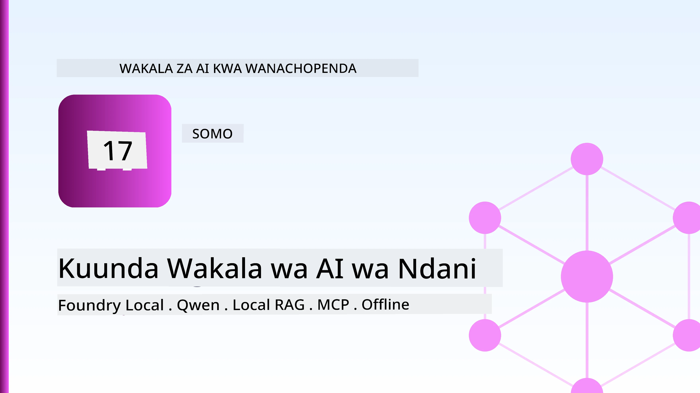
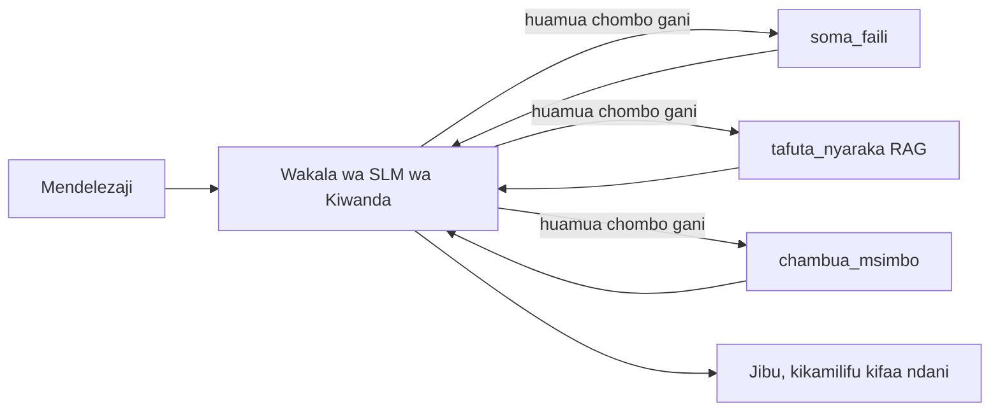
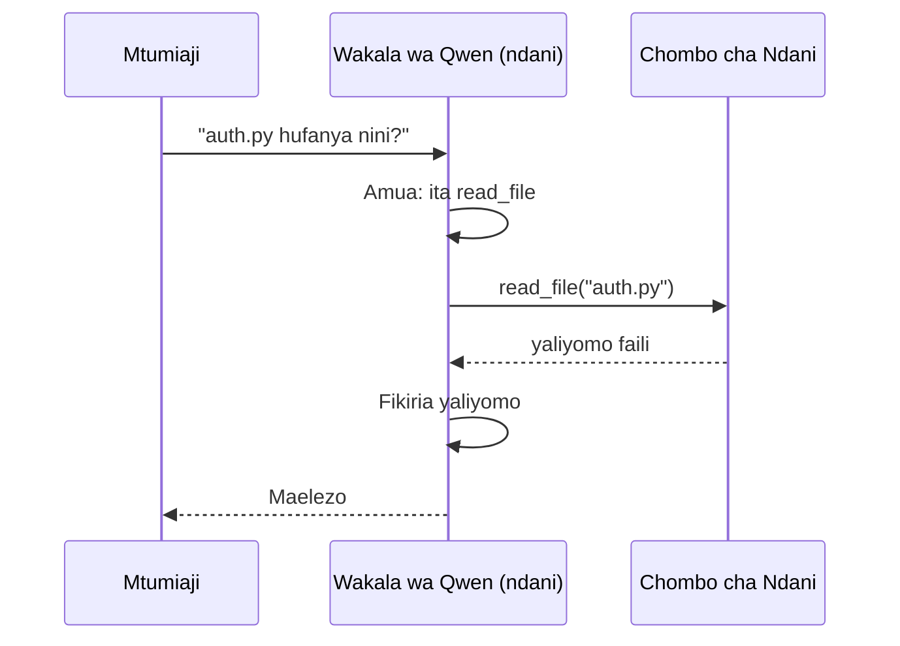
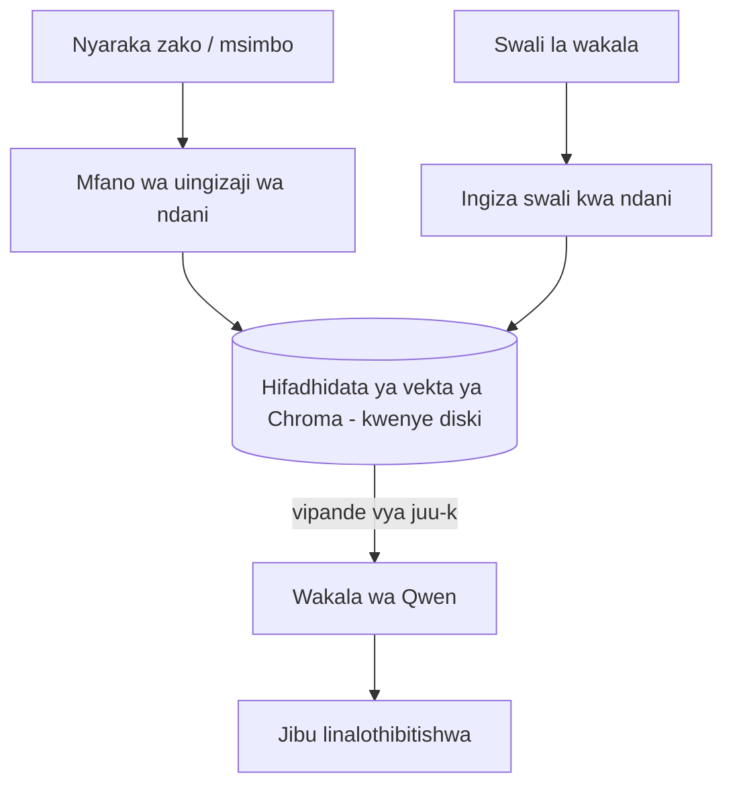
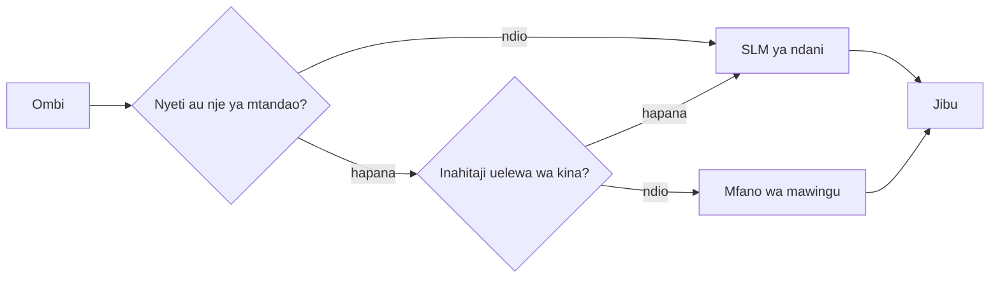

# Kuunda Mawakala wa AI wa Kimoja Kutumia Microsoft Foundry Local na Qwen



Somo lililopita liliupanua mawakala *juu* kwenye wingu. Hili lina wafanya waende *chini* kwenye mashine moja. Mwishoni uta kuwa na msaidizi wa uhandisi anayefanya kazi anayefikiria, aitaje zana, asome faili zako, na tafuta nyaraka zako — **bila simu yoyote ya uelewa wa wingu.**

Kwa nini ungetaka hivyo? Sababu tatu zinazoibuka mara kwa mara katika kazi halisi ya uhandisi:

- **Faragha.** Msimbo na nyaraka hazitoki kamwe kwenye mashine. Hakuna agizo, hakuna kipande, hakuna data ya mteja inayovuka mpaka wa mtandao.
- **Gharama.** Uelewa wa mahali panapofanywa hauna bili kwa kila tokeni. Unaweza kurudia majaribio siku nzima kwa gharama ya umeme tu.
- **Kuvunjika mtandao.** Kwenye ndege, katika sehemu salama, au wakati wa kukatika kwa huduma, wakala bado hufanya kazi.

Chanzo cha tatizo ni kwamba unabadili mfano wa wingu wa mstari wa mbele kwa **Mfano Mdogo wa Lugha (SLM)** unaofanya kazi kwenye CPU, GPU, au NPU yako. Somo hili ni kuhusu kujenga mawakala ambao ni *mzuri* ndani ya kikomo hicho badala ya kudhani kwamba kikomo hakipo.

## Utangulizi

Somo hili litashughulikia:

- **Mifano Midogo ya Lugha (SLMs)** — ni nini, wapi huwa bora, na wapi hawabiriki.
- **Microsoft Foundry Local** — wakati wa kuendesha wa kupakua na kuhudumia mifano kwenye kifaa kupitia **API inayolingana na OpenAI**.
- **Mifano ya Qwen inayopiga simu za kazi** — SLMs zinazotoa simu za zana kwa uhakika, jambo linalofanya mawakala wa kimoja wawezekane (*si mazungumzo tu*).
- **Zana za ndani, RAG ya ndani, na MCP ya ndani** — zinazompa wakala uwezo bila wingu.
- **Mifumo mchanganyiko** — lini kuhifadhi mambo ndani na lini kufikia wingu.

## Malengo ya Kujifunza

Baada ya kumaliza somo hili, utaweza:

- Eleza mabadiliko ya SLMs na chagua matumizi sahihi ya wakala wa ndani.
- Hudumia mfano wa Qwen kimoja kupitia Foundry Local na uunganishe na kiungo cha OpenAI-compatible.
- Jenga wakala wa kupiga simu za zana unaoendesha kabisa kwenye workstation yako.
- Ongeza RAG ya ndani juu ya nyaraka zako mwenyewe kwa kutumia hifadhidata ya vector ya ndani (Chroma).
- Unganisha wakala na seva ya MCP ya ndani na ufikirie kuhusu miundo mchanganyiko ya ndani/wingu.

## Mahitaji ya Awali

Somo hili linadhani umehitimisha masomo ya awali na unajua:

- [Matumizi ya Zana](../04-tool-use/README.md) (Somo 4) na [Agentic RAG](../05-agentic-rag/README.md) (Somo 5).
- [Protokoli za Wakala / MCP](../11-agentic-protocols/README.md) (Somo 11).
- [Ulangaji wa Wakala wa Microsoft](../14-microsoft-agent-framework/README.md) (Somo 14).

Pia utahitaji:

- Workstation ya mbinu. **RAM ya 8 GB ni kiwango cha chini cha kweli**; 16 GB+ ni starehe. GPU au NPU husaidia lakini si sharti.
- **Microsoft Foundry Local** imewekwa (angalia sehemu ya usanidi hapa chini).
- Python 3.12+ na vifurushi kwenye hazina [`requirements.txt`](../../../requirements.txt), pamoja na `foundry-local-sdk`, `openai`, na `chromadb` kwa somo hili.

## Mifano Midogo ya Lugha: Zana Sahihi Kwa Kazi Ya Ndani

Mfano wa mstari wa mbele wa wingu una mabilioni ya vigezo na kituo cha data nyuma yake. SLM ina mabilioni machache ya vigezo na lazima iwe ndani ya RAM ya kompyuta mpakato wako. Tofauti hii itaweka matarajio wazi.

**SLMs ni nzuri katika:**

- Kazi zilizopangwa na kufungamanishwa — utambulisho, uchimbaji, muhtasari wa nyaraka zinazojulikana.
- **Kupiga simu za zana** — kuamua ni kazi gani ya kuitwa na na hoja gani.
- Kurudia haraka, kwa gharama nafuu, kwa faragha juu ya data yako mwenyewe.

**SLMs ni dhaifu katika:**

- Fikra isiyo na kikomo, ya hatua nyingi katika muktadha mkubwa.
- Maarifa mapana ya dunia (wameona kidogo, na hukumbuka kidogo).

Mkakati wa kushinda kwa mawakala wa ndani ni kwa hiyo: **waache SLM ipange, na wape zana kazi nzito.** Mfano hauhitaji *kujua* msimbo wako — unahitaji kujua linapokewa `read_file` na `search_docs`. Hii inaendana moja kwa moja na nguvu za SLM.



## Microsoft Foundry Local

**Microsoft Foundry Local** ni wakati wa kuendesha mwepesi unaopakua, kusimamia, na kuhudumia mifano kabisa kwenye mashine yako. Kipengele chake muhimu kabisa kwetu ni kwamba hutoa **kiungo cha HTTP kinacholingana na OpenAI** — maana yake SDK ya OpenAI na mteja wa OpenAI wa Microsoft Agent Framework hufanya kazi dhidi yake kwa kubadilisha tu `base_url`. Kila kitu ulichojifunza kuhusu kujenga mawakala kinahamia moja kwa moja; kiungo peke yake kinahamia kutoka wingu hadi `localhost`.

Foundry Local pia huchagua uguagli bora wa mfano kwa vifaa vyako moja kwa moja — kujenga kwa CPU, CUDA/GPU, au NPU — hivyo hutalazimika kuboresha kwa mkono kwa kila mashine.

### Usanidi

Sakinisha Foundry Local (angalia [nyaraka](https://learn.microsoft.com/azure/ai-foundry/foundry-local/) kwa OS yako), kisha thibitisha inafanya kazi:

```bash
# Sakinisha (mfano; fuata nyaraka za jukwaa lako)
winget install Microsoft.FoundryLocal      # Windows
# brew install microsoft/foundrylocal/foundrylocal   # macOS

# Pakua na endesha mfano wa Qwen, kisha anzisha huduma ya ndani
foundry model run qwen2.5-7b-instruct
foundry service status
```

Mara huduma inapoanzishwa una kiungo cha ndani, kinacholingana na OpenAI (kawaida `http://localhost:PORT/v1`). Daftari linatumia `foundry-local-sdk` kugundua kiungo kiotomatiki, hivyo hutalazimika kuweka bandari kwa mkono.

## Kupiga Simu za Kazi za Qwen: Kwa Nini Ni Muhimu

Wakala ni wakala tu kama anaweza kupiga simu za zana. SLM nyingi zinaweza kuzungumza lakini hutoa simu za zana zisizo salama au zisizo sahihi. Mifano ya **Qwen** imetayarishwa kwa kupiga simu za kazi na hutengeneza miundo ya simu za zana yenye umakini kila wakati — hiyo ndiyo inayoifanya mfano wa mazungumzo ya ndani kuwa *wakala* wa ndani.

Mzunguko ni ule wa kawaida wa kupiga simu za zana utakaojua, ukifanywa tu kwenye kifaa:



## RAG ya Ndani

Utafutaji wa nyaraka ndio sehemu ambapo mawakala wa ndani hupata thamani yao. Badala ya kutegemea SLM kukumbuka nyaraka za mfumo wako, unaingiza nyaraka hizo kwenye **hifadhidata ya vector ya ndani** na kuruhusu wakala kuleta sehemu zinazohitajika kwa ombi.

Tunatumia **Chroma**, duka la vector lililojumuishwa linalofanya kazi ndani ya mchakato bila server kuisimamia. Mchakato ni wa ndani kabisa: mfano wa kuingiza ndani → vectors za ndani → utafutaji wa ndani → SLM ya ndani.



Huu ni mfano huo huo wa Agentic RAG kutoka Somo la 5 — mabadiliko pekee ni kwamba kila sehemu inafanya kazi kwenye mashine yako.

## Seva za MCP za Ndani

[MCP](../11-agentic-protocols/README.md) ni usafirishaji, si huduma ya wingu. Seva ya MCP inaweza kuendesha kama mchakato wa ndani kwa `stdio`, ikionyesha zana kwa wakala wako kupitia itifaki ya kawaida. Hii inakuwezesha kutumia tena mifumo inayokua ya seva za MCP — ufikiaji wa mfumo wa faili, uendeshaji wa git, maswali ya hifadhidata — kabisa bila mtandao.

Hali ya usalama ni tofauti na wingu, lakini haipo kabisa: seva ya MCP ya ndani bado inaendesha kwa ruhusa za mtumiaji wako, hivyo elekeza juu ya nini inaweza kugusa (kabrasha la mradi, si folda yako yote ya nyumbani) na taka matokeo yake kama ingizo la kuthibitisha.

## Mifumo Mchanganyiko ya Wingu-na-Ndani

Kwanza ndani si maana ya ndani tu. Mifumo iliyokomaa hupelekwa kwa hisia na ugumu:

| Hali | Inafanyika wapi |
| --- | --- |
| Msimbo/madata yenye hisia, au offline | **SLM ya ndani** |
| Kazi rahisi, iliyopimwa | **SLM ya ndani** (gharama nafuu, haraka) |
| Fikiria nyingi za hatua nyingi muhimu juu ya data isiyo ya hisia | **Mfano wa wingu** |
| Kila kitu, wakati wa kukatika kwa huduma | **SLM ya ndani** (kupungua kwa edgarama kwa heshima) |

Hii inaakisi wazo la **kupanga mifano** kutoka Somo 16 — isipokuwa moja ya "mifano" sasa ni mashine yako mwenyewe. Muundo imara unarudi kwa ndani wakati wingu halipatikani, hivyo wakala hupungua ubora badala ya kushindwa kabisa.



## Maabara ya Vitendo: Msaidizi wa Uhandisi wa Ndani

Fungua [`code_samples/17-local-agent-foundry-local.ipynb`](./code_samples/17-local-agent-foundry-local.ipynb) na trifiti kupitia. Uta jenga **msaidizi wa uhandisi wa ndani** unaoendesha kabisa kwenye workstation yako na anaweza:

1. **Kupiga simu za zana** — kupitia simu za kazi za Qwen kupitia Foundry Local.
2. **Kufanya shughuli za faili za ndani** — orodha na soma faili ndani ya kabrasha la mradi.
3. **Kuchambua msimbo** — ripoti vipimo vya msingi juu ya faili ya chanzo.
4. **Kutafuta nyaraka** — RAG ya ndani juu ya kabrasha la nyaraka na Chroma.
5. **Tumia MCP** — ungana na seva ya MCP ya ndani (na ruka kwa heshima kama hakuna imepangwa).

Hakuna uelewa wa wingu unaotumika wakati wowote.

### Maelekezo

Msaidizi anajiunganisha na Foundry Local kupitia kiungo cha OpenAI-compatible, hivyo msimbo wa wakala unaonekana karibu kabisa kama masomo ya wingu — mteja tu hubadilika:

```python
from foundry_local import FoundryLocalManager
from openai import OpenAI

# Foundry Local hugundua/hupakua mfano na hutupatia kiunganishi cha eneo la karibu.
manager = FoundryLocalManager(\"qwen2.5-7b-instruct\")
client = OpenAI(base_url=manager.endpoint, api_key=manager.api_key)  # api_key ni kijaza mahali cha ndani
```

Zana ni kazi za kawaida za Python zilizo na mipaka kwenye kabrasha la mradi:

```python
def read_file(path: str) -> str:
    \"\"\"Read a file, but only inside the sandboxed project directory.\"\"\"
    full = (PROJECT_ROOT / path).resolve()
    if PROJECT_ROOT not in full.parents and full != PROJECT_ROOT:
        return \"Access denied: path is outside the project directory.\"
    return full.read_text(encoding=\"utf-8\")
```

Angalia ukaguzi wa sandbox — hata kimoja kwa ndani, zana inayosoma njia za faili bila mipaka ni hatari. Daftari linahakikisha kila zana ina mipaka ya kwenye mzizi wa mradi mmoja.

## Kagua Maarifa

Jaribu kuelewa kabla ya kuendelea kwenye kazi.

**1. Toa sababu mbili za kuendesha wakala ndani badala ya kwenye wingu.**

<details>
<summary>Jibu</summary>

Yoyote mbili kati ya: **faragha** (msimbo na data hazitoki kwa mashine), **gharama** (hakuna bili kwa kila tokeni ya uelewa), na **uwezo wa offline** (hufanya kazi bila mtandao — kwenye ndege, katika kituo salama, au wakati wa kukatika huduma). Vikwazo vya kanuni/vyeti vinavyozuia kutuma data nje ya kifaa ni sababu ya kawaida ya faragha.
</details>

**2. Mgawanyo wa kazi unaopendekezwa kati ya SLM na zana zake katika wakala wa ndani ni upi, na kwa nini?**

<details>
<summary>Jibu</summary>

Wape SLM jukumu la **kupangilia** (kuamua zana gani iitwe na kwa hoja gani) na wape **zana jukumu zito** (kusoma faili, kutafuta nyaraka, kuhesabu matokeo). SLM ni imara katika maamuzi yaliyo na mipaka kama kuchagua zana lakini dhaifu katika maarifa mapana na fikra nyingi za hatua nyingi, kwa hiyo kutegemea zana ni shabaha yao.
</details>

**3. Nini hufanya iwezekane kutumia tena msimbo wa wakala wa wingu na Foundry Local?**

<details>
<summary>Jibu</summary>

Foundry Local hutoa **kiungo cha HTTP kinacholingana na OpenAI**. SDK ya OpenAI na mteja wa OpenAI wa Agent Framework hufanya kazi dhidi yake kwa kubadilisha tu `base_url` (na kutumia ufunguo wa API wa ndani wa nafasi). Kila kitu kingine kuhusu msimbo wa wakala hubaki kama ilivyo.
</details>

**4. Kwa nini tunatumia hasa mfano wa kupiga simu za kazi wa Qwen badala ya SLM yoyote?**

<details>
<summary>Jibu</summary>

Kwa sababu wakala lazima aweze kutoa simu za zana zenye uhakika na zenye muundo mzuri. SLM nyingi zinaweza kuongea lakini hutolea miundo ya simu za zana isiyo sahihi au isiyo thabiti. Mifano ya Qwen imetayarishwa kupiga simu za kazi na hutengeneza simu thabiti, na hiyo ndiyo inayoifanya mfano wa mazungumzo ya ndani kuwa wakala wa kufanya kazi wa ndani.
</details>

**5. Katika mchakato wa RAG wa ndani, ni sehemu gani zinazoendesha kwenye mashine?**

<details>
<summary>Jibu</summary>

Zote: mfano wa kuingiza ndani, hifadhidata ya vector (Chroma, kwenye diski), hatua ya utafutaji, na SLM. Nyaraka zinaingizwa ndani, kuhifadhiwa ndani, kutafutwa ndani, na kufikiriwa na mfano wa ndani — hakuna sehemu inayogusa wingu.
</details>

**6. Seva ya MCP ya ndani inafanya kazi kwenye mashine yako. Je, hiyo inafanya iwe salama moja kwa moja? Ni tahadhari gani unapaswa bado kuchukua?**

<details>
<summary>Jibu</summary>

Hapana. Seva ya MCP ya ndani inaendesha kwa ruhusa za mtumiaji wako, hivyo inaweza kugusa kila kitu unachoweza. Elekeza kwenye kile inachohitaji (kwa mfano, kabrasha moja la mradi badala ya folda yako yote ya nyumbani) na chukulia matokeo yake kama ingizo la kuthibitisha kabla ya kutenda.
</details>

**7. Eleza sheria nzuri ya kuongoza mchanganyiko inayojumuisha mfano wa ndani.**

<details>
<summary>Jibu</summary>

Elekeza maombi yenye hisia au yasiyo ya mtandao kwa SLM ya ndani; elekeza kazi rahisi zilizo na mipaka kwa SLM ya ndani kwa kasi na gharama; elekeza fikra ngumu za hatua nyingi juu ya data isiyo ya hisia kwa mfano wa wingu; na rudi kwa SLM ya ndani kama wingu halipatikani ili wakala apungue kwa heshima badala ya kushindwa. Hii ni kupangilia mfano (Somo 16) na mashine ya ndani kama mmoja wa mifano.
</details>

**8. Ni kiasi gani cha chini cha kweli cha RAM kinachopendekezwa kwa kuendesha wakala wa ndani katika somo hili, na RAM zaidi inakunufaishea nini?**

<details>
<summary>Jibu</summary>

Takriban **8 GB** ni kiwango cha chini cha kweli; 16 GB+ ni starehe. RAM zaidi inakuwezesha kuendesha mifano mikubwa, yenye uwezo zaidi na kuhifadhi muktadha zaidi kwenye kumbukumbu. GPU au NPU hufanya uelewa haraka lakini si sharti — Foundry Local huchagua kujenga kwa CPU wakati hakuna kipandikizi kinapatikana.
</details>

## Kazi

Panua msaidizi wa uhandisi wa ndani kuwa **mkwisha wa nyaraka wa ndani** kwa mradi mdogo wowote utakaochagua (tumia moja kati ya mabahasha ya somo hili hapa repo kama unavyotaka).

Maombi yako yanapaswa:

1. **Fanyia faharasa kabrasha halisi la nyaraka/msimbo** katika Chroma (angalia faili tano angalau).
2. **Ongeza zana ya `find_todos`** inayochambua mradi kwa maoni ya `TODO`/`FIXME` na kuyarejesha pamoja na jina la faili na nambari ya mstari — ukihifadhi ukaguzi wa sandbox kama `read_file`.

3. **Muulize wakala maswali matatu** yanayomlazimisha kuunganisha zana: swali moja safi la RAG, moja linalohitaji kusoma faili maalum, na moja linalohitaji kupata TODOs.
4. **Pima**: pima muda wa kila jibu tatu na uandika kwenye seli ya markdown. Toa maoni kama ucheleweshaji ni wa kukubalika kwa mtiririko wako wa kazi uliokusudia.

Kisha andika aya fupi kuhusu **nini ungehamisha kwenye wingu na nini ungeendelea kuhifadhi mahali hapa kwa mkaguzi huyu, na kwa nini.** Utapimwa kama vijumlisho vya eneo lako vimeunganishwa sawa na kama mantiki yako ya mchanganyiko ni imara — si kwa ubora wa mfano.

## Muhtasari

Katika somo hili umejenga wakala anayefanya kazi kikamilifu kwenye mashine yako mwenyewe:

- **SLMs** hubadilisha upana kwa faragha, gharama, na uendeshaji bila mtandao — na huangaza wanapokuwa **watendaji wa zana** badala ya kubeba maarifa yote wenyewe.
- **Foundry Local** hutumikia mifano kwenye kifaa nyuma ya **mwisho unaoendana na OpenAI**, kwa hivyo msimbo wako wa wakala wa wingu huhamishiwa kwa mabadiliko ya mstari mmoja.
- **Mifano ya Qwen inayofanya simu za kazi** hufanya simu za zana za ndani kuwa za kuaminika — na kwa hivyo *wakala wa ndani* iwezekanavyo.
- **RAG ya ndani** (Chroma) na **MCP ya ndani** huwapa wakala uwezo bila kuondoka kwenye mashine.
- **Mifumo mchanganyiko** hukuruhusu kuongoza kwa ujazo na ugumu, na eneo la ndani kuwa suluhisho la hifadhi kwa heshima.

Hii inakamilisha mzunguko wa uenezaji: Somo la 16 liliongeza wakala hadi Microsoft Foundry, na somo hili liliwapunguza hadi kwa sehemu moja ya kazi. Somo lijalo linahusu kuendelea na usalama wa wakala waliowekwa.

## Rasilimali Zaidi

- <a href="https://learn.microsoft.com/azure/ai-foundry/foundry-local/" target="_blank">Nyaraka za Microsoft Foundry Local</a>
- <a href="https://learn.microsoft.com/azure/ai-foundry/what-is-azure-ai-foundry" target="_blank">Nyaraka za Microsoft Foundry</a>
- <a href="https://learn.microsoft.com/en-us/agent-framework/overview/?wt.mc_id=youtube_26688_organicsocial_reactor&pivots=programming-language-python" target="_blank">Mfumo wa Wakala wa Microsoft</a>
- <a href="https://qwen.readthedocs.io/en/latest/framework/function_call.html" target="_blank">Nyaraka za simu za kazi za Qwen</a>
- <a href="https://modelcontextprotocol.io/" target="_blank">Itifaki ya Muktadha wa Mfano (MCP)</a>
- <a href="https://docs.trychroma.com/" target="_blank">Hifadhidata ya vekta ya Chroma</a>

## Somo lililopita

[Kueneza Wakala Wanaoweza Kupanuka](../16-deploying-scalable-agents/README.md)

## Somo lijalo

[Kuweka Usalama wa Wakala wa AI](../18-securing-ai-agents/README.md)

---

<!-- CO-OP TRANSLATOR DISCLAIMER START -->
**Kionyozo**:
Hati hii imetafsiriwa kwa kutumia huduma ya tafsiri ya AI [Co-op Translator](https://github.com/Azure/co-op-translator). Ingawa tunajitahidi kupata usahihi, tafadhali fahamu kwamba tafsiri za kiotomatiki zinaweza kuwa na makosa au upungufu wa usahihi. Hati ya asili katika lugha yake halisi inapaswa kuchukuliwa kama chanzo cha mamlaka. Kwa taarifa muhimu, tafsiri ya kitaalamu inayofanywa na binadamu inapendekezwa. Hatutojibu kwa kuelewa vibaya au tafsiri potofu zinazotokea kutokana na matumizi ya tafsiri hii.
<!-- CO-OP TRANSLATOR DISCLAIMER END -->