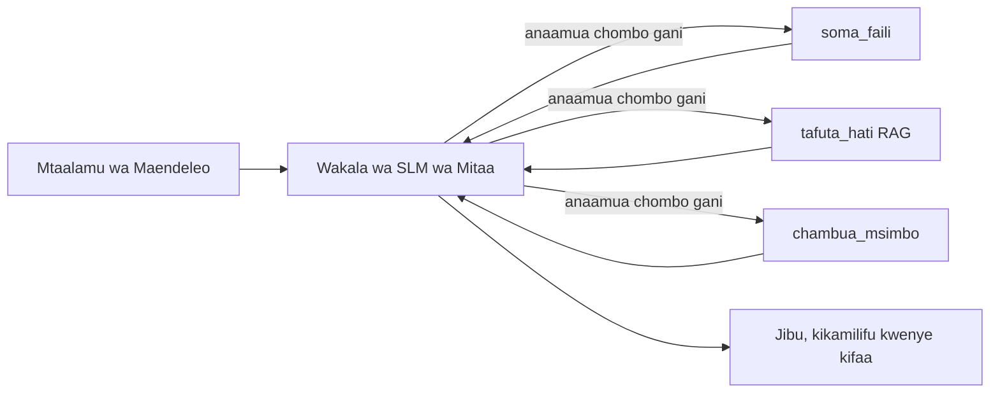
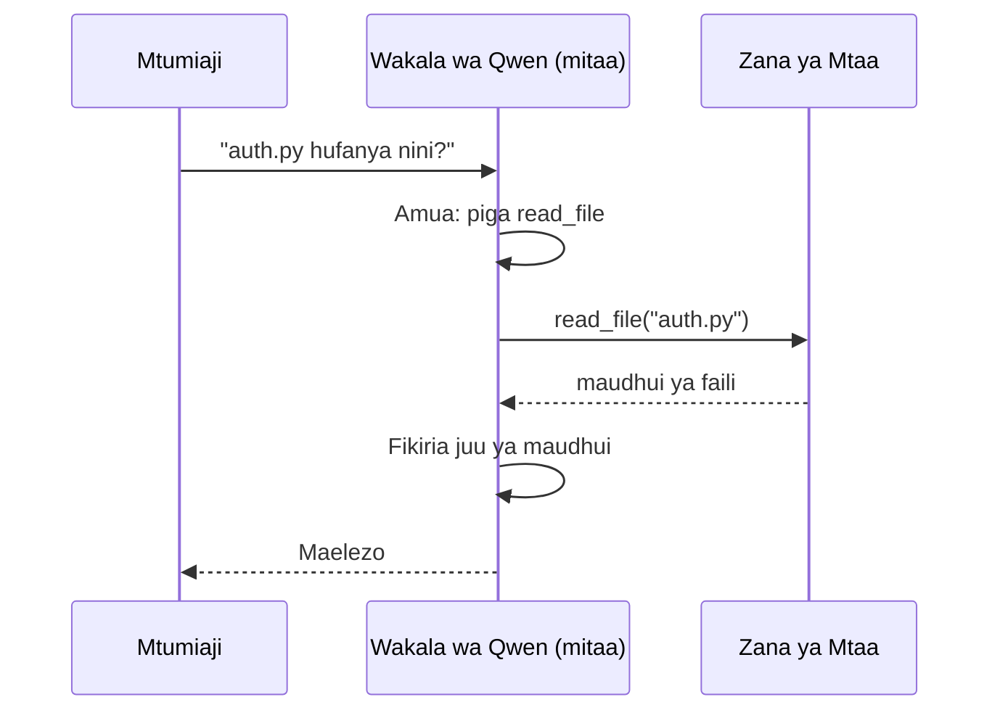
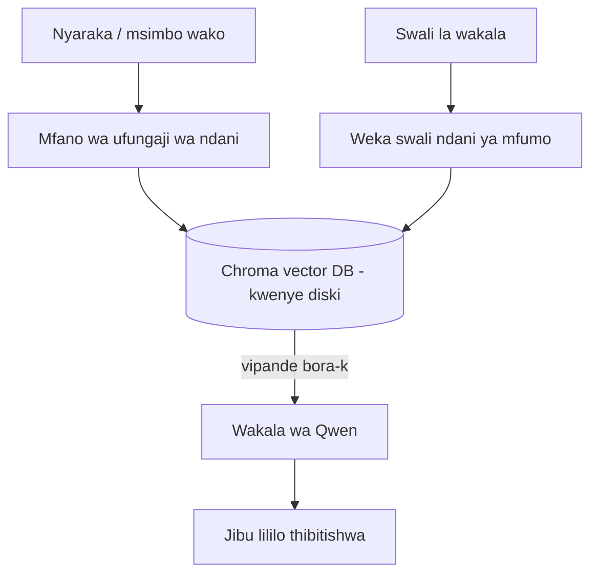
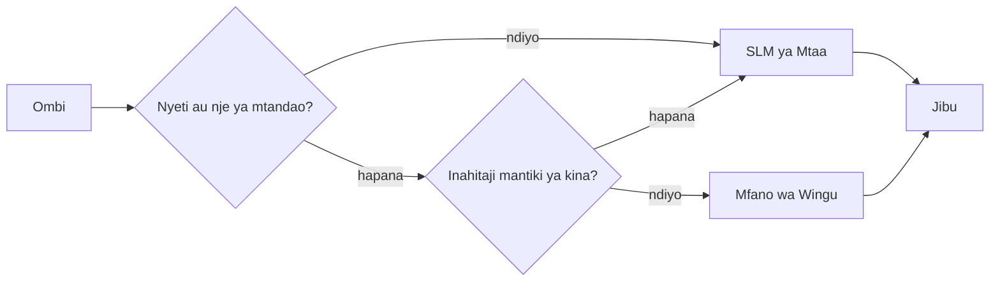

# Kuunda Maajenti wa AI wa Ndani Kutumia Microsoft Foundry Local na Qwen


Somo lililopita lilipanua maajenti hadi *wingu*. Hili linawaweka *chini* kwenye mashine moja. Mwisho utakuwa na msaidizi wa uhandisi anayefanya kazi anayefikiria, anaita zana, husoma faili zako, na kutafuta nyaraka zako — **bila wito hata mmoja wa inference kwenye wingu.**

Kwa nini ungependa hilo? Sababu tatu zinazoibuka mara kwa mara katika kazi halisi za uhandisi:

- **Faragha.** Msimbo na nyaraka hazitoki kabisa kwenye mashine. Hakuna ombi, hakuna kipande, hakuna data ya mteja inayovuka mpaka wa mtandao.
- **Gharama.** Inference ya ndani haina gharama kwa kila tokeni. Unaweza kurudia kazi siku nzima kwa bei ya umeme tu.
- **Kutokuwa mtandaoni.** Katika ndege, katika kituo salama, au wakati wa hitilafu, ajenti bado hufanya kazi.

Jambo la kuchukua ni kwamba unabadilisha mfano wa wingu wa kiwango cha juu kwa **Mfano Mdogo wa Lugha (SLM)** unaoendesha kwenye CPU, GPU, au NPU yako. Somo hili linaangazia kujenga maajenti ambao ni *wazuri* ndani ya kikomo hicho badala ya kudanganya kuwa kikomo hakipo.

## Utangulizi

Somo hili litashughulikia:

- **Mifano Midogo ya Lugha (SLMs)** — ni nini, wanapong’ara wapi, na wapi hawafanyi vizuri.
- **Microsoft Foundry Local** — runtime inayopakua na kuhudumia mifano kifaa ndani kupitia **API inayolingana na OpenAI**.
- **Mifano ya kuitwa kazi ya Qwen** — SLMs zinazotoa wito wa zana kwa uhakika, jambo linalorahisisha maajenti wa ndani (si tu mazungumzo ya ndani).
- **Zana za ndani, RAG ya ndani, na MCP ya ndani** — kutoa uwezo kwa ajenti bila wingu.
- **Mifumo mchanganyiko** — wakati wa kuweka mambo ndani na wakati wa kufikia wingu.

## Malengo ya Kujifunza

Baada ya kumaliza somo hili, utajua jinsi ya:

- Eleza faida na hasara za SLM na chagua matumizi yanayofaa ya maajenti wa ndani.
- Hudumia mfano wa Qwen kwa ndani kwa kutumia Foundry Local na uunganishwe kupitia kiunganishi kinacholingana na OpenAI.
- Jenga ajenti wa kuitwa zana anayefanya kazi kabisa kwenye eneo lako la kazi.
- Ongeza RAG ya ndani juu ya nyaraka zako mwenyewe kwa kutumia hifadhidata ya vector za ndani (Chroma).
- Unganisha ajenti na seva ya MCP ya ndani na fanya mantiki juu ya miundo mchanganyiko ya ndani/wingu.

## Masharti ya Awali

Somo hili linadhani umemaliza masomo ya awali na unajua:

- [Matumizi ya Zana](../04-tool-use/README.md) (Somo 4) na [Agentic RAG](../05-agentic-rag/README.md) (Somo 5).
- [Itifaki za Agentic / MCP](../11-agentic-protocols/README.md) (Somo 11).
- [Mfumo wa Microsoft Agent Framework](../14-microsoft-agent-framework/README.md) (Somo 14).

Pia utahitaji:

- Kituo cha mtaalamu wa maendeleo. **RAM ya GB 8 ni chini kabisa inayowezekana**; GB 16+ ni ya starehe. GPU au NPU ni msaada lakini si lazima.
- **Microsoft Foundry Local** imewekwa (angalia sehemu ya usaidizi hapa chini).
- Python 3.12+ na vifurushi vilivyomo kwenye hifadhidata [`requirements.txt`](../../../requirements.txt), pamoja na `foundry-local-sdk`, `openai`, na `chromadb` kwa somo hili.

## Mifano Midogo ya Lugha: Zana Sahihi kwa Kazi ya Ndani

Mfano mkubwa wa wingu una parameta mamia ya bilioni na kituo cha data nyuma yake. SLM ina parameta chache bilioni na inapaswa kuendeshwa kwenye RAM ya kompyuta yako ya kubebeka. Tofauti hiyo huweka matarajio wazi.

**SLMs ni nzuri kwa:**

- Kazi zilizo wazi na zilizopangwa — ushy分類i, uchukuzi, muhtasari wa hati inayojulikana.
- **Kuitwa kwa zana** — kuamua ni kazi gani kuitwa na kwa hoja gani.
- Kurudia haraka, kwa gharama ndogo, kwa faragha kwenye data yako mwenyewe.

**SLMs ni dhaifu kwa:**

- Mantiki isiyo na kikomo, hatua nyingi mbili au zaidi katika muktadha mkubwa.
- Maarifa mapana ya dunia (wameona kidogo na kusahau zaidi).

Mkakati wa kushinda kwa maajenti wa ndani ni: **uwaache SLM kuratibu, na ziache zana zikamilishe kazi kubwa.** Mfano hauhitaji *kujua* msimbo wako — unahitaji kujua wakati wa kuita `read_file` na `search_docs`. Hii inalingana na nguvu za SLM.



## Microsoft Foundry Local

**Microsoft Foundry Local** ni runtime nyepesi inayopakua, kusimamia, na kuhudumia mifano kabisa kwenye mashine yako. Kipengele chake muhimu kwetu ni kwamba huweka wazi **kiunganishi cha HTTP kinacholingana na OpenAI** — maana yake ni SDK ya OpenAI na wateja wa Microsoft Agent Framework wanaweza kuifanya kazi kwa kubadilisha tu `base_url`. Kila kitu ulichojifunza kuhusu kujenga maajenti kinaelekezwa moja kwa moja; kiunganishi tu ndicho kinachobadilika kutoka wingu hadi `localhost`.

Foundry Local pia huchagua ujenzi bora wa mfano kwa vifaa vyako moja kwa moja — ujenzi wa CPU, ujenzi wa CUDA/GPU, au ujenzi wa NPU — kwa hiyo huna haja ya kuboresha kila mashine kwa mkono.

### Mipangilio

Sakinisha Foundry Local (angaliza [nyaraka](https://learn.microsoft.com/azure/ai-foundry/foundry-local/) kwa OS yako), kisha thibitisha inafanya kazi:

```bash
# Sakinisha (mfano; fuata nyaraka za jukwaa lako)
winget install Microsoft.FoundryLocal      # Windows
# brew install microsoft/foundrylocal/foundrylocal   # macOS

# Pakua na endesha mfano wa Qwen, kisha anza huduma ya hapa hapa
foundry model run qwen2.5-7b-instruct
foundry service status
```

Mara huduma inaendesha unapata kiunganishi cha ndani kinacholingana na OpenAI (kawaida `http://localhost:PORT/v1`). Daftari la maelezo linatumia `foundry-local-sdk` kugundua kiunganishi moja kwa moja, kwa hiyo hutalazimika kuandika nambari ya bandari kikaboni.

## Qwen Kuitwa kwa Kazi: Kwa Nini Ni Muhimu

Ajenti ni ajenti tu ikiwa anaweza kuitwa zana. SLM nyingi zinaweza kuzungumza lakini kutoa wito wa zana usioaminika na wenye muundo mbaya. Mifano ya **Qwen** imetengenezwa kwa kuitwa kazi na kutoa muundo mzuri wa wito wa zana mara kwa mara — ndiyo hasa inavyoifanya mfano wa mazungumzo wa ndani kuwa *ajenti* wa ndani.

Mzunguko ni wa kawaida wa kuweka wito wa zana unayojua, tu ukifanyika kifaa ndani:



## RAG ya Ndani

Utafutaji nyaraka ndio sehemu maajenti wa ndani hupata thamani yao. Badala ya kutegemea SLM kukumbuka nyaraka za mfumo wako, unaweka nyaraka hizo kwenye **hifadhidata ya vector ya ndani** na kumruhusu ajenti kurudisha sehemu husika anapohitaji.

Tunatumia **Chroma**, duka la vector lililo ndani linaloendesha kwa pamoja bila seva ya kusimamia. Mchoro mzima ni wa ndani kabisa: mfano wa embedding wa ndani → vector za ndani → upataji wa ndani → SLM ya ndani.



Hii ni mfano sawa wa Agentic RAG kutoka Somo 5 — mabadiliko pekee ni kwamba kila kipengele kinaendesha kwenye mashine yako.

## Seva za MCP za Ndani

[MCP](../11-agentic-protocols/README.md) ni usafirishaji, si huduma ya wingu. Seva ya MCP inaweza kuendesha kama mchakato wa ndani kwenye `stdio`, ikionyesha zana kwa ajenti yako kupitia itifaki ya kawaida. Hii inakuwezesha kutumia mifumo inayokua ya seva za MCP — upatikanaji wa mfumo wa faili, operesheni za git, kuulizia hifadhidata — kabisa bila mtandao.

Hali ya usalama ni tofauti na wingu, lakini haiko mbali: seva ya MCP ya ndani bado inaendesha na ruhusa za mtumiaji wako, kwa hiyo fikia kile inaweza kugusa (direktori ya mradi, sio folda yako yote nyumbani) na chukua mazao yake kama ingizo la kuangalia kabla ya kutenda.

## Mifumo Mchanganyiko ya Wingu na Ndani

Kwanza ni kwa ndani si kwamba ni kwa ndani tu. Mifumo imara huandaa kulingana na hali na ugumu:

| Hali | Wapi inaendesha |
| --- | --- |
| Msimbo / data nyeti, au kutokuwa mtandaoni | **SLM ya Ndani** |
| Kazi rahisi na iliyojumlishwa | **SLM ya Ndani** (gharama nafuu, haraka) |
| Mantiki ngumu ya hatua nyingi kwenye data isiyo nyeti | **Mfano wa Wingu** |
| Kila kitu, wakati hitilafu | **SLM ya Ndani** (kuharibika kwa heshima) |

Hii inafanana na wazo la **uuratibu wa mfano** kutoka Somo 16 — isipokuwa mmoja wa "mifano" sasa ni mashine yako. Muundo thabiti huhama ndani inaposhindwa wingu, kwa hiyo ajenti hupungua ubora badala ya kushindwa kabisa.



## Maabara ya Vitendo: Msaidizi wa Uhandisi wa Ndani

Fungua [`code_samples/17-local-agent-foundry-local.ipynb`](./code_samples/17-local-agent-foundry-local.ipynb) na ifanyie kazi. Utajenga **msaidizi wa uhandisi wa ndani** anayefanya kazi kabisa kwenye eneo lako la kazi na anaweza:

1. **Kuita zana** — kupitia kuitwa kwa kazi ya Qwen kupitia Foundry Local.
2. **Kuendesha operesheni za faili za ndani** — orodha na usome faili katika direktori ya mradi.
3. **Chambua msimbo** — ripoti vipimo vya msingi kwenye faili ya chanzo.
4. **Tafuta nyaraka** — RAG ya ndani juu ya folda ya nyaraka na Chroma.
5. **Tumia MCP** — ungana na seva ya MCP ya ndani (na kuruka kwa heshima ikiwa hakuna iliyosanidiwa).

Hakuna inference ya wingu inayotumika wakati wowote.

### Mwongozo

Msaidizi huungana na Foundry Local kupitia kiunganishi kinacholingana na OpenAI, kwa hiyo msimbo wa ajenti unaonekana karibu sawa na somo la wingu — mteja tu anabadilika:

```python
from foundry_local import FoundryLocalManager
from openai import OpenAI

# Foundry Local hugundua/hupakua mfano na hutupa nukta ya mwisho ya ndani.
manager = FoundryLocalManager(\"qwen2.5-7b-instruct\")
client = OpenAI(base_url=manager.endpoint, api_key=manager.api_key)  # api_key ni nafasi ya msingi ya ndani
```

Zana ni kazi za kawaida za Python zilizo na wigo wa direktori ya mradi:

```python
def read_file(path: str) -> str:
    \"\"\"Read a file, but only inside the sandboxed project directory.\"\"\"
    full = (PROJECT_ROOT / path).resolve()
    if PROJECT_ROOT not in full.parents and full != PROJECT_ROOT:
        return \"Access denied: path is outside the project directory.\"
    return full.read_text(encoding=\"utf-8\")
```

Kumbuka ukaguzi wa sandbox — hata ndani, zana inayosoma njia za faili yoyote ni hatari. Daftari linahakikisha kila zana ina wigo wa mzizi wa mradi mmoja.

## Mtihani wa Maarifa

Jaribu kuelewa kabla ya kuendelea na kazi.

**1. Toa sababu mbili halisi za kuendesha ajenti kwa ndani badala ya wingu.**

<details>
<summary>Jibu</summary>

Yoyote mbili kati ya: **faragha** (msimbo na data hazitoki kwenye mashine), **gharama** (hakuna bili kwa kila tokeni ya inference), na **uwezo wa kutokuwa mtandaoni** (hufanya kazi bila mtandao — ndani ya ndege, kituo salama, au wakati wa hitilafu). Vizingiti vya udhibiti/viongozaji vinavyozuia kutuma data nje ya kifaa ni sababu ya kawaida ya faragha.
</details>

**2. Mgawanyo wa kazi unaopendekezwa kati ya SLM na zana zake katika ajenti wa ndani ni ule gani, na kwa nini?**

<details>
<summary>Jibu</summary>

Acha SLM **iratibu** (amua zana gani kuitwa na na hoja gani) na acha **zana zitendee kazi ngumu** (kusoma faili, kupata nyaraka, kuhesabu matokeo). SLM ni imara katika maamuzi yaliyofungwa kama uteuzi wa zana lakini dhaifu katika maarifa mapana na mantiki kwa hatua nyingi, kwa hiyo kutegemea zana ni kutumia nguvu zao.
</details>

**3. Nini kinachowezesha kutumia upya msimbo wa ajenti wa wingu na Foundry Local?**

<details>
<summary>Jibu</summary>

Foundry Local inaweka wazi **kiunganishi cha HTTP kinacholingana na OpenAI**. SDK ya OpenAI na mteja wa Agent Framework wa OpenAI hufanya kazi kwa kubadilisha `base_url` tu (na kutumia API key ya ndani ya kielekezi). Kila kitu kingine kuhusu msimbo wa ajenti hubaki sawa.
</details>

**4. Kwa nini tunatumia mfano wa kuitwa kazi wa Qwen badala ya SLM yoyote?**

<details>
<summary>Jibu</summary>

Kwa sababu ajenti lazima azalishaji wito wa zana unaoaminika na ulio na muundo mzuri. SLM nyingi zinaweza kuzungumza lakini hutoa wito za zana zisizo sahihi au zenye mpangilio mbaya. Mifano ya Qwen imetengenezwa kwa kuitwa kazi na hutoa wito vya zana vinavyolingana, jambo linaloifanya mfano wa mazungumzo wa ndani kuwa ajenti wa ndani anayefanya kazi.
</details>

**5. Katika pipeline ya RAG ya ndani, ni vipengele gani vinaendesha kwenye mashine?**

<details>
<summary>Jibu</summary>

Vyote: mfano wa embedding, hifadhidata ya vector (Chroma, kwenye diski), hatua ya upataji, na SLM. Nyaraka zimewekwa ndani, kuhifadhiwa ndani, kupatikana ndani, na kufikiriwa na mfano wa ndani — hakuna kipengele kinachogusa wingu.
</details>

**6. Seva ya MCP ya ndani inaendesha kwenye mashine yako. Je, hiyo inafanya ipatikane salama kiotomatiki? Ni tahadhari gani bado unapaswa kuchukua?**

<details>
<summary>Jibu</summary>

Hapana. Seva ya MCP ya ndani inaendesha kwa ruhusa za mtumiaji wako, kwa hiyo inaweza kugusa chochote unachoweza. Iweke katika wigo wa kile inachohitaji (kwa mfano, direktori moja ya mradi badala ya folda yako yote nyumbani) na chukulia mazao yake kama ingizo za kuangalia kabla ya kuchukua hatua.
</details>

**7. Eleza kanuni ya usafirishaji mchanganyiko inayojumuisha mfano wa ndani.**

<details>
<summary>Jibu</summary>

Peleka maombi nyeti au yasiyo mtandaoni kwa SLM ya ndani; peleka kazi rahisi zilizopangwa kwa SLM ya ndani kwa kasi na gharama; peleka mantiki ngumu ya hatua nyingi juu ya data isiyo nyeti kwa mfano wa wingu; na rudi kwa SLM ya ndani ikiwa wingu halipatikani kwa hiyo ajenti hupungua kwa heshima badala ya kushindwa. Hii ni uuratibu wa mfano (Somo 16) na mashine ya ndani kama moja ya mifano.
</details>

**8. Ni kiasi gani cha chini cha RAM kinachofaa kwa kuendesha ajenti wa ndani katika somo hili, na RAM zaidi inakupa nini?**

<details>
<summary>Jibu</summary>

Karibu **GB 8** ni chini kabisa inayowezekana; GB 16+ ni ya starehe. RAM zaidi inakuwezesha kuendesha mifano mikubwa, yenye uwezo zaidi na kuhifadhi muktadha zaidi kwa kumbukumbu. GPU au NPU huchochea inference lakini si lazima — Foundry Local huchagua ujenzi wa CPU wakati hakuna kiimarishaji.
</details>

## Kazi

Panua msaidizi wa uhandisi wa ndani kuwa **mkaguzi wa nyaraka za ndani** kwa mradi mdogo wa chaguo lako (tumia moja ya folda za somo za repo hii kama unataka).

Uwasilishaji wako unapaswa:

1. **Orodha muhtasari wa hakiki / codex** halisi katika Chroma (angalau faili tano).
2. **Ongeza zana ya `find_todos`** inayosaka maelezo ya `TODO`/`FIXME` katika mradi na kuyarudisha pamoja na safu ya faili na nambari ya mstari — ukihifadhi ukaguzi huo wa sandbox kama ilivyo `read_file`.

3. **Muulize wakala maswali matatu** yanayomlazimisha kuunganisha zana: swali moja safi la RAG, moja linalohitaji kusoma faili maalum, na moja linalohitaji kutafuta TODOs.
4. **Pima**: pima kila jibu kati ya matatu na uandike kwenye seli ya markdown. Toa maoni kama ucheleweshaji ni wa kuvumilika kwa mtiririko wako wa kazi uliokusudiwa.

Kisha andika aya fupi kuhusu **nini ungehamisha kwenda wingu na nini ungebaki eneo la karibu** kwa mkaguzi huyu, na kwanini. Utapimwa kama vipengele vya eneo la karibu vimeunganishwa vizuri na kama uamuzi wako mchanganyiko ni mzuri — si ubora wa mfano.

## Muhtasari

Katika somo hili ulijenga wakala anayeendesha kikamilifu kwenye mashine yako mwenyewe:

- **SLMs** hubadilisha upana kwa faragha, gharama, na utendaji wa offline — na hutoa ubora wanapokuwa **wakisambaza zana** badala ya kubeba maarifa yote wenyewe.
- **Foundry Local** huhudumia mifano kwenye kifaa nyuma ya **sehemu ya mwisho inayolingana na OpenAI**, hivyo msimbo wako wa wakala wa wingu hubadilika kwa mabadiliko ya mstari mmoja.
- **Mifano ya kupiga simu ya kazi ya Qwen** hufanya kazi ya kumuita zana eneo la karibu kuwa ya kuaminika — na hivyo kuwezesha *makala* ya eneo la karibu.
- **RAG ya eneo la karibu** (Chroma) na **MCP ya eneo la karibu** hutoa uwezo kwa wakala bila kuondoka kwenye mashine.
- **Mifumo mchanganyiko** hukuruhusu kupitisha kwa hisia na ugumu, na eneo la karibu kama mbadala mzuri.

Hii inakamilisha mzunguko wa utekelezaji: Somo la 16 liliinua wakala hadi Microsoft Foundry, na somo hili liliwapunguzia kwenye workstation moja. Somo lifuatalo linahusu jinsi ya kuzuia wakala waliotekelezwa.

## Rasilimali Zaidi

- <a href="https://learn.microsoft.com/azure/ai-foundry/foundry-local/" target="_blank">Nyaraka za Microsoft Foundry Local</a>
- <a href="https://learn.microsoft.com/azure/ai-foundry/what-is-azure-ai-foundry" target="_blank">Nyaraka za Microsoft Foundry</a>
- <a href="https://learn.microsoft.com/en-us/agent-framework/overview/?wt.mc_id=youtube_26688_organicsocial_reactor&pivots=programming-language-python" target="_blank">Mfumo wa Wakala wa Microsoft</a>
- <a href="https://qwen.readthedocs.io/en/latest/framework/function_call.html" target="_blank">Nyaraka za kupiga simu ya kazi za Qwen</a>
- <a href="https://modelcontextprotocol.io/" target="_blank">Itifaki ya Muktadha wa Mfano (MCP)</a>
- <a href="https://docs.trychroma.com/" target="_blank">Hifadhidata ya vekta ya Chroma</a>

## Somo lililopita

[Kuweka Wakala Wanaoweza Kupandishwa](../16-deploying-scalable-agents/README.md)

## Somo lijalo

[Kuhifadhi Wakala wa AI](../18-securing-ai-agents/README.md)

---

<!-- CO-OP TRANSLATOR DISCLAIMER START -->
**Kionyozo**:
Hati hii imetafsiriwa kwa kutumia huduma ya tafsiri ya AI [Co-op Translator](https://github.com/Azure/co-op-translator). Ingawa tunajitahidi kupata usahihi, tafadhali fahamu kwamba tafsiri za kiotomatiki zinaweza kuwa na makosa au upungufu wa usahihi. Hati ya asili katika lugha yake halisi inapaswa kuchukuliwa kama chanzo cha mamlaka. Kwa taarifa muhimu, tafsiri ya kitaalamu inayofanywa na binadamu inapendekezwa. Hatutojibu kwa kuelewa vibaya au tafsiri potofu zinazotokea kutokana na matumizi ya tafsiri hii.
<!-- CO-OP TRANSLATOR DISCLAIMER END -->