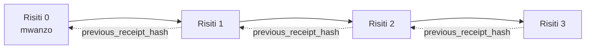

[Watch the lesson video: Securing AI Agents with Cryptographic Receipts](https://youtu.be/PLACEHOLDER_VIDEO_ID)

> _(Video ya somo na picha ndogo zitapewa na timu ya maudhui ya Microsoft baada ya muunganiko, zikifuatana na muundo wa somo la 14 / 15.)_

# Kuweka Salama Wakala wa AI kwa Kupokea kwa Usimbaji Funguo

## Utangulizi

Somo hili litajumuisha:

- Kwa nini rekodi za ufuatiliaji kwa mawakala wa AI ni muhimu kwa ufuataji sheria, utatuzi wa hitilafu, na kuaminika.
- Nini maana ya risiti ya usimbaji funguo na jinsi inavyotofautiana na mstari wa kumbukumbu usiyosainiwa.
- Jinsi ya kutoa risiti iliyosainiwa kwa simu ya chombo cha wakala kwa Python rahisi.
- Jinsi ya kuthibitisha risiti zikiwa nje ya mtandao na kugundua uharibifu.
- Jinsi ya kuunganisha risiti ili kuondoa au kubadilisha mpangilio wa moja kuvunja mnyororo.
- Nini risiti zinaonyesha na nini hazionyeshi moja kwa moja.

## Malengo ya Kujifunza

Baada ya kumaliza somo hili, utajua jinsi ya:

- Kutambua aina za kushindwa zinazochochea utambulisho wa kidijitali wa matendo ya wakala.
- Kutengeneza risiti iliyosainiwa kwa Ed25519 juu ya mzigo wa data wa JSON wa kawaida.
- Kujiridhisha na risiti kwa kutumia ufunguo wa umma wa msaini pekee.
- Kugundua uharibifu kwa kurudia uthibitisho wa risiti iliyobadilishwa.
- Kujenga mlolongo wa risiti zilizo na nambari za hash na kueleza kwa nini mlolongo huo ni muhimu.
- Kutambua kikomo kati ya kile risiti zinavyoonyesha (withamini, uadilifu, mpangilio) na kile hazionyeshi (usahihi wa kitendo, usahihi wa sera).

## Tatizo: Rekodi ya Ufuatiliaji ya Wakala Wako

Fikiria umeweka wakala wa AI kwa Contoso Travel. Wakala anasoma maombi ya wateja, anapiga simu kwenye API ya ndege kutafuta chaguzi, na anakata tiketi kwa niaba ya mteja. Robo ya mwisho, wakala alish処 50,000 za tiketi.

Leo mkaguzi anakuja. Anauliza swali rahisi: "Nioneshe kile wakala wako alifanya."

Unawasilisha faili zako za kumbukumbu. Mkaguzi anazitazama na kuuliza swali ngumu zaidi: "Nijulishe jinsi ninaweza kujua kumbukumbu hizi hazijarekebishwa?"

Hili ndilo tatizo la rekodi ya ufuatiliaji. Mamlaka nyingi za mawakala leo hutegemea:

- **Kumbukumbu za programu**: zilizoandikwa na wakala mwenyewe, na mtu yeyote mwenye ufikiaji wa mfumo wa faili anaweza kuhariri.
- **Huduma za kumbukumbu za wingu**: zinapunguza uwezekano wa uharibifu kwa ngazi ya jukwaa lakini kama mkaguzi anaamini mwendeshaji wa jukwaa.
- **Kumbukumbu za miamala ya hifadhidata**: zinafaa kwa mabadiliko ya hifadhidata lakini siyo kwa simu za zana za kawaida.

Hakuna kati ya hizi zinazoweza kujibu swali la mkaguzi bila kuhitaji kuamini mtu fulani (wewe, mtoa wingu wako, muuzaji wa hifadhidata). Kwa matumizi ya ndani, imani hiyo mara nyingi inakubalika. Kwa mizigo inayodhibitiwa (fedha, afya, chochote kinacholingana na Sheria ya AI ya EU), haitakuwa hivyo.

Risiti za usimbaji funguo hutatua hili kwa kufanya kila kitendo cha wakala kiweze kuthibitishwa kwa uhuru. Mkaguzi hahitaji kuamini wewe. Wanahitaji tu ufunguo wako wa umma na risiti yenyewe.

## Nini Risiti ya Usimbaji Funguo?

Risiti ni kitu cha JSON kinachorekodi kile wakala alichofanya, kikiwa kimesainiwa kwa saini ya kidijitali.


Risiti ndogo inaonekana hivi:

```json
{
  "type": "agent.tool_call.v1",
  "agent_id": "contoso-travel-bot",
  "tool_name": "lookup_flights",
  "tool_args_hash": "sha256:a3f9c1...",
  "result_hash": "sha256:7b2e1d...",
  "policy_id": "contoso-travel-policy-v3",
  "timestamp": "2026-04-25T14:30:00Z",
  "sequence": 47,
  "previous_receipt_hash": "sha256:9d4e6a...",
  "signature": {
    "alg": "EdDSA",
    "sig": "c5af83...",
    "public_key": "8f3b2c..."
  }
}
```

Sifa tatu ndizo kazi zinafanyika:

1. **Saini**. Risiti imesainiwa na lango la wakala kwa kutumia ufunguo wa binafsi wa Ed25519. Mtu yeyote aliye na ufunguo wa umma unaolingana anaweza kuthibitisha saini hiyo nje ya mtandao. Kuchezea sehemu yoyote kunathibitisha saini kuwa batili.

2. **Usimbaji wa kawaida**. Kabla ya kusaini, risiti hutambulishwa kwa kutumia JSON Canonicalization Scheme (JCS, RFC 8785). Hii inahakikisha kuwa mifumo miwili inayotoa risiti sawa ya mantiki itatoa matokeo yanayolingana kabisa kwa biti. Bila usimbaji huu, vianzisheji tofauti vya JSON vitatoa saini tofauti kwa maudhui sawa.

3. **Kuunganisha kwa hash**. Sehemu ya `previous_receipt_hash` inaunganisha kila risiti na ile ya kabla yake. Kuondoa au kubadilisha mpangilio wa risiti huvunja kila risiti iliyofuata. Kuchezea kunaonekane kwenye ngazi ya mlolongo hata kama saini za mtu binafsi zinapita.

Sifa hizi pamoja hutoa dhamana tatu:

- **Uthibitisho wa msaini**: ufunguo huu ulisaini maudhui haya.
- **Uadilifu**: maudhui hayajabadilika tangu kusaini.
- **Mpangilio**: risiti hii ilifuata risiti ile katika mlolongo.

## Kutengeneza Risiti kwa Python

Huna haja ya maktaba maalum kutengeneza risiti. Vifaa vya usimbaji funguo vinapatikana sana na mantiki ni mistari chache ya Python.

Mafunzo ya vitendo katika `code_samples/18-signed-receipts.ipynb` yanapitia mchakato mzima. Toleo la muhtasari:

```python
import json
import hashlib
import base64
from nacl import signing
from jcs import canonicalize  # JSON ya RFC 8785 ya kikanoni

def b64url_nopad(data: bytes) -> str:
    return base64.urlsafe_b64encode(data).decode("ascii").rstrip("=")

def sha256_canonical(obj) -> str:
    """SHA-256 of a Python object's JCS-canonical JSON form."""
    return f"sha256:{hashlib.sha256(canonicalize(obj)).hexdigest()}"

# Tengeneza au pakia ufunguo wa kusaini (katika uzalishaji, hifadhi kwenye hazina ya funguo)
signing_key = signing.SigningKey.generate()
verify_key = signing_key.verify_key

# Jenga mzigo wa risiti (bado hauna sahihi)
tool_args = {"origin": "SYD", "destination": "LAX"}
tool_result = [{"flight": "QF11", "price": 1850, "stops": 0}]

payload = {
    "type": "agent.tool_call.v1",
    "agent_id": "contoso-travel-bot",
    "tool_name": "lookup_flights",
    "tool_args_hash": sha256_canonical(tool_args),
    "result_hash": sha256_canonical(tool_result),
    "policy_id": "contoso-travel-policy-v3",
    "timestamp": "2026-04-25T14:30:00Z",
    "sequence": 0,
    "previous_receipt_hash": None,
}

# Fanya kuwa kikanoni, fanya hash, saini.
canonical_bytes = canonicalize(payload)
message_hash = hashlib.sha256(canonical_bytes).digest()
signature_bytes = signing_key.sign(message_hash).signature

# Ambatisha kitu cha saini kilicho pagazwa.
receipt = {
    **payload,
    "signature": {
        "alg": "EdDSA",
        "sig": b64url_nopad(signature_bytes),
        "public_key": b64url_nopad(bytes(verify_key)),
    },
}
```

Hilo ndilo mchakato mzima wa kusaini. Mafunzo katika kitabu cha kumbukumbu yanapitia kila hatua.

## Kuthibitisha Risiti na Kugundua Uharibifu

Kuthibitisha ni tendo la kinyume:

```python
import base64
import hashlib
from nacl import signing
from nacl.exceptions import BadSignatureError
from jcs import canonicalize

def b64url_decode(s: str) -> bytes:
    padding = "=" * ((4 - len(s) % 4) % 4)
    return base64.urlsafe_b64decode(s + padding)

def verify_receipt(receipt: dict) -> bool:
    # Saini ni kitu kilichopangwa: {"alg", "sig", "public_key"}.
    sig_obj = receipt.get("signature")
    if not sig_obj or sig_obj.get("alg") != "EdDSA":
        return False

    # Jenga upya mzigo uliosainiwa kweli (kila kitu isipokuwa saini).
    payload = {k: v for k, v in receipt.items() if k != "signature"}

    canonical_bytes = canonicalize(payload)
    message_hash = hashlib.sha256(canonical_bytes).digest()

    try:
        verify_key = signing.VerifyKey(b64url_decode(sig_obj["public_key"]))
        verify_key.verify(message_hash, b64url_decode(sig_obj["sig"]))
        return True
    except BadSignatureError:
        return False
```

Kazi hii inachukua risiti na kurudisha `True` ikiwa saini ni halali, `False` vinginevyo. Hakuna simu ya mtandao, hakuna utegemezi wa huduma, hakuna imani inayohitajika kwa mtu wa tatu.

Ili kuona jinsi kugundua uharibifu kunavyofanya kazi, kitabu cha kumbukumbu kinapitia:

1. Kutengeneza risiti halali na kuthibitisha mara moja.
2. Kubadilisha biti moja la `tool_args_hash`.
3. Kurudia uthibitisho na kuona inashindwa.

Hii ni onyesho la vitendo kuwa risiti zinathibitisha kuwa zimechezwa: marekebisho yoyote, hata ya kidogo, huvunja saini.

## Kuunganisha Risiti kwa Mawakala wa Hatua Nyingi

Risiti moja iliyosainiwa inalinda kitendo kimoja. Mlolongo wa risiti unalinda mfuatano.



Kila risiti inarekodi hash ya risiti iliyotangulia. Ili kuondoa risiti ya namba 2 kimya kimya, mshambulizi angehitaji:

- Kubadilisha sehemu ya `previous_receipt_hash` ya risiti 3 (huchangia saini ya risiti 3 kuvunjika), AU
- Kutengeneza saini mpya kwa risiti 3 iliyobadilishwa (inahitaji ufunguo binafsi wa wakala).

Ikiwa ufunguo binafsi uko kwenye hazina ya ufunguo wa vifaa na unachapisha ufunguo wa umma na kila risiti, shambulio lolote halitafanikisha bila kugunduliwa.

Kitabu cha kumbukumbu kinapitia:

1. Kujenga mlolongo wa risiti tatu.
2. Kuthibitisha kwamba sehemu ya `previous_receipt_hash` ya kila risiti inalingana na hash halisi ya risiti ya awali.
3. Kuchezea risiti moja katikati na kuona mlolongo huvunjika mahali hapo.

Hivyo ndivyo unavyotengeneza rekodi ya ufuatiliaji ambayo mkaguzi wa nje anaweza kuthibitisha bila kuamini wewe.

## Nini Risiti Zinaonyesha (na Nini Hazionyeshi)

Hii ni sehemu muhimu zaidi ya somo hili. Risiti ni zenye nguvu lakini nguvu zao zina mipaka.

**Risiti zinaonyesha mambo matatu:**

1. **Uthibitisho wa msaini**: ufunguo maalum ulisaini mzigo maalum.
2. **Uadilifu**: mzigo haujabadilika tangu kusaini.
3. **Mpangilio**: risiti hii ilifuata risiti ile katika mlolongo wa hash.

**Risiti HAZIONYESHI:**

1. **Usahihi**: kuwa kitendo cha wakala kilikuwa sahihi. Risiti inaweza kusainiwa kwa jibu lisilo sahihi kwa usafi sawa na jibu sahihi.
2. **Ufuataji wa sera**: kuwa sera iliyotajwa kwa `policy_id` ilikaguliwa kweli, au iliruhusu kitendo hiki ikiwa ingekaguliwa. Risiti inarekodi kile kilichodaiwa, si kile kilichotekelezwa.
3. **Utambulisho zaidi ya ufunguo**: risiti inasema "ufunguo huu ulisaini maudhui haya." Haitoi kusema "mtu huyu alithibitisha." Kuunganisha ufunguo na mtu au shirika kunahitaji miundombinu tofauti ya utambulisho (katalogi, rejista ya funguo za umma, nk).
4. **Ukweli wa maingizo**: ikiwa wakala anapokea maagizo yaliyobadilishwa na kuyatekeleza, risiti inarekodi kitendo kwa uaminifu. Risiti ni baada ya uthibitishaji wa ingizo, si mbadala wa uthibitishaji.

Kikomo hiki ni muhimu kwa sababu mbili:

- Kinakuambia risiti ni muhimu kwa ajili gani: kufanya tabia ya wakala ionekane na kudhibitiwa, hata kati ya mashirika tofauti.
- Kinakuambia unahitaji tabaka gani zaidi: uthibitishaji wa ingizo (Somo 6), utekelezaji wa sera (imeelezwa kwa ufupi hapa chini), na miundombinu ya utambulisho (haijazungumziwa katika somo hili).

Hitilafu ya kawaida ni kudhani "tuna risiti" inamaanisha "tumeanzisha udhibiti." Siyo hivyo. Risiti ni msingi. Udhibiti ni mfumo unaojiunda juu yake.

## Marejeleo ya Uzalishaji

Msimbo wa Python katika somo hili ni mdogo makusudi ili usome kila mstari na kuelewa siasa kamili. Kwenye uzalishaji, una chaguzi mbili:

1. **Jenga moja kwa moja juu ya msingi wa usimbaji funguo.** Mistari 50 uliyoiona hapo juu inatosha kwa matumizi mengi. PyNaCl (Ed25519) na kifurushi cha `jcs` (JSON ya kawaida) ni maktaba zenye matunzo mazuri na zimehakikiwa.

2. **Tumia maktaba ya risiti uzalishaji.** Miradi kadhaa ya chanzo huria hutekeleza muundo sawa na vipengele zaidi (mzunguko wa funguo, uthibitisho kwa kundi, usambazaji wa JWK Set, muingiliano na mashine za sera):
   - Muundo wa risiti unaotumiwa katika somo hili unafuata IETF Internet-Draft (`draft-farley-acta-signed-receipts`) ambayo iko kwenye mchakato wa viwango.
   - Microsoft Agent Governance Toolkit huunganisha risiti na maamuzi ya sera ya Cedar; angalia Mafunzo 33 katika hazina hiyo kwa mfano kamili.
   - Kifurushi cha `protect-mcp` (npm) na `@veritasacta/verify` (npm) hutoa utekelezaji wa Node wa kusaini risiti na uthibitisho nje ya mtandao, kinacholenga jumuisha seva yoyote ya MCP na njia ya kudhibiti uharibifu.
   - **[nobulex](https://github.com/arian-gogani/nobulex)** Python SDK (`pip install nobulex`) hutoa mtindo ule ule wa Ed25519 + JCS katika Python kwa muunganisho wa LangChain na CrewAI, ikijumuisha vyungu vya upimaji mchanganyiko ilivyochapishwa na ramani ya ufuataji wa kufuata kupitia [OWASP PR #2210](https://github.com/OWASP/CheatSheetSeries/pull/2210).

Uamuzi kati ya kujijengea mwenyewe au kutumia maktaba unafanana na uamuzi kati ya kuandika maktaba yako ya JWT au kutumia ile ambayo imethibitishwa: zote ni za busara; maktaba huokoa muda na kupunguza eneo la ukaguzi; njia ya kuanzia mwanzo hukufanya ufahamu kila msingi. Somo hili linakufundisha njia ya kuanzia mwanzo ili uwe nayo msingi kwa chaguo lolote.

## Jaribio la Uelewa

Jaribu uelewa wako kabla ya kuendelea na mazoezi ya vitendo.

**1. Risiti inasainiwa kwa ufunguo binafsi wa Ed25519 wa wakala. Mkaguzi ana ufunguo wa umma tu. Je, mkaguzi anaweza kuthibitisha risiti akiwa nje ya mtandao?**

<details>
<summary>Jibu</summary>

Ndiyo. Uthibitisho wa Ed25519 unahitaji ufunguo wa umma na biti zilizotiwa saini tu. Hakuna simu ya mtandao, hakuna utegemezi wa huduma. Hii ndio sifa inayofanya risiti ziwe muhimu katika mazingira yasiyounganishwa na mtandao, mashirika mengi, au hali ya kuaminiana kidogo.
</details>

**2. Mshambulizi anabadilisha sehemu ya `policy_id` ya risiti kudai ilisimamiwa na sera huruhusu zaidi. Saini ilikuwa juu ya mzigo wa awali. Nini hutokea wakati wa uthibitisho?**

<details>
<summary>Jibu</summary>

Uthibitisho hushindwa. Saini ilihesabiwa juu ya biti za kawaida (canonical) za mzigo wa awali; kubadilisha sehemu yoyote hubadilisha biti za kawaida, na kuathiri hash ya SHA-256, na kuifanya saini kuwa batili. Mshambulizi angehitaji ufunguo binafsi kutengeneza saini mpya halali, ambayo hana.
</details>

**3. Kwa nini risiti inajumuisha `tool_args_hash` na `result_hash` badala ya hoja halisi na matokeo?**

<details>
<summary>Jibu</summary>

Sababu mbili. Kwanza, risiti inaweza kuhifadhiwa au kusambazwa katika mazingira ambapo kutoa maudhui halisi (data binafsi, data ya biashara) ni tatizo. Hash hufanya risiti kuwa ndogo na maudhui kuwa ya faragha; mkaguzi anathibitisha hash inalingana na nakala tofauti ya maudhui halisi. Pili, hashi zina ukubwa uliowekwa; risiti yenye hash haiongezeki ukubwa bila kuangalia ukubwa wa maingizo na matokeo.
</details>

**4. Sehemu ya `previous_receipt_hash` inaunganisha kila risiti na yenyewe. Ikiwa mshambulizi afuta risiti moja katikati ya mlolongo kimya kimya, nini kinakuwa batili?**

<details>
<summary>Jibu</summary>

Kila risiti iliyo nyuma ya ile iliyofutwa. Sehemu zao za `previous_receipt_hash` hazibadiliani tena na mlolongo halisi (kwa sababu risiti iliorejelea haipo tena, au mlolongo sasa unaelekeza kwa risiti tofauti ya awali). Ili kuficha kufutwa, mshambulizi angenehitaji kusaini upya kila risiti iliyofuata, ambayo inahitaji ufunguo binafsi.
</details>

**5. Risiti inathibitishwa vizuri. Je, inaonyesha kitendo cha wakala kilikuwa sahihi, sawa, au kinakubaliana na sera?**

<details>
<summary>Jibu</summary>

Hapana. Risiti halali zinaonyesha mambo matatu: uthibitisho (ufunguo huu ulisaini maudhui haya), uadilifu (maudhui hayajabadilika), na mpangilio (risiti hii ilifuatia ile kwenye mlolongo wa hash). HAIIONYESHI kwamba kitendo kilikuwa sahihi, kwamba sera iliyoitwa `policy_id` ilikaguliwa, au kwamba wakala alifuata sheria zote. Risiti hufanya tabia ya wakala ionekane na kudhibitiwa, si lazima iwe sahihi. Huu ndio ukomo muhimu zaidi katika somo.
</details>

## Mazoezi ya Vitendo

Fungua `code_samples/18-signed-receipts.ipynb` na maliza sehemu zote nne:

1. **Sehemu 1**: Saidia risiti yako ya kwanza na uthibitisha.
2. **Sehemu 2**: Chezea risiti na angalia uthibitisho kushindwa.
3. **Sehemu 3**: Jenga mlolongo wa risiti tatu na uthibitishe uadilifu wa mlolongo.
4. **Sehemu 4**: Tumia muundo huo kwa wakala aliyojengwa kwa Microsoft Agent Framework: fungulia simu ya chombo katika kusaini risiti, kisha uthibitishe risiti kwa uhuru.
**Changamoto ya kujipakia 1:** ongeza sehemu ya ziada kwenye muundo wa risiti kwa chaguo lako mwenyewe (kwa mfano, nambari ya ombi kwa ufuatiliaji), sasisha mantiki ya saini halisi ili ijumuishe, na thibitisha kuwa risiti bado inarudi kupitia uthibitisho. Kisha badilisha sehemu hiyo baada ya kusaini na thibitisha uthibitisho unashindwa. Hii inakufanya kuelewa jinsi kila bait ya usanisi halisi inavyochangia saini.

**Changamoto ya kujipakia 2:** SHA-256-peleka risiti mbili zako pamoja (unganisha bait zao halisi kwa mpangilio wa hakika) na weka muhtasari uliopatikana kama sehemu mpya kwenye risiti ya tatu kabla ya kusaini. Thibitisha kuwa risiti zote tatu bado zinarudi kikamilifu. Umejenga uthibitisho wa hatua moja wa ujumuishaji: mtu yeyote mwenye risiti ya tatu anaweza kuthibitisha kuwa mbili za kwanza zilikuwepo wakati iliposisainiwa, bila kuhitaji kufichua yaliyomo. Huu ndio muundo ambao risiti za ufichuzi wa hiari hutumia kwa wingi (ahadi za Merkle, RFC 6962).

## Hitimisho

Risiti za usimbaji hutoa mawakala wa AI njia ya ukaguzi ambayo ni:

- **Inaweza kuthibitishwa kwa kujitegemea**: upande wowote wenye ufunguo wa umma anaweza kuthibitisha, bila kutegemea huduma yoyote.
- **Inayoonyesha uvunjifu wowote**: mabadiliko yoyote hubatilisha saini.
- **Inaweza kubebeka**: risiti ni faili ndogo ya JSON; inaweza kuhifadhiwa, kusambazwa, na kuthibitishwa mahali popote.
- **Inazingatia viwango**: imetengenezwa kwa Ed25519 (RFC 8032), JCS (RFC 8785), na SHA-256, zote ni mbinu maarufu zinazotumika sana.

Sio mbadala wa uthibitishaji wa maingizo, utekelezaji wa sera, au miundombinu ya utambulisho. Ni msingi wa tabaka hizo. Unapotuma mawakala kwenye kazi zilizo chini ya kanuni, mtiririko wa kazi wa mashirika mingi, au mazingira yoyote ambapo msimamizi wa baadaye hawezi kudhani kuamini, risiti ndizo zitakazofanya njia ya ukaguzi kuwa ya kuaminika.

Jambo muhimu zaidi: risiti zinathibitisha ni nani alisema nini, lini. Hazithibitishi kuwa kilichosemwa ni kweli au sahihi. Shikilia tofauti hiyo kwa ukali. Ni tofauti kati ya mfumo wa asili wa uaminifu na ule unaosema uwongo.

## Orodha ya Kuangalia uzalishaji

Unapokuwa tayari kutoka somo hili kwenda kutuma mawakala wenye risiti zilizotumwa:

- [ ] **Hamisha ufunguo wa kusaini mbali na kompyuta ya msanidi.** Tumii Azure Key Vault, AWS KMS, au moduli ya usalama wa vifaa. Funguo binafsi inayosaini risiti zako haipaswi kuwepo kwenye udhibiti wa chanzo au kwa wazi kwenye mashine za programu.
- [ ] **Chapisha ufunguo wa umma wa uthibitisho.** Wakaguzi wanahitaji ili kuthibitisha bila mtandao. Muundo wa kawaida ni Seti ya JWK kwenye URL maarufu (RFC 7517), mfano, `https://your-org.example.com/.well-known/agent-keys.json`.
- [ ] **Tambaza mnyororo nje.** Mara kwa mara andika msururu wa hali ya hivi karibuni kwenye kumbukumbu ya uwazi (Sigstore Rekor, mamlaka ya wakati wa RFC 3161, au mfumo wa ndani wa pili) ili pande za nje zipate kuthibitisha "mnyororo huu ulipo wakati huu."
- [ ] **Hifadhi risiti kwa kudumu.** Uhifadhi wa blob unaoongeza pekee (Azure Storage na sera za kudumu, AWS S3 Object Lock) unazuia mtu wa ndani kuandika historia upya kwenye tabaka la uhifadhi.
- [ ] **Amua juu ya uhifadhi wa muda mrefu.** Mpangilio wengi wa kisheria unahitaji uhifadhi wa miaka mingi. Panga ukuaji wa risiti (kila risiti ni takriban bait 500; wakala anayefanya simu 10K kwa siku huzalisha takriban GB 1.8 kwa mwaka).
- [ ] **Andika kile risiti hazijajumuisha.** Risiti zinathibitisha uthibitisho, uadilifu, na mpangilio. Mwongozo wako wa maendeshaji unapaswa kusimama wazi juu ya udhibiti wa ziada (uthibitishaji wa maingizo, utekelezaji wa sera, kupunguzwa kwa viwango, miundombinu ya utambulisho) inayolingana na risiti katika hali yako ya usimamizi.

### Una Maswali Zaidi kuhusu Kuweka Usalama wa Mawakala wa AI?

Jiunge na [Microsoft Foundry Discord](https://aka.ms/ai-agents/discord) kukutana na wasomi wengine, kuhudhuria saa za ofisi, na kupata majibu kwa maswali yako kuhusu Mawakala wa AI.

## Zaidi ya Somo Hili

Somo hili linashughulikia kusaini risiti moja na msururu wa viungo vya hash. Mifumo ile ile hutengeneza mifano mingi ya hali ya juu ambayo unaweza kukutana nayo unapoendeleza usimamizi wako:

- **Ufunuo wa hiari.** Wakati sehemu za risiti zimehifadhiwa kwa kujitegemea (mti wa Merkle wa mtindo wa RFC 6962), unaweza kufichua sehemu maalum kwa wakaguzi maalum na kuthibitisha zinabaki bila mabadiliko bila kuonyesha yaliyomo. Inafaa wakati risiti ile ile inapaswa kuridhisha ukaguzi kamili (unaotaka ukamilifu) pamoja na kanuni za kupunguza data kama GDPR (zinapotaka mkaguzi aone kidogo sana kinachohitajika).
- **Kuondolewa kwa risiti.** Ikiwa ufunguo wa kusaini umedukuliwa, unahitaji njia ya kuonyesha risiti zote zilizosainiwa na ufunguo huo kuwa hazinaaminiki kuanzia wakati fulani. Mifano ya kawaida: funguo za kusaini zenye muda mfupi pamoja na orodha ya kuondolewa iliyochapishwa, au kumbukumbu ya uwazi yenye pembejeo za kuondolewa.
- **Risiti za saini za pande mbili / saini zilizogawanyika.** Baadhi ya utekelezaji hugawanya mizigo iliyosainiwa kwa sehemu za awali (`authorization_*`) na baada ya utekelezaji (`result_*`) zenye saini za kujitegemea, zinalingana wakati uamuzi wa ruhusa na matokeo yanayohusika hutolewa na wahusika tofauti au nyakati tofauti. Hii hujumuishwa juu ya muundo wa risiti uliotolewa katika somo hili.
- **Muundo wa mizigo.** Risiti huweka ataibitisha baiti yoyote ulioweka kwenye `result_hash`. Mizigo halisi mara nyingi huwa tajiri kuliko matokeo moja ya simu ya zana: mafikiri kabla ya uamuzi (utabiri wa mfano, chaguzi zilizozingatiwa, ushahidi na ukamilifu wake, mtazamo wa hatari, mnyororo wa uwajibikaji, matokeo ya lango) yote yanaweza kuwepo ndani ya mzigo, yamefungwa na risiti moja. Hii hufanya muundo wa risiti kudumisha unyenyekevu huku ikiruhusu miundo ya mzigo kuendelea kukua kwa nyanja tofauti.
- **Ulinganifu wa utekelezaji mbalimbali.** Utekelezaji huru wa muundo sawa wa risiti (Python, TypeScript, Rust, Go) hupima uthibitishaji dhidi ya majalada ya mtihani ya pamoja. Ukijenga utekelezaji wako, kuthibitisha dhidi ya majalada haya yaliyotangazwa kunathibitisha uvumilivu wa waya.
- **Uhamisho baada ya quantum.** Ed25519 hutumika sana leo lakini si kinga dhidi ya quantum. Muundo wa risiti una wepesi wa mabadiliko ya algoriti: sehemu `signature.alg` inaweza kubeba `ML-DSA-65` (kielelezo cha saini baada ya quantum cha NIST) wakati unahitaji kuhamia. Panga kipindi cha mpito ambapo risiti husainiwa mara mbili.

## Rasilimali Zaidi

- <a href="https://datatracker.ietf.org/doc/draft-farley-acta-signed-receipts/" target="_blank">IETF Internet-Draft: Risiti za Maamuzi Zilizotiwa Saini kwa Udhibiti wa Upatikanaji wa Mashine kwa Mashine</a>
- <a href="https://learn.microsoft.com/azure/ai-studio/responsible-use-of-ai-overview" target="_blank">Muhtasari wa AI ya Kuwajibika (Azure AI)</a>
- <a href="https://datatracker.ietf.org/doc/html/rfc8032" target="_blank">RFC 8032: Algoriti ya Saini ya Kidigitali ya Mviringo wa Edwards (EdDSA)</a>
- <a href="https://datatracker.ietf.org/doc/html/rfc8785" target="_blank">RFC 8785: Mpango wa Kuifanya JSON Iwe Halisi (JCS)</a>
- <a href="https://datatracker.ietf.org/doc/html/rfc6962" target="_blank">RFC 6962: Uwajibikaji wa Cheti</a> (Ujenzi wa mti wa Merkle unaotumika na risiti za ufichuzi wa hiari)
- <a href="https://github.com/microsoft/agent-governance-toolkit/blob/main/docs/tutorials/33-offline-verifiable-receipts.md" target="_blank">Mfuko wa Zana za Usimamizi wa Mwakala wa Microsoft, Mafunzo 33: Risiti za Maamuzi Zinazothibitishwa Bila Mtandao</a>
- <a href="https://github.com/ScopeBlind/agent-governance-testvectors" target="_blank">Jamii ya Majalada ya Mtihani ya Ulinganifu kwa muundo wa risiti unaotumiwa katika somo hili (Apache-2.0)</a>
- <a href="https://pynacl.readthedocs.io/" target="_blank">Hati za PyNaCl</a> (Ed25519 kwa Python)

## Somo lililopita

[Kuunda Mawakala wa Matumizi ya Kompyuta (CUA)](../15-browser-use/README.md)

## Somo lijalo

_(Litaamuliwa na wasimamiaji wa mtaala)_

---

<!-- CO-OP TRANSLATOR DISCLAIMER START -->
**Kionyozo**:
Hati hii imetafsiriwa kwa kutumia huduma ya tafsiri ya AI [Co-op Translator](https://github.com/Azure/co-op-translator). Ingawa tunajitahidi kupata usahihi, tafadhali fahamu kwamba tafsiri za kiotomatiki zinaweza kuwa na makosa au upungufu wa usahihi. Hati ya asili katika lugha yake halisi inapaswa kuchukuliwa kama chanzo cha mamlaka. Kwa taarifa muhimu, tafsiri ya kitaalamu inayofanywa na binadamu inapendekezwa. Hatutojibu kwa kuelewa vibaya au tafsiri potofu zinazotokea kutokana na matumizi ya tafsiri hii.
<!-- CO-OP TRANSLATOR DISCLAIMER END -->