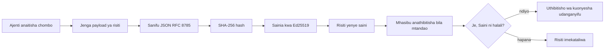
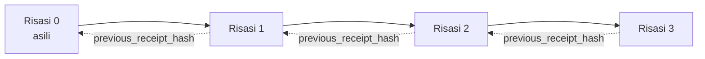

[Angalia video ya somo: Kuweka Usalama wa Wakala za AI kwa Risiti za Kidigitali](https://youtu.be/PLACEHOLDER_VIDEO_ID)

> _(Video ya somo na picha ya kichwa itaongezwa na timu ya maudhui ya Microsoft baada ya muunganiko, ikilingana na muundo wa somo la 14 / 15.)_

# Kuweka Usalama wa Wakala za AI kwa Risiti za Kidigitali

## Utangulizi

Somo hili litalifunua:

- Kwa nini njia za ukaguzi kwa makala za AI ni muhimu kwa mzingiro, utatuzi wa matatizo, na uaminifu.
- Risiti ya kidigitali ni nini na inatofautianaje na mstari wa kumbukumbu usiosainiwa.
- Jinsi ya kuunda risiti iliyosainiwa kwa simu ya zana ya wakala kwa Python rahisi.
- Jinsi ya kuthibitisha risiti bila mtandao na kugundua uharifu.
- Jinsi ya kuunganisha risiti ili kuondoa au kubadilisha mpangilio dhidi huvunja mnyororo.
- Risiti huonyesha nini na hasa hazionyeshi nini.

## Malengo ya Kujifunza

Baada ya kumaliza somo hili, utajua jinsi ya:

- Kutambua njia za kushindwa zinazohamasisha uthibitisho wa kidigitali wa matendo ya wakala.
- Kuunda risiti iliyosainiwa kwa Ed25519 juu ya kifurushi cha JSON cha kawaida.
- Kuthibitisha risiti kwa uhuru kwa kutumia tu ufunguo wa umma wa msaini.
- Kugundua uharifu kwa kuendesha tena uthibitisho kwenye risiti iliyobadilishwa.
- Kujenga mnyororo wa risiti uliojengwa kwa heshari na kueleza kwa nini mnyororo ni muhimu.
- Kutambua mipaka kati ya kile risiti huonyesha (mwenye saini, usahihi, mpangilio) na kile hazionyeshi (usahihi wa tendo, ugumu wa sera).

## Tatizo: Njia ya Ukaguzi ya Wakala Wako

Fikiria umeanzisha wakala wa AI kwa Contoso Travel. Wakala anasoma maombi ya mteja, anaita API ya ndege kupata chaguzi, na anahifadhi viti kwa niaba ya mteja. Robo ya mwisho, wakala alishughulikia uhifadhi wa tiketi 50,000.

Leo mkaguzi anakuja. Anauliza swali rahisi: "Nionyeshe kile wakala wako alifanya."

Unamkabidhi faili zako za kumbukumbu. Mkaguzi anazitazama na kuuliza swali gumu zaidi: "Ninawezaje kujua kumbukumbu hizi hazijarekebishwa?"

Huu ndio tatizo la njia ya ukaguzi. Maenezi mengi ya wakala leo hutegemea:

- **Kumbukumbu za maombi**: zilizoandikwa na wakala mwenyewe, zinabadiliwa na yeyote mwenye ufikiaji wa mfumo wa faili.
- **Huduma za kumbukumbu za wingu**: zinathibitisha uharifu kwenye ngazi ya jukwaa lakini ikiwa mkaguzi anamtambua mmiliki wa jukwaa.
- **Kumbukumbu za muamala wa hifadhidata**: zinafaa kwa mabadiliko ya hifadhidata lakini si kwa simu za zana yoyote.

Hakuna kati ya hizi zinazoweza kujibu swali la mkaguzi bila kumtaka mkaguzi kuamini mtu (wewe, muuzaji wa huduma ya wingu, muuzaji wa hifadhidata). Kwa matumizi ya ndani, uaminifu huo mara nyingi unakubalika. Kwa mizigo iliyo chini ya kanuni (fedha, huduma za afya, chochote chini ya Sheria ya AI ya EU), haikubaliki.

Risiti za kidigitali hutatua hili kwa kufanya kila tendo la wakala kuthibitishwa kwa uhuru. Mkaguzi hahitaji kuamini wewe. Wanahitaji tu ufunguo wako wa umma na risiti yenyewe.

## Risiti ya Kidigitali ni Nini?

Risiti ni kitu cha JSON kinachoandika kile wakala alifanya, kimesainiwa kwa saini ya kidigitali.



Risiti ndogo inaonekana hivi:

```json
{
  "type": "agent.tool_call.v1",
  "agent_id": "contoso-travel-bot",
  "tool_name": "lookup_flights",
  "tool_args_hash": "sha256:a3f9c1...",
  "result_hash": "sha256:7b2e1d...",
  "policy_id": "contoso-travel-policy-v3",
  "timestamp": "2026-04-25T14:30:00Z",
  "sequence": 47,
  "previous_receipt_hash": "sha256:9d4e6a...",
  "signature": {
    "alg": "EdDSA",
    "sig": "c5af83...",
    "public_key": "8f3b2c..."
  }
}
```

Sifa tatu zinafanya kazi:

1. **Saini**. Risiti inasainiwa na lango la wakala kwa kutumia ufunguo wa binafsi wa Ed25519. Yeyote mwenye ufunguo wa umma unaolingana anaweza kuthibitisha saini haina dosari bila mtandao. Kubadilisha sehemu yoyote kuharibu saini.

2. **Uundo wa kawaida**. Kabla ya kusaini, risiti huandikwa kwa kutumia Mpangilio wa Kiufundi wa JSON (JCS, RFC 8785). Hii inahakikisha kuwa utekelezaji mbili zinazozalisha risiti ya maana ile ile huunda matokeo sawa ya biti. Bila uundaji wa kawaida, watangazaji tofauti wa JSON wangeweza kutoa saini tofauti kwa maudhui hayo hayo.

3. **Uunganishaji wa heshari**. Sehemu ya `previous_receipt_hash` inaunganisha risiti kila moja na ile ya kabla yake. Kuondoa au kubadilisha mchakato wa risiti hubomoa kila risiti iliyofuata. Uharibifu unaonekana katika ngazi ya mnyororo hata kama saini binafsi zinapita.

Hizi sifa pamoja hutoa dhamana tatu:

- **Mwenye saini**: ufunguo huu ulisaini maudhui haya.
- **Uaminifu**: maudhui hayjakubadilika tangu kusainiwa.
- **Mpangilio**: risiti hii ilifuata ile risiti katika mnyororo.

## Kutengeneza Risiti kwa Python

Huhitaji maktaba maalum kutengeneza risiti. Misingi ya kidigitali ipo wazi na mantiki ni mistari michache tu ya Python.

Mazoezi ya vitendo katika `code_samples/18-signed-receipts.ipynb` yanapitia mchakato wote. Toleo la muhtasari:

```python
import json
import hashlib
import base64
from nacl import signing
from jcs import canonicalize  # JSON halali ya RFC 8785

def b64url_nopad(data: bytes) -> str:
    return base64.urlsafe_b64encode(data).decode("ascii").rstrip("=")

def sha256_canonical(obj) -> str:
    """SHA-256 of a Python object's JCS-canonical JSON form."""
    return f"sha256:{hashlib.sha256(canonicalize(obj)).hexdigest()}"

# Tengeneza au pakua funguo la kusaini (katika uzalishaji, hifadhi kwenye hazina ya funguo)
signing_key = signing.SigningKey.generate()
verify_key = signing_key.verify_key

# Jenga mzigo wa risiti (bado hakuna saini)
tool_args = {"origin": "SYD", "destination": "LAX"}
tool_result = [{"flight": "QF11", "price": 1850, "stops": 0}]

payload = {
    "type": "agent.tool_call.v1",
    "agent_id": "contoso-travel-bot",
    "tool_name": "lookup_flights",
    "tool_args_hash": sha256_canonical(tool_args),
    "result_hash": sha256_canonical(tool_result),
    "policy_id": "contoso-travel-policy-v3",
    "timestamp": "2026-04-25T14:30:00Z",
    "sequence": 0,
    "previous_receipt_hash": None,
}

# Fanya kuwa halali, pata hash, saini.
canonical_bytes = canonicalize(payload)
message_hash = hashlib.sha256(canonical_bytes).digest()
signature_bytes = signing_key.sign(message_hash).signature

# Ambatisha kitu cha saini kilichoandaliwa.
receipt = {
    **payload,
    "signature": {
        "alg": "EdDSA",
        "sig": b64url_nopad(signature_bytes),
        "public_key": b64url_nopad(bytes(verify_key)),
    },
}
```

Hii ndiyo njia yote ya usaini. Mazoezi kwenye daftari hutembea kila hatua.

## Kuthibitisha Risiti na Kugundua Uharibifu

Uthibitisho ni kinyume:

```python
import base64
import hashlib
from nacl import signing
from nacl.exceptions import BadSignatureError
from jcs import canonicalize

def b64url_decode(s: str) -> bytes:
    padding = "=" * ((4 - len(s) % 4) % 4)
    return base64.urlsafe_b64decode(s + padding)

def verify_receipt(receipt: dict) -> bool:
    # Saini ni kitu kilichoandaliwa: {"alg", "sig", "public_key"}.
    sig_obj = receipt.get("signature")
    if not sig_obj or sig_obj.get("alg") != "EdDSA":
        return False

    # Jenga upya mzigo uliosainiwa kweli (kila kitu isipokuwa saini).
    payload = {k: v for k, v in receipt.items() if k != "signature"}

    canonical_bytes = canonicalize(payload)
    message_hash = hashlib.sha256(canonical_bytes).digest()

    try:
        verify_key = signing.VerifyKey(b64url_decode(sig_obj["public_key"]))
        verify_key.verify(message_hash, b64url_decode(sig_obj["sig"]))
        return True
    except BadSignatureError:
        return False
```

Kazi hii huchukua risiti na kurudisha `True` ikiwa saini ni halali, `False` vinginevyo. Hakuna simu za mtandao, hakuna utegemezi wa huduma, hakuna hitaji la kuamini mtu wa tatu.

Ili kuona kugundua uharibifu kwa vitendo, daftari linapitia:

1. Kutengeneza risiti halali na kuthibitisha.
2. Kubadilisha biti moja ya sehemu `tool_args_hash`.
3. Kuendesha uthibitisho tena na kuona kutofaulu.

Hii ni onyesho la vitendo kwamba risiti hubainisha uharibifu: mabadiliko yoyote, hata mdogo, huvunja saini.

## Kuunganisha Risiti kwa Wakala wa Hatua Nyingi

Risiti moja iliyosainiwa inalinda tendo moja. Mnyororo wa risiti hulinda mfululizo.



Kila risiti hurekodi thamani ya heshari ya risiti ya kabla yake. Kuondoa risiti ya 2 kimya kimya, mshambuliaji atahitaji:

- Kubadilisha sehemu ya `previous_receipt_hash` ya risiti ya 3 (hubomoa saini ya risiti ya 3), AU
- Kutengeneza saini mpya ya risiti 3 iliyobadilishwa (inahitaji ufunguo binafsi wa wakala).

Ikiwa ufunguo binafsi uko kwenye hazina ya nyumbani wa kifaa na unaweka ufunguo wa umma na risiti, hakuna shambulio linalowezekana bila kugunduliwa.

Daftari linapitia:

1. Kujenga mnyororo wa risiti tatu.
2. Kuthibitisha kuwa `previous_receipt_hash` ya kila risiti inalingana na heshari halisi ya risiti ya awali.
3. Kufanya uharibifu kwa risiti moja katikati na kuona mnyororo unavunjika sehemu hiyo kabisa.

Hii ndiyo unavyotengeneza njia ya ukaguzi ambayo mkaguzi wa nje anaweza kuthibitisha bila kuamini wewe.

## Risiti Huonyesha Nini (na Hazionyeshi Nini)

Huu ni sehemu muhimu zaidi ya somo hili. Risiti ni za nguvu lakini nguvu zao zina mipaka.

**Risiti huonyesha vitu vitatu:**

1. **Mwenye saini**: ufunguo maalum ulisaini kifurushi maalum.
2. **Uaminifu**: kifurushi hakijabadilika tangu kusainiwa.
3. **Mpangilio**: risiti hii ilifuata risiti hiyo katika mnyororo wa heshari.

**Risiti hazionyesha:**

1. **Usahihi**: kuwa tendo la wakala lilikuwa sahihi. Risiti inaweza kusainiwa kwa jibu lisilo sahihi kama vile kwa jibu sahihi.
2. **Uzingatiaji wa sera**: kuwa sera iliyotajwa katika `policy_id` ilikaguliwa kweli, au ingeruhusu tendo hili ikiwa ingekaguliwa. Risiti inaandika kilichodaiwa, si kilichotekelezwa.
3. **Utambulisho zaidi ya ufunguo**: risiti inasema "ufunguo huu ulisaini maudhui haya." Haisemi "mtu huyu aliruhusu hili." Kuunganisha ufunguo na mtu au shirika kunahitaji miundombinu tofauti (katalogi, rejista ya funguo za umma, nk).
4. **Ukweli wa ingizo**: ikiwa wakala anapokea ombi lililodanganywa na kutenda kulingana nalo, risiti inaandika tendo kwa uaminifu. Risiti ni chini ya tathmini ya ingizo, si mbadala wake.

Mipaka hii ni muhimu kwa sababu mbili:

- Inaeleza ni kwa nini risiti zinatumika: kufanya mienendo ya wakala iongezwe ukaguzi na kugundua uharibifu, hata kati ya mashirika tofauti.
- Inaeleza tabaka za ziada unazohitaji: tathmini ya ingizo (Somo 6), utekelezaji wa sera (ulioelezwa kidogo hapa chini), na miundombinu ya utambulisho (si kwa somo hili).

Kosa la kawaida ni kudhani kuwa "tuna risiti" maana yake "tuna utawala." Hilo si kweli. Risiti ni msingi. Utawala ni mfumo unaojengwa juu yake.

## Marejeleo ya Uzalishaji

Msimbo wa Python katika somo hili ni mdogo kwa makusudi ili uweze kusoma kila mstari na kuelewa kinachotokea. Katika uzalishaji, una chaguzi mbili:

1. **Jenga moja kwa moja juu ya misingi ya kidigitali.** Mistari 50 uliyoyaona hapo juu inatosha kwa matumizi mengi. PyNaCl (Ed25519) na kifurushi `jcs` (JSON ya kawaida) ni maktaba zilizo imara na zilizoangaliwa.
 
2. **Tumia maktaba ya risiti ya uzalishaji.** Miradi kadhaa ya chanzo huria hufanya mfumo huo huo na vipengele vya ziada (mzunguko wa ufunguo, uthibitisho wa kundi, usambazaji wa JWK Set, ujumuishaji na injini za sera):
   - Muundo wa risiti unaotumiwa katika somo hili unafuata Rasimu ya IETF Internet-Draft (`draft-farley-acta-signed-receipts`) ambayo iko katika hatua ya viwango.
   - Microsoft Agent Governance Toolkit hutunga risiti na maamuzi ya sera za Cedar; angalia Funzo 33 katika hifadhidata hiyo kwa mfano wa mwanzo hadi mwisho.
   - Kifurushi cha `protect-mcp` (npm) na `@veritasacta/verify` (npm) hutoa utekelezaji wa Node wa usaini wa risiti na uthibitisho wa bila mtandao, zimetengenezwa kwa kufunika seva yoyote ya MCP na njia ya ukaguzi isiyoweza kuharibiwa.

Uamuzi kati ya kuandika yako mwenyewe na kutumia maktaba unafanana na uamuzi wa kuandika maktaba yako ya JWT au kutumia ile iliyojaribiwa: zote ni busara; maktaba huokoa muda na hupunguza maeneo ya ukaguzi; njia ya kuanzia mtandaoni hukufanya uelewe kila msingi. Somo hili linakufundisha njia ya kuanzia ili uwe na msingi kwa chaguo lolote.

## Kagua Maarifa

Jaribu ufahamu wako kabla ya kuhamia zoezi la vitendo.

**1. Risiti imesainiwa kwa ufunguo wa Ed25519 wa wakala binafsi. Mkaguzi ana ufunguo wa umma tu. Je, mkaguzi anaweza kuthibitisha risiti bila mtandao?**

<details>
<summary>Jibu</summary>

Ndiyo. Uthibitisho wa Ed25519 unahitaji tu ufunguo wa umma na biti zilizosainiwa. Hakuna simu za mtandao, hakuna utegemezi wa huduma. Hii ni sifa inayofanya risiti zifae katika mazingira ya mtandao wa kiwamba, mashirika mengi, au mazingira ya ukaguzi wa uaminifu mdogo.
</details>

**2. Mshambuliaji anabadilisha sehemu ya `policy_id` ya risiti kudai ilidhibitiwa na sera ya kuruhusu zaidi. Saini ilikuwa juu ya kifurushi cha awali. Nini hutokea wakati wa uthibitisho?**

<details>
<summary>Jibu</summary>

Uthibitisho unashindwa. Saini ilihesabiwa juu ya biti ya kawaida ya kifurushi cha awali; kubadilisha sehemu yoyote hubadilisha biti za kawaida, ambazo hubadilisha heshari ya SHA-256, na kuifanya saini kuwa batili. Mshambuliaji angenahitaji ufunguo binafsi kutengeneza saini mpya halali, ambayo hawana.
</details>

**3. Kwa nini risiti inajumuisha `tool_args_hash` na `result_hash` badala ya hoja halisi na matokeo?**

<details>
<summary>Jibu</summary>

Sababu mbili. Kwanza, risiti inaweza kuhifadhiwa au kusambazwa katika mazingira ambapo kufichua maudhui halisi (Taarifa za kibinafsi, data ya biashara) ni tatizo. Kuhifadhi heshari hufanya risiti kuwa ndogo na maudhui yako binafsi; mkaguzi anathibitisha kuwa heshari inalingana na nakala iliyohifadhiwa tofauti ya maudhui halisi. Pili, heshari zina ukubwa thabiti; risiti yenye heshari ina ukubwa wa kawaida bila kujali ukubwa wa pembejeo na matokeo.
</details>

**4. Sehemu ya `previous_receipt_hash` inaunganisha kila risiti na ile ya awali. Ikiwa mshambuliaji afuta moja risiti katikati ya mnyororo kwa utulivu, nini hubatilika?**

<details>
<summary>Jibu</summary>

Kila risiti iliyofuata ile iliyofutwa. Sehemu zao za `previous_receipt_hash` haziungani tena na mnyororo halisi (kwani risiti walizorejelea haipo tena, au mnyororo sasa unarejelea ziada nyingine). Kuficha ufutaji, mshambuliaji angenahitaji kusaini tena kila risiti iliyofuata, ambayo inahitaji ufunguo binafsi.
</details>

**5. Risiti inathibitishwa kwa usahihi. Je, hiyo inaonyesha tendo la wakala lilikuwa sahihi, thabiti, au linafuata sera?**

<details>
<summary>Jibu</summary>

Hapana. Risiti halali huonyesha vitu vitatu: mwenye saini (ufunguo huu ulisaini maudhui haya), uaminifu (maudhui hayajakubadilika), na mpangilio (risiti hii ilifuata ile risiti). HAIONYESHI kuwa tendo lilikuwa sahihi, kuwa sera iliyotajwa katika `policy_id` ilikaguliwa kweli, au kuwa wakala alifuata sheria zote. Risiti zinafanya mienendo ya wakala ukuba ya kukaguliwa, si lazima sahihi. Hii ni mipaka muhimu zaidi katika somo.
</details>

## Zoezi la Vitendo

Fungua `code_samples/18-signed-receipts.ipynb` na ukamilishe sehemu zote nne:

1. **Sehemu 1**: Saini risiti yako ya kwanza na uthibitishe.
2. **Sehemu 2**: Haribu risiti na uone uthibitisho bustani.
3. **Sehemu 3**: Tengeneza mnyororo wa risiti tatu na uthibitishe usahihi wa mnyororo.
4. **Sehemu 4**: Tumia muundo huo kwa wakala aliyejengwa na Microsoft Agent Framework: funika simu ya zana katika usaini wa risiti, kisha uthibitishe risiti huru.

**Changamoto ya ziada 1:** Panua muundo wa risiti kwa uwanja mwingine utakaochagua (mfano, kitambulisho cha ombi kwa kufuatilia), sasisha mantiki ya kusaini ya kawaida kuijumuisha, na thibitisha risiti bado inazunguka kupitia uthibitisho. Kisha badilisha uwanja baada ya kusaini na thibitisha uthibitisho unashindwa. Hii inakufanya uelewe jinsi kila biti ya uundaji wa kawaida inavyochangia saini.
**Changamoto ya Kunyoosha 2:** SHA-256-fanya hash ya risiti zako mbili pamoja (unganisha baiti zao za kawaida kwa mpangilio wa uhakika) na weka kidonge kinachotokana kama sehemu mpya kwenye risiti ya tatu kabla ya kuisaini. Hakikisha kwamba risiti zote tatu bado zinaweza kuhakikishwa. Umejenga uthibitisho wa ujumuishaji wa hatua moja: mtu yeyote aliye na risiti ya tatu anaweza kuthibitisha risiti za kwanza mbili zilikuwepo wakati ziliposainiwa, bila haja ya kufichua yaliyomo. Huu ni mtindo ambao risiti za ufichaji uchaguzi hutumia kwa wingi (ahadi za Merkle, RFC 6962).

## Hitimisho

Risiti za usimbaji hutoa mawakala wa AI njia ya ukaguzi ambayo ni:

- **Inayothibitishwa kwa kujitegemea**: upande wowote wenye ufunguo wa umma anaweza kuthibitisha, hakuna utegemezi wa huduma.
- **Inaonyesha uharibifu**: mabadiliko yoyote huibatilisha saini.
- **Inayosafirishika**: risiti ni faili ndogo ya JSON; inaweza kuhifadhiwa, kusambazwa, na kuthibitishwa mahali popote.
- **Inayolingana na viwango**: imejengwa juu ya Ed25519 (RFC 8032), JCS (RFC 8785), na SHA-256, vyote ni mbinu zinazotumika sana.

Hazibadilishi uthibitishaji wa maingizo, utekelezaji wa sera, au miundombinu ya utambulisho. Ni msingi wa safu hizo. Unapowatangaza mawakala kwa kazi zilizo na kanuni, njia za kazi za mashirika mengi, au mazingira ambapo mkaguzi wa baadaye hawezi kudhaniwa kukuamini, risiti ndizo zinazofanya njia ya ukaguzi iwe ya kuaminika.

Jambo muhimu zaidi: risiti zinathibitisha nani alisema nini, na lini. Hazithibitishi kwamba kilichosemwa ni kweli au sahihi. Shikilia tofauti hiyo kwa umakini. Ni tofauti kati ya mfumo wa asili wa uaminifu na ule unaochanganya.

## Orodha ya Uzalishaji

Unapokuwa tayari kutoka somo hili kuingia kwenye kutumia mawakala waliotiwa saini za risiti katika mazingira halisi:

- [ ] **Hamisha ufunguo wa kusaini mbali na kompyuta ya msanidi.** Tumia Azure Key Vault, AWS KMS, au kifaa cha usalama cha vifaa. Ufunguaji wa kibinafsi unaosaini risiti zako haupaswi kuishi katika udhibiti wa chanzo au kwenye maandishi wazi kwenye mashine za programu.
- [ ] **Chapisha ufunguo wa umma wa uthibitishaji.** Makaguzi wanahitaji ili kuthibitisha kwa mtandao usio na muunganisho. Mtindo wa kawaida ni JWK Set kwenye URL inayojulikana vizuri (RFC 7517), mfano `https://your-org.example.com/.well-known/agent-keys.json`.
- [ ] **Funga mlolongo nje.** Mara kwa mara andika alama ya kichwa cha mlolongo wa hivi karibuni kwenye rekodi ya uwazi (Sigstore Rekor, mamlaka ya kuwakilisha saiti ya RFC 3161, au mfumo wa ndani wa pili) ili upande wa nje uthibitishe "mlolongo huu ulikuwa upo wakati huu."
- [ ] **Hifadhi risiti kwa njia isiyobadilika.** Hifadhi ya blob ya ongezeko pekee (Azure Storage yenye sera za kutohamisha, AWS S3 Object Lock) inazuia mtu wa ndani kuandika tena historia kwenye kiwango cha kuhifadhi.
- [ ] **Amua kuhusu uhifadhi.** Nchini nyingi zinasema kuhifadhi kwa miaka mingi. Panga ukuaji wa risiti (kila risiti ni takriban baiti 500; wakala anayefanya simu 10,000 kwa siku atazalisha GB 1.8 kwa mwaka).
- [ ] **Andika kile risiti hazijagusa.** Risiti zinathibitisha utoaji, uadilifu, na utaratibu. Kitabu chako cha taratibu kinapaswa kuorodhesha wazi udhibiti wa ziada (uthibitishaji wa maingizo, utekelezaji wa sera, ukomo wa kiwango, miundombinu ya utambulisho) unaoendana na risiti katika sera yako ya usimamizi.

### Je, Una Maswali Zaidi Kuhusu Kuweka Salama Mawakala wa AI?

Jiunge na [Microsoft Foundry Discord](https://aka.ms/ai-agents/discord) ili kukutana na wengine wanaojifunza, kuhudhuria saa za ofisi, na kupata majibu ya maswali yako kuhusu Mawakala wa AI.

## Zaidi Ya Somo Hili

Somo hili linashughulikia kusaini risiti moja na mfululizo wa hash-chain. Mbinu zile zile zinaunganisha kwa mifumo mingi ya hali ya juu unaweza kukutana nayo kadri sera yako inavyoimarika:

- **Ufichaji wa uchaguzi.** Wakati sehemu za risiti zimejizatiti kwa kujitegemea (mti wa Merkle wa RFC 6962), unaweza kufichua sehemu maalum kwa wakaguzi maalum na kuthibitisha sehemu nyingine hazijabadilika bila kuzijulisha. Inafaa wakati risiti ile ile inapaswa kuridhisha ukaguzi kamili (unaotaka ukamilifu) na kanuni za kupunguza data kama GDPR (zinazotaka mkaguzi aone kidogo kinachohitajika tu).
- **Ufutaji wa risiti.** Ikiwa ufunguo wa kusaini umevurugika, unahitaji njia ya kuonyesha risiti zote zilizosainiwa na ufunguo huo hazina kuaminika kuanzia wakati fulani. Mifumo ya kawaida: funguo za kusaini za muda mfupi pamoja na orodha ya ufutaji iliyochapishwa, au rekodi ya uwazi yenye kumbukumbu za ufutaji.
- **Risiti za saini za pande mbili / zenye kugawanyika.** Baadhi ya utekelezaji hugawanya mzigo uliosainiwa katika nusu kabla ya utekelezaji (`authorization_*`) na nusu baada ya utekelezaji (`result_*`) zenye saini za kujitegemea, zenye faida pale uamuzi wa idhini na matokeo yaliyoshuhudiwa yanapotolewa na watu tofauti au kwa nyakati tofauti. Hii inaongeza huduma zaidi juu ya muundo wa risiti uliofunzwa katika somo hili.
- **Muundo wa mzigo wa data.** Risiti inafunga baiti yoyote kuwekwa katika `result_hash`. Mzigo halisi mara nyingi ni zaidi kuliko matokeo ya wito mmoja wa zana: hoja kabla ya uamuzi (utabiri wa mfano, chaguzi zilizozingatiwa, ushahidi na ukamilifu wake, mtazamo wa hatari, mlolongo wa uwajibikaji, matokeo ya lango) yote yanaweza kuwepo ndani ya mzigo, yamefungwa na risiti moja. Hii huweka muundo wa risiti kuwa mdogo huku kuruhusu mipangilio ya mzigo kuendelea kukuwa kwa maeneo tofauti.
- **Ulinganifu kati ya utekelezaji.** Utekelezaji mengi huru wa muundo huo huo wa risiti (Python, TypeScript, Rust, Go) hujaribu uthibitisho dhidi ya mabeba ya majaribio yaliyo sambazwa. Ukiunda utekelezaji wako, kuthibitisha dhidi ya vector zilizochapishwa kunathibitisha usahihi wa waya.
- **Uhamisho baada ya wingi wa quantum.** Ed25519 hutumika sana leo lakini si imara dhidi ya quantum. Muundo wa risiti ni wa kuelea kwa algoriti: sehemu ya `signature.alg` inaweza kubeba `ML-DSA-65` (alama ya baada ya quantum ya NIST) unapohitaji kuhamia. Panga kipindi cha mpito ambapo risiti zitasaidiwa saini mara mbili.

## Rasilimali Zaidi

- <a href="https://datatracker.ietf.org/doc/draft-farley-acta-signed-receipts/" target="_blank">IETF Internet-Draft: Risiti za Maamuzi Zilizotiwa Saini kwa Kuzuia Upatikanaji wa Mashine kwa Mashine</a>
- <a href="https://learn.microsoft.com/azure/ai-studio/responsible-use-of-ai-overview" target="_blank">Muhtasari wa AI yenye Uwajibikaji (Azure AI)</a>
- <a href="https://datatracker.ietf.org/doc/html/rfc8032" target="_blank">RFC 8032: Algoriti ya Saini Dijitali ya Curve ya Edwards (EdDSA)</a>
- <a href="https://datatracker.ietf.org/doc/html/rfc8785" target="_blank">RFC 8785: Mpangilio wa Kanoni wa JSON (JCS)</a>
- <a href="https://datatracker.ietf.org/doc/html/rfc6962" target="_blank">RFC 6962: Uwiano wa Cheti</a> (ujenzi wa mti wa Merkle unaotumiwa na risiti za ufichaji uchaguzi)
- <a href="https://github.com/microsoft/agent-governance-toolkit/blob/main/docs/tutorials/33-offline-verifiable-receipts.md" target="_blank">Kitengo cha Zana za Usimamizi wa Mawala wa Microsoft, Mafunzo 33: Risiti za Maamuzi Zinazothibitishwa Offline</a>
- <a href="https://github.com/ScopeBlind/agent-governance-testvectors" target="_blank">Vector za majaribio ya ulinganifu wa utekelezaji kwa muundo wa risiti ulio tumika katika somo hili (Apache-2.0)</a>
- <a href="https://pynacl.readthedocs.io/" target="_blank">Nyaraka za PyNaCl</a> (Ed25519 katika Python)

## Somo Lililopita

[Kuunda Mawakala wa Matumizi ya Kompyuta (CUA)](../15-browser-use/README.md)

## Somo Linalofuata

_(Litaamuliwa na wasimamizi wa mtaala)_

---

<!-- CO-OP TRANSLATOR DISCLAIMER START -->
**Kionyozo**:
Hati hii imetafsiriwa kwa kutumia huduma ya tafsiri ya AI [Co-op Translator](https://github.com/Azure/co-op-translator). Ingawa tunajitahidi kupata usahihi, tafadhali fahamu kwamba tafsiri za kiotomatiki zinaweza kuwa na makosa au upungufu wa usahihi. Hati ya asili katika lugha yake halisi inapaswa kuchukuliwa kama chanzo cha mamlaka. Kwa taarifa muhimu, tafsiri ya kitaalamu inayofanywa na binadamu inapendekezwa. Hatutojibu kwa kuelewa vibaya au tafsiri potofu zinazotokea kutokana na matumizi ya tafsiri hii.
<!-- CO-OP TRANSLATOR DISCLAIMER END -->