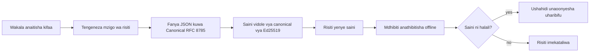
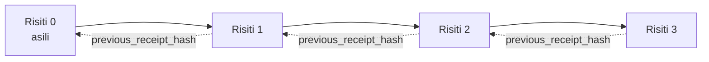

[Tazama video ya somo: Kuweka Salama Wakala wa AI kwa Kupokea kwa Usimbaji fiche](https://youtu.be/PLACEHOLDER_VIDEO_ID)

> _(Video ya somo na picha ndogo zitakazoongezwa na timu ya maudhui ya Microsoft baada ya mchakato wa kuunganisha, zikifanana na muundo wa somo la 14 / 15.)_

# Kuweka Salama Wakala wa AI kwa Kupokea kwa Usimbaji fiche

## Utangulizi

Somo hili litaleta mafunzo kuhusu:

- Kwa nini rekodi za ukaguzi kwa mawakala wa AI ni muhimu kwa uzingatia sheria, urekebishaji makosa, na kuaminiana.
- Nini kawaida ya kukubalika kwa usimbaji fiche na tofauti yake na mstari wa kumbukumbu usiosainiwa.
- Jinsi ya kutengeneza risiti yenye saini kwa wito wa zana ya wakala kwa kutumia Python rahisi.
- Jinsi ya kuthibitisha risiti kimtandao na kugundua uharibu wa data.
- Jinsi ya kuunganisha risiti ili kuondoa au kuagiza upya moja kuvuruga mnyororo.
- Nini risiti huonyesha na nini hasa hazionyeshi.

## Malengo ya Kujifunza

Baada ya kumaliza somo hili, utajua jinsi ya:

- Kubaini aina za makosa zinazochochea uthibitisho wa usimbaji fiche kwa matendo ya wakala.
- Kutengeneza risiti yenye saini ya Ed25519 juu ya mzigo wa data wa JSON kumbukumbu.
- Kuthibitisha risiti kwa uhuru kwa kutumia tu ufunguo wa umma wa msaini.
- Kugundua uharibu kwa kuendesha upya uthibitishaji kwa risiti iliyobadilishwa.
- Kujenga mnyororo wa risiti zenye msururu wa somo na kuelezea kwa nini mnyororo ni muhimu.
- Kutambua mpaka kati ya kile risiti huonyesha (mali, uadilifu, mpangilio) na kile hazioni (usalama wa hatua, usahihi wa sera).

## Tatizo: Rekodi za Ukaguzi wa Wakala Wako

Fikiria umewezesha wakala wa AI kwa Contoso Travel. Wakala anasoma maombi ya wateja, huita API ya kuruka kutafuta chaguzi, na kuhudumia kuegesha viti kwa niaba ya mteja. Robo ya mwisho, wakala alipata matatizo ya 50,000 ya kuegesha.

Leo mkaguzi anawasili. Wanauliza swali rahisi: "Nionyeshe kilichofanywa na wakala wako."

Unawapa faili zako za kumbukumbu. Mkaguzi anazitazama na kuuliza swali ngumu zaidi: "Ninawezaje kujua kumbukumbu hizi hazikutibiwa?"

Hili ndilo tatizo la rekodi za ukaguzi. Mipangilio mingi ya mawakala leo hutumia:

- **Kumbukumbu za programu**: zilizoandikwa na wakala mwenyewe, zinaweza kubadilishwa na mtu yeyote mwenye ufikiaji wa mfumo wa faili.
- **Huduma za kumbukumbu za wingu**: huonyesha uharibifu kwa kiwango cha jukwaa lakini tu iwapo mkaguzi anaamini msimamizi wa jukwaa.
- **Kumbukumbu za miamala ya hifadhidata**: zinafaa kwa mabadiliko ya hifadhidata lakini si kwa wito wowote wa zana.

Hakuna kati ya hizi zinazoweza kujibu swali la mkaguzi bila kumwongeza imani kwa mtu fulani (wewe, mtoa huduma wako wa wingu, muuzaji wa hifadhidata yako). Kwa matumizi ya ndani, imani hiyo mara nyingi ni sawa. Kwa mzigo unaodhibitiwa (fedha, huduma za afya, kitu chochote kinachofuata Sheria ya AI ya EU), si sawa.

Risiti za usimbaji fiche zinashughulikia hili kwa kufanya kila kitendo cha wakala kuthibitishwa kwa uhuru. Mkaguzi hahitaji kuamini wewe. Wanahitaji ufunguo wako wa umma na risiti yenyewe tu.

## Nini Ni Risiti ya Usimbaji fiche?

Risiti ni kitu cha JSON kinachoandika kilichofanywa na wakala, kilichosainiwa kwa saini ya kidijitali.


```mermaid
flowchart LR
    A[Wakala anaitisha kifaa] --> B[Tengeneza mzigo wa risiti]
    B --> C[Fanya JSON kuwa Canonical RFC 8785]
    C --> E[Saini vidole vya canonical vya Ed25519]
    E --> F[Risiti yenye saini]
    F --> G[Mdhibiti anathibitisha offline]
    G --> H{Saini ni halali?}
    H -- yes --> I[Ushahidi unaoonyesha uharibifu]
    H -- no --> J[Risiti imekataliwa]
```

Risiti ndogo inaonekana kama hii:

```json
{
  "type": "agent.tool_call.v1",
  "agent_id": "contoso-travel-bot",
  "tool_name": "lookup_flights",
  "tool_args_hash": "sha256:a3f9c1...",
  "result_hash": "sha256:7b2e1d...",
  "policy_id": "contoso-travel-policy-v3",
  "timestamp": "2026-04-25T14:30:00Z",
  "sequence": 47,
  "previous_receipt_hash": "sha256:9d4e6a...",
  "signature": {
    "alg": "EdDSA",
    "sig": "c5af83...",
    "public_key": "8f3b2c..."
  }
}
```

Mali tatu zinafanya kazi hii:

1. **Saini**. Risiti imesainiwa na lango la wakala kwa kutumia ufunguo wa kibinafsi wa Ed25519. Kila mtu mwenye ufunguo wa umma wa msaini anaweza kuthibitisha saini hiyo kimtandao. Kurekebisha sehemu yoyote kunaharibu saini.

2. **Usimbaji wa kaida**. Kabla ya kusaini, risiti hutitwa kwa kutumia Mchakato wa Kurekebisha JSON Canonicalization Scheme (JCS, RFC 8785). Hii inahakikisha utekelezaji wawili wote wanaotoa risiti sawa kiakili hutoa matokeo yanayolingana kabisa ya biti. Bila usimbaji huu, wasimbaji tofauti wa JSON wangeweza kutoa saini tofauti kwa maudhui yale yale.

3. **Mnyororo wa hash**. Sehemu ya `previous_receipt_hash` inaunganisha kila risiti na ile iliyomleta. Kuondoa au kuagiza upya risiti huvunja kila risiti iliyofuata. Uharibifu unaonekana kwa kiwango cha mnyororo hata kama saini binafsi zinapita.

Pamoja sifa hizi hutoa dhamana tatu:

- **Utambulisho**: ufunguo huu umesaini maudhui haya.
- **Uadilifu**: maudhui hayajabadilika tangu saini.
- **Mpangilio**: risiti hii ilifuata ile katika mnyororo.

## Kutengeneza Risiti Katika Python

Huna haja ya maktaba maalum kutengeneza risiti. Vitendo vya usimbaji fiche vipo wazi na mantiki ni mistari michache ya Python.

Mazoezi ya vitendo katika `code_samples/18-signed-receipts.ipynb` yanaelezea mchakato mzima. Taarifa fupi:

```python
import json
import hashlib
import base64
from nacl import signing
from jcs import canonicalize  # JSON ya canonical ya RFC 8785

def b64url_nopad(data: bytes) -> str:
    return base64.urlsafe_b64encode(data).decode("ascii").rstrip("=")

def sha256_canonical(obj) -> str:
    """SHA-256 of a Python object's JCS-canonical JSON form."""
    return f"sha256:{hashlib.sha256(canonicalize(obj)).hexdigest()}"

# Tengeneza au pakuza funguo ya kusaini (katika uzalishaji, hifadhi kwenye kisanduku cha funguo)
signing_key = signing.SigningKey.generate()
verify_key = signing_key.verify_key

# Tengeneza maudhui ya risiti (bila saini bado)
tool_args = {"origin": "SYD", "destination": "LAX"}
tool_result = [{"flight": "QF11", "price": 1850, "stops": 0}]

payload = {
    "type": "agent.tool_call.v1",
    "agent_id": "contoso-travel-bot",
    "tool_name": "lookup_flights",
    "tool_args_hash": sha256_canonical(tool_args),
    "result_hash": sha256_canonical(tool_result),
    "policy_id": "contoso-travel-policy-v3",
    "timestamp": "2026-04-25T14:30:00Z",
    "sequence": 0,
    "previous_receipt_hash": None,
}

# Fanya canonical na saini vitabu vya JCS moja kwa moja. PureEdDSA inafanya hashes ndani.
canonical_bytes = canonicalize(payload)
signature_bytes = signing_key.sign(canonical_bytes).signature

# Ambatisha kitu cha saini kilichopangwa.
receipt = {
    **payload,
    "signature": {
        "alg": "EdDSA",
        "sig": b64url_nopad(signature_bytes),
        "public_key": b64url_nopad(bytes(verify_key)),
    },
}
```

Hiyo ni mchakato mzima wa kusaini. Mazoezi kwenye daftari yanaonyesha kila hatua.

## Kuangalia Risiti na Kugundua Uharibifu

Uthibitisho ni operesheni ya kinyume:

```python
import base64
import hashlib
from nacl import signing
from nacl.exceptions import BadSignatureError
from jcs import canonicalize

def b64url_decode(s: str) -> bytes:
    padding = "=" * ((4 - len(s) % 4) % 4)
    return base64.urlsafe_b64decode(s + padding)

def verify_receipt(receipt: dict) -> bool:
    # Saini ni kitu kilichopangwa: {"alg", "sig", "public_key"}.
    sig_obj = receipt.get("signature")
    if not sig_obj or sig_obj.get("alg") != "EdDSA":
        return False

    # Rudisha tena mzigo wa data uliosainiwa kwa kweli (kila kitu isipokuwa saini).
    payload = {k: v for k, v in receipt.items() if k != "signature"}

    canonical_bytes = canonicalize(payload)

    try:
        verify_key = signing.VerifyKey(b64url_decode(sig_obj["public_key"]))
        verify_key.verify(canonical_bytes, b64url_decode(sig_obj["sig"]))
        return True
    except BadSignatureError:
        return False
```

Kazi hii inachukua risiti na kurudisha `True` ikiwa saini ni halali, `False` vinginevyo. Hakuna wito wa mtandao, hakuna tegemezi la huduma, hakuna imani inayohitajika kwa mtu wa tatu.

Kuona uharibifu kwa vitendo, daftari linaonyesha:

1. Kutengeneza risiti halali na kuthibitisha kwamba inathibitishwa.
2. Kubadilisha biti moja ya sehemu ya `tool_args_hash`.
3. Kuendesha upya uthibitishaji na kuona kutofaulu.

Hii ni onyesho la vitendo kwamba risiti ni dalili ya uharibifu: mabadiliko yoyote, hata mdogo, huvunja saini.

## Kuunganisha Risiti kwa Mawakala Mwenye Hatua Nyingi

Risiti moja yenye saini inalinda kitendo kimoja. Mnyororo wa risiti hulinda mfululizo.


```mermaid
flowchart LR
    R0[Risiti 0<br/>asili] --> R1[Risiti 1]
    R1 --> R2[Risiti 2]
    R2 --> R3[Risiti 3]
    R1 -. previous_receipt_hash .-> R0
    R2 -. previous_receipt_hash .-> R1
    R3 -. previous_receipt_hash .-> R2
```

Kila risiti ina rekodi ya hash ya risiti iliyomleta. Kuondoa risiti 2 kimya kimya, mshambuliaji angenahitaji kufanya moja kati ya:

- Kubadilisha sehemu ya `previous_receipt_hash` ya risiti 3 (huvunja saini ya risiti 3), AU
- Kuunda saini mpya kwa risiti 3 iliyobadilishwa (inahitaji ufunguo wa kibinafsi wa wakala).

Ikiwa ufunguo wa kibinafsi uko kwenye hifadhi ya vifaa na unachapisha ufunguo wa umma na kila risiti, shambulio lolote haliwezi kufanikishwa bila kugunduliwa.

Daftari linaonyesha:

1. Kujenga mnyororo wa risiti tatu.
2. Kuthibitisha kwamba `previous_receipt_hash` ya kila risiti inalingana na hash halisi ya risiti ya awali.
3. Kuharibu risiti moja katikati na kuona mnyororo kuvunjika hapo hasa.

Huu ndio utaratibu wa kuunda rekodi ya ukaguzi mkaguzi wa nje anaweza kuthibitisha bila kutilia shaka wewe.

## Nini Risiti Huonyesha (na Nini Hazionyeshi)

Hii ni sehemu muhimu zaidi ya somo hili. Risiti zina nguvu lakini nguvu zao zina mipaka.

**Risiti huonyesha mambo matatu:**

1. **Utambulisho**: ufunguo maalum umesaini mzigo maalum wa data.
2. **Uadilifu**: mzigo haijabadilika tangu saini kufanywa.
3. **Mpangilio**: risiti hii ilifuata ile katika mnyororo wa hash.

**Risiti HAZIONESHI:**

1. **Usahihi**: kwamba kitendo cha wakala kilikuwa sahihi. Risiti inaweza kusainiwa kwa jibu baya kama ilivyo kwa jibu zuri.
2. **Uzingatiaji wa sera**: kwamba sera iliyotajwa katika `policy_id` ilipimwa, au kwamba izingekuwa imekubaliwa kitendo hiki ikiwa ingeangaliwa. Risiti inaandika kilichodaiwa, si kilichotekelezwa.
3. **Utambulisho mbali ya ufunguo**: risiti inasema "ufunguo huu umesaini maudhui haya." Haisiambia "mtu huyu aliruhusu haya." Kuunganisha ufunguo na mtu au shirika kunahitaji miundombinu tofauti ya utambulisho (taarifa, rejista ya funguo za umma, n.k.).
4. **Ukweli wa pembejeo**: ikiwa wakala anapokea maelekezo yaliyobadilishwa na kuyatekeleza, risiti inarekodi kitendo hicho kwa uaminifu. Risiti ziko nyuma ya uhakiki wa pembejeo, si mbadala wake.

Huu mpaka ni muhimu kwa sababu mbili:

- Inakuambia risiti ni muhimu kwa nini: kufanya tabia ya wakala ionyeshwe na iwe dalili ya uharibifu, hata kwenye mipaka ya mashirika.
- Inakuambia ni ngazi gani za ziada bado unahitaji: uhakiki wa pembejeo (Somo 6), utekelezaji wa sera (ulijadiliwa mfupi hapa chini), na miundombinu ya utambulisho (si sehemu ya somo hili).

Makosa ya kawaida ni kudhani "tuna risiti" maana yake "tuna usimamizi." Sio kweli. Risiti ni msingi. Usimamizi ni mfumo unaojengwa juu yake.

## Kuonyesha Mtu Aliruhusu Kitendo Halisi

Kipengee 3 hapo juu kinafaa sehemu yake: risiti ya kitendo husema "ufunguo huu umesaini maudhui haya," si "mtu aliruhusu haya." Kwa vitendo vyenye hatari kubwa (kurudisha pesa, kufuta, kuhamisha fedha), mifumo ya usimamizi polepole inahitaji kauli hiyo ambayo haipo, na inaweza kutengenezwa kwa vitendo vile vilivyofundishwa katika somo hili.

Daftari lifuatalo `code_samples/human-authorization-receipts.ipynb` linaongeza aina ya pili ya risiti, `human.approval.v1`, katika muundo sawa wa risiti za somo (mzigo unaoandikwa na JCS uliosainiwa na Ed25519, na kitu cha `signature` nje ya biti zinazofanywa saini). Mthibitishaji aliyeitwa husaini **kitendo kamili cha kaida na muhtasari wake** kabla ya utekelezaji; risiti ya kitendo cha wakala ina **muhtasari sawa wa kitendo** na `parent_approval_ref`, `receipt_hash` ya idhini, sheria sawa na `previous_receipt_hash` katika mnyororo uliyotengeneza hapo juu. `verify_chain` moja hupitia vyombo vyote viwili chini ya **rejista tofauti za funguo mzimwa** (funguo za mthibitishaji dhidi ya funguo za wakala), hivyo njia ya namba ni sawa lakini mamlaka siyo.

Mali hii inakulipa, kwa makini: *mtu aliruhusu kitendo hiki hasa, na wakala alitekeleza kitendo hicho kilichoruhusiwa.* Mabadiliko ya ugumu wa daftari ni yanayotengeneza mali hii kuwa halisi, sio tu kudaiwa:

- seti ya kawaida: uharibifu, mshauri aliyekosolewa, kurudia, funguo bandia upande wowote, pembejeo zisizokamilika;
- **mamlaka iliyozikwa**: saini bado inathibitishwa, lakini haikukubaliwa kwa sababu toleo la sera lilibadilika, ufunguo wa mthibitishaji uligeuzwa kutoka rejista, au idhini ilitimia muda kabla ya utekelezaji;
- **mbadilisho wa muhtasari**: risiti iliyosainiwa kwa uhalali ya kitendo kinachoonyesha idhini halali inayohusiana na kitendo cha kaida tofauti.

Kila kushindwa huonyesha sababu tofauti, kwa hivyo mkaguzi anayesoma kukataa anaweza kusema kama mamlaka ilikufa au kitendo kilibadilika. Sheria inayofundishwa na daftari: idhini yenye saini sio mamlaka yenyewe. Mamlaka ipo tu ikiwa risiti zote mbili bado zinaunganisha na kitendo hicho hicho cha kaida wakati wa utekelezaji. Risiti ya idhini ya mtu ni muundo wa elimu uliotengenezwa na somo hili, sio aina ya risiti inayotambulika na `draft-farley-acta-signed-receipts`.

## Marejeleo ya Uzalishaji

Msimbo wa Python katika somo hili ni mdogo kwa makusudi ili uelewe kila mstari na kuelewa kinachotokea. Katika uzalishaji, una chaguzi mbili:

1. **Jenga moja kwa moja juu ya vitendo vya usimbaji fiche.** Mistari 50 ulioiona hapo juu ni ya kutosha kwa matukio mengi. PyNaCl (Ed25519) na kifurushi cha `jcs` (JSON ya kaida) ni maktaba zenye matunzo na ukaguzi mzuri.

2. **Tumia maktaba ya risiti ya uzalishaji.** Mradi kadhaa ya chanzo huria hutekeleza mtindo huu na vipengele vya ziada (mzunguko wa funguo, uthibitisho wa kundi, usambazaji wa Seti ya JWK, ushirikiano na mashine za sera):
   - Mchakato wa kusaini hutumia JCS na kanuni za upeo wa saini katika Rasimu ya IETF Internet ([`draft-farley-acta-signed-receipts`](https://datatracker.ietf.org/doc/draft-farley-acta-signed-receipts/), marekebisho 02). Risiti hii ya elimu ya somo ni rahisi zaidi kuliko posho la `{payload, signature}` na si utekelezaji unaoendana rasmi. Rasimu inachapisha seti ya mambo ya kufuata ([agent-governance-testvectors](https://github.com/ScopeBlind/agent-governance-testvectors)) kwa utekelezaji unaolenga muundo wake wa waya.
   - Kikasha cha Microsoft Agent Governance huunganisha risiti na maamuzi ya sera za Cedar; angalia Somo la 33 katika hazina hiyo kwa mfano wa mwisho-kw-mwisho.
   - Vifurushi vya `protect-mcp` (npm) na `@veritasacta/verify` (npm) hutoa utekelezaji wa node wa kusaini risiti na uthibitishaji wa mtandao, kwa ajili ya kuzunguka seva yoyote ya MCP na njia ya rekodi ya kupinga uharibifu, ikiwa ni pamoja na mtiririko wa kuhifadhiwa-kwa-saini ambapo kitendo kilichosimamishwa kinatoa risiti ya idhini ya kitendo (WebAuthn-backed katika mtiririko wa desktop), mfano huo huo wa risiti ya idhini ya mtu kama ilivyo kwenye daftari hapo juu.
   - SDK ya Python ya **[nobulex](https://github.com/arian-gogani/nobulex)** (`pip install nobulex`) hutoa mtindo huo wa saini wa Ed25519 + JCS kwa Python na ujumuishaji wa LangChain na CrewAI, ikiwa ni pamoja na vector za majaribio za uthibitisho wa msalaba na ramani ya uzingatiaji zinazotolewa kupitia [OWASP PR #2210](https://github.com/OWASP/CheatSheetSeries/pull/2210).

Uamuzi kati ya kujijengea mwenyewe na kutumia maktaba unafanana na uamuzi kati ya kuandika maktaba yako ya JWT au kutumia moja iliyojaribiwa: zote ni sawa; maktaba huokoa muda na kupunguza mageuzi ya ukaguzi; njia ya kuanzia kwa makundi huchangia ufahamu wa vitendo vyote. Somo hili hufundisha njia ya kuanzia ili uwe na msingi kwa chaguo lolote.

## Jaribio la Maarifa

Jaribu uelewa wako kabla ya kuendelea kwa mazoezi ya vitendo.

**1. Risiti imesainiwa kwa ufunguo wa kibinafsi wa Ed25519 wa wakala. Mkaguzi ana ufunguo wa umma tu. Je, mkaguzi anaweza kuthibitisha risiti kimtandao?**

<details>
<summary>Jibu</summary>

Ndiyo. Uthibitisho wa Ed25519 unahitaji tu ufunguo wa umma na biti zilizosainiwa. Hakuna wito wa mtandao, hakuna tegemezi la huduma. Hii ni mali inayofanya risiti kuwa muhimu katika mazingira yasiyo na mtandao, mashirika tofauti, au hali za ukaguzi wa imani ndogo.
</details>

**2. Mshambuliaji anabadilisha sehemu ya `policy_id` ya risiti kudai kuwa ilidhibitiwa na sera huruhusu zaidi. Saini ilifanywa juu ya mzigo wa data wa awali. Nini hutokea wakati wa uthibitisho?**

<details>
<summary>Jibu</summary>


Uthibitisho umeshindikana. Saini ilihesabiwa juu ya baitesi rasmi za mzigo halisi; kubadilisha sehemu yoyote hubadilisha baitesi hizo, jambo linalofanya saini kuwa batili. Mwizi angehitaji ufunguo wa kibinafsi kutengeneza saini mpya halali, jambo ambalo hana.
</details>

**3. Kwa nini risiti inajumuisha `tool_args_hash` na `result_hash` badala ya hoja halisi na matokeo?**

<details>
<summary>Jibu</summary>

Sababu mbili. Kwanza, risiti inaweza kuhifadhiwa au kusambazwa katika mazingira ambapo kuvuja kwa yaliyomo halisi (PII, data ya biashara) ni tatizo. Uhashi hufanya risiti kuwa ndogo na yaliyomo kuwa ya faragha; mkaguzi huhakiki kuwa uhashi unalingana na nakala iliyohifadhiwa kando ya yaliyomo halisi. Pili, uhashi una ukubwa wa fasta; risiti yenye uhashi ina ukubwa uliodhibitiwa bila kujali ikiwa ingizo na matokeo yalikuwa makubwa kiasi gani.
</details>

**4. Sehemu ya `previous_receipt_hash` inaunganisha kila risiti na ile ya awali. Ikiwa mwizi afuta kimya risiti moja katikati ya mnyororo, ni nini kinakuwa batili?**

<details>
<summary>Jibu</summary>

Kila risiti ambayo ilifuata ile iliyofutwa. Sehemu zao za `previous_receipt_hash` hazilingani tena na mnyororo halisi (kwa sababu risiti walizorejelea haipo tena, au mnyororo sasa unaonyesha antecessor tofauti). Ili kuficha ufutaji huo, mwizi angeni lazima asaini tena kila risiti iliyofuata, jambo linalohitaji ufunguo wa kibinafsi.
</details>

**5. Risiti imethibitishwa pasipo hitilafu. Hii inaonyesha kuwa kitendo cha wakala kilikuwa sahihi, thabiti, au kinazingatia sera?**

<details>
<summary>Jibu</summary>

Hapana. Risiti halali huonyesha mambo matatu: kumtambulisha (funguo hii ilisaini yaliyomo haya), usahihi (yaliyomo haya yamebaki yasibadilike), na mpangilio (risiti hii ilifuata ile ile). HAIONYESHI kuwa kitendo kilikuwa sahihi, kuwa sera iliyoitwa kwenye `policy_id` ilitathminiwa kweli, au wakala alifuata sheria zote. Risiti huwezesha tabia za wakala kupimwa, si lazima ziwe sahihi. Hili ndilo mpaka muhimu zaidi katika somo hili.
</details>

## Mazoezi ya Kufanyia Kazi

Fungua `code_samples/18-signed-receipts.ipynb` na ukamilishe sehemu nne zote:

1. **Sehemu ya 1**: Saini risiti yako ya kwanza na uiangalie uthibitisho wake.
2. **Sehemu ya 2**: Fanyia mabadiliko risiti na angalia uthibitisho ushindwe.
3. **Sehemu ya 3**: Jenga mnyororo wa risiti tatu na hakiki usahihi wa mnyororo.
4. **Sehemu ya 4**: Tumia muundo huu kwa wakala aliyejengwa kwa Microsoft Agent Framework: gunika wito wa zana kwenye usaini wa risiti, kisha thibitisha risiti kwa kujitegemea.

**Changamoto ya ziada 1:** ongeza sehemu mpya ya chaguo lako kwenye kigezo cha risiti (kwa mfano, nambari ya ombi kwa kufuatilia), sasisha mantiki ya kufunga rasmi ili ijumuishe, na thibitisha kuwa risiti bado inazunguka kupitia uthibitisho. Kisha badilisha sehemu baada ya kusaini na hakikisha uthibitisho unashindwa. Hii inakufanya uelewe jinsi kila baitesi ya usimbaji rasmi inachangia kwenye saini.

**Changamoto ya ziada 2:** mshirikishe risiti zako mbili kwa hash ya SHA-256 (unganisha baitesi zao rasmi kwa mpangilio thabiti) na weka matokeo kama sehemu mpya kwenye risiti ya tatu kabla ya kusaini. Thibitisha kuwa risiti zote tatu bado zinaweza kuzunguka. Umejenga uthibitisho wa hatua moja wa kuingiza: mtu yeyote mwenye risiti ya tatu anaweza kuthibitisha kuwa risiti za kwanza mbili zilikuwepo wakati ziliposainiwa, bila kufichua yaliyomo. Huu ndio muundo unaotumiwa na risiti za kufichua kwa ajili ya matumizi makubwa (ahadi za Merkle, RFC 6962).

## Hitimisho

Risiti za kriptografia zinawapa mawakala wa AI njia ya ukaguzi ambayo ni:

- **Inaweza kuthibitishwa kwa kujitegemea**: upande wowote wenye ufunguo wa umma anaweza kuthibitisha, hakuna utegemezi wa huduma.
- **Inaonyesha wazi ulaghai**: mabadiliko yoyote yanavunja saini.
- **Inayosafirishika**: risiti ni faili ndogo ya JSON; inaweza kuhifadhiwa, kusambazwa, na kuthibitishwa mahali popote.
- **Inazingatia viwango**: imetengenezwa kwa Ed25519 (RFC 8032), JCS (RFC 8785), na SHA-256, zote ni mbinu zilizotumika sana.

Sio mbadala wa uhalalishaji wa ingizo, utekelezaji wa sera, au miundombinu ya utambulisho. Ni msingi kwa ajili ya tabaka hizo. Unapoweka mawakala kwenye kazi zinazodhibitiwa, mifumo ya mashirika mengi, au mazingira yoyote ambapo hakikisha kuwa mkaguzi wa baadaye hatakuamini, risiti ndizo zinazofanya njia ya ukaguzi kuwa ya kweli.

Kitu muhimu zaidi cha kukumbuka: risiti huonyesha nani alisema nini, lini. Hazionyeshi kuwa kile kilichosemwa ni kweli au sahihi. Shikilia tofauti hiyo kwa karibu. Hii ni tofauti kati ya mfumo wa asili wa kweli na ule unaodanganya.

## Orodha ya Mtihani wa Uzalishaji

Unapokuwa tayari kutoka katika somo hili kwenda kuanzisha mawakala wenye usaini wa risiti katika mazingira halisi:

- [ ] **Hamisha ufunguo wa kusaini kutoka kwenye kompyuta ya msanidi.** Tumia Azure Key Vault, AWS KMS, au kifaa cha usalama cha kisasa. Ufunguo wa kibinafsi unaosaini risiti zako haupaswi kuwepo kabisa katika mfumo wa udhibiti chanzo au wazi kwenye mashine za programu.
- [ ] **Tangaza ufunguo wa umma wa kuthibitisha.** Wapimaji wanauhitaji kuthibitisha nje ya mtandao. Muundo wa kawaida ni Seti ya JWK kwenye URL inayojulikana (RFC 7517), mfano, `https://your-org.example.com/.well-known/agent-keys.json`.
- [ ] **Ankisha mnyororo kwa nje.** Mara kwa mara andika hash ya kichwa cha mnyororo wa sasa kwenye kumbukumbu ya uwazi (Sigstore Rekor, mamlaka ya UTC ya RFC 3161, au mfumo wa kando wa ndani) ili mtu wa nje athibitishe "mnyororo huu ulipo wakati huu."
- [ ] **Hifadhi risiti kwa usalama usiobadilika.** Hifadhi inayojumuisha data tu (Azure Storage with immutability policies, AWS S3 Object Lock) inazuia ndani ya shirika kubadilisha historia kwenye tabaka la kuhifadhi.
- [ ] **Amua juu ya uhifadhi wa muda mrefu.** Mifumo mingi ya zina sera huhitaji uhifadhi wa miaka mingi. Panga kwa ukuaji wa risiti (kila risiti ni ~500 baitesi; wakala anayetengeneza simu 10K kwa siku huzalisha ~1.8 GB kwa mwaka).
- [ ] **Andika kile risiti hazifuniki.** Risiti huonyesha kumtambulisha, usahihi, na mpangilio. Kitabu chako cha ongezeko kinapaswa orodha wazi mipaka mingine (ukaguzi wa ingizo, utekelezaji wa sera, kuzuia mara nyingi, miundombinu ya utambulisho) inayoshirikiana na risiti katika muundo wako wa udhibiti.

### Una Maswali Zaidi Kuhusu Kulinda Wakala wa AI?

Jiunge na [Microsoft Foundry Discord](https://aka.ms/ai-agents/discord) kukutana na wengine wanaojifunza, kuhudhuria saa za ofisi, na kupata majibu ya maswali yako ya AI Agents.

## Zaidi ya Somo Hili

Somo hili linahusu kusaini risiti moja na mnyororo wa hash. Mbinu zile zile hutumika kuunda mifumo mingi ya hali ya juu ambayo unaweza kukutana nayo unapoimarisha muundo wako wa udhibiti:

- **Ufichuzi wa kuchagua.** Wakati sehemu za risiti zimehifadhiwa kwa kujitegemea (mti wa Merkle wa mtindo wa RFC 6962), unaweza kufichua sehemu maalum kwa wakaguzi maalum na kuonyesha zingine hazijabadilika bila kuzifunua. Ni muhimu wakati risiti ile ile inapaswa kuridhisha ukaguzi mpana (unaotaka ukamilifu) na kanuni za kupunguza data kama GDPR (zinazotaka mkaguzi aone kidogo tu kinachohitajika).
- **Kufuta risiti.** Ikiwa ufunguo wa kusaini umedhoofika, unahitaji njia ya kumchafulia risiti zote zilizotiwa saini na ufunguo huo kuanzia wakati fulani. Mifumo ya kawaida ni funguo za kusaini zenye maisha mafupi pamoja na orodha ya kufuta iliyochapishwa, au kumbukumbu ya uwazi yenye maingizo ya kufuta.
- **Risiti za usaini wa pande mbili / kugawanya.** Baadhi ya utekelezaji hugawanya mzigo uliosainiwa katika sehemu za kabla ya utekelezaji (`authorization_*`) na baada ya utekelezaji (`result_*`) zenye saini huru, muhimu wakati uamuzi wa idhini na matokeo yaliyoonekana hutolewa na watu tofauti au wakati tofauti. Hii hujumuisha juu ya muundo wa risiti uliotolewa katika somo hili.
- **Muundo wa mzigo.** Risiti hulinda baitesi zozote ulizoziweka katika `result_hash`. Mizigo halisi mara nyingi ni tajiri kuliko matokeo moja ya wito wa zana: mantiki ya kabla ya uamuzi (utabiri wa mfano, chaguzi zilizoshughulikiwa, ushahidi na ukamilifu wake, hali ya hatari, mnyororo wa uwajibikaji, matokeo ya lango) yote yanaweza kuwepo ndani ya mzigo, yakiwa yamefungwa na risiti moja. Hii hufanya muundo wa risiti kuwa mdogo huku skimu za mzigo zikikua kanda kwa kanda.
- **Kufuata muundo kwenye utekelezaji.** Utekelezaji tofauti wa muundo ule ule wa risiti (Python, TypeScript, Rust, Go) huthibitisha dhidi ya vigezo vya mtihani vilivyoshirikiwa. Ikiwa utajenga utekelezaji wako mwenyewe, kuhakiki dhidi ya vigezo vilivyochapishwa kunathibitisha upatikanaji wa kebo.
- **Uhamishaji baada ya teknolojia ya quantum.** Ed25519 imetumika sana leo lakini si thabiti dhidi ya quantum. Muundo wa risiti ni mwepesi wa algoriti: sehemu ya `signature.alg` inaweza kubeba `ML-DSA-65` (standa ya saini ya NIST ya baada ya quantum) unapohitaji kuhamia. Panga kipindi cha mpito ambapo risiti zinasainiwa mara mbili.

## Rasilimali Zaidi

- <a href="https://datatracker.ietf.org/doc/draft-farley-acta-signed-receipts/" target="_blank">IETF Internet-Draft: Risiti za Maamuzi Zilizotiwa Saini kwa Udhibiti wa Nafasi kati ya Mashine</a>
- <a href="https://learn.microsoft.com/azure/ai-studio/responsible-use-of-ai-overview" target="_blank">Muhtasari wa AI ya Kuwajibika (Azure AI)</a>
- <a href="https://datatracker.ietf.org/doc/html/rfc8032" target="_blank">RFC 8032: Edwards-Curve Digital Signature Algorithm (EdDSA)</a>
- <a href="https://datatracker.ietf.org/doc/html/rfc8785" target="_blank">RFC 8785: Mpangilio wa JSON Canonicalization Scheme (JCS)</a>
- <a href="https://datatracker.ietf.org/doc/html/rfc6962" target="_blank">RFC 6962: Uwazi wa Vyeti</a> (Ujenzi wa mti wa Merkle unaotumika na risiti za kufichua kwa kuchagua)
- <a href="https://github.com/microsoft/agent-governance-toolkit/blob/main/docs/tutorials/33-offline-verifiable-receipts.md" target="_blank">Mfumo wa Usimamizi wa Wakala wa Microsoft, Mafunzo 33: Risiti za Maamuzi Zinaweza Kutathminiwa Nje ya Mtandao</a>
- <a href="https://github.com/ScopeBlind/agent-governance-testvectors" target="_blank">Vigezo vya mtihani wa kufuata utekelezaji wa muundo wa risiti uliotumiwa katika somo hili (Apache-2.0)</a>
- <a href="https://pynacl.readthedocs.io/" target="_blank">Nyaraka za PyNaCl</a> (Ed25519 katika Python)

## Somo Lililopita

[Kuunda Wakala wa AI wa Ndani](../17-creating-local-ai-agents/README.md)

---

<!-- CO-OP TRANSLATOR DISCLAIMER START -->
**Kionyozo**:
Hati hii imetafsiriwa kwa kutumia huduma ya tafsiri ya AI [Co-op Translator](https://github.com/Azure/co-op-translator). Ingawa tunajitahidi kupata usahihi, tafadhali fahamu kwamba tafsiri za kiotomatiki zinaweza kuwa na makosa au upungufu wa usahihi. Hati ya asili katika lugha yake halisi inapaswa kuchukuliwa kama chanzo cha mamlaka. Kwa taarifa muhimu, tafsiri ya kitaalamu inayofanywa na binadamu inapendekezwa. Hatutojibu kwa kuelewa vibaya au tafsiri potofu zinazotokea kutokana na matumizi ya tafsiri hii.
<!-- CO-OP TRANSLATOR DISCLAIMER END -->