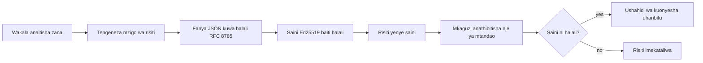
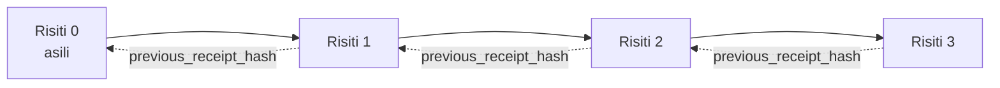

[Tazama video ya somo: Kuweka Usalama kwa Wakala wa AI kwa Barua za Kikryptografia](https://youtu.be/PLACEHOLDER_VIDEO_ID)

> _(Video ya somo na picha ndogo itaongezwa na timu ya maudhui ya Microsoft baada ya kuunganisha, kufanana na mfano wa somo la 14 / 15.)_

# Kuweka Usalama kwa Wakala wa AI kwa Barua za Kikryptografia

## Utangulizi

Somo hili litashughulikia:

- Kwa nini njia za ukaguzi kwa mawakala wa AI ni muhimu kwa kufuata sheria, kutatua hitilafu, na kuaminiwa.
- Barua ya kikryptografia ni nini na tofauti yake na mstari wa kumbukumbu usiosainiwa.
- Jinsi ya kutengeneza risiti iliyosainiwa kwa wito wa chombo cha wakala kwa Python ya kawaida.
- Jinsi ya kuthibitisha risiti bila mtandao na kugundua uharibifu.
- Jinsi ya kuunganisha risiti hivyo kuondoa au kubadilisha mpangilio wa moja kuvunja mnyororo.
- Barua zinathibitisha nini na nini hazithibitishi waziwazi.

## Malengo ya Kujifunza

Baada ya kumaliza somo hili, utajua jinsi ya:

- Kutambua aina za kushindwa zinazochochea utambulisho wa kikryptografia kwa hatua za wakala.
- Kutengeneza risiti iliyosainiwa kwa Ed25519 juu ya mzigo wa JSON wa kawaida.
- Kuthibitisha risiti kwa uhuru kwa kutumia tu ufunguo wa umma wa msaini.
- Kugundua uharibifu kwa kurudia uthibitisho kwenye risiti iliyobadilishwa.
- Kujenga mnyororo wa risiti zenye hash na kueleza kwa nini mnyororo huo ni muhimu.
- Kutambua mpaka kati ya kile risiti zinachothibitisha (mula, uimara, mpangilio) na kile hazithibitishi (usalama wa hatua, ufasaha wa sera).

## Tatizo: Njia ya Ukaguzi ya Wakala Wako

Fikiria umewekaza wakala wa AI wa Contoso Travel. Wakala husoma maombi ya wateja, huwita API ya ndege kutafuta chaguzi, na kuhifadhi viti kwa niaba ya mteja. Robo ya mwisho, wakala alishughulikia uhifadhi elfu 50,000.

Leo mkaguzi anakuja. Wanauliza swali rahisi: "Nionyeshe kile wakala wako alichofanya."

Unawapatia faili zako za kumbukumbu. Mkaguzi huangalia na kuuliza swali gumu zaidi: "Ninawezaje kujua kumbukumbu hizi hazikuharibiwa?"

Hili ndilo tatizo la njia ya ukaguzi. Mifumo mingi ya mawakala leo hutegemea:

- **Kumbukumbu za programu**: zinazoandikwa na wakala mwenyewe, zinaweza kuharibiwa na yeyote mwenye ufikiaji wa mfumo wa faili.
- **Huduma za kumbukumbu za wingu**: zinaonyesha uharibifu kwenye ngazi ya jukwaa lakini tu kama mkaguzi anamuamini mwendeshaji wa jukwaa.
- **Kumbukumbu za shughuli za hifadhidata**: zinafaa kwa mabadiliko ya hifadhidata lakini siyo kwa wito wowote wa chombo.

Hakuna kati yao anayeweza kujibu swali la mkaguzi bila kumlazimisha kuamini mtu (wewe, mtoa huduma wa wingu, muuza hifadhidata). Kwa matumizi ya ndani, imani hiyo mara nyingi inakubalika. Kwa kazi zilizo chini ya kanuni (fedha, afya, chochote chini ya Sheria ya EU AI), haikubaliki.

Barua za kikryptografia hutasuliza hili kwa kufanya kila kitendo cha wakala kuthibitishwa kwa uhuru. Mkaguzi hahitaji kuamini wewe. Wanahitaji ufunguo wako wa umma tu na risiti yenyewe.

## Risiti ya Kikryptografia ni Nini?

Risiti ni kitu cha JSON kinachorekodi kile wakala alichofanya, kimesainiwa kwa saini ya kidijitali.


```mermaid
flowchart LR
    A[Wakala anaitisha zana] --> B[Tengeneza mzigo wa risiti]
    B --> C[Fanya JSON kuwa halali RFC 8785]
    C --> E[Saini Ed25519 baiti halali]
    E --> F[Risiti yenye saini]
    F --> G[Mkaguzi anathibitisha nje ya mtandao]
    G --> H{Saini ni halali?}
    H -- yes --> I[Ushahidi wa kuonyesha uharibifu]
    H -- no --> J[Risiti imekataliwa]
```

Risiti ya chini kabisa inaonekana hivi:

```json
{
  "type": "agent.tool_call.v1",
  "agent_id": "contoso-travel-bot",
  "tool_name": "lookup_flights",
  "tool_args_hash": "sha256:a3f9c1...",
  "result_hash": "sha256:7b2e1d...",
  "policy_id": "contoso-travel-policy-v3",
  "timestamp": "2026-04-25T14:30:00Z",
  "sequence": 47,
  "previous_receipt_hash": "sha256:9d4e6a...",
  "signature": {
    "alg": "EdDSA",
    "sig": "c5af83...",
    "public_key": "8f3b2c..."
  }
}
```

Sifa tatu zinafanya kazi hii:

1. **Saini**. Risiti imesainiwa na mlango wa wakala kutumia ufunguo wa kibinafsi wa Ed25519. Yeyote mwenye ufunguo wa umma wa msingi anaweza kuthibitisha saini bila mtandao. Kurekebisha sehemu yoyote kunaharamisha saini.

2. **Usanidi wa kawaida**. Kabla ya kusaini, risiti imepangwa kwa kutumia Mpango wa Kuanzisha JSON wa Kawaida (JCS, RFC 8785). Hii inahakikisha kuwa utekelezaji wawili wanaotoa risiti yenye mantiki sawa hutoa pato linalofanana zaidi ya biti. Bila usanidi wa kawaida, vyenye binaya tofauti vya JSON vinaweza kutoa saini tofauti kwa maudhui sawa.

3. **Mnyororo wa hash**. Sehemu ya `previous_receipt_hash` inaunganisha kila risiti kwa ile iliyotangulia. Kuondoa au kubadilisha mpangilio wa risiti kunavunja kila risiti inayofuata. Mhariri anazoea kuonekana ngazi ya mnyororo hata kama saini binafsi zimepitwa.

Pamoja, sifa hizi zinatoa dhamana tatu:

- **Muda**: ufunguo huu ulisaini maudhui haya.
- **Uimara**: maudhui hayajabadilika tangu kusainiwa.
- **Mpangilio**: risiti hii ilifuata risiti ile kwenye mnyororo.

## Kutengeneza Risiti katika Python

Haufanyi haja ya maktaba maalum kutengeneza risiti. Vifaa vya kikryptografia vinapatikana kwa wingi na mantiki ni mistari michache tu ya Python.

Mazoezi ya vitendo katika `code_samples/18-signed-receipts.ipynb` yanaelezea mchakato mzima. Muhtasari:

```python
import json
import hashlib
import base64
from nacl import signing
from jcs import canonicalize  # JSON halali ya RFC 8785

def b64url_nopad(data: bytes) -> str:
    return base64.urlsafe_b64encode(data).decode("ascii").rstrip("=")

def sha256_canonical(obj) -> str:
    """SHA-256 of a Python object's JCS-canonical JSON form."""
    return f"sha256:{hashlib.sha256(canonicalize(obj)).hexdigest()}"

# Tengeneza au pakia ufunguo wa kusaini (katika uzalishaji, hifadhi kwenye hifadhi ya funguo)
signing_key = signing.SigningKey.generate()
verify_key = signing_key.verify_key

# Jenga mzigo wa risiti (bado hakuna saini)
tool_args = {"origin": "SYD", "destination": "LAX"}
tool_result = [{"flight": "QF11", "price": 1850, "stops": 0}]

payload = {
    "type": "agent.tool_call.v1",
    "agent_id": "contoso-travel-bot",
    "tool_name": "lookup_flights",
    "tool_args_hash": sha256_canonical(tool_args),
    "result_hash": sha256_canonical(tool_result),
    "policy_id": "contoso-travel-policy-v3",
    "timestamp": "2026-04-25T14:30:00Z",
    "sequence": 0,
    "previous_receipt_hash": None,
}

# Fanya kuwa halali na saini baiti za JCS moja kwa moja. PureEdDSA inafanya heshii ndani.
canonical_bytes = canonicalize(payload)
signature_bytes = signing_key.sign(canonical_bytes).signature

# Ambatisha kitu cha saini kilicho kwenye muundo.
receipt = {
    **payload,
    "signature": {
        "alg": "EdDSA",
        "sig": b64url_nopad(signature_bytes),
        "public_key": b64url_nopad(bytes(verify_key)),
    },
}
```

Hiyo ni mchakato mzima wa kusaini. Mazoezi kwenye daftari huonyesha kila hatua.

## Kuthibitisha Risiti na Kugundua Uharibifu

Uthibitisho ni tendo la kinyume:

```python
import base64
import hashlib
from nacl import signing
from nacl.exceptions import BadSignatureError
from jcs import canonicalize

def b64url_decode(s: str) -> bytes:
    padding = "=" * ((4 - len(s) % 4) % 4)
    return base64.urlsafe_b64decode(s + padding)

def verify_receipt(receipt: dict) -> bool:
    # Saini ni kitu kilicho na muundo: {"alg", "sig", "public_key"}.
    sig_obj = receipt.get("signature")
    if not sig_obj or sig_obj.get("alg") != "EdDSA":
        return False

    # Tengeneza upya mzigo uliosainiwa kweli (kila kitu isipokuwa saini).
    payload = {k: v for k, v in receipt.items() if k != "signature"}

    canonical_bytes = canonicalize(payload)

    try:
        verify_key = signing.VerifyKey(b64url_decode(sig_obj["public_key"]))
        verify_key.verify(canonical_bytes, b64url_decode(sig_obj["sig"]))
        return True
    except BadSignatureError:
        return False
```

Kazi hii huchukua risiti na kurudisha `True` ikiwa saini ni halali, `False` vinginevyo. Hakuna mwito wa mtandao, hakuna utegemezi wa huduma, hakuna imani inayohitajika kwa mtu wa tatu.

Ili kuona kugundua uharibifu kiutendaji, daftari linapitia:

1. Kutengeneza risiti halali na kuthibitisha.
2. Kubadilisha biti moja ya sehemu ya `tool_args_hash`.
3. Kurudia uthibitisho na kuona lishindikane.

Hii ni onyesho la vitendo kuwa risiti zinaonyesha uharibifu: mabadiliko yoyote, hata madogo, huvunja saini.

## Kuunganisha Risiti kwa Mawakala wa Hatua Nyingi

Risiti moja iliyosainiwa inalinda kitendo kimoja. Mnyororo wa risiti hualinda mfululizo.


```mermaid
flowchart LR
    R0[Risiti 0<br/>asili] --> R1[Risiti 1]
    R1 --> R2[Risiti 2]
    R2 --> R3[Risiti 3]
    R1 -. previous_receipt_hash .-> R0
    R2 -. previous_receipt_hash .-> R1
    R3 -. previous_receipt_hash .-> R2
```

Kila risiti inarekodi hash ya risiti iliyotangulia. Kuondoa risiti ya 2 kimya kimya, mshambuliaji atahitaji:

- Kubadilisha sehemu ya `previous_receipt_hash` ya risiti 3 (huvunja saini ya risiti 3), AU
- Kutunga saini mpya kwenye risiti 3 iliyobadilishwa (inahitaji ufunguo wa kibinafsi wa wakala).

Ikiwa ufunguo wa kibinafsi uko ndani ya kiamsha ufunguo cha vifaa na unachapisha ufunguo wa umma na kila risiti, mashambulizi hayawezi kufanywa bila kugunduliwa.

Daftari linaonyesha:

1. Kujenga mnyororo wa risiti tatu.
2. Kuthibitisha kwamba sehemu ya `previous_receipt_hash` ya kila risiti inaendana na hash halisi ya risiti iliyotangulia.
3. Kurekebisha risiti moja katikati na kuona mnyororo kuvunjika hapo hapo.

Hivi ndivyo unavyotengeneza njia ya ukaguzi ambayo mkaguzi wa nje anaweza kuthibitisha bila kukuamini.

## Barua Zinazothibitisha (na Zisizothibitisha)

Hii ni sehemu muhimu zaidi ya somo hili. Barua ni zenye nguvu lakini nguvu zao zina mipaka.

**Barua zinathibitisha vitu vitatu:**

1. **Muda**: ufunguo fulani ulisaini mzigo fulani.
2. **Uimara**: mzigo haujabadilika tangu kusainiwa.
3. **Mpangilio**: risiti hii ilifuata risiti ile kwenye mnyororo wa hash.

**Barua HAZITHIBITISHI:**

1. **Usahihi**: kwamba kitendo cha wakala kilikuwa sahihi. Risiti inaweza kusainiwa kwa jibu baya kwa usahihi kama kwa jibu sahihi.
2. **Ufuatiliaji wa sera**: kwamba sera iliyoonyeshwa kwenye `policy_id` ilithibitishwa, au kwamba ingeweza kuruhusu kitendo hiki ikiwa ingeangaliwa. Risiti inarekodi kile kilicho daiwa, si kile kilichotekelezwa.
3. **Utambulisho zaidi ya ufunguo**: risiti inasema "funguo hii ilisaini maudhui haya." Haisi kusema "mtu huyu aliruhusu hii." Kuunganisha ufunguo na mtu au shirika kunahitaji miundombinu tofauti ya utambulisho (katalogi, rejista ya ufunguo wa umma, nk).
4. **Ukweli wa pembejeo**: ikiwa wakala anapokea ombi lililabadilishwa na kutenda kulingana nalo, risiti inarekodi kitendo hicho kwa uaminifu. Barua ziko chini ya uthibitisho wa pembejeo, si mbadala yake.

Hili mpaka ni muhimu kwa sababu mbili:

- Inakuambia barua ni muhimu kwa nini: kufanya tabia ya wakala iwe ya ukaguzi na kuonyesha uharibifu, hata kuvuka mipaka ya mashirika.
- Inakuambia ni vipengele vya ziada unavyohitaji: uthibitisho wa pembejeo (Somo 6), utekelezaji wa sera (kutajwa kwa ufupi hapo chini), na miundombinu ya utambulisho (haipo kwenye somo hili).

Makosa ya kawaida ni kudhania "tunayo risiti" maana yake "tunadhibitiwa." Hii siyo. Barua ni msingi. Udhibiti ni mfumo unaojengwa juu yake.

## Kuthibitisha Binadamu Aliridhia Kitendo Kamili

Kipengele cha 3 hapo juu ni cha sehemu yake binafsi: risiti ya kitendo inasema "funguo hii ilisaini maudhui haya," si "binadamu aliruhusu hivi." Kwa hatua hatarishi (kurudisha pesa, kufuta, kuhamisha fedha), mifumo ya udhibiti inahitaji kauli hiyo inayokosekana, na inaweza kutengenezwa na vifaa ule ule uliojifunza katika somo hili.

Daftari linalofuata `code_samples/human-authorization-receipts.ipynb` linaongeza aina ya pili ya risiti, `human.approval.v1`, katika kifuko sawa cha risiti za somo (mzigo wa aina uliosainiwa na Ed25519 juu ya biti zake za JCS, na kitu cha `signature` nje ya biti zilizosasishwa). Mruhusu aliyepangiwa husaini **kitendo chote cha kawaida na muhtasari wake** kabla ya utekelezaji; risiti ya kitendo cha wakala ina **muhtasari wa kitendo sawa** na `parent_approval_ref`, `receipt_hash` ya idhini, desturi sawa na `previous_receipt_hash` katika mnyororo uliotengenezwa hapo juu. Kazi moja ya `verify_chain` husafirisha nyaraka zote chini ya **rejista tofauti za funguo zilizofungwa** (funguo za mrhusi dhidi ya funguo za wakala), hivyo njia ya msimbo ni sawa lakini mamlaka hazitawahi kushirikiana.

Sifa hii ni kwa uangalifu: *binadamu alikubali kitendo hiki kamili, na wakala alitekeleza kitendo hicho kilichoidhinishwa.* Daftari linahifadhi masharti ya kukataa ambayo yanathibitisha sifa hii kama halisi badala ya kudaiwa:

- seti ya kawaida: uharibifu, afisa mpumbavu, kurejea, kuigiza funguo upande wowote, pembejeo isiyo sahihi;
- **mamlaka iliyochoka**: saini inayothibitishwa bado, ilikataa kwa sababu toleo la sera lilisogea, ufunguo wa mrhusi ulizungushwa nje ya rejista, au idhini ilitimia kabla ya utekelezaji;
- **kubadilisha muhtasari**: risiti ya kitendo iliyosainiwa kwa usahihi inayowanisha idhini *halisi* inayobindisha kitendo sahihi tofauti.

Kila kushindwa kunakataa kwa sababu tofauti, hivyo mkaguzi anayosoma kukataa anaweza kujua kama mamlaka ilichoka au kitendo kilibadilika. Kanuni inayofundishwa ni: idhini iliyosainiwa si mamlaka yenyewe. Mamlaka ipo tu ikiwa barua zote mbili bado zinaunganisha kitendo sawa cha kawaida wakati wa utekelezaji. Risiti ya idhini ya binadamu ni muundo wa kielimu uliotengenezwa na somo hili, si aina ya risiti iliyobainishwa na `draft-farley-acta-signed-receipts`.

## Marejeleo ya Uzalishaji

Msimbo wa Python katika somo hili ni mchache kwa makusudi ili usome kila mstari na kuelewa kinachotokea. Katika uzalishaji, una chaguo mbili:

1. **Jenga moja kwa moja juu ya vifaa vya kikryptografia.** Mistari 50 uliyiona hapo juu inatosha kwa matumizi mengi. PyNaCl (Ed25519) na kifurushi cha `jcs` (JSON ya kawaida) ni maktaba zilizo imara na zilizoangaliwa.

2. **Tumia maktaba ya risiti ya uzalishaji.** Miradi kadhaa ya chanzo huria hufuatilia mfano huu na vipengele zaidi (zunguko la funguo, uthibitisho wa pamoja, usambazaji wa Seti ya JWK, ushirikiano na injini za sera):
   - Mchakato wa kusaini hutumia JCS na kanuni za saini katika IETF Internet-Draft huru ([`draft-farley-acta-signed-receipts`](https://datatracker.ietf.org/doc/draft-farley-acta-signed-receipts/), marekebisho 02). Risiti ya kielimu ya somo hili ni tofauti na kifurushi cha `{payload, signature}` cha rasimu na haionyeshi utekelezaji unaoendana. Rasimu inachapisha seti ya masharti ya pamoja ([agent-governance-testvectors](https://github.com/ScopeBlind/agent-governance-testvectors)) kwa utekelezaji unaolenga muundo wake wa waya.
   - Zana ya Udhibiti wa Wakala ya Microsoft huunganisha barua na maamuzi ya sera yanayotegemea Cedar; ona Mafunzo 33 katika hazina hiyo kwa mfano kamili.
   - Vifurushi vya `protect-mcp` (npm) na `@veritasacta/verify` (npm) hutoa utekelezaji unaotegemea Node wa kusaini risiti na uthibitisho bila mtandao, uliokusudiwa kufunika seva yoyote ya MCP na njia ya ukaguzi isiyoweza kuhuriwa, ikiwa ni pamoja na mtiririko wa kuhifadhi kwa sahihi ambapo kitendo kilichogongwa kinatoa risiti ya idhini inayounganishwa na muhtasari wa kitendo (inasimamiwa na WebAuthn katika mtiririko wa dawati), mfano sawa wa risiti ya idhini ya binadamu kama ile ya daftari hapo juu.
   - SDK ya Python **[nobulex](https://github.com/arian-gogani/nobulex)** (`pip install nobulex`) hutoa mfano ule ule wa kusaini wa Ed25519 + JCS katika Python na ushirikiano wa LangChain na CrewAI, ikiwa na alama za mtihani zilizo chapishwa za ulinganifu na ramani ya uzingatiaji iliyochangia kupitia [OWASP PR #2210](https://github.com/OWASP/CheatSheetSeries/pull/2210).

Uamuzi kati ya kujijengea mwenyewe au kutumia maktaba ni sawa na uamuzi wa kuandika maktaba yako ya JWT au kutumia iliyojaribiwa: zote ni za busara; maktaba huokoa muda na hupunguza eneo la ukaguzi; njia ya kuanzia inakulazimisha kuelewa kila kifaa. Somo hili hufundisha njia ya kuanzia ili uwe na msingi kwa chaguo lolote.

## Mtihani wa Uelewa

Jaribu kuelewa kabla ya kuendelea kwenye zoezi la vitendo.

**1. Risiti imesainiwa kwa ufunguo wa kibinafsi wa Ed25519 wa wakala. Mkaguzi ana ufunguo wa umma tu. Je, mkaguzi anaweza kuthibitisha risiti bila mtandao?**

<details>
<summary>Jibu</summary>

Ndiyo. Uthibitisho wa Ed25519 unahitaji ufunguo wa umma tu na biti zilizosasishwa. Hakuna mwito wa mtandao, hakuna utegemezi wa huduma. Hii ni sifa inayofanya barua zifae katika mazingira ya ukaguzi yaliyokatishwa mtandao, mashirika mengi, au udhibiti mdogo wa kuamini.
</details>

**2. Mshambuliaji anabadilisha sehemu ya `policy_id` ya risiti kudai kuwa ilisimamiwa na sera ya kuiruhusu zaidi. Saini ilikuwa juu ya mzigo wa awali. Nini hutokea wakati wa uthibitisho?**

<details>
<summary>Jibu</summary>


Uhakiki unashindwa. Saini ilihesabiwa juu ya baiti za kihistoria za mzigo wa awali; kubadilisha sehemu yoyote hubadilisha baiti hizo, jambo linalofanya saini isiwe halali. Mshambulizi angeshiitaji ufunguo wa siri kutengeneza saini mpya halali, ambayo hana.
</details>

**3. Kwa nini risiti inajumuisha `tool_args_hash` na `result_hash` badala ya hoja ghafi na matokeo?**

<details>
<summary>Jibu</summary>

Sababu mbili. Kwanza, risiti inaweza kuhitaji kuhifadhiwa au kusafirishwa katika mazingira ambapo kuvuja kwa maudhui ghafi (PII, data ya biashara) ni tatizo. Kuchora hash hufanya risiti iwe ndogo na maudhui yawe ya faragha; mkaguzi anathibitisha kuwa hash inalingana na nakala iliyohifadhiwa kando ya maudhui halisi. Pili, hash zina ukubwa uliowekwa; risiti yenye hash ina ukubwa uliowekwa bila kujali ingizo na matokeo yalikuwa makubwa kiasi gani.
</details>

**4. Sehemu ya `previous_receipt_hash` inaunganisha kila risiti na ile iliyotangulia. Ikiwa mshambulizi afuta kimyakimya risiti moja katikati ya mnyororo, nini kinakuwa batili?**

<details>
<summary>Jibu</summary>

Kila risiti iliyokuja baada ya ile iliyofutwa. Sehemu zao za `previous_receipt_hash` hazilingani tena na mnyororo halisi (kwa sababu risiti waliorejelea haipo tena, au mnyororo sasa unaelekeza kwa mtangulizi tofauti). Kuficha kufutwa, mshambulizi angenahitaji kusaini upya kila risiti ya baadaye, jambo linalohitaji ufunguo wa siri.
</details>

**5. Risiti inathibitishwa kwa usafi. Hii inaonyesha kuwa kitendo cha wakala kilikuwa sahihi, thabiti, au kinazingatia sera?**

<details>
<summary>Jibu</summary>

Hapana. Risiti halali inaonyesha vitu vitatu: utambulisho (funguo hii ilisaini maudhui haya), uadilifu (maudhui hayajabadilika), na mpangilio (risiti hii ilikuja baada ya ile risiti). HAIONESHI kuwa kitendo kilikuwa sahihi, kuwa sera iliyoonyeshwa katika `policy_id` ilinukuliwa kweli, au wakala alifuata kila kanuni. Risiti huwezesha uchunguzi wa mwenendo wa wakala, si kuwa sahihi necessarily. Hii ndiyo mipaka muhimu zaidi katika somo hili.
</details>

## Zoefu la Mazoezi

Fungua `code_samples/18-signed-receipts.ipynb` na malizia sehemu zote nne:

1. **Sehemu ya 1**: Saini risiti yako ya kwanza na uihakikishe.
2. **Sehemu ya 2**: Badilisha risiti na uone ukosefu wa uthibitisho.
3. **Sehemu ya 3**: Tengeneza mnyororo wa risiti tatu na uhakikishe uadilifu wa mnyororo.
4. **Sehemu ya 4**: Tumia njia hii kwa wakala aliyejengwa kwa Microsoft Agent Framework: funika mwito wa zana na usaini wa risiti, kisha uhakikishe risiti kivyake.

**Changamoto ya Kupanua 1:** ongeza sehemu mpya ya chaguo lako kwenye mtindo wa risiti (kwa mfano, kitambulisho cha ombi kwa ajili ya ufuatiliaji), sasisha mantiki ya kusaini kiapo ili kujumuisha, na thibitisha kuwa risiti bado inarudi kupitia uthibitisho. Kisha badilisha sehemu hiyo baada ya kusaini na thibitisha uthibitisho unashindwa. Hii inakulazimisha kuelewa jinsi baiti zote katika uandishi wa kihistoria zinavyochangia saini.

**Changamoto ya Kupanua 2:** Piga hash kwa pamoja risiti mbili zako kwa kutumia SHA-256 (unganisha baiti zao za kihistoria kwa mpangilio wa utaratibu) na weka chikomo kilichopatikana kama sehemu mpya kwenye risiti ya tatu kabla ya kusaini. Hakikisha risiti zote tatu bado zinaweza kurudiwa. Umejenga ushahidi wa hatua moja wa ujumuishaji: mtu yeyote anayeinua risiti ya tatu anaweza kuthibitisha kuwa risiti za kwanza mbili zilikuwepo wakati ulipokuwa unasainiwa, bila kufichua maudhui yao. Hii ndiyo njia ambayo risiti za ufichaji chaguo-moja hutumia kwa kiwango kikubwa (ahadi za Merkle, RFC 6962).

## Hitimisho

Risiti za usaini wa kisimbolezo huwapatia maajenti wa AI njia za uchunguzi ambazo ni:

- **Inayothibitishwa kwa kujitegemea**: mtu yeyote mwenye ufunguo wa umma anaweza kuthibitisha, hakuna utegemezi wa huduma.
- **Inaonyesha uharibifu**: mabadiliko yoyote hufuta saini.
- **Inayobebeka**: risiti ni faili ndogo ya JSON; inaweza kuhifadhiwa, kusafirishwa, na kuthibitishwa popote.
- **Inayolingana na viwango**: imejengwa juu ya Ed25519 (RFC 8032), JCS (RFC 8785), na SHA-256, zote ni mbinu zilizotumika sana.

Sio mbadala wa uthibitishaji wa ingizo, utekelezaji wa sera, au miundombinu ya utambulisho. Ni msingi wa safu hizo. Unapotangaza maajenti katika mzigo wa kazi uliodhibitiwa, michakato ya mashirika mengi, au mazingira yoyote ambapo mkaguzi wa baadaye hawezi kufikiriwa kukutegemea, risiti ndizo zinazofanya njia ya uchunguzi kuwa ya uaminifu.

Mambo muhimu zaidi: risiti zinaonyesha nani alisema nini, lini. Hazionyeshi kuwa kilichosemwa ni kweli au sahihi. Shikilia tofauti hiyo kwa ukali. Ni tofauti kati ya mfumo wa asili wa uaminifu na ule unaochanganya.

## Orodha ya Kukagua uzalishaji

Ukija tayari kuondoka kwenye somo hili na kuanzisha maajenti wanaosaini risiti katika mazingira halisi:

- [ ] **Hamisha ufunguo wa kusaini mbali na kompyuta ya msanidi programu.** Tumia Azure Key Vault, AWS KMS, au kifaa cha usalama cha vifaa. Funguo binafsi inayosaini risiti zako haipaswi kufugwa katika udhibiti wa chanzo au wazi kwenye mashine za programu.
- [ ] **Chapisha ufunguo wa umma wa uthibitisho.** Wakaguzi wanahitaji uthibitisho bila mtandao. Namna ya kawaida ni seti ya JWK kwenye URL inayojulikana (RFC 7517), mfano, `https://your-org.example.com/.well-known/agent-keys.json`.
- [ ] **Weka mnyororo nje.** Mara kwa mara andika hash ya kichwa cha mnyororo kwa kumbukumbu ya uwazi (Sigstore Rekor, mamlaka ya muda ya RFC 3161, au mfumo wa ndani wa pili) ili mhusika wa nje kuthibitisha "mnyororo huu ulikuwepo wakati huu."
- [ ] **Hifadhi risiti bila mabadiliko.** Hifadhi inayoongeza tu (Azure Storage na sera za kutotolewa mabadiliko, AWS S3 Object Lock) inadhibiti mtu wa ndani kuandika tarehe tena katika tabaka la hifadhi.
- [ ] **Amua kuhusu utunzaji.** Mifumo mingi ya kisheria inahitaji utunzaji wa miaka mingi. Panga ukuaji wa risiti (kila risiti ni takriban baiti 500; wakala anayefanya simu 10K kwa siku hutengeneza takriban GB 1.8 kwa mwaka).
- [ ] **Andika nini risiti hazihusishi.** Risiti zinaonyesha utambulisho, uadilifu, na mpangilio. Mwongozo wako wa uendeshaji unapaswa kuweka wazi udhibiti gani zaidi (uthibitishaji wa ingizo, utekelezaji wa sera, ukomo wa mwendo, miundombinu ya utambulisho) iko sambamba na risiti katika sera zako za usimamizi.

### Una Maswali Zaidi Kuhusu Ulinzi wa Maajenti wa AI?

Jiunge na [Microsoft Foundry Discord](https://aka.ms/ai-agents/discord) kukutana na wanja wengine wa kujifunza, kuhudhuria saa za ofisi, na kupata majibu kwa maswali yako ya Maajenti wa AI.

## Zaidi ya Somo Hili

Somo hili linashughulikia usaini wa risiti moja na mfululizo wa mnyororo wa hash. Njia zile zile zinaweza kutumika kuunda mifumo mingi ya hali ya juu unayoweza kukutana nayo unapoimarisha sera zako:

- **Ufunuo wa chaguo.** Wakati sehemu za risiti zinahifadhiwa kwa kujitegemea (mti wa Merkle wa mtindo wa RFC 6962), unaweza kufunua sehemu maalum kwa wakaguzi maalum na kuthibitisha zingine hazijabadilika bila kufichua maudhui. Inafaa wakati risiti ile ile inapaswa kuyatimiza uchunguzi mpana (unaotaka ukamilifu) na kanuni za data-minimization kama GDPR (zinazotaka mkaguzi kuona kidogo iwezekanavyo).
- **Kutupilia mbali risiti.** Ikiwa ufunguo wa kusaini umeibiwa, unahitaji njia ya kuashiria risiti zote zilizosainiwa na ufunguo huo kuwa zisizoaminika kuanzia muda fulani. Mifumo ya kawaida: funguo za kusaini za muda mfupi pamoja na orodha ya kutupilia mbali yaliyotolewa, au kumbukumbu ya uwazi yenye rekodi za kutupilia mbali.
- **Risiti za usaini wa pande mbili / zilizogawanyika.** Baadhi ya utekelezaji hugawanya mzigo uliosainiwa katika sehemu za kabla ya utekelezaji (`authorization_*`) na baada ya utekelezaji (`result_*`) zenye sahihi huru, zinaleta faida pale uamuzi wa idhini na matokeo yaliyoonekana yamatengenezwa na wahusika tofauti au wakati tofauti. Hii huongezwa juu ya muundo wa risiti unaofundishwa katika somo hili.
- **Mchanganyiko wa mzigo.** Risiti inafunga baiti yoyote uliyoweka katika `result_hash`. Mzigo wa maisha halisi mara nyingi ni mzito kuliko matokeo ya mwito mmoja wa zana: sababu kabla ya uamuzi (utabiri wa mfano, chaguzi zilizochunguzwa, ushahidi na ukamilifu wake, mtazamo wa hatari, mnyororo wa uwajibikaji, matokeo ya lango) zote zinaweza kuwepo ndani ya mzigo, uliofungwa na risiti moja. Hii hufanya muundo wa risiti kuwa mdogo wakati ikiruhusu mtindo wa mzigo kuendelea kubadilika maeneo mbalimbali.
- **Ulinganifu wa utekelezaji mwingi.** Utekelezaji wa huru kadhaa wa muundo ule ule wa risiti (Python, TypeScript, Rust, Go) hunakili kwa kutumia sampuli za mtihani za pamoja. Ikiwa unajenga utekelezaji wako mwenyewe, kuthibitisha dhidi ya sampuli iliyochapishwa kunathibitisha ulinganifu wa waya.
- **Uhamisho baada ya quantum.** Ed25519 inatumiwa sana leo lakini haizuizi kwa quantum. Muundo wa risiti una ufananishaji wa algoriti: sehemu ya `signature.alg` inaweza kubeba `ML-DSA-65` (viwango vya saini baada ya quantum vya NIST) unapohitaji kuhamia. Panga kipindi cha mpito ambapo risiti zinasainiwa mara mbili.

## Rasilimali Zaidi

- <a href="https://datatracker.ietf.org/doc/draft-farley-acta-signed-receipts/" target="_blank">IETF Internet-Draft: Signed Decision Receipts for Machine-to-Machine Access Control</a>
- <a href="https://learn.microsoft.com/azure/ai-studio/responsible-use-of-ai-overview" target="_blank">Muhtasari wa AI Inayohusika (Azure AI)</a>
- <a href="https://datatracker.ietf.org/doc/html/rfc8032" target="_blank">RFC 8032: Edwards-Curve Digital Signature Algorithm (EdDSA)</a>
- <a href="https://datatracker.ietf.org/doc/html/rfc8785" target="_blank">RFC 8785: Mpango wa Kusahihisha JSON (JCS)</a>
- <a href="https://datatracker.ietf.org/doc/html/rfc6962" target="_blank">RFC 6962: Uwajibikaji wa Cheti</a> (Ujenzi wa mti wa Merkle unaotumiwa na risiti za ufichaji chaguo)
- <a href="https://github.com/microsoft/agent-governance-toolkit/blob/main/docs/tutorials/33-offline-verifiable-receipts.md" target="_blank">Microsoft Agent Governance Toolkit, Mafunzo 33: Risiti za Maamuzi Zinazothibitishwa Bila Mtandao</a>
- <a href="https://github.com/ScopeBlind/agent-governance-testvectors" target="_blank">Sampuli za mtihani wa ulinganifu wa utekelezaji wa risiti inayotumiwa katika somo hili (Apache-2.0)</a>
- <a href="https://pynacl.readthedocs.io/" target="_blank">Nyaraka za PyNaCl</a> (Ed25519 katika Python)

## Somo la Awali

[Kuunda Maajenti wa AI wa Ndani](../17-creating-local-ai-agents/README.md)

---

<!-- CO-OP TRANSLATOR DISCLAIMER START -->
**Kionyozo**:
Hati hii imetafsiriwa kwa kutumia huduma ya tafsiri ya AI [Co-op Translator](https://github.com/Azure/co-op-translator). Ingawa tunajitahidi kupata usahihi, tafadhali fahamu kwamba tafsiri za kiotomatiki zinaweza kuwa na makosa au upungufu wa usahihi. Hati ya asili katika lugha yake halisi inapaswa kuchukuliwa kama chanzo cha mamlaka. Kwa taarifa muhimu, tafsiri ya kitaalamu inayofanywa na binadamu inapendekezwa. Hatutojibu kwa kuelewa vibaya au tafsiri potofu zinazotokea kutokana na matumizi ya tafsiri hii.
<!-- CO-OP TRANSLATOR DISCLAIMER END -->