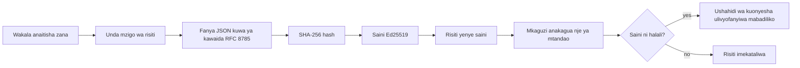
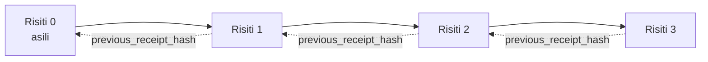

[Tazama video ya somo: Kuweka Salama Maajenti wa AI kwa Kupokea kwa Kificho cha Kriptografia](https://youtu.be/PLACEHOLDER_VIDEO_ID)

> _(Video ya somo na picha ya kichwa itatolewa na timu ya maudhui ya Microsoft baada ya mchanganyiko, ikifuatana na mfano wa somo la 14 / 15.)_

# Kuweka Salama Maajenti wa AI kwa Kupokea kwa Kificho cha Kriptografia

## Utangulizi

Somo hili litahusu:

- Kwanini nyaraka za ukaguzi kwa maajenti wa AI zinahitajika kwa uzingatiaji, utatuzi wa matatizo, na uaminifu.
- Kupokea kwa kificho cha kriptografia ni nini na kinatofautianaje na mstari wa kumbukumbu usiosainiwa.
- Jinsi ya kutengeneza risiti iliyo sainiwa kwa simu ya chombo cha maajenti kwa Python waziwazi.
- Jinsi ya kuangalia risiti isiyounganishwa na kugundua mabadiliko.
- Jinsi ya kuunganisha risiti ili kuondoa au kubadilisha mpangilio wa moja kuvunja mlolongo.
- Nini risiti zinaonyesha na nini hazionyeshi waziwazi.

## Malengo ya Kujifunza

Baada ya kumaliza somo hili, utajua jinsi ya:

- Kubaini aina za kushindwa zinazochochea asili ya kriptografia kwa vitendo vya maajenti.
- Kutengeneza risiti iliyosainiwa na Ed25519 juu ya mzigo wa JSON wa kawaida.
- Kuangalia risiti kwa usaidizi wa kipekee kwa kutumia funguo ya umma ya msaini.
- Kugundua mabadiliko kwa kutumia tena ukaguzi kwa risiti iliyobadilishwa.
- Kujenga mlolongo wa risiti zilizoambatanishwa kidhahabu na kueleza kwanini mlolongo ni muhimu.
- Kutambua kikomo kati ya kile risiti zinachothibitisha (sifa, uadilifu, mpangilio) na kile hazithibitishi (usahihi wa kitendo, sauti ya sera).

## Tatizo: Njia ya Ukaguzi ya Mjaaji Wako

Fikiria umepeleka ajenti wa AI kwa Contoso Travel. Ajenti husoma maombi ya wateja, huaitisha API ya ndege kutafuta chaguzi, na kuwaruhusu wateja kuweka tiketi. Robo ya mwisho, ajenti iliendesha bookings 50,000.

Leo mkaguzi anafika. Anauliza swali rahisi: "Nionyeshe kile ajenti wako alifanya."

Unawapa faili zako za kumbukumbu. Mkaguzi anazitazama na kuuliza swali gumu: "Nifanyeje nijue kumbukumbu hizi hazijabadilishwa?"

Hili ndilo tatizo la njia ya ukaguzi. Mepangwa mengi ya maajenti leo hutegemea:

- **Marekodi ya programu**: yaliyoandikwa na ajenti mwenyewe, yanayoweza kubadilishwa na mtu yeyote mwenye upatikanaji wa mfumo wa faili.
- **Huduma za kumbukumbu za wingu**: zinadhihirika kuwa hazijabadilishwa kwenye ngazi ya jukwaa lakini tu ikiwa mkaguzi anaamini mwendeshaji wa jukwaa.
- **Marekodi ya muamala wa hifadhidata**: yanatosha kwa mabadiliko ya hifadhidata lakini si kwa simu yoyote ya chombo.

Hakuna kati ya hizi zinazoweza kujibu swali la mkaguzi bila kuhitaji imani ya mkaguzi kwa mtu fulani (wewe, mtoa huduma wa wingu, muuzaji wa hifadhidata). Kwa matumizi ya ndani, imani hiyo mara nyingi ni sawa. Kwa kazi zinazodhibitiwa (fedha, afya, chochote chini ya sheria ya AI ya EU), haiwezi.

Risiti za kriptografia hutatua hili kwa kufanya kila kitendo cha ajenti kiwe na uhakiki huru. Mkaguzi haitaji kuamini wewe. Wanahitaji tu funguo yako ya umma na risiti yenyewe.

## Risiti ya Kificho cha Kriptografia ni Nini?

Risiti ni kitu cha JSON kinachoandika kile ajenti alifanya, kilichosainiwa kwa saini ya kidijitali.


```mermaid
flowchart LR
    A[Wakala anaitisha zana] --> B[Unda mzigo wa risiti]
    B --> C[Fanya JSON kuwa ya kawaida RFC 8785]
    C --> D[SHA-256 hash]
    D --> E[Saini Ed25519]
    E --> F[Risiti yenye saini]
    F --> G[Mkaguzi anakagua nje ya mtandao]
    G --> H{Saini ni halali?}
    H -- yes --> I[Ushahidi wa kuonyesha ulivyofanyiwa mabadiliko]
    H -- no --> J[Risiti imekataliwa]
```

Risiti ndogo inaonekana hivi:

```json
{
  "type": "agent.tool_call.v1",
  "agent_id": "contoso-travel-bot",
  "tool_name": "lookup_flights",
  "tool_args_hash": "sha256:a3f9c1...",
  "result_hash": "sha256:7b2e1d...",
  "policy_id": "contoso-travel-policy-v3",
  "timestamp": "2026-04-25T14:30:00Z",
  "sequence": 47,
  "previous_receipt_hash": "sha256:9d4e6a...",
  "signature": {
    "alg": "EdDSA",
    "sig": "c5af83...",
    "public_key": "8f3b2c..."
  }
}
```

Mali tatu zinafanya kazi:

1. **Saini**. Risiti imesainiwa na mlango wa ajenti kwa kutumia funguo binafsi ya Ed25519. Mtu yeyote mwenye funguo ya umma inayolingana anaweza kuthibitisha saini kwa njia isiyo mtandao. Kusaliti sehemu yoyote kunavunja saini.

2. **Uandishi wa kawaida**. Kabla ya kusaini, risiti huandikwa kwa kutumia Mpango wa Kuweka JSON Kwa Kawaida (JCS, RFC 8785). Hii inahakikisha utekelezaji mbili zinazotengeneza risiti sawa zina matokeo sawa kabisa. Bila kawaida, watoaji tofauti wa JSON wangetengeneza saini tofauti kwa maudhui sawa.

3. **Kuunganisha kwa hash**. Sehemu ya `previous_receipt_hash` inaunganisha kila risiti kwa ile kabla yake. Kuondoa au kubadilisha mpangilio wa risiti kunavunja risiti zote zilizofuata. Kusaliti kuonekana kwa kiwango cha mlolongo hata kama saini binafsi zilivunjika.

Pamoja mali hizi tatu zinatoa dhamana tatu:

- **Sifa**: funguo hii ilisaini maudhui haya.
- **Uadilifu**: maudhui hayajabadilika tangu kusainiwa.
- **Mpangilio**: risiti hii ilifuata risiti ile kwenye mlolongo.

## Kutengeneza Risiti kwa Python

Huhitaji maktaba maalum kutengeneza risiti. Msingi wa kificho cha kriptografia upo kwa wingi na mantiki ni mistari michache ya Python.

Mazoezi ya vitendo katika `code_samples/18-signed-receipts.ipynb` huonyesha mchakato mzima. Muhtasari:

```python
import json
import hashlib
import base64
from nacl import signing
from jcs import canonicalize  # JSON ya RFC 8785 inayofuata kanuni

def b64url_nopad(data: bytes) -> str:
    return base64.urlsafe_b64encode(data).decode("ascii").rstrip("=")

def sha256_canonical(obj) -> str:
    """SHA-256 of a Python object's JCS-canonical JSON form."""
    return f"sha256:{hashlib.sha256(canonicalize(obj)).hexdigest()}"

# Tengeneza au pakua ufunguo wa kusaini (katika uzalishaji, hifadhi katika key vault)
signing_key = signing.SigningKey.generate()
verify_key = signing_key.verify_key

# Jenga mzigo wa risiti (bado hakuna saini)
tool_args = {"origin": "SYD", "destination": "LAX"}
tool_result = [{"flight": "QF11", "price": 1850, "stops": 0}]

payload = {
    "type": "agent.tool_call.v1",
    "agent_id": "contoso-travel-bot",
    "tool_name": "lookup_flights",
    "tool_args_hash": sha256_canonical(tool_args),
    "result_hash": sha256_canonical(tool_result),
    "policy_id": "contoso-travel-policy-v3",
    "timestamp": "2026-04-25T14:30:00Z",
    "sequence": 0,
    "previous_receipt_hash": None,
}

# Fanya kuwa kanuni, fupisha, sainisha.
canonical_bytes = canonicalize(payload)
message_hash = hashlib.sha256(canonical_bytes).digest()
signature_bytes = signing_key.sign(message_hash).signature

# Ambatanisha kitu cha saini kilicho na muundo.
receipt = {
    **payload,
    "signature": {
        "alg": "EdDSA",
        "sig": b64url_nopad(signature_bytes),
        "public_key": b64url_nopad(bytes(verify_key)),
    },
}
```

Huo ndio mchakato mzima wa kusaini. Mazoezi kwenye daftari huonyesha kila hatua.

## Kuangalia Risiti na Kugundua Mabadiliko

Ukaguzi ni kinyume cha mchakato:

```python
import base64
import hashlib
from nacl import signing
from nacl.exceptions import BadSignatureError
from jcs import canonicalize

def b64url_decode(s: str) -> bytes:
    padding = "=" * ((4 - len(s) % 4) % 4)
    return base64.urlsafe_b64decode(s + padding)

def verify_receipt(receipt: dict) -> bool:
    # Saini ni kitu kilichoandaliwa: {"alg", "sig", "public_key"}.
    sig_obj = receipt.get("signature")
    if not sig_obj or sig_obj.get("alg") != "EdDSA":
        return False

    # Jenga tena mzigo ambao ulisainiwa kwa kweli (yote isipokuwa saini).
    payload = {k: v for k, v in receipt.items() if k != "signature"}

    canonical_bytes = canonicalize(payload)
    message_hash = hashlib.sha256(canonical_bytes).digest()

    try:
        verify_key = signing.VerifyKey(b64url_decode(sig_obj["public_key"]))
        verify_key.verify(message_hash, b64url_decode(sig_obj["sig"]))
        return True
    except BadSignatureError:
        return False
```

Kazi hii inachukua risiti na kurudisha `True` ikiwa saini ni halali, `False` vinginevyo. Hakuna wito wa mtandao, hakuna utegemezi wa huduma, hakuna imani inayohitajika kwa mtu wa tatu.

Kuona kugundua mabadiliko kazi, daftari linaonyesha:

1. Kutengeneza risiti halali na kuthibitisha inaenda sawa.
2. Kubadilisha kibajeti kimoja cha sehemu ya `tool_args_hash`.
3. Kufanya tena ukaguzi na kuona linashindwa.

Hii ni onyesho la vitendo kwamba risiti zinaonyesha mabadiliko: mabadiliko yoyote, hata madogo, huvunja saini.

## Kuunganisha Risiti kwa Maajenti wa Hatua Nyingi

Risiti moja iliyosainiwa inalinda kitendo kimoja. Mlolongo wa risiti hulininda mfululizo.


```mermaid
flowchart LR
    R0[Risiti 0<br/>asili] --> R1[Risiti 1]
    R1 --> R2[Risiti 2]
    R2 --> R3[Risiti 3]
    R1 -. previous_receipt_hash .-> R0
    R2 -. previous_receipt_hash .-> R1
    R3 -. previous_receipt_hash .-> R2
```

Kila risiti inarekodi hash ya risiti iliyotangulia. Kuondoa risiti ya 2 kimya kimya, mwovu anahitaji:

- Kubadilisha sehemu ya `previous_receipt_hash` ya risiti 3 (huvunja saini ya risiti 3), AU
- Kutengeneza saini mpya kwa risiti 3 iliyobadilishwa (inahitaji funguo binafsi ya ajenti).

Ikiwa funguo binafsi iko kwenye sanduku la funguo la vifaa na unachapisha funguo ya umma na kila risiti, hakuna shambulio linapatikana bila kugunduliwa.

Daftari linaonyesha:

1. Kujenga mlolongo wa risiti tatu.
2. Kuangalia kila risiti `previous_receipt_hash` inalingana na hash halisi ya risiti iliyotangulia.
3. Kubadilisha risiti moja katikati na kuona mlolongo huvunjika hapo hasa.

Hivi ndivyo unavyotengeneza njia ya ukaguzi mkaguzi wa nje anaweza kuangalia bila kuamini wewe.

## Kinachothibitishwa na Risiti (na Kinachotoki)

Huu ni sehemu muhimu zaidi ya somo hili. Risiti ni zenye nguvu lakini nguvu yao ina mipaka.

**Risiti zinathibitisha mambo matatu:**

1. **Sifa**: funguo fulani ilisaini mzigo fulani.
2. **Uadilifu**: mzigo haujabadilika tangu kusainiwa.
3. **Mpangilio**: risiti hii ilikuja baada ya risiti ile katika mlolongo wa hash.

**Risiti HAZIthibitishi:**

1. **Usahihi**: kitendo cha ajenti kilikuwa cha sahihi. Risiti inaweza kusainiwa kwa jibu lisilo sahihi vile vile kama jibu sahihi.
2. **Uzingatiaji wa sera**: sera iliyoangaziwa katika `policy_id` ilikaguliwa kweli, au ingekuwa imeruhusu kitendo hiki ikiwa ingeangaliwa. Risiti zinarekodi kile kilichodaiwa, si kile kilichetekelezwa.
3. **Utambulisho zaidi ya funguo**: risiti inasema "funguo hii ilisaini maudhui haya." Haitoi uhakika kwamba "binadamu huyu alikubali." Kuunganisha funguo na mtu au shirika kunahitaji miundombinu ya utambulisho tofauti (katika, rejista ya funguo za umma, nk).
4. **Ukweli wa pembejeo**: ikiwa ajenti anapokea maelekezo yaliyobadilishwa na kutenda, risiti inarekodi kitendo kwa uaminifu. Risiti ni mwisho wa uthibitishaji wa pembejeo, si mbadala wake.

Mipaka hii ni muhimu kwa sababu mbili:

- Inakuambia kwa nini risiti zinatumika: kufanya tabia ya ajenti iweze kukaguliwa na ionekane ikiwa imebadilishwa, hata kupitia mipaka ya mashirika.
- Inakuambia tabaka za ziada unazohitaji: uthibitishaji wa pembejeo (Somo 6), utekelezaji wa sera (uliyofunuliwa kwa kifupi hapa chini), na miundombinu ya utambulisho (si sehemu ya somo hili).

Makosa ya kawaida ni kudhani "tuna risiti" maana "tuna utawala." Sio hivyo. Risiti ni msingi. Utawala ni mfumo unaoijenga juu yake.

## Marejeleo ya Uzalishaji

Msimbo wa Python katika somo hili ni mdogo makusudi ili usome kila mstari na kuelewa kinachoendelea. Katika utengenezaji, una chaguzi mbili:

1. **Jenga moja kwa moja juu ya msingi wa kificho cha kriptografia.** Mistari 50 uliyoiona hapo juu inatosha kwa matumizi mengi. PyNaCl (Ed25519) na kifurushi cha `jcs` (JSON ya kawaida) ni maktaba zinazotunzwa vizuri na zilizopitiwa.

2. **Tumia maktaba ya risiti ya uzalishaji.** Miradi kadhaa ya chanzo huru hufuata mfano ule ule na vipengele vya ziada (mdundo wa funguo, ukaguzi wa kundi, usambazaji wa JWK Set, ushirikiano na injini za sera):
   - Muundo wa risiti unaotumika katika somo hili unafuata Rasimu ya IETF ya Mtandao (`draft-farley-acta-signed-receipts`) ambayo iko katika mchakato wa viwango sasa.
   - Kikasha cha Usimamizi wa Maajenti cha Microsoft kinaunganisha risiti na maamuzi ya sera ya Cedar; angalia Mafunzo 33 kwenye hifadhi hiyo kwa mfano wa mwisho hadi mwisho.
   - Vifurushi `protect-mcp` (npm) na `@veritasacta/verify` (npm) vinatoa utekelezaji wa Node wa kusaini risiti na ukaguzi wa nje, kwa lengo la kufunika seva yoyote ya MCP na njia ya ukaguzi isiyotakikana.
   - **[nobulex](https://github.com/arian-gogani/nobulex)** SDK ya Python (`pip install nobulex`) hutoa mfano ule ule wa kusaini wa Ed25519 + JCS ndani ya Python pamoja na ushirikiano wa LangChain na CrewAI, ikiwa ni pamoja na vigezo vya upimaji vya kusambazwa na ramani za ulinganifu wa ufanisi zilizoanzishwa kupitia [OWASP PR #2210](https://github.com/OWASP/CheatSheetSeries/pull/2210).

Uamuzi kati ya kutengeneza mwenyewe na kutumia maktaba ni kama uamuzi kati ya kuandika maktaba yako ya JWT na kutumia moja iliyojaribiwa: zote ni halali; maktaba huokoa muda na kupunguza eneo la ukaguzi; njia ya kuanzia mwanzo inakufanya uelewe kila msingi. Somo hili linakufundisha njia ya kuanzia mwanzo ili uwe na msingi wa chaguo lolote.

## Mtihani wa Maarifa

Jaribu kuelewa kabla ya kuendelea na zoezi la vitendo.

**1. Risiti imesainiwa na funguo binafsi ya Ed25519 ya ajenti. Mkaguzi ana funguo ya umma tu. Je, mkaguzi anaweza kuthibitisha risiti isiyo mtandaoni?**

<details>
<summary>Jibu</summary>

Ndiyo. Ukaguzi wa Ed25519 unahitaji tu funguo ya umma na baiti zilizotiwa saini. Hakuna wito wa mtandao, hakuna utegemezi wa huduma. Hii ni sifa inayofanya risiti zifae katika mazingira ya kuwekwa kivyake, mashirika mengi, au ukaguzi wa imani ndogo.
</details>

**2. Mwovu anabadilisha sehemu ya `policy_id` ya risiti kudai kuwa ilikuwa chini ya sera iliyo na ruhusa zaidi. Saini ilikuwa juu ya mzigo wa awali. Nini hutokea wakati wa ukaguzi?**

<details>
<summary>Jibu</summary>

Ukaguzi unashindwa. Saini ilihesabiwa juu ya baiti za kawaida za mzigo wa awali; kubadilisha sehemu yoyote kunabadilisha baiti za kawaida, kunabadilisha hash ya SHA-256, na kufanya saini kuwa batili. Mwovu angenahitaji funguo binafsi kutengeneza saini mpya halali, ambayo hana.
</details>

**3. Kwa nini risiti inajumuisha `tool_args_hash` na `result_hash` badala ya hoja na matokeo halisi?**

<details>
<summary>Jibu</summary>

Sababu mbili. Kwanza, risiti inaweza kuhifadhiwa au kusambazwa katika mazingira ambapo kufichua maudhui halisi (taarifa za binafsi, data za biashara) ni tatizo. Kuchapa hash huwa fupi na binafsi maudhui; mkaguzi anathibitisha kama hash inalingana na nakala zilizohifadhiwa kando za maudhui halisi. Pili, hash zina ukubwa thabiti; risiti na hash inakuwa na ukubwa thabiti bila kujali ukubwa wa pembejeo na matokeo.
</details>

**4. Sehemu ya `previous_receipt_hash` inaunganisha risiti moja kwa ile inayotangulia. Ikiwa mwovu analitokoma risiti moja katikati ya mlolongo kimya kimya, nini hubatilika?**

<details>
<summary>Jibu</summary>

Kila risiti iliyofuata iliyotokomewa. Sehemu zao za `previous_receipt_hash` hazilingani tena na mlolongo halisi (kwa sababu risiti walizorejelea haina au mlolongo sasa unaonyesha mwanzilishi mwingine). Kuficha uondoshaji, mwovu ingetakiwa kusaini tena risiti zote zilizofuata, ambayo inahitaji funguo binafsi.
</details>

**5. Risiti inathibitishwa safi. Je, hii inathibitisha kitendo cha ajenti kilikuwa sahihi, salama, au kimefuata sera?**

<details>
<summary>Jibu</summary>

Hapana. Risiti halali zinathibitisha mambo matatu: sifa (funguo hii ilisaini maudhui), uadilifu (maudhui hayajabadilika), na mpangilio (risiti hii ilifuata ile). HAZITHIBITISHI ikiwa kitendo kilikuwa sahihi, ikiwa sera iliyoorodheshwa `policy_id` ilikaguliwa kweli, au ikiwa ajenti alifuata kila sheria. Risiti hufanya tabia ya ajenti iweze kukaguliwa, si lazima iwe sahihi. Huu ndio ukomo muhimu zaidi katika somo.
</details>

## Zoezi la Vitendo

Fungua `code_samples/18-signed-receipts.ipynb` na kamilisha sehemu zote nne:

1. **Sehemu ya 1**: Saini risiti yako ya kwanza na ithibitishe.
2. **Sehemu ya 2**: Badilisha risiti na kuona ukaguzi unashindwa.
3. **Sehemu ya 3**: Jenga mlolongo wa risiti tatu na thibitisha uadilifu wa mlolongo.
4. **Sehemu ya 4**: Tumia mfano huu kwa ajenti aliyojengwa na Microsoft Agent Framework: funika simu ya chombo na usaini risiti, kisha thibitisha risiti kihuru.


**Changamoto ya kutanua 1:** ongeza skimu ya risiti kwa uwanja mwingine wa ziada uliouchagua mwenyewe (kwa mfano, ID ya ombi kwa ajili ya ufuatiliaji), sasisha mantiki ya kuandika saini ya kawaida ili kuingiza uwanja huo, na thibitisha kuwa risiti bado inazunguka kupitia uthibitisho. Kisha badilisha uwanja baada ya kusaini na thibitisha uthibitisho unashindwa. Hii inakulazimisha kuelewa jinsi kila baiti ya usimbaji wa kawaida unavyosaidia kwa saini.

**Changamoto ya kutanua 2:** Futia SHA-256 risiti mbili za wewe pamoja (unganisha baitis zao za kawaida kwa mpangilio wa kideterministi) na ingiza muhtasari unaotokana kama uwanja mpya kwenye risiti ya tatu kabla ya kuiandika saini. Thibitisha kuwa risiti zote tatu bado zinaweza kuzunguka kwa uthibitisho. Hii ni hatua moja ya uthibitisho wa ujumuishaji: yeyote anayeenda risiti ya tatu anaweza kuthibitisha kuwa risiti mbili za kwanza zilikuwepo wakati ziliposainiwa, bila haja ya kufichua maudhui yao. Hii ndiyo mfano unaotumiwa kwa risiti za ufunuo wa kuchagua kwa wingi (vizuizi vya Merkle, RFC 6962).

## Hitimisho

Risiti za usimbaji hutoa mawakala wa AI njia ya ukaguzi ambayo ni:

- **Inayoweza kuthibitishwa kwa uhuru**: upande wowote mwenye ufunguo wa umma anaweza kuthibitisha, bila utegemezi wa huduma.
- **Inaonyesha uharifu**: mabadiliko yoyote huharibu saini.
- **Kubebeka**: risiti ni faili ndogo ya JSON; inaweza kuhifadhiwa, kutumwa, na kuthibitishwa popote.
- **Inayolingana na viwango**: imejengwa juu ya Ed25519 (RFC 8032), JCS (RFC 8785), na SHA-256, vituo vilivyotumika sana.

Hazibadilishi uhakiki wa pembejeo, utekelezaji wa sera, au miundombinu ya utambulisho. Ni msingi wa tabaka hizo. Unapowaingiza mawakala katika mzigo wa kazi uliofisadiwa, mchakato wa mashirika mengi, au mazingira yoyote ambapo mkaguzi wa baadaye hawezi kudhaniwa kukuamini, risiti ndizo njia unazotumia kufanya njia ya ukaguzi kuwa ya uaminifu.

Suala muhimu zaidi: risiti zinathibitisha nani alisema nini na lini. Hazithibitishi kwamba kilichosemwa ni kweli au sawa. Shikilia tofauti hiyo kwa karibu. Hii ni tofauti kati ya mfumo wa asili wa uaminifu na ule unaotengeneza udanganyifu.

## Orodha ya Ukaguzi wa Uzalishaji

Unapokuwa tayari kuondoka darasani na kuanzisha mawakala waliotiwa saini na risiti katika mazingira halisi:

- [ ] **Hamisha ufunguo wa kusaini kutoka kwenye kompyuta mpakato ya mpango.** Tumia Azure Key Vault, AWS KMS, au kifaa cha usalama cha vifaa. Ufufuaji wa kibinafsi unayeandika saini risiti zako haupaswi kamwe kuishi katika udhibiti wa chanzo au wazi katika mashine za programu.
- [ ] **Chapisha ufunguo wa umma wa uthibitisho.** Wakurungu wanahitaji ili kuthibitisha nje ya mtandao. Mfano halisi ni Seti ya JWK kwenye URL inayojulikana (RFC 7517), mfano, `https://your-org.example.com/.well-known/agent-keys.json`.
- [ ] **Funga mnyororo nje.** Mara kwa mara andika kichwa cha mnyororo cha hivi karibuni kwenye kumbukumbu za uwazi (Sigstore Rekor, RFC 3161 mamlaka ya wakati, au mfumo wa ndani wa pili) ili mtu wa nje athibitishe "huyu mnyororo ulikuwepo wakati huu."
- [ ] **Hifadhi risiti bila mabadiliko.** Hifadhi ya data inayoongezwa tu (Azure Storage yenye sera za kutoshindwa kubadilika, AWS S3 Object Lock) huzuia mtu wa ndani kurekebisha historia katika tabaka la hifadhi.
- [ ] **Amua kuhusu uhifadhi.** Mifumo mingi ya ufuataji wa sera huhitaji uhifadhi wa miaka mingi. Panga ukuaji wa risiti (kila risiti ni ~500 baitis; wakala anayetengeneza simu 10K kwa siku hutengeneza ~1.8 GB kwa mwaka).
- [ ] **Andika nini risiti hazifunki.** Risiti zinathibitisha utambulisho, uadilifu, na upangaji. Kitabu chako cha mwendo kinapaswa kuorodhesha kwa wazi udhibiti wa ziada (uhakiki wa pembejeo, utekelezaji wa sera, kuwekwa viwango vya mwendo, miundombinu ya utambulisho) unaoambatana na risiti katika sera yako ya utawala.

### Una Maswali Zaidi Kuhusu Usalama wa Wakala wa AI?

Jiunge na [Microsoft Foundry Discord](https://aka.ms/ai-agents/discord) kukutana na wanafunzi wengine, kuhudhuria saa za ofisi, na kupata majibu ya maswali yako ya Wakala wa AI.

## Zaidi ya Darasa Hili

Darasa hili linashughulikia kusaini risiti moja na mnyororo wa hash. Vituo hivyo vya msingi vinaweza kutumika kuunda mifumo mingi ya hali ya juu utakayokutana nayo wakati utakapokuwa umesheheni sera yako ya utawala:

- **Ufunuo wa kuchagua.** Wakati viwanja vya risiti vinapojitolea kwa uhuru (mti wa Merkle wa mtindo wa RFC 6962), unaweza kufichua viwanja maalum kwa wakaguzi maalum na kuthibitisha vingine havijabadilika bila kutoa yote. Inatunza wakati huo risiti ile ile inatakiwa kufanikisha ukaguzi mpana (ambao unataka ukamilifu) na kanuni za kupunguza data kama GDPR (ambao wanataka mkaguzi aone kidogo iwezekanavyo).
- **Kuondolewa kwa risiti.** Ikiwa ufunguo wa kusaini umetapeliwa, unahitaji njia ya kuweka alama risiti zote zilizotiwa saini na ufunguo huo kama zisizoaminika kuanzia wakati fulani. Vifungo vya kawaida: funguo za kusaini za muda mfupi pamoja na orodha ya kuondolewa iliyochapishwa, au kumbukumbu wazi yenye maingizo ya kuondolewa.
- **Risiti za pande zote / saini iliyogawanywa.** Baadhi ya utekelezaji hugawanya mzigo uliosainiwa katika sehemu za kabla ya utekelezaji (`authorization_*`) na baada ya utekelezaji (`result_*`) zenye saini za uhuru, zenye manufaa wakati uamuzi wa kibali na matokeo yaliyoshuhudiwa hutolewa na wahusika tofauti au kwa nyakati tofauti. Hii huongezwa juu ya muundo wa risiti uliofundishwa katika darasa hili.
- **Muundo wa mzigo.** Risiti inaweka msimbo wowote ulioweka katika `result_hash`. Mizigo halisi mara nyingi huwa tajiri zaidi kuliko matokeo ya simu moja ya chombo: hoja kabla ya uamuzi (ubashiri wa mfano, chaguzi zilizoangaliwa, ushahidi na ukamilifu wake, mtizamo wa hatari, mnyororo wa uwajibikaji, matokeo ya lango) yote yanaweza kuwepo ndani ya mzigo, ikiwa imefungwa na risiti moja. Hii huhifadhi muundo wa risiti mdogo huku kuruhusu skimu za mzigo kuendelea kukuwa kulingana na maeneo.
- **Ulinganifu wa utekelezaji mwingi.** Utekelezaji wa kujitegemea zaidi ya moja wa muundo huo huo wa risiti (Python, TypeScript, Rust, Go) hupitia uthibitisho dhidi ya vizee vya mtihani vilivyoshirikiwa. Ikiwa utajenga utekelezaji wako mwenyewe, kuhalalisha dhidi ya vizee vilivyochapishwa kunathibitisha ushirikiano wa waya.
- **Uhamisho wa baada ya quantum.** Ed25519 inatumiwa sana leo lakini si kinga dhidi ya quantum. Muundo wa risiti ni wa hali ya juu wa algoriti: uwanja `signature.alg` unaweza kubeba `ML-DSA-65` (viwango vya saini vya baada ya quantum vya NIST) wakati unahitaji kuhama. Panga kipindi cha mpito ambapo risiti zinatiwa saini mara mbili.

## Rasilimali Zaidi

- <a href="https://datatracker.ietf.org/doc/draft-farley-acta-signed-receipts/" target="_blank">IETF Internet-Draft: Signed Decision Receipts for Machine-to-Machine Access Control</a>
- <a href="https://learn.microsoft.com/azure/ai-studio/responsible-use-of-ai-overview" target="_blank">Muhtasari wa AI yenye uwajibikaji (Azure AI)</a>
- <a href="https://datatracker.ietf.org/doc/html/rfc8032" target="_blank">RFC 8032: Edwards-Curve Digital Signature Algorithm (EdDSA)</a>
- <a href="https://datatracker.ietf.org/doc/html/rfc8785" target="_blank">RFC 8785: Mpangilio wa Ukanuni wa JSON (JCS)</a>
- <a href="https://datatracker.ietf.org/doc/html/rfc6962" target="_blank">RFC 6962: Uwafikishaji wa Cheti</a> (ujenzi wa mti wa Merkle unaotumiwa na risiti za ufunuo wa kuchagua)
- <a href="https://github.com/microsoft/agent-governance-toolkit/blob/main/docs/tutorials/33-offline-verifiable-receipts.md" target="_blank">Mfumo wa Usimamizi wa Wakala wa Microsoft, Mafunzo 33: Risiti za Uamuzi Zinazothibitishwa Nje ya Mtandao</a>
- <a href="https://github.com/ScopeBlind/agent-governance-testvectors" target="_blank">Vektori za mtihani wa ulinganifu wa utekelezaji kwa muundo wa risiti unaotumiwa katika darasa hili (Apache-2.0)</a>
- <a href="https://pynacl.readthedocs.io/" target="_blank">Nyaraka za PyNaCl</a> (Ed25519 katika Python)

## Darasa lililotangulia

[Kujenga Mawakala wa Matumizi ya Kompyuta (CUA)](../15-browser-use/README.md)

---

<!-- CO-OP TRANSLATOR DISCLAIMER START -->
**Kionyozo**:
Hati hii imetafsiriwa kwa kutumia huduma ya tafsiri ya AI [Co-op Translator](https://github.com/Azure/co-op-translator). Ingawa tunajitahidi kupata usahihi, tafadhali fahamu kwamba tafsiri za kiotomatiki zinaweza kuwa na makosa au upungufu wa usahihi. Hati ya asili katika lugha yake halisi inapaswa kuchukuliwa kama chanzo cha mamlaka. Kwa taarifa muhimu, tafsiri ya kitaalamu inayofanywa na binadamu inapendekezwa. Hatutojibu kwa kuelewa vibaya au tafsiri potofu zinazotokea kutokana na matumizi ya tafsiri hii.
<!-- CO-OP TRANSLATOR DISCLAIMER END -->